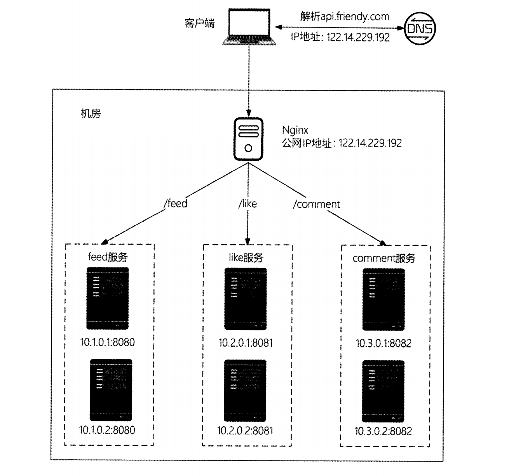
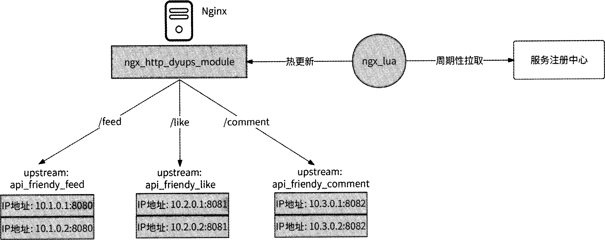

```text
worker_processes 3;// 启动3个worker进程处理请求，不是越多越好，一般=cpu核数

events {
    worker_connections 1024;//每个worker最多1024个链接，总并发上限=3x1024
}

http {
    keepalive_timeout 60;// http长链接保持60s

    upstream api_friendy_feed { //upstream的作用：定义一组服务器（负载均衡），默认策略是轮询
        server 10.1.0.1:8080;
        server 10.1.0.2:8080;
    }

    upstream api_friendy_like {
        server 10.2.0.1:8081;
        server 10.2.0.2:8081;
    }

    upstream api_friendy_comment {
        server 10.3.0.1:8082;
        server 10.3.0.2:8082;
    }

    server {
        listen 80;//nginx自己的端口
        server_name api.friendy.com;//匹配域名。 匹配逻辑：api.friendy.com/feed → location /feed

        location /feed {
           c http://api_friendy_feed;
        }

        location /like {
            proxy_pass http://api_friendy_like; // http:// → 使用 HTTP 反向代理模块 api_friendy_feed → upstream 名称
        }

        location /comment {
            proxy_pass http://api_friendy_comment;
        }
    }
}
```
综上，，Nginx服务器先以80端口启动对外服务，当收到请求头Host为api.friendy.com的HTTP请求后，根据请求的HTTP URL相对路径做进一步处理。

nginx常见负载均衡策略如下：
1. 轮询：将每个请求按时间顺序逐一分配到不同的后端服务器，如果某后端服务器司机，自动剔除鼓掌系统。这是nginx的默认策略。
2. 加权轮询：为服务器实例配置引入访问权重（weight），权重越大的服务器实例越容易被访问。例如，在如下服务池配置中，为每个服务器实例设置了不同的权重。
```text
upstream backend (
server 192.168.1.5:80 weight=10;
server 192.168.1.6:81 weight=l;
server 192.168.1.7:82 weight-3;
}
```

# 服务注册与发现
Nginx服务器需要将每个业务服务的网络地址设置在nginx.conf配置文件中，才能实现与业务服务的通信。但是业务服务会频繁地迭代与扩容，这意味着Nginx upstream服务池中的服务器实例地址列表会频繁地变更。频繁地更新nginx.conf配置文件并不现实，所以我们需要找到一种Nginx实时感知业务服务地址列表变更的方案。

1. ngx lua:这个模块将Lua语言嵌入Nginx,从而允许开发人员编与Lua脚本并部署到Nginx中执行
2. ngx_http_dyups_module:这个模块使得Nginx不用重新启动就能热更新upstream配置并生效。
具体：
每隔一段时间(如3s)就从服务注册中心获取一次nginx.conf配置文件中所有upstream配置的服务地址列表。
获取服务地址列表成功，生成最新的upstream配置，通过ngx_http_dyups_module模块将其更新到Nginx工作进程中。


# nginx作为业务服务器反向代理有如下优势

| 序号 | 优势说明 |
|------|---------|
| 1 | DNS 服务器指向 Nginx 服务器，业务服务器网络地址切换无须配置 DNS |
| 2 | 在用户请求和业务服务器之间实现了负载均衡，更便于控制业务服务流量调度 |
| 3 | 对外只暴露一个公网 IP 地址，节约了有限的 IP 资源。Nginx 服务器与业务服务器之间通过内网通信 |
| 4 | 对业务服务器起到了保护作用，外网看不到业务服务器，只能看到不涉及业务逻辑的反向代理服务器 |
| 5 | 增强了系统的可扩展性，业务服务器扩容能做到准实时生效 |
| 6 | 提高了业务服务器的可用性。任何一个业务服务实例挂掉，Nginx 都可以将用户请求迁移到其他服务实例 |

> 来源章节：**1.4 接入层的技术演进**
