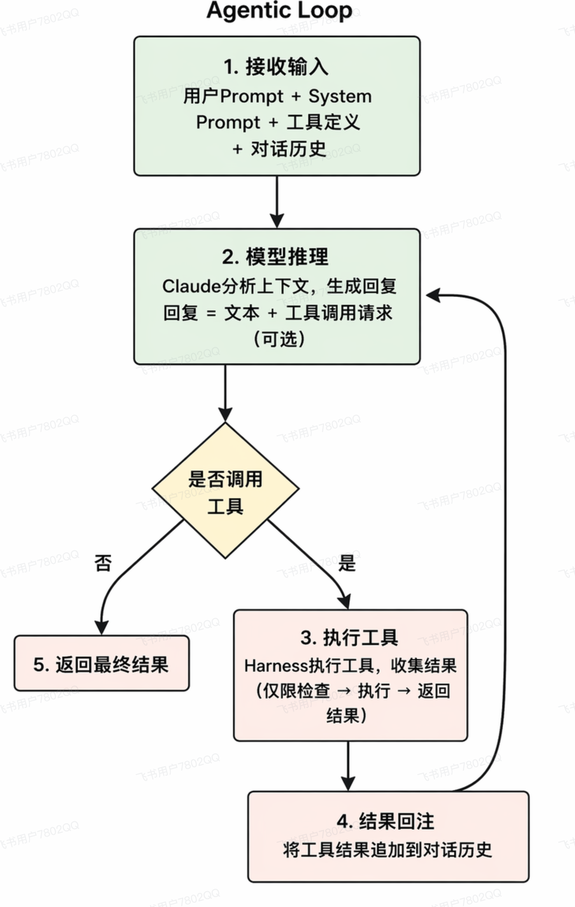

# react是什么
```text
reason（思考）-> act（模型决定调用某个工具，并提供调用工具所需的参数） -> observation（执行工具后返回的真实结果） -> reason->...-> 完成任务
```
ReAct 是 Reasoning，也就是推理，和 Acting，也就是行动的结合。它的核心思想是让 Agent 把推理和行动交替进行：模型先判断下一步应该做什么，再通过工具采取行动，然后根据行动结果继续判断，而不是只依靠模型内部知识一次性生成答案。
这里的 Reason 主要包含两部分：一部分是规划，也就是分析当前任务、判断下一步应该做什么；另一部分是反思，也就是拿到工具执行结果以后，判断结果是否有效、任务是否已经完成，以及是否需要调整原来的计划。
Act 是采取行动。在现在的 Agent 系统中，通常表现为模型选择一个工具，并生成对应的调用参数。比如模型发现缺少实时信息，就可以调用搜索工具；需要验证代码，就可以调用代码执行工具。工具执行后，外部框架会把真实结果返回给模型。
在工程实现上，外部框架会把用户问题、历史消息和可用工具交给模型。模型如果认为需要调用工具，就返回结构化的 tool-call；框架负责执行工具，并把执行结果加入对话历史，再次调用模型。如果模型认为信息已经足够，就不再调用工具，而是直接返回普通文本答案，这时框架结束流程。
比如 DSH 的 ReactLoopAgent 就是这样实现的：模型负责推理、选择工具以及判断任务是否完成，外部框架负责执行工具、回传结果和维持整个循环。这样 Agent 就可以在执行过程中根据真实结果不断调整，而不是从一开始就固定一套计划执行到底。
# 如何实现
react作为一种策略，搭载到agent loop里


# react循环中，如何检测并跳出无效的“思考-行动”循环
## 检测--判断是否陷入无效循环
需要记录每一步的工具调用、参数、observation和任务状态。
分两类：
- 重复行为：相同工具和参数连续出现。比如dsh 默认按”工具名+规范化参数“统计连续重复次数，在3 5 8次触发提醒。不比较返回结果。
- 无有效进展：可以由harness的程序逻辑完成，也可由llm辅助判断，或者两者结合。#TODO

## 纠偏--改变当前策略，尝试继续完成任务
把已尝试的动作、返回结果和失败原因反馈给agent。dsh会向后续模型请求注入提醒，要求分析上次结果，选择不哦那个动作，不同参数，或在证据足够时结束。


## 设置硬性停止条件。在框架中设置最大步数、总耗时、token或费用预算

# 用户问题模糊或有歧义时，如何做澄清性对话
给agent提供一个澄清性工具：
1. 提示词约束：明确什么时候需要澄清
2. 模型判断：是否调用成清醒工具
3. 等待用户回答
4. 把答案作为工具结果，继续原任务