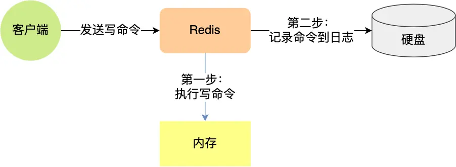
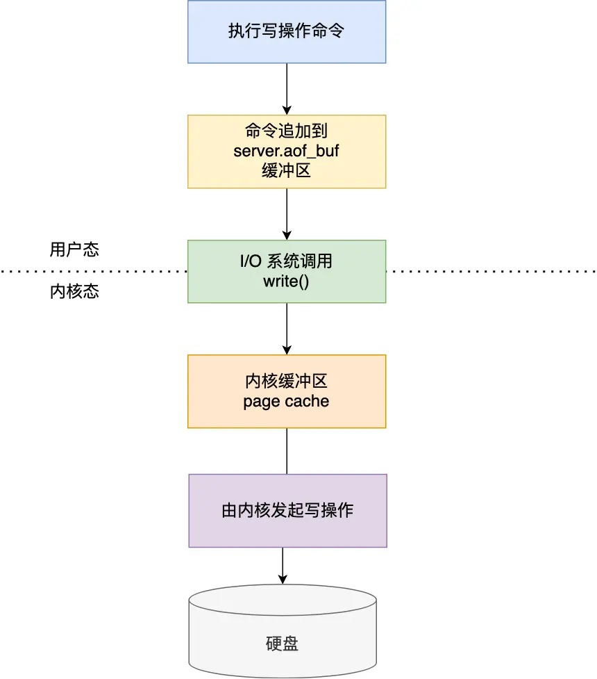

# AOF日志

如果 Redis 每执行一条写操作命令，就把该命令以追加的方式写入到一个文件里，然后重启 Redis 的时候。先去读取这个文件里的命令，并且执行它，这不就相当于恢复了缓存数据了吗？注意只会记录写操作命令，读操作命令是不会被记录的

# 风险
1. 执行写操作命令和记录日志是两个过程，那当 Redis 在还没来得及将命令写入到硬盘时，服务器发生宕机了，这个数据就会有丢失的风险。
2. 由于写操作命令执行成功后才记录到 AOF 日志，所以不会阻塞当前写操作命令的执行，但是可能会给「下一个」命令带来阻塞风险。（因为将命令写入到日志的这个操作也是在主进程完成的（执行命令也是在主进程）），如果在将日志内容写入到硬盘时，服务器的硬盘的 I/O 压力太大，就会导致写硬盘的速度很慢，进而阻塞住了，也就会导致后续的命令无法执行。

# 三种回写策略
redis写入aof日志的过程：

1. 执行写操作命令：比如你执行了 set name zhangsan。
2. 追加到 aof_buf 缓冲区：Redis 先把这条命令记到自己内存里的“小纸条”上（对应你脑子里记着）。
3. I/O 系统调用 write()：跨过虚线，从 Redis 自己地盘（用户态）进入操作系统地盘（内核态），把数据递给内核。
4. 内核缓冲区 page cache：内核接过来，先放自己口袋里（速度快，但还没真存好）。
5. 内核发起写操作 → 硬盘：最终真正落笔写到硬盘上。

redis提供了三种写会硬盘的恶略，对应上边步骤5
在redis.conf配置文件中的appendfsync配置项可以有以下3种参数可填
- always：每次写操作执行完之后，同步将aof日志写回硬盘。（最多丢一条、性能最差）
- everysec：每秒。意思是：每次执行完写操作之后，主线程先通过write()将命令写入到aof文件的内核缓冲区，然后由bio后台线程每隔一秒一步调用fsync()，把内核缓冲区内容协会到硬盘。（最多丢一秒）
- no：意味着不由redis控制写回硬盘的时机，由操作系统决定（可能丢很多）

# aof重写机制

