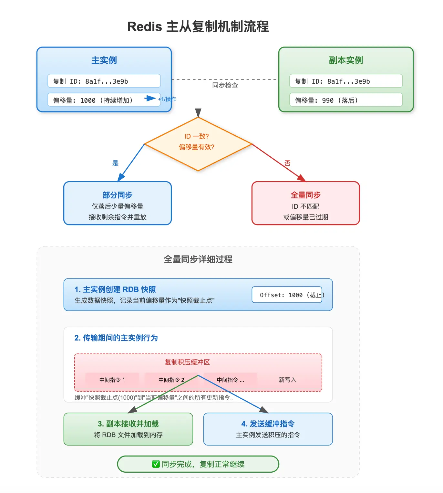

Redis 主从复制机制流程总结

一、初始状态与同步检查
• 主实例：复制 ID 为 8a1f...3e9b，偏移量为 1000（持续增加，+1/操作）。
• 副本实例：复制 ID 为 8a1f...3e9b，偏移量为 990（落后）。
• 决策判断：进行同步检查，核心判断条件为 “ID 一致？偏移量有效？”。

二、同步路径分支
根据判断结果分为两条路径：
1. 是（部分同步）：ID 一致且偏移量有效，仅落后少量偏移量，副本接收剩余指令并重放。
2. 否（全量同步）：ID 不匹配或偏移量已过期，触发全量同步。

三、全量同步详细过程
当触发全量同步时，执行以下 4 个步骤：
1. 主实例创建 RDB 快照：生成数据快照，记录当前偏移量作为“快照截止点”（Offset: 1000）。
2. 传输期间的主实例行为：通过复制积压缓冲区，缓冲“快照截止点(1000)”到“当前偏移量”之间的所有更新指令（包含中间指令与新写入）。
3. 副本接收并加载：将 RDB 文件加载到内存。
4. 发送缓冲指令：主实例发送积压的指令，补齐增量。
