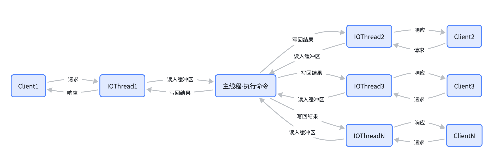

# 单线程为什么比双线程快？多线程有什么优劣势
| 对比维度 | 单线程 Redis | 多线程模型 |
|---|---|---|
| 上下文切换 | 无 | 每次切换 ~1-2μs |
| 锁竞争 | 无需加锁 | 需要锁机制 |
| CPU 缓存 | 缓存命中率高 | 线程切换导致缓存失效 |
| 实现复杂度 | 简单 | 复杂 |
| 单核性能 | 充分利用 | 可能分散 |
| 多核利用 | 无法利用 | 充分利用 |

redis的性能瓶颈是网络io和内存带宽，而不是cpu。单线程已经能跑满10w+qps，多线程的收益很小但复杂度大增。

# redis6.0多线程模型

| 阶段 | 6.0 之前 | 6.0 之后 |
|---|---|---|
| 网络读（socket read） | 主线程 | IO 线程池 |
| 命令解析 | 主线程 | IO 线程池 |
| 命令执行 | 主线程 | 仍是主线程 |
| 网络写（socket write） | 主线程 | IO 线程池 |

Redis 6.0 的多线程只用于网络 IO 的读写，命令执行永远是单线程的单线程的。这是为了保证原子性

