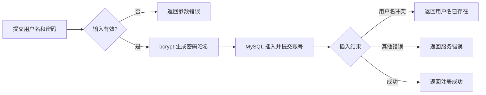

# 用户与认证模块设计

## 技术方案

- **分工**：Vue 3 展示页面，Go + Gin 处理请求。MySQL 保存账号资料，Redis 保存登录记录和当前账号状态。
- **注册**：先校验用户名和密码，用 bcrypt 生成密码哈希，再向 MySQL 的 `users` 表插入账号。由用户名唯一索引判断是否重复；新注册账号的状态和角色使用 MySQL 默认值。MySQL 插入并提交成功即注册成功，不预先写入 Redis 账号状态；首次鉴权时状态缓存未命中才从 MySQL 读取并写回。
- **密码**：注册时使用 bcrypt 生成哈希，只把哈希存入 MySQL；登录时使用 bcrypt 校验用户输入，不保存明文密码。bcrypt 最多接受 72 字节输入，超过时明确拒绝，不截断密码；计算成本按实际运行环境确定。
- **登录**：先校验用户名和密码的格式，再按用户名查询 MySQL；账号不存在或密码错误时返回相同提示。账号存在时用 bcrypt 校验密码，并检查 MySQL 中的当前账号状态。账号可用时生成随机 token（登录凭证）；浏览器把它保存在 Cookie 中，Redis 用 token 的 SHA-256 摘要查找用户 ID，记录保留 7 天。Cookie 设置 `HttpOnly`，让网页脚本无法读取凭证；生产环境使用 HTTPS 和 `Secure`，并设置 `SameSite=Lax`。
- **访问**：浏览器之后会自动带上 Cookie。先校验 token 的长度和格式，无效则拒绝；每个需要登录的请求从 Redis 查登录记录，再从 Redis 读账号状态和角色；状态未命中时从 MySQL 查询，仅在 Redis 状态仍缺失时写回，若已有新状态则使用现值，避免旧查询覆盖新状态。查询或写回失败则拒绝当前请求。账号禁用时拒绝访问；重新启用后尚未到期的登录记录继续可用。Redis 故障时拒绝访问；MySQL 故障时，缓存已命中的请求仍可鉴权，未命中的请求拒绝访问。依赖 MySQL 的业务操作仍会失败。
- **状态变化**：同一账号的修改按顺序执行，不能绕过管理流程直接改 MySQL。禁用、恢复或调整权限时，先更新并提交 MySQL，再同步 `SET` Redis 中该账号的状态和角色，同时设置缓存有效期；Redis 写入成功后才报告同步完成。写入失败时记录异常并立即重试最多 3 次；仍失败则返回同步异常，明确 MySQL 已变更，随后需根据 MySQL 状态完成修复。两次写入之间，或 Redis 持续写入失败时，旧状态可能继续被读取，直到缓存到期后重新查询 MySQL。
- **退出**：普通退出只删除当前设备在 Redis 中的登录记录。
- **其他边界**：用户名不能为空且最多 24 个字符，密码不能为空且最多 72 字节。注册与登录的限流由独立网关负责，此处不设计。禁用前已经通过检查的请求可能继续完成；重要管理操作在数据库中锁住账号、再次检查状态与角色后提交。修改类请求校验来源，避免其他网站借浏览器的 Cookie 发起操作。
- **已有服务**：MySQL 和 Redis 位于 `120.48.147.164:/data/leimingze/docker-compose.yml`。当前 Redis 容器使用 `redis:7-alpine`。本设计不增加独立服务。接入前还需核查网络访问范围和账号权限；跨主机连接使用受控通道或 TLS。

### MySQL 表：`users`

只建立一张账号表，包含以下 5 个字段：

- `id BIGINT UNSIGNED AUTO_INCREMENT PRIMARY KEY`：用户 ID；Redis 登录记录也用它定位用户。
- `username VARCHAR(24) CHARACTER SET utf8mb4 COLLATE utf8mb4_bin NOT NULL UNIQUE`：登录用户名，区分大小写；唯一索引防止重复注册。
- `password_hash VARCHAR(255) NOT NULL`：bcrypt 生成的密码哈希；不保存原密码。
- `status TINYINT NOT NULL DEFAULT 1`：账号状态，`1` 表示可用，`0` 表示禁用。
- `role TINYINT NOT NULL DEFAULT 0`：角色，`0` 表示普通用户，`1` 表示管理员；注册时只能写入 `0`。

数据库限制 `status` 和 `role` 只能取上述数值。`username` 使用区分大小写的比较规则。除了主键和 `username` 的唯一索引，当前不增加其他索引。头像、邮箱等资料不属于本模块，因此不增加对应字段。

### Redis 记录

Redis 没有 MySQL 那样的表；本模块使用两类 JSON 记录：

- `auth:session:<token 的 SHA-256 摘要>`：一条登录记录。值只有 `user_id`（对应 `users.id`）。有效期为 7 天；退出时删除这个键。原始 token 只由浏览器持有，不写入 Redis。
- `auth:user:<用户 ID>`：一个账号的缓存状态。值只有 `status`、`role`，与 MySQL 中同名字段含义一致。基础有效期为 30 分钟，每次写入再加 0 到 60 秒的随机时间，使批量建立的缓存分散到期；读取不延长有效期。禁用、恢复或调整权限时从 MySQL 同步。该键缺失时从 MySQL 查询，并用 `SET NX` 仅在仍缺失时写入；若已有值则重新读取。账号不存在或查询、写回失败时拒绝访问。若同步持续失败，旧状态在到期前仍可能被读取，需依据异常记录核对并修复。

登录记录与账号状态分开保存：退出只影响当前 token；修改 `auth:user:<用户 ID>` 则能影响该账号所有尚未到期的登录记录。两类值都在写入时同时设置过期时间；账号状态的 `SET NX` 回填也同时设置随机有效期。登录记录严格保留 7 天，不加随机时间，过期后直接要求重新登录，不会查询 MySQL。随机时间只分散账号状态的到期时刻；Redis 故障或批量丢失记录后，仍可能有大量请求同时查询 MySQL。

## 注册流程

## 注册接口代码阅读顺序

1. [程序入口](../backend/cmd/pulseframe-api/main.go)：从 `run` 看起，找到 MySQL 连接、注册服务和注册路由是怎样组装起来的。这里先关注注册相关的几行，其余是 HTTP 服务的公共代码。
2. [请求处理](../backend/controller/registration.go)：看 `RegisterRoutes` 确定接口地址，再看 `handle` 如何读取 JSON、调用服务，以及返回 201、400、409 或 500。
3. [注册规则](../backend/service/registration.go)：看 `Register` 如何校验用户名和密码、生成 bcrypt 哈希，然后调用 `users.Create`。这里不会写 Redis。
4. [数据库写入](../backend/dao/user.go)：看 `Create` 的参数化 `INSERT`，以及如何把 MySQL 的用户名唯一索引冲突转换为 `ErrUsernameExists`。单条插入由 MySQL 自动提交，后端没有手动加锁。
5. [账号表](../backend/migrations/001_create_users.sql)：看 `username` 的唯一约束、`status` 和 `role` 的默认值；结合上一步理解同名并发请求为何只能成功一个。
6. [接口测试](../backend/test/registration_test.go)：重点看 `TestRegistrationPersistsHash`、`TestRegistrationValidation` 和 `TestRegistrationConcurrentDuplicate`，对照成功、非法输入、重复用户名及并发请求的预期结果。

若想追查连接参数，再读 [MySQL 配置](../backend/config/mysql.go) 的 `LoadMySQL` 和 [连接池初始化](../backend/dao/mysql.go) 的 `OpenMySQL`；它们发生在服务启动时，不在每次注册请求中重复执行。
