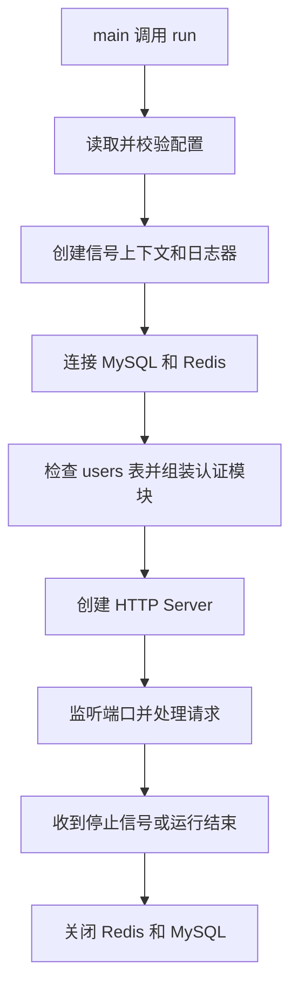

# 03 阅读代码

日期：2026-09-27

本篇从 API 进程入口开始，解释 `main.go` 中的 `run` 如何启动服务、连接 MySQL 和 Redis、组装认证模块，并在退出时清理资源。

## 1. 先看整体

`run` 不处理注册或登录请求。它负责准备运行环境并把各个组件连接起来。业务请求真正进入认证模块后，才会由 HTTP Handler 和应用服务处理。



入口代码在 [`main.go`](../backend/cmd/pulseframe-api/main.go)。服务启动后可按以下顺序阅读：`main` → `run` → `newRuntime` → `newBusinessRouter` → `Server.Run`。

## 2. 进程入口

`main` 调用 `run(context.Background(), os.LookupEnv)`。

- `context.Background()` 创建服务生命周期的根上下文；在这里它还没有超时或取消条件。
- `os.LookupEnv` 是读取环境变量的函数。把函数传给 `run`，配置加载就不必直接依赖进程全局环境，也更容易在测试时替换。
- `run` 返回错误时，`main` 记录错误并以状态码 `1` 结束进程；正常返回则进程以状态码 `0` 结束。

## 3. `run` 的启动步骤

### 3.1 读取配置

```go
cfg, err := config.Load(lookup)
```

`config.Load` 读取并检查服务配置，例如环境、监听地址、MySQL、Redis 和认证设置。配置不合法时，`run` 不会继续初始化服务，而是返回带有 `load config` 上下文的错误。`%w` 会保留原始错误，方便调用方继续判断错误类型。

### 3.2 监听退出信号

```go
ctx, stop := signal.NotifyContext(parent, os.Interrupt, syscall.SIGTERM)
defer stop()
```

这个上下文会在收到 `Ctrl+C` 或操作系统的 `SIGTERM` 信号时取消。之后启动的依赖检查和 HTTP Server 都使用这个上下文。`defer stop()` 会在 `run` 返回时解除信号监听并释放相关资源。

### 3.3 准备日志和 Gin

`logging.New` 创建日志器；`gin.SetMode(ginMode(cfg.Environment))` 根据运行环境选择 Gin 的 debug、test 或 release 模式。这些是服务级设置，不属于账号业务逻辑。

### 3.4 连接外部依赖

```go
runtime, err := newRuntime(ctx, cfg)
```

`runtimeDependencies` 保存运行过程中共享的 MySQL 和 Redis 客户端。连接失败时启动中止，因为认证模块无法在缺少任一依赖时正常工作。

连接成功后，`run` 注册清理函数：

```go
defer func() {
    runErr = errors.Join(runErr, runtime.Close())
}()
```

`runErr` 是 `run` 的命名返回值。函数返回前，defer 会关闭 Redis 和 MySQL，并把关闭错误与原有错误合并。这样即使创建路由或启动 HTTP Server 失败，已经建立的连接也会被关闭。

## 4. `newRuntime`：管理 MySQL 和 Redis 连接

实现位于 [`main.go`](../backend/cmd/pulseframe-api/main.go) 的 `newRuntime`，实际连接操作分别在 [`storage/mysql.go`](../backend/internal/platform/storage/mysql.go) 和 [`storage/redis.go`](../backend/internal/platform/storage/redis.go)。

1. 调用 `storage.OpenMySQL` 创建 GORM 数据库句柄、配置连接池并执行 Ping。
2. 调用 `storage.OpenRedis` 创建 Redis 客户端并执行 Ping。
3. 两者都成功后，放入 `runtimeDependencies` 返回给启动流程。

这里有一个需要注意的失败分支：如果 MySQL 已连接，但 Redis 初始化失败，`newRuntime` 会在返回前关闭 MySQL。此时 `run` 还没有拿到完整的 `runtime`，因此还不能依靠后面的 `defer runtime.Close()` 清理它。

`runtime.Close` 按顺序关闭 Redis、MySQL，并用 `errors.Join` 返回可能发生的清理错误。`errors.Join` 可以同时保留两个关闭错误，而不是只报告其中一个。

## 5. `newBusinessRouter`：组装认证模块

`run` 创建健康状态，然后把配置、日志器、健康状态和运行依赖打包成 `businessRouterOptions` 传给 `newBusinessRouter`。使用选项结构体可以把相关依赖放在一起，避免函数参数不断增加。

`newBusinessRouter` 按依赖关系组装模块：

1. 使用 MySQL 句柄创建用户仓储，并在 5 秒超时的上下文中检查 `users` 表是否符合要求。这里是检查，不是自动建表。
2. 使用同一个 Redis 客户端创建会话管理器和限流器。
3. 创建 Argon2id 密码处理器，并读取并发计算上限配置。
4. 把用户仓储、会话管理器、限流器和密码处理器交给 `application.NewService`。应用服务通过接口使用这些依赖，不需要直接绑定到具体的 MySQL 或 Redis 实现。
5. 创建 HTTP Handler，传入允许的网页来源和 Cookie 的 `Secure` 设置。
6. 把 Handler 作为业务模块注册到平台路由，再返回 Gin Engine。

这段是依赖注入的实际位置：启动代码选择具体实现并把它们传入应用服务；应用服务负责业务步骤，持久化实现负责访问数据库和 Redis。

## 6. 创建并运行 HTTP Server

`httpserver.OptionsFromConfig` 根据配置生成监听地址、路由和超时选项；`httpserver.New` 检查必要选项并创建 Server。随后：

```go
if err := server.Run(ctx); err != nil {
    return fmt.Errorf("run http server: %w", err)
}
```

`Server.Run` 监听配置中的 TCP 地址，并持续处理请求。上下文被停止信号取消时，Server 会进入关闭流程；监听或服务异常则通过错误返回。`run` 把错误加上 `run http server` 的上下文后返回。

服务正常结束时，代码记录停止日志并返回 `nil`。但返回值会经过 defer 清理：如果关闭连接失败，最终返回值就会变成清理错误。

## 7. `run` 中值得认识的 Go 写法

- **命名返回值**：`(runErr error)` 让 defer 可以修改函数最终返回的错误。
- **`defer`**：把资源清理安排在函数退出时执行；后注册的 defer 先执行。因此 `runtime.Close()` 先运行，然后才是 `stop()`。
- **`context.Context`**：把服务取消信号传给连接检查和 Server，让不同层能响应同一次停止事件。
- **错误包装**：`fmt.Errorf("...: %w", err)` 添加上下文但保留原错误；`errors.Join` 合并运行错误和资源清理错误。
- **依赖注入**：`run` 和 `newBusinessRouter` 创建具体实现，再传给应用服务；这样业务逻辑不必自己创建数据库或 Redis 客户端。

## 8. 接下来怎么读

读完启动组装后，建议从 [`handler.go`](../backend/internal/modules/account/httpapi/handler.go) 的注册接口继续，沿着一条请求追踪：

`HTTP 请求` → `Handler` → [`application/service.go`](../backend/internal/modules/account/application/service.go) → [`ports.go`](../backend/internal/modules/account/application/ports.go) 定义的接口 → MySQL 或 Redis 实现。

先看注册可以理解用户名校验、限流、密码摘要和 MySQL 写入；再看登录，可以继续追踪密码验证、Redis 会话创建和 Cookie 返回。
