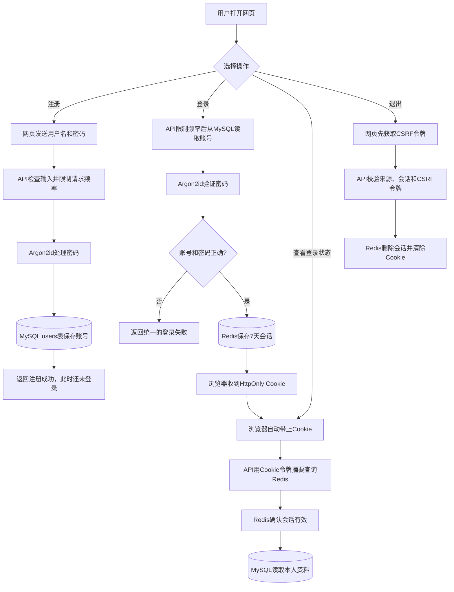

# 用户与认证模块实现与学习

日期：2026-09-24

状态：首版实现完成，已完成首轮真实 MySQL、Redis 与网页端联调

## 1. 各部分新增了什么功能

| 部分 | 新增功能 |
| --- | --- |
| 网页端（Vue 3 + TypeScript） | 提供注册和登录页面；打开网页时查询当前登录状态；退出前获取 CSRF 令牌。浏览器通过 Cookie 携带会话，网页代码不直接保存会话令牌。 |
| Go HTTP 接口 | 提供注册、登录、查询本人资料、获取 CSRF 令牌和退出接口；检查请求数据、Cookie、网页来源和 CSRF 令牌，并把结果转换成统一 HTTP 状态码。 |
| Go 业务逻辑 | 注册时检查账号输入、生成密码摘要并保存用户；登录时先经过限流，再从 MySQL 读取账号并验证密码，成功后创建 Redis 会话；还负责恢复登录状态和退出。 |
| MySQL | 增加 `users` 表，长期保存用户名、密码摘要、账号状态和时间；用户名唯一索引防止重名。字段和索引见下方“用户表和索引设计”。 |
| Redis 会话 | 登录成功后保存有效期为 7 天的服务端会话；Redis 键使用会话令牌的摘要，退出时删除对应会话。 |
| Redis 限流 | 只限制注册和登录请求：按 IP、用户名组合记录次数；超过配置限额时返回 `429`。普通资料查询、获取 CSRF 令牌和退出不受这组规则限制。 |
| 服务启动配置 | 增加 MySQL、Redis 和网页来源配置；启动时检查依赖连接和用户表结构，缺少依赖时明确报错。 |

注册成功不会自动登录。首版还没有手机号/邮箱验证、密码找回、第三方登录、多因素认证、封禁、角色授予、全设备退出或原生手机 App。

## 2. 技术选型与取舍

先记住整体分工：MySQL 保存长期账号资料；Redis 保存短期会话；Go API 负责校验请求并连接两种存储。

### 为什么这样选

- **Go + Gin**：Gin 是 Go 的 HTTP 框架，项目核心 API 已经使用它，可以直接接入。优点是复用现有路由和中间件；代价是继续依赖 Gin。业务逻辑不直接依赖 Gin，避免框架细节扩散到整个模块。
- **MySQL + GORM**：账号资料需要长期保存；用户名唯一索引能在并发注册时保证不重名。现有环境已有 MySQL，不必为首版增加另一套数据库。GORM 只用于用户仓储；表结构由 SQL 文件明确创建，避免应用启动时自动改表。
- **Redis 会话**：Redis 适合保存短期会话，退出时可以立即删除。JWT 不用每次查询会话，单次校验较轻，但签发后不容易立即撤销；把会话放 MySQL 又会增加认证查询的数据库负担。代价是 Redis 故障会影响登录和鉴权，本实现会明确报错，不跳过检查。
- **网页使用 HttpOnly Cookie**：浏览器自动携带登录 Cookie，网页脚本不能直接读取令牌。由于浏览器会自动带 Cookie，写请求还要检查网页来源和 CSRF 令牌。未来原生 App 可以改用请求头传令牌；网页不把令牌放在 Local Storage。
- **Vue 3 + TypeScript**：满足首版网页账号页需求，类型检查和 API 响应校验能较早发现接口不匹配。当前页面规模较小，因此没有额外引入全局状态框架。

### 用户表和索引设计

用户表名为 `users`，完整定义见 [`0001_create_users.sql`](../backend/migrations/0001_create_users.sql)：

| 列 | 用途 |
| --- | --- |
| `id` | 自增用户编号，作为主键 |
| `username` | 登录用户名，只允许小写字母、数字和下划线，不能重复 |
| `password_hash` | 密码摘要，不保存原始密码 |
| `status` | 账号状态：`active` 或 `disabled` |
| `created_at`、`updated_at` | 账号创建和更新时间 |

主键、唯一索引和状态检查在建表定义中声明：

```sql
PRIMARY KEY (id),
CONSTRAINT uq_users_username UNIQUE (username),
CONSTRAINT chk_users_status CHECK (status IN ('active', 'disabled'))
```

- 主键按 `id` 定位用户；用户名唯一索引用于登录查询并防止重名；状态检查约束只允许 `active` 或 `disabled`。
- 其他列暂时没有单独建索引，因为当前请求不按它们搜索。

### Redis 保存什么

Redis 只保存短期会话和限流计数。用户名、密码摘要等长期账号资料仍保存在 MySQL。

**登录会话**

登录成功后，浏览器收到原始随机令牌并放入 HttpOnly Cookie；Redis 保存的是令牌摘要对应的会话：

```text
Key:   pulseframe:auth:session:<hex(SHA-256(Cookie令牌))>
Value: {"user_id": 123, "csrf_token": "...", "expires_at": "..."}
TTL:   7 天
```

API 收到 Cookie 后重新计算摘要来查找会话。退出时删除这个 Key；原始 Cookie 令牌不会放进 Redis 的 Key 或 Value。

**限流计数**

先根据请求对象组成逻辑 Key，再计算摘要作为 Redis Key：

```text
register:ip:<IP>
login:ip:<IP>
login:identity-ip:<IP>:<用户名>

Redis Key:   pulseframe:auth:limit:<hex(SHA-256(逻辑Key))>
Redis Value: 整数计数，例如 1、2、3
```

默认规则是：同一 IP 每 15 分钟登录最多 30 次；同一 IP 对同一用户名每 15 分钟最多 10 次；同一 IP 每小时注册最多 8 次。首次计数时设置对应窗口的 TTL，后续请求不延长它；窗口到期后计数自动删除。登录会同时检查前两个计数桶，Lua 脚本原子完成检查和递增。

## 3. HTTP 接口

公共前缀为 `/api/v1/auth`：

| 方法与路径 | 用途 | 成功结果 | 主要失败 |
| --- | --- | --- | --- |
| `POST /register` | 校验并创建普通账号 | 201，公开用户资料；不自动登录 | 400、409、429、503 |
| `POST /login` | 校验凭据并建立服务端会话 | 200，公开用户资料和 `Set-Cookie` | 400、401、429、503 |
| `GET /me` | 恢复当前用户资料 | 200，公开用户资料 | 401、503 |
| `GET /csrf` | 读取当前会话绑定的 CSRF 令牌 | 200，响应为 `no-store` | 401、503 |
| `POST /logout` | 校验来源和 CSRF 后撤销当前会话 | 204，清除 Cookie | 401、403、503 |

错误响应使用核心 API 的统一格式。常见状态码含义：400 输入格式错误；401 未登录或凭据错误；403 安全校验失败；409 用户名已存在；429 请求过多；503 数据库、Redis 或哈希容量暂时不可用。用户名不存在和密码错误使用相同的 401 响应，登录令牌不放进 JSON。

## 4. 流程图：用户认证的主要过程



图中是成功路径。遇到无效输入会返回 400；用户名重复返回 409；错误登录返回 401；请求太频繁返回 429；MySQL、Redis 或哈希容量不可用时返回 503。

网页登录 Cookie 使用 `HttpOnly`、`SameSite=Lax` 和 `Path=/`；生产环境启用 `Secure` 并使用 `__Host-pf_session` 名称。

- **注册**：网页提交用户名和密码；API 校验格式、限制频率、计算密码摘要，再由 MySQL 保存账号。注册成功不会自动登录。
- **登录**：API 从 MySQL 查用户并验证密码；验证成功后在 Redis 建立会话，最后通过 HttpOnly Cookie 把会话凭据交给浏览器。用户名不存在时也会做一次类似耗时的密码校验，避免只凭响应时间猜测账号是否存在。
- **后续访问**：浏览器自动发送 Cookie；API 到 Redis 确认会话，再从 MySQL 读取本人资料。网页只保存用户名和用户 ID，不保存会话令牌。
- **退出**：网页先获取当前会话的 CSRF 令牌，再提交退出请求。API 验证网页来源和令牌后删除 Redis 会话，并让浏览器清除 Cookie。

注册、登录和退出都检查网页来源。退出还需要 CSRF 令牌，因为浏览器会自动附带 Cookie；这样其他网站就不能只靠诱导用户访问页面来提交退出请求。

## 5. 代码变更清单与职责

先看这几个入口文件，就能沿着请求把模块读下来：

1. [`backend/cmd/pulseframe-api/main.go`](../backend/cmd/pulseframe-api/main.go)：应用从这里启动，并把数据库、Redis、认证逻辑和 HTTP 路由连接起来。
2. [`backend/internal/modules/account/httpapi/handler.go`](../backend/internal/modules/account/httpapi/handler.go) 和 [`middleware.go`](../backend/internal/modules/account/httpapi/middleware.go)：查看接口、Cookie、会话和 CSRF 校验。
3. [`backend/internal/modules/account/application/service.go`](../backend/internal/modules/account/application/service.go) 和 [`ports.go`](../backend/internal/modules/account/application/ports.go)：查看注册、登录、查询本人、退出步骤，以及它们调用哪些存储接口。
4. [`backend/internal/modules/account/domain/user.go`](../backend/internal/modules/account/domain/user.go)：查看用户名、密码和账号状态规则。
5. [`backend/internal/modules/account/persistence/mysql_users.go`](../backend/internal/modules/account/persistence/mysql_users.go)、[`redis_sessions.go`](../backend/internal/modules/account/persistence/redis_sessions.go)、[`redis_limiter.go`](../backend/internal/modules/account/persistence/redis_limiter.go)：分别查看 MySQL 用户、Redis 会话和限流。
6. [`backend/internal/modules/account/secure/argon2id.go`](../backend/internal/modules/account/secure/argon2id.go)：查看密码如何生成摘要和验证。
7. [`frontend/src/api/auth.ts`](../frontend/src/api/auth.ts)、[`frontend/src/App.vue`](../frontend/src/App.vue)：查看网页如何调用 API，以及如何恢复和退出登录状态。

本次新增的主要代码位于 `backend/internal/modules/account/`、`backend/internal/platform/config/auth.go`、`backend/internal/platform/config/auth_validation.go`、`backend/internal/platform/storage/`、`backend/migrations/` 和整个 `frontend/` 目录。

另外修改了这些已有工程文件：

- `backend/cmd/pulseframe-api/main.go`：接入认证模块和 MySQL/Redis。
- `backend/internal/platform/config/config.go`、`backend/internal/platform/config/config_test.go`：增加认证配置加载及校验测试。
- `backend/internal/platform/httpserver/router.go`、`backend/internal/platform/httpserver/response/error.go`：注册认证路由并补充统一错误码。
- `backend/go.mod`、`go.sum`：登记 MySQL、GORM、Redis、Argon2id 和测试依赖。
- `backend/README.md`、`backend/docs/run-lifecycle.md`：补充建表、配置和启动说明。

模块内测试位于 `backend/internal/modules/account/` 各子目录的 `*_test.go` 文件；前端测试位于 `frontend/src/test/`。

其他新代码也可以按目录理解：`domain/` 放账号规则，`application/` 串起注册和登录步骤，`httpapi/` 处理 HTTP，`persistence/` 连接数据库和 Redis，`secure/` 处理密码。

## 6. 从当前代码复习基础知识与面试点

下面这些问题都能在本模块找到对应代码。复习时先说清概念，再用项目里的做法举例。

### Go

- **接口有什么用？** 应用服务只依赖接口，不绑定 MySQL 或 Redis 的具体实现，测试时也能替换成测试实现。见 [`ports.go`](../backend/internal/modules/account/application/ports.go)。
- **`context.Context` 用来做什么？** 在一次请求的调用链中传递取消信号和超时；数据库、Redis 操作都接收请求的 `context`。见 [`service.go`](../backend/internal/modules/account/application/service.go)。
- **`errors.Is` 和 `errors.As` 有什么区别？** `Is` 判断错误链里是否包含某个已知错误，`As` 提取特定错误类型；本模块用它们区分业务错误和 MySQL 重复键。见 [`mysql_users.go`](../backend/internal/modules/account/persistence/mysql_users.go)。
- **channel、`select` 和 `defer` 怎么配合？** Argon2id 用带容量的 channel 限制同时计算密码的请求；`select` 的 `default` 在容量满时立即报错，`defer` 确保计算结束后归还名额。见 [`argon2id.go`](../backend/internal/modules/account/secure/argon2id.go)。

### MySQL

- **为什么“先查用户名、再插入”还需要唯一索引？** 两个并发请求可能同时查到用户名不存在；唯一索引由数据库最终保证不重名。代码把重复键转换成明确的业务错误。见 [`0001_create_users.sql`](../backend/migrations/0001_create_users.sql) 和 [`mysql_users.go`](../backend/internal/modules/account/persistence/mysql_users.go)。
- **参数化查询如何防 SQL 注入？** 用户输入作为参数传给数据库，不拼接进 SQL 文本；例如 GORM 的 `Where("username = ?", username)`。见 [`mysql_users.go`](../backend/internal/modules/account/persistence/mysql_users.go)。
- **数据库连接池解决什么问题？** 复用已有连接，避免每个请求都新建连接；最大连接数、空闲连接数和连接寿命需要结合数据库容量设置。见 [`mysql.go`](../backend/internal/platform/storage/mysql.go)。
- **MySQL 事务能不能同时保证 Redis 写入？** 不能。数据库事务只保证 MySQL 内的一组操作；本模块没有把 MySQL 和 Redis 当成一个原子事务，Redis 故障时会明确返回错误。

### Redis

- **为什么会话放 Redis，过期和退出怎么处理？** HTTP 请求本身不记得用户状态，浏览器 Cookie 携带随机会话令牌，Redis 保存会话并设置有效期；退出时删除会话。Redis 键使用令牌摘要，不直接使用原始令牌。见 [`redis_sessions.go`](../backend/internal/modules/account/persistence/redis_sessions.go)。
- **`SETNX` 和 Lua 脚本分别解决什么问题？** `SETNX` 只在键不存在时创建会话；限流用 Lua 把多个计数桶的检查和更新作为一次原子操作，避免并发请求交错后突破限制。见 [`redis_sessions.go`](../backend/internal/modules/account/persistence/redis_sessions.go) 和 [`redis_limiter.go`](../backend/internal/modules/account/persistence/redis_limiter.go)。
- **Redis 适合保存什么？** 本模块把可过期、需要快速撤销的会话和限流计数放 Redis；长期账号资料仍以 MySQL 为准。Redis 不可用时鉴权明确失败，不绕过检查。

### 计算机网络与 Web 安全

- **Cookie 会话和请求头令牌有什么区别？** 浏览器会自动附带 Cookie，所以网页使用 `HttpOnly` 限制脚本读取令牌，并用 `Secure`、`SameSite` 等属性缩小风险；移动客户端以后可以改用请求头。
- **HTTPS 和 `Secure` Cookie 是什么关系？** HTTPS 用 TLS 保护传输并验证服务端；`Secure` 只要求浏览器通过 HTTPS 发送 Cookie，不能代替部署 HTTPS。
- **CORS 和 CSRF 是一回事吗？** 不是。CORS 主要控制网页脚本能否跨来源读取响应；CSRF 是浏览器自动携带凭据导致的伪造请求风险。本模块对写请求校验 `Origin`，退出还校验会话绑定的 CSRF 令牌。见 [`middleware.go`](../backend/internal/modules/account/httpapi/middleware.go)。
- **反向代理为什么影响客户端 IP？** 代理可能通过 `X-Forwarded-For` 传递原始 IP，但该请求头可被伪造；只有明确配置并信任的代理才应提供这类信息。本项目当前不信任代理头，部署在代理后时要按实际代理地址配置。见 [`router.go`](../backend/internal/platform/httpserver/router.go)。

## 7. 配置与启动关系

后端启动需要 MySQL、Redis 和网页来源配置。密码从本地安全配置读取，不写进源码或本文档；各环境变量的完整说明见 [backend/README.md](../backend/README.md)。生产环境必须启用 Secure Cookie。

本次本地联调中，网页使用 `127.0.0.1:5174`，API 使用 `127.0.0.1:8081`，MySQL 和 Redis 通过 SSH 隧道访问。网页来源必须与后端 `WEB_ORIGIN` 完全一致，Vite 代理目标必须与 API 地址一致。

启动顺序是：先准备数据库并执行迁移，再启动 API，最后启动网页。API 会先检查 MySQL 和 Redis 是否可连接、`users` 表是否存在；缺少依赖时会报错退出，不使用假数据代替。

## 8. 验证结果与边界

已通过的自动化检查：

- 后端 `go test -timeout=60s ./...`、`go test -race -timeout=60s ./...` 和 `go vet ./...`。
- 前端类型检查、7 项 Vitest 测试、生产构建和 `npm audit`；依赖审计未发现漏洞。
- 自动化测试覆盖用例编排、配置校验、Argon2id、HTTP Cookie/Origin/CSRF/CORS、Redis 临时实例和 MySQL SQL mock。

已完成首轮真实依赖与网页联调：

- 在真实 MySQL 8.4.11 的专用 `pulseframe` 数据库执行建表迁移；应用账号为专用非 root 用户，仅有该库的 `SELECT`、`INSERT` 权限，迁移账号权限独立且受限。
- 使用专用 Redis ACL 用户访问 `pulseframe:auth:*`；已验证该账号不能读取其他键前缀。
- 浏览器实际页面经 Vite 代理连接 API：注册 `201`，重复注册 `409`，错误登录 `401`，正确登录、`/me` 与 `/csrf` 均 `200`，退出 `204`，退出后 `/me` 返回 `401`。两条合成联调账号已删除。
- 前后端 HTTP 链路已验证，不等于容量、生产部署、安全运营或故障恢复验收完成。

尚未完成的工作：测试 MySQL/Redis 故障和恢复、测量服务在目标机器上的承载能力、收紧远端数据库和 Redis 的网络访问，以及为未来公众注册准备账号恢复渠道。首轮联调使用合成账号，没有适合账号密码回放的公开数据集。

## 9. 几个词的意思

- **密码摘要**：由密码计算出来的单向结果。登录时可以验证输入是否匹配，但不能从摘要还原原密码。
- **随机盐**：每次生成密码摘要时附加的随机值；相同密码也会得到不同摘要。
- **SHA-256**：常见的摘要算法。本模块用它生成 Redis 会话键的一部分，避免 Redis 键里出现可直接登录的原始令牌。
- **会话**：服务端记录“这个浏览器已经登录”的短期信息。本项目把它放在 Redis；浏览器只通过 Cookie 带上对应令牌。
- **HttpOnly Cookie**：浏览器会自动随请求发送，但网页 JavaScript 不能直接读取其中的令牌。
- **Secure、SameSite**：Cookie 的浏览器安全设置。生产环境通过 HTTPS 使用 Secure；SameSite 限制部分跨站携带 Cookie 的情况，但不能替代 CSRF 校验。
- **CSRF**：利用浏览器自动带 Cookie 的特点，让用户在不知情时向网站发起请求。本项目检查网页来源，并在退出请求中额外检查会话绑定令牌。
- **Origin**：浏览器请求来自哪个网页地址；服务端只接受配置允许的网页来源。
- **失败关闭**：MySQL 或 Redis 出错时返回错误，不假装登录成功，也不绕过鉴权。

## 10. 后续扩展边界

未来原生手机 App 可以改用请求头传递会话令牌，共用同一套注册、登录和会话逻辑；令牌应交给手机系统的安全存储。网页 Cookie 的 CSRF 防护仍需保留。

加入购物车、订单或商家能力时，认证模块只提供用户身份；商品和交易权限由对应业务模块检查。以后加入封禁或改密码时，还要设计如何同步撤销 Redis 中的旧会话。

## 11. 相关资料

- [用户与认证模块设计](03-用户与认证模块设计.md)：需求、完整安全边界、选型取舍和验收设计。
- [后端启动说明](../backend/README.md)：环境变量、迁移和本地开发命令。
- [前端启动说明](../frontend/README.md)：Vue 开发与验证命令。
- [认证测试数据调研](../memory/research/2026-09-24-auth-test-data.md)：公开数据是否适合账号/密码测试的结论。
