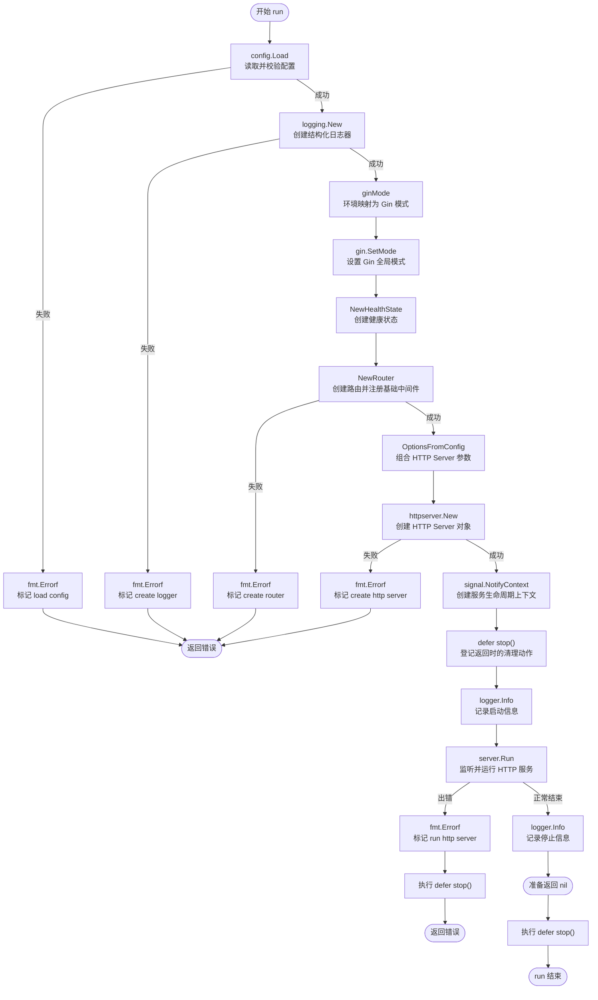

# 基座架构

本文以 `backend/cmd/pulseframe-api/main.go` 的 `run` 函数为主线，说明当前工程基座的启动、请求处理和退出过程。Mermaid 图展示 `run` 的主流程；`run` 本体的每个直接函数或方法调用都在后文列出。

## `run` 主流程

初始化阶段失败时，`run` 立即返回错误。只有执行到 `signal.NotifyContext` 并登记 `defer stop()` 之后，后续返回才会执行这个清理函数。

## `run` 直接调用清单

| 调用 | 在 `run` 中的作用 |
| --- | --- |
| `config.Load(lookup)` | 读取并校验环境、日志和 HTTP 配置，返回 `cfg`。 |
| `fmt.Errorf(...)` | 在配置、日志器、路由、HTTP Server 或运行阶段失败时，为底层错误补充阶段名称并保留原错误。 |
| `logging.New(cfg.LogLevel, os.Stdout)` | 创建按配置级别过滤、写入标准输出的 JSON 日志器。 |
| `ginMode(cfg.Environment)` | 将应用环境转换为 Gin 的 debug、test 或 release 模式。 |
| `gin.SetMode(...)` | 设置 Gin 的进程级运行模式。 |
| `httpserver.NewHealthState()` | 创建 Router 与 Server 共用的初始未就绪状态。 |
| `httpserver.NewRouter(...)` | 创建 Gin Engine，构造并注册中间件、基础路由和路由错误处理。传入的 `CryptoIDGenerator{}` 是生成器对象，不是函数调用。 |
| `httpserver.OptionsFromConfig(cfg, router, health)` | 把监听地址、超时、Router 和健康状态组合成 HTTP Server 参数。 |
| `httpserver.New(options)` | 校验必要参数并创建 HTTP Server 生命周期对象。 |
| `signal.NotifyContext(parent, os.Interrupt, syscall.SIGTERM)` | 创建会在父上下文取消或收到退出信号时取消的上下文。 |
| `stop()` | 作为 `defer` 登记；`run` 返回时撤销信号通知并释放相关资源。 |
| `logger.Info(...)` | 分别记录服务开始和正常停止；启动日志包含监听地址与运行环境。 |
| `server.Run(ctx)` | 开始监听并运行服务，直到上下文取消或发生服务错误。 |

`fmt.Errorf` 在 `run` 中有五个失败分支：`load config`、`create logger`、`create router`、`create http server` 和 `run http server`。`logger.Info` 有两处调用：启动时和正常停止时。

## 被调用函数的内部链路

### 配置与日志

- `config.Load` 使用 `readValue` 读取值，使用 `parseEnvironment` 和 `parseLogLevel` 校验环境与日志级别，并调用 `loadHTTP` 读取 HTTP 配置。
- `loadHTTP` 调用 `validateAddress` 检查监听地址，并多次调用 `parsePositiveDuration` 校验超时；后者通过 `time.ParseDuration` 将字符串解析为时长。
- `logging.New` 检查输出目标，调用 `strings.TrimSpace`、`strings.ToUpper` 和 `slog.Level.UnmarshalText` 解析日志级别，再调用 `slog.NewJSONHandler` 与 `slog.New` 创建日志器。
- `ginMode` 只将环境值映射为 Gin 模式常量，不再调用其他项目函数。

### 路由创建

`NewRouter` 先校验 Logger 和 Health，再依次调用 `NewRequestID`、`NewAccessLog`、`NewRecovery` 创建中间件对象。随后调用 `gin.New` 创建 Engine，调用 `SetTrustedProxies` 配置代理策略，并用 `router.Use` 注册中间件。

接着，`registerPlatformRoutes` 调用 `router.GET` 注册 `/livez` 和 `/readyz`；`registerRouteErrors` 调用 `router.NoRoute` 和 `router.NoMethod` 设置未匹配路径及方法的处理函数。代理配置失败时，`NewRouter` 调用 `errors.Join` 组合阶段说明与底层错误。

`router.Use` 和 `router.GET` 在启动时只是注册处理函数，不会立即处理请求。请求到来后，中间件才按请求 ID、访问日志、panic 恢复的顺序执行，之后进入匹配的路由处理函数。

### HTTP Server 与退出

`OptionsFromConfig` 只组装参数。`httpserver.New` 检查 Handler、Health 和关闭超时，然后创建标准库 `http.Server`。

`Server.Run` 调用 `net.Listen` 绑定地址，成功后进入 `Serve`。`Serve` 调用 `HealthState.SetReady`，并在 goroutine 中调用 `server.serve`；后者调用标准库 `http.Server.Serve`。`Serve` 等待 Serve 错误或上下文取消：两种情况下都会调用 `SetNotReady`；收到取消时还会调用 `shutdown`。

`shutdown` 使用 `context.WithTimeout` 创建限时上下文，调用标准库 `http.Server.Shutdown` 停止接收新请求并等待在途请求，然后调用 `normalizeServeError`。该函数用 `errors.Is` 将标准库的正常关闭错误转换为 `nil`。

## 当前边界

当前 `run` 只装配工程基础能力，`NewRouter` 只注册健康探针和通用路由错误处理，尚未装配用户与认证等业务模块。业务模块设计文档中的方案不会自动成为当前代码调用链；实现后需要由启动装配创建其依赖并注册对应路由。
