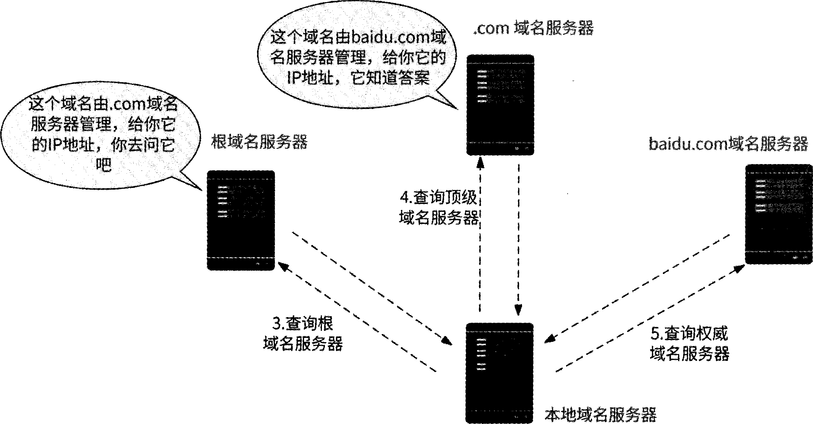

# dns解析过程


以访问 `www.baidu.com` 为例：

1. **检查本机记录**：浏览器和操作系统先检查 DNS 缓存，系统也会检查 hosts 文件；找到对应记录即可使用。
2. **查询本地 DNS 服务器**：本机没有记录时，向配置的本地 DNS 服务器发起请求；若服务器缓存中有有效记录，直接返回 IP 地址。
3. **查询根域名服务器**：缓存未命中时，本地 DNS 服务器向根域名服务器查询，获得 `.com` 顶级域名服务器的地址。
4. **查询顶级域名服务器**：本地 DNS 服务器向 `.com` 域名服务器查询，获得负责 `baidu.com` 的权威域名服务器地址。
5. **查询权威域名服务器**：本地 DNS 服务器向 `baidu.com` 的权威域名服务器查询，获得 `www.baidu.com` 对应的 IP 地址。
6. **返回解析结果**：本地 DNS 服务器按 TTL 缓存结果，并将 IP 地址返回给客户端；浏览器随后使用该地址连接网站服务器。

客户端向本地 DNS 服务器发起的通常是**递归查询**；本地 DNS 服务器向根域、顶级域和权威域名服务器逐级发起的是**迭代查询**。

# dns存在的问题
好，只留最核心的，砍到不能再砍：

1. 慢 —— 递归查询链路长，动辄几百毫秒
2. 不准 —— 权威DNS看到的是**本地域名服务器**的IP，不是你的真实位置，就近调度失效
3. 不安全 —— 协议明文、无认证，容易被劫持/篡改/投毒

三条，对应三个维度：性能、准确性、安全性。面试一句话就能收住。

# http dns 原理

把“查域名对应 IP”这件事，从问运营商的 DNS 换成问厂商自己的 HTTPS 接口


# 传统dns 对比 http dns
HTTP DNS H是将域名解析协议由DNS协议换成了 HTTP,原理并不复杂。

传统dns
```text
你的手机 → 运营商 DNS（比如 114.114.114.114）
→ 根 DNS → .com DNS → baidu 权威 DNS

www.baidu.com → 180.101.50.242

TCP 连接 → TLS 握手 → HTTPS 请求
Host: www.baidu.com
```

http dns
```text
GET https://httpdns.baidu.com/resolve?domain=www.baidu.com

{
  "domain": "www.baidu.com",
  "ips": ["180.101.50.242", "180.101.50.243"],
  "ttl": 60
}

TCP → 180.101.50.242:443
TLS 握手：
  SNI = www.baidu.com
  证书 = *.baidu.com ✅
HTTPS 请求：
  Host: www.baidu.com
```

| 优势维度 | 传统 DNS 存在的问题 | HTTPDNS 带来的好处（原理简述） |
| :--- | :--- | :--- |
| **解析延迟** | 需经过多级递归查询，链路长、耗时长。 | **降低延迟**：直接访问 HTTPDNS 服务器，省去递归查询环节，缩短解析链路。 |
| **解析安全性** | 依赖运营商本地 DNS，易被劫持、篡改。 | **防止劫持**：直接通过 IP 访问解析接口，绕过运营商本地 DNS，避免域名被劫持。 |
| **调度精准度** | 只能获取本地 DNS 服务器的 IP，导致调度基于 DNS 位置而非用户真实位置。 | **精准调度**：直接获取客户端真实 IP，可结合精确的位置/运营商信息，返回距离最近、更优的节点 IP。 |
| **生效速度** | 受多级 DNS 缓存影响，记录更新后需等待 TTL 过期才能全量生效。 | **快速生效**：不受传统多级缓存限制，域名关联的 IP 变更后能更快覆盖全量客户端。 |

# http dns 实践
## HTTP DNS 实践：容灾降级流程

| 步骤 | 触发条件 | 处理方式 |
| :--- | :--- | :--- |
| **① HTTP DNS 解析** | 正常场景 | 客户端优先使用 HTTP DNS 尝试解析域名 |
| **② 降级到本地 DNS** | HTTP DNS 返回空数据 / 网络错误 | 向本地 DNS 服务器发起解析，降级为传统 DNS |
| **③ 兜底 IP** | 本地 DNS 也失败 | 直接使用预留的域名兜底 IP（客户端写死 / 服务端下发），保证用户不被解析挡在门外 |

> 兜底 IP 可能增加延迟，但确保可用性。

## HTTP DNS 实践：配套策略

| 策略 | 说明 |
| :--- | :--- |
| **安全策略** | HTTP DNS 基于标准 HTTP，建议进一步使用 HTTPS 保证数据安全 |
| **IP 选取策略** | 服务端按顺序下发多个最优 IP；客户端默认取第一个，校验连通性，不佳则依次尝试下一个 |
| **批量拉取策略** | 冷启动 / 网络切换（Wi-Fi ↔ 蜂窝）时，批量拉取域名-IP 映射列表并缓存，提升后续调度精度与解析性能 |