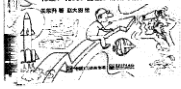
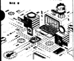
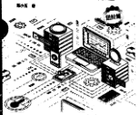
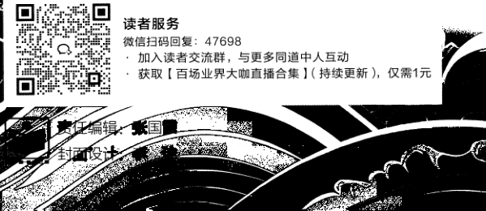

[原 PDF 第 1 页](../%E4%BA%BF%E7%BA%A7%E6%B5%81%E9%87%8F%E7%B3%BB%E7%BB%9F%E6%9E%B6%E6%9E%84%E8%AE%BE%E8%AE%A1%E4%B8%8E%E5%AE%9E%E6%88%98%20%28--%29%20%28manongshu.com%29.pdf#page=1)


- 好书分孚•・业内专家赞誉・


本书从全局的角度深度解析了互联网后台架构设计的观点和方法，融入了大量来自工业级互联网后台的实战亲


亿

```text
|看漫画    例。本书涵盖知识面广、深入浅出，对于渴望成为后台架构师的学习者甚至初学者来说，是一本值得深度研读
                                                          的好书。本书不仅是我们学习架构知识时的优质资料，也是我们日常工作中的实用参考手册。    级
```


```text
                                                                                                                  郑闫强◊小米科技高级技术总监    亿级流量
学 Python    作者简介
```

流有料、存孤 好用（全彩



捷东升*昭大羽律

作者在本书中详细介绍了亿级流量系统架构设计的知识点，并给出了自己的独到观点。本书不但涵盖了系统架

量

```text
                                                      构设计基础知识，还涵盖了目前广大UGC平台的常见服务设计实践，既可以作为系统架构设计参考资料，也    李琛轩
```

系

```text
                                                      可以作为相关面试宝典。    资深后台研发工程师，拥有8年互联网后台
```

李艳鹏◊互联网资深架构师，《分布式服务架构》和《可伸缩服务架构》作者


```text
                                                                                                                                                             统    系统架构设计与实战    开发经验，现任某全球社交产品后台子方
算法训练营    算法训练营
```

向负责人。从事互联网社交产品领域的研

```text
海量图解+竞赛刷题    海量图解+竞赛刷题    架    本书介绍了大型互联网公司的基础组件、高并发和高可用设计的通用思路，以及基于这些知识解决真实业务问
```

发与架构设计工作多年，从业以来负责过





题的案例。有经验的读者可以通过阅读本书对自己的知识进行查漏补缺，新手也可以通过阅读本书建立自己的

```text
                                                                                                       构    多个知名产品的后台开发工作，相继深耕
```

知识体系。如果能够在阅读书中基础服务设计的案例之前，先想一想自己会如何设计，就能更深刻地理解这些

```text
                                                                                                                                                           李琛轩◎编著    于消息队列、服务发现系统、服务治理、
```

设设计的精巧之处。

分布式事务、高并发架构设计、全球多活

王迪◊某社交产品资深架构师

计

等技术领域。

```text
本书介绍了互联网后台核心知识，涉及机房搭建、服务治理、高并发设计和一系列常见系统架构设计话题，涵    与
```


盖了亿级用户应用后台的大部分要素。本书图文并茂、行文流畅，非常适合互联网后台开发工程师深度阅读。

秦磊◊某海外社交产品业务架构负责人

本书深入探讨了高并发系统设计，从大厂的视角解读技术栈选择、高并发处理等核心内容。无论是大厂的工程师，还是计划入行的学生，都能从中借鉴宝贵的实战经验。本书是我们提升高并发系统设计能力的理想读物。

郝萌◊哈尔滨工业大学讲师，CCF高性能专委会执行委员

这是一本架构师参考指南，凝聚了作者多年的工作经验，干货满满。如果你初出茅庐，正在找工作，或者刚刚


走上后端工程师的工作岗位，则建议认真阅读本书，因为它能帮助你全面了解后端工程技术体系；如果你已经工作了几年，渴望『步提高，则也建议阅读本书，因为你能从中学习作者对过往经验的梳理和结构化输出方法。

丛小亮◊字节跳动资深研发工程师

上架建议：计算机 ＞系统架构




写书、投稿、市场宣传等事宜可联系虾米编辑由B箱：zhanggx@phei.com.cn微信：zgx228

[原 PDF 第 2 页](../%E4%BA%BF%E7%BA%A7%E6%B5%81%E9%87%8F%E7%B3%BB%E7%BB%9F%E6%9E%B6%E6%9E%84%E8%AE%BE%E8%AE%A1%E4%B8%8E%E5%AE%9E%E6%88%98%20%28--%29%20%28manongshu.com%29.pdf#page=2)

亿级流量

系统架构设计与实战

李琛轩◎编著

```text
                           倦'孑 X    ±
```

Publishing House of Electronics Industry

北京-BEIJING

[原 PDF 第 3 页](../%E4%BA%BF%E7%BA%A7%E6%B5%81%E9%87%8F%E7%B3%BB%E7%BB%9F%E6%9E%B6%E6%9E%84%E8%AE%BE%E8%AE%A1%E4%B8%8E%E5%AE%9E%E6%88%98%20%28--%29%20%28manongshu.com%29.pdf#page=3)

内容简介

本书涵盖了亿级用户应用后台通用的技术和系统架构设计思路，在内容结构上分为三大篇：架构知识篇（第1〜3章），作为全书的基础知识篇，首先介绍后台的关键组件构成以及机房的搭建思路，然后介绍后台在应对高并发的读/写请求时通用的处理手段，最后介绍如何通过通用的服务治理手段来保障后台的高质量运行；基础服务设计篇（第4〜6章），主要讲解基础服务的架构设计，这里选取的基础服务几乎是所有互联网后台都需要的专门系统，包括唯一 ID生成器、用户登录服务和海量推送系统；核心服务设计篇（第7〜13章），主要讲解在常见的社交互动场景中所需核心服务的架构设计，包括内容发布系统、通用计数系统、排行榜服务、用户关系服务、Timeline Feed服务、评论服务和IM服务。

本书的适用人群包括计算机相关专业的学生、希望寻求大厂软件开发工程师岗位的求职者，以及各信息技术类公司的后台研发工程师、架构师和技术管理人员。

未经许可，不得以任何方式复制或抄袭本书之部分或全部内容。版权所有，侵权必究。

图书在版编目（CIP）数据

亿级流量系统架构设计与实战/李琛轩编著.一北京：电子工业出版社，2024.5ISBN 978-7-121-47698-3I .①亿…II.①李…III.①网站建设IV.①TP393.092.1

中国国家版本馆CIP数据核字（2024）第074946号

责任编辑：张国霞印 刷：三河市双峰印刷装订有限公司装 订：三河市双峰印刷装订有限公司出版发行：电子工业出版社

```text
         北京市海淀区万寿路173信箱    邮编100036
开 本：787x980    1/16 印张：27 字数：607千字
```

版 次：2024年5月第1版印 次：2024年5月第1次印刷印 数：3000册 定价：128.00元

凡所购买电子工业出版社图书有缺损问题，请向购买书店调换。若书店售缺，请与本社发行部联系,联系及邮购电话：（010） 88254888, 88258888。

质量投诉请发邮件至zlts@phei.com.cn,盗版侵权举报请发邮件至dbqq@phei.com.cn0

本书咨询联系方式：faq@phei.com.cno

[原 PDF 第 4 页](../%E4%BA%BF%E7%BA%A7%E6%B5%81%E9%87%8F%E7%B3%BB%E7%BB%9F%E6%9E%B6%E6%9E%84%E8%AE%BE%E8%AE%A1%E4%B8%8E%E5%AE%9E%E6%88%98%20%28--%29%20%28manongshu.com%29.pdf#page=4)

刖 5

亿级用户应用

如今市面上的互联网应用几乎都在追求用户规模，这不仅仅是因为只有用户规模庞大才能让产品扬名立万，更重要的是对于应用出品方来说，亿级用户会为公司带来巨大收益。

- 广告收入：亿级用户应用拥有巨大的“人口红利”，在应用内投放产品广告非常容易带来极大的产品曝光量和极高的产品转化率，所以会有非常可观的广告收入。

- 商业价值：亿级用户意味着应用的品牌拥有巨大的影响力，会天然吸引其他企业，促成联名合作。

- 产品带动：一旦公司拥有用户量级巨大的产品，就可以非常方便地借助它为新产品做引流和推广，以进一步扩大公司的产品规模。

鉴于亿级用户为公司带来了极高的实用价值和商业价值，针对亿级用户进行应用架构设计的工程师备受市场青睐。亿级用户意味着高并发，很多公司会在工程师招聘要求中注明“有高并发系统设计经验”，或者在面试过程中频繁考查候选人的高并发系统设计能力。所以，对于研发工程师来说，拥有高并发系统设计的知识体系是十分必要的技术素养。

本书主题

如果你是大厂的研发工程师，那么你可能每天都要面对系统怎样才能服务好亿级用户的问题；如果你所在的公司目前尚未拥有亿级用户，那么你可能会想象，若公司产品有更多用户使用的话，需要应用什么技术，或者你希望拿到大厂Offer,却焦虑于自己没有高并发系统设计经验；如果你是计划成为研发工程师的学生，那么你可能虽然认真做了很多课程设计，但仍会好奇自己的作品对应的工业级设计应该是怎样的。

[原 PDF 第 5 页](../%E4%BA%BF%E7%BA%A7%E6%B5%81%E9%87%8F%E7%B3%BB%E7%BB%9F%E6%9E%B6%E6%9E%84%E8%AE%BE%E8%AE%A1%E4%B8%8E%E5%AE%9E%E6%88%98%20%28--%29%20%28manongshu.com%29.pdf#page=5)

如此种种，笔者决定编写一本涵盖亿级用户应用后台常见系统设计的书，希望将自己的经验与你分享。那么，亿级用户应用后台的通用技术是什么？无非就是如何构建机房、使用哪些技术栈、如何高效处理高并发请求和如何保证后台服务的高可用等。

亿级用户应用后台有哪些通用系统（或称服务）？我们只需看那些拥有数亿名用户的应用都有哪些相似功能就能轻易得出结论，比如国民级应用或知名应用：微信、淘宝、微博、抖音、快手、小红书、百度贴吧、bilibili.爱奇艺、网易云音乐、知乎、钉钉等。这些应用的用户活跃度极高，它们几乎都支持这些功能：用户注册与登录、通知消息、用户发帖、对内容点赞、关注与粉丝、评论、私信与群聊、排行榜等，每个功能都与专门的后

台服务相对应，所以这些服务都是非常通用的。

本书会详细讲解以上罗列的种种内容。

内容概要

本书在内容结构上可以分为三大篇。

架构知识篇（第1~3章）：作为全书的基础知识篇，首先介绍后台的关键组件构成以及机房的搭建思路，然后介绍后台在应对高并发的读/写请求时通用的处理手段，最后介绍如何通过通用的服务治理手段来保障后台的高质量运行。

基础服务设计篇（第4~6章）：主要讲解基础服务的架构设计，这里选取的基础服务几乎是所有互联网后台都需要的专门系统，包括唯一 ID生成器、用户登录服务和海量推送系统。

核心服务设计篇（第7~13章）：主要讲解在常见的社交互动场景中所需核心服务的架构设计，包括内容发布系统、通用计数系统、排行榜服务、用户关系服务、Timeline Feed服务、评论服务和IM服务。

特别要说明的是，本书不会专门对具体的存储系统如MySQL、Redis等的原理进行深入剖析，而是会在行文中用到它们的地方再做介绍，以便在采用相应的技术解决问题时实现理论与实践的良好结合，使读者加深对理论知识的理解。

适用人群

本书的适用人群包括计算机相关专业的学生、希望寻求大厂软件开发工程师岗位的求职者，以及各信息技术类公司的后台研发工程师、架构师和技术管理人员。希望读者通过对本书内容的学习，逐渐掌握亿级用户应用后台的设计思路和方法，提高架构设计能力和

[原 PDF 第 6 页](../%E4%BA%BF%E7%BA%A7%E6%B5%81%E9%87%8F%E7%B3%BB%E7%BB%9F%E6%9E%B6%E6%9E%84%E8%AE%BE%E8%AE%A1%E4%B8%8E%E5%AE%9E%E6%88%98%20%28--%29%20%28manongshu.com%29.pdf#page=6)

高并发意识，最终设计出性能更高、更稳定的高可用系统。

必要声明

必须承认，本书介绍的内容与笔者所在公司深耕的技术方向是比较匹配的。对于本书介绍的每一个服务，笔者所在公司都具备优秀的服务设计，并积累了服务于数亿名用户的架构经验。不过，基于保护公司知识产权与机密的原则，笔者在每章的服务设计要素中都回避了公司的独创性设计，只提供了业界公开或公认的设计思路。你在仔细推敲细节的过程中可能会发现个中内容并不能展示全貌，这是因为不同的公司对这些内容有不同的技术处理方式，笔者只能在大方向上做一些思路指引，还望各位读者主动思考，并请见谅。

另外，笔者不希望为了凑篇幅而贴上大段累赘的代码和无意义的系统配置过程，所以在内容编写上会屏蔽系统配置，只在适当的环境下贴上代码，致力于使每段文字都只聚焦于读者真正在意的干货。

职业生涯感受

从业多年，笔者对软件开发工程师这一工作最大的感受就是：作为一名技术人，不应该把自己视为“X公司的打工人”，如机器人一样循规蹈矩地完成自己应该做的工作，而是应该时刻思考自己在未来要达成什么目标——无论你是有成为某领域顶级专家或者CTO的理想，还是有去更好的公司工作的想法，在达成目标的过程中最值得做的事情都是保证自己在时刻进步，而进步的核心是持续学习，学习也是我们在工作上更上一层楼的必要条件。作为开发工程师，如果你是大厂中负责一个很小系统的所谓的“螺丝钉”，那么你可以不局限于自己的工作职责，积极获取公司内公开的资源，学习如何“造火箭”；如果你是小厂的工程师或者是未步入社会的学生，那么你可以在发达的互联网或品类繁多的图书中获取自己目前接触不到的经验与知识o总之，让你的视野上升到更高层面，去学习、去吸纳能让你进步的知识与技巧。

现在，请你假设自己是某互联网产品的技术负责人，随着本书开始一场面向亿级用户的应用架构设计之旅吧！

[原 PDF 第 7 页](../%E4%BA%BF%E7%BA%A7%E6%B5%81%E9%87%8F%E7%B3%BB%E7%BB%9F%E6%9E%B6%E6%9E%84%E8%AE%BE%E8%AE%A1%E4%B8%8E%E5%AE%9E%E6%88%98%20%28--%29%20%28manongshu.com%29.pdf#page=7)

目录

架构知识篇

大型互联网公司的基础架构............................................. 2

1.1引言：单机房的内部架构...................................................2

```text
1.2    客户端连接机房的技术1： DNS.................................................................................5
     1.2.1    DNS 的意义..........................................................5
     1.2.2    域名结构............................................................ 6
```

1.2.3域名服务器..........................................................6

1.2.4域名解析过程........................................................7

```text
1.3    客户端连接机房的技术2： HTTP DNS........................................................................ 9
     1.3.1    DNS存在的问题.....................................................9
     1.3.2    HTTP DNS 的原理..................................................10
     1.3.3    HTTP DNS 实践.................................................... 11
```

1.4接入层的技术演进.........................................................12

```text
     1.4.1    Nginx................................................................................................................ 13
     1.4.2    LVS................................................................................................................... 19
     1.4.3    LVS+Nginx接入层的架构...........................................25
```

1.5服务发现..................................................................28

1.5.1注册与发现........................................................ 29

```text
     1.5.2    可用地址管理.......................................................30
     1.5.3    地址变更推送...................................................... 31
1.6    RPC 服务..................................................................32
```

[原 PDF 第 8 页](../%E4%BA%BF%E7%BA%A7%E6%B5%81%E9%87%8F%E7%B3%BB%E7%BB%9F%E6%9E%B6%E6%9E%84%E8%AE%BE%E8%AE%A1%E4%B8%8E%E5%AE%9E%E6%88%98%20%28--%29%20%28manongshu.com%29.pdf#page=8)

```text
1.7    存储层技术：MySQL.................................................................................................35
     1.7.1    关系型数据库...................................................... 35
     1.7.2    MySQL 的优势..................................................... 37
     1.7.3    高可用架构1：主从模式........................................... 37
     1.7.4    高可用架构2：    MHA..............................................................................40
     1.7.5    高可用架构3：    MMM..............................................................................41
     1.7.6    高可用架构4：    MGR..............................................................................43
1.8    存储层技术：Redis....................................................................................................44
     1.8.1    高可用架构1：主从模式........................................... 44
     1.8.2    高可用架构2：哨兵模式........................................... 45
     1.8.3    高可用架构3：集群模式........................................... 46
     1.8.4    高可用架构4：中心化集群架构.................................... 50
1.9    存储层技术：LSM Tree..............................................................................................53
     1.9.1    LSM Tree 的原理................................................... 53
```

1.9.2读/写数据的流程................................................... 56

```text
1.10    存储层技术：其他NoSQL数据库........................................ 57
1.11    消息中间件技术......................................................... 61
```

1.11.1通信模式与用途.................................................. 62

```text
     1.11.2    Kafka的重要概念和原理..........................................64
     1.11.3    Kafka 的高可用................................................... 67
1.12    多机房：主备机房....................................................... 69
1.13    多机房：同城双活.......................................................71
     1.13.1    存储层改造....................................................... 71
     1.13.2    灵活实施......................................................... 73
     1.13.3    分流与故障切流.................................................. 74
     1.13.4    两地三中心........................................................77
1.14    多机房：异地多活....................................................... 78
     1.14.1    架构要点......................................................... 78
     1.14.2    MySQL DRC 的原理............................................... 80
     1.14.3    Redis DRC 的原理.................................................83
     1.14.4    分流策略......................................................... 84
     1.14.5    数据复制链路..................................................... 85
1.15    本章小结................................................................ 86
```

[原 PDF 第 9 页](../%E4%BA%BF%E7%BA%A7%E6%B5%81%E9%87%8F%E7%B3%BB%E7%BB%9F%E6%9E%B6%E6%9E%84%E8%AE%BE%E8%AE%A1%E4%B8%8E%E5%AE%9E%E6%88%98%20%28--%29%20%28manongshu.com%29.pdf#page=9)

第2章 通用的高并发架构设计................................................ 88

2.1高并发架构设计的要点.................................................... 88

2.1.1形成高并发系统的必要条件........................................ 88

```text
           2.1.2    高并发系统的衡量指标............................................. 89
```

2.1.3高并发场景分类.................................................... 90

2.2高并发读场景方案1：数据库读/写分离................................... 91

2.2.1读/写分离架构......................................................91

2.2.2读/写请求路由方式.................................................91

```text
           2.2.3    主从延迟与解决方案............................................... 92
      2.3    高并发读场景方案2：本地缓存........................................... 93
           2.3.1    基本的缓存淘汰策略............................................... 93
           2.3.2    W-TinyLFU策略................................................... 94
           2.3.3    缓存击穿与 SingleFlight................................................................................ 95
```

2.4高并发读场景方案3：分布式缓存........................................100

```text
           2.4.1    分布式缓存选型................................................... 100
           2.4.2    如何使用Redis缓存...............................................101
           2.4.3    缓存穿透..........................................................102
           2.4.4    缓存雪崩..........................................................103
```

2.4.5缓存更新..........................................................103

```text
      2.5    高并发读场景总结：CQRS......................................................................................105
           2.5.1    CQRS的简要架构与实现.......................................... 106
           2.5.2    更多的使用场景................................................... 107
           2.5.3    CQRS架构的特点................................................. 108
```

2.6高并发写场景方案1：数据分片之数据库分库分表....................... 108

```text
           2.6.1    分库和分表....................................................... 109
           2.6.2    垂直拆分..........................................................109
           2.6.3    水平拆分.......................................................... 111
           2.6.4    水平拆分规则......................................................113
           2.6.5    扩容方案.......................................................... 117
```

2.6.6其他数据分片形式................................................ 120

2.7高并发写场景方案2：异步写与写聚合...................................120

```text
           2.7.1    异步写............................................................ 121
           2.7.2    写聚合............................................................ 122
```

[原 PDF 第 10 页](../%E4%BA%BF%E7%BA%A7%E6%B5%81%E9%87%8F%E7%B3%BB%E7%BB%9F%E6%9E%B6%E6%9E%84%E8%AE%BE%E8%AE%A1%E4%B8%8E%E5%AE%9E%E6%88%98%20%28--%29%20%28manongshu.com%29.pdf#page=10)

2.8 本章小结.................................................................122

第3章 通用的服务可用性治理手段........................................... 124

3.1微服务架构与网络调用...................................................124

```text
      3.2    重试..................................................................... 126
           3.2.1    幕等接口..........................................................126
           3.2.2    重试时机..........................................................130
           3.2.3    重试风险与重试风暴..............................................130
```

3.2.4重试控制：不重试的请求......................................... 131

3.2.5重试控制：重试请求比............................................132

```text
      3.3    熔断与隔离...............................................................132
           3.3.1    服务雪崩..........................................................133
           3.3.2    Hystrix 熔断器.....................................................134
           3.3.3    Resilience^ 和 Sentinel 熔断器.....................................136
```

3.3.4共享资源与舱壁隔离.............................................. 137

```text
           3.3.5    舱壁隔离的实现................................................... 138
      3.4    限流......................................................................139
           3.4.1    频控...............................................................140
           3.4.2    单机限流1：时间窗口.............................................141
```

3.4.3单机限流2：漏桶算法.............................................143

3.4.4单机限流3：令牌桶算法.......................................... 144

```text
           3.4.5    全局限流..........................................................146
      3.5    自适应限流...............................................................148
```

3.5.1服务与等待队列...................................................149

```text
           3.5.2    基于请求排队时间................................................ 150
           3.5.3    基于延迟比率..................................................... 151
           3.5.4    其他方案..........................................................152
      3.6    降级策略.................................................................155
```

读请求降级.............................  158

```text
           3.6.1    服务依赖度降级...................................................155
```

3.6.2

3.6.3写请求降级....................................................... 159

```text
      3.7    本章小结.................................................................160
```

[原 PDF 第 11 页](../%E4%BA%BF%E7%BA%A7%E6%B5%81%E9%87%8F%E7%B3%BB%E7%BB%9F%E6%9E%B6%E6%9E%84%E8%AE%BE%E8%AE%A1%E4%B8%8E%E5%AE%9E%E6%88%98%20%28--%29%20%28manongshu.com%29.pdf#page=11)

基础服务设计篇

第4章唯一 ID生成器.......................................................164

```text
      4.1    分布式唯一 ID........................................................................................................... 164
           4.1.1    全局唯一与UUID.........................................................................................164
           4.1.2    唯一 ID生成器的特点.............................................165
```

4.1.3单调递增与趋势递增.............................................. 167

4.2单调递增的唯一 ID...................................................................................................168

```text
           4.2.1    Redis INCRBY 命令............................................... 168
```

4.2.2基于数据库的自增主键............................................ 171

4.2.3高可用架构....................................................... 172

4.3趋势递增的唯一 ID：基于时间戳......................................... 174

4.3.1正确使用时间戳................................................... 174

```text
           4.3.2    Snowflake 算法的原理.............................................175
           4.3.3    Snowflake算法的灵活应用........................................ 175
```

4.3.4分配服务实例ID...........................................................................................177

4.3.5时钟回拨问题与解决方案..........................................179

4.3.6 最终架构...........................................................179

```text
      4.4    趋势递增的唯一 ID：基于数据库的自增主键............................. 180
           4.4.1    分库分表架构..................................................... 181
```

4.4.2批量缓存架构..................................................... 182

4.5美团点评开源方案：Leaf.........................................................................................183

```text
           4.5.1    Leaf-segment 方案................................................. 183
           4.5.2    Leaf-snowflake 方案............................................... 185
```

4.6本章小结.................................................................187

第5章用户登录服务........................................................ 189

5.1用户账号.................................................................189

5.2用户登录服务的功能要点................................................ 190

```text
       5.3    密码保护.................................................................192
           5.3.1    使用 HTTPS 通信..................................................192
           5.3.2    非对称加密....................................................... 193
           5.3.3    密码加密存储..................................................... 194
```

[原 PDF 第 12 页](../%E4%BA%BF%E7%BA%A7%E6%B5%81%E9%87%8F%E7%B3%BB%E7%BB%9F%E6%9E%B6%E6%9E%84%E8%AE%BE%E8%AE%A1%E4%B8%8E%E5%AE%9E%E6%88%98%20%28--%29%20%28manongshu.com%29.pdf#page=12)

5.4手机号登录和邮箱登录.................................................. 194

5.4.1数据表设计....................................................... 195

```text
           5.4.2    用户注册..........................................................195
           5.4.3    用户登录..........................................................196
           5.4.4    手机号一键登录...................................................197
      5.5    第三方登录...............................................................199
           5.5.1    0Auth2 标准......................................................200
           5.5.2    客户端接入第三方登录............................................201
```

5.5.3服务端接入第三方登录............................................201

5.5.4第三方登录的完整流程总结.......................................203

```text
      5.6    登录态管理...............................................................204
           5.6.1    存储型方案：Session...................................................................................205
           5.6.2    计算型方案：令牌................................................ 207
           5.6.3    长短令牌方案..................................................... 208
      5.7    扫码登录................................................................ 210
           5.7.1    二维码............................................................ 210
```

5.7.2扫码登录的场景介绍..............................................211

```text
           5.7.3    扫码登录的技术实现..............................................211
      5.8    本章小结................................................................ 213
```

第6章 海量推送系统........................................................215

```text
      6.1分布式长连接服务的技术要素分析.......................................216    WebSocket 协议简介..........................  216
```

6.1.1

```text
           6.1.2    长连接服务器..................................................... 217
           6.1.3    分布式推送服务器................................................ 218
           6.1.4    路由算法..........................................................219
```

6.2海量推送系统设计....................................................... 220

```text
           6.2.1    整体架构设计..................................................... 220
           6.2.2    长连接的建立过程................................................ 221
```

6.2.3消息格式设计..................................................... 222

```text
           6.2.4    消息推送接口..................................................... 223
```

6.2.5单点消息推送的细节..............................................224

6.2.6全局消息推送的细节..............................................225

6.2.7多点消息推送的细节..............................................226

[原 PDF 第 13 页](../%E4%BA%BF%E7%BA%A7%E6%B5%81%E9%87%8F%E7%B3%BB%E7%BB%9F%E6%9E%B6%E6%9E%84%E8%AE%BE%E8%AE%A1%E4%B8%8E%E5%AE%9E%E6%88%98%20%28--%29%20%28manongshu.com%29.pdf#page=13)

```text
           6.2.8    pusher平滑升级的问题............................................ 227
           6.2.9    pusher扩容的问题................................................ 236
```

6.3本章小结.................................................................237

核心服务设计篇

第7章 内容发布系统........................................................ 240

7.1内容发布系统的设计背景................................................ 240

7.2内容存储设计............................................................ 241

7.2.1内容数据的存储................................................... 241

7.2.2内容元信息的存储................................................ 243

7.2.3内容主体的存储选型..............................................244

7.2.4音视频转码....................................................... 245

7.3内容审核设计............................................................ 246

```text
           7.3.1    内容审核的必要性................................................ 246
           7.3.2    内容审核的时机策略..............................................246
           7.3.3    如何审核内容..................................................... 247
           7.3.4    审核中心的对外交互..............................................249
```

7.4内容的全生命周期管理设计..............................................250

7.4.1内容的创建设计...................................................250

```text
           7.4.2    内容的修改设计...................................................252
```

7.4.3内容审核结果处理与版本控制设计................................ 254

7.4.4内容的删除与下架设计............................................ 256

7.5内容分发设计............................................................ 256

7.5.1内容分发渠道..................................................... 257

```text
           7.5.2    何时通知分发渠道................................................ 257
```

7.5.3将内容投递到分发渠道............................................ 257

7.6内容展示设计............................................................ 259

```text
           7.6.1    内容数据的特点...................................................259
           7.6.2    使用CDN加速静态资源访问......................................259
```

7.6.3使用缓存和多副本支撑高并发读取................................ 260

```text
           7.6.4    内容展示流程设计................................................ 263
      7.7    完整架构总览............................................................ 265
      7.8    本章小结.................................................................267
```

[原 PDF 第 14 页](../%E4%BA%BF%E7%BA%A7%E6%B5%81%E9%87%8F%E7%B3%BB%E7%BB%9F%E6%9E%B6%E6%9E%84%E8%AE%BE%E8%AE%A1%E4%B8%8E%E5%AE%9E%E6%88%98%20%28--%29%20%28manongshu.com%29.pdf#page=14)

第8章 通用计数系统........................................................268

8.1计数的常见用途......................................................... 268

```text
       8.2    如何存储计数数据....................................................... 269
```

8.2.1计数数据的特点...................................................269

8.2.2 关系型数据库的困境.............................................. 270

8.2.3是否要使用关系型数据库......................................... 270

8.2.4使用Redis存储计数数据.......................................... 271

8.3海量计数服务设计....................................................... 272

```text
           8.3.1    Redis 数据类型....................................................272
           8.3.2    计数累计与读取的示例............................................274
           8.3.3    优化内存的调研...................................................274
           8.3.4    优化内存：定制化Redis.............................................................................276
           8.3.5    冷热数据分离..................................................... 279
           8.3.6    应对过热数据..................................................... 280
```

8.3.7计数服务架构图...................................................281

8.3.8计数服务的适用范围..............................................282

```text
      8.4    本章小结................................................................ 283
```

第9章 排行榜服务..........................................................284

9.1排行榜的应用场景....................................................... 284

9.2排行榜技术的特点....................................................... 285

```text
      9.3    使用Redis实现排行榜................................................... 285
           9.3.1    使用 Redis ZSET.......................................................................................... 286
           9.3.2    幕等更新......................................................... 287
           9.3.3    同积分排名处理...................................................289
           9.3.4    服务设计......................................................... 291
           9.3.5    关于大Key的问题................................................ 295
      9.4    粗估排行榜的实现....................................................... 296
           9.4.1    线段树............................................................ 296
           9.4.2    粗估排名的实现...................................................299
      9.5    精确排名与粗估排名结合................................................ 306
      9.6    本章小结................................................................ 309
```

[原 PDF 第 15 页](../%E4%BA%BF%E7%BA%A7%E6%B5%81%E9%87%8F%E7%B3%BB%E7%BB%9F%E6%9E%B6%E6%9E%84%E8%AE%BE%E8%AE%A1%E4%B8%8E%E5%AE%9E%E6%88%98%20%28--%29%20%28manongshu.com%29.pdf#page=15)

第10章用户关系服务.......................................................310

10.1用户关系服务的职责.................................................... 310

10.2 基于 Redis ZSET 的设计................................................. 311

10.3基于数据库的设计...................................................... 312

```text
           10.3.1    最初的想法.......................................................312
           10.3.2    应对分库分表.................................................... 313
           10.3.3    Following 表的索引设计..........................................314
           10.3.4    Follower表的索引设计...........................................316
```

10.3.5进阶：回表问题与优化...........................................316

10.3.6关注数和粉丝数..................................................317

10.4缓存查询............................................................... 318

10.4.1缓存什么数据.................................................... 318

10.4.2缓存的创建与更新策略...........................................319

```text
           10.4.3    本地缓存........................................................ 321
```

10.4.4缓存与数据库结合的最终方案................................... 321

10.5基于图数据库的设计.................................................... 323

10.5.1实现用户关系.................................................... 323

10.5.2应用权衡........................................................ 327

```text
       10.6    本章小结............................................................... 328
```

第 11 章 Timeline Feed 服务................................................ 330

```text
       11.1    Feed流的分类.......................................................... 330
       11.2    Timeline Feed 流的功能特性.............................................331
```

11.3拉模式与用户发件箱.................................................... 331

11.4推模式与用户收件箱.................................................... 333

11.5推拉结合模式........................................................... 334

11.5.1结合思路........................................................ 334

11.5.2区分活跃用户.................................................... 335

```text
       11.6    实现Timeline Feed服务的关键技术细节.................................336
```

11.6.1内容与用户收件箱的交互........................................ 336

```text
            11.6.2    推送子任务.......................................................338
```

11.6.3收件箱保存什么数据............................................. 339

```text
            11.6.4    读请求参数.......................................................340
```

[原 PDF 第 16 页](../%E4%BA%BF%E7%BA%A7%E6%B5%81%E9%87%8F%E7%B3%BB%E7%BB%9F%E6%9E%B6%E6%9E%84%E8%AE%BE%E8%AE%A1%E4%B8%8E%E5%AE%9E%E6%88%98%20%28--%29%20%28manongshu.com%29.pdf#page=16)

11.6.5使用数据库实现收件箱...........................................340

```text
           11.6.6    使用Redis ZSET实现收件箱..................................... 343
           11.6.7    通过推拉结合模式构建Timeline Feed数据........................348
           11.6.8    收尾工作........................................................ 355
```

11.7 本章小结................................................................ 356

第12章 评论服务.......................................................... 357

```text
       12.1    评论功能............................................................... 357
       12.2    评论列表模式...........................................................358
```

12.3评论服务设计的初步想法............................................... 361

12.4 单级模式服务设计...................................................... 361

```text
           12.4.1    数据表的初步设计............................................... 361
```

12.4.2读/写接口与索引.................................................362

12.4.3数据库的最终设计............................................... 363

12.4.4 高并发问题....................................................... 364

12.5盖楼模式服务设计......................................................366

```text
           12.5.1    数据库方案：递归查询...........................................366
```

12.5.2数据库方案：保存完整楼层......................................368

```text
           12.5.3    图数据库方案.................................................... 369
       12.6    二级模式服务设计......................................................370
           12.6.1    一级评论和二级评论............................................. 370
           12.6.2    时间顺序：数据库方案.......................................... 371
           12.6.3    时间顺序：图数据库方案........................................ 373
           12.6.4    评论审核与状态................................................. 376
           12.6.5    按照热度排序....................................................377
           12.6.6    高并发处理...................................................... 381
           12.6.7    架构总览........................................................ 385
       12.7    本章小结............................................................... 386
```

第13章IM服务............................................................388

```text
      13.1    IM的意义与核心能力...................................................388
      13.2    IM相关概念............................................................ 389
```

[原 PDF 第 17 页](../%E4%BA%BF%E7%BA%A7%E6%B5%81%E9%87%8F%E7%B3%BB%E7%BB%9F%E6%9E%B6%E6%9E%84%E8%AE%BE%E8%AE%A1%E4%B8%8E%E5%AE%9E%E6%88%98%20%28--%29%20%28manongshu.com%29.pdf#page=17)

13.3消息投递............................................................... 390

13.3.1存储消息：读扩散与写扩散......................................390

13.3.2接收消息：拉模式与推模式......................................393

```text
13.4    存储初探........................................................ 395
```

13.5消息的有序性保证...................................................... 396

```text
     13.5.1    消息乱序........................................................ 396
```

13.5.2客户端发送消息..................................................396

13.5.3服务端存储消息..................................................397

13.5.4服务端推送消息与客户端补偿................................... 39813.6会话管理与命令消息.................................................... 401

13.6.1创建单聊会话.................................................... 402

13.6.2创建群聊会话.................................................... 402

```text
     13.6.3    命令消息........................................................ 403
```

13.7消息回执............................................................... 404

13.7.1上报已读消息.................................................... 404

```text
     13.7.2    记录已读消息.................................................... 404
```

13.8阶段性汇总：存储设计................................................. 40513.9高并发架构............................................................. 408

13.9.1发送消息........................................................ 409

13.9.2数据缓存........................................................ 409

13.9.3消息分级........................................................ 410

```text
     13.9.4    直播间弹幕模式..................................................411
```

13.10 本章小结：最终架构...................................................413

[原 PDF 第 18 页](../%E4%BA%BF%E7%BA%A7%E6%B5%81%E9%87%8F%E7%B3%BB%E7%BB%9F%E6%9E%B6%E6%9E%84%E8%AE%BE%E8%AE%A1%E4%B8%8E%E5%AE%9E%E6%88%98%20%28--%29%20%28manongshu.com%29.pdf#page=18)

架构知识篇
