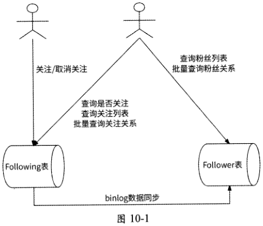
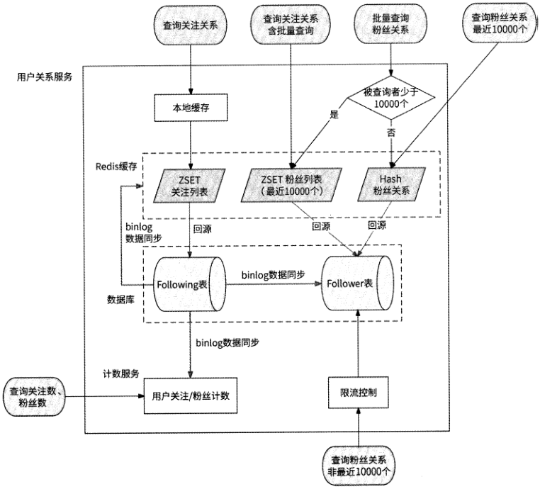
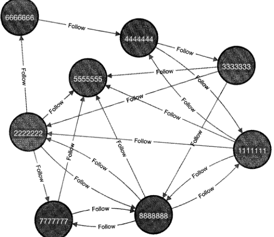
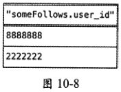
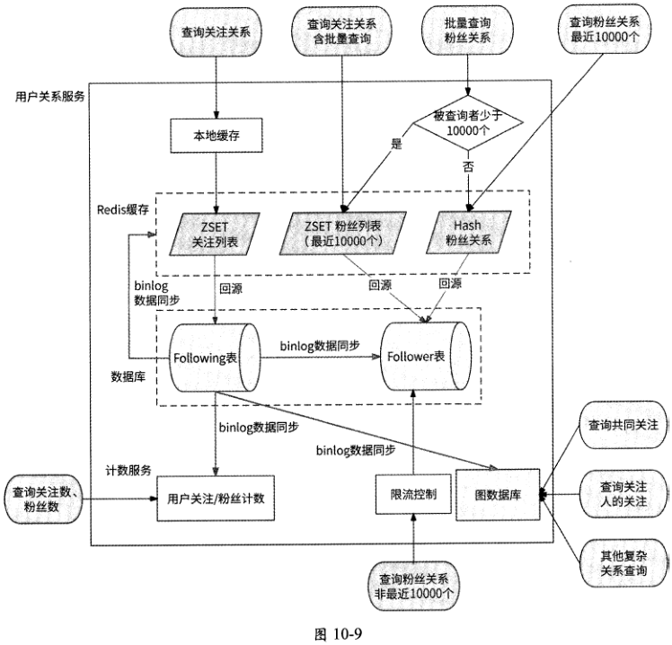

[原 PDF 第 327 页](../%E4%BA%BF%E7%BA%A7%E6%B5%81%E9%87%8F%E7%B3%BB%E7%BB%9F%E6%9E%B6%E6%9E%84%E8%AE%BE%E8%AE%A1%E4%B8%8E%E5%AE%9E%E6%88%98%20%28--%29%20%28manongshu.com%29.pdf#page=327)

# 第10章 用户关系服务

任何注重用户互动的互联网应用，都会将用户之间的关注功能作为产品的重要功能之一，因此它允许用户订阅其他用户的动态，以便及时获取用户的更新和动态。关注功能对互联网应用的重要性体现在如下。

- 促进社交互动：关注功能可以促进用户之间的社交互动，让用户更容易发现和关注其他用户的动态，增加用户之间的互动和交流。

- 个性化推荐：关注功能可以为互联网产品提供更准确的个性化推荐服务，根据用户的关注和兴趣，推荐相关的内容与服务，提升用户的满意度和体验。

- 增加用户黏性：关注功能可以让用户更容易发现和关注自己感兴趣的内容与服务,从而增加用户黏性，提高用户忠诚度。

无论是社交类、内容类、电商类还是其他类型的互联网应用，关注功能已经成为它们必备的功能之一。负责用户关系数据的服务就是用户关系服务，本章将按照如下学习路径来介绍用户关系服务的设计。

- 10.1节介绍用户关系服务的职责。

- 10.2节介绍使用Redis ZSET对象实现用户关系服务的方案。

- 10.3节介绍使用数据库实现用户关系服务的方案。

- 10.4节介绍应该如何设计用户关系的缓存。

- 10.5节介绍使用图数据库实现用户关系服务的方案。

本章关键词：关注列表、粉丝列表、ZSET、分库分表、联合索引、伪从、图数据库。

## 10.1 用户关系服务的职责

用户关系服务负责处理用户之间的关注行为，其提供的相关接口应该包括如下几个。

- 关注与取消关注的接口 ：用户1可以关注用户2,即用户1是用户2的粉丝；同样,用户1可以取消对用户2的关注，即用户1不再是用户2的粉丝。

[原 PDF 第 328 页](../%E4%BA%BF%E7%BA%A7%E6%B5%81%E9%87%8F%E7%B3%BB%E7%BB%9F%E6%9E%B6%E6%9E%84%E8%AE%BE%E8%AE%A1%E4%B8%8E%E5%AE%9E%E6%88%98%20%28--%29%20%28manongshu.com%29.pdf#page=328)

- 查询用户关注列表的接口：查询某用户正在关注其他哪些用户，且应该按照最新关注在先的顺序排列。

- 查询用户粉丝列表的接口：查询某用户正在被其他哪些用户关注，且应该按照最新粉丝在先的顺序排列。

- 查询用户的关注数与粉丝数的接口：查询某用户正在关注几个用户，以及正在被几个用户关注。

- 查询用户关系的接口：查询用户1是否关注了用户2,或者说用户2的粉丝是否包含了用户lo还有批量查询形式，即查询用户1是否关注了指定的若干用户（批量查询关注关系）,以及若干用户是否是用户1的粉丝（批量查询粉丝关系）o

## 10.2 基于Redis ZSET的设计

一开始我们很容易想到使用Redis的ZSET对象来实现用户关系服务,ZSET高效支持数据的插入与查询功能，且很容易实现按照关注时间排序。

对于每个用户来说，都使用两个ZSET对象分别维护其关注列表和粉丝列表。

- 关注列表的Key为“following」用户ID}”，Member为被关注的用户ID,对应的Score为关注行为发生的时间。

- 粉丝列表的Key为“follower」用户ID}”，Member为粉丝用户ID,对应的Score为用户被关注行为发生的时间。

查询某用户的关注列表，就是获取“following.{用户ID}”集合的数据，使用ZREVRANGE命令即可实现按照关注时间从近到远排序的要求：

```text
    ZREVRANGE following_{ID} 0 -1
```

即使有分页查询的要求也很容易实现，比如每页展示100个关注用户，那么查询关注列表第2页的命令如下：

ZREVRANGE following_（用户工D} 100 199

获取用户的粉丝列表也是同理，只不过读取的Key为“follower」用户ID}”。

获取用户的关注数和粉丝数即获取这两个ZSET的长度，对应的Redis命令为ZCARD。

当用户1关注用户2时，就是在用户1的关注列表ZSET和用户2的粉丝列表ZSET中新增一条记录，Score为当前时间戳：

ZADD following_ffl户1时间戳用户2

ZADD follower_fl|户2时间戳用户1

取消关注亦是同理，只不过是在用户1的关注列表ZSET和用户2的粉丝列表ZSET

[原 PDF 第 329 页](../%E4%BA%BF%E7%BA%A7%E6%B5%81%E9%87%8F%E7%B3%BB%E7%BB%9F%E6%9E%B6%E6%9E%84%E8%AE%BE%E8%AE%A1%E4%B8%8E%E5%AE%9E%E6%88%98%20%28--%29%20%28manongshu.com%29.pdf#page=329)

中删除一条记录：

ZREM following_用户 1 用户 2

ZREM follower_ffl户 2 用户 1

当查询用户1是否关注用户2时，既可以查询在用户1的关注列表ZSET中是否包含用户2,也可以查询在用户2的粉丝列表ZSET中是否包含用户1：

ZRANK following_用户 1 用户 2

ZRANK follower_B户 2 用户 1

当批量查询用户1与若干指定用户的关注关系时，可以先使用ZRANGE命令获取用户1的关注列表：

ZRANGE following_用户 10-1

然后在结果中查找这些指定的用户是否存在即可。当批量查询若干指定用户是否是用户1的粉丝时，也是同理。

使用Redis ZSET实现用户关系服务比较简单，不过，它毕竟使用了昂贵稀缺的内存资源，此方案本身有一定的局限性。对于国民级社交应用来说，拥有几百万粉丝的网红、大V数不胜数，更不要说其中的大网红动辄粉丝数上亿了，这就意味着需要存储很多超长的ZSET对象，而这对于Redis来说是一笔昂贵的开销。所以，Redis ZSET方案仅适合社交属性不强，或者用户量级不大的小型应用，并不适合拥有海量用户、社交属性强的应用。

## 10.3 基于数据库的设计

既然存储用户关系需要大量的存储空间，那么还是使用数据库来设计方案为好。

### 10.3.1 最初的想法

创建一个数据表来表示用户1与用户2的关注关系，数据表名为User_relation,表结构如表10-1所示。

表 10-1

```text
                                类 型    含 义
```

字段名

```text
 id    BIGINT    自增主键，无特殊含义
 from_user_id    BIGINT    关注者用户ID
 to_user_id    BIGINT    被关注者用户ID
 type    关注关系枚举，比如：1正在关注，2取消关注    INT
 update_time    DATE    记录修改时间
```

User relation数据表的每行记录都描述了 from user id对to_user_id的关注关系。细

[原 PDF 第 330 页](../%E4%BA%BF%E7%BA%A7%E6%B5%81%E9%87%8F%E7%B3%BB%E7%BB%9F%E6%9E%B6%E6%9E%84%E8%AE%BE%E8%AE%A1%E4%B8%8E%E5%AE%9E%E6%88%98%20%28--%29%20%28manongshu.com%29.pdf#page=330)

心的读者可能已经发现，这里的表结构没有提到将哪个字段作为索引。这是因为在使用数据库实现用户关系服务时，对索引的设计需要考虑一些必要的技术细节，需要经过专门讨论后才能得出最佳设计结论。

为了高效支持查询用户1是否关注了用户2,以及查询某用户的关注列表，我们首先想到的是为from_user_id字段创建索引；同样，为了高效支持查询某用户的粉丝列表，我们也需要为to_user_id字段创建索引。那么，创建这两个索引是不是就可以了？

答案是不可以。假设我们的应用拥有1亿个用户，平均每个用户关注1000个用户，那么User_relation表将拥有至少1千亿条数据。为了支持对数据库的高性能读/写，User_relation表必然要分库分表。

分库分表的依据应该是索引，否则，分库分表将失去其数据分区的优势。假设某数据表T的结构为T(A,B,C),其中A字段是索引。如果将B字段作为分库分表的依据，将T表拆分为100个子表，那么基于A字段值为x的数据查询请求，将不得不访问这100个子表来获取数据，因为A字段值为x的数据可能分布在这100个子表中；而如果使用A字段值来分库分表，那么只需要访问A字段值为x的1个子表即可。所以，我们应该将索引作为分库分表的依据。

然而，User_relation表有两个索引，分别是from_user_id字段的索引和to_user_id字段的索引，那么应该将哪个索引作为分库分表的依据？如果使用from_user_id字段桌分库

分表，那么在查询用户的粉丝列表时要访问所有的子表；使用to_user_id字段同理。这就是我们遇到的最核心的坑点。

### 10.3.2 应对分库分表

如果非要在这两个索引上寻求一个分库分表的依据，那么显然是没有答案的。所以，不如使用两个数据表来描述用户的关注关系：Following表和Follower表。这两个表的结构与User_relation表完全相同，只不过Following表使用from_user_id作为索引,Follower表使用to_user_id作为索引。

当查询用户1是否关注了用户2、查询某用户的关注列表，以及批量查询某用户对若干用户的关注关系时，使用Following表；而当查询某用户的粉丝列表、批量查询若干用户与某用户的粉丝关系时，使用Follower表。这样一来，这几种场景都可以命中索引，提高查询效率。

这种思路要求Following表与Follower表的数据完全一致，所以在创建和修改两者的数据时需要建立数据一致性关系。使用1.14.2节介绍的伪从技术是一种合适的方案，即Follower表作为Following表的伪从，消费Following表产生的数据更新binlog,如图10-1所示。

[原 PDF 第 331 页](../%E4%BA%BF%E7%BA%A7%E6%B5%81%E9%87%8F%E7%B3%BB%E7%BB%9F%E6%9E%B6%E6%9E%84%E8%AE%BE%E8%AE%A1%E4%B8%8E%E5%AE%9E%E6%88%98%20%28--%29%20%28manongshu.com%29.pdf#page=331)



当用户1关注或取消关注用户2时，仅需要在Following表中更新数据，Follower表作为伪从会自动同步最新数据，保证了两者数据的一致性。

综上所述，使用数据库实现用户关系服务的最核心要求，就是使用两个数据表来描述

用户的关注关系，其中Following表为主表，以关注者用户ID为索引；Follower表为伪从，以被关注者用户ID为索引。关注类相关请求访问Following表，而粉丝类相关请求访问Follower表，这两个数据表需要保证数据的一致性。

### 10.3.3 Following表的索引设计

我们应该为Following表创建怎样的索引？这要从它负责的查询功能说起。

首先，Following表需要支持查询用户1是否关注了用户2,即需要运行如下SQL语句，依次查询from user id字段、to_user_id字段和type字段是否满足条件：

SELECT 1 FROM Following WHERE from_user_id =用户 1 AND to_user_id =用户 2 AND

```text
type = 1
```

如果将from_user_id字段作为索引，则数据库会先根据索引快速定位到from_user_id为用户1的数据记录，然后逐个扫描这些记录，找到满足to_user_id 用户2的记录，并检查其type是否为lo如果用户1关注了上万个用户，那么通过索引会筛选出上万条数据记录让数据库逐个扫描。这是一个比较耗时的动作。

更好的做法是使用from_user_id字段和to_user_id字段做联合索引，数据库会根据此联合索引快速查询from user id 用户1、to_user_id为用户2的数据记录。如果查询到相应的记录，则判断type是否为1即可。联合索引可以保证快速定位到用户1是否关注了用户2的相应记录。所以，为了高效支持查询用户之间的关注关系，我们需要创建联合索引

[原 PDF 第 332 页](../%E4%BA%BF%E7%BA%A7%E6%B5%81%E9%87%8F%E7%B3%BB%E7%BB%9F%E6%9E%B6%E6%9E%84%E8%AE%BE%E8%AE%A1%E4%B8%8E%E5%AE%9E%E6%88%98%20%28--%29%20%28manongshu.com%29.pdf#page=332)

idxfollowing:

KEY idx__f oilowing (from_user_id, to_user_id)

其次，Following表需要支持查询用户1的关注列表，并按照关注时间从近到远返回结果，对应的SQL语句如下：

SELECT to_user_id FROM Following WHERE from_user_id =用户 1 AND type=l ORDER BYupdate_time DESC

同样，如果将from_user_id字段作为索引，则数据库会先根据索引快速定位到from_user_id 用户1的数据记录，然后扫描筛选type为1的记录。所以，更合适的索引是from_user_id字段和type字段的联合索引，这样可以免去扫描而直接得到用户关注记录。此外，由于关注列表要按照时间从近到远排序(SQL语句为ORDER BY update timeDESC),所以对查询到的用户关注记录还需要使用额外的临时空间进行排序，这也会给数据库造成负担。我们应该把updatejime字段也加入联合索引中，最终联合索引是由3个字段组成的：

key idx_following_list (from_user_id, type, update_time)

数据库索引保证：索引中的每个字段均按照值的大小排列，且当某个字段的值相同时，

再按照下一个字段继续排序。对于idx_following_list索引来说，先按照from_user_id字段对数据记录进行排序；对于from_user_id字段值相同的记录，再按照type字段排序；对于type字段值相同的记录，再按照updatejime字段排序。所以，当执行上面的SQL语句时，from_user_id为用户1且type为1的记录是天然按照updatejime字段排序的，获取时间从近到远的记录无非就是从最后一条记录开始反向读取，数据库无须再专门使用临时空间对数据记录进行排序，进一步提高了数据库查询性能。为了高效查询用户的关注列表，我

们还需要创建idx_following_list索引。

最后，为了批量查询用户1是否关注了用户2、用户3和用户4,需要执行如下SQL语句：

SELECT to_user_id FROM Following WHERE from_user_id =用户 1 AND to user id IN

```text
 (用户2,用户3,用户4)    ~    "
```

这条语句的筛选条件from userjd^ to_user_id正好可以命中联合索引idx_followingo

总之，对于Following表需要创建两个联合索引，即idx_following和idx_following_list,而且这两个联合索引的第一个字段均为from_user_id。所以，即使按照from_user_id字段对Following表分库分表，其子表也可以充分利用索引的优势。

[原 PDF 第 333 页](../%E4%BA%BF%E7%BA%A7%E6%B5%81%E9%87%8F%E7%B3%BB%E7%BB%9F%E6%9E%B6%E6%9E%84%E8%AE%BE%E8%AE%A1%E4%B8%8E%E5%AE%9E%E6%88%98%20%28--%29%20%28manongshu.com%29.pdf#page=333)

### 10.3.4 Follower表的索引设计

首先，Follower表需要支持查询用户的粉丝列表，并按照关注时间从近到远返回结果。

对应的SQL语句如下：

```text
    SELECT from_user__id FROM Follower WHERE to_user_id=fflP 1 AND type=l ORDER BY
```

update_time DESC

与为Following表创建idx_fbllowing_list索引的思路一样，我们为Follower表创建idx_follower_list 索引：

KEY idx_follower_list(to_user_id, type, update_time)

其次，Follower表需要支持批量查询用户2、用户3、用户4是否是用户1的粉丝。对应的SQL语句如下：

SELECT to_user__id FROM Follower WHERE to_user_id =用户 1 AND from_user_id IN (用户2,用户3,用户4) 一

为了使to_user_id条件和from_user_id条件可以依次命中索引，我们继续创建联合索弓 I idx_follower：

KEY idx_follower(to_user_id, from_user_id)

### 10.3.5 进阶：回表问题与优化

无论是Following表还是Follower表，我们创建的索引都属于非聚集索引。以MySQLInnoDB存储引擎为例，索引被区分为聚集索引和非聚集索引，其中聚集索引指的是将数据记录与索引保存到一起的索引，比如主键索引就是一种典型的聚集索引，InnoDB中的一个数据表就是一个聚集索引；而非聚集索引是分开存储数据记录与索引的，索引仅存储对应数据记录的指针(一种指针的形式是主键)，比如上面创建的4个联合索引就是非聚集索引。

以 Following 表的联合索引 idx_following(from_user_id, to_user_id)为例,执行如下 SQL语句：

SELECT 1 FROM Following WHERE from_user__id =用户 1 AND to_user_id =用户 2 AND

```text
type = 1
```

数据库使用from user id和to user id条件命中了非聚集索引idx_following,并且在其中查询到对应数据记录的主键。为了得到数据记录的type字段值，数据库接着使用主键访问主键索引得到数据记录，读取其type字段值。这条SQL语句依次访问了 idx_fbllowing索引和主键索引。

而如果执行如下SQL语句，不查询type字段：

SELECT 1 FROM Following WHERE from_user__id =用户 1 AND to_user_id =用户 2

[原 PDF 第 334 页](../%E4%BA%BF%E7%BA%A7%E6%B5%81%E9%87%8F%E7%B3%BB%E7%BB%9F%E6%9E%B6%E6%9E%84%E8%AE%BE%E8%AE%A1%E4%B8%8E%E5%AE%9E%E6%88%98%20%28--%29%20%28manongshu.com%29.pdf#page=334)

那么在这条SQL语句命中idx_following索引后，我们会发现所有待查询的字段(from_user_id和to_user_id )均已经在此索引中，所以直接返回结果即可，这条SQL语句并不需要访问主键索引。

上面第1条SQL语句的执行效率要低于第2条SQL语句，因为非聚集索引无法涵盖其查询的字段，所以需要进一步访问主键索引。这个问题被称为“回表”。因此，对于基于非聚集索引的查询，如果待查询的字段均在非聚集索引中，那么可以减少1次索引访问，即防止数据库回表，提高了数据库查询性能。按照这种思路，我们重新考虑在10.3.3节和10.3.4节中创建的那4个索引。

- idx_following(from_user_id, to user id):用于查询用户之间的关注关系。由于此索引中不包含type字段，所以会回表。

- idx_following_list(from_user_id, type, update time):用于查询用户的关注列表。由于此索引中不包含to_user_id字段，所以会回表。

- idx_follower_list(to_user_id, type, update time):用于查询用户的粉丝列表。由于索引中不包含from_user_id字段，所以会回表。

- idx_follower(to_user_id? from_user_id):用于批量查询用户的粉丝关系。由于此索引中已经包含from_user_id字段，所以不需要回表。

上面前3个索引都产生了回表问题。为了进一步提高数据库查询性能，可以对这3个索引进行扩展以防止回表。

- 将 idx_following 索引扩展为(from_user_id, to_user_id, type)o

- 将 idx_following_list 索引扩展为(from_user_id, type, update_time, to_user_id)Q

- 将 idx_follower_list 索引扩展为(to_user_id, type, update_time, from_user_id)0

在这3个索引中加入对应的SQL查询语句所需的全部字段，这样一来，在数据库中查询数据时，仅在非聚集索引上就可以得到结果，避免了不必要的回表操作，数据库查询性能得到进一步提升。这种覆盖了 SQL查询语句所需查询的全部字段的索引被称为“覆盖索引”，它是一种典型的以时间换空间的思路。为非聚集索引加入新字段会使得它的存储空间占用更大，不过好在索引被存储在磁盘上，使用磁盘资源并不是那么奢侈。

### 10.3.6 关注数和粉丝数

虽然可以使用COUNT命令从数据库中获取用户目前的关注数与粉丝数，但是本书8.2.2节介绍过这种方式效率非常低下，更好的方法是使用计数服务单独存储这些数据。我们可以使用伪从技术，创建一个消费者服务作为Following表的伪从，订阅Following表的binlog,当用户1关注或取消关注用户2时，消费者服务会收到此事件对应的binlog,然

[原 PDF 第 335 页](../%E4%BA%BF%E7%BA%A7%E6%B5%81%E9%87%8F%E7%B3%BB%E7%BB%9F%E6%9E%B6%E6%9E%84%E8%AE%BE%E8%AE%A1%E4%B8%8E%E5%AE%9E%E6%88%98%20%28--%29%20%28manongshu.com%29.pdf#page=335)

后在计数服务中更新用户1的关注数和用户2的粉丝数；当读取某用户的关注数和粉丝数时，直接从计数服务中获取数据即可，不需要与数据库交互。

## 10.4 缓存查询

虽然可以将数据库作为用户关系服务的存储选型，但是数据库毕竟是磁盘存储，其性

能表现在高并发读场景中依然会遇到瓶颈。所以，本节我们在10.3节设计的基础上进一步通过缓存来优化高并发读场景的性能。

### 10.4.1 缓存什么数据

对于一个海量用户应用来说，读取用户的关注列表和粉丝列表，以及查询用户之间的关注关系都属于高并发读场景。

大部分互联网应用在设计用户关注功能时，都会限制每个用户的最大关注数量，这是为了防止用户滥用关注功能进行刷粉、刷流量等，避免影响应用内的用户体验和社交环境。如果不限制关注数量，那么有些用户可能会通过关注大量的其他用户来获取更多的关注和粉丝，从而提高自己的曝光率。新浪微博限制一个用户最多可关注2000人。这样的限制，意味着用户关注列表的长度不会超过2000人。因此，我们可以把用户的关注列表全量缓存到Redis中，数据模型与10.2节介绍的一致。

粉丝列表则不同，对用户拥有多少粉丝是没有限制的，这就意味着粉丝列表的长度可能达到数百万人、上千万人甚至上亿人，Redis无法全量缓存这些数据。不过，对于粉丝量巨大的大V来说，大部分用户只会简单地查看粉丝列表的前几页，很少有用户会专门耗费大量时间查看全部粉丝。所以，对于粉丝列表仍然可以使用Redis缓存，只不过仅缓存用户最近的10000个粉丝。对于查询最近10000个粉丝的用户请求，会优先查询Redis缓存；而对于查询10000个以外粉丝的用户请求，才会查询数据库。由于前者在读取粉丝列表的请求中占绝大多数，所以缓存最近10000个粉丝已经足以应对高并发的请求量。

不过，如果黑客恶意发起大量请求拉取最近10000个粉丝以外的粉丝列表，那么这些请求会统统访问数据库，可能造成数据库宕机。我们可以采用限流的方式来解决这个问题,比如在收到读取粉丝列表的请求时，用户关系服务先检查此请求查询的数据是否在最近10000个粉丝之外，如果是，则检查此时的请求量是否已达到限流阈值，对于超过限流阈值的请求拒绝执行。

我们再来讨论一下查询用户之间的关注关系的问题。查询两个用户之间的关注关系非常容易，使用关注列表缓存即可。比如查询用户1是否关注了用户2 （即用户1是否为用户2的粉丝），只需要查询在用户1的关注列表缓存中是否包含了用户2即可。批量查询

[原 PDF 第 336 页](../%E4%BA%BF%E7%BA%A7%E6%B5%81%E9%87%8F%E7%B3%BB%E7%BB%9F%E6%9E%B6%E6%9E%84%E8%AE%BE%E8%AE%A1%E4%B8%8E%E5%AE%9E%E6%88%98%20%28--%29%20%28manongshu.com%29.pdf#page=336)

用户1是否关注了一些用户也是一样的，只需要查询在用户1的关注列表缓存中是否包含了这些用户即可。

比较麻烦的是如何批量查询一些用户是否是用户1的粉丝。如果用户1的粉丝很少(即用户1拥有不超过10000个粉丝),使用缓存可以全量存储，那么此时可以直接查询用户1的粉丝列表缓存；而如果用户1的粉丝众多，Redis仅缓存了最近10000个粉丝，那么此时待查询的用户在缓存中不一定存在。

一种解决方案是使用关注列表缓存反查，即对于不在用户1的粉丝列表缓存中的用户，进一步查询在这些用户的关注列表缓存中是否包含了用户lo比如现在要批量查询100个指定用户是否是大V用户1的粉丝，在用户1的最近10000个粉丝中可以查询到其中的10个用户，那么对于剩下的90个用户，我们开启90个线程来分别查询这90个用户的关注列表缓存。为一个批量查询请求额外创建了 90个线程，来执行90个查询Redis缓存的请求，所以，这种解决方案可能会带来线程暴涨和读请求被放大的问题，而这取决于批量查询的用户数量。

另一种解决方案是进一步缓存粉丝关系，即使用Redis缓存最近查询过的若干用户是否为用户1的粉丝的关系。具体来说，Redis使用Hash对象缓存数据，Key代表用户1,Field代表用户2、用户3、用户4等指定用户，对应的Value表示这些用户是否分别是用户1的粉丝，其中值为1表示是粉丝，值为0表示不是粉丝。如果在待查询的这些用户中至少有一个用户不在此Hash对象中，则需要进一步为其回源查询数据库Follower表：

SELECT from___user_id FROM Follower WHERE to_user_id =用户 1 AND from_user_id IN

```text
(...) AND type=l
```

这种方案会进一步占用Redis的存储空间，且Hash对象可能会随着请求访问量的增加而变得越来越大，我们需要注意设置合理的过期时间。

### 10.4.2 缓存的创建与更新策略

创建缓存很简单，当用户请求访问关注列表或粉丝列表时，用户关系服务会先查询Redis缓存，如果查询不到数据，再进一步从数据库中获取数据，然后在Redis中创建对应的ZSET对象。

当用户1关注或取消关注用户2时，用户1的关注列表缓存和用户2的粉丝列表缓存就失效了。我们可以使用2.4.5节介绍的“先更新数据库，再删除缓存”方案，在数据库中执行完关注、取消关注操作后，将用户1关注列表和用户2粉丝列表的缓存数据从Redis中删除。不过，对于大V来说，被关注的事件会频繁发生。假设有大V用户A,在Imin内奇数秒时有用户读取A的粉丝列表，偶数秒时有用户关注A,那么缓存的工作流程如下。

[原 PDF 第 337 页](../%E4%BA%BF%E7%BA%A7%E6%B5%81%E9%87%8F%E7%B3%BB%E7%BB%9F%E6%9E%B6%E6%9E%84%E8%AE%BE%E8%AE%A1%E4%B8%8E%E5%AE%9E%E6%88%98%20%28--%29%20%28manongshu.com%29.pdf#page=337)

(1) 第1秒，有用户读取A的粉丝列表，此时Redis并未缓存此数据，于是请求会回源数据库获取A的粉丝列表，然后在Redis中创建缓存。

(2) 第2秒，有用户关注A,在数据库中写入关注关系后，Redis中A的粉丝列表被删除。

(3) 第3秒，有用户读取A的粉丝列表，由于Redis已经删除了此数据，所以请求又会回源数据库，然后又在Redis中创建缓存。

(4) 第4秒，有用户关注A, Redis中A的粉丝列表又被删除。

(5) 第5秒，有用户读取A的粉丝列表，于是再次回源数据库，在Redis中创建缓存。

(6) 第6秒，有用户关注A, Redis的缓存再次被删除。

(7) 第7〜60秒，以此类推。

可见，前脚读取粉丝列表的请求在Redis中创建了缓存，后脚此缓存就被关注请求删除了，这就导致读取粉丝列表的请求永远在回源数据库，而Redis缓存完全没有起到作用，甚至在被无意义地反复创建与删除。

虽然现实情况是读取粉丝列表的请求和关注请求不太会恰好交替发生，但是只要比较频繁地发生关注事件，就会造成缓存被频繁地删除与创建，缓存用于应对高并发读请求的作用被削减。所以，对于粉丝列表缓存，并不适合采用“先更新数据库，再删除缓存”方案。缓存数据应该总是存在的，所以更合适的方案是缓存随着数据库的更新而更新。其实

现思路是使用伪从技术：创建专门的消费者服务作为数据库Following表的伪从，订阅binlog,每当Following表有变更(即发生关注、取消关注事件)时，消费者服务都会收到最新数据变更binlog,然后修改缓存。比如用户A关注了用户B,在Following表中写入此数据后，消费者服务收到对应的binlog,得知此时发生了 “用户A关注用户B”的事件，于是在Redis中检查用户B的粉丝列表缓存是否存在；如果存在，则修改缓存数据，即将用户A加入用户B的粉丝列表ZSET中。这样一来，用户的粉丝列表缓存不会因为关注事件而被删除，而是与数据库对齐数据，“用户A关注用户B”的事件可以近实时地被反映在缓存中，后续读取粉丝列表的请求仍然可以命中缓存，而不需要回源数据库，缓存仍然发挥作用。使用伪从技术更新缓存可以有效提高缓存命中率，在缓存与数据库的数据一致性方面表现很好，唯一的顾虑是相对于“先更新数据库，再删除缓存”方案来说，有一点儿开发成本。

至于关注列表缓存，使用“先更新数据库，再删除缓存”方案没有太大问题，毕竟一个用户不太可能总是要关注其他用户，其关注列表相对稳定。当然，关注列表缓存也像粉丝列表缓存一样，使用伪从技术更新缓存也没有什么问题。

综上所述，在关注事件发生后，为了应对缓存失效的问题，关注列表缓存可以被删除,

[原 PDF 第 338 页](../%E4%BA%BF%E7%BA%A7%E6%B5%81%E9%87%8F%E7%B3%BB%E7%BB%9F%E6%9E%B6%E6%9E%84%E8%AE%BE%E8%AE%A1%E4%B8%8E%E5%AE%9E%E6%88%98%20%28--%29%20%28manongshu.com%29.pdf#page=338)

而对于粉丝列表缓存更适合采用伪从技术进行更新。如果不想区别对待关注列表缓存和粉丝列表缓存的更新策略，那么统一使用伪从技术更新缓存就行。

### 10.4.3 本地缓存

大v的关注列表的曝光率要远远大于普通用户的，很多用户都会关心大v关注了哪些人。另外，大V在关注其他用户时相对谨慎，这就意味着他们的关注列表数据比较固定。综合考虑关注列表的访问量大、数据不易变这两个特点，我们可以将大V的关注列表进一步存储到本地缓存中，从而减少访问Redis,进一步提高访问性能。

粉丝列表的数据特点则完全不同。大V的粉丝变动非常频繁（毕竟是网红），并不适合使用本地缓存；而普通用户的粉丝变动虽然相对较小，但是其粉丝列表的访问量也非常小，使用本地缓存不会有很高的缓存命中率，且意义不大。所以，无论是何种用户，都不适合使用本地缓存。

### 10.4.4 缓存与数据库结合的最终方案

经过对数据库设计、缓存设计的详细讨论，我们总结并提炼出缓存与数据库结合的最终方案。图10-2展示了用户关系服务设计最终方案的整体架构图。

这套架构的核心是：Following表为数据库的主表，Follower表、计数服务、Redis缓存都以Following表为标准来更新数据。针对这样设计的用户关系服务，我们再详细描述一下每个接口的工作流程。

（1）关注与取消关注的接口。这个接口直接更新数据库Following表即可响应用户，后续流程对用户来说是完全异步的,Follower表、计数服务、Redis缓存会依赖Following表产生的binlog分别更新数据。假设用户1关注了用户2：

- Follower表会使用from user id （用户1 ）、to_user_id （用户2 ）、关注时间更新表。

- 计数服务会计数消费者请求计数服务增加用户1的关注数和用户2的粉丝数。

- Redis缓存会缓存消费者在用户1的关注列表缓存中加入用户2,在用户2的粉丝列表缓存中加入用户lo

（2 ）查询用户关注列表的接口。用户关系服务先查询处理此请求的服务实例的本地缓存中是否有数据，如果没有数据，则再查询Redis中是否存在对应的数据；如果不存在对应的数据，则回源数据库，将所得到的结果以ZSET对象的形式存储到Redis中。然后，检查此用户的粉丝数是否达到一定的阈值（即是否是大V）,如果达到，则将其关注列表数据也缓存到服务实例的本地缓存中。

[原 PDF 第 339 页](../%E4%BA%BF%E7%BA%A7%E6%B5%81%E9%87%8F%E7%B3%BB%E7%BB%9F%E6%9E%B6%E6%9E%84%E8%AE%BE%E8%AE%A1%E4%B8%8E%E5%AE%9E%E6%88%98%20%28--%29%20%28manongshu.com%29.pdf#page=339)



图 10-2

(3) 查询用户粉丝列表的接口。如果用户查询的是最近10000个粉丝，则先查询Redis；如果查询不到，再回源数据库，将所得到的结果缓存到Redis中。如果用户查询的不是最近10000个粉丝，则需要对请求进行限流，只有当请求量未达到限流阈值时才允许从数据库中查询粉丝列表，以保护数据库不被高并发请求打垮。

(4) 查询用户的关注数与粉丝数的接口。这个接口非常简单，直接调用计数服务获取结果即可。

(5) 查询用户关系的接口。这个接口较为复杂，取决于是否是批量查询：

- 查询用户1与用户2的关注关系，以用户1的关注列表为判断标准，先从Redis中查询在用户1的关注列表缓存中是否存在用户2,如果缓存不存在，则回源数据库，拉取用户1的关注列表并缓存到Redis中。其流程与查询用户关注列表的接口的流程非常相似。

[原 PDF 第 340 页](../%E4%BA%BF%E7%BA%A7%E6%B5%81%E9%87%8F%E7%B3%BB%E7%BB%9F%E6%9E%B6%E6%9E%84%E8%AE%BE%E8%AE%A1%E4%B8%8E%E5%AE%9E%E6%88%98%20%28--%29%20%28manongshu.com%29.pdf#page=340)

- 查询用户1是否关注了若干用户（用户2、用户3、用户4）,依然以用户1的关注列表为判断标准，流程同上，只不过在获取到用户1的关注列表数据后，从中筛选出指定的用户。

- 查询若干用户（用户2、用户3、用户4）是否关注了用户1,则要先查询用户1的粉丝数。

- 如果粉丝数少于10000个，则其查询流程与粉丝列表请求的查询流程非常类似。无论是读取粉丝列表缓存还是回源数据库，只要在获取到用户1的粉丝列表后，查看粉丝列表中是否包含用户2、用户3、用户4即可。最后给出这些用户是否分别关注了用户1的结论。

e如果粉丝数大于10000个，则说明从粉丝列表缓存中可能无法得到准确的关系

判断，此时无法依赖粉丝列表缓存，而只能依赖粉丝关系缓存，即使用Redis

Hash对象形式的缓存。首先请求查询用户2、用户3、用户4是否在用户1的

Hash对象中，然后根据查询结果进行下一步操作：如果这些用户都可以被查

询到，则直接返回是否关注的结果；而如果用户2和用户3不在Hash对象中，

则回源数据库Follower表查询两者与用户1的关注关系，并将结果回写到Redis

Hash对象中。

## 10.5 基于图数据库的设计

使用数据库与缓存结合实现高并发的用户关系服务是一种合格的传统方案，数据库、缓存技术都非常成熟，服务设计成本不是很高，所以在各大公司得到广泛应用。但是本节要介绍的是近年来有一定呼声的NoSQL数据库类型：图数据库。我们曾在1.10节中简单介绍过这种数据库，它以实体为点，以实体间的关系为边建立图结构，目的是更高效地描述和查询实体间的关系。用户关系服务是图数据库的典型应用场景之一，此服务本来就是用来处理用户之间的关注关系问题的，其中的用户就是图数据库的点，用户间关系就是图数据库的边。

接下来以比较知名的图数据库系统Neo4j为例，介绍如何实现用户关系服务。

### 10.5.1 实现用户关系

Neo4j使用Cypher查询语言（CQL ）执行对图数据库数据的读/写操作，CQL不仅遵循数据库SQL语法，而且具有人性化、易理解的语言格式。

每个用户在Neo4j中都是一个节点，我们使用如下CQL语句创建了 8个节点分别代表用户，将用户ID作为节点的属性：

[原 PDF 第 341 页](../%E4%BA%BF%E7%BA%A7%E6%B5%81%E9%87%8F%E7%B3%BB%E7%BB%9F%E6%9E%B6%E6%9E%84%E8%AE%BE%E8%AE%A1%E4%B8%8E%E5%AE%9E%E6%88%98%20%28--%29%20%28manongshu.com%29.pdf#page=341)

```text
    CREATE    (ul:User (user_id:1111111))
    CREATE    (u2:User {user_id:2222222))
    CREATE    (u3:User {user_id:3333333})
    CREATE    (u4:User {user_id:4444444})
    CREATE    (u5:User {user_id:5555555})
    CREATE    (u6:User {user_id:6666666})
    CREATE    (u7:User (user_id:7777777})
    CREATE    (u8:User {user_id:8888888})
```

为User节点设置的user_id属性用于记录用户ID,同时为此属性创建其到节点的索引，以便可以通过用户ID快速找到对应的User节点：

```text
    CREATE INDEX ON :User(user_id)
```

用户之间的关注关系是连接节点的边。如果用户U1关注了用户U2,那么在对应的User节点之间创建标签名为Follow类型的边，同时使用关注行为发生的时间作为边的属性：

MATCH (ul:User {user_id: 1111111)) , (u2:User {user_id:2222222}) // 先查找到User 节点

CREATE (ul) - [: Follow{follow_time: *2022-01-20 22 : 32 : 55 * ) ] -> (u2) // 创建 Follow

```text
类型的关系，并记录关注时间    -
```

为了方便介绍用户关系服务各个接口的实现，我们为目前这8个用户随机建立一些关

注关系:

```text
    CREATE (ul)    [:Follow(follow_time:12022-04-17    22:05:37*}]->(u2)
    CREATE (ul)    [:Follow{follow_time:12022-11-03    01:46:08*}]~>(u4)
    CREATE (ul)    06:26:24*}]->(u5)    [:Follow{follow_time:* 2021-09-06
     CREATE    [:Follow{follow_time:* 2022-06-12    22:50:38*}]->(u8)    (ul)
     CREATE    (u2)    [:Follow(follow_time:* 2020-06-30    22:42:44’)]->(u5)
     CREATE    01:44:11*)]->(u6)    (u2)    [:Follow(follow^time:* 2021-09-11
     CREATE    [:Follow(follow_time:* 2022-03-07    04:58:48’}]->(u7)    (u2)
     CREATE    [:Follow(follow_time:12021-06-26    15:09:07*}]->(u8)    (u2)
     CREATE    ll:41:07f}]->(u2)    (u3)    [:Follow{ follow__time: 1 2022-06-17
     CREATE    19:00:18*}]->(u5)    (u3)    [:Follow{follow_time:* 2022-07-31
                 [:Follow{follow^time:* 2020-06-19    02:08:05’}]-〉(u8)
     CREATE    (u3)
     CREATE    (u4)    [:Follow{ follow__time : * 2020-02-05    15:11:5" }]->(ul)
     CREATE    00:10:41*}]->(u3)    (u4)    [:Follow{follow_time:* 2020-01-05
     CREATE    [:Follow{follow_time:12021-12-25    05:31:25»}]->(u4)    (u6)
     CREATE    (u7)    [:Follow(follow_time:12020-07-23    10:43:55*}]->(u5)
     CREATE    (u7)    [:Follow{follow_time:12021-12-02    01:04:50»}]->(u8)
     CREATE    21:06:32*)]->(ul)    (u8)    [:Follow{ follow___time: 12020-02-12
     CREATE    [:Follow{follow^time:* 2023-04-14    08:18:11'}]->(u2)    (u8)
     CREATE    21:58:13*)]->(u5)    (u8)    [:Follow{foilow^time:'2023-02-12
     CREATE    [:Follow(follow_time:* 2020-09-06    22:32:59*)]->(u7)
```

(u8)

在Neo4j操作界面中可以看到，创建这些关系后形成的图形数据如图10・3所示。

[原 PDF 第 342 页](../%E4%BA%BF%E7%BA%A7%E6%B5%81%E9%87%8F%E7%B3%BB%E7%BB%9F%E6%9E%B6%E6%9E%84%E8%AE%BE%E8%AE%A1%E4%B8%8E%E5%AE%9E%E6%88%98%20%28--%29%20%28manongshu.com%29.pdf#page=342)



图 10-3

例如，查询用户ul的关注列表，就是查询其对应的User点主动与哪些节点建立了Follow类型的边。执行如下CQL语句：

```text
    MATCH (u:User(user_id:1111111})-[f:Follow]->(v:User) RETURN v.user_id,
```

f.follow_time ORDER BY f.follow_time DESC

使用Follow类型的边的follow_time倒序排列，即可满足关注列表从近到远时间顺序的要求，执行此语句得到的关注列表结果如图10・4所示。

,'v.user_idH “f.foUowKimV

```text
                             4444444    *'2022-11-03 01:46:08H
                             8888888    »2022-06-12 22:50:38*'
                             2222222    H2022-04~17 22:05:37°
                             5555555    ”2021-09-06 @6:26:24°
```

图 10-4

查询用户u8的粉丝列表，就是查询哪些User节点主动与用户u8对应的User节点建立了 Follow类型的边，并按照follow_tinie倒序排列：

```text
    MATCH (u:User)-[f:Follow]->(v:User(user_id:8888888}) RETURN u.user_id,
```

f.follow_time ORDER BY f.follow_time DESC

执行此语句得到的粉丝列表结果如图10-5所示。

[原 PDF 第 343 页](../%E4%BA%BF%E7%BA%A7%E6%B5%81%E9%87%8F%E7%B3%BB%E7%BB%9F%E6%9E%B6%E6%9E%84%E8%AE%BE%E8%AE%A1%E4%B8%8E%E5%AE%9E%E6%88%98%20%28--%29%20%28manongshu.com%29.pdf#page=343)

ou.user_id" Hf.follow_timeH

**2022-06-12 22:50:38”

1111111

,•2021-12-02 01:04:50n

7777777

°2021-06~26 15:09:07**

2222222

**2020-06-19 02:08:05”

3333333

图 10-5

批量查询用户ul、用户u2、用户u3是否是用户u8的粉丝，就是查询它们对应的3个User节点是否有Follow类型的边指向用户u8对应的User节点：

```text
    MATCH (u:User)-[f:Follow]->(v:User{user_id:8888888)) WHERE u.user_id IN
```

[1111111,2222222,3333333] RETURN u.user_id

执行此语句得到的结果如图10・6所示。

**u.user„id*'

3333333

1111111

2222222

图 10-6

除了查询基本的用户关系接口，使用图数据库还可以非常容易地实现一些高级查询功能接口，如果这些查询使用传统数据库实现，则往往会比较沉重。下面举两个例子。

(1 )查询用户U1和用户U2的共同关注人，Neo4j只需要执行一条CQL语句就可以高效完成这个任务：

```text
     MATCH (u:User{user_id:1111111})-[:Follow]->(commonFollows)<-[:Follow]-(v:User
 (user_id:2222222}) RETURN commonFollows.user_id
```

对应的查询结果如图10・7所示。

ncommonFollows* user„idn

5555555

8888888

图 10-7

(2)查询在用户ul的关注列表中有谁关注了用户u5o如果使用10.4.4节介绍的传统方案，则需要取用户ul的关注列表和用户u5的全量粉丝列表的交集，而Neo4j只需要这样：

```text
     MATCH (u:User(user_id:1111111})-[:Follow]->(someFollows)-[:Follow]->(v:User
 (user_id:5555555}) RETURN someFollows.user_id
```

[原 PDF 第 344 页](../%E4%BA%BF%E7%BA%A7%E6%B5%81%E9%87%8F%E7%B3%BB%E7%BB%9F%E6%9E%B6%E6%9E%84%E8%AE%BE%E8%AE%A1%E4%B8%8E%E5%AE%9E%E6%88%98%20%28--%29%20%28manongshu.com%29.pdf#page=344)

对应的查询结果如图10・8所TKo



虽然这种复杂的高级查询功能接口一般不是用户关系服务的核心接口，但是有了这些功能接口，可以在一定程度上提高互联网应用内用户的互动性。比如你在使用微博的过程中点击打开了某用户的主页，虽然你更想看到的是该用户的头像以及其发布的内容，但是如果在该用户的主页上同时显示“你关注的谁也关注了该用户”或“你和该用户都关注了谁”，则可以进一步表达你们可能的兴趣和交际圈，起到锦上添花的作用。

### 10.5.2 应用权衡

图数据库是一种新兴的数据库类型，它以图形结构来存储和处理数据，适合处理复杂的关系型数据和网络数据。尽管图数据库具有许多优点，如具有高效的查询性能、灵活的数据模型和可扩展性，但目前它还没有得到真正的广泛应用。笔者认为可能的原因是图数据库缺乏标准化，各种图数据库产品使用了不同的数据模型、不同的设计原理、不同的查询语言来实现图数据库，不仅研发工程师学习图数据库的成本较高，而且由于缺乏统一的

基础理论，很多数据库产品在实现图数据库时仍然在底层使用了其他NoSQL数据库。所以，对图数据库产品是否能够发挥图形数据的高效查询和保持高可用性是存疑的，一些公司对全量推广图数据库的态度也是相对保守的。

如果公司对推广图数据库的态度相对保守，则可以让图数据库承担一些非核心的但是能发挥其优势的接口实现。在10.4.4节给出的最终方案的整体架构的基础上，我们引入图数据库来负责复杂关系的查询，引入的思路也是借助伪从技术：图数据库为数据库Following表的伪从，随着Following表的数据变更而构建用户关系图数据，日常图数据库不负责处理用户关系服务的核心接口，只有非核心的、复杂关系查询的接口才由图数据库处理。此外，如果Redis或其他数据库发生故障，则在故障期间核心接口可以访问图数据库获取数据。也就是说，可以将图数据库作为用户关系的热备存储。

最后，基于图数据库设计的用户关系服务的完整架构如图10.9所示。

[原 PDF 第 345 页](../%E4%BA%BF%E7%BA%A7%E6%B5%81%E9%87%8F%E7%B3%BB%E7%BB%9F%E6%9E%B6%E6%9E%84%E8%AE%BE%E8%AE%A1%E4%B8%8E%E5%AE%9E%E6%88%98%20%28--%29%20%28manongshu.com%29.pdf#page=345)



## 10.6 本章小结

实现高可用、高性能的用户关系服务，关键在于对各个存储系统的合理使用。

首先将数据库作为用户关系数据的最终存储。使用数据库存储海量用户关系势必要分库分表，所以最关键的设计就是需要把关系数据冗余存储到两个结构完全一样的数据表中。其中,Following表为主数据表，将from_user_id作为索引核心字段，负责用户的关注与取消关注、查询关注关系和查询关注列表的请求，而Follower表为Following表的伪从，复制完全相同的数据，但其索引核心字段为to_user_id,负责查询粉丝关系和查询粉丝列表的请求。另外，在这两个表的索引设计中可以使用覆盖索引，以进一步提高数据库

查询性能。

[原 PDF 第 346 页](../%E4%BA%BF%E7%BA%A7%E6%B5%81%E9%87%8F%E7%B3%BB%E7%BB%9F%E6%9E%B6%E6%9E%84%E8%AE%BE%E8%AE%A1%E4%B8%8E%E5%AE%9E%E6%88%98%20%28--%29%20%28manongshu.com%29.pdf#page=346)

然后将Redis作为数据库的缓存。用户的关注列表和用户的粉丝列表使用ZSET对象缓存，最近查询的粉丝关系则使用Hash对象缓存。我们需要重点关注的是大V,大V的粉丝量巨大，Redis无法全量缓存其粉丝列表，于是选择只缓存最近10000个粉丝。因为大部分读取粉丝列表的请求就是读取粉丝列表的前几页，至于读取粉丝列表后几页的请求，就只能交给数据库处理了，我们可以对这类请求进行限流以防止击垮数据库。Redis也被作为数据库Following表的伪从，用于实时地更新关注列表、粉丝列表的缓存。此外，对于关注列表还可以由每个服务实例本地缓存，以进一步减轻Redis的访问压力。

图数据库也很适合存储用户关系。图数据库以每个用户为节点，以用户之间的关注关系为边连接节点，最终形成图形数据。使用图数据库不仅可以方便地拉取用户的关注列表和用户的粉丝列表，而且能轻松地实现一些复杂关系的查询。我们可以仅使用图数据库来实现用户关系服务，也可以将它作为数据库的热备使用。

最后将用户的关注数、粉丝数交给计数服务维护。计数服务也被作为数据库Following表的伪从，以实时更新关注与粉丝的计数值。

总之，用户关系服务以数据库Following表为数据中心，将最新的用户关系数据复制到Follower表、Redis、图数据库和计数服务中。
