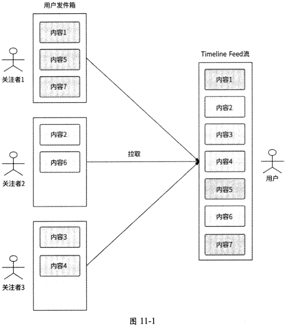
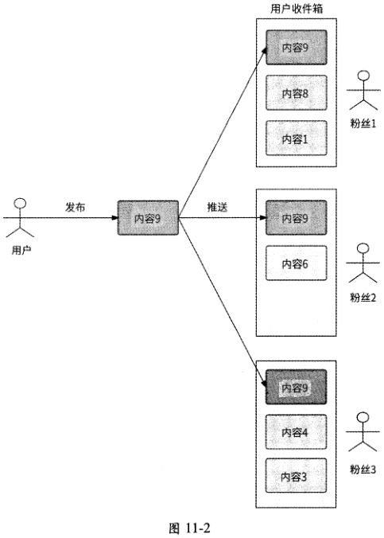
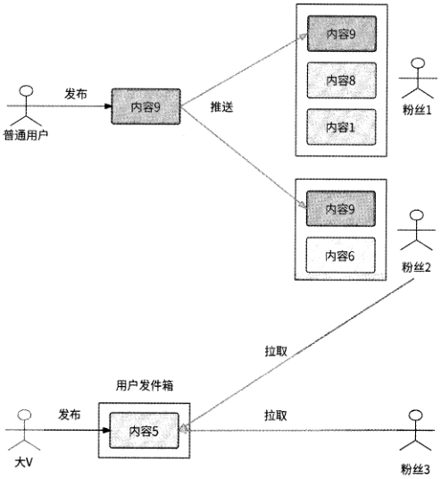
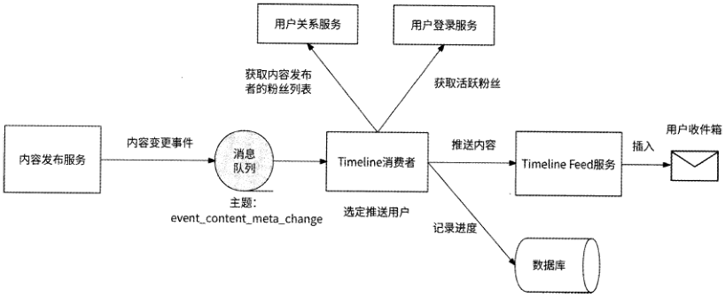
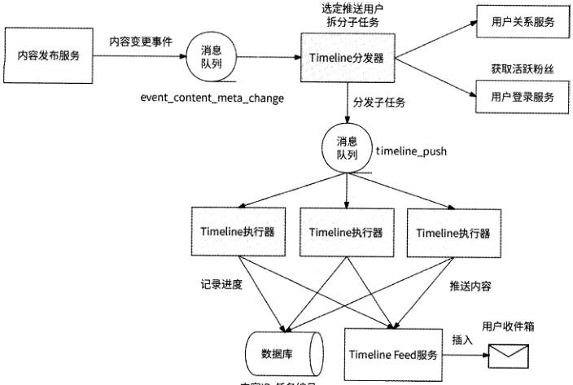
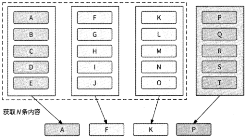
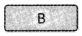
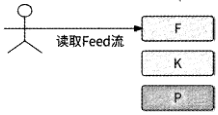

[原 PDF 第 347 页](../%E4%BA%BF%E7%BA%A7%E6%B5%81%E9%87%8F%E7%B3%BB%E7%BB%9F%E6%9E%B6%E6%9E%84%E8%AE%BE%E8%AE%A1%E4%B8%8E%E5%AE%9E%E6%88%98%20%28--%29%20%28manongshu.com%29.pdf#page=347)

# 第11章 Timeline Feed服务

本章我们将讨论近年来各互联网产品非常核心的一个业务场景：Timeline Feed流，以及Timeline Feed服务的设计。本章的学习路径如下。

- 11.1节和11.2节分别介绍Feed流的分类，以及Timeline Feed流的功能特性。

- 11.3节和11.4节分别介绍以拉模式和推模式实现Timeline Feed服务。

- 11.5节介绍推模式和拉模式如何互补发挥优势。

- 11.6节详细介绍通过推拉结合模式实现Timeline Feed服务的关键技术细节，包括内容推送、收件箱设计、Timeline Feed流数据构建等。

本章关键词：推拉结合、推送子任务、ZSET、联合索引、字典序、合并。

## 11.1 Feed流的分类

Feed流的功能在当今的互联网应用和网络社交平台中非常重要，它是一种以时间线为基础的信息流展示形式，把用户感兴趣的内容呈现在用户的Feed页面上。如果你使用过一些互联网应用就会发现，很多互联网应用的主页都是Feed页面，它们把Feed流当作自己的“门面”。Feed流在内容聚合维度上包括但不限于如下几种形式。

- 推荐Feed流：按照你的浏览兴趣聚合内容，你可能不认识Feed流内容的发布者,但是他发布的内容你可能很感兴趣。

- 关注Feed流：你关注的用户发布的内容被聚合为Feed流，并且按照内容的发布时间从近到远展示你所关注的那些人最近发布的内容。按照内容的发布时间排序,也就是遵循时间线，所以这种Feed流是一种Timeline Feed流。微信朋友圈和微博首页都是典型的对关注Feed流的应用。

- 附近Feed流：顾名思义，就是你附近的用户最近发布的内容，这对于社交类应用来说较为常见。

推荐Feed流的重点是推荐算法，附近Feed流的重点是地理位置判断，其相关技术差异巨大，不具备通用性，故而不在我们的讨论范围内。我们要重点讨论的是基于时间线的

[原 PDF 第 348 页](../%E4%BA%BF%E7%BA%A7%E6%B5%81%E9%87%8F%E7%B3%BB%E7%BB%9F%E6%9E%B6%E6%9E%84%E8%AE%BE%E8%AE%A1%E4%B8%8E%E5%AE%9E%E6%88%98%20%28--%29%20%28manongshu.com%29.pdf#page=348)

关注Feed流，即Timeline Feed流，本章就来介绍Timeline Feed服务的设计思路。

## 11.2 Timeline Feed流的功能特性

Timeline Feed流提供的数据应该是我们所关注的人在指定的时间段内发布的内容列表，并且内容按照时间由近及远排序。

用户在客户端浏览Timeline Feed页面时一般有如下两种操作方式。

- 下拉操作：刷新Feed流，拉取当前时间最新的N条Feed流。

- 上滑操作：拉取更早时间的N条Feed流。

另外，用户首次进入Timeline Feed页面时，展示的应该是当前时间最新的Feed流，与下拉操作的效果是一样的。

用户不断下拉Timeline Feed页面，就是不断地获取关注者最新发布的内容。如果在一段时间内关注者没有发布最新的内容，则会得到空数据。而不断上滑，则是不断地获取关注者更早发布的内容。虽然用户的理解是不停地上滑，就能看到很久之前的内容，但实际上几乎没有任何应用的Timeline Feed流允许用户这么做。例如微信朋友圈，一个1年都没有使用微信的用户重新登录微信，他是不可能在朋友圈中刷出这1年的好友动态的。笔者在网上专门查询了 “不停地刷朋友圈能刷到几天前”这个问题，有人实测是12天，也有人实测是30天，笔者也亲测了一次，最多刷到28天前的动态就不能继续上滑了。为什么不同用户实际上能刷到的最大天数是不一样的？笔者可以大胆地猜测，朋友圈限制了每个用户上滑的动态总数，当刷出的动态数量超过一定的阈值时就禁止继续上滑，只不过有的人朋友圈12天的动态就达到阈值了，而有的人朋友圈28天才达到阈值。实际上，很多Timeline Feed流产品也是这么做的。

总之，Timeline Feed服务主要负责两种读取数据的方式：下拉与上滑。其中，下拉负责拉取用户从未看过的最新内容列表，上滑负责拉取更早的内容列表，并限制所能拉取到的内容最大数量。无论是何种读取方式，内容列表均按照内容的发布时间从近到远排序。

## 11.3 拉模式与用户发件箱

一种较为符合我们直觉的实现Timeline Feed服务的方式是拉模式。每个内容发布者都有自己的“发件箱”，每当用户发布一个内容时，就把内容存放到发件箱中，由其他用户来拉取内容。

如图11-1所示，当用户获取Timeline Feed流时，系统会先拉取此用户的关注列表，

[原 PDF 第 349 页](../%E4%BA%BF%E7%BA%A7%E6%B5%81%E9%87%8F%E7%B3%BB%E7%BB%9F%E6%9E%B6%E6%9E%84%E8%AE%BE%E8%AE%A1%E4%B8%8E%E5%AE%9E%E6%88%98%20%28--%29%20%28manongshu.com%29.pdf#page=349)

然后遍历每个关注者的发件箱，取出他们发布的全部内容，最后根据发布时间倒序排列后

展示给用户。



所谓的发件箱只是一种使描述更形象的代称，我们不需要专门设计发件箱，它实际上就是第7章讲的内容发布系统（服务）所负责存储的用户内容列表，所以拉模式就是从内容发布服务中拉取关注者的内容列表。可见，在拉模式下不需要为Timeline Feed服务单独设计存储系统，实现非常简单。因此，当一个互联网应用在初期阶段用户规模较小时，

很适合使用这种方式来实现Timeline Feed流的功能。

不过，在拉模式下，用户每刷新一次Feed流，系统就需要读取N个用户的发件箱（这里的N是指用户关注的人数），这意味着一次用户请求会放大产生N倍的读请求，故而这种模式也被称为“读扩散”。如果用户量级较大，那么获取Feed流会是一个高并发场景，而且用户关注的人数也会较多。所以，这种读扩散会增加用户请求延迟，并可能击垮存储用户内容列表的数据库。

[原 PDF 第 350 页](../%E4%BA%BF%E7%BA%A7%E6%B5%81%E9%87%8F%E7%B3%BB%E7%BB%9F%E6%9E%B6%E6%9E%84%E8%AE%BE%E8%AE%A1%E4%B8%8E%E5%AE%9E%E6%88%98%20%28--%29%20%28manongshu.com%29.pdf#page=350)

## 11.4 推模式与用户收件箱

另一种实现Timeline Feed服务的方式是推模式。与拉模式相反，在推模式下，每个用户都有一个“收件箱”，当某用户成功发布了内容时，系统会将该内容推送到其每个粉丝用户的收件箱中；粉丝用户在获取Feed流时，直接从收件箱中读取内容即可，如图11-2所示。



在推模式下，用户获取Feed流的性能比在拉模式下好，系统不需要获取用户的关注列表，也不需要遍历拉取每个关注者的内容列表。但是推模式也有如下一些核心缺点。

- 存储压力大：在推模式下，要求每个用户都有收件箱，这势必要为收件箱引入存储系统，用户越多，收件箱占用的存储资源就越多。比如某用户有100万个粉丝，该用户发布了一条内容后，在这100万个粉丝的收件箱中都要存储这条内容，这里消耗了大量的存储空间。

[原 PDF 第 351 页](../%E4%BA%BF%E7%BA%A7%E6%B5%81%E9%87%8F%E7%B3%BB%E7%BB%9F%E6%9E%B6%E6%9E%84%E8%AE%BE%E8%AE%A1%E4%B8%8E%E5%AE%9E%E6%88%98%20%28--%29%20%28manongshu.com%29.pdf#page=351)

- 写扩散：某用户发布了一条内容后，需要将此内容推送到100万个粉丝的收件箱中，也就是系统内部会产生100万个写请求，这里产生了粉丝数倍数的写请求放大，如此巨量的写请求可能会击垮收件箱所依赖的数据库。

## 11.5 推拉结合模式

我们可以很清楚地看到，拉模式和推模式的优缺点是互补的：前者无存储压力，但是有读请求压力；后者无读请求压力，但是有写请求压力和存储压力。既然它们可以互补，那么我们的思路就是将两者结合起来，即形成推拉结合模式。

### 11.5.1 结合思路

虽然拉模式的优势是简单、无存储压力，但是拥有海量用户的互联网公司会在意它的优势吗？这些公司既有足够的研发投入，又有充足的存储资源，其更在意的是用户体验，在拉模式下，用户获取Feed流的性能表现是其最无法接受的。因此，我们应该重点分析推模式。采用推模式可以有效地提高用户获取Feed流的性能，但是用户在发布内容时，则会带来存储压力和写请求压力，而且用户的粉丝数越多，这两方面的压力越大。

那么，推模式和拉模式如何结合呢？关键的突破口在于一条内容的发布者有多少粉丝，即与第io章介绍的一样，需要根据用户是否是粉丝数超过某个阈值的大V来进行策略选择：当用户发布内容时，如果此用户不是大V,则采用推模式把内容发送到粉丝的收件箱中，这样一来，即使推模式会带来存储压力大和写扩散的问题，也会由于粉丝数较少而使影响可控；当用户获取Timeline Feed流时，系统先检查其关注列表中有没有大V,如果有大V,则仅采用拉模式来拉取大V的内容列表，而非大V的内容早已在用户的收件箱中了，直接读取收件箱就好。推拉结合模式的架构如图11・3所示。

在推拉结合模式下，大V的内容发布和对Feed流的获取采用的是拉模式，这样可以有效避免因发布者的粉丝量大而带来的存储压力大和写扩散的问题;非大V的内容发布和对Feed流的获取则采用推模式，这样可以避免在获取Feed流时产生的读扩散问题。

现在我们可以初步得出结论：需要采用推拉结合模式来实现Timeline Feed服务。

[原 PDF 第 352 页](../%E4%BA%BF%E7%BA%A7%E6%B5%81%E9%87%8F%E7%B3%BB%E7%BB%9F%E6%9E%B6%E6%9E%84%E8%AE%BE%E8%AE%A1%E4%B8%8E%E5%AE%9E%E6%88%98%20%28--%29%20%28manongshu.com%29.pdf#page=352)

用户收件箱



图 11-3

### 11.5.2 区分活跃用户

需要强调的是，推拉结合模式的效果依赖在用户的关注列表中有多少大V。如果在某用户的关注列表中是清一色的普通用户，那么对于此用户来说，推拉结合模式也就等于推模式，可以发挥推模式的优势；如果在某用户的关注列表中是清一色的大V,那么推拉结合模式会完全退化为拉模式，这就意味着只关注了大V的用户依然要接受拉模式的缺点，即获取Feed流的响应速度可能会很慢。其实不光是这种只关注了大V的情况，如果在用户的关注列表中有很多大V,那么也会存在一样的问题。

大V在发布内容后，我们依然可以采用推模式，但是现在仅将内容推送给粉丝列表中的部分活跃用户，因为这些用户使用Timeline Feed流功能的频率相对较高，所以将内容主动推送到他们的收件箱中更有可能提高获取Timeline Feed流的性能。至于那些很长时间都没有打开应用的用户，则完全没有必要把内容存储到他们的收件箱中。如果有一天这些用户登录应用并使用Timeline Feed流功能，那么保持采用推拉结合模式来获取数据就好。

综上所述，对推模式和拉模式的结合方式可以总结如下。

[原 PDF 第 353 页](../%E4%BA%BF%E7%BA%A7%E6%B5%81%E9%87%8F%E7%B3%BB%E7%BB%9F%E6%9E%B6%E6%9E%84%E8%AE%BE%E8%AE%A1%E4%B8%8E%E5%AE%9E%E6%88%98%20%28--%29%20%28manongshu.com%29.pdf#page=353)

- 如果内容的发布者是普通用户，则完全采用推模式，把内容推送到全部粉丝的收

件箱中。

- 如果内容的发布者是大V,则进一步区分活跃用户和非活跃用户。对于活跃用户，采用推模式；对于非活跃用户，采用拉模式。

## 11.6 实现Timeline Feed服务的关键技术细节

前面我们已经介绍了拉模式、推模式的思想和优劣，并得出了两者结合的理论基础。不过，理论毕竟是空洞的，本章介绍的是如何实现Timeline Feed服务，所以必然要把理论转化为实践，我们需要讨论一些关键的技术细节。

### 11.6.1 内容与用户收件箱的交互

在推模式下，当用户发布了一条内容后，系统需要把此内容推送到粉丝的收件箱中，那么如何实现呢？第7章已经介绍过，内容发布流程是由内容发布服务执行的，一种简单粗暴的方法是在内容发布服务的内容发布流程后增加一段逻辑：首先获取内容发布者的粉丝列表，然后从用户登录服务中获取这些粉丝的最近登录时间，从而筛选出活跃粉丝，最后依次遍历这些粉丝并请求Timeline Feed服务，将已发布的内容插入这些粉丝的收件箱中。

然而，这种做法并不可取，Timeline Feed逻辑被严重耦合到内容发布服务中，各个服务的职责边界遭到了破坏。除了这个缺陷，推送的可用性也比较差：内容发布服务的遍历推送行为毕竟发生在服务实例进程中，内容发布服务的升级、扩容或服务质量问题都可能导致实例进程退出，这就会打断正在进行的遍历推送。比如某服务实例正在向1000个用户的收件箱中推送内容，当它只完成100个用户的推送时实例就退出了，这等于遍历推送被中止，有900个用户并没有收到此内容。

要将内容发布服务与Timeline Feed服务解耦，而且要尽可能提高推送的可用性，最好的办法就是在这两个服务之间建立消息队列通道。实际上，7.5节已经介绍过，内容发布服务通过消息队列（主题为event_content_meta_change ）将内容变更事件通知给各种内容分发渠道，本章中的用户收件箱其实也是一种厉容分发渠道。为此，我们创建一个消费

者服务（暂时命名为Timeline消费者）负责接收内容发布服务的内容变更事件，如果发现有新内容发布，则执行遍历推送操作。

Timeline消费者也会记录每条内容的推送进度，以便当推送过程中断时可以在失败的地方重试。一种记录每条内容推送进度的方式是使用排序的用户ID： Timeline消费者使用数据库记录每个内容ID的最近成功推送用户ID。在推送一条内容时，Timeline消费者先将待推送用户按照用户ID从小到大排列，然后按照排序结果遍历推送。在内容推送过程

[原 PDF 第 354 页](../%E4%BA%BF%E7%BA%A7%E6%B5%81%E9%87%8F%E7%B3%BB%E7%BB%9F%E6%9E%B6%E6%9E%84%E8%AE%BE%E8%AE%A1%E4%B8%8E%E5%AE%9E%E6%88%98%20%28--%29%20%28manongshu.com%29.pdf#page=354)

中，每推送成功一个用户，就更新内容的最近成功推送用户ID。如果某次推送遇到失败,则直接返回错误。如果Timeline消费者返回错误，或者消费者实例退出，那么消息队列就可以得知事件推送失败，于是消息队列会发起重试，让Timeline消费者重新消费事件。Timeline消费者在重新消费某内容发布的事件后，查询到对应的内容ID的消费进度，于是继续进行被中断的推送流程。

内容与用户收件箱的交互架构如图11.4所示。



内容!D：最近推送用户

图 11-4

Timeline消费者作为内容与用户收件箱交互的枢纽，需要负责的工作流程如下。

(1 ) Timeline消费者作为内容分发渠道，订阅主题为event_content_meta_change的事件，此事件是由内容发布服务产生的，表示内容变更。

(2) Timeline消费者收到内容变更事件，进一步检查事件类型是否代表内容成功发布，如果是，则执行下一步，否则跳过。

(3) 根据事件对应的内容ID,从数据库中获取此内容的推送进度，获取到的结果被记为latest_user_id；如果未获取到结果，则latest_user_id值为0。

(4) 从用户关系服务中获取内容发布者的粉丝列表，如果粉丝数不大于推送阈值，则将这些粉丝作为待推送用户，执行第6步，否则执行下一步。

(5 )从用户登录服务中获取这些粉丝的最近登录时间，将那些最近登录时间距现在小于〃天的粉丝作为待推送用户。

(6 )将待推送粉丝列表按照用户ID从小到大排列，从用户ID大于latest_user_id值的

```text
那条用户记录开始遍历推送。    ~    ~
```

[原 PDF 第 355 页](../%E4%BA%BF%E7%BA%A7%E6%B5%81%E9%87%8F%E7%B3%BB%E7%BB%9F%E6%9E%B6%E6%9E%84%E8%AE%BE%E8%AE%A1%E4%B8%8E%E5%AE%9E%E6%88%98%20%28--%29%20%28manongshu.com%29.pdf#page=355)

（7） 当遍历到某用户时，请求Timeline Feed服务向此用户的收件箱中插入对应的内容。如果请求成功，则继续遍历下一个用户；否则，抛出错误，消息队列保证对应的事件

会被重新消费，回到第2步。

（8） 当为这些粉丝推送内容都完成时，消费结束。

### 11.6.2 推送子任务

Timeline消费者遍历推送毕竟是串行操作，如果需要将一条内容推送给更多的粉丝，那么遍历推送可能会消耗更长的时间，进而造成内容发布服务与Timeline消费者之间消息队列中的消息积压，导致内容到用户收件箱的投递延迟。我们可以将对大量粉丝的遍历推送拆分为多个并行执行的子任务，每个子任务负责对一批粉丝的推送。

假设通过测试发现，Timeline消费者对不超过1000个粉丝的遍历推送耗时较小，那么我们就可以将1000作为拆分子任务的粒度。假设要将内容A推送给3000个粉丝，且粉丝的用户ID是1〜3000,那么这个任务就可以被拆分为3个子任务。

- 子任务1：负责将内容遍历推送给粉丝1〜1000。

- 子任务2：负责将内容遍历推送给粉丝1001〜2000。

- 子任务3：负责将内容遍历推送给粉丝2001〜3000。

现在Timeline消费者不再负责推送内容，而是负责分发推送子任务（所以这里我们把它的称呼改为Timeline分发器）。任务的执行由一个新的消费者来完成，我们称之为Timeline执行器。Timeline分发器向Timeline执行器分发任务也是通过消息队列实现的。我们建立名为timeline_push的主题，Timeline分发器将子任务写入此主题中，而Timeline执行器从此主题中读取子任务并执行。

具体来说，拆分推送子任务的工作流程如图11・5所示。

（1 ） Timeline分发器依然订阅主题为event_content_meta_change的事件,接收内容成功发布的事件，假设此时内容A发布事件到来。

（2 ） Timeline分发器确定内容A的推送粉丝，即获取内容发布者的粉丝列表。如果有必要，则获取活跃粉丝。

（3）在确定目标粉丝后（假设选出3000个粉丝，粉丝的用户ID依次是1〜3000）,Timeline分发器以1000为粒度拆分子任务，并生成3个子任务消息，消息内容需要包括内容ID、发布时间、任务编号以及目标粉丝的用户IDo其中：

① 子任务1的任务编号为1,目标粉丝为i~iooo；

② 子任务2的任务编号为2,目标粉丝为1001〜2000;

[原 PDF 第 356 页](../%E4%BA%BF%E7%BA%A7%E6%B5%81%E9%87%8F%E7%B3%BB%E7%BB%9F%E6%9E%B6%E6%9E%84%E8%AE%BE%E8%AE%A1%E4%B8%8E%E5%AE%9E%E6%88%98%20%28--%29%20%28manongshu.com%29.pdf#page=356)

```text
    ③    3的任务编号为3,目标粉丝为2001〜3000。    子任务
```

(4 ) Timeline分发器将这3个消息发送到timeline_push消息队列。

(5 ) Timeline执行器的3个消费者实例il、i2、i3分别接收到这3个消息，各自开始执行子任务，且每个消费者实例都使用数据库记录“内容ID■任务编号”的推送进度。

获取内容发布

者的粉丝列表



内容!D-任务编号:最近推送用户iD

图 11-5

### 11.6.3 收件箱保存什么数据

既然收件箱用于保存被推送来的内容，那么是不是表示当某用户发布了一段文本内容时，这段文本需要被完整地复制到每个粉丝的收件箱中？假设一个拥有10000个粉丝的用户发布了一篇占用100KB存储空间的文章，如果将文章原封不动地复制到这10000个粉丝的收件箱中，那么总共将占用约1GB的存储空间，即内容需要的存储空间被放大10000倍，这造成了明显的存储空间浪费。所以，收件箱并不适合，也没有必要保存内容本身。

实际上，收件箱在意的是用户的Timeline Feed流需要哪些内容，以及这些内容是否可以按照发布时间从近到远排序。所以，在收件箱中只需要保存每条内容的内容ID和发布时间即可,其中内容ID用于唯一标识一条内容，发布时间用于Timeline排序。

[原 PDF 第 357 页](../%E4%BA%BF%E7%BA%A7%E6%B5%81%E9%87%8F%E7%B3%BB%E7%BB%9F%E6%9E%B6%E6%9E%84%E8%AE%BE%E8%AE%A1%E4%B8%8E%E5%AE%9E%E6%88%98%20%28--%29%20%28manongshu.com%29.pdf#page=357)

### 11.6.4 读请求参数

Timeline Feed服务的读请求无非就是获取Timeline Feed流的请求，我们分析一下读请求需要哪些参数。

获取Timeline Feed流有两种方式，即下拉和上滑。其中，下拉用于获取当前时间最新的N条内容，上滑用于获取已加载内容的发布时间之后的N条内容。从逻辑上看，下拉操作实际上获取的就是最新的N条内容，所以只需要内容数量这一个参数就可以满足要求。而上滑操作不太一样，用户需要先读取一次Feed流的内容后，才可能会上滑获取更多的内容。这意味着用户希望查看的是发布时间早于他已读的最后一条内容的更多内容，

所以上滑操作的参数还需要当前最后一条内容的发布时间。

对于下拉操作，还要考虑一种情况：可能你关注的多个用户的内容发布发生于同一时间。假设内容数量为10,你关注的20个用户在同一时间1688576521发布了内容，最开始你的Timeline Feed页面展示了用户1 ~ 10的内容；当你继续上滑获取更早的Feed流时，如果请求参数是时间戳1688576521和内容数量10,即语义是获取发布时间小于或等于1688576521的最近10条内容，那么所获取到的数据依然是用户1〜1。的内容，而无法如预期一样获取到用户11~ 20的内容。

所以，为了涵盖同一时间发布内容的情况，上滑操作还需要记录已经展示在Feed流中的最后一条内容的内容ID (last_content_id),即获取Timeline Feed流的语义变为：获取发布时间小于或等于1688576521,且排列在last_content_id之后的N条内容。

基于下拉操作和上滑操作的不同处理逻辑，我们自然需要使用一个参数来表示操作类

型，最终Timeline Feed服务的读请求应该包含如下这些参数。

- 操作类型：是下拉操作还是上滑操作。

- 时间戳：目前Feed流中最后一条内容的发布时间，为上滑操作所需要。

- 内容数量：每次获取Feed流时返回多少内容。

- 最后内容ID：上滑操作需要已经展示在Feed流中的最后一条内容的内容ID。

### 11.6.5 使用数据库实现收件箱

我们可以使用数据库实现用户收件箱，创建数据表inbox,表结构如表11・1所示。

表 11-1

```text
                           _________________ 类 型_________________    含 义
```

字段名

```text
id_______________ BIGINT    自增主键，无特殊含义
user_id    用户ID    BIGINT
content_id    内容ID    BIGINT
publish_time    内容发布时间    DATE
```

[原 PDF 第 358 页](../%E4%BA%BF%E7%BA%A7%E6%B5%81%E9%87%8F%E7%B3%BB%E7%BB%9F%E6%9E%B6%E6%9E%84%E8%AE%BE%E8%AE%A1%E4%B8%8E%E5%AE%9E%E6%88%98%20%28--%29%20%28manongshu.com%29.pdf#page=358)

将内容插入收件箱中非常简单，就是新增一条记录，这里不再赘述。例如，用户111进行下拉操作读取最新的Feed流，就是读取此用户ID下publishjime最大的N条记录，对应的SQL语句如下：

```text
     SELECT content_id, publish_time FROM inbox WHERE user_id = 111 ORDER BY
 publish_time DESC LIMIT N    一
```

这条SQL语句的意思是选择用户ID为111的数据记录，按照publish time从大到小排列，然后选出前N条记录。为了使这条SQL语句的执行效率最高，我们需要为inbox表创建联合索引idx_feed(user_id, publish_time, content_id)o这个索引具有如下优势。

- 通过用户ID可以快速定位到一个用户收件箱中的全部记录。

- 对于同一用户ID (即user_id字段值相同)的所有记录，publishjime是有序的，免去了排序操作。

- content_id作为索引的最后一部分，可以使此索引完全覆盖上述SQL语句的要求，即为覆盖索引，避免了不必要的回表操作。

如果inbox表需要分库分表，则以user_id为依据即可。

用户111进行上滑操作读取更早的Feed流，就是根据此用户已读的Feed流中最后一条内容的内容ID (last_content_id )和发布时间(ts ),执行如下SQL语句：

```text
     SELECT content_id, publish_time FROM inbox WHERE user_id = 111 AND
 (publish_time < ts OR (publish_time = ts AND content_id < last_content_id))
ORDER BY publish__time DE SC LIMIT N    ~    -    -
```

这条SQL语句稍微有点儿复杂，它的意思是获取用户111的数据记录，然后额外进行两次筛选：首先筛选出publishjime小于ts的记录，然后筛选出publishjime等于ts,但是content_id比last_content_id小的记录。第一次筛选的条件就是获取发布时间更早的内容，而第二次筛选的条件是为了处理多条内容与last_content_id的发布时间相同的情况，此时应该筛选出收件箱中排列在last_content_id下一位的内容，筛选依据是content_id小于 last_content_ido

为什么当多条内容的发布时间与用户已读的最后一条内容的发布时间相同时，通过content_id小于last_content_id就可以准确定位到下一条内容？这就要从联合索引的特性说起了。

联合索引 idx_feed(user_id, publish_time, content_id)保证：user_id 相同的记录，此索引会默认按照publishjime从小到大排列；而publishjime也相同的记录，此索引会默认按照content_id从小到大排列。如表11・2所示的是用户111收件箱中的内容列表在数据库的联合索引上的排列情况。

[原 PDF 第 359 页](../%E4%BA%BF%E7%BA%A7%E6%B5%81%E9%87%8F%E7%B3%BB%E7%BB%9F%E6%9E%B6%E6%9E%84%E8%AE%BE%E8%AE%A1%E4%B8%8E%E5%AE%9E%E6%88%98%20%28--%29%20%28manongshu.com%29.pdf#page=359)

表 11-2

```text
        userjd    contentjd    publishjime    对应的主键ID
 111    1678722102    163    1
                      1678722105    128    2
```

111

627__________

```text
 111    1678723222    3
```

4

```text
 111    1678723222    1673
 111    1678723222    9266    5
 111    6    1678723222    10833
 111    7    1678723222    19671
```

8___________

```text
 111    1678910100    833
 111    927    9    1678910150
 111    1678910150    1991    10
 111    1678910150    2025    11
 111    1678952612    135    12
```

可见，用户111的数据记录按照publishjime从小到大排列，如果publish time相同，则按照content_id从小到大排列。

假设刷新一次Feed流显示3条内容，用户111进入Timeline Feed页面，等于进行下拉操作，此时执行的SQL语句如下：

```text
    SELECT content_id, publish_time FROM inbox WHERE user_id = 111 ORDER BY
```

publish_time DESC LIMIT 3

由于指定了 ORDER BY publishjime DESC,所以数据库从idx_feed索引的最后一条记录开始依次扫描3条记录，即主键ID为12、11、10的3条记录，于是用户111将得到内容ID为135、2025、1991的3条内容。

用户在继续上滑获取更早的Feed流之前，其上次刷到的最后一条内容是主键ID为10的记录，即已读的最后一条内容的内容ID为1991,发布时间为1678910150,此时应该执行的SQL语句如下：

```text
    SELECT content_id, publish_time FROM inbox WHERE user_id = 111 AND
 (publish_time < 1678910150 OR (publish_time = 1678910150 AND content_id < 1991))
```

ORDER BY publish_time DESC LIMIT 3

同样，由于指定了 ORDER BY publishjime DESC,数据库会在idx_feed索引上从后向前定位到publishjime为1678910150且content_id小于1991的记录，并依次向前获取3条publish_time小于或等于1678910150的记录，即得到主键ID为9、8、7的3条记录。所以，用户上滑会得到内容ID为927、833、19671的3条内容。

用户继续上滑，此时已读的最后一条内容的内容ID为19671,发布时间为1678723222,

[原 PDF 第 360 页](../%E4%BA%BF%E7%BA%A7%E6%B5%81%E9%87%8F%E7%B3%BB%E7%BB%9F%E6%9E%B6%E6%9E%84%E8%AE%BE%E8%AE%A1%E4%B8%8E%E5%AE%9E%E6%88%98%20%28--%29%20%28manongshu.com%29.pdf#page=360)

执行的SQL语句如下：

```text
     SELECT content_id, publish_time FROM inbox WHERE user_id = 111 AND
 (publish_time < 1678723222 OR (publish_time = 1678723222 AND content_id < 19671))
```

ORDER BY publish_time DESC LIMIT 3

执行逻辑相同，用户将依次得到内容ID为10833、9266、1673的3条内容。以此类推，用户继续上滑，会得到内容ID为627、128、163的内容。紧接着再次上滑，则得到的内容为空。

无论用户是下拉还是上滑，对应的SQL语句的高效执行都依赖联合索引idx_feed(user_id, publish time, content_id),数据库保证在 idx_feed 索引上同一用户收件箱中的内容列表按照publishjime升序排列，publish_time相同的内容再按照content_id升序排列。所以，指定ORDER BY publishjime会使得数据库在idx_feed索引上从后向前扫描，不需要数据库专门对数据记录按照publishjime倒序排列。使用数据库的EXPLAIN命令可以查看SQL语句的执行计划，我们对上面的两条SQL语句执行此命令会得到如下执行信息，可以佐证我们的分析。

- Using Index：命中索引。

- Backward Index Scan：在索引上从后向前扫描记录。

在索引上从后向前扫描记录，可以保证用户在进行上滑操作时，通过SQL查询条件publish time = ts AND content id < last_content_id 可以准确定位到同一发布时间 ts 的上一条内容。

使用数据库实现用户收件箱的优势是可以充分利用廉价的磁盘空间，劣势是数据库应对高并发的能力有限，如果Timeline Feed场景的流量巨大，那么数据库不一定有与之匹配的处理能力，只能通过横向进一步分库分表来解决高并发问题。假设Timeline Feed场景有10万QPS的流量，而目前按照user_id维度仅将inbox表分为10个子表,那么一个子表平均会承受10000 QPS的流量；只有将inbox表重新扩展为100个子表，才能将每个子表的访问压力平均降低到1000 QPSo

### 11.6.6 使用Redis ZSET实现收件箱

既然用户收件箱是用于保存内容ID的，并且内容ID按照内容发布时间排序，那么Redis ZSET对象看起来非常适合作为收件箱的存储选型。从直觉上看，使用ZSET对象可以按照如下所述实现收件箱。

- Key为“inbox_{用户ID}”，表示一个ZSET对象是哪个用户的收件箱。

- Member 为内容 ID。

- Score为内容发布时间。ZSET可以按照内容发布时间从小到大排列内容ID。

[原 PDF 第 361 页](../%E4%BA%BF%E7%BA%A7%E6%B5%81%E9%87%8F%E7%B3%BB%E7%BB%9F%E6%9E%B6%E6%9E%84%E8%AE%BE%E8%AE%A1%E4%B8%8E%E5%AE%9E%E6%88%98%20%28--%29%20%28manongshu.com%29.pdf#page=361)

将一条发布于1688659398时间的内容999写入用户111的收件箱中，执行如下ZADD命令即可：

ZADD inbox_lll 1688659398 999

用户进行下拉操作读取最新的Feed流，即获取其收件箱中最新的N条内容，也就是从ZSET中获取Score最大的N个Member,所以可以执行如下ZREVRANGE命令：

ZREVRANGE inbox_lll 0 N-l WITHSCORES

接下来是进行上滑操作获取更早的Feed流的实现。上一节我们讨论过，用户在进行上滑操作获取更早的Feed流时，需要使用最后已读内容的发布时间(ts)和内容ID(last_content_id)来筛选下一次应该读取的内容。ZSET的实现方式比较灵活，下面给出三种可行的方案。

第一种方案是直接使用last_content_id定位更早的Feed流。首先执行ZREVRANK命令获取last content id成员在ZSET中的排名(Rank),然后执行ZREVRANGE命令读取排名后的N条内容。这两个命令需要原子执行，所以我们使用Lua脚本来实现，并传入KEYS=(inbox_ffi户 ID}, ARGV=(last_content_id, N)来执行脚本。

-先获取最后内容的排名

```text
     local rank = redis.call(* ZREVRANK1, KEYS[1], ARGV[1])
```

--如果找不到成员则返回空

```text
     if rank == false then
        return {}
```

end

—从最后内容的下~~位开始拉取N条内容

```text
     local res = redis . call (1 ZREVRANGE' f KEYS [1] , rank + 1, rank + ARGV[2], 1 WITHSCORES 1)
     return res
```

这种方案实现比较直接，不需要依赖发布时间，可以天然覆盖多条内容在同一时间发布的场景。不过，它的局限性也很大，它仅适合拉模式，而不适合推拉结合模式。因为在推拉结合模式下，在所得到的Timeline Feed流数据中，某次Feed流的最后一条内容不一定来自用户收件箱，而是可能来自关注者的发件箱，因此在继续上滑获取更早的Feed流时，last_ccmtent_id在用户收件箱中定位不到数据，导致拉取用户收件箱数据的结果永远为空。

采用推拉结合模式必定需要考虑内容发布时间，所以这里给出第二种方案，即像上一节的数据库实现方式一样，使用ts和last_content_id共同获取上滑内容。

在数据库实现方式中，是将从筛选出的第一条满足publish_time小于或等于ts,但content_id小于last content id的记录开始的内容作为用户上滑应得到的结果的，ZSET也应该采用这种思路。不过，数据库能够保证这种筛选思路准确的核心是联合索引idx_feed,这个索引保证同一用户收件箱中的内容按照publish time升序排列，当publish time相同

[原 PDF 第 362 页](../%E4%BA%BF%E7%BA%A7%E6%B5%81%E9%87%8F%E7%B3%BB%E7%BB%9F%E6%9E%B6%E6%9E%84%E8%AE%BE%E8%AE%A1%E4%B8%8E%E5%AE%9E%E6%88%98%20%28--%29%20%28manongshu.com%29.pdf#page=362)

时再按照content id升序排列。数据库中的publish_time和content_id分别对应ZSET中的Score和Member,且ZSET中的成员按照如下规则排序：

- 成员按照其Score值从小到大排列。

- 当Score值相同时，再按照其Member值的字典序从小到大排列。

乍一看，ZSET的成员排序规则和数据库联合索引idx_feed好像是一样的，但是ZSET把Member视为字符串，其排序依据是字典序，而不是数字顺序。仍以上一节中用户111收件箱中的内容为例，ZSET产生的排列结果如表11-3所示。

表 11-3

```text
              Member (contentjd)    Score (publish_time)
 163    1678722102
 128    1678722105
 10833    1678723222
 1673    1678723222
 19671    1678723222
 627    1678723222
 9266    1678723222
 833    1678910100
 1991    1678910150
 2025    1678910150
 927    1678910150
 135    1678952612
```

我们来看表11-3中数据的第3 ~ 6行，虽然这4个成员的Score相同，但是Member的排列结果却是10833、1673、19671、627。这是因为ZSET将Member值视为字符串类型，所以使用了字典序排列，而不是数字顺序。因此，此时ZSET无法使用与数据库实现方式相同的筛选条件来获取下一刷Feed流的数据。

好在我们有办法让字典序的执行和数字顺序一样，那就是将所有成员的Member值都格式化为等长的字符串。这属于第三种方案。内容ID是64位整数，其可表示的最大整数是18446744073709551615,将其转换为字符串后的长度为20位。我们可以先将内容ID转换为字符串，并向前补0,直到字符串的长度正好达到20位，然后将其存储到Member字段中，如表11・4所示。

[原 PDF 第 363 页](../%E4%BA%BF%E7%BA%A7%E6%B5%81%E9%87%8F%E7%B3%BB%E7%BB%9F%E6%9E%B6%E6%9E%84%E8%AE%BE%E8%AE%A1%E4%B8%8E%E5%AE%9E%E6%88%98%20%28--%29%20%28manongshu.com%29.pdf#page=363)

表 11-4

```text
           内容ID    Member 值    字典序
            10833    00000000000000010833    00000000000000000627
            1673    00000000000000001673    00000000000000001673
            19671    00000000000000019671    00000000000000010833
             627    00000000000000019671    00000000000000000627
```

可见，补0后字符串的排列正好和整数顺序627、1673、10833、19671完全吻合。

这种方案要求在将内容插入用户收件箱中前,将内容ID格式化为20位长度的字符串。对应的Go语言代码如下：

```text
    //将内容插入用户收件箱中
    // userid：用户 ID
    // ts：内容发布时间
    // contentld：内容 ID
    func (t *TimelineFeedService) InsertlnBox(ctx context.Context, userid, ts,
contentld int64) error {
        //拼接用户收件箱Key
        key := fmt.Sprintf(ninbox_%dnA userid)
        //将内容工D格式化为20位长度函字符串，以0开头
        formatMember := fmt.Sprintf(H%020dnz contentld)
        // Member值为20位长度的字符串，Score 内容发布时间
        return redisClient.ZAdd(ctx, key, &redis.Z{
```

Score: float64 (ts)f

Member: formatMember,

```text
        }) .Err ()
    }
```

按照这种方式插入内容后，用户111收件箱中的ZSET成员排列情况如表11-5所示。

表 11-5

```text
              Member (contentjd)    Score (publish_time)
 163    1678722102
 128    1678722105
 627    1678723222
 1673    1678723222
 9266    1678723222
 10833    1678723222
 19671    1678723222
 833    1678910100
 927    1678910150
 1991    1678910150
 2025    1678910150
 135    1678952612
```

[原 PDF 第 364 页](../%E4%BA%BF%E7%BA%A7%E6%B5%81%E9%87%8F%E7%B3%BB%E7%BB%9F%E6%9E%B6%E6%9E%84%E8%AE%BE%E8%AE%A1%E4%B8%8E%E5%AE%9E%E6%88%98%20%28--%29%20%28manongshu.com%29.pdf#page=364)

此时我们可以看到，当Score值相同时，Member确实是按照content_id的数字顺序排列的。ZSET终于拥有了与数据库的联合索引idx_feed相同的排序特性，此时我们可以使用与数据库实现方式相同的筛选条件来获取下一刷Feed流的数据了。具体流程如下。

(1 )执行ZREVRANGEBYSCORE命令获取Score值小于或等于ts的全部Member：

ZREVRANGEBYSCORE inbox_lll ts 0 WITHSCORES

(2) 从前向后遍历获取结果。如果某成员的Score值小于或等于ts,但Member值小于last_content_id,则停止遍历。

(3) 从停止遍历的位置开始截取最多N条记录，作为上滑操作需要展示的内容ID列表。

这里有必要附上此方案实现上滑操作的Go语言代码：

```text
    //此结构体表示Feed流中的一条内容
```

type FeedContentInfo struct (

ContentID int64 // 内容 ID

PublishTime int64 //内容发布时间

```text
    // GlideUp函数：上滑操作获取Feed流
    // userid:用户 ID
    // ts：已读最后一条内容的发布时间
    // last_content_id：已读最后一条内容的内容工D
    // N：获取几条内容
    func (t *TimelineFeedService) GlideUp(ctx context.Context, userid, ts,
```

last_content_id int64, N int) (

feedList []FeedContentlnfo, err error) (

```text
        //拼接Key： inbox_用户工D
        key := fmt. Sprintf (Hinbox__%d" r userid)
        // 执行 Redis 命令 ZREVRANGEBYSCORES :Lnbox_用户工D ts 0 WITHSCORES
        res := redisClient.ZRevRangeByScoreWithScores(ctx, key, &redis.ZRangeBy{
```

Min: ”0”，

Max: fmt.Sprint(ts),

```text
        })
        if res.Err() != nil {
           err = res.Err()
```

return

```text
        }
        //遍历结果
        for i := 0; i < len(res.Vai()); i++ {
           //定位到上次读取的最后一条内容
           if res.Vai()[i].Member.(string) == fmt.Sprint(last_content_id) {
              //截取之后的内容    ~
```

—

```text
              cutRes := res.Vai()[i+1:]
              for item := range cutRes (
```

H最多获取N条内容

```text
                  if len(feedList) == N (
```

[原 PDF 第 365 页](../%E4%BA%BF%E7%BA%A7%E6%B5%81%E9%87%8F%E7%B3%BB%E7%BB%9F%E6%9E%B6%E6%9E%84%E8%AE%BE%E8%AE%A1%E4%B8%8E%E5%AE%9E%E6%88%98%20%28--%29%20%28manongshu.com%29.pdf#page=365)

break

```text
                  }
                  contentld, _ := strconv.Parselnt(item.Member.(string), 10, 16)
                  feedList = append(feedList, FeedContentlnfo{
```

ContentID: contentld,

PublishTime: int64(item.Score)r

```text
                  })
               }
```

return

```text
           }
        }
```

return

ZSET的第一个满足Score值小于或等于ts,但Member值小于last_content_id的成员，就是下一刷Feed流的首条内容，其正是依赖经过特殊处理后的ZSET的排序规则与数据库的联合索引idx_feed保持一致。这种方案能够保证在推拉结合模式下准确地获取到下一刷Feed流的数据，所以它是我们的最终选择。

使用Redis实现用户收件箱的优势是可以依靠Redis的高性能应对高并发的TimelineFeed场景，劣势是用户收件箱占用了昂贵的内存资源，公司付出的资源成本较高。

### 11.6.7 通过推拉结合模式构建Timeline Feed数据

从11.6.1节的介绍可以看出，推拉结合模式对于内容发布侧来说非常清晰，就是粉丝少的用户采用推模式，粉丝多的用户对活跃粉丝采用推模式，对其他用户采用拉模式。那么，对于用户读取侧呢？怎么才能体现推拉结合模式？

当用户读取Timeline Feed流时，如果拉取关注列表中所有用户的发件箱，那么就是拉模式；如果只读取收件箱中的内容，那么就是推模式；只有选择拉取关注列表中一部分用户的发件箱，才是推拉结合模式。那么，需要拉取哪些用户的发件箱？这就要排除收件箱中内容的发布者了，比如用户A关注了用户B和用户C,但是收件箱中只有用户B发布的内容，这说明用户C发布的内容并没有被推送到用户A的收件箱中，或者用户C压根就没有发布内容，所以只对用户C采用拉模式。

最终推拉结合的边界点是：收件箱中内容的发布者在发布内容时采用了推模式，而对

在关注列表中但未向收件箱中投递内容的用户采用拉模式。所以，用户在读取TimelineFeed流时，应该通过如下工作流程进行选择。

(1) 拉取用户的关注列表。

(2) 读取收件箱中的内容(采用推模式)，并从内容发布服务中获取内容发布者的用户IDo

[原 PDF 第 366 页](../%E4%BA%BF%E7%BA%A7%E6%B5%81%E9%87%8F%E7%B3%BB%E7%BB%9F%E6%9E%B6%E6%9E%84%E8%AE%BE%E8%AE%A1%E4%B8%8E%E5%AE%9E%E6%88%98%20%28--%29%20%28manongshu.com%29.pdf#page=366)

(3 )计算在用户的关注列表中，但并不属于收件箱中内容发布者的用户，拉取内容(采用拉模式)o

在明确了推拉结合模式的执行条件后，我们再来分析应该如何将推送的数据和拉取得

到的内容组合起来作为用户下一刷Feed流的内容。这时就需要对发件箱和收件箱中的内容列表进行合并操作。举一个例子，假设现在要拉取M个关注者发件箱中的内容，则流程如下。

(1 )从收件箱中读取N条内容。

(2)从M个关注者的发件箱中分别拉取N条内容。

(3)对这M+1个内容列表进行合并操作，保证:

```text
    ①    内容按照发布时间从近到远排序;
    ②    对于发布时间相同的内容    ，按照内容ID从大到小排列o
```

(4 )合并排序得到前N条内容，这样用户就获取到了 Timeline Feed流。

如图11・6所示是合并操作的一个例子。

```text
                              3个关注者的发件箱    用户收件箱
```



! & 11

] r~o



I T [ H ]「一M—T I R I

合并排序



图 11-6

[原 PDF 第 367 页](../%E4%BA%BF%E7%BA%A7%E6%B5%81%E9%87%8F%E7%B3%BB%E7%BB%9F%E6%9E%B6%E6%9E%84%E8%AE%BE%E8%AE%A1%E4%B8%8E%E5%AE%9E%E6%88%98%20%28--%29%20%28manongshu.com%29.pdf#page=367)

当用户下拉获取最新的Feed流时，推拉结合模式的工作流程如下。

(1) 拉取用户的关注列表。

(2) 检查关注列表中哪些关注者向用户收件箱中投递了内容，而将没有投递内容的关注者作为拉取内容的目标，假设人数为肱。

(3 )从内容发布服务中拉取这M个关注者发布内容的时间小于或等于当前时间的最近N条内容，得到M个内容列表。

(4) 从用户收件箱中获取最近N条内容。

(5 )使用这M+1个内容列表构建Timeline Feed流的结果：

① 对比每个内容列表的首条内容，选出发布时间值最大的内容。如果有多条内容的发

布时间相同，则选择内容ID最大的那条内容。

② 把该内容从其所属的内容列表中移除，并插入Timeline Feed流的尾部。

③ 如果Timeline Feed流的长度不足N,则继续循环对比内容列表的首条内容，直到所有的内容列表均为空。

而当用户上滑获取更早的Feed流时(依然设最后一条内容的内容ID为last_content_id,发布时间为ts),推拉结合模式的工作流程如下。

(1) 拉取用户的关注列表，同样检查关注列表中哪些关注者向用户收件箱中投递了内容。

(2) 对于未投递内容的M个关注者，从内容发布服务中拉取每个关注者在ts时刻及此时刻之前发布的最近N+1条内容，得到M个内容列表。

(3) 检查在这肱个内容列表中，哪个内容列表的首条内容的发布时间等于ts,且内容ID大于或等于last_content_ido如果在某个内容列表中找到了这样的内容，则说明用户之前上滑读取Feed流时已经读过了这条内容，所以要将此内容从内容列表中移除，这时内容列表的长度为N (这就是在第2步中拉取N+1条内容的原因)o

(4 )从用户收件箱中获取发布时间小于或等于ts,且内容ID小于last_content_id的N条内容，获取方式和11.6.4节、11.6.6节介绍的一致。

(5) 使用这M+1个内容列表构建Timeline Feed流的结果，其流程与用户下拉获取最新的Feed流时一致。

最后，我们举一个完整的例子来说明在推拉结合模式下Timeline Feed流数据的构建过程。假设用户111关注了 5个用户，分别是用户200、用户211、用户222、用户233、用户244,而在用户111的收件箱中有用户222、用户233、用户244推送的内容。我们来

[原 PDF 第 368 页](../%E4%BA%BF%E7%BA%A7%E6%B5%81%E9%87%8F%E7%B3%BB%E7%BB%9F%E6%9E%B6%E6%9E%84%E8%AE%BE%E8%AE%A1%E4%B8%8E%E5%AE%9E%E6%88%98%20%28--%29%20%28manongshu.com%29.pdf#page=368)

看看在用户111进入Timeline Feed页面(等同于下拉)和之后的3次上滑这4次请求的过程中,Timeline Feed服务分别做了什么事情。

当用户111进入Timeline Feed页面时，Timeline Feed服务收到下拉类型的获取Feed流的请求，此时它的处理逻辑如下。

(1)获取用户111的关注列表和收件箱，发现需要从用户200和用户211的发件箱中拉取内容。为了方便举例，假设用户200、用户211的发件箱以及用户111的收件箱中的内容列表和发布时间如图11・7所示。

```text
                用户20。发件箱    用户2U发件箱    用户111收件箱
               内容ID    发布时间    发布时间    内容ID    内容!D    发布时间
               32850    1689089522    50015    1689087139    25218    1689087991
               16020    1688986368    71658    1688986368    38376    1689087139
               19732    1688905999    18253    1688975221    12572    1688986368
               61186    1688718647    73798    1688803287    75256    1688803287
               80723    1688616936    92090    1688617305    81709    1688718647
                                   82553    1685305893    13320    1688617305
                                                        39203    1688616936
```

图 11-7

(2) 从内容发布服务中拉取用户200和用户211最近发布的3条内容，将分别得到一个内容列表。

① list_200=[(32850,1689089522), (16020,1688986368), (19732,1688905999)],用户 200最近发布的3条内容。

② list_211=[(50015,1689087139), (71658,1688986368), (18253,1688975221)],用户 211最近发布的3条内容。

(3) 从用户收件箱中读取最近3条内容，将得到内容列表list_lll=[(25218,1689087991),(38376,1689087139), (12572,1688986368)]O

(4 )将在推拉结合模式下得到的这3个内容列表进行合并操作。

① 对比list_200、list_211和list_lll的首元素，发现内容32850的发布时间值最大，所以将它作为此次Feed流的第1条内容，同时将list_200更新为[(16020,1688986368),(19732,1688905999)]。

② 继续对比list_200、list_211和list_lll的首元素，发现内容25218的发布时间值最大，所以将它作为此次Feed流的第2条内容，同时将list_lll更新为[(38376,1689087139),(12572,1688986368)]。

[原 PDF 第 369 页](../%E4%BA%BF%E7%BA%A7%E6%B5%81%E9%87%8F%E7%B3%BB%E7%BB%9F%E6%9E%B6%E6%9E%84%E8%AE%BE%E8%AE%A1%E4%B8%8E%E5%AE%9E%E6%88%98%20%28--%29%20%28manongshu.com%29.pdf#page=369)

```text
    ③    再次对比    list_200、list_211和list_lll的首元素，发现内容38376和内容50015的
```

发布时间一样都是最大的，但是在数值上50015大于38376,所以将内容50015作为此次Feed流的第3条内容。Feed流的内容已经达到3条,合并操作结束。

(5)用户刷出Feed流的内容，最终数据依次为(32850,1689089522)、(25218,1689087991)和(50015,1689087139)。

用户111在看完这3条内容后，选择上滑获取更多的Feed流。目前此用户已读的最后一条内容的发布时间为1689087139,内容ID为50015, Timeline Feed服务收到上滑请求，开始构建更早的3条内容。

(1) 获取用户111的关注列表和收件箱，发现需要从用户00和用户211的发件箱中拉取内容。

(2) 从内容发布服务中拉取用户200和用户211的发布时间不大于1689087139的4条内容，将分别得到一个内容列表。

```text
    ① list_200=[(16020,1688986368), (19732,1688905999), (61186,1688718647), (80723,
```

1688616936)]O

```text
    ② list_211=[(50015,1689087139), (71658,1688986368), (18253,1688975221), (73798,
```

1688803287)]o

(3) list_211的首元素内容发布时间为1689087139,且正好就是已读的内容50015的发布时间，于是将其从内容列表中删除，list_211被更新为[(71658,1688986368), (18253,1688975221), (73798, 1688803287)]o

(4) 在用户收件箱中，获取内容发布时间小于或等于1689087139,但内容ID小于50015的最近 N 条内容，将得到内容列表 list_lll=[(38376,1689087139), (12572,1688986368),(75256,1688803287)]。

(5 )对这3个内容列表执行合并操作。

① 对比list_200、list_211和list_lll的首元素，发现内容38376的发布时间值最大，于是将它作为此次Feed流的第1条内容，同时将list_lll更新为[(12572,1688986368),(75256,1688803287)]。

② 继续对比list_200、list_211和list_ll 1的首元素，发现所有的首元素内容发布时间值都相同，于是选取内容ID更大的71658作为Feed流的第2条内容，同时更新list_211为[(18253,1688975221), (73798,1688803287)]。

③ 再次对比list_200、list_211和list_lll的首元素，发现内容16020和内容12572的发布时间值一样都是最大的，于是选择数值较大的内容16020作为Feed流的第3条内容，

[原 PDF 第 370 页](../%E4%BA%BF%E7%BA%A7%E6%B5%81%E9%87%8F%E7%B3%BB%E7%BB%9F%E6%9E%B6%E6%9E%84%E8%AE%BE%E8%AE%A1%E4%B8%8E%E5%AE%9E%E6%88%98%20%28--%29%20%28manongshu.com%29.pdf#page=370)

合并操作完成。

(6)用户上滑得到的 Feed 流数据依次为(38376,1689087139)、(71658,1688986368)和(16020,1688986368)o

用户111继续进行上滑操作，此时此用户已读的最后一条内容的内容ID为16020,发布时间为1688986368。Timeline Feed服务执行的逻辑如下。

(1 )获取用户111的关注列表和收件箱，发现需要从用户200和用户211的发件箱中拉取内容。

(2)从内容发布服务中拉取用户200和用户211的发布时间不大于1688986368的4条内容，将分别得到一个内容列表。

① list_200-[(16020,1688986368), (19732,1688905999), (61186,1688718647), (80723,1688616936)]O

```text
     ② list_211=[(71658,1688986368), (18253,1688975221), (73798,1688803287), (92090,
```

1688617305)]。

(3 ) list_200的首元素内容发布时间为1688986368且内容ID为16020, list_211的首元素内容发布时间也为1688986368且内容ID大于16020,所以需要删除这两个内容列表的首元素，两者被更新如下。

```text
     ① list_200=[(19732,1688905999), (61186,1688718647), (80723,1688616936)]O
     ② list_211=[(18253,1688975221), (73798,1688803287), (92090,1688617305)]o
```

(4 )在用户收件箱中，获取内容发布时间小于或等于1688986368,但内容ID小于16020的最近 N 条内容，将得到内容列表 list_lll=[(12572,1688986368), (75256,1688803287),

```text
(81709,1688718647)    ]
```

O

(5 )对这3个内容列表执行合并操作。

① 对比list_200. list_211和list_lll的首元素，发现内容12572的发布时间值最大，于是将它作为此次Feed流的第1条内容，同时list_lll被更新为[(75256,1688803287),

```text
(81709,1688718647)    ]
```

O

② 继续对比list_200、list_211和list_lll的首元素，发现内容18253的发布时间值最大，于是将它作为此次Feed流的第2条内容，同时list_211被更新为[(73798,1688803287),(92090,1688617305)]o

③ 再次对比list_200、list_211和list_lll的首元素，发现内容19732的发布时间值最大，于是将它作为此次Feed流的第3条内容，合并操作完成。

[原 PDF 第 371 页](../%E4%BA%BF%E7%BA%A7%E6%B5%81%E9%87%8F%E7%B3%BB%E7%BB%9F%E6%9E%B6%E6%9E%84%E8%AE%BE%E8%AE%A1%E4%B8%8E%E5%AE%9E%E6%88%98%20%28--%29%20%28manongshu.com%29.pdf#page=371)

(6)用户上滑得到的 Feed 流数据依次为(12572,1688986368)、(18253,1688975221)和

(19732,1688905999)。

用户111第3次进行上滑操作，此时此用户已读的最后一条内容的内容ID为19732,发布时间为1688905999o Timeline Feed服务执行的逻辑如下。

(1) 获取用户111的关注列表和收件箱，发现需要从用户200和用户211的发件箱中

拉取内容。

(2) 从内容发布服务中拉取用户200和用户211的发布时间不大于1688905999的4条内容，将分别得到一个内容列表。

```text
    ① list_200=[(19732,1688905999), (61186,1688718647), (80723,1688616936)]O
    ② list_211=[(73798,1688803287), (92090,1688617305), (82553,1685305893)]。
```

(3) list_200的首元素内容发布时间为1688905999,且内容ID正好为19732,于是将其从内容列表中删除，list_200 被更新为[(61186,1688718647),(80723,1688616936)]。

(4) 在用户收件箱中，获取内容发布时间小于或等于1688905999,但内容ID小于19732的最近 N 条内容,将得到内容列表 list_lll=[(75256,1688803287), (81709,1688718647),(13320,1688617305)]。

(5 )对这3个内容列表执行合并操作。

① 对比list_200、list_211和list_lll的首元素，发现内容73798和内容75256的发布时间一样都是最大的，于是将数值较大的内容75256作为此次Feed流的第1条内容。

② 再次对比list_200、list_211和list_lll的首元素，发现内容73798的发布时间值最大，于是将它作为此次Feed流的第2条内容。

③ 依然对比list_200、list_211和list_lll的首元素，发现内容61186和内容81709的发布时间一样都下滑是最大的，于是将数值较大的内容81709作为此次Feed流的第3条内容，合并操作结束。

(6)用户上滑得到的 Feed 流数据依次为(75256,1688803287)、(73798,1688803287)和(81709,1688718647)。

最终用户进入Timeline Feed页面并上滑3次一共读取的内容如表11-6所示。

[原 PDF 第 372 页](../%E4%BA%BF%E7%BA%A7%E6%B5%81%E9%87%8F%E7%B3%BB%E7%BB%9F%E6%9E%B6%E6%9E%84%E8%AE%BE%E8%AE%A1%E4%B8%8E%E5%AE%9E%E6%88%98%20%28--%29%20%28manongshu.com%29.pdf#page=372)

表 11-6

```text
                  内容ID_______    ___________________________内容发布时间___________________________
 32850    1689089522
 25218    1689087991
 50015    1689087139
 38376    1689087139
 71658    1688986368
 16020    1688986368
 12572    1688986368
 18253    1688975221
 19732    1688905999
 75256    1688803287
 73798    1688803287
 81709    1688718647
```

可以看到，用户获取的Feed流内容也满足其所有关注者发布的内容按照发布时间从大到小排列，当发布时间相同时，按照内容ID从大到小排列的规则，这可以充分证明我们实现获取Feed流的方案是正确的。

### 11.6.8 收尾工作

对于Timeline Feed服务的收尾工作，这里一笔带过。我们已经学习到读取Feed流应该顺序展示哪些内容ID,接下来就是根据这些内容ID打包完整的用户可读的内容。

根据此次刷新Feed流应该展示的内容ID列表，需要：

- 从内容发布服务中获取这些内容的原文，包括文本、图片、视频等；

- 从计数服务中获取这些内容的评论数、点赞数、转发数、收藏数等计数信息；

- 从用户服务中获取这些内容的发布者的头像、昵称等用户相关信息。

在得到上述这些信息后，Feed流便可以呈现在用户的眼前。

另外，值得一说的是，对于大V来说，他们的关注用户众多，这就意味着有很多用户在获取Timeline Feed流时会刷到他们发布的内容，所以Timeline Feed服务很适合对大V发布的内容详情进行本地缓存。这样一来，当用户刷到的Feed流中包含大V发布的内容时，就不需要进一步从内容发布服务、用户服务中调用RPC打包内容详情了，而是可以直接读取本地缓存。

[原 PDF 第 373 页](../%E4%BA%BF%E7%BA%A7%E6%B5%81%E9%87%8F%E7%B3%BB%E7%BB%9F%E6%9E%B6%E6%9E%84%E8%AE%BE%E8%AE%A1%E4%B8%8E%E5%AE%9E%E6%88%98%20%28--%29%20%28manongshu.com%29.pdf#page=373)

## 11.7 本章小结

本章详细介绍了应该如何实现一个推拉结合模式的Timeline Feed服务。

推模式和拉模式结合的重点在于内容发布者的粉丝数和粉丝活跃情况。用户在发布内容后，系统先检查用户的粉丝数，如果粉丝数小于阈值，则将内容推送到每个粉丝的收件箱中；如果粉丝数大于阈值，则只向部分活跃粉丝推送内容，而对于其他粉丝，他们在序新Feed流时采用拉模式获取内容。按照粉丝数将推送任务拆分为多个子任务，可以提高

内容推送效率。

Timeline Feed流数据要求内容按照发布时间从近到远排序，对于发布时间相同的内容，我们需要制定固定的排序规则，本章使用的排序规则是按照内容ID从大到小排列。在此基础上，用户下拉和上滑读取Feed流的两种操作方式的语义可以被描述如下。

- 下拉操作：获取在当前时间下最新的N条内容。

- 上滑操作：根据当前已刷到的最后一条内容的发布时间(ts)和内容ID(last_content_id ),获取发布时间小于或等于ts,但内容ID小于last_content_id的N条内容。

我们介绍了使用数据库和Redis ZSET实现用户收件箱的方案。对于数据库方案来说，重点是创建联合索引idx_feed(user_id, publish_time, content_id),在此索引上每个用户的收件箱内容都会按照publish time从小到大排列，当publish time相同时，再进一步按照content_id从小到大排列，所以从后向前扫描索引正好与Timeline Feed流内容的排序规则相吻合。对于Redis ZSET方案来说，我们给出了三种方案：第一种方案是完全根据last_content_id直接定位下一条内容，但这种方案不适合推拉结合模式；第二种方案是先获取发布时间小于或等于ts的全部内容，再过滤筛选；第三种方案则是对第二种方案的优化，把内容ID格式化为20位长度的字符串用作Member字段，保证在ZSET中发布时间相同的内容按照内容ID的数值从小到大排列，这样一来，在ZSET中从后向前扫描就与Timeline Feed流内容的排序规则相吻合了。

在推拉结合模式下，需要对肱个关注者的内容列表和来自用户收件箱的内容列表进行合并来构建Feed流数据。循环对比这些内容列表的首元素，看哪条内容的发布时间值最大；如果有多条内容的发布时间一样都是最大的，则选出内容ID更大的那一条内容，然后将所得到的内容从内容列表中删除，并加入Feed流中。当Feed流内容达到指定的数量时，或者这些内容列表都为空时，循环结束。
