[原 PDF 第 374 页](../%E4%BA%BF%E7%BA%A7%E6%B5%81%E9%87%8F%E7%B3%BB%E7%BB%9F%E6%9E%B6%E6%9E%84%E8%AE%BE%E8%AE%A1%E4%B8%8E%E5%AE%9E%E6%88%98%20%28--%29%20%28manongshu.com%29.pdf#page=374)

# 第12章 评论服务

评论是作为互联网用户的我们最耳熟能详的一个功能，几乎所有面向大众的互联网应用都提供了强大的评论功能。本章我们就来讨论评论服务的设计思想，下面先给出本章的学习路径。

- 12.1节介绍评论功能的重要性，以及其作为一个通用评论服务应具有的基本能力。

- 12.2节介绍目前主流的评论列表模式，包括单级模式、二级模式和盖楼模式。

- 12.3节介绍评论服务设计的初步想法。

- 12.4节介绍单级模式服务设计，包括存储选型和高并发设计。

- 12.5节介绍盖楼模式服务设计，合理地获取到完整的盖楼信息。

- 12.6节介绍二级模式服务设计。二级模式是最常用的评论列表模式，我们对此分别介绍了技术选型、评论审核、热门评论和高并发处理等，这也是本章的重点内容。

本章关键词：索引、盖楼评论、递归查询、图数据库、二级模式评论、热门评论、评论审核、多级缓存。

## 12.1 评论功能

评论功能是当今强调用户的互联网应用中不可或缺的重要部分，它在多方面证明了其不可忽视的重要性。

- 增加社交互动：评论功能可以为社交产品带来更多的社交互动。用户可以在社交平台就不同的话题、所分享的信息、所发表的文章和其他用户的评论进行交流与互动，增强社交产品的用户黏性，提高用户的留存率。

- 促进用户的参与和分享：用户可以通过评论对其他用户的帖子或内容发表观点，也可以通过回复来展示自己的看法和表达自己的想法，有效提高用户的参与度和参与率。另外，用户也可以向其他用户推荐和分享他们感兴趣的内容与信息，增加其在社交平台的活跃度。

[原 PDF 第 375 页](../%E4%BA%BF%E7%BA%A7%E6%B5%81%E9%87%8F%E7%B3%BB%E7%BB%9F%E6%9E%B6%E6%9E%84%E8%AE%BE%E8%AE%A1%E4%B8%8E%E5%AE%9E%E6%88%98%20%28--%29%20%28manongshu.com%29.pdf#page=375)

- 促进用户生成内容：通过评论功能，用户可以自由地表达自己的想法和观点，同的内容数量和内容质量。_时也可以吸引更多的用户参与其中。这有助于促进用户生成内容，提局社父产品

- 增加社交产品的流量：评论功能可以为社交平台带来流量，通过搜芝引擎和社交媒体等存储商家信息，帮助用户了解社交产品，并引导用户使用社交产品。

总之，评论功能对互联网应用的重要性在于它可以促进社交互动、用户参与、内容生成和特点改进，同时提高了社交产品的流量和活跃度。这些方面都可以对提高社交产品的

市场占有率和用户体验产生积极的影响。

评论功能是一种通用能力，负责提供这种通用能力的评论服务一般至少需要具有如下

能力。

- 发布评论：用户可以在某内容的评论区中发布新评论，包括对内容的评论和对其

他评论的回复。

- 删除评论：用户可以删除自己在某内容下发布的评论，内容发布者也可以删除评

论区中不友好的评论。

- 点赞评论、点踩评论：用户可以对任何人的评论进行点赞或点踩。

- 拉取内容评论列表：用户点击打开某内容的评论区，可以获取到有限长度为N的评论列表。评论列表支持多种排序维度，比如按照热度排序、按照评论时间排序

等。用户在阅读完这N条评论后，可以继续获取更多的评论。

- 拉取用户评论列表：用户可以查看自己发布的历史评论列表。

- 运营评论：内容发布者可以选择将某条评论置顶；审核人员可以根据关键词搜索

评论和强行删除评论。

## 12.2 评论列表模式

评论列表是评论服务最重要的场景，它的模式直接决定了应该怎样设计评论服务，所

以我们先来讨论当下主流的几种评论列表模式。

对于评论列表模式，其实讨论的是对内容的评论，以及对评论回复的排列。其中，第一种模式是“单级模式”，在这种模式下所有的评论都处于同一层级，而不管是对内容的

评论，还是对其他评论的回复。一个简单的例子如图12・1所示。

[原 PDF 第 376 页](../%E4%BA%BF%E7%BA%A7%E6%B5%81%E9%87%8F%E7%B3%BB%E7%BB%9F%E6%9E%B6%E6%9E%84%E8%AE%BE%E8%AE%A1%E4%B8%8E%E5%AE%9E%E6%88%98%20%28--%29%20%28manongshu.com%29.pdf#page=376)

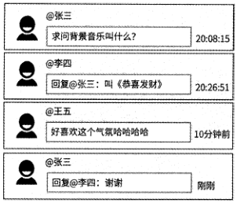

图 12-1

这种模式看起来非常简单，评论按照时间顺序像“一问一答” 一样排列，可以满足用户评论和回复的基本诉求。但是这种模式也会造成用户之间的互动被割裂开来，如图12-1所示的那样，我们并不能直观地看到这三个用户到底在相互交流什么内容，只能在列表中凭肉眼寻找。所以，这种模式仅适合那些社交互动不是那么重要的产品，比如博客、新闻、视频网站、音乐平台等，或者评论区的评论量级注定不会很大的场景，比如微信朋友圈等偏向于小范围的互动圈子；而对于具有强社交属性，且以内容创建互动场合的产品来说，这种模式并不是很适合，因为它会造成评论区杂乱无章，比如微博、bilibili.知乎、小红书等。

第二种模式是“二级模式”，即将某内容下的评论划分为两级，将所有对内容的评论作为一级评论，而对某一级评论的回复统统属于这条评论的二级评论，被单独聚合到此评论的第二级。示例如图12・2所示。

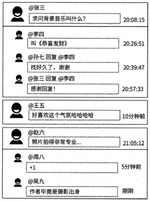

图 12-2

[原 PDF 第 377 页](../%E4%BA%BF%E7%BA%A7%E6%B5%81%E9%87%8F%E7%B3%BB%E7%BB%9F%E6%9E%B6%E6%9E%84%E8%AE%BE%E8%AE%A1%E4%B8%8E%E5%AE%9E%E6%88%98%20%28--%29%20%28manongshu.com%29.pdf#page=377)

在这种模式下可以有效排布互动意图：是对内容本身进行评论，还是对某条评论进行回复。用户在查看评论列表时，可以相当清晰和高效地获取到感兴趣的信息，用户能直观地看到其他用户对内容的评论，也能在阅读某条有趣的评论时看到其他用户对这条评论的反应。举一个非常贴合实际的例子，你在刷到某个电影片段的视频时被内容所吸引，很想知道这部电影叫什么名字，于是自然而然地点击打开评论区，发现正好有用户问了这个问题（一级评论）；你看到在这条评论下有若干回复，即有用户回答了这个问题（二级评论）,于是你又点击打开二级评论，最后找到了答案。整个查询过程让你的使用体验非常丝滑。这个例子很直白地说明了二级模式的优势。实际上，很多对单级模式的缺点有顾虑的产品

都采用了二级模式，典型代表包括微博、bilibili,知乎、小红书等。

第三种模式是“盖楼模式”，假设用户1发布了某条评论，然后用户2回复了用户1,用户3回复了用户2,用户4回复了用户3,用户5回复了用户4,那么对于用户5的回复来说，可以完整地展示评论上下文一用户1评论了什么，用户2回复了什么，用户3回复了什么，用户4回复了什么，以及用户5回复了什么。在盖楼模式下，用户可以像“击鼓传花”似的发布精彩评论。示例如图12.3所示。

```text
                            M位赢茏:京逐口    @张三
```

国:08:15

■ @李四

```text
                           jMk | 口蜜腹剑    |20:09:32
```

.@王五_______________________ s

Sk

_________ — 20:09:55

_______ 120:10:29

1 森罗万象

@ @孙七

```text
                           2k [象箸玉杯    ]2(HhO2    .
```

图 12-3

盖楼模式是由网易公司创新设计的。网易公司在2004年就已经推出了盖楼评论功能，是国内最早推广和使用盖楼评论功能的互联网公司。盖楼模式可以让阅读评论的用户清楚地了解其他用户在某个话题下的思维博弈，便于追踪对方的观点和回复，具有上下文的紧密性。在盖楼模式下，用户可以快速地找到互动的最新评论并有针对性地回复，互动性非常强。此模式是网易公司最为人所称道的明星级评论功能，它催生了很多经典的盖楼案例，目前被很多其他公司广泛学习与应用，所以我们需要对它进行专门讨论。

这三种评论列表模式分属不同的业务场景，需要不同的数据建模，因此评论服务需要针对这三种场景采用不同的设计思路，这也是本章要讨论的核心内容。

[原 PDF 第 378 页](../%E4%BA%BF%E7%BA%A7%E6%B5%81%E9%87%8F%E7%B3%BB%E7%BB%9F%E6%9E%B6%E6%9E%84%E8%AE%BE%E8%AE%A1%E4%B8%8E%E5%AE%9E%E6%88%98%20%28--%29%20%28manongshu.com%29.pdf#page=378)

## 12.3 评论服务设计的初步想法

一条评论数据至少包含评论文本、发布者、发布时间、评论对象（是对内容的评论，还是对其他评论的回复）、回复了哪个用户、评论的点赞数和点踩数等信息。其中，评论文本表示用户评论了什么，其他信息则属于评论元信息，这些信息可以说明评论是谁写的、评论的目标是什么，以及评论间的互动关系。

与第7章中的内容存储设计类似，评论数据被分为评论元信息和评论文本两部分。评论文本作为纯粹的发言内容，很适合被存储到分布式KV存储系统中，其中Key为评论ID,Value为评论文本数据；而评论元信息适合使用数据库存储，不过，在不同的评论列表模式下，数据表设计不同。接下来详细讨论应该如何设计各种评论列表模式下的数据表。

## 12.4 单级模式服务设计

如果某产品的评论功能不在意用户的互动性，或者某评论区中很难有成千上万条评论，那么可以基于单级模式来设计评论服务，比如博客的留言、商品的吐槽区等场景。

### 12.4.1 数据表的初步设计

在单级模式下，对内容本身的评论和对评论的回复处于同一层级，所以其数据表设计非常简单。假设数据表名为comment,表结构如表12.1所示。

表 12-1

含 义

```text
      字段名    类    型
 id    BIGINT    自增主键，无特殊含义
 contentid    内容ID,代表评论区    BIGINT
 comment_id    BIGINT    评论ID
 user_id    BIGINT    评论发布者ID
 reply_user_id    BIGINT    如果评论是回复，则给出被回复的用户ID,默认值为0
 reply_comment_id    BIGINT    如果评论是回复，则给出被回复的评论ID,默认值为0
 commenttime    DATE    评论发布时间
```

如果一条评论是对内容的评论，则其数据记录中的reply_user_id和reply_comment_id字段的值都为0;而如果一条评论是对其他评论的回复，则这两个字段都有明确的值。此外，评论ID作为评论的唯一标识，需要在创建评论时使用分布式唯一 ID生成器生成并设置到commented字段。

[原 PDF 第 379 页](../%E4%BA%BF%E7%BA%A7%E6%B5%81%E9%87%8F%E7%B3%BB%E7%BB%9F%E6%9E%B6%E6%9E%84%E8%AE%BE%E8%AE%A1%E4%B8%8E%E5%AE%9E%E6%88%98%20%28--%29%20%28manongshu.com%29.pdf#page=379)

### 12.4.2 读/写接口与索引

假设用户111在内容222的评论区中对内容本身发布了评论333,首先将评论文本以333为Key存储到分布式KV存储系统中，然后执行如下SQL语句保存评论元信息:

```text
    INSERT INTO comment(content_idf comment_id, user_idz reply_user_id, comment_time)
```

VALUES (222, 333, 111,当前时间

而如果用户111发布的评论555是在内容222的评论区中对用户333的评论444的回复，则实际执行的SQL语句如下：

```text
    INSERT INTO comment(content_id, comment_id, user_idz reply_user_id,
```

reply_comment_idz comment_time) VALUES (222, 555, 111r 333, 444,当前时间戳)

在内容222的评论区中，评论列表是按照评论发布时间的顺序展示的(具体的顺序取决于产品设计，可能是由近及远，也可能是由远及近，此处假设为后者)，且并不是一次性将全部评论都展示出来，而是分页展示的。当用户点击打开内容222的评论区时，在此评论区中应该展示第1页的N条评论，即评论发布时间最早的N条评论。执行的SQL语句如下：

```text
    SELECT user_id, comment_id, content_id, reply_user_idr reply_comment_id FROM
comment WHERE content__id = 222 ORDER BY comment_time LIMIT 0, N
```

用户在阅读完这N条评论后，选择继续上滑获取更多的评论，即读取第2页的评论。执行的SQL语句如下：

```text
    SELECT user_id, comment_id, reply_user_id, reply_comment_id FROM comment WHERE
content_id = 222 ORDER BY comment_time LIMIT N, N
```

以此类推，当用户读取第M页的评论列表时，SQL语句使用LIMIT (M-1)*N,N来限制取数。

读取评论列表，适合使用ccmteiit_id字段和comment_tinie字段作为联合索引idx_comment_list(content_id, comment_time)o 这样一来，根据内容 ID 便可以快速定位到与此内容相关的全部评论，并且这些评论已经按照发布时间排序，可以充分提高SQL语句的执行效率。

当用户删除评论555时，最简单、直接的SQL语句是使用评论ID作为删除条件：

```text
    DELETE FROM comment WHERE comment_id = 555
```

如果希望这条SQL语句能够高效执行，则需要再为comment_id字段创建一个索引，但是这个索引其实并不是必要的。因为用户在客户端删除某条评论前一定是先看到了这条评论，这就意味着客户端知道这条评论所属的内容ID和评论发布时间，所以依然可以使用content_id字段和comment_time字段来辅助删除此评论。在内容222的评论区中，删除发布于时间444的评论555O执行的SQL语句如下：

[原 PDF 第 380 页](../%E4%BA%BF%E7%BA%A7%E6%B5%81%E9%87%8F%E7%B3%BB%E7%BB%9F%E6%9E%B6%E6%9E%84%E8%AE%BE%E8%AE%A1%E4%B8%8E%E5%AE%9E%E6%88%98%20%28--%29%20%28manongshu.com%29.pdf#page=380)

```text
     DELETE FROM comment WHERE content_id = 222 AND comment_time = 444 AND
comment_id = 555
```

这条SQL语句先命中idx_comment_list索引，然后在所定位到的数据记录中扫描comment_id字段。虽然这时数据库有扫描操作，但是好在针对同一内容在同一时刻收到的评论不会很多，所以扫描效率并不低。

用户111也可以查询自己发布的历史评论，这些评论一般是按照评论发布时间由近及远排序的，且同样是分页展示的。所以，筛选这些评论的SQL语句如下：

```text
    SELECT content_idz user_idf comment_idz reply_user_id FROM comment WHERE
user_id = 111 ORDER BY comment_time DESC LIMIT (M-l)*NZ N
```

同理，这个场景适合使用user id字段和comment time字段作为联合索引idx_user_list(user_id, comment_time) o

综上所述，comment数据表需要两个联合索引，即idx_comment_list和idx_user_listo但是这两个索引的第一个字段不同，如果comment数据表需要分库分表，则无法选出合适的字段作为路由依据。然而，大部分面向用户的互联网产品都有海量的评论数据，即comment数据表必然要分库分表。如果选择content_id字段作为路由依据，那么查询某内容评论列表的SQL语句自然可以被准确地路由到一个特定的子数据表，保持SQL语句的查询效率；但是当查询某用户发布的评论列表时，由于此用户的评论数据可能散布在各个

子数据表中，所以查询用户评论列表的SQL语句只能在每个子数据表中都进行查询和聚合汇总，查询效率大大降低。同理，如果选择user_id字段作为路由依据，那么查询用户评论列表的SQL语句仅会在一个子数据表中高效执行；但是当查询某内容的评论列表时，又得查询所有的子数据表。

### 12.4.3 数据库的最终设计

由于受限于分库分表的必要性，我们无法选出合适的字段作为路由依据。关于这个问题的解决思路，我们之前在第io章中也讨论过，那就是数据表冗余设计：创建两个结构与comment数据表的结构完全一致的数据表content_comment和user_comment,前者将idx_comment_list(content_id, comment_time)作为索引，将 content_id 作为分库分表的路由依据；后者将idx_user_list(user_id, comment time)作为索引，将user_id作为分库分表的路由依据。当查询某内容的评论列表时，评论服务会查询content_comment数据表；当查询某用户的评论列表时，评论服务则会查询user_comment数据表。

当用户发布评论、删除评论时，要同时更新content_comment和user_comment这两个数据表。为了保证这两个数据表的数据的一致性，我们可以选择content_comment作为主表，而user_comment数据表通过伪从技术自动同步最新的评论数据，如图12・4所示。

[原 PDF 第 381 页](../%E4%BA%BF%E7%BA%A7%E6%B5%81%E9%87%8F%E7%B3%BB%E7%BB%9F%E6%9E%B6%E6%9E%84%E8%AE%BE%E8%AE%A1%E4%B8%8E%E5%AE%9E%E6%88%98%20%28--%29%20%28manongshu.com%29.pdf#page=381)

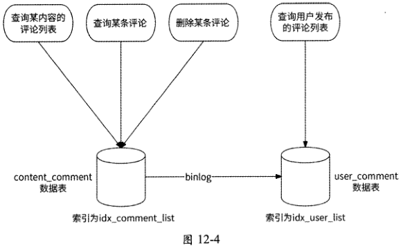

### 12.4.4 高并发问题

评论功能是一个典型的可能读多写多的场景。如果流量明星发布了内容，或者某条内容具有极高的话题度，则会吸引大量的用户前来查阅评论和参与评论。所以，评论服务需要应对高并发写评论和高并发读评论两种情况。

我们先来看高并发写评论的情况。用户发布评论作为典型的写类型请求会直接操作数据库。虽然数据库可以通过分库分表提高并行处理写评论请求的能力，但是content comment数据表将内容ID作为分库分表的依据。对于热门内容来说，有大量的写评论请求指向同一个内容ID,也就是说，这些写评论请求将被路由到同一个子数据表中，所以数据库依然会面临被击垮的风险。如图12-5所示，我们可以使用本书2.7节中介绍的异步写和写聚合解决方案来处理高并发的写评论请求。

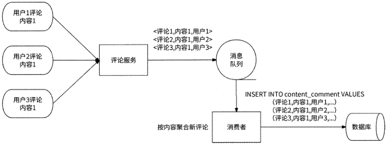

图 12-5

[原 PDF 第 382 页](../%E4%BA%BF%E7%BA%A7%E6%B5%81%E9%87%8F%E7%B3%BB%E7%BB%9F%E6%9E%B6%E6%9E%84%E8%AE%BE%E8%AE%A1%E4%B8%8E%E5%AE%9E%E6%88%98%20%28--%29%20%28manongshu.com%29.pdf#page=382)

(1 )异步写：在评论服务和数据库之间使用主题为push comment的消息队列建立通信通道，评论服务将所收到的写评论请求发送到push_comment消息队列中就成功响应用户；创建一个“发评消费者”来消费push_comment消息队列中的写评论请求，逐步将评论元信息数据插入数据库中。这样一来，高并发的写评论请求就被削峰为数据库可从容处理的平滑流量。

(2)写聚合：发评消费者可以每隔10s就将所收到的写评论请求按照内容ID做一次聚合，将指向同一个内容ID的写评论请求聚合为一条SQL语句后插入数据库中。比如在某10s内，发评消费者收到了 100个对内容111的写评论请求，这时就可以把对应的100条SQL语句改写为1条，然后交给数据库执行。这样一来，原本需要访问100次数据库的写评论请求被聚合为访问1次即可，提高了发评消费者的处理速度，缓解了数据库的访问压力。

我们再来看高并发读评论的情况。这里的读评论特指拉取热门内容的评论列表。对于绝大部分用户来说，其拉取的评论列表是位于评论区前几页的那些评论。所以，我们可以为评论列表中的前N条评论构建Redis缓存。

既然评论列表是按照评论发布时间排序的，那么我们照例使用Redis ZSET结构来描述缓存，其中Key为内容ID, Member为评论ID, Score为评论发布时间。这种将时间作为Score的ZSET结构，我们在用户关系服务、Timeline Feed服务的实现中已经反复介绍过，所以这里不再深入介绍读评论列表的Redis命令。

不过，需要注意的是，产品的评论功能有按照评论发布时间由近及远和由远及近排序的区别。如果评论列表是按照评论发布时间由远及近排序的，那么前N条评论数据是相对固定的，缓存极少需要更新；而如果评论列表是按照评论发布时间由近及远排序的，那么前N条评论数据会时刻发生动态变化，且内容越热门，前N条评论数据变化得越快。所以，更好的缓存形式是将Redis作为数据库的伪从，即每当将一条评论插入数据库中时，同时将此评论也插入Redis ZSET对象中。

考虑到高并发读取评论列表对Redis造成的请求压力，我们还可以进一步做本地缓存：评论服务的每个服务实例都将从Redis ZSET对象中得到的评论列表缓存到本地内存中，并设置过期时间，如5so对于按照评论发布时间由近及远排序的评论列表来说，本地缓存会导致用户拉取到最多5s前的评论，而非此时最新的N条评论。但是好在用户并不是非常在意一定要看到此时的最新评论，只要评论数据相对比较新即可。所以，我们可以使用本地缓存进一步应对高并发读取评论列表的请求，只是不要将本地缓存的过期时间设置得太大就好。

[原 PDF 第 383 页](../%E4%BA%BF%E7%BA%A7%E6%B5%81%E9%87%8F%E7%B3%BB%E7%BB%9F%E6%9E%B6%E6%9E%84%E8%AE%BE%E8%AE%A1%E4%B8%8E%E5%AE%9E%E6%88%98%20%28--%29%20%28manongshu.com%29.pdf#page=383)

## 12.5 盖楼模式服务设计

盖楼模式的最大特点是可以展示每条评论的完整楼层，楼层由初始评论和回复组成。假设在一条内容下，用户1发布了评论，用户2回复了用户1,用户3回复了用户2……用户100回复了用户99,那么对于用户100的回复来说，用户1〜用户100的评论组成了一个层数为100的楼层——不仅展示了用户100的评论，而且展示了用户1〜用户99的完整回复链路。所以，在盖楼模式下，通过每条评论都能回溯到完整的回复链路，以组成楼层。

### 12.5.1 数据库方案：递归查询

回顾单级模式的content_comment数据表设计，comment id字段和reply_comment_id字段记录了一条评论与另一条评论的回复关系。如果要展示一条评论的盖楼情况，则需要从此评论的记录开始，根据reply_comment_id字段不断递归查询上一层的评论记录，直到遍历到此字段为0的评论记录才停止，此时表示已查询到顶层评论。在递归过程中，查询到的每条评论自底向上组成楼层，其过程大致如图12・6所示。

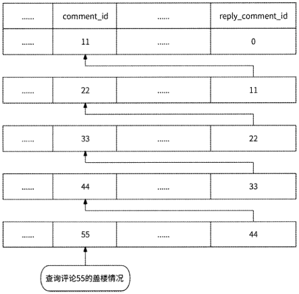

图 12-6

数据库一般都支持这种递归查询方式，仍以MySQL为例，我们可以通过创建自定义函数、编写带变量的复杂SQL语句，或者使用高版本支持的WITH RECURSIVE语句来实

[原 PDF 第 384 页](../%E4%BA%BF%E7%BA%A7%E6%B5%81%E9%87%8F%E7%B3%BB%E7%BB%9F%E6%9E%B6%E6%9E%84%E8%AE%BE%E8%AE%A1%E4%B8%8E%E5%AE%9E%E6%88%98%20%28--%29%20%28manongshu.com%29.pdf#page=384)

现递归查询。假设content comment数据表中有表12-2所示的数据。

表 12-2

```text
   contentjd    commentjd    userjd    reply_comment_id    reply_user_id    comment_time
 1    11    111    0    0    2023-01-01
 1    22    222    11    111    2023-01-02
 1    33    333    22    222    2023-01-03
 1    44    444    2023-01-04    33    333
 1    55    555    44    444    2023-01-05
 1    66    666    55    555    2023-01-06
 1    77    777    66    666    2023-01-07
 1    88    888    77    777    2023-01-08
 1    99    999    88    888    2023-01-09
```

可以看到，评论99是一个层数为9的楼层回复。为了展示完整的楼层，需要从评论99开始递归查询所有的上一层评论。我们可以执行如下SQL语句来实现：

```text
    SELECT ID.level, DATA.* FROM(
```

SELECT

@comment_id as comment_id,

```text
        (SELECT @comment_id := reply__comment_id
```

FROM content_comment

```text
           WHERE comment__id = @comment_id
```

)as _pid,

```text
       @1 := @1+1 as level
```

FROM content_comment,

```text
       (SELECT @comment_id := 99, @1 := 0 ) b
```

WHERE @comment_id > 0

) ID, content_comment DATA

```text
    WHERE ID.comment_id = DATA.comment_id
    ORDER BY level;
```

上述语句的执行结果如下：

```text
    +-------+--- +.    ----+------ --- +—    —    --------- +--- 一+—一--- +
```

I level | id | content^_id | comment_id | user__id | reply_comment_id I reply_user_idcomment_time |

```text
    +-------+--- +.    ----+------ 一一+一-    --------- +--- 一+------- +    -- +--------
     1    1 1 37 ■1    99 |    999 |    88 |    | 2023-01-09 00:00:00 |    1 1    888
     1    2 | 36 ：1    1 1    88 |    888 |    77 |    777 :| 2023-01-08 00:00:00 |
     1    3 | 35 ■1    77 |    777 |    66 |    666 iI 2023-01-07 00:00:00 |    1 1
     1    4 | 34 !1    1 1    66 |    666 |    55 |    555 iI 2023-01-06 00:00:00 J
     1    5 | 33 i1    55 1    555 |    44 1    444 :I 2023-01-05 00:00:00 |    1 1
     1    6 | 32 |1    1 1    44 |    444 [    33 |    333 ■| 2023-01-04 00:00:00 |
          7 | 31 |1    33 |    333 |    22 |    .222 iI 2023-01-03 00:00:00 |
     1    1 1
     1    8 | 30 I1    1 1    22 |    222 |    11 1    111 |1 2023-01-02 00:00:00 |
     1    9 1 29 |    1 1    11 1    111 1    0 1    0    I 2023-01-01 00:00:00 |
    +-------+一 +—    ---- +----- ----+—    --------- +--- •—+------+    --- +-------
```

[原 PDF 第 385 页](../%E4%BA%BF%E7%BA%A7%E6%B5%81%E9%87%8F%E7%B3%BB%E7%BB%9F%E6%9E%B6%E6%9E%84%E8%AE%BE%E8%AE%A1%E4%B8%8E%E5%AE%9E%E6%88%98%20%28--%29%20%28manongshu.com%29.pdf#page=385)

另一种递归查询方式是使用WITH RECURSIVE语句，它是MySQL 8.0版本中引入的新功能。WITH RECURSIVE是一个面向树形结构的递归查询语句，相较于传统的SQL查询语句，它能够帮助用户查询具有层级依存关系的数据结构，在一定程度上提高了数据查

询效率。例如，展示评论99的完整楼层的语句如下：

WITH RECURSIVE temp AS (

```text
        SELECT p.* FROM content_comment p WHERE comment_id = 99
```

UNION ALL

```text
        SELECT q. * FROM content_comment q INNER JOIN temp ON temp. reply_comment_id =
q.comment_id    )~
    SELECT * FROM temp,
```

MySQL使用WITH RECURSIVE语句进行递归查询，虽然性能相对较好，但是递归操作毕竟是一个深度遍历的过程，如果一条盖楼评论的楼层过高，则意味着递归查询的深度大，于是需要循环查询同一个数据表的次数就增加了，时间和内存的开销也会增加，进而影响查询效率。总的来说，基于comment id和reply_comment_id字段，递归查询评论的完整回复链路的时间复杂度至少为O(N)，评论的楼层越高，查询效率越低。

### 12.5.2 数据库方案：保存完整楼层

为了避免递归查询评论的完整回复链路，我们还可以在content_comment数据表中增加一个building字段，设置此字段的类型为Blob,用于存储各楼层的评论ID列表。比如评论88的各层盖楼评论ID列表为[11,22,33,44,55,66,77],我们先把此列表序列化为字节流，然后压缩成占用空间更小的二进制数据，最后存储到building字段中。如果评论99是对评论88继续盖楼，则先读取评论88的building字段，解压缩、反序列化得到盖楼评论ID列表，然后把评论88加入列表中，并将此列表作为评论99的各楼层评论ID列表，即[11,22,33,44,55,66,77,88],最后将其序列化、压缩存储到评论99的building字段中。

之所以选择Blob类型，是因为此类型适合保存占用空间较大的二进制数据，而压缩后的评论ID列表正好是二进制数据，而且楼层越高，压缩后的二进制数据越大。通过在content_comment数据表中增加Blob类型的字段，可以让我们只访问一条数据记录就能获取到评论完整楼层，完全避免了递归查询情况。

Blob类型的数据被存储在MySQL数据表的一个单独的数据页中，数据记录仅存储指向这个数据页的指针，这就使得数据库可以更快地访问到这些数据。但是相比于没有Blob类型数据的数据表来说，Blob类型数据的存在会使得数据表的读/写效率降低，而且Blob类型的数据越大，对数据库的数据传输、数据查询的负面影响就越大。所以，Blob类型并不是万能的。如果产品的评论功能不限制最多盖楼层数，那么可能会有数万层的“摩天大楼”级盖楼评论出现，使用Blob类型存储这种数据依然会给数据表带来巨大压力。实际

[原 PDF 第 386 页](../%E4%BA%BF%E7%BA%A7%E6%B5%81%E9%87%8F%E7%B3%BB%E7%BB%9F%E6%9E%B6%E6%9E%84%E8%AE%BE%E8%AE%A1%E4%B8%8E%E5%AE%9E%E6%88%98%20%28--%29%20%28manongshu.com%29.pdf#page=386)

上，这种方案更适合天然限制了最多盖楼层数（比如最多让盖1000层），几乎只存在“小矮楼”式盖楼评论的场景。

### 12.5.3 图数据库方案

既然关系型数据库不适合存储较长的评论回复链路，那么我们选择适合做这件事情的图数据库，将评论间的回复关系存储到图数据库中。假设有一些评论并且创建了评论间的回复关系：

```text
    //创建评论节点，节点属性包括commented (评论工D)和user_id (评论发布者工D)
    CREATE (cl:Comment(comment__id:11,user_id:111})
    CREATE (c2:Comment{comment_id:22,user_id:222))
    CREATE (c3: Comment {commented: 33, user_id: 333})
    CREATE (c4:Comment{conunent_id:4 4,user_id:444})
    CREATE (c5:Comment{comment_id:55,user_id:555})
    CREATE (c6:Comment(comment_id:66,user_id:666))
    CREATE (c7 : Comment {commented: 77, user_id: 777 ))
    CREATE (c8:Comment{comment_id:88,user_id:888})
    CREATE (c9:Comment{comment_id:99,user_id:999})
    //创建回复关系，关系属comment_time (评论发布时间)
    CREATE    (c9) - [: Reply {comment__time : *2022-11-03    22:05:37’}]->(c2)
    CREATE    (c8) - [:Reply(comment__time: * 2022-11-03    22:46:29’}]-〉(c7)
    CREATE    (c7)-[:Reply{comment_time:*2022-11-03    20:30:18*}]->(c6)
    CREATE    (c6)-[:Reply{comment_time:12022-11-03    15:59:55'}]-〉(c5)
    CREATE    (c5)-[:Reply{comment_time:12022-11-03    12:22:30r}]~>(c4)
    CREATE    (c4)-[:Reply{comment_time:12022-11-03    09:05:02,}]->(c3)
    CREATE    (c3)-[:Reply{comment_time:*2022-11-03    09:01:13*}]->(c2)
   CREATE    (c2)-[:Reply{comment_time:12022-11-03    08:36:08’}]->(cl)
```

此时评论的回复链路如图12-7所示。

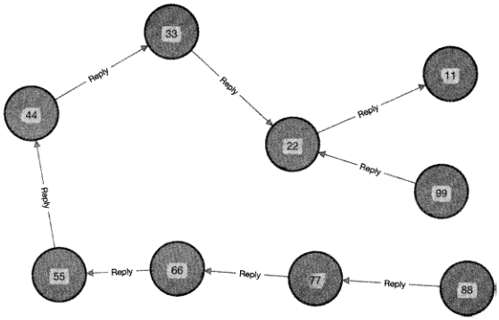

图 12-7

[原 PDF 第 387 页](../%E4%BA%BF%E7%BA%A7%E6%B5%81%E9%87%8F%E7%B3%BB%E7%BB%9F%E6%9E%B6%E6%9E%84%E8%AE%BE%E8%AE%A1%E4%B8%8E%E5%AE%9E%E6%88%98%20%28--%29%20%28manongshu.com%29.pdf#page=387)

如果要展示评论88的盖楼情况，则只需要执行如下CQL语句即可：

```text
    MATCH (c:Comment{comment__id:88})-[r*..](building) return building
```

这条SQL语句会对comment_id为88的评论节点按照回复关系进行深度遍历，遍历经过的每个节点都被作为上一个商层形成盖楼效果。此语句的执行结果形成的图如图12'8

所示。

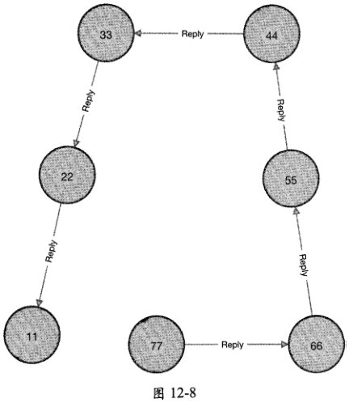

评论间的回复关系本质上就是一个树形结构，所谓盖楼评论无非就是在此树形结构中对某个评论节点进行深度遍历，所以在盖楼模式下非常适合使用图数据库。

## 12.6 二级模式服务设计

对于需要评论功能引发用户之间广泛互动的产品，大多采用的是二级模式评论，例如微博、bilibili等常见的亿级用户应用，所以本节将重点讨论二级模式评论服务的设计，同时引入之前尚未讨论的评论审核和按照热度排序的能力。

### 12.6.1 一级评论和二级评论

在二级模式的评论功能中，所有对内容的评论都将作为一级评论，点击打开内容的评论区，会看到若干一级评论的集合。每条一级评论也都有自己的二级评论区，二级评论区

[原 PDF 第 388 页](../%E4%BA%BF%E7%BA%A7%E6%B5%81%E9%87%8F%E7%B3%BB%E7%BB%9F%E6%9E%B6%E6%9E%84%E8%AE%BE%E8%AE%A1%E4%B8%8E%E5%AE%9E%E6%88%98%20%28--%29%20%28manongshu.com%29.pdf#page=388)

由对此一级评论的回复和对回复的回复共同组成。二级评论区默认一般是折叠状态的，只有当用户主动点击打开某条一级评论的评论区时，其二级评论才会被展示出来。

在二级评论区中，对一级评论的回复和对回复的回复一般按照评论发布时间由远及近排序。而一级评论由于相互之间没有互动关系，所以既可以使用传统的按照评论发布时间对其进行排序，也可以使用更为个性化的排序方式来展示一些精彩的评论，比如微博评论区支持按照热度排序和按照时间排序两种规则，默认按照热度排序。所谓热度是一个比较笼统的概念，不同产品一般采用不同的热度定义，比如点赞数、回复数、发布时间等属性

都会影响评论的热度（这个话题将在12.6.5节中讲述）。

总之，在二级模式的评论功能中包括两种评论列表。

- 点击打开内容评论区，展示由一级评论组成的评论列表。

- 点击打开一级评论的评论区，展示由二级评论组成的评论列表。

二级模式评论功能的数据模型需要区分一条评论是一级评论还是二级评论，还需要区分一条二级评论回复的是一级评论还是二级评论，这是设计二级模式评论元信息数据的核心所在。接下来，我们分别使用数据库和图数据库来设计评论元信息数据。为了使内容逐步得到升华，我们暂且不考虑一级评论区的热度排序，还是使用时间排序规则。

### 12.6.2 时间顺序：数据库方案

评论元信息的数据表结构设计可以参考表12-3 （为了方便编写SQL语句，先假设数据表名为t）。

表 12-3

```text
    列 名    类 型    __________________________________________含 义
```

__________________________

```text
 id    BIGINT    自增主键，无特殊含义    ____________________________
 content_id    内容ID,表示评论最终属于哪条内容___________________________    BIGINT
 commented    BIGINT    评论ID
 user_id    BIGINT    评论发布者ID
```

如果评论是对内容的评论，则该字段值为内容ID；如果评论是一级评论下的评论，

```text
 rootid    BIGINT
```

则该字段值为一级评论ID

```text
 level    TINYINT    评论是一级评论（值为1）还是二级评论（值为2）
 reply_count    BIGINT    此评论被回复的次数，仅一级评论需要记录此数据
 likecount    BIGINT    此评论被点赞的总次数
```

如果评论是对内容的评论，则该字段值为0；如果评论是对某条一级评论的回复，则

```text
 replyuserid    BIGINT    该字段值为此一级评论的用户ID；如果评论是对某条二级评论的回复，则该字段值
```

为此二级评论的用户ID

[原 PDF 第 389 页](../%E4%BA%BF%E7%BA%A7%E6%B5%81%E9%87%8F%E7%B3%BB%E7%BB%9F%E6%9E%B6%E6%9E%84%E8%AE%BE%E8%AE%A1%E4%B8%8E%E5%AE%9E%E6%88%98%20%28--%29%20%28manongshu.com%29.pdf#page=389)

续表

```text
                类 型    含 义
    歹U    名
```

如果评论是对内容的评论，则该字段值为0；如果评论是对某条一级评论的回复，则

该字段值为一级评论ID;如果评论是对某条二级评论的回复，则该字段值为此二级

```text
 replycommentid    BIGINT
                          评论ID    ____________
 comment time    DATE    评论发布时间
```

上文中提到，二级模式评论功能的数据模型需要判断一条评论是一级评论还是二级评论，以及二级评论回复的是一级评论还是二级评论，这个数据表可以清楚地做到这一点。

- level字段值为1,即表小是一级评论。

- level字段值为2,即表示是二级评论，且此评论属于rootjd字段值指向的一级评论的二级评论区。如果reply_comment_id字段值为一级评论ID,则说明此评论回复的是一级评论；否则，说明回复的是二级评论。

例如，当用户点击打开内容111的评论区时，需要按照评论发布时间由远及近展示"

条一级评论。对应的SQL语句如下：

```text
     SELECT commented, user_id, reply_countr like_countz comment__time FROM t WHERE
root id = 111 AND level = 1 ORDER BY comment_time LIMIT 0, N
```

一级评论不仅要展示评论ID、用户ID和评论发布时间，而且要展示其二级评论区的长度和点赞数。用户继续上滑获取下一页的评论列表，无非就是使用LIMITN,N,这里不

再赘述。

当用户点击打开一级评论222的二级评论区时，需要按照二级评论的发布时间由远及近展示N条二级评论。对应的SQL语句如下：

```text
     SELECT comment id, user_id, like_countz comment_time FROM t WHERE root_id = 222
 AND level = 2 ORDER BY comment_time LIMIT 0, N
```

当用户999要查询自己发布的前N条历史评论时，需要执行如下SQL语句：

```text
     SELECT comment_idr like_count, comment_time, content_id, reply_user__id,
 reply_comment_ici FROM t WHERE user_id = 999 ORDER BY comment_time DESC LIMIT 0z N
```

为了使上面的SQL语句可以高效执行，我们创建了两个联合索引。

- idx_comment_list(root_id, level, comment_time):用于获取内容的评论区和某条评论的二级评论区的评论列表。

- idx_user_comment(user_id, comment_time):用于获取用户的历史评论。

在这里，我们依然创建两个结构与t数据表的结构完全一致的数据表content_comment和user_comment,前者负责处理内容评论列表和一级评论的二级评论列表，后者负责处理用户的历史评论列表。

[原 PDF 第 390 页](../%E4%BA%BF%E7%BA%A7%E6%B5%81%E9%87%8F%E7%B3%BB%E7%BB%9F%E6%9E%B6%E6%9E%84%E8%AE%BE%E8%AE%A1%E4%B8%8E%E5%AE%9E%E6%88%98%20%28--%29%20%28manongshu.com%29.pdf#page=390)

例如，用户999对内容111发布评论1000,对应的SQL语句如下：

```text
     INSERT INTO content_comment (content_id, commented, user_id, root_idz level,
comment_time) VALUES (111, 1000, 999, 111, 1,当前时|司)    ~    ~
```

用户999对内容111的一级评论222 (评论发布者ID为333 )发布回复1001:

```text
    INSERT INTO content_comment(content_id, comment_idz user_id, root_id, level,
```

comment_timez reply_comment_id, reply_user_id) VALUES (111, 1001, 999, 222, 2,当

```text
前时间，222z 333)    ~
```

用户999对内容111的一级评论222下二级评论区的评论444(评论发布者ID为555 )发布评论1001：

```text
    INSERT INTO content__comment(content_id, comment_idf user_id, root_id, level,
```

comment_timeA reply_comment__id, reply__user_id) VALUES (111, 1001, 999, 222, 2,当

```text
前时间，444, 555)    —    ~
```

以上这些插入新评论的SQL语句都通过伪从技术被同步到user_comment数据表。

### 12.6.3 时间顺序：图数据库方案

在二级模式的评论功能中，除二级评论之间有回复关系外，一级评论与内容之间、二级评论与一级评论之间也存在回复关系，以内容和评论为点、以回复关系为边可以得到一个有向图，所以图数据库也是一种可用的选型。

我们仍然使用数据库来存储评论的各种元信息数据，但是评论与内容之间的回复关系、评论与评论之间的回复关系则使用图数据库来描述。图数据库作为数据库的伪从，每当有新评论数据产生时，图数据库就为内容节点与评论节点或者评论节点与评论节点建立回复关系。

这里通过一个完整的例子来介绍如何使用图数据库来获取评论列表。首先，创建内容节点和评论节点：

```text
    //创建1个代表内容的节点
    CREATE (ctl:Content{content_id:1})    //创建12个代表评论的节点 ~
    CREATE (cml:Comment{comment_id:11,user_id:1001})
    CREATE (cm2:Comment(comment_id:22,user__id:1002})
    CREATE (cm3:Comment(comment_id:33,user_id:1003})
    CREATE (cmll:Comment(comment_id:111,user_id:1004})
    CREATE (cml2:Comment{comment_id:112,user_id:1005))
    CREATE (cml3:Comment(comment_id:113,user_id:1006})
    CREATE (cm21:Comment{comment_id:211z user_id:1007))
    CREATE (cm22:Comment(comment_id:212,user_id:1008})
    CREATE (cm23:Comment{comment_id:213,user_id:1009})
    CREATE (cm31:Comment(comment_id:311,user_id:1010})
    CREATE (cm32:Comment(comment__id:312A user_id:1011})
    CREATE (cm33:Cominent{comment_id:313r user_id:1012))
```

[原 PDF 第 391 页](../%E4%BA%BF%E7%BA%A7%E6%B5%81%E9%87%8F%E7%B3%BB%E7%BB%9F%E6%9E%B6%E6%9E%84%E8%AE%BE%E8%AE%A1%E4%B8%8E%E5%AE%9E%E6%88%98%20%28--%29%20%28manongshu.com%29.pdf#page=391)

然后，在cml、cm2、cm3这3个评论节点与内容节点ctl之间建立回复关系，即这3条评论成为一级评论：

```text
    ◎ CREATE (cml)-[:Reply{comment_time:,2022-l 1-03 22:05:37*}]->(ctl)
    ◎ CREATE (cm2)-[:Reply{comment_time:,2022-ll-03 19:29:51'}]->(ctl)
     ◎ CREATE (cm3)-[:Reply{comment_time:,2022-ll-03 21:35:49!}]->(ctl)
```

接下来，在剩下的评论节点与待回复的评论节点之间建立回复关系，待回复的评论包

括一级评论和二级评论。

```text
     //二级评论cmll回复一级评论cml, cml2回复cml, cml3回复cml2
    CREATE (cml1)-[:Reply{comment_time:*2022-11-03 22:09:22*}]->(cml)
    CREATE (cml2)-[:Reply{comment_time:12022-11-03 22:15:10'}]->(cml)
    CREATE (cml3)-[:Reply{comment_time:12022-11-03 22:19:051}]->(cml2)
     //二级评论cm21回复一级评论cm2, Zm22回复cm21, cm23回复cm22
     CREATE (cm21)-[:Reply{comment_time:* 2022-11-03 20:01:15*}]->(cm2)
     CREATE (cm22)-[:Reply(comment_time:12022-11-03 20:12:391)]~>(cm21)
     CREATE (cm23)-[:Reply(comment_time:'2022-11-03 20:15:58 *}]~>(cm22)
```

II二级评论cm31回复一级评论cm3, cm32和cm33回复

```text
     CREATE (cm31)-[:Reply(comment_time:*2022-11-03 21:49:19*}]->(cm3)
     CREATE (cm32)-[:Reply{comment_time:*2022-11-03 22:15:10 *}]->(cm31)
     CREATE (cm33)-[:Reply(comment_time:*2022-11-03 22:19:051}]->(cm31)
```

最后，内容ctl与cml、cm2等12条评论形成回复关系图，如图12・9所示。

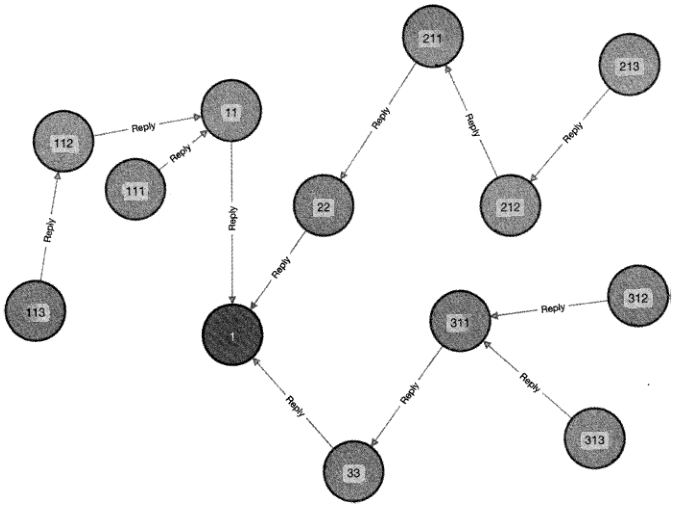

图 12-9

[原 PDF 第 392 页](../%E4%BA%BF%E7%BA%A7%E6%B5%81%E9%87%8F%E7%B3%BB%E7%BB%9F%E6%9E%B6%E6%9E%84%E8%AE%BE%E8%AE%A1%E4%B8%8E%E5%AE%9E%E6%88%98%20%28--%29%20%28manongshu.com%29.pdf#page=392)

读取内容ctl的一级评论列表就是读取与ctl节点有直接回复关系的评论集合，并按照回复时间排序。对应的CQL语句如下：

MATCH (ll_comment)-[r:Reply]->(Content(content_id:1)) RETURNll_comment.comment_idr Uncomment.user_id, r.comment_time ORDER BY r.comment_time

这条CQL语句的执行结果如图12-10所TKo

"ll_comment.comment_idH Hll„comment«user_icl**

```text
                22    "2022-11-03 19:29:51“    1002
                33    *'2022-11-03 21:35:4卯    1003
                11    H2022~ll™03 22:05:37“    1001
```

图 12-10

读取评论cml的二级评论列表就是读取那些与cml节点有回复关系的节点，以及与这些节点有回复关系的节点。换言之，一个评论节点按照回复方向做深度遍历时，如果可以遍历到cml节点，则说明此评论是评论cml的二级评论。所以，我们使用CQL语句查询多跳回复链路指向cml节点的那些节点，它们就是评论cml的二级评论列表：

MATCH (12_comment) - [r :Reply*l * . ] -> (u:Comment (comment_id: 11))

RETURN 12_comment. commented, 12_comment. user__idz r [0] . comment_time ORDER BYr [0] . comment_time

这条CQL语句的执行结果如图12-11所示。

"I2„comment«comment^id1* •*l2„comment. user„id', Hr[0].cowmen

```text
                 111    n2022-ll»03 22:09:22°    1004
                 112    **2022-11-03 22:15:10”    1005
                113    **2022-ll»03 22:19:05”    1006
```

图 12-11

用户1001查看自己发布的评论，就是查看属性usejid为1001的评论节点：

```text
    MATCH (c:Comment {user_id: 1001)) - [r:Reply] -> () RETURN c.coniment_idz r. comment_time
```

ORDER BY r.comment_time DESC

这条CQL语句的执行结果如图12-12所示。

**c.comment„idH **r,comment_tifflen

```text
                            11    n2022-ll~03 22:05：37°
```

图12・12

鉴于二级模式的评论功能可以非常直观地通过回复关系构建出评论与内容之间、评论与评论之间的回复关系图，所以我们可以借助图数据库在图数据查询上的便捷性和高性能

[原 PDF 第 393 页](../%E4%BA%BF%E7%BA%A7%E6%B5%81%E9%87%8F%E7%B3%BB%E7%BB%9F%E6%9E%B6%E6%9E%84%E8%AE%BE%E8%AE%A1%E4%B8%8E%E5%AE%9E%E6%88%98%20%28--%29%20%28manongshu.com%29.pdf#page=393)

来存储二级模式评论的回复关系。

### 12.6.4 评论审核与状态

评论本质上是一种用户输出的内容，评论的意图和情感色彩注定其非常主观，所以，评论也是一个需要审核介入的重要场景。评论审核需要对涉及血腥暴力、谩骂攻击、垃圾广告等不合规的评论进行删除，并对评论发布者给予封号处罚。与内容发布系统章节中介绍的内容审核类似，评论审核分为所谓的机审和人审。

对于评论机审来说，其主要手段是使用自然语言处理技术对评论文本进行关键词分析，然后使用机器学习技术对评论进行类别判断，将识别出的不合规的评论删除。

而人审很直接，就是由审核人员阅读评论数据，主观判断是否要删除评论。因为用户活跃度较高的应用每天会产生动辄几千万条评论，审核人员要处理这么多数据必然是不现实的，所以人审通常只作用于满足某些条件的评论数据。

- 关键词召回：审核人员可以在评论运营后台根据关键词搜索出相关评论数据，然后对它们进行审核。比如我们的产品要对平台内的诈骗信息进行清理，审核人员可以在评论运营后台搜索“打字员” “网络键值”等关键词，然后逐个筛查相关评论。为了支持根据关键词查询对应的评论，在评论运营后台适合选择使用

Elasticsearch作为评论存储引擎，评论服务可以将数据库中已发布的评论数据通过

伪从技术同步到Elasticsearch来实现。

- 热门召回：如果某条评论的曝光量达到一定的量级，则说明此评论已经对较多用户产生了影响，这种评论也是应该人审的。应用客户端可以周期性地上报每条评论被曝光的次数，由服务端做流式数据汇总，当某条评论的曝光量达到预设的阈值时，将其放入人审队列中。

- 举报召回：被举报的评论，极有可能是不合规的评论，所以也要人审。服务端需要监听评论举报事件，将对应的评论同样放入人审队列中。

以上是三种最基本的人审评论召回渠道。不同公司根据其业务特征的不同，可能会有更多个性化的召回渠道。无论是何种召回渠道，当审核人员认为某条评论不合规时，都需要将此评论标记为“不可见”（对于用户来说，就是此评论被删除了），这就要求评论元信

息记录评论的状态。

评论元信息需要使用状态来表示评论的可见性，而且除了粗犷的可见、不可见状态，

评论往往还有更精细的其他状态。

- 全员可见：所有人都能看到此评论。

- 仅好友可见：仅相互关注的好友能看到此评论。

[原 PDF 第 394 页](../%E4%BA%BF%E7%BA%A7%E6%B5%81%E9%87%8F%E7%B3%BB%E7%BB%9F%E6%9E%B6%E6%9E%84%E8%AE%BE%E8%AE%A1%E4%B8%8E%E5%AE%9E%E6%88%98%20%28--%29%20%28manongshu.com%29.pdf#page=394)

- 自见：只有评论发布者可以看到此评论，评论发布者会认为自己已经发布了评论。

- 审核中：已被审核召回的评论处于审核中状态，此时评论的可见性与自见相同。

- 删除：审核没通过的评论会被标记为此状态，任何人都看不到此评论。

- 神评论：评论审核不只是对不合规的评论进行删除，还会把最热门的评论标记为“神评论”，以便对可提高用户活跃度的评论进行正向鼓励。一些搞笑应用如最右、皮皮虾等会对神评论进行置顶展示并赐予神评论勋章，有些应用还会对神评论做热评活动，比如网易云音乐等。

在评论元信息数据库中还需要增加评论状态字段，并包含以上各种状态的枚举值。当用户读取评论列表时，每条评论是否可以被用户读取到视其状态而定。

- 如果评论被删除了，那么用户一定不能读取到此评论。

- 如果评论处于自见状态（自见或审核中），那么用户必须是评论发布者才能读取到此评论。

- 如果评论处于非自见状态，但是仅好友可见，那么用户必须是评论发布者的好友才能读取到此评论。

- 非上述三种类型的评论，任何用户都可以读取到。

由此可见，即使是读取同一个评论区的评论列表，不同用户看到的评论也有可能不同。

当评论服务向数据库请求读取评论列表时，SQL语句无法轻易做到对评论状态的筛选，所以SQL语句无须判断评论状态，而是从数据库中读取评论列表后，评论服务再根据每条评论的状态进一步做业务层过滤。

### 12.6.5 按照热度排序

在讨论完基于评论发布时间对评论列表排序后，我们再来讨论如今非常流行的按照热度排序规则。目前很多互联网应用都选择在评论区优先展示一些热度较高的一级评论，这些评论往往被证明是具有话题性或者优质的评论，把它们优先展示出来可以使评论区变得更有吸引力，从而增加用户黏性。

既然是按照热度排序，那么就要先数字化度量一条评论有多热门。不同应用因业务的不同可能有不同的度量标准，一些简单的标准如下。

- 点赞数：评论被点赞的次数越多，评论就越热门。

- 回复数：评论被回复的次数越多，评论就越热门，即其二级评论列表的长度越长，评论就越热门。

- 点赞数与回复数加权：点赞数和回复数一起反映一条评论的互动性，热度可以是两者做比重加权，比如将“点赞数乂0.4+回复数x0.6”作为热度值。

[原 PDF 第 395 页](../%E4%BA%BF%E7%BA%A7%E6%B5%81%E9%87%8F%E7%B3%BB%E7%BB%9F%E6%9E%B6%E6%9E%84%E8%AE%BE%E8%AE%A1%E4%B8%8E%E5%AE%9E%E6%88%98%20%28--%29%20%28manongshu.com%29.pdf#page=395)

评论的热度一般用加权方式来度量，且可能有除点赞数、回复数之外的其他参考指标,比如有的产品会参考评论的积极性：越早抢占评论区“沙发”的评论，越是给予正向激励,

具体需要根据各产品的业务特点来决定。

对于按照热度排序的评论列表，有如下几个重点要说明。

- 按照热度排序，并不意味着一个评论区中的所有评论都遵循此规则。当我们打开评论区时，首先展示的是热度排名前1000 （ 一个示例值）的评论，在评论区中刷完这1000条评论后，我们看到的依然是按照评论发布时间由近及远排序的评论。

- 如果一条评论没有任何点赞，没有任何回复，即热度值为0,则其不属于热门评论,故不参与热度排名。如果一个评论区中只有50条热门评论，那么用户打开评论区刷完这50条评论后，展示的是按照评论发布时间排序的评论列表。

- 在刷完热门评论后，按照评论发布时间排序的评论列表中依然可能会包含热门评论，也就是说，用户会刷到重复的评论。对此感兴趣的读者可以试着阅读一条微博的全部评论，就会发现热门评论会重复出现在按照评论发布时间由近及远排序

的评论列表中。

我们需要为满足热门评论的一级评论构建热度排名，但无论是12.6.2节介绍的数据库方案，还是12.6.3节介绍的图数据库方案，一级评论都已经按照评论发布时间排序了，在此基础上很难做到再按照热度排序，况且热度值的计算规则极有可能是加权的。

实际上，我们往往可以使用独立的存储系统来保存按照热度排序的评论ID列表，它从基本的全量评论元信息数据库中筛选出热门评论ID并按照热度排序进行存储，在用户读取前1000条评论时展示对应的评论数据。一种可行的方案是选择使用Redis存储系统来维护热门评论，并使用ZSET对象表示一个内容评论区中按照热度排序的评论ID列表集合，其中 Key 为 uhot_comment_{content_id}J，, Member 为评论 ID, Score 为评论的热度值。接下来讲解此方案的技术细节。

首先，构建实时的热门评论ID列表。以点赞数与回复数的加权度量方式为例，由于一条一级评论在收到点赞、回复时，此评论的热度也会发生相应的变化，所以需要监听评论的点赞事件和回复事件。当点赞事件和回复事件发生后，根据此评论的最新点赞数和回复数重新计算热度值并写入ZSET中，以达到评论热度排名实时更新的目的。如果一条评论被删除了，那么在热门评论列表中应该同时删除此评论，所以也需要监听评论被删除的

事件。我们需要创建消费者服务hot_comment_trigger,通过消息队列监听评论的点赞事件、回复事件和删除事件，负责热门评论的实时构建工作。假设在内容1的评论区中一级评论22的当前点赞数是10,回复数是8 （热度值=10x0.4+8x0.6=8.8 ）,那么此评论依次收到点赞、回复以及此评论被删除时，消费者服务hot comment trigger的工作流程如下所述，如

[原 PDF 第 396 页](../%E4%BA%BF%E7%BA%A7%E6%B5%81%E9%87%8F%E7%B3%BB%E7%BB%9F%E6%9E%B6%E6%9E%84%E8%AE%BE%E8%AE%A1%E4%B8%8E%E5%AE%9E%E6%88%98%20%28--%29%20%28manongshu.com%29.pdf#page=396)

图12-13所示。

(1)评论22收到一个点赞，即当前点赞数变为11。

(2 )消费者服务hot_comment_trigger收到评论22的点赞事件，说明评论22的热度需要更新，于是从评论元信息的content_comment数据表中获取其最新的点赞数和回复数，得到11和8。

(3 )消费者服务hot_comment_trigger重新计算评论22的热度值为11x0.4+8x0.6=9.2。

(4 )消费者服务hot_comment_trigger对内容1的热门评论列表更新评论22的热度，向 Redis ZSET 对象发起请求：ZADD hot_comment_l 9.2 22o

(5) 评论22又被回复一次，即当前回复数变为9。

(6) 消费者服务hot_comment_trigger收到评论22的回复事件，从content_comment数据表中得到它的最新点赞数为11,回复数为9。

(7 )消费者服务hot_comment_trigger重新计算评论22的热度值为11x0.4+9x0.6=9.8。

(8 )消费者服务 hot_comment_trigger 对 Redis 更新评论 22 的热度：ZADD hot_comment_l9.8 22o

(9 )评论22被删除，消费者服务hot_comment_trigger收到此事件。

(10 )消费者服务 hot comment trigger 从 Redis ZSET 中删除此评论:ZREM hot_comment_l22 o

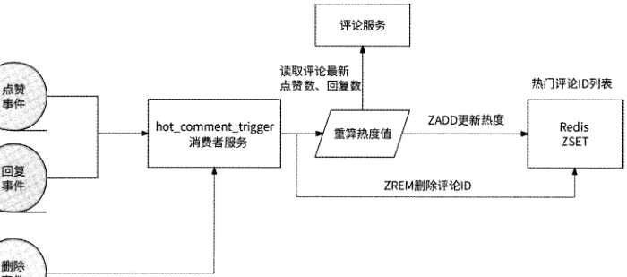

图 12-13

其次，按照热度排序和按照评论发布时间排序的评论组成分页的评论列表。在按照热度排序的评论区中，并不是全部评论都遵循此规则，而是先展示最多1000条按照热度排

[原 PDF 第 397 页](../%E4%BA%BF%E7%BA%A7%E6%B5%81%E9%87%8F%E7%B3%BB%E7%BB%9F%E6%9E%B6%E6%9E%84%E8%AE%BE%E8%AE%A1%E4%B8%8E%E5%AE%9E%E6%88%98%20%28--%29%20%28manongshu.com%29.pdf#page=397)

序的评论，再展示按照评论发布时间由远及近排序的评论。用户的一次刷评论请求只读取某一页的评论，比如10条评论，假设目前在内容1的评论区中有16条热门评论，那么第1页的评论全部来自热度序评论列表，第2页的评论来自热度序评论列表和时间序评论列表的组合；第3页至最后一页的评论全部来自时间序评论列表。

用户在请求读取评论列表时，评论服务需要区分出是从热度序评论列表中获取数据，还是从时间序评论列表中获取数据，抑或是从两者的组合中获取。我们来具体分析一下。

用户分页读取评论列表，必要参数是内容ID、当前已读评论数的偏移量(offset )o下面分析用户读取内容1评论区的前3页评论的情况。

(1) 首次打开评论区，即读取第1页的评论，此时必然需要请求热度序评论列表，因为产品约定热门评论优先展示，且希望读取10条评论。内容1有16条热门评论，热度排名前10的评论被返回。

(2) 用户读取第2页的评论，且仍然希望读取10条评论。但是内容1只剩6条热门评论，此时还需要从时间序评论列表中拉取前4条评论组合起来返回给用户。

(3) 用户读取第3页的评论，由于上一页已经开始展示时间序评论列表中的评论了，所以此时需要拉取时间序评论列表中的第5~14条评论返回给用户。

通过以上三步我们可以看到一些重要细节。

- 第1页的评论，一定要先读取热度序评论列表。

- 其他页可以将上一页最后一条评论的来源作为此次读取评论的来源，最后一条评论来自热度序评论列表就读取热度序评论列表，来自时间序评论列表就读取时间序评论列表。

- 当从读取热度序评论列表转换为读取时间序评论列表时，当前已读评论数的偏移量应该被重置为时间序评论列表的偏移量。

所以，当用户分页读取评论列表时，评论服务的响应除了返回评论数据，还要返回最后一条评论的来源。

对于客户端读取评论列表的请求，同样应该引入一个参数，来指定此次请求的读取评

论的来源。此参数是上一页响应得到的数据来源，暂时将此参数命名为from_where,其可选值为hot (热度序评论列表)和time (时间序评论列表)o下面分析客户端读取内容1评论区的前3页评论的情况。

(1 )客户端读取第 1 页的评论，请求参数为(content_id=l, offset=0, from_where='hot')o评论服务在收到请求后，按照from_where参数的要求访问Redis ZSET对象获取前10条热门评论，执行语句：ZREVRANGE hot_comment_l 0 9,返回10条评论的评论ID,并告

[原 PDF 第 398 页](../%E4%BA%BF%E7%BA%A7%E6%B5%81%E9%87%8F%E7%B3%BB%E7%BB%9F%E6%9E%B6%E6%9E%84%E8%AE%BE%E8%AE%A1%E4%B8%8E%E5%AE%9E%E6%88%98%20%28--%29%20%28manongshu.com%29.pdf#page=398)

知客户端 from where 为 hot, offset 为 10。

(2 )客户端读取第 2 页的评论，请求参数为(content_id=l, offset=10, from_where=,hot,)o评论服务在收到请求后，按照from where参数的要求访问Redis ZSET对象获取第11〜20条热门评论，执行语句：ZREVRANGE hot_comment_l 10 19o由于热门评论一共只有16条，所以此次只得到6条热门评论。此时评论服务转而从时间序评论列表中获取前4条评论，即在SQL语句中设置LIMIT 0,4o在组合这10条评论后，告知客户端from_wheretime, offset 为 4。

(3 )客户端读取第 3 页的评论，请求参数为(conteiit_id=l, offset=4, from_where=,time,)o评论服务在收到请求后，按照from_where参数的要求访问时间序评论列表，获取第5 ~ 14条评论，即在SQL语句中设置LIMIT 4,10o在得到若干评论后，告知客户端from_where为 time, offset 为 14。

如此一来，客户端分页读取评论列表可以无缝地从热度序评论列表切换到时间序评论

列表。

最后，控制热门评论的总数。在一个内容评论区中，有热度的评论可能超过1000条，我们没必要在Redis ZSET对象中保存全部热门评论，只需要截取热度排名前1000的评论就好。这样做，一方面可以防止浪费Redis的内存空间，另一方面可以保持ZSET对象不会成为大Key。截取前1000条热门评论的方法很简单，我们使用一个脚本周期性(如10s)地执行如下操作来截断ZSETo

(1 )执行 ZCARD hot_comment_(content_id)命令，得到 ZSET 对象的长度 No

(2)如果 N大于 1000,则执行 ZREMRANGEBYRANK hot_comment_{content_id} 0N-1000-1命令删除前N-1000个成员(ZSET按照Score值从小到大排列,ZSET的前7V-1000个成员之后的成员才是热度Top 1000,故删除前7V-1000个成员)o

这里仅以存储选型为Redis的ZSET对象介绍了按照热度排序的评论列表方案，但这并不代表这种方案是最优的，使用图数据库也是一种可行的方案。

### 12.6.6 高并发处理

二级模式评论作为大部分海量用户应用的强大功能，也免不了存在高并发问题。对于高并发的写评论来说，依然采用异步写和写聚合解决方案来处理，与在12.4.4节讨论的单级模式评论功能的内容高度一致，这里不再赘述；而对于高并发的读评论来说，由于二级模式的评论功能与单级模式的评论功能有不同的数据模型，所以需要单独讨论。

其实到目前为止，我们讨论的通过评论服务实现读评论的流程是不完整的。在读取按照热度排序的评论列表时，实际上只从Redis ZSET对象中读取到若干已排序的评论ID,

[原 PDF 第 399 页](../%E4%BA%BF%E7%BA%A7%E6%B5%81%E9%87%8F%E7%B3%BB%E7%BB%9F%E6%9E%B6%E6%9E%84%E8%AE%BE%E8%AE%A1%E4%B8%8E%E5%AE%9E%E6%88%98%20%28--%29%20%28manongshu.com%29.pdf#page=399)

还需要读取这些评论对应的元信息，以及从分布式KV存储系统中获取这些评论的文本。在读取按照评论发布时间由近及远排序的评论列表时，虽然从数据库中读取到了已排序的评论元信息，但是依然要获取这些评论的文本。使用评论服务构建完整的评论列表主要分为三步。

（1） 获取应该展示的评论ID列表，来源可能是热度序评论列表或时间序评论列表。

（2） 批量获取评论列表中每条评论的元信息，来源是数据库。

（3） 批量获取评论列表中每条评论的文本，来源是分布式KV存储系统。

评论元信息数据表通过索引实现了评论按照时间排序，所以前两步是合并执行的。构建完整评论列表的示意图如图12・14所示。

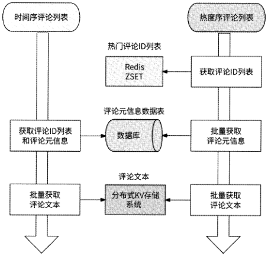

图 12-14

与其他列表数据类型场景类似的是，在读取评论列表的高并发请求中，大部分请求实际上访问的都是前几页评论数据，毕竟很少有用户会花时间一直刷一个评论区。前几页评论数据就是前N条评论，这N条评论可能全部来自热度序评论列表、时间序评论列表或者两者的组合，所以无论是热度序评论列表还是时间序评论列表，都可能会面临高并发请求的问题。下面我们根据图12・14来分析两者的性能瓶颈分别在哪里。

- 热度序评论列表：获取热门序评论ID列表，读取的是Redis ZSET对象，高并发性能表现没什么问题；根据若干评论ID批量获取评论元信息，则是直接访问数据库，数据库有被击垮的风险。

[原 PDF 第 400 页](../%E4%BA%BF%E7%BA%A7%E6%B5%81%E9%87%8F%E7%B3%BB%E7%BB%9F%E6%9E%B6%E6%9E%84%E8%AE%BE%E8%AE%A1%E4%B8%8E%E5%AE%9E%E6%88%98%20%28--%29%20%28manongshu.com%29.pdf#page=400)

- 时间序评论列表：获取时间序评论ID列表和对应的评论元信息，需要直接访问数据库，数据库同样无法应对高并发请求。

可见，存储评论元信息的数据库成为两种排序场景中读取评论列表的共同瓶颈点，所以我们应该对数据库构建Redis缓存数据。那么，应该使用哪种Redis对象缓存数据呢？对于热度序评论列表，希望从缓存数据中批量获取评论元信息；而对于时间序评论列表，

不仅希望批量获取评论元信息，而且希望获取按照评论发布时间由近及远排序的评论ID列表。但无论使用的是String, Hash、List还是Set、ZSET对象，Redis都没有高效的办法兼顾两种数据访问形式，所以我们为这两种数据访问形式使用了两种Redis对象。

- 对于希望访问时间序评论列表的形式，缓存可以基于ZSET对象来存储与每条内容前N条评论的发布时间最近的一级评论ID ,其中Key为cache_time_{content_id}, Member为评论ID, Score为评论发布时间。

- 对于希望批量获取评论元信息的形式，缓存选择使用String对象来存储每条一级评论的元信息，每条一级评论的元信息都被以JSON形式存储到Value中，并将meta_{content_id}_{commented}作为Key,执行MGET命令便可以批量获取评论元信息。另外，本书中多次提到，在Redis集群中执行MGET命令获取的Key只在访问一个Redis分片时性能最佳，所以我们为前缀meta_{content_id}打上hashtag标签，这样Redis集群可以保证同一条内容下的一级评论被存储到同一个Redis分片中。

在上面的流程中，需要从分布式KV存储系统中获取评论文本，我们可以进一步将文本作为评论元信息的一个属性加入String对象中，减少对分布式KV存储系统的访问，再次提升读取性能。

为了减轻Redis作为中心化缓存的访问压力，我们还可以引入本地缓存。评论服务将最近访问量较大的数据直接缓存在本地内存中：如果某内容的评论区访问量较大，则本地缓存前N条热度序评论id列表和前N条时间序评论ID列表；如果某条评论的最近曝光量较大，则本地缓存此评论的全部数据。

最终评论服务处理读取评论列表请求的架构由本地缓存、Redis、数据库和图数据库组成，其工作流程如图12・15所示。

[原 PDF 第 401 页](../%E4%BA%BF%E7%BA%A7%E6%B5%81%E9%87%8F%E7%B3%BB%E7%BB%9F%E6%9E%B6%E6%9E%84%E8%AE%BE%E8%AE%A1%E4%B8%8E%E5%AE%9E%E6%88%98%20%28--%29%20%28manongshu.com%29.pdf#page=401)

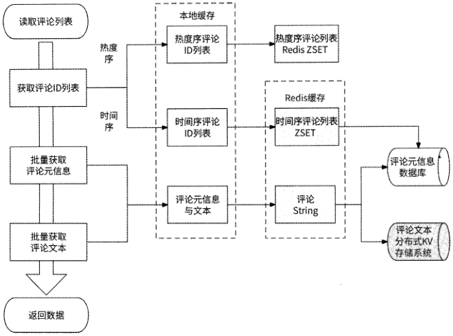

图 12-15

当用户访问某页的10条评论时，评论服务先执行第一部分流程，即获取评论ID列表。

(1 )检查请求希望访问的数据方向，如果要访问热度序评论列表，则执行下一步；如果要访问时间序评论列表，则执行第4步。

(2) 访问热度序评论列表的本地缓存，如果命中本地缓存，则执行下一步；否则，进一步访问热度序评论列表的Redis缓存。

(3) 如果可以得到10条热门评论数据，则完成此流程；如果得不到相应的数据，或者剩余的热门评论数量不足10条，则继续访问时间序评论列表。

(4) 准备访问时间序评论列表，先访问时间序评论列表的本地缓存，如果命中本地缓存，则完成此流程。

(5 )如果未命中本地缓存，则访问时间序评论列表的Redis缓存；如果命中Redis缓存，则完成此流程。

(6)如果未命中Redis缓存，则访问数据库，得到评论ID列表。

在执行完第一部分流程后，如果评论服务获取到若干评论ID列表，则继续执行第二部分流程，即批量获取评论元信息。

(1)访问评论元信息的本地缓存，如果所有评论都命中本地缓存，则直接返回。

(2 )对于未命中本地缓存的评论ID,则通过这些评论ID继续访问Redis缓存。

[原 PDF 第 402 页](../%E4%BA%BF%E7%BA%A7%E6%B5%81%E9%87%8F%E7%B3%BB%E7%BB%9F%E6%9E%B6%E6%9E%84%E8%AE%BE%E8%AE%A1%E4%B8%8E%E5%AE%9E%E6%88%98%20%28--%29%20%28manongshu.com%29.pdf#page=402)

（3） 访问Redis缓存批量获取评论元信息，如果所有评论都命中Redis缓存，则直接返回。

（4） 对于未命中Redis缓存的评论ID,则访问数据库获取评论元信息。

（5 ）将访问数据库得到的评论元信息结果存储到Redis缓存和本地缓存中。

在执行完第二部分流程后，如果每条评论都来自本地缓存或Redis缓存，则说明已经得到评论文本，可以直接返回响应了；否则，对于那些需要访问数据库才能得到的评论，继续执行第三部分流程，即批量获取评论文本。

（1）批量从分布式KV存储系统中读取评论文本。

（2 ）将评论文本加入Redis缓存的评论元信息数据库中。

（3）将评论文本加入本地缓存的评论元信息数据库中。

在执行完全部流程后，评论服务将最终数据返回。

### 12.6.7 架构总览

在介绍完评论服务设计的主要技术细节后，我们总结一下评论服务的架构。

评论数据分为评论元信息和评论文本，前者主要指评论的发布者、发布时间、点赞数、回复数等元信息，适合使用数据库存储；后者指用户实际发布的评论内容，适合使用分布式KV存储系统存储。

发布评论的逻辑相对简单，在创建评论后，评论服务先把评论文本存储到分布式KV存储系统中，再把评论元信息存储到数据库中即可。如果发布评论的请求量级达到数据库无法承载的地步，则可以采用异步写和写聚合的策略：评论服务把所创建的评论放到消息队列中，由专门的消费者把评论均匀地写到数据库和分布式KV存储系统中。如果某条内容被多人评论，则可以聚合这些评论的创建请求，降低数据库的访问压力。

在进行评论审核时，可以根据关键词搜索评论数据，这个功能只有搜索引擎Elasticsearch擅长，每当有评论被创建时，评论元信息数据库都需要告知Elasticsearch,让其新增可进行搜索的评论数据，所以在Elasticsearch与评论元信息数据库之间需要建立伪从关系。

读取评论则是最复杂的逻辑，无法进行简单处理，其复杂性主要受如下影响。

（1） 用户可以读取某条内容下的评论列表和自己发布的评论，前者以内容为起点，后者以用户为起点，所以为了保持分库分表的高效率，在评论元信息数据库中只能冗余建立面向内容的数据表content_comment和面向用户的数据表user_comment ,其中content_comment数据表为主表，user_comment数据表作为其伪从来同步评论元信息数据。

（2） 在读取某条内容的评论列表时，还区分了一级评论列表和二级评论列表，其中一

[原 PDF 第 403 页](../%E4%BA%BF%E7%BA%A7%E6%B5%81%E9%87%8F%E7%B3%BB%E7%BB%9F%E6%9E%B6%E6%9E%84%E8%AE%BE%E8%AE%A1%E4%B8%8E%E5%AE%9E%E6%88%98%20%28--%29%20%28manongshu.com%29.pdf#page=403)

级评论回复的是内容，二级评论回复的是一级评论或另一条二级评论。在数据库中可以引入level字段来表示评论的层级，我们也可以使用图数据库来专门描述这种回复关系。

（3） 某条内容的一级评论可以按照热度排序，且评论区是热度序评论列表与时间序评论列表的组合。热度序评论ID列表需要使用专门的存储系统（本章中使用的是Redis ZSET对象）来维护，每当有任何影响某条评论热度的事件发生时，我们都需要通过异步事件消费者来重新计算和更新评论热度，以保证热度序评论列表的实时性。

（4） 读取评论列表的高并发问题。读取评论列表分为读取评论ID列表（时间序评论列表或热度序评论列表）、读取评论元信息和读取评论文本3步，不仅需要缓存每条评论数据，而且需要缓存某条内容的时间序评论ID列表，缓存形式包括Redis缓存和本地缓存。Redis缓存需要选择合适的对象，评论数据可以使用String对象存储，而评论ID列表适合使用ZSET对象存储。

评论服务的最终架构如图12-16所示。

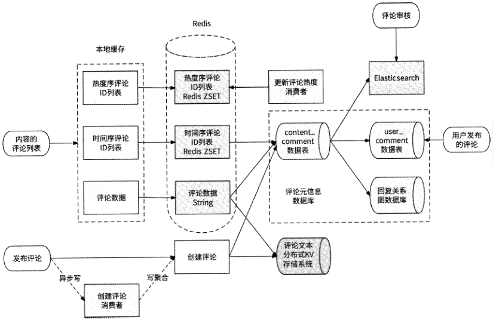

图 12-16

## 12.7 本章小结

评论和内容非常相似，评论数据分为评论元信息和评论文本。对于评论文本，很适合

[原 PDF 第 404 页](../%E4%BA%BF%E7%BA%A7%E6%B5%81%E9%87%8F%E7%B3%BB%E7%BB%9F%E6%9E%B6%E6%9E%84%E8%AE%BE%E8%AE%A1%E4%B8%8E%E5%AE%9E%E6%88%98%20%28--%29%20%28manongshu.com%29.pdf#page=404)

使用分布式KV存储系统存储；对于评论元信息，则需要考虑存储选型和数据模型设计。本章以评论功能的多种评论列表模式展开，讨论了评论服务的设计要点。最常见的评论列表模式包括单级模式、二级模式和盖楼模式。不同模式的评论展示诉求不同，自然要求评论元信息有不同的侧重点。

单级模式是最简单的评论列表模式，它基本满足评论功能的互动性，包括内容发布者可以知道哪些用户发布了哪些评论，以及评论发布者可以得知谁回复了他的评论。单级模式的评论功能可以直接基于数据库实现，我们只需要简单地记录评论回复了哪条内容，以及评论回复了哪条评论即可。单级模式适合那些不强调社交属性的互联网应用，它的定位是满足评论功能。

盖楼模式是一种特殊的评论列表模式，通过每条评论都可以回溯到完整的回复链路，它更像是一种接力。使用数据库实现盖楼模式评论比较吃力。因为追溯一条评论的完整回复链路要么需要借助低效的递归查询，要么需要把完整的回复链路保存下来，所以数据库只适合那种楼层注定不会太高的场景。对于楼层较高的场景，图数据库是一种比较适合的选型，因为所谓的盖楼评论就是对一条评论按照回复关系进行深度遍历。

二级模式是最常见的、最被认可的一种评论列表模式，它可以清楚地反映出谁对内容发表了意见、谁对评论发表了意见，评论互动性极强，而且方便按照热度排序以进一步吸引用户，广泛受到各大面向用户社交的互联网应用的青睐。因此，二级模式评论也是本章的重点内容。如果使用数据库方案，则不仅要记录每条评论回复的对象是谁，而且要记录评论所处的层级：是一级评论还是二级评论。图数据库也是合适的选型，它实际上就是内容与评论组成的回复关系图。在二级模式评论下，我们还讨论了如何支持按照热度排序的评论列表。这种评论列表实际上优先展示的是热门评论，然后展示的是热度序评论和时间序评论的组合，其重点是评论服务应该为热度序评论列表和时间序评论列表分别建立评论ID列表存储系统，并可以明确区分什么时候访问热度序评论列表，什么时候访问时间序评论列表。

此外，评论也是用户发布的主观言论，评论审核是必不可少的环节。与内容审核一样，评论也会经过机审和人审的环节。

评论功能注定是一个读多写多的场景。对于高并发的写评论而言，可以借助消息队列的异步写方式对流量进行削峰填谷，还可以对同一条内容的评论进行聚合，减少写请求量；对于高并发的读评论而言，我们把读取评论列表的流程拆分为获取评论ID列表、批量获取评论元信息和批量获取评论文本3步。通过分析，可以对热度序评论ID列表、时间序评论ID列表和每条评论的完整信息进行适当的缓存，可能的缓存形式包括Redis缓存和对最近热门内容、热门评论的本地缓存。
