[原 PDF 第 405 页](../%E4%BA%BF%E7%BA%A7%E6%B5%81%E9%87%8F%E7%B3%BB%E7%BB%9F%E6%9E%B6%E6%9E%84%E8%AE%BE%E8%AE%A1%E4%B8%8E%E5%AE%9E%E6%88%98%20%28--%29%20%28manongshu.com%29.pdf#page=405)

# 第13章 IM服务

IM （Instant Messaging,即时通信）是一种实时的通信方式’它可以使用户通过互联网快速、安全、低成本地相互交换即时信息。本章将详细讲解IM服务作为用户即时通信后台的功能与技术方案，具体的学习路径如下。

- 13.1节介绍IM的意义与核心能力。

- 13.2节介绍与IM相关的一些概念。

- 13.3节介绍IM服务合格的消息投递应该具有的特点，以及如何存储、接收消息。

- 13.4节初步介绍IM服务应该存储哪些数据。本节内容可以作为后续章节的导论。

- 13.5节介绍消息乱序的原因，以及在服务端和客户端分别保证消息有序收发的思路。

- 13.6节介绍如何创建一个新会话，以及如何处理用于管理会话的命令消息，比如撤回消息、管理群组成员等。

- 13.7节介绍消息回执功能的实现原理。

- 13.8节详细介绍存储系统的数据模型设计。

- 13.9节介绍在高并发架构下，IM服务在高并发收发消息场景中的应用，以及直播间弹幕模式应有的高并发设计。

- 13.10节介绍IM服务的最终架构，这一节内容也是本章的总结。

本章关键词：读扩散、写扩散、推拉结合、消息有序、消息回执、单聊、群聊、弹幕。

## 13.1 IM的意义与核心能力

通俗地说，所谓IM就是聊天，许多互联网应用都支持在应用内用户聊天的功能，因为聊天功能会为用户和产品提供极大的便利性。但是这些应用并不一定是即时通信软件，

下面列举几种定位不同的应用。

- 电商类应用：买家可以通过聊天功能向卖家咨询商品细节、物流问题、售后处理情况等，好友之间也可以分享商品、促销活动、优惠券等。

[原 PDF 第 406 页](../%E4%BA%BF%E7%BA%A7%E6%B5%81%E9%87%8F%E7%B3%BB%E7%BB%9F%E6%9E%B6%E6%9E%84%E8%AE%BE%E8%AE%A1%E4%B8%8E%E5%AE%9E%E6%88%98%20%28--%29%20%28manongshu.com%29.pdf#page=406)

- 求职类应用：求职者与企业主之间可以通过聊天功能方便地在线沟通工作意愿，求职者也可以相互交流工作心得、面试体验等。

- 内容类应用：比如抖音、微博，用户可以通过聊天功能与好友分享有趣的视频，给感兴趣的创作者投票等。

总之，聊天功能是最快的信息传递方式之一。在互联网应用中，不同角色的用户通过聊天可以建立更为紧密和深入的联系，维系自己的社交关系，增强用户对产品的忠诚度和用户黏性。

不同互联网应用的产品侧重点不同，故而聊天功能的丰富程度也不同。由于纯粹的即时通信软件就是以聊天功能为卖点的，所以其往往是聊天功能的集大成者，它们拥有的能力通常如下。

- 实时投递。在在线情况下，用户会实时收到其他用户发给自己的消息，就像当面聊天一样。

- 单聊模式和群聊模式：不仅两个用户之间可以聊天，而且若干用户可以拉群聊天。

- 消息撤回。用户在发出消息后，在一段时间内可以选择撤回消息。

- 消息回执。在单聊模式下，用户可以看到对方是否已经阅读了自己发出的消息；在群聊模式下，用户可以看到哪些用户已经阅读了自己发出的消息。

- 消息勿扰。用户可以对指定的用户或指定的聊天群做勿扰处理，虽然用户仍然可以接收其发出的消息，但是并不会收到提醒。

虽然有些互联网应用的产品定位可能并不是通信软件，并不完全需要上述能力，但是它们已经涵盖了聊天功能的大部分核心能力。假设我们正在做关于即时通信软件的事情，即时通信软件的后台就是本章要设计的IM服务。

## 13.2 IM相关概念

与IM相关的概念如下。

- 消息：用户发出的任何内容。

- 用户状态：在线、离线、挂起。

- 设备/终端：用户使用IM的客户端，通常包括移动端和Web端。

- 单聊：两个用户一对一聊天的模式。

- 群聊：多个用户聊天的模式。

- 会话：描述用户通过聊天建立的关联关系。通俗地说，微信中的每个聊天框都是一个会话，比如你和一个好友聊天，你们就建立了会话；你被拉到某个群里聊天，你就和这个群建立了会话。会话是IM服务的核心概念，它真正指明了消息应该被

[原 PDF 第 407 页](../%E4%BA%BF%E7%BA%A7%E6%B5%81%E9%87%8F%E7%B3%BB%E7%BB%9F%E6%9E%B6%E6%9E%84%E8%AE%BE%E8%AE%A1%E4%B8%8E%E5%AE%9E%E6%88%98%20%28--%29%20%28manongshu.com%29.pdf#page=407)

发送给哪些用户。

- 信箱：对于用户来说，每个会话都有一个抽象的信箱，作为会话中每条消息按照

时间顺序由远及近排列的存储容器。

## 13.3 消息投递

IM服务最重要的议题是消息投递，合格的消息投递应该具有如下特点。

- 准确性：比如用户1向用户2发送消息，消息只可能被用户2收到，不可能发生用户3收到这条消息的“串线”问题。

- 消息不可丢失：消息不可被漏发，更不可丢失，即使遇到故障（如机房断电、网络断开等），用户也应该能够在故障排除后接收到错过的消息。所有IM的用户都坚信消息是一定会被送达的，如果用户发送了重要的消息，而我们的IM服务却因为各种原因把它丢失了，那么用户会直接流失。

- 实时性：应该尽量保证一条发出的消息被实时地投递到接收方，保证用户通信的连贯性，这样才能达到即时通信所强调的“即时”。

- 有序性：消息需要按照发送时间严格排序，不能发生时空错乱。即时通信毕竟与日常交流一样有提问才有回答，也就是消息之间存在因果关系。比如用户1在群聊中问用户2 “吃烤肉还是吃火锅”，用户2回答“吃火锅”，那么群聊中的其他用户看到的消息列表不应该是用户2先回答“吃火锅”，然后用户1再提问；否则，他们会疑惑用户2是怎么做到抢答的。

本节我们先围绕准确性、消息不可丢失和实时性来介绍消息投递的几个重点话题，而关于维护消息的有序性内容将在接下来的章节中详细介绍。

### 13.3.1 存储消息：读扩散与写扩散

消息不可丢失意味着必须要把消息保存起来，而为了保证消息的准确性，又需要把消息保存到其所属会话的信箱中。信箱主要有两种实现模式，分别是读扩散模式和写扩散模式。

在读扩散模式下，每个会话占用一个信箱，与会话相关的用户收发消息就是对这个信箱进行读/写。如图13-1所示，用户ul与用户u2、用户u3以及gl群组的会话都对应一个信箱，会话信箱被会话成员共享。对于单聊场景来说，当用户ul向用户u2发送消息时，消息被投递到ul-u2单聊会话的信箱中，用户u2从这个信箱中接收用户ul发来的消息；当用户u2向用户ul发送消息时，消息同样被投递到这个信箱中，用户ul从这个信箱中接收用户u2发来的消息。对于群聊场景来说，gl群组中的每个成员都向gl群聊会话的信

[原 PDF 第 408 页](../%E4%BA%BF%E7%BA%A7%E6%B5%81%E9%87%8F%E7%B3%BB%E7%BB%9F%E6%9E%B6%E6%9E%84%E8%AE%BE%E8%AE%A1%E4%B8%8E%E5%AE%9E%E6%88%98%20%28--%29%20%28manongshu.com%29.pdf#page=408)

箱中投递自己发出的消息和从这个信箱中接收别人发来的消息。

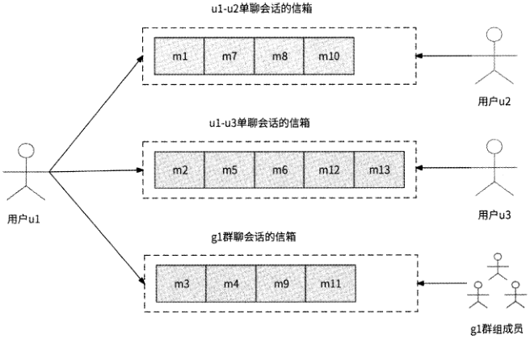

图 13-1

用户在自己的设备上拉取新消息时，IM服务需要从此用户的所有相关会话中拉取新消息，即IM服务需要将拉取新消息的请求扩散为N个拉取会话消息的请求，所以这种消息存储模式被称为“读扩散”。读扩散的优势是发送消息的逻辑非常轻量，只需要把消息写入信箱即可，而不管会话是属于单聊场景还是属于群聊场景。此外，每条消息仅被存储一次，较为节省存储空间。不过，从此模式的名字上就可以看出其核心缺点，那就是用户读取消息有严重的读放大问题，同时在线人数越多或者会话越多，读放大问题带来的流量越大。

与读扩散模式相对应的一种模式是写扩散模式。在写扩散模式下，会话信箱不再被与会话相关的用户全局共享，而是每个用户都拥有一个自己关联会话的信箱列表。如图13-2所示，用户ul、用户u2、用户u3之间单聊会话的信箱在每个用户的会话信箱列表中都会被冗余保存一份，gl群组的会话信息同样会被保存在群组内每个成员的信箱列表中。

在写扩散模式下，用户发送消息，不仅需要把消息投递到自己的会话信箱中，而且需要把消息投递到消息接收者的会话信箱中。在单聊场景下，用户ul向用户u2发送消息，既要将消息写入自己的“withu2”信箱中，又要将消息写入用户u2的“withul”信箱中，即发送消息的写请求被扩散为原来的2倍；在群聊场景下，用户ul向有N个成员的gl群组发送消息，需要把消息依次写入群组内每个成员的“ingl”信箱中，即发送消息的写请求被扩散为原来的N倍。写扩散模式的缺点也显而易见，即发送消息的请求存在写放大问题，对于单聊场景来说，只放大2倍尚可接受，但是对于有更多成员的群聊场景来说，写

[原 PDF 第 409 页](../%E4%BA%BF%E7%BA%A7%E6%B5%81%E9%87%8F%E7%B3%BB%E7%BB%9F%E6%9E%B6%E6%9E%84%E8%AE%BE%E8%AE%A1%E4%B8%8E%E5%AE%9E%E6%88%98%20%28--%29%20%28manongshu.com%29.pdf#page=409)

放大问题尤为严重。写放大带来的另一个问题是消息被冗余存储多份，比较浪费存储空间。

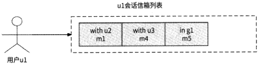

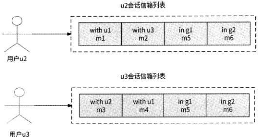

图 13-2

但是写扩散模式对用户接收消息非常友好。无论是单聊场景还是群聊场景，用户只需要从自己的信箱列表中拉取消息即可，即只需要一次读消息请求就能满足要求，这是写扩散模式的优势所在。

写扩散模式无视当前的在线人数与会话数量，但是其带来的写放大问题在群聊场景中会明显地暴露出来，且群组成员人数越多，问题越严重。所以，写扩散模式更适合单聊模式或者小群模式（限定群组成员总人数）的场景。

那么，到底是采用读扩散模式还是写扩散模式，归根结底，还是要根据群聊场景在聊天功能中的比重，以及群聊场景是否支持大群（群组成员人数较多）来决定。

- 聊天功能完全面向单聊场景，则适合采用写扩散模式，因为写请求只被固定放大2倍，没有不可控的高并发流量。

- 聊天功能虽然支持群聊场景，但是极少有群聊场景的出现（比如求职类应用、电商类应用等的聊天功能只是为了增进交流），则适合采用写扩散模式，因为群聊场景的写放大问题的影响微乎其微。

- 对于即时通信软件，单聊场景和群聊场景都广泛存在（比如交友软件、办公通信软件），那么单聊场景自然适合采用写扩散模式，群聊场景则需要根据群组成员人数进一步细化选型：当群组成员人数小于N时，采用写扩散模式；当群组成员人数大于N时，采用读扩散模式。N的取值往往根据IM服务的压测表现来定，当群

[原 PDF 第 410 页](../%E4%BA%BF%E7%BA%A7%E6%B5%81%E9%87%8F%E7%B3%BB%E7%BB%9F%E6%9E%B6%E6%9E%84%E8%AE%BE%E8%AE%A1%E4%B8%8E%E5%AE%9E%E6%88%98%20%28--%29%20%28manongshu.com%29.pdf#page=410)

组成员人数超过某个阈值，发送消息产生严重的性能劣化时，使用此阈值作为N。

### 13.3.2 接收消息：拉模式与推模式

将消息存储到会话信箱中可以保证消息的准确性和不丢失，但是消息尚未真正触达用户设备。下面我们就来讨论用户设备是如何获取消息的。

用户设备获取消息的一种方式是采用拉模式，即用户设备周期性地主动向IM服务后台发起获取消息的请求，由服务端将所有相关会话的未读消息返回。拉模式的实现方式较为简单，但是用户设备多久拉取一次消息并不好确定：为了实时投递消息，用户设备可以Is拉取一次消息，但是这会给IM服务后台带来巨大的访问压力，造成大量计算资源的浪费；如果30s拉取一次消息，那么消息的实时性表现会很差。

用户设备获取消息的另一种方式是采用推模式。推模式与拉模式相反，用户每发送一条消息，IM服务后台都要把消息存储到会话信箱中，同时顺便把消息直接推送到用户设备上，这里使用的是第6章介绍的海量推送系统。

如图13・3所示，用户ul向用户u2发送消息，一方面，将消息存储到ul-u2会话信箱中；另一方面，将消息交给推送系统实时推送到用户u2的设备上。

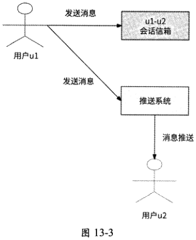

借助推送系统与用户设备维持的长连接，推模式有效地保证了消息的实时触达。然而,长连接毕竟是脆弱的网络连接，网络中断、网络抖动等情况都会导致消息无法触达用户设备。事实上，没有任何推送系统可以在只采用推模式的前提下做到100%的消息推送，所以说完全依赖推模式接收消息会有丢失消息的情况发生，这是推模式的主要缺点。

但是推模式与拉模式可以优势互补，我们自然想到将两者结合起来，即形成推拉结合

[原 PDF 第 411 页](../%E4%BA%BF%E7%BA%A7%E6%B5%81%E9%87%8F%E7%B3%BB%E7%BB%9F%E6%9E%B6%E6%9E%84%E8%AE%BE%E8%AE%A1%E4%B8%8E%E5%AE%9E%E6%88%98%20%28--%29%20%28manongshu.com%29.pdf#page=411)

模式。当用户ul发送消息时，先将消息存储到对应的会话信箱中，然后向目标用户设备推送此消息；同时，用户设备周期性地从IM服务后台拉取消息，作为推送消息触达失败的补偿手段，防止消息丢失。推拉结合模式的消息推送架构如图13・4所示。

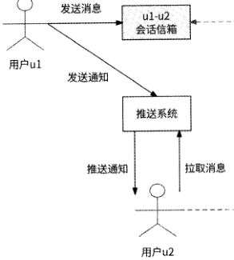

:周期性

＞拉取消崽

图 13-4

推拉结合模式还有另一种实现方式：服务端只向客户端推送通知，用于告知客户端“有一条新消息到来”，然后由客户端来拉取对应的消息内容，如图13・5所示。不同于直接推送消息本身，采用这种只推送通知的方式，可以在客户端真正要读取消息时才传输消息内

容，在一定程度上节约了网络带宽。

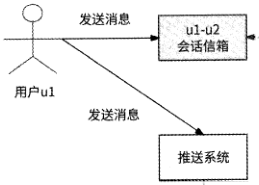

周期性

拉取消息

推送消息:

X X

用户u2

图 13-5

业界绝大多数应用在聊天场景中都采用了推拉结合模式来获取消息。无论是直接推送消息，还是只推送通知，都属于推拉结合模式的表现形式。为了简化问题，这里假设本章'介绍的推拉结合模式是直接推送消息。

[原 PDF 第 412 页](../%E4%BA%BF%E7%BA%A7%E6%B5%81%E9%87%8F%E7%B3%BB%E7%BB%9F%E6%9E%B6%E6%9E%84%E8%AE%BE%E8%AE%A1%E4%B8%8E%E5%AE%9E%E6%88%98%20%28--%29%20%28manongshu.com%29.pdf#page=412)

## 13.4 存储初探

一个支持读扩散模式和写扩散模式的完整IM服务应该存储哪些数据？本节我们先做一个简单的介绍。本节内容可以作为后续章节的导论。

用户发送的消息显然应该被存储到消息表中，其具体属性如下。

- 消息ID：全局唯一标识一条消息。

- 发送时间：接收者可以看到消息是什么时间发送的。

- 内容：记录消息文本。

- 会话ID：指向消息所属的会话。

- 发送者ID：指向消息发送者的用户ID。

- 状态：记录消息是否对接收者可见，比如消息是否被屏蔽、被撤回。

用户聊天的渠道是会话，会话也应该被保存，尤其是群聊会话。

- 会话ID：全局唯一标识一个会话。

- 会话类型：会话是单聊会话还是群聊会话。

- 最新消息时间：记录会话中最新消息的发送时间。

- 会话人数：与会话相关的用户数量。单聊会话人数固定为2人，群聊会话人数为群组成员总人数。

- 其他群组信息：如群头像、群公告等。

为了支持读扩散模式，对于每个会话都应该存储此会话与其产生的消息的关联关系，即“会话消息链”，这条链中的每条数据都应该包含如下属性。

- 会话ID：指代一个会话。

- 消息ID：指代属于此会话的一条消息。

同理，为了支持写扩散模式，对于每个用户也都应该存储此用户与其需要接收的消息的关联关系，即“用户消息链”，这条链中的每条数据都应该包含如下属性。

- 用户ID：指代一个用户。

- 消息ID：指代此用户应该接收的消息。

- 会话ID：指代应该接收的消息所属的会话。

此外，对于每个会话都应该知道聊天的用户有哪些，且每个用户都应该有自己针对每个关联会话的设置，因此还需要保存会话与用户的关联关系，即“用户会话链”，这条链中的每条数据都至少要包含如下属性。

- 会话ID：指代一个会话。

[原 PDF 第 413 页](../%E4%BA%BF%E7%BA%A7%E6%B5%81%E9%87%8F%E7%B3%BB%E7%BB%9F%E6%9E%B6%E6%9E%84%E8%AE%BE%E8%AE%A1%E4%B8%8E%E5%AE%9E%E6%88%98%20%28--%29%20%28manongshu.com%29.pdf#page=413)

- 用户ID：指代哪个用户属于此会话。

- 会话通知：用户可以选择强提醒，或者屏蔽此会话的消息。

- 置顶：用户可以选择是否将此会话在聊天列表的顶部优先展示。

以上介绍的是明显需要存储的数据。但是目前每条数据的属性不一定是完整的，而且为了支持完整的IM服务功能，可能还需要其他数据。这些细节我们将在后续章节中讲解，并在13.8节中介绍最终的存储设计。

## 13.5 消息的有序性保证

即时通信就相当于现实生活中人与人之间的聊天，用户之间收发消息的有序性必然非常重要，因为如果出现不合乎逻辑的聊天内容，则会影响用户体验。本节我们将介绍在消息发送与消息接收的过程中哪些环节可能会发生乱序情况，以及针对各种乱序情况的处理

思路。

### 13.5.1 消息乱序

我们先来分析哪些情况可能会造成消息乱序。

- 客户端发送消息：如果客户端与服务端之间采用了短连接，即客户端每发送一条消息都与服务端建立一次连接，那么受限于公网环境的不确定性，用户发送3条消息A、B、C,最终到达服务端的消息顺序可能是C、B、A,从发送者的角度来说，消息发生了乱序。

- 服务端存储消息：即使用户发送的消息A、B、C按顺序到达服务端，但是由于这3条消息可能是由不同的IM服务实例处理的，每个服务实例处理消息的延迟不同，且与数据库网络通信的延迟不同，最终消息也可能会被按照C、B、A的顺序存储，于是消息接收者在拉取消息时发生了乱序。

- 服务端推送消息：即使按照发送者的本意消息被顺序存储起来，但是由于消息推送环节仍然要借助推送系统与目标用户客户端的网络连接，如果网络异常造成消息A丢失，只有消息B、C到达客户端，那么对于消息接收者来说，消息也仍然发生了乱序。

针对每个可能造成消息乱序的环节，下面我们分别提出对应的解决方案。

### 13.5.2 客户端发送消息

首先，从消息发送者的视角来说，消息发送者在每个会话中连续发送消息时，都应该保证这些消息被有序地投递到服务端。所以，在客户端可以按照会话与服务端建立长连接,

[原 PDF 第 414 页](../%E4%BA%BF%E7%BA%A7%E6%B5%81%E9%87%8F%E7%B3%BB%E7%BB%9F%E6%9E%B6%E6%9E%84%E8%AE%BE%E8%AE%A1%E4%B8%8E%E5%AE%9E%E6%88%98%20%28--%29%20%28manongshu.com%29.pdf#page=414)

每个会话独占一个长连接，用户在某会话中发送消息时会通过此会话与服务端的长连接推送请求，这样就可以保证发送者发送消息的请求有序到达后台机房网关。

其次，为了保证从机房网关传输消息到IM服务的有序性，机房网关应该将消息请求发送到固定的IM服务实例上。比如负载均衡策略采用消息会话ID进行哈希计算：将发送到同一个会话的消息请求都转发到同一个IM服务实例上，这样就可以保证消息按照发送顺序有序到达IM服务内部。

### 13.5.3 服务端存储消息

IM服务与存储系统交互时，也要保证所接收到的用户消息被有序存储到会话消息链中，这就意味着对于同一个会话的消息来说，必须使用单个线程来串行存储数据。能够较为简单地实现这个目的的架构是采用消息队列（如Kafka）,并以会话ID作为消息Key,IM服务一旦收到新消息就投递到Kafka中，使得同一个会话产生的消息都被串行存储到同一个分区（Partition）中；然后构建消费者，从Kafka中依次获取用户消息并写入会话消息链中。所以，IM服务被拆分为如下两个子服务。

- IMAPI：负责接收客户端发送的用户消息，为用户消息生成唯一消息ID,再将消息投递到Kafka主题（Topic ） conversation_im_topic中，并为所投递的消息设置消息Key为会话ID,然后直接响应给客户端。

- 会话消息服务：作为conversation_im_topic的消费者，获取最新的用户消息并写入会话消息链中，然后根据与会话相关的用户列表决定将消息投递给哪些用户。

会话消息服务在确定消息投递的目标用户后，还要保证同一个目标用户的用户消息链中的消息也是有序的，于是我们以用户ID为消息Key再度引入消息队列。

- 会话消息服务在获取到与会话相关的N个用户后，分别发送N条消息到Kafka主题user_im_topic中，并为每条消息设置消息Key为用户IDO

- 创建用户消息服务，作为user_im_topic的消费者，将用户应该收到的新消息依次存储到用户消息链中，同时将新消息交给推送系统下发给这些用户。

conversation im topic和user im topic主题分别将会话ID和目标用户ID作为消息队列存储消息的Key,可以保证用户消息在会话消息链和用户消息链中的有序性。至此，IM服务被拆分为3个子服务：IM API、会话消息服务和用户消息服务，如图13-6所示OIM API仅负责创建消息必要的基础信息，以及按照会话ID维度将消息投递到消息队列中；会话消息服务负责在存储系统中存储有序的会话消息链，以及进一步按照用户ID维度将消息投递到消息队列中；用户消息服务负责在存储系统中构建有序的用户消息链，以及推送消息。

[原 PDF 第 415 页](../%E4%BA%BF%E7%BA%A7%E6%B5%81%E9%87%8F%E7%B3%BB%E7%BB%9F%E6%9E%B6%E6%9E%84%E8%AE%BE%E8%AE%A1%E4%B8%8E%E5%AE%9E%E6%88%98%20%28--%29%20%28manongshu.com%29.pdf#page=415)


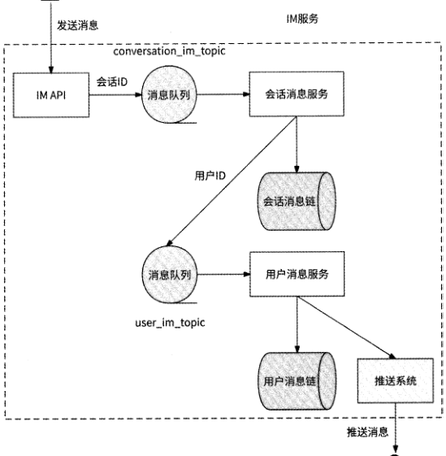


图 13-6

### 13.5.4 服务端推送消息与客户端补偿

在将消息推送到客户端时可能会造成消息的丢失，进而导致客户端收到乱序消息。比如小王在线教不熟悉互联网的父亲老王怎么使用微信分享好友名片，小王顺序发送了 3条消息。

- 消息1：打开聊天框，点击加号打开功能面板。

- 消息2：左滑找到并点击“名片”。

- 消息3：上滑找到要分享的好友，点击“发送”按钮。

IM服务依次推送这3条消息，但是在推送过程中消息2丢失了，导致老王的客户端只收到消息1和消息3。由于客户端采用推拉结合模式获取消息，客户端之后在拉取消息时收到了消息2,最后老王收到的消息顺序是消息1、消息3、消息2。此顺序形成的消息上下文使得老王无法准确按照小王的指示学会分享好友名片，这就是消息推送可能造成的消息乱序情况。

[原 PDF 第 416 页](../%E4%BA%BF%E7%BA%A7%E6%B5%81%E9%87%8F%E7%B3%BB%E7%BB%9F%E6%9E%B6%E6%9E%84%E8%AE%BE%E8%AE%A1%E4%B8%8E%E5%AE%9E%E6%88%98%20%28--%29%20%28manongshu.com%29.pdf#page=416)

推拉结合模式的消息推送与消息拉取没有统一的消息排序规则，这是造成消息触达客户端时可能发生乱序的根本原因。如果消息存储采用读扩散模式，那么消息推送和消息拉取都会基于会话消息链；如果消息存储采用写扩散模式，那么消息推送和消息拉取都会基于用户消息链。为了准确描述消息排序规则，需要在会话消息链和用户消息链中为每条消息显式标记消息正确的顺序。我们在会话消息链和用户消息链的数据表中分别增加一个

Seq属性来表示消息在链中的顺序，每当有一条新消息被插入会话消息链和用户消息链中时，都要保证新消息的Seq值一定比上一条消息的Seq值大，即Seq值要满足严格递增的特性。这样一来，一条消息的Seq就可以表示其在对应消息链中的准确顺序。

那么，如何保证Seq值严格递增呢？这件事情由将新消息写入会话消息链的会话消息服务和将新消息写入用户消息链的用户消息服务来保证。

- 对于会话消息链来说，会话消息服务在本地内存中为每个会话ID都保存最近一条消息的Seq（初始值为0）,每当收到一条新消息时，就将会话ID对应的Seq值加1并作为此消息的Seq值插入会话消息链中，这样可以保证按照消息的顺序递增Seq值。不过，如果会话消息服务有服务发版、扩缩容等导致服务实例重启的变更行为发生，那么本地内存中的Seq值会丢失。所以，我们要设计一个兜底策略：如果某会话ID对应的本地内存中的Seq值为0,则先从会话消息链中获取最后一条消息的Seq值，作为本地内存中的Seq值。

- 用户消息链与会话消息链的原理非常相似，只不过在本地内存中换成了为每个用户ID保存最近一条消息的Seq值。

如此一来，将消息插入会话消息链和用户消息链中的流程改进如图13.7所示。

从图13-7中可以看到，小王给老王发送的3条消息在两者的会话消息链中依次被赋予了 100、101、102的Seq值，而在老王的用户消息链中，这3条消息依次被赋予了 10000、10001、10002的Seq值。最后，服务端在处理消息触达目标用户客户端的逻辑时：

- 在读扩散模式下，在推送消息时，推送的数据除了消息本身，还包括消息在会话消息链中的Seq值；

- 在读扩散模式下，在拉取消息时，既拉取了消息本身，又拉取了消息在会话消息链中的Seq值；

- 在写扩散模式下，在推送消息时，推送的数据除了消息本身，还包括消息在用户消息链中的Seq值；

- 在写扩散模式下，在拉取消息时，既拉取了消息本身，又拉取了消息在用户消息链中的Seq值。

[原 PDF 第 417 页](../%E4%BA%BF%E7%BA%A7%E6%B5%81%E9%87%8F%E7%B3%BB%E7%BB%9F%E6%9E%B6%E6%9E%84%E8%AE%BE%E8%AE%A1%E4%B8%8E%E5%AE%9E%E6%88%98%20%28--%29%20%28manongshu.com%29.pdf#page=417)

。肖息I

消息3

```text
        会话X    消息2    用户老王Y
```

消息2

```text
               消息3    '消息上
                                                1    i
```

——J

```text
                          会话消息服务—-—    ——    ——
                 ---------- ►    用户消息服务
                                瓮话    当前S&J    用户    当前Seq
                                 X    10002    102    老王
                       生成Seq    —-
                                 Y    生成Seq    声**A""".,    .....
                       插入消息    插入消息
                                  本地内存    本地内存
                         Seq    消息
                                                          Seq    消息
                         100    消息1    10000    消息1
                         101    消息2
                                                         10001    消息2
                         102    消息3    消息3
```

10002

```text
                          会话消息链    老王的用户消息链
```

图 13-7

无论是读扩散模式还是写扩散模式，在拉取消息和推送消息时都会附带消息在对应消息链中的Seq值，而客户端在本地会以消息接收队列的形式记录已收到的消息Seq值，对应于服务端存储的会话消息链和用户消息链，如图13・8所示。

会话x

消息接收队列

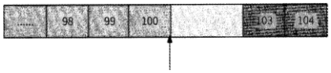

:第已收到的连续消息:

；Q未收到消息的区域!

```text
                                               !    ；已收到的不连续消息;    I
```

local_seq用户的消崽接收队列

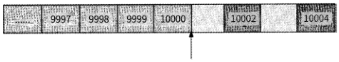

locaLseq

图 13-8

如果IM服务采用读扩散模式，那么客户端会为每个会话都维护一个消息接收队列；如果IM服务采用写扩散模式，那么客户端只维护一个消息接收队列来表示用户消息链中已触达的消息。无论采用哪种模式，消息接收队列最重要的都是要记录当前已经收到的

[原 PDF 第 418 页](../%E4%BA%BF%E7%BA%A7%E6%B5%81%E9%87%8F%E7%B3%BB%E7%BB%9F%E6%9E%B6%E6%9E%84%E8%AE%BE%E8%AE%A1%E4%B8%8E%E5%AE%9E%E6%88%98%20%28--%29%20%28manongshu.com%29.pdf#page=418)

Seq值连续递增、无空洞的最后一条消息的Seq local_seq,这样就可以很容易地发现推送的消息是否有乱序情况发生。假设此时客户端收到一条消息，此消息的seq为current seq

```text
 那么：    -
```

- 如果current_seq = local_seq+l,则说明所收到的消息是连续的，客户端可以展示给用户；

- 如果current_seq < local_seq,则说明所收到的消息是重复的，客户端直接忽略即可；

- 如果current_seq > local_seq + 1,则说明所收到的消息是乱序的，消息接收队列出现］local_seq + 1至current_seq-l的消息空洞，所以客户端只暂存此消息，而不展示给用户。此时客户端主动发起补偿：拉取Seq local_seq+l至current_seq-1

```text
        的消息列表。    ~    ~
```

如上所述，local_seq控制哪些消息可以被展示给用户。如果客户端收到的消息Seq与local_seq并不是连续递增的，则说明必有消息丢失，于是客户端主动拉取丢失的消息。由此可知，客户端在实现推拉结合模式时，不仅要周期性地拉取消息，还要在有消息空洞时补偿拉取消息；客户端在拉取到消息后，更新local_seq为最新的连续消息的最大Seq值。

T面还是以小王给老王连续发送消息的例子来说明客户端接收消息的流程。假设im服务采用的是写扩散模式，也就是客户端基于用户消息链的消息接收队列来进行消息排序。

(1 )小王发送消息1、消息2、消息3,在将这3条消息插入老王的用户消息链中时依次赋予其Seq值为10000、10001、10002,服务端推送这3条消息给老王。

(2) 老王收到消息1,客户端将local_seq更新为10000o

(3) 消息2丢失，老王的客户端感知不到消息2的到来。

(4七消息3到来，其Seq值为10002,在老王的客户端此值不等于local_seq+l,于是先不展示消息3,而是从服务端拉取Seq值为10002的消息。

(5 )客户端获取到消息2,最终3条消息连续，客户端展示消息2和消息3,并更新local_seq 为 10003o

最后，小王发送的3条消息被有序展示在老王的客户端。

## 13.6 会话管理与命令消息

MHk-------------------------------------------------------------------- -

目前我们只讨论了用户消息的收发问题，一条用户消息必然属于一个会话，会话本身也需要IM服务管理。

[原 PDF 第 419 页](../%E4%BA%BF%E7%BA%A7%E6%B5%81%E9%87%8F%E7%B3%BB%E7%BB%9F%E6%9E%B6%E6%9E%84%E8%AE%BE%E8%AE%A1%E4%B8%8E%E5%AE%9E%E6%88%98%20%28--%29%20%28manongshu.com%29.pdf#page=419)

### 13.6.1 创建单聊会话

我们先从发送者的视角介绍创建会话的流程。例如，用户A首次与用户B聊天时，用户A先打开与用户B的聊天框，此时对于用户A来说两者的会话就已经建立了，只不过服务端和用户B对此并不知情。当用户A发出第一条消息时，客户端才请求服务端创建会话，此时客户端将消息内容、接收者和值为0的会话ID传递给服务端，服务端发现请求的会话ID为0,于是需要依次创建如下数据。

(1 )生成唯一的会话ID,在会话表中创建新会话。

(2) 在用户会话链中建立会话与用户A、用户B的关联关系。

(3) 将消息存储到消息表中。

服务端将会话ID响应给客户端，表示会话创建成功、消息发送成功，但是此流程缺点明显，在如下场景中容易出现重复创建会话的情况。

- 服务端在存储消息时遇到网络错误，于是客户端被告知消息发送失败，然后用户A选择重发消息；当服务端再次处理此消息时，会创建新会话，以及会话与用户的关联关系，从而导致出现用户A与用户B之间存在两个单聊会话的情况。

- 当用户A打开聊天框准备与B首次聊天时，恰好用户B也打开了与用户A的聊天框发送消息，这样就会使得服务端接收到两个创建用户A与用户B之间会话的请求，最终也导致出现用户A与用户B之间存在两个单聊会话的情况。

在创建单聊会话时，之所以会有重复的会话产生，是因为服务端没有简单的办法来判断两个用户之间是否已存在单聊会话。其实可以在服务端生成的会话【°上反映单聊关系，对于任何单聊会话都使用“{用户ID1}■{用户ID2}”作为会话ID,其中用户ID1是两个用户中用户id较小的那个，用户ID2则是另一个用户ID。假设用户A的ID为222,用户B的ID为111,那么两者的单聊会话ID固定使用“111-222”来表示。这样一来，无论是用户A重发消息，还是用户B同时发送消息，IM服务都会在会话表中发现两者的单聊会话

已经存在了。

现在再从接收者的视角来讲讲会话的创建。接收者的客户端在接收到一条消息后，根据消息中携带的会话ID在本地查询是否已存在此会话；如果没有找到此会话(或者被用户手动删除了，或者用户换了聊天设备)，则说明可能是新会话，此时客户端再根据会话

ID从IM服务中拉取会话信息。

### 13.6.2 创建群聊会话

创建群聊会话，发起者必须显式地请求服务端，所以创建群聊会话的流程比创建单聊会话要简单得多。比如用户A选择向用户B、用户C、用户D发起群聊，则会直接向服务

[原 PDF 第 420 页](../%E4%BA%BF%E7%BA%A7%E6%B5%81%E9%87%8F%E7%B3%BB%E7%BB%9F%E6%9E%B6%E6%9E%84%E8%AE%BE%E8%AE%A1%E4%B8%8E%E5%AE%9E%E6%88%98%20%28--%29%20%28manongshu.com%29.pdf#page=420)

端发起创建群聊会话的请求，IM服务只需要创建会话、设置会话与每个成员的关联关系即可。由于群聊不要求两个用户之间只能有一个群聊会话，所以不需要考虑用户B同时向用户A、用户C、用户D发起群聊导致两个群聊会话重复的问题，谁发起了群聊就新建一个群聊会话。从接收者的视角来说，会话的创建与单聊类似，这里不再赘述。

### 13.6.3 命令消息

我们在使用微信或者其他即时通信软件时，经常会看到如下事件。

- 好友给你发了一条消息，过了一会儿，你发现消息被撤回了。

- 群聊中提示：A邀请B加入了群聊、B被A移出群聊、A将B禁言。

- 群聊中提示：B退出了群聊。

其实这些事件都是依靠IM服务实现通知到客户端的，这些事件也被当作IM服务的消息来处理，只不过不同于用户发送的消息，这些事件被定义为命令消息，用于控制消息的展示、群聊成员的管理等。

为了区分用户消息和命令消息，在消息表中应该至少增加两个字段。

- msg_type：使用枚举类型，指示消息的具体类型，比如用户消息，有撤回消息、邀请加群、移出群、退群、禁言等。

- extra：使用字符串类型，命令消息所需要的额外参数被统一存储到这里，比如撤回消息事件需要指定被撤回的消息ID,邀请加群事件需要指定谁邀请谁，禁言事件需要指定谁禁言谁。

邀请加群、移出群、禁言这3种命令消息都需要指定事件发起者from_user和事件作用者to_user,即消息表中的extra字段需要存储如下参数：

```text
     {
```

Hfrom_usern:

nto_usern:...

当客户端收到这些命令消息时，其按照消息的具体类型，在对应的群聊中展示如下内容。

- 邀请加群：from_user邀请to_user加入群聊。

- 移出群：from user将to_user移出群聊。

- 禁言：from user 将 to user 禁言。

用户选择退群，IM服务应该产生的相关命令消息需要指定退群者是谁，即消息表中的extra字段如下：

[原 PDF 第 421 页](../%E4%BA%BF%E7%BA%A7%E6%B5%81%E9%87%8F%E7%B3%BB%E7%BB%9F%E6%9E%B6%E6%9E%84%E8%AE%BE%E8%AE%A1%E4%B8%8E%E5%AE%9E%E6%88%98%20%28--%29%20%28manongshu.com%29.pdf#page=421)

当客户端收到退群的命令消息时，其在对应的群聊会话中展示user退出了群聊。

用户选择撤回某条已发送的消息时，除修改消息表中的消息状态为“撤回”之外，IM服务还应该产生一条指定消息ID的撤回命令，用于让消息在触达的客户端也实现撤回的

效果。消息表中的extra字段如下：

（

nmsg_idn:...

```text
     }
```

在客户端无论是通过推送还是拉取接收到这条消息后，IM服务都会将客户端已展示的对应的消息内容删除并改写为“消息被撤回”。

## 13.7 消息回执

很多产品的IM服务都支持消息回执功能，即消息发送者在单聊中可以看到对方是否已读取某条消息，以及在群聊中可以看到一条消息已被哪些成员读取。

### 13.7.1 上报已读消息

要想知道一条消息是否已被读取，自然需要依赖消息接收者把已读事件上报给服务

端，其重点是上报时机。

当一条消息被展示给用户时，如果客户端选择立刻上报已读事件，则可能会给服务端带来访问压力，尤其是群聊。假设一个大群有300人活跃在线，群内每下发1条消息，就会导致300个客户端的已读上报事件反向访问服务端。

实际上，对于一条消息是否已被读取并不需要很强的实时性，客户端没有必要在已读事件发生后就立刻上报给服务端，更好的做法是客户端周期性地（如每隔3s）汇总每个会话最后一条已读消息的Seq±报。从消息发送者的视角来说，也不需要实时知道对方是否已读取消息，所以发送者的客户端也可以周期性地从服务端查询消息是否已被读取。

接下来，我们讨论如何存储消息已读事件。

### 13.7.2 记录已读消息

记录已读消息最直接的方式是为每条消息和每个已读用户保存关联关系，但是这种方式严重占用存储空间，并无实用性可言。实际上，我们可以利用消息有序性的特点，只记

[原 PDF 第 422 页](../%E4%BA%BF%E7%BA%A7%E6%B5%81%E9%87%8F%E7%B3%BB%E7%BB%9F%E6%9E%B6%E6%9E%84%E8%AE%BE%E8%AE%A1%E4%B8%8E%E5%AE%9E%E6%88%98%20%28--%29%20%28manongshu.com%29.pdf#page=422)

录每个用户在会话中最后一条已读消息的Seq last_read_seq,判断一条消息是否已被读取只需要看消息的Seq值是否小于或等于last_read_seq值即可。如果消息的Seq值更大，则说明此消息未被读取，否则说明此消息已被读取。

这种记录最后一条已读消息Seq的方式既适合单聊会话，也适合群聊会话，只不过对于群聊会话来说，有一个小细节需要注意：某时刻被拉入群聊的新成员，并不统计对于之前的群消息此成员是否已读，只能默认新成员对其进群之前的全部群消息是已读的。

我们在用户会话链中增加last_read_seq字段，消息发送者周期性地检查自己发布的消息是否可以被更新为已读状态：

- 在单聊会话中尚未被对方读取的消息；

- 在群聊会话中尚未被全部成员读取的消息。

消息接收者在读取某条消息后，客户端将已读事件上报给服务端，服务端将更新用户会话链中对应的last_read_seq值。如图13・9所示，用户A在4人群聊会话X中发送了一条Seq值为100的消息，用户B和用户D在读取了这条消息后，分别上报更新last_read_seq字段值为100;用户A拉取此消息的已读状态，发现有两个用户的last_read_seq值大于或等于100,说明这两个用户已读。

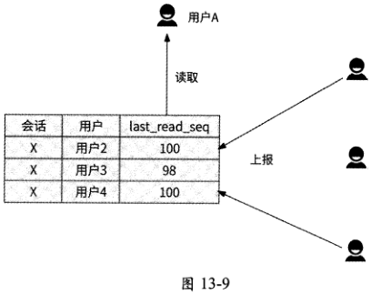

## 13.8 阶段性汇总：存储设计

在介绍完IM服务的主要逻辑后，我们对消息数据的存储进行正式设计。

存储消息本身的消息表：修改消息数据的场景极少见，更多的场景是使用消息ID获取消息数据，所以使用分布式KV存储系统或传统数据库都是合适的选型。如果使用分布式KV存储系统，则以消息ID为Key,以消息内容、发送时间、发送者、消息状态等信

[原 PDF 第 423 页](../%E4%BA%BF%E7%BA%A7%E6%B5%81%E9%87%8F%E7%B3%BB%E7%BB%9F%E6%9E%B6%E6%9E%84%E8%AE%BE%E8%AE%A1%E4%B8%8E%E5%AE%9E%E6%88%98%20%28--%29%20%28manongshu.com%29.pdf#page=423)

息组合的JSON格式为Value；如果使用传统数据库，则消息表的结构如表13-1所示。

表 13-1

```text
                       类 型    含 义___________________________________
```

字段名

```text
 id    BIGINT    自增主键，无特殊含义    _________________________________________
 msg_id    BIGINT    消息ID
 conversation_id    VARCHAR(64)    会话ID
 user_id    BIGINT    消息发送者ID
 content    消息文本。由于文本内容一般不会很大，所以可以使用Text类型描述    Text
```

消息状态枚举，比如：0可见；1屏蔽；2撤回

```text
 status    INT
 send_time    DATE    消息发送时间
```

消息表使用msg_id字段作为唯一索引，以提高根据消息ID获取消息数据的效率。

管理会话数据的会话表：其主要用途是根据会话ID获取会话信息。会话表的结构如表13-2所示。

表 13-2

```text
                       类 型    含 义
```

字段名

```text
 id    BIGINT    自增主键，无特殊含义
 conversation_id    VARCHAR(64)    会话ID
```

会话类型枚举，比如：0单聊；1群聊；2直播间；3聊天室

```text
 type    INT
 member    INT    与会话相关的用户数量
  avatar    VARCHAR(128)    用于群聊，表示群组头像
  announcement    Text    用于群聊，保存群公告
  recent_msg_time    此会话最新产生消息的时间    DATE
```

会话表使用conversation_id字段作为唯一索引，且使用VARCHAR类型来表75，这是为了满足13.6.1节在创建单聊会话时使用字符串类型的会话ID的需要。

会话消息链：用于支持读扩散模式的消息存储，其重点是保证会话内消息有序。其数

据表 conversation_msg_list 的结构如表 13-3 所75。

表 13-3

```text
                       类 型    含 义
```

字段名

```text
  id    BIGINT    自增主键，无特殊含义
  conversation_id    VARCHAR(64)    会话ID
  msgid    BIGINT    消息ID
  seq    BIGINT    消息在会话中的序列号，用于保证消息的顺序
```

会话消息链主要用于按照会话查询有序的消息ID列表，所以需要为conversation_msg_list

[原 PDF 第 424 页](../%E4%BA%BF%E7%BA%A7%E6%B5%81%E9%87%8F%E7%B3%BB%E7%BB%9F%E6%9E%B6%E6%9E%84%E8%AE%BE%E8%AE%A1%E4%B8%8E%E5%AE%9E%E6%88%98%20%28--%29%20%28manongshu.com%29.pdf#page=424)

数据表的 conversation id 和 seq 字段创建联合索引 sort_msg_idx(conversation_id, seq),这样一方面可以保证通过会话ID获取到消息列表，另一方面可以保证消息列表按照seq字段有序排列。

当用户根据会话X的已读消息read_seq获取N条消息时，执行如下SQL语句：

```text
    SELECT * FROM conversation_msg__list WHERE conversation_id = X AND seq > read_seq
```

LIMIT N

当用户获取会话X的历史消息时，根据当前消息的Seq current_seq向前查找N条历史消息，执行如下SQL语句：

```text
    SELECT * FROM conversation_msg__list WHERE conversation_id = X AND
```

seq < current_seq LIMIT N

当用户补偿拉取会话X中指定消息Seq区间［seq_i, seqj］的消息时，执行如下SQL语句：

```text
    SELECT * FROM conversation__msg_list WHERE conversation__id = X AND seq >= seq_i
AND seq <= seq_j
```

用户消息链：与会话消息链相同，服务于写扩散模式的用户消息链也应该有一个类似结构的数据表user_msg_list,如表13.4所示。

表 13-4

```text
                         类 型    含 义
```

字段名

```text
 id    BIGINT    自增主键，无特殊含义
 user_id    BIGINT    用户ID
 msg_id    BIGINT    消息ID
 conversation_id    VARCHAR(64)    会话ID
 seq    BIGINT    消息在会话中的序列号，用于保证消息的顺序
```

用户消息链的使用场景与会话消息链的类似，区别是它服务于写扩散模式，应该查询的是用户维度下有序的消息列表，所以需要为user_msg_list数据表的user_id和seq字段创建联合索引sort_msg_idx(user_id, seq)o其根据消息的Seq查询消息列表的SQL语句与会话消息链的类似。

记录用户与会话关联关系的用户会话链：其承载的职责(至少)如下。

- 根据会话ID可以获取会话参与用户的列表。

- 根据用户ID可以获取与其相关的会话列表，尤其是最近有新消息的N个会话。

- 根据用户ID和会话ID获取某用户是否是某会话的相关用户。

- 记录用户ID在某会话中最后一条已读消息的Seq,便于实现消息回执功能。

- 记录用户ID在某会话中的设置，比如消息是否强提醒或被屏蔽、会话是否置顶等。

[原 PDF 第 425 页](../%E4%BA%BF%E7%BA%A7%E6%B5%81%E9%87%8F%E7%B3%BB%E7%BB%9F%E6%9E%B6%E6%9E%84%E8%AE%BE%E8%AE%A1%E4%B8%8E%E5%AE%9E%E6%88%98%20%28--%29%20%28manongshu.com%29.pdf#page=425)

其数据表user_conversation_list的结构如表13-5所示。

表 13-5

```text
                       类 型    含 义
```

字段名

```text
 id    BIGINT    自增主键，无特殊含义
 user_id    BIGINT    用户ID
 conversationid    VARCHAR(64)    会话ID
 last_read_seq    BIGINT    此会话中用户已读的最后一条消息
 notify_type    会话收到消息的提醒类型：0未屏蔽，正常提醒；1屏蔽；2强提醒    INT
 istop    TINYINT    会话是否被置顶展示
```

在推送消息、查看会话详情时都需要获取与会话ID相关的参与用户列表，所以我们需要为user_conversation_list数据表的conversation_id和user_id字段创建联合索引conversation_user_idx(conversation_id, user_id)o 根据会话 ID X 查询用户列表的 SQL 语句如下：

```text
    SELECT user_id FROM user_conversation_list WHERE conversation_id = X
```

即时通信还有很多根据用户获取会话的场景，例如：

- 查询用户是否属于某会话；

- 查询用户在某会话中的设置，如是否置顶、消息通知类型等；

- 查询最近与用户相关的最多N个会话列表，比如微信，用户在切换新设备时要登录账号。

我们可以为用户会话链的user conversation list数据表的user id和conversation_id字段创建联合索引user_conversation_idx(user_id, conversation id)，在查询用户A是否属于会话X,或者查询用户A在会话X中的设置时，执行如下SQL语句：

```text
    SELECT * FROM user_conversation_list WHERE user_id - A AND conversation_id = X
```

如果用户切换了登录设备，则可能涉及获取最近的活跃会话列表，我们可以在根据user_id字段查询会话列表后，选取last_read_seq字段值最大的N条记录作为最近N个活跃会话。

## 13.9 高并发架构

即时通信是一个典型的读多写多的场景，在讨论完IM服务如何满足即时通信的基本功能需求后，我们再将其放到海量用户场景中看看它是如何应对高并发请求的。

[原 PDF 第 426 页](../%E4%BA%BF%E7%BA%A7%E6%B5%81%E9%87%8F%E7%B3%BB%E7%BB%9F%E6%9E%B6%E6%9E%84%E8%AE%BE%E8%AE%A1%E4%B8%8E%E5%AE%9E%E6%88%98%20%28--%29%20%28manongshu.com%29.pdf#page=426)

### 13.9.1 发送消息

拥有上亿用户的即时通信软件，很容易发生大量用户同时发送消息的情况，尤其是在节假日期间，比如春节，可能有数百万用户同时发送拜年消息，所以我们需要设计一些策

略来防止海量的发送消息请求击垮IM服务。

在13.5.3节讨论过，为了保证会话中消息的有序性，我们为存储消息过程引入了消息队列，在IM服务内部由IMAPI服务接收消息，然后把消息投递到消息队列中就返回给用户了。当时的意图是保证消息基于会话ID有序和基于用户ID有序，其实使用消息队列还有另一层含义：消息队列可以对高并发发送消息的请求做削峰处理，im服务内部可以按照自己的处理速度来平滑处理消息的存储与推送，在发送消息的过程中其实已经实现了异步写，可以较好地应对高并发发送消息请求的涌入。

接下来是消息的消费环节。如果消费者消费消息的速度较慢，或者消息队列的分区数量过少，则会造成消息在消息队列中堆积，无法被及时地存储到数据库中，进而导致消息迟迟无法触达接收者。为了尽最大可能防止消息队列中消息的堆积，我们可按如下所述进行操作。

- 为消息队列的主题设置足够多的分区。受限于消息队列的机制，1个分区只能被1个消费者实例消费，所以分区数量就是消费者实例的数量，分区越多，可以消费消息的消费者实例就越多。例如，为conversation im topic设置10000个分区，那么就有10000个会话消息服务处理消息的存储。这就是应对高并发写场景的数据分片方案。

- 消费者采用批量消费模式从消息队列中拉取消息。同一个会话的相关消息都会被投递到conversation im topic的同一个分区中，所以一次消费行为可以批量拉取如500条消息，再将属于同一个会话的消息聚合为一个写数据库的请求。对于消息队列user_im_topic来说也是一样的，批量消费一些消息并按照用户ID做聚合，再访问数据库。这就是写聚合，也是我们之前介绍的应对高并发写场景的解决方案。

此外，作为发送消息的源头，客户端也可以在本地对用户发送消息的频次进行限制。如果用户在短时间内疯狂地发送了大量消息，则大概率可以认定此用户是在恶意刷消息，或者发送无意义的消息，如广告。如果用户在一定时间内发送消息的数量超过某个阈值，那么客户端可以拒绝发送，防止恶意请求、无意义的请求冲击服务端。

### 13.9.2 数据缓存

IM服务的主要数据包括消息表、会话表、用户会话链、会话消息链和用户消息链。为了防止高并发读消息的请求击垮数据库，可能需要使用Redis缓存这些数据。另外，消息是一种时间属性很重的数据，对最近的消息数据会有更多的请求访问，所以可以将缓存

[原 PDF 第 427 页](../%E4%BA%BF%E7%BA%A7%E6%B5%81%E9%87%8F%E7%B3%BB%E7%BB%9F%E6%9E%B6%E6%9E%84%E8%AE%BE%E8%AE%A1%E4%B8%8E%E5%AE%9E%E6%88%98%20%28--%29%20%28manongshu.com%29.pdf#page=427)

的数据聚焦到最近的数据上。我们具体来分析如何缓存数据。

- 消息表：最近的消息意味着有更大的可能被频繁访问，Redis可以使用String对象存储IM服务刚刚收到的消息，并设置数据过期时间为1天，这样就可以保证Redis中缓存的消息是来自最近1天的。

- 会话表：最近创建的、最近有消息通信的会话更有可能被频繁访问，可以使用与缓存消息表同样的方式来缓存最近的会话。但是由于单聊会话只涉及两个用户，且没有什么可变的元信息，用户在同一个设备上基本上很少访问其会话信息，所

以Redis可以只缓存群聊会话。

一

- 用户会话链：其非常容易被频繁访问，IM服务下发消息时要在这里读取目标用户列表（基于会话ID查询），也要检查消息发送者在会话中发送消息的权限，客户端会周期性地更新与用户相关的会话设置（基于用户ID查询）。所以，对于最近活跃的会话来说，其用户会话链值得被缓存。Redis可以使用List存储每个会话的用户列表，使用String对象存储每个用户在某会话中的设置。

- 会话消息链和用户消息链：我们将两者统称为消息链，只不过一个用于读扩散模式，一个用于写扩散模式。由于用户查看历史消息的概率远远低于读取最近消息的概率，所以可以存储最近收到的消息。消息链不需要把全部消息都存储起来，而是可以使用Redis的ZSET对象存储最近的消息ID列表，其中Score用Seq表示，以保证消息的有序性。

最终，数据库被作为存储系统，Redis被作为缓存，将两者结合起来存储IM服务数据,

如图13.10所示。

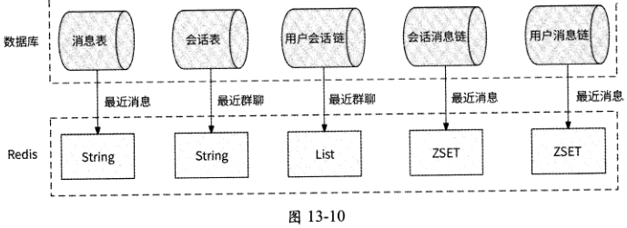

### 13.9.3 消息分级

按照参与会话的用户数量，对消息有不同的触达成功率和实时性的要求，经过大致测

算，我们把消息划分为如下优先级。

- 单聊会话：两个用户都非常在意消息的顺利互动，单聊既要保证消息顺利触达，

[原 PDF 第 428 页](../%E4%BA%BF%E7%BA%A7%E6%B5%81%E9%87%8F%E7%B3%BB%E7%BB%9F%E6%9E%B6%E6%9E%84%E8%AE%BE%E8%AE%A1%E4%B8%8E%E5%AE%9E%E6%88%98%20%28--%29%20%28manongshu.com%29.pdf#page=428)

又要保证消息的实时性，消息优先级高。

- 群聊会话，但是群成员人数少于100人：这属于小群，小群一般是好友圈子建立的群，或者是为特定话题建立的群，群成员也非常在意群消息互动，所以对小群消息有与单聊会话消息类似的触达成功率和实时性的要求，消息优先级高。

- 群聊会话，但是群成员人数大于100人且小于1000人：这属于中等群组，常见于公司部门的重要消息通知群，日常群聊参与人数不多，重要的是要求群消息触达每个成员，但对实时性要求一般，消息优先级中。

- 群聊会话，但是群成员人数大于1000人：这属于大型群组，类似于交流社区（如北京交友群）。由于人多嘴杂，很多群成员大概率会屏蔽群消息，只有主动点击打开群会话才会真正阅读消息，所以并不要求群消息触达全部在线成员，且不要求实时性，消息优先级低。

将消息划分为不同的优先级，可以有目的地为单聊、小群、中群、大群分别创建专用的IM服务集群，集群之间不共享任何资源，如服务实例、消息队列、数据库、Redis,这样可以隔离不同优先级的消息，防止整个IM服务系统瘫痪，并且可以合理分配资源。

- 单聊消息不会因为大群消息过多而被堆积在消息队列中。

- 大群消息击垮数据库，不会影响单聊和小群的消息收发。

- 把Redis内存资源更多地留给单聊和小群的专用集群。

- 推送系统优先保证单聊和小群的消息推送，防止大群消息过度占用网络带宽。

### 13.9.4 直播间弹幕模式

直播间弹幕是如今热度很高的一种即时通信场景，它是指在直播间（或房间）内，观众可以实时发送短文本消息，以在直播画面上滚动的形式呈现。弹幕可以是观众与主播之间的聊天，也可以是观众之间的互动。弹幕可以为直播注入更多的交互和互动体验，也可以为直播间的观众创造更多的参与感和乐趣。

直播间弹幕看起来像群聊，直播间相当于一个会话，看播用户和主播是群成员。不过，与传统的即时通信场景相比，直播间弹幕还有如下一些明显的特殊性。

- 只有看播用户有会话，且只有一个会话，这个会话就是用户正在观看直播的直播间。不存在一个用户同时观看多个直播的情况。

- 用户可以随时进出直播间，即群成员变动会比较频繁。

- 对弹幕的实时性要求很高，因为主播可能会对弹幕进行答复，弹幕不实时下发会造成不好的用户体验。

- 每个用户只需要接收他在看播期间的消息，不需要看历史弹幕。

- 直播间极易产生大量收发弹幕的情况，即形成过热会话。

[原 PDF 第 429 页](../%E4%BA%BF%E7%BA%A7%E6%B5%81%E9%87%8F%E7%B3%BB%E7%BB%9F%E6%9E%B6%E6%9E%84%E8%AE%BE%E8%AE%A1%E4%B8%8E%E5%AE%9E%E6%88%98%20%28--%29%20%28manongshu.com%29.pdf#page=429)

- 允许在极端情况下丢失若干弹幕，发送者对其他用户是否能看到自己的发言不是

很在意。

- 弹幕数据不需要被长期持久化存储，主播在关播后整个直播间的弹幕就不需要再

保留了。

这些特殊性使得直播间弹幕的IM服务设计应该有不同的思路。首先，弹幕的消息存储非常适合采用读扩散模式，即弹幕只被存储到会话消息链中。因为每个用户最多只有正在观看直播的直播间这一个会话，读扩散问题自然得到解决。

其次，看播用户的频繁变动意味着用户会话链不仅面临高并发读的情况，而且会被频繁修改。如果用户会话链仍然使用数据库存储和Redis缓存的组合，则会非常容易出现数据库数据与Redis数据不一致的问题，反倒是直接使用Redis存储更加简单、直接。例如，使用Hash对象作为用户会话链，其中Field表示用户ID, Value表示此用户在直播间内的配置，如是否被禁言、进房时间等信息，如图13.11所示。

```text
                                     Field    Value
```

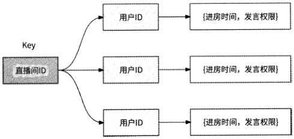

图 13-11

最后，所有的看播用户都会频繁地发送弹幕和读取弹幕列表。IM服务已有的消息队列对发送消息请求做削峰处理，因此在正常情况下发送弹幕问题不大；但是在发送弹幕的请求量超过消息队列处理能力的情况下，为了防止弹幕堆积，我们甚至可以直接按照比例丢弃弹幕，弹幕发送者的客户端只在本地展示这条弹幕，从发送者本人的视角来看，弹幕

就像已经发送成功一样。

读取弹幕的请求量也很大。虽然会话消息链使用Redis ZSET缓存最近的消息列表，但是这里的数据毕竟只有消息ID,想获取到完整的弹幕，还需要批量获取消息数据，因此会话消息链缓存的ZSET对象的Member不再适合用消息ID表示，而是应该直接使用弹幕数据，如图13-12所示。

[原 PDF 第 430 页](../%E4%BA%BF%E7%BA%A7%E6%B5%81%E9%87%8F%E7%B3%BB%E7%BB%9F%E6%9E%B6%E6%9E%84%E8%AE%BE%E8%AE%A1%E4%B8%8E%E5%AE%9E%E6%88%98%20%28--%29%20%28manongshu.com%29.pdf#page=430)

```text
Member    Score
```

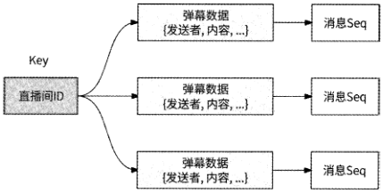

图13・12

这样一来，一个直播间的弹幕读取请求实际上只访问一个Redis ZSET对象，具备了高并发读取弹幕请求的能力。如果读取请求量超过Redis单机处理能力，则可以采用Redis主从架构来分散读取压力。

## 13.10 本章小结：最终架构

在学习完本章全部内容后，这里我们对整个IM服务做一个总结。

在用户之间建立聊天关系的渠道是会话，它被用作消息收发的容器，消息能被发送、存储、接收的核心是我们介绍的那些模式，其中负责消息存储的模式有如下两种。

- 读扩散模式：消息被发送到会话消息链，用户在读取新消息时需要拉取全部相关会话。此模式适合会话数较少的场景。

- 写扩散模式：消息被分别发送到每个会话中用户的用户消息链。此模式更适合会话参与用户较少的场景，如单聊和小群。

负责消息收发的模式有如下三种。

- 推模式：每条消息都经过长连接被直接推送给在线用户，消息的实时性强，但易丢失。

- 拉模式：客户端主动轮询访问服务端获取新消息，消息不易丢失，但实时性一般。

- 推拉结合模式：既将新消息推送给在线用户，客户端又周期性地拉取消息，消息的实时性强，也不易丢失。

本章设计了一个既支持读扩散模式，又支持写扩散模式消息存储的IM服务，且采用推拉结合模式收发消息。我们为数据库存储设计了多个数据表，它们分别负责如下事情。

- 消息表：存储消息本身。

- 会话表：存储会话兀信息。

- 用户会话链：存储会话与用户的关联关系，以及每个用户在会话中的配置、权限、

[原 PDF 第 431 页](../%E4%BA%BF%E7%BA%A7%E6%B5%81%E9%87%8F%E7%B3%BB%E7%BB%9F%E6%9E%B6%E6%9E%84%E8%AE%BE%E8%AE%A1%E4%B8%8E%E5%AE%9E%E6%88%98%20%28--%29%20%28manongshu.com%29.pdf#page=431)

最近已读消息等。

- 会话消息链：服务于读扩散模式，存储会话中的消息ID列表。

- 用户消息链：服务于写扩散模式，存储每个用户的消息ID列表。

保证消息的有序性是即时通信的基本诉求，我们为消息链引入了递增的消息Seq来反映消息顺序，客户端本地维护消息链的接收队列，并通过查看当前收到的消息Seq在队列中是否连续来判断是否有消息丢失情况发生。如果消息Seq连续，则可以将消息展示给用户，否则补偿拉取空洞消息。

一条消息从发送到被用户接收经过了如下过程。

(1)客户端在为会话与服务端建立的长连接上发出消息。

(2 ) IM API接收消息，为消息生成全局唯一的消息ID。如果消息来自新会话，则进一步为消息生成会话ID并在会话表中创建新会话。然后，将消息按照会话ID有序投递到conversation im topic 消息 队列中。

(3 )会话消息服务消费conversation_im_topic中的最新消息，在消息表中插入新数据，并为消息产生递增的消息Seq后，将消息插入会话消息链中。

(4) 会话消息服务更新若干缓存数据。

① 将消息缓存到Redis中。

② 在会话表中更新会话的最新产生消息的时间，如果消息来自群聊，则将会话消息进

一步缓存到Redis中。

③ 将消息插入会话消息链的Redis最近消息缓存中。

(5) 会话消息服务获取与会话相关的用户列表，然后为每个用户按照用户ID将消息顺序转发到user im topic消息队列中。

(6 )用户消息服务消费user_im_topic中的最新消息，为消息产生递增的消息Seq后，将消息插入用户消息链中。

(7 )用户消息服务将消息更新到用户消息链的Redis最近消息缓存中。

(8) 将消息交给推送系统，由它把消息推送给目标用户。

(9) 接收者的客户端收到消息，在本地检查消息的Seq值是否等于接收队列中最后一条连续消息的Seq+1值，如果是，则说明消息连续，客户端将消息展示给用户；否则，说明出现消息空洞，需要补偿拉取消息。

(10) 客户端从服务端拉取消息，IM服务先从Redis缓存中读取消息ID列表，如果未读取到，则从数据库的消息链中再次读取。

[原 PDF 第 432 页](../%E4%BA%BF%E7%BA%A7%E6%B5%81%E9%87%8F%E7%B3%BB%E7%BB%9F%E6%9E%B6%E6%9E%84%E8%AE%BE%E8%AE%A1%E4%B8%8E%E5%AE%9E%E6%88%98%20%28--%29%20%28manongshu.com%29.pdf#page=432)

(11) 在读取到消息ID列表后，IM服务将消息数据打包返回给客户端。

(12) 客户端将拉取到的消息补充到接收队列中，将连续消息展示给用户。

最后，IM服务的完整架构如图13・13所示。

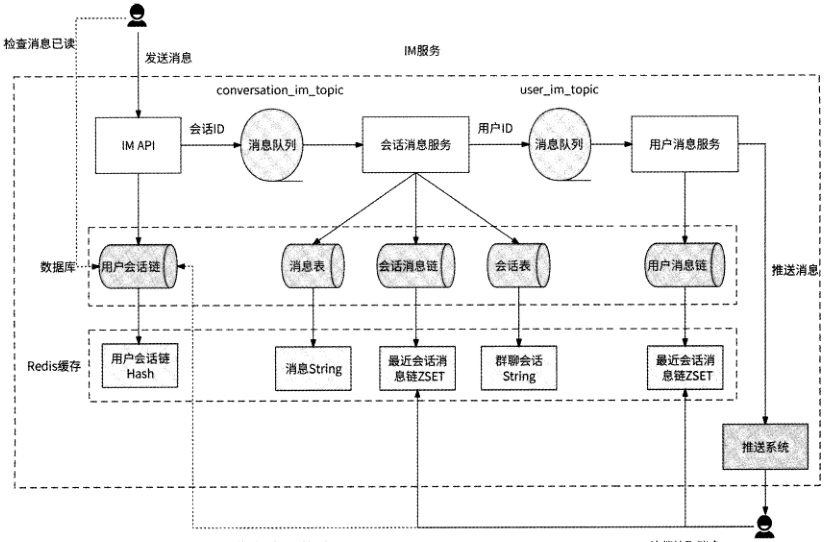

```text
周期性上报已读消息    补偿拉取消崽
```

图 13-13

[原 PDF 第 433 页](../%E4%BA%BF%E7%BA%A7%E6%B5%81%E9%87%8F%E7%B3%BB%E7%BB%9F%E6%9E%B6%E6%9E%84%E8%AE%BE%E8%AE%A1%E4%B8%8E%E5%AE%9E%E6%88%98%20%28--%29%20%28manongshu.com%29.pdf#page=433)

反侵权盗版声明

电子工业出版社依法对本作品享有专有出版权。任何未经权利人书面许可，复

制、销售或通过信息网络传播本作品的行为；歪曲、篡改、剽窃本作品的行为，均违反

《中华人民共和国著作权法》,其行为人应承担相应的民事责任和行政责任，构成犯罪

的，将被依法追究刑事责任。

为了维护市场秩序,保护权利人的合法权益,我社将依法查处和打击侵权盗版的

单位和个人。欢迎社会各界人士积极举报侵权盗版行为，本社将奖励举报有功人员，并

保证举报人的信息不被泄露。

举报电话：(010)88254396; (010)88258888

传 真：(010)88254397

E-mail： dbqq@phei.com.cn

通信地址：北京市万寿路173信箱 电子工业出版社总编办公室

```text
     由 B    编：100036
```
