[原 PDF 第 19 页](../%E4%BA%BF%E7%BA%A7%E6%B5%81%E9%87%8F%E7%B3%BB%E7%BB%9F%E6%9E%B6%E6%9E%84%E8%AE%BE%E8%AE%A1%E4%B8%8E%E5%AE%9E%E6%88%98%20%28--%29%20%28manongshu.com%29.pdf#page=19)

# 第1章 大型互联网公司的基础架构

在如今这个互联网高度发达的时代，互联网应用已经深度渗透到我们每个人的衣食住行、学习、娱乐等各种生活日常中，你可以在电商应用中选择自己喜欢的衣服，在本地生活应用中“种草”美食小吃，还可以在旅行应用中打车、购票等。从你在一个应用中触碰了某个按钮到相关数据流畅地呈现在你的眼前，你可能会好奇：数据响应得如此迅速，应用后台到底是怎么做到的？这就是本章要讨论的话题，本章将从宏观的角度详细介绍一个用户请求被发起到最终被响应这个过程所经过的完整链路，以及链路上各个角色的技术原理，以便让读者对大型互联网公司的机房架构有一个初步的认识。本章涵盖的基础架构知识较多，大体内容组织结构如下。

- 1.1节对单机房内部重要组成成员做简要介绍。本节内容是本章的引言。

- 1.2节和1.3节分别介绍DNS与HTTP DNS,目的是让读者了解客户端用户请求是如何进入机房与后台服务进行通信的。

- 1.4节介绍接入层技术，包括四层负载均衡器LVS与七层负载均衡器Nginx的技术原理、高可用架构。

- 1.5节和1.6节分别介绍服务发现与RPC服务。

- 1.7节〜1.10节介绍存储层技术，包括MySQL、Redis、LSM Tree以及其他NoSQL数据库。

- 1.11节介绍Kafka消息中间件技术。

- 1.12节〜1.14节介绍大型互联网公司的多机房架构，包括主备机房、同城双活、异地多活O

本章关键词：DNS、负载均衡、服务发现、RPC、MySQL、Redis、NoSQL、消息中间件、同城双活、异地多活、DRCo

## 1.1 引言：单机房的内部架构

所谓的应用后台就是指机房。机房架构是一个庞大的工程，你可能听说过很多大型互

[原 PDF 第 20 页](../%E4%BA%BF%E7%BA%A7%E6%B5%81%E9%87%8F%E7%B3%BB%E7%BB%9F%E6%9E%B6%E6%9E%84%E8%AE%BE%E8%AE%A1%E4%B8%8E%E5%AE%9E%E6%88%98%20%28--%29%20%28manongshu.com%29.pdf#page=20)

联网公司曾在各种技术峰会上介绍它们的“三地五中心”多机房，甚至是全球异地多活机房等，这些“高大上”的话题讨论的都是机房架构的内容。机房最简单的形式是单机房，本章会用大量篇幅来讨论它。虽然拥有亿级用户的互联网应用的底层不大可能采用这种架构，但是它是我们了解机房架构的重要基础。首先，在建设多机房前，我们需要熟悉一个机房的“五脏六腑”，只有非常清楚地知道单机房架构的技术细节，才能轻车熟路地构建多机房架构；其次，各互联网公司的多机房架构体系并不是一步到位搭建的，而是随着用户的逐步扩张一步步演进而来的。让我们先抛开那些知名互联网公司今天的荣耀，回到它们过去艰难的岁月，一般而言，这些公司在创业起步阶段的特点如下。

- 用户量级相对较小。

- 研发工程师较少。

- 产品营收能力较差，现金储备紧张。

如果初创互联网公司选择直接构建多机房架构，则将是一件非常困难的事情。因为它要求公司：

- 已拥有海量用户，且难以接受机房级别的故障。海量用户意味着有海量数据、海量请求，单机房的资源已经无法满足业务需求，需要拓展到多机房；而且，如果发生了机房级别的不可用故障，则等于整个应用完全不可用，将会给公司造成难以承受的巨大损失。

- 研发工程师较多，且有多机房领域的架构师。多机房需要应对数据一致性、机房调度等复杂的技术问题，需要有大量专人投入建设。

- 现金流畅通。每个机房的选址、光缆铺设、电路铺设、设备采购、网络带宽、服务器维护，甚至防火、防水等都需要消耗大量的经济成本，这就不得不要求公司有一定的现金储备。

综上所述，从投入产出比的角度来说，初创互联网公司一般先使用单机房充当应用后台。典型的单机房架构如图1-1所示，其中包含各种重要角色。

假设这个单机房架构服务于某互联网社交应用Friendy,并为用户提供Web端和移动客户端两种使用途径，其中各角色的功能如下。

- DNS服务器负责将用户访问Friendy的域名映射为公网IP地址(或称为整个机房的入口 IP地址)，然后用户请求就可以通过IP协议进入机房了。

- LVS提供对外的公网IP地址作为机房的入口，同时作为四层负载均衡器将用户请求分发到Nginx集群。

- Nginx作为七层负载均衡器，根据HTTP(S)请求的协议头或URL路径规则将用户请求转发到对应的业务HTTP服务器。

- 业务服务层的HTTP服务真正处理用户请求，根据不同的HTTP URL向RPC服务

[原 PDF 第 21 页](../%E4%BA%BF%E7%BA%A7%E6%B5%81%E9%87%8F%E7%B3%BB%E7%BB%9F%E6%9E%B6%E6%9E%84%E8%AE%BE%E8%AE%A1%E4%B8%8E%E5%AE%9E%E6%88%98%20%28--%29%20%28manongshu.com%29.pdf#page=21)

发送业务逻辑处理请求。

- 业务服务层的RPC服务执行核心业务逻辑。如果业务逻辑涉及读/写数据，那么它会进一步访问数据层；如果业务逻辑涉及与其他RPC服务的交互，那么它也会调用其他RPC服务。

- 存储层是所有存储系统的集合，包括分布式缓存、关系型数据库、NoSQL数据库等。分布式缓存提供数据缓存，用于应对高并发的读请求访问；关系型数据库作为持久化存储保存用户数据（需要注意的是，若无特殊说明，本书后续章节提及的数据库均为关系型数据库），常见的关系型数据库包括MySQL、SQLite. SQLServer等；NoSQL数据库是一个大类，被应用于关系型数据库无法发挥作用的场景。

- 服务发现负责保存每个服务的动态访问地址列表，以便其他服务可以快速查找到

某服务的访问地址。其功能与DNS相似。

- 消息中间件作为常用的研发中间件，用于请求异步执行、服务间解耦、请求削峰

填谷。

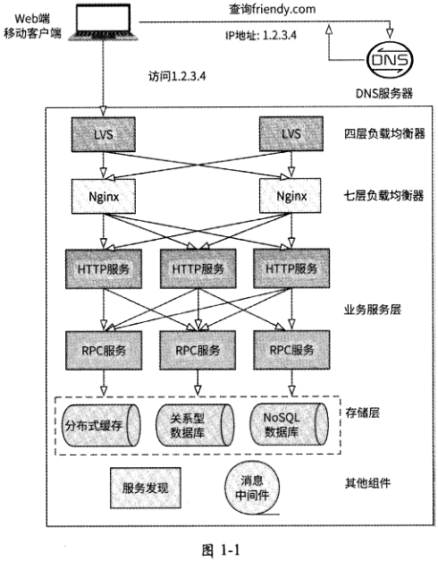

[原 PDF 第 22 页](../%E4%BA%BF%E7%BA%A7%E6%B5%81%E9%87%8F%E7%B3%BB%E7%BB%9F%E6%9E%B6%E6%9E%84%E8%AE%BE%E8%AE%A1%E4%B8%8E%E5%AE%9E%E6%88%98%20%28--%29%20%28manongshu.com%29.pdf#page=22)

在简单了解了单机房架构的组成角色之后，接下来将详细介绍各角色的相关技术与技术选型，以便读者对这些角色存在的意义能有更深刻的理解，甚至将来可以以架构师的身份主导一个互联网应用的机房建设工作。

## 1.2 客户端连接机房的技术1：DNS

客户端启动时要做的第一件事情就是通过互联网与机房建立连接，然后用户才可以在客户端与后台服务器进行网络通信。目前在计算机网络中应用较为广泛的网络通信协议是TCP/IP,它的通信基础是IP地址，因为IP地址有如下两个主要功能。

- 标识设备：接入网络的设备必须有一个独一无二的IP地址，这样才能唯一标识一个网络目标。

- 网络寻址：将数据包从一个网络设备发送到另一个网络设备，需要携带目标网络设备的IP地址，通过TCP/IP中的IP路由寻址功能，数据包最终可以到达目标网络设备。

客户端要与机房建立连接，就需要知道机房公网IP地址（暴露在互联网中可访问的IP地址），但是IP地址通常由一串冰冷的数字组成，没有可读性，不方便记忆，于是人们又制定出另一套字符型的地址方案：域名地址。“域名”是大家都很熟悉的名词，在浏览器中输入简单易记的域名（如www.baidu.com ）,就可以访问到对应的网站，它的底层其实是由DNS来实现的。

### 1.2.1 DNS的意义

DNS （ Domain Name System,域名系统）是互联网中的核心服务，它维护域名与对应IP地址的映射关系，并提供将域名翻译为IP地址的域名解析功能。DNS在互联网中有非常广泛的应用，它为用户和互联网公司带来了很多便利。例如：

- 互联网公司可以创建简单、便于用户记忆的域名并注册到DNS服务器，用户仅需输入域名就能访问到对应的网站。

- 通过维护域名与多个IP地址的映射关系，DNS可以将针对同一个域名的不同用户请求解析到不同的IP地址，从而缓解单一后台服务器的资源压力。

- 互联网公司因架构升级、网络改造等需要变更机房公网IP地址时，仅需在DNS服务器中重新配置最新的IP地址，而不会对用户造成任何干扰。

- 基于DNS可以实现灵活的负载均衡策略，比如DNS服务器可以对IP地址进行监测一如果发现机房某公网IP地址对应的服务器宕机，那么DNS服务器可以将这个IP地址及时摘除，防止用户无法访问后台。

[原 PDF 第 23 页](../%E4%BA%BF%E7%BA%A7%E6%B5%81%E9%87%8F%E7%B3%BB%E7%BB%9F%E6%9E%B6%E6%9E%84%E8%AE%BE%E8%AE%A1%E4%B8%8E%E5%AE%9E%E6%88%98%20%28--%29%20%28manongshu.com%29.pdf#page=23)

接下来详细介绍DNS的技术原理。

### 1.2.2 域名结构

如图1-2所示，域名采用了层次化的树形结构来命名。树的顶端节点为根，根的下一层称为顶级域名，指的是域名的后缀部分，如最常见的.com. .net等通用域或者.cn、.us等国家域；顶级域名的下一层是二级域名，指的是域名的倒数第二部分，一般表示域名注册人或主体所使用的网络名称，如google.com、apple.com；二级域名的下一层是三级域名，指的是域名的倒数第三部分，表示二级域名的子域名。实际上，域名可能还包括四级域名、五级域名等，它们的含义根据上文类推，每一级域名都控制下一级域名的分配。

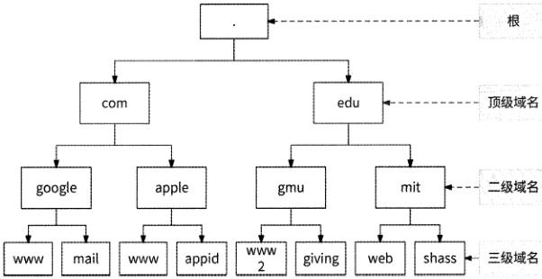

图1-2

对于域名mail.google.com来说，顶级域名是.com,二级域名是google.com,三级域名是 mail.google.como

### 1.2.3 域名服务器

按照域名的层级结构，可以把域名服务器分为4种不同的类型。

1.根域名服务器(根DNS服务器)

根域名服务器是全球互联网的中枢神经，它负责互联网顶级域名的解析，即它掌握着全部顶级域名的名称与IP地址的映射关系。目前全球仅有13台IPv4根域名服务器，其中主根域名服务器部署在美国，其余12台辅根域名服务器有9台部署在美国、2台部署在欧洲、1台部署在日本。根域名服务器由美国政府授权的互联网名称与数字地址分配机构(ICANN )统一管理。

[原 PDF 第 24 页](../%E4%BA%BF%E7%BA%A7%E6%B5%81%E9%87%8F%E7%B3%BB%E7%BB%9F%E6%9E%B6%E6%9E%84%E8%AE%BE%E8%AE%A1%E4%B8%8E%E5%AE%9E%E6%88%98%20%28--%29%20%28manongshu.com%29.pdf#page=24)

2. 顶级域名服务器（顶级DNS服务器）

顾名思义，顶级域名服务器负责管理在每个顶级域名下注册的二级域名解析工作，即它可以根据二级域名寻找到二级域名服务器的IP地址。顶级域名服务器就相当于一个朝代的封疆大吏。

3. 权威域名服务器（权威DNS服务器）

权威域名服务器负责对特定的域名进行解析，它管理顶级域名下的二级域名、三级域名、四级域名等的服务器。从名字中的“权威”可以看出，权威域名服务器最终决定了一

个域名到底应该被解析成哪个IP地址，它是DNS中最核心的部分。

每个域名对应的权威域名服务器都可能不同，每个权威域名服务器仅可解析它负责的

域名，比如负责google.com域名的权威域名服务器无法解析域名apple.com。大型互联网公司一般会自建权威域名服务器，而中小型企业一般会将域名托管给知名的权威域名服务商。

4. 本地域名服务器（本地DNS服务器）

本地域名服务器不属于域名层次结构中的任何一层，但是它对DNS非常重要，相当于域名解析的缓存。任何一台主机在进行网络地址配置时，都会配置一台域名服务器作为本地域名服务器，它是主机在进行域名查询时首先要查询的域名服务器。本地域名服务器一般由网络运营商提供，它作为主机访问网络时域名解析的总代理，会将域名解析结果缓

存到本地，以便加速主机后面的域名解析过程。

### 1.2.4 域名解析过程

域名解析一般采用递归查询方式执行，一个完整的域名解析过程如图1・3所示。

（1 ）当客户端访问某个域名时，会先在设备的本地缓存中查找是否有此域名对应的IP地址。本地缓存包括浏览器缓存和计算机系统Hosts文件DNS缓存。

（2） 如果本地缓存中没有对应的IP地址，则客户端向本地域名服务器发起域名解析请求。如果本地域名服务器保存了域名对应的IP地址，则可以直接返回；否则，本地域名服务器作为客户端的全权代理，递归地完成域名解析。

（3） 本地域名服务器先向根域名服务器发起域名解析请求。根域名服务器收到请求后，会根据所要查询的域名的后缀将所对应的顶级域名服务器（如.com）地址返回给本地域名服务器。

（4） 本地域名服务器根据返回结果向所对应的顶级域名服务器发起查询请求。顶级域名服务器会先查看自己的缓存中是否有此域名的解析记录，如果有，则将IP地址解析结果返回给本地域名服务器，本地域名服务器再将其返回给客户端，域名解析完成。而如果

[原 PDF 第 25 页](../%E4%BA%BF%E7%BA%A7%E6%B5%81%E9%87%8F%E7%B3%BB%E7%BB%9F%E6%9E%B6%E6%9E%84%E8%AE%BE%E8%AE%A1%E4%B8%8E%E5%AE%9E%E6%88%98%20%28--%29%20%28manongshu.com%29.pdf#page=25)

顶级域名服务器的缓存中没有解析记录，则将域名对应的权威域名服务器地址返回给本地域名服务器。

(5 )本地域名服务器继续向权威域名服务器发起域名解析请求。权威域名服务器最终将与域名关联的IP地址返回给本地域名服务器，本地域名服务器再将其返回给客户端，域名解析完成。

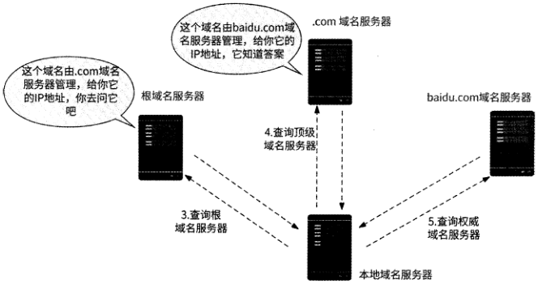

www.baidu.com 的 IP地址是LLL1

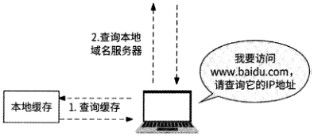

图1-3

可以看到，除客户端查询本地缓存和本地域名服务器发起请求之外，域名解析的其余各环节均以本地域名服务器为中心进行递归查询，本地域名服务器在域名解析的整个环节中承担了代理的角色。

需要额外说明的是，一旦本地域名服务器获得域名解析记录，它就会在本地进行记录缓存，以便下次客户端再向它查询同一个域名时可以直接获得结果，而不用再进行递归查询了。被缓存的域名解析记录格式大致如图1・4所示。

```text
                  I Domain    Clsss I
                               TTL    Type    Rdata
                                1    1    1    1
```

!

```text
                      域名    生存周期    协议类型    记录类型    记录数据
                  www.baidu.com    600s    IN    A    1.L1.1
```

图1・4

[原 PDF 第 26 页](../%E4%BA%BF%E7%BA%A7%E6%B5%81%E9%87%8F%E7%B3%BB%E7%BB%9F%E6%9E%B6%E6%9E%84%E8%AE%BE%E8%AE%A1%E4%B8%8E%E5%AE%9E%E6%88%98%20%28--%29%20%28manongshu.com%29.pdf#page=26)

当查询域名www.baidu.com时，域名解析记录会包含如下数据。

- 生存周期（TTL）：表示这条记录在本地域名服务器中被缓存的时长。

- 协议类型（Class）： 一般标识为IN,表示因特网。

- 记录类型（Type ）： A表示IPv4地址，AAAA表示IPv6地址。

- 记录数据（Rdata ）：与域名关联的地址信息。

## 1.3 客户端连接机房的技术2：HTTP DNS

DNS解析是用户访问互联网的第一步，如果这一步产生了较大的网络延迟、故障甚至是数据错误，则会严重影响用户体验。如上文所述，DNS有很多优势，但是它也存在一些问题（见1.3.1节）。业界很多互联网公司都尝试去解决这些问题，比如腾讯、字节跳动、百度等公司已经给出了较为成熟的解决方案：HTTP DNSo

### 1.3.1 DNS存在的问题

首先介绍一下DNS存在哪些问题。

首先，域名解析需要进行递归查询，这势必会带来更高的访问延迟。在理想的情况下,DNS解析只需要几毫秒或者几十毫秒就完成了，但是在实际应用中常常有Is以上的情况出现。

其次，由于本地域名服务器是分地区、分运营商的，不同运营商实现的DNS解析策略不同。而且，由于权威域名服务器获取的是本地域名服务器的IP地址，而非客户端的IP地址，所以在定位客户端地理位置时不一定准确，最终域名解析得到的IP地址对于客户端而言可能不是距离最近、最优的访问节点。更有甚者，某些运营商为了节约资源，会直接将域名解析请求转发到其他运营商的本地域名服务器（即“域名转发”），这样做的后果就是用户得到了与其网络运营商不相符的IP地址，用户访问网络请求变慢。

最后，更重要的是DNS劫持问题。DNS劫持是一种互联网攻击方式，通过干预域名服务器把域名解析到错误的IP地址上，以达到用户无法访问目标网站或访问恶意网站的目的。很多知名的互联网公司备受DNS劫持的困扰，运营商可能基于本地域名服务器做DNS劫持，黑客可能篡改计算机Hosts文件做DNS劫持。

大家可能都有这样的经历：在浏览一个正常的网站时，左下角总会弹出各种与网站内容画风格格不入的垃圾广告，这很可能就是运营商DNS劫持的结果，尤其是那些一味追求广告收入的小运营商。运营商DNS劫持危害不大，至多是影响用户访问互联网的体验，但如果是黑客做DNS劫持，那么用户很有可能会被引导到竞争对手的网站，甚至是危害

[原 PDF 第 27 页](../%E4%BA%BF%E7%BA%A7%E6%B5%81%E9%87%8F%E7%B3%BB%E7%BB%9F%E6%9E%B6%E6%9E%84%E8%AE%BE%E8%AE%A1%E4%B8%8E%E5%AE%9E%E6%88%98%20%28--%29%20%28manongshu.com%29.pdf#page=27)

用户安全的钓鱼网站。很多知名的互联网公司长期被DNS劫持攻击，比如腾讯公司在2014年的一个技术分享中透露，腾讯域名在全国各地的日解析异常量已经超过80万条，给腾讯公司的各业务带来巨大损失。

### 1.3.2 HTTP DNS的原理

HTTP DNS是基于HTTP,具有DNS解析能力的网络服务。HTTP DNS的原理非常简单：

（1 ）客户端指定HTTP DNS服务器的IP地址（如5.5.5.5 ）,使用HTTP调用域名解析接口/d,并传入待解析的域名和客户端的IP地址。HTTP DNS服务器负责向权威DNS服务器发起域名解析请求，并将最优IP地址返回。

（2）客户端获取到域名IP地址后，直接向此IP地址发送业务协议请求。如果客户端需要访问业务请求http://go.friendy.com/feed,则在HTTP header中指定Host字段为此IP地址即可。

图1・5展示了 HTTP DNS解析过程，并与域名解析过程做了简单的对比。

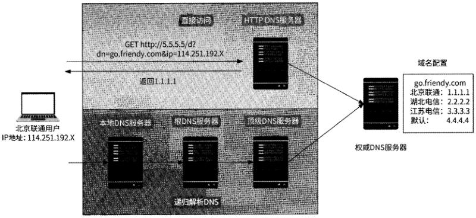

图1-5

需要注意的是，HTTP DNS服务器不通过域名提供服务（否则又需要域名解析），只通过一个固定的IP地址提供服务。这里读者可能会有疑问：不同网络运营商的用户访问同一个HTTP DNS服务的IP地址，用户访问延迟问题如何解决？高可用性如何保证？

实际上，HTTP DNS服务提供商会采用如BGP （边界网关协议）等手段让这个IP地址在全国各地都做到就近访问。以腾讯云HTTP DNS产品为例，它接入了 BGP Anycast网络架构，与全国最主要的17个运营商建立了 BGP互联，确保各个运营商的用户都能快

[原 PDF 第 28 页](../%E4%BA%BF%E7%BA%A7%E6%B5%81%E9%87%8F%E7%B3%BB%E7%BB%9F%E6%9E%B6%E6%9E%84%E8%AE%BE%E8%AE%A1%E4%B8%8E%E5%AE%9E%E6%88%98%20%28--%29%20%28manongshu.com%29.pdf#page=28)

速访问到HTTP DNS服务器；同时，腾讯云在多个数据中心部署了多个HTTP DNS服务节点，任意节点发生故障均可无缝切换到备用节点，保证了 HTTP DNS服务的高可用。感兴趣的读者可以在腾讯云官网了解更多技术细节。

HTTP DNS H是将域名解析协议由DNS协议换成了 HTTP,原理并不复杂。但是相较于DNS,这一微小的变化带来了如下好处。

- 降低域名解析延迟：通过直接访问HTTP DNS服务器，缩短了域名解析链路，不再需要递归查询。

- 防止域名劫持：将域名解析请求直接通过IP地址发送至HTTP DNS服务器，绕过运营商本地DNS服务器，避免了域名劫持问题。

- 调度精准性更高：HTTP DNS服务器获取的是真实客户端的IP地址，而不是本地DNS服务器的IP地址，即能够基于精确的客户端位置、运营商信息，将域名解析到更精准的、距离更近的IP地址，让客户端就近接入后台服务节点。

- 快速生效：当与域名关联的IP地址发生变更时，HTTP DNS服务不受传统DNS技术多级缓存的影响，域名更新能够更快地覆盖到全量客户端。

### 1.3.3 HTTP DNS实践

虽然HTTP DNS有诸多优势，但是我们并不能认为它可以完全取代DNS。鉴于域名解析的重要性，客户端网络SDK在实现接入机房的逻辑时应该设计足够强大的容灾策略，尽力保证域名解析的可用性。

（1 ）客户端使用HTTP DNS尝试解析域名。

（2） 如果HTTP DNS服务器返回空数据或者网络错误，那么客户端继续向本地DNS服务器发起域名解析请求，即降级到使用DNS技术。

（3） 如果DNS解析也遭遇失败，那么客户端将直接使用预留的域名兜底IP地址作为域名解析结果。我们可以通过客户端约定写死或服务端下发配置的方式为业务核心域名设置对应的兜底IP地址。访问兜底IP地址意味着可能增加用户请求延迟，但是至少能保证用户不会被域名解析挡在门外。

另外，在HTTP DNS的实践中可以引入如下策略。

- 安全策略：HTTP DNS是基于标准的HTTP的，为了保证数据安全，可以更进一步使用HTTPS o

- IP地址选取策略：HTTP DNS服务可以将最优IP地址按照顺序多个下发，客户端默认选取第一个IP地址优先校验连通性，如果连通性不佳，则再选取下一个IP地址。

[原 PDF 第 29 页](../%E4%BA%BF%E7%BA%A7%E6%B5%81%E9%87%8F%E7%B3%BB%E7%BB%9F%E6%9E%B6%E6%9E%84%E8%AE%BE%E8%AE%A1%E4%B8%8E%E5%AE%9E%E6%88%98%20%28--%29%20%28manongshu.com%29.pdf#page=29)

- 批量拉取策略：在客户端应用冷启动或网络切换（如将Wi-Fi切换到蜂窝网络）时，客户端自动批量拉取域名和IP地址列表的映射数据并缓存，以便在后续请求中使用，预期提升精准调度能力和域名解析性能。

## 1.4 接入层的技术演进

在介绍完客户端如何接入机房后，下一步讨论机房收到客户端请求后的调度处理问题。在互联网发展的早期阶段，很多小型互联网服务的后台架构其实非常简单，几乎只有

业务服务器“裸奔”在所谓的“机房”里，如图1-6所示。

wwwJriendy.com

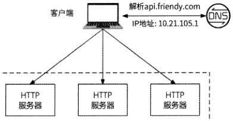

10.21.105.1

10.21105.2

10.21.105.3

地址：10.2L105.1 IP地址:10.2L105.2 申地址:10.21.105.3!

图1-6

从图1-6中可以看出，业务后台HTTP服务器直接绑定公网IP地址与客户端建立网络连接，DNS服务器对其域名的解析结果就是HTTP服务器的一个公网IP地址。

这种架构非常轻量、清晰，但是存在如下问题，并不适合作为互联网公司的后台工业级应用架构。

- 可用性低：如果某个业务服务实例宕机，那么DNS服务器将无法高效地感知到其IP地址已不可用，导致被DNS解析到此IP地址的用户请求均不可用。

- 可扩展性差：当业务服务需要扩容时，总需要额外配置DNS；而且受限于DNS解析的生效周期，扩容后的服务新地址难以实时生效。

- 安全风险高：业务服务的IP地址都是公网IP地址，这相当于后台的所有网络地址都暴露在公网环境中，存在网络安全隐患。

如何解决这些问题呢？在软件架构领域有一句很经典的话：“计算机科学领域的任何问题都可以通过增加一个间接的中间层来解决”。没错，我们也可以在客户端和业务服务的连接之间引入一个中间层：一方面，它需要负责提高业务服务的可用性和可扩展性，这要求中间层有丰富的功能；另一方面，它还要充当客户端访问业务服务的总代理，将用户流量按规则转发到某个业务服务实例上，这又要求中间层有非常高的性能。那么，什么样

[原 PDF 第 30 页](../%E4%BA%BF%E7%BA%A7%E6%B5%81%E9%87%8F%E7%B3%BB%E7%BB%9F%E6%9E%B6%E6%9E%84%E8%AE%BE%E8%AE%A1%E4%B8%8E%E5%AE%9E%E6%88%98%20%28--%29%20%28manongshu.com%29.pdf#page=30)

的服务器可以充当中间层呢？那就是大名鼎鼎的Nginx, 一个被各大互联网公司广泛用作用户流量接入中间层的多功能、高性能的服务器。接下来对Nginx做一些必要的功能性介绍。

### 1.4.1 Nginx

Nginx是一种自由的、开源的、高性能的HTTP服务器和反向代理服务器，同时也是IMAP, POP3、SMTP的代理服务器。Nginx既可以作为HTTP服务器进行网站的发布处理，也可以作为反向代理实现负载均衡功能。

代理的含义非常简单。比如我们需要做某件事但是又不想亲自去做，这时可以找另一个人帮我们去做，这个人就是我们做某件事的代理；再比如租房中介公司就是我们租房的代理。在网络接入层，代理分为正向代理和反向代理。

在我们的日常工作中，正向代理很常见，比如很多公司为了自身的网络安全，不允许

居家的员工使用互联网直接访问公司的办公网络环境，而是必须手动配置公司VPN（虚拟专用网络）后才能接入访问。这里VPN充当的就是正向代理的角色，即代理客户端去访问网络。

反向代理的运行方式是代理服务器对外接收互联网上的客户端请求，然后将请求转发到内部网络的目标服务器，并将目标服务器的执行结果返回给客户端。反向代理对外表现得就像目标服务器一样，客户端并不会知道自己访问的其实是一个代理。

总结起来，正向代理与反向代理的核心区别就是：正向代理代理的是客户端，反向代理代理的是服务器，就像图1・7展示的那样。

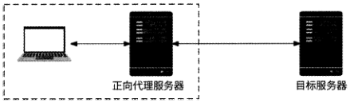

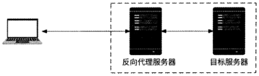

图1-7

Nginx能很好地充当反向代理，是因为它有强大的基于域名和HTTP URL的路由转发功能，我们只需要对配置文件nginx.conf做一些简单配置就能轻易搭建出一台反向代理服

[原 PDF 第 31 页](../%E4%BA%BF%E7%BA%A7%E6%B5%81%E9%87%8F%E7%B3%BB%E7%BB%9F%E6%9E%B6%E6%9E%84%E8%AE%BE%E8%AE%A1%E4%B8%8E%E5%AE%9E%E6%88%98%20%28--%29%20%28manongshu.com%29.pdf#page=31)

务器。下面举一个例子。

假设Friendy应用内置了内容推荐、点赞和评论功能，这三个功能在服务端对应于三个HTTP业务服务：feed服务、like服务、comment服务。每个HTTP业务服务都有两个服务器实例，如表1・1所示。

表1-1

```text
              服务名    服务器实例地址列表
 feed服务    10.1.0.1:8080, 10.1.0.2:8080
 like服务    10.2.0.1:8081, 10.2.0.2:8081
 comment月艮务    10.3.0.1:8082, 10.3.0.2:8082
```

Friendy应用的内容推荐、点赞、评论功能与后台服务器的HTTP通信接口 URL分别为/feed、/like、/comment,且均以 api.friendy.com 作为域名。

因为Nginx服务器作为三个后台服务的反向代理，提供公网IP地址122.14.229.192,对域名api.friendy.com进行DNS解析会得到这个IP地址，所以Friendy客户端在进行内容推荐、点赞、评论操作时，用户请求将通过网络被传递到这台Nginx服务器。

这台Nginx服务器的配置文件nginx.conf的内容如下：

```text
    worker_processes 3;
```

events (

```text
        worker_connections 1024;
    http {
        keepalive_timeout 60;
        upstream api_friendy_feed {
           server 10.1.0.1:8080;
           server 10.1.0.2:8080;
        )
        upstream api_friendy_like {
           server 10.2.0.1:8081;
           server 10.2.0.1:8081;
        }
```

upstream api__friendy_comment (

```text
           server 10.3.0.1:8082;
           server 10.3.0.1:8082;
        }
```

server (

```text
           listen 80;
```

[原 PDF 第 32 页](../%E4%BA%BF%E7%BA%A7%E6%B5%81%E9%87%8F%E7%B3%BB%E7%BB%9F%E6%9E%B6%E6%9E%84%E8%AE%BE%E8%AE%A1%E4%B8%8E%E5%AE%9E%E6%88%98%20%28--%29%20%28manongshu.com%29.pdf#page=32)

```text
           serverename api.friendy.com;
           } ~
           location /feed {
              proxy_pass http: //api__f riendy_feed;
           } ~
```

location /like （

```text
              proxy_pass http://api_friendy_like;
           } ""
           location /comment {
              proxy_pass http://api_friendy_comment;
        }
     }
```

接下来对配置文件的内容进行简单解释（注意，这里仅聚焦于Nginx如何配置反向代理而有选择地介绍一些配置项，更多关于Nginx配置的解释可以参考Nginx官网）。

在配置文件中，worker_processes配置项表示Nginx将启动几个工作进程来处理用户请求；events配置块中的worker_connections配置项表示每个工作进程允许同时最多建立多少个网络连接。这些都是与TCP高性能服务器相关的配置，并非本书重点。我们需要重点关注的是http配置块，其中有两个子配置块：server和upstream。

server配置块中的配置项代表Nginx实际启动的HTTP服务器所需的各种参数。

- listen： HTTP服务器监听的端口号。

- server_name：用于设置虚拟主机服务名称，用户请求的HTTP请求头会根据Host字段与server_name进行匹配，如果匹配成功，则用户请求被对应的server配置块处理。这里的匹配支持正则表达式。

- location：这是Nginx作为反向代理最重要的配置项之一，每个location都用于指定一个HTTP URL相对路径的处理规则。上面的nginx.conf文件配置了/feed、/like以及/comment请求的处理规则。

location配置块中的proxyjpass是反向代理的另一个重要的配置项，它决定了某个HTTP URL需要被谁代理，代理者可以是一个明确的网络地址，也可以是一个服务池名称。对于本节的Nginx配置而言，/feed、/like、/comment的location配置块分别指定了这三类请求应该被代理到服务池 api_friendy_feedapi_friendy_like 和 api friendy commento

upstream配置块表示一个服务池，其中的server配置项表示这个服务池中有哪些服务器实例，以及这些服务器实例的地址。上面的nginx.conf文件分别为feed服务、like服务、comment服务配置了对应的服务池。当用户请求被代理到某个服务池后，Nginx会默认以轮询的方式从服务池中选择一个服务器实例作为目标服务器来转发请求。

[原 PDF 第 33 页](../%E4%BA%BF%E7%BA%A7%E6%B5%81%E9%87%8F%E7%B3%BB%E7%BB%9F%E6%9E%B6%E6%9E%84%E8%AE%BE%E8%AE%A1%E4%B8%8E%E5%AE%9E%E6%88%98%20%28--%29%20%28manongshu.com%29.pdf#page=33)

综上所述，Nginx服务器先以80端口启动对外服务，当收到请求头Host为api.friendy.com的HTTP请求后，根据请求的HTTP URL相对路径做进一步处理。

- 如果相对路径是/feed,则在api_friendy_feed服务池中选择一个服务器实例作为目标服务器转发请求。

- 如果相对路径是/like,则在api_friendy_like服务池中选择一个服务器实例作为目标服务器转发请求。

- 如果相对路径是/comment,则在api_friendy_comment服务池中选择一个服务器实例作为目标服务器转发请求。

至于Nginx会在服务池中选择哪一个服务器实例作为目标服务器，就是Nginx的负载均衡功能的职责了。Nginx常见的负载均衡策略如下。

- 轮询：将每个请求按时间顺序逐一分配到不同的后端服务器，如果某台后端服务器死机，则自动剔除故障系统，使用户访问不受影响。这是Nginx默认的负载均衡策略。

- 加权轮询：为服务器实例配置引入访问权重(weight),权重值越大的服务器实例越容易被访问。例如，在如下服务池配置中，为每个服务器实例设置了不同的权重。

upstream backend (

```text
        server 192.168.1.5:80 weight=10;
        server 192.168.1.6:81 weight=l;
        server 192.168.1.7:82 weight-3;
     }
```

- ip_hash：为每个用户请求按照IP地址的哈希结果分配服务器实例，使得来自同一个IP地址的请求一直访问同一个服务器实例oNginx使用ip_hash配置项指定此策略。需要说明的是，此策略不保证服务器实例的负载均衡，可能存在个别服务器实例的访问量很大或很小的情况。

upstream backend (

```text
        ip_hash;
        server 192.168.1.6:81;
        server 192.168.1.7:82;
```

- least_conn：此策略将请求转发给连接数最少的服务器实例。轮询、加权轮询的策略会把请求按照一定的比例分发到各服务器，但是有些请求响应时间长，如果把这些响应时间长的请求大比例地发送到某台服务器，那么随着时间的推移，这台服务器的负载会比较大。在这种情况下，适合采用least_conn策略，它能实现更好的负载均衡。

[原 PDF 第 34 页](../%E4%BA%BF%E7%BA%A7%E6%B5%81%E9%87%8F%E7%B3%BB%E7%BB%9F%E6%9E%B6%E6%9E%84%E8%AE%BE%E8%AE%A1%E4%B8%8E%E5%AE%9E%E6%88%98%20%28--%29%20%28manongshu.com%29.pdf#page=34)

- url_hash：来自第三方模块nginx-upstream-hash,此策略与ip_hash类似，不同之处是它需要对请求URL做哈希运算。这种策略可以有效提高同一个用户请求的缓存命中率。

- fair：来自第三方模块nginx-upstream-failr,此策略根据每个服务器实例的请求响应时间、请求失败数、当前总请求量，综合选择一台最为空闲的服务器。

Nginx的负载均衡功能决定了一个HTTP请求最终被路由到哪个服务器实例，而HTTP位于OSI七层模型的第七层（应用层），所以Nginx作为反向代理也常被称为“七层负载均衡器”。

客户端 a

综上所述，nginx.conf配置文件描述的机房接入层架构如图1-8所示。

Bfrapi.friendy.com


IPW: 122.14.229192

```text
                    I I Nginx    i
```

机房

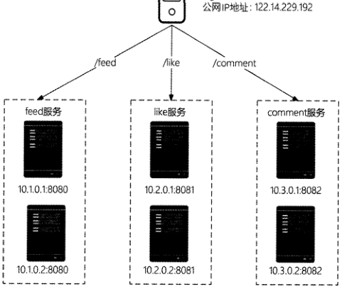

图1-8

- Nginx服务器作为feed服务、like服务、comment服务的反向代理服务器，是后台服务器机房的总入口，通过公网IP地址直接与客户端进行通信。

- Nginx根据收到的HTTP请求的URL相对路径，决定将请求转发到哪个服务以及哪个服务器实例，最后完成客户端与后台服务器中业务服务的交互。

[原 PDF 第 35 页](../%E4%BA%BF%E7%BA%A7%E6%B5%81%E9%87%8F%E7%B3%BB%E7%BB%9F%E6%9E%B6%E6%9E%84%E8%AE%BE%E8%AE%A1%E4%B8%8E%E5%AE%9E%E6%88%98%20%28--%29%20%28manongshu.com%29.pdf#page=35)

需要注意的是，Nginx服务器需要将每个业务服务的网络地址设置在nginx.conf配置文件中，才能实现与业务服务的通信。但是业务服务会频繁地迭代与扩容，这意味着Nginxupstream服务池中的服务器实例地址列表会频繁地变更。频繁地更新nginx.conf配置文件并不现实，所以我们需要找到一种Nginx实时感知业务服务地址列表变更的方案(具体参见1.5节介绍的服务注册与服务发现，现在仅需知道可以从服务注册中心获取每个服务的最新可用地址列表即可)o

好在Nginx拥有足够多功能强大的模块可以帮助解决这个问题。下面先介绍两个Nginx模块。

- ngx lua:这个模块将Lua语言嵌入Nginx,从而允许开发人员编与Lua脚本并部署到Nginx中执行。

- ngx_http_dyups_module:这个模块使得Nginx不用重新启动就能热更新upstream配置并生效。

Nginx使用Lua脚本实现服务发现的流程如下所述，如图1-9所示。

(1)每隔一段时间(如3s)就从服务注册中心获取一次nginx.conf配置文件中所有upstream配置的服务地址列表。

(2 )获取服务地址列表成功，生成最新的upstream配置，通过ngx_http_dyups_module模块将其更新到Nginx工作进程中。

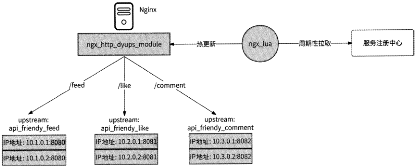

图1-9

使用Nginx作为业务服务器的反向代理有如下优势。

- DNS服务器指向Nginx服务器，业务服务器网络地址切换无须配置DNS。

- 在用户请求和业务服务器之间实现了负载均衡，更便于控制业务服务流量调度。

[原 PDF 第 36 页](../%E4%BA%BF%E7%BA%A7%E6%B5%81%E9%87%8F%E7%B3%BB%E7%BB%9F%E6%9E%B6%E6%9E%84%E8%AE%BE%E8%AE%A1%E4%B8%8E%E5%AE%9E%E6%88%98%20%28--%29%20%28manongshu.com%29.pdf#page=36)

- 对外只暴露一个公网IP地址，节约了有限的IP资源°Ngiiix服务器与业务服务器之间通过内网通信。

- 对业务服务器起到了保护作用，外网看不到业务服务器，只能看到不涉及业务逻辑的Nginx反向代理服务器。

- 增强了系统的可扩展性，业务服务器扩容能做到准实时生效。

- 提高了业务服务器的可用性。任何一个业务服务实例挂掉，Nginx服务器都可以将用户请求迁移到其他服务实例。

### 1.4.2 LVS

Nginx是一种高性能的服务器，其性能远高于业务服务器。但是Nginx毕竟是一个应用层软件，单台Nginx服务器能承载的用户请求也是有上限的，当日活用户发展到一定规模后，就需要Nginx集群才能顶住压力。既然是集群，那么势必需要引入一个中间层作为协调者，其负责决定将用户请求转发到哪台Nginx服务器。这个协调者需要有比Nginx更高的性能，它就是本节的主角：LVSo LVS （ Linux Virtual Server, Linux虚拟服务器）是一个虚拟的服务器集群系统，从Linux 2.6版本开始它已经成为Linux内核的一部分，即LVS运行于操作系统层面。

下面先介绍一下LVS和Nginx在转发请求时的区别。

- Nginx是基于OSI参考模型的第七层（应用层）协议开发的，采用了异步转发形式。Nginx在保持客户端连接的同时新建一个与业务服务器的连接，等待业务服务器返回响应数据，然后再将响应数据返回给客户端。Nginx选择异步转发的好处是可以进行失败转移（failover）,艮"如果与某台业务服务器的连接发生故障，那么就可以换另一个连接，提高了服务的稳定性。Nginx主要强调的是“代理”。

- LVS是基于OSI参考模型的第四层（网络层）协议开发的，采用了同步转发形式。当LVS监听到有客户端请求到来时，会直接通过修改数据包的地址信息将流量转发到下游服务器，让下游服务器与客户端直接连接。LVS主要强调的是“转发”。

由于LVS基于OSI参考模型的网络层，免去了请求到应用层的层层解析工作，而且LVS工作于操作系统层面，所以LVS相比于Nginx有更高的性能。LVS用于网络接入层时也被称为四层负载均衡器。既然LVS四层负载均衡器做的主要工作是转发，那么就需要讨论一下转发模式。目前，LVS主要有4种转发模式：NAT模式、FULLNAT模式、TUN模式、DR模式。

为了便于描述，在正式介绍这4种转发模式之前,下面介绍一下LVS常用的名词概念。

- DS （Director Server）：四层负载均衡器节点，也就是运行LVS的服务器。DS和LVS作为角色时是一个意思。

[原 PDF 第 37 页](../%E4%BA%BF%E7%BA%A7%E6%B5%81%E9%87%8F%E7%B3%BB%E7%BB%9F%E6%9E%B6%E6%9E%84%E8%AE%BE%E8%AE%A1%E4%B8%8E%E5%AE%9E%E6%88%98%20%28--%29%20%28manongshu.com%29.pdf#page=37)

- RS (Real Server)： DS请求转发的目的地，即真实的工作服务器。

- VIP( Virtual Server IP)：客户端请求的目的IP地址，实际指的是DS的公网IP地址。一

- DIP ( Director Server IP )：用于DS与RS通信的IP地址，实际指的是DS的内网IP地址。

- RIP ( Real Server IP )：后端服务器的IP地址。

- CIP ( Client IP )：客户端 IP 地址。

这里讨论的转发模式实际上就是指客户端向DS公网VIP发起请求，然后DS负责将请求转发给RS的过程。

1. NAT模式

NAT模式是指通过修改请求报文的目标IP地址和目标端口号实现DS到某个RS的请求转发。在此模式下，网络报文的请求与响应都要经过DS的处理，DS是RS的网关。在NAT模式下进行请求转发的整个过程如下所述，如图1-10所示。

(1 )客户端发送请求到LVS的VIP,请求到达DSo

(2) DS选择一个RS作为请求转发的目的地，然后修改客户端请求的目的IP地址为对应RS的RIP,将请求从DIP发送给所选择的RS。

(3) RS收到请求后，发现请求的目的IP地址是自己的IP地址(RIP),于是处理请求，然后返回响应数据，其中源IP地址为RIP,目的IP地址为CIP。

(4) DS作为RS的网关会收到响应数据，然后修改响应数据的源地址为VIP。

(5) 客户端收到响应数据。

配置LVS NAT模式需要满足如下条件：

- DS需要两块网卡，其中一块网卡面向公网提供VIP,另一块网卡面向内部网络提

供 DIPo

- DS需要和所有的RS处于同一个局域网内，并将DS设置为局域网的网关，否则RS的响应数据将无法传输到DSo

NAT模式的缺点也显而易见：客户端请求和服务器响应都会经过DS重写，而服务器响应数据的长度一般远大于客户端请求的长度，响应数据会对DS造成网络带宽压力，成为性能瓶颈。

[原 PDF 第 38 页](../%E4%BA%BF%E7%BA%A7%E6%B5%81%E9%87%8F%E7%B3%BB%E7%BB%9F%E6%9E%B6%E6%9E%84%E8%AE%BE%E8%AE%A1%E4%B8%8E%E5%AE%9E%E6%88%98%20%28--%29%20%28manongshu.com%29.pdf#page=38)

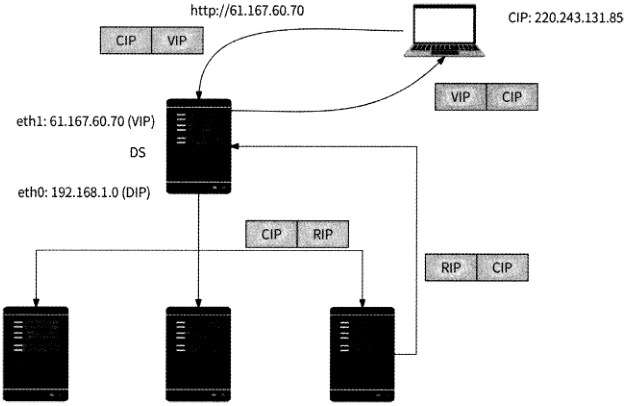

ethO: 192.168.1.10 (RIP) ethO: 192.168.1.11 (RIP)

ethO: 192.168.1.12 (RIP)


RS

图 1-10

```text
    2.    FULLNAT 模式
```

FULLNAT模式是NAT模式的优化版，它不要求DS与RS处于同一个局域网内且作为网关。DS在NAT模式的基础上又做了一次源IP地址转化，这样一来，当RS返回响应数据时，根据IP地址即可将其正常路由到DS,而不需要强行指定DS为网关。FULLNAT模式的主要缺点是请求到达RS后会丢失客户端IP地址。

在FULLNAT模式下进行请求转发的整个过程如下所述，如图1・11所示。

（1）客户端发送请求到LVS的VIP,请求到达DSo

（2） DS选择一个RS作为请求转发的目的地，然后分别修改客户端请求的目的IP地址为对应RS的RIP,源IP地址为DIP,然后将请求从DIP发送给所选择的RS。

（3） RS收到请求后，发现请求目的IP地址是自己的IP地址（RIP ）,于是处理请求，然后返回响应数据，其中源IP地址为RIP,目的IP地址为DIP。

（4） DS通过数据传输层收到RS响应数据，然后分别修改响应数据的源IP地址为VIP,目的IP地址为CIP。

（5） 客户端收到响应数据。

[原 PDF 第 39 页](../%E4%BA%BF%E7%BA%A7%E6%B5%81%E9%87%8F%E7%B3%BB%E7%BB%9F%E6%9E%B6%E6%9E%84%E8%AE%BE%E8%AE%A1%E4%B8%8E%E5%AE%9E%E6%88%98%20%28--%29%20%28manongshu.com%29.pdf#page=39)

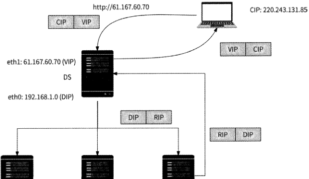

ethO: 192.168.1.10 (RIP) ethO: 192.168.1.11 (RIP) et:hO: 192.168.L12 (RIP)

```text
               RS    RS    RS
```

图 1-11

3. TUN （IP隧道）模式

DS通过IP隧道加密技术将请求报文封装到一个新的数据包中，并选择一个RS的IP地址作为新数据包的目的IP地址，然后将它发送到对应的RS； RS基于IP隧道解密技术解析出原数据包的内容，查看RS本地是否绑定了原数据包的目的IP地址，如果是，则处理请求并将响应结果通过网关返回给客户端。在TUN模式下进行请求转发的整个过程如下所述，如图1・12所示。

（1 ）客户端发送请求到LVS的VIP,请求到达DSO

（2） DS选择一个RS作为请求转发的目的地，并将数据包封装到一个新的数据包中，其中新数据包的源IP地址为DIP,目的IP地址为对应RS的RIP,然后通过IP隧道发送新数据包。

（3） RS对IP隧道的数据包进行解析，得到原数据包。

（4） RS看到原数据包的目的IP地址是VIP,而RS本地lo网卡也配置了此VIP,于是RS处理数据包。

（5） RS返回响应数据，其中源IP地址为VIP,目的IP地址为CIP。响应数据通过网关到达客户端。

[原 PDF 第 40 页](../%E4%BA%BF%E7%BA%A7%E6%B5%81%E9%87%8F%E7%B3%BB%E7%BB%9F%E6%9E%B6%E6%9E%84%E8%AE%BE%E8%AE%A1%E4%B8%8E%E5%AE%9E%E6%88%98%20%28--%29%20%28manongshu.com%29.pdf#page=40)

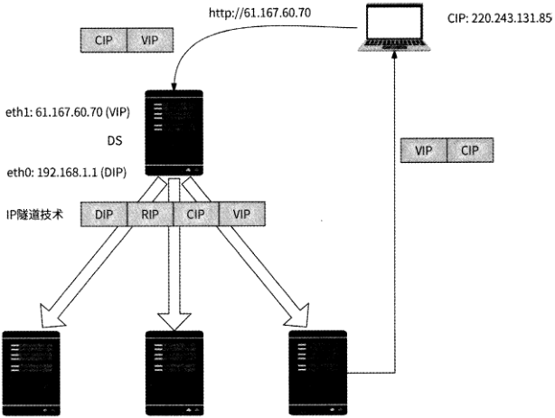

```text
        ethO: 192.168110 (RIP)    ethO: 192.168.1.11 (RIP)    ethO: 192.168.1.12 (RIP)
          lo:61J67.60.70    lo:61.167.60.70    lo:61.167.60.70
              RS    RS    RS
```

I CJP VIP

图 1-12

配置LVS TUN模式的特点如下。

- DIP和RIP不一定非要在同一个网络环境中，IP隧道技术可以根据IP地址找到RSO

- RS和DS所在的网络环境必须支持IP隧道技术。

- 除了 DS, RS也需要配置VIP,这样一来，RS只有解析出原数据包的内容后才能确认数据包的目的IP地址是自己。另外，需要将VIP绑定到RS的lo网卡，这样才能防止对ARP （地址解析协议）进行响应。

- DS仅负责将请求转发到RS,但是RS的响应数据不通过DS转发，而是直接发往客户端，所以TUN模式的性能高于NAT模式。

4. DR模式

与TUN模式类似（DS仅转发请求并不转发响应数据）,DR模式通过改写请求报文的MAC地址将请求转发到RS,然后RS将响应数据通过网关返回给客户端。假设客户端MAC地址、DS的地址和3个RS的MAC地址分别为Ml〜M5,在DR模式下进行请求转发的过程如下所述，如图1・13所示。

[原 PDF 第 41 页](../%E4%BA%BF%E7%BA%A7%E6%B5%81%E9%87%8F%E7%B3%BB%E7%BB%9F%E6%9E%B6%E6%9E%84%E8%AE%BE%E8%AE%A1%E4%B8%8E%E5%AE%9E%E6%88%98%20%28--%29%20%28manongshu.com%29.pdf#page=41)

(1) 客户端发送请求到LVS的VIP,请求到达DSO

(2) DS选择一个RS作为请求转发的目的地，并将数据包的目的MAC地址改为RS对应的MAC地址，然后通过局域网DIP发出数据包。

(3) RS读取数据包，看到目的IP地址是VIP,已被绑定到RS本地的lo网卡，然后RS处理数据包。

(4) RS返回响应数据，并将数据包的源MAC地址改为M3,将目的MAC地址改为客户端MAC地址Ml,然后RS通过网关将响应数据直接发送给客户端。

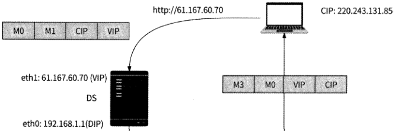

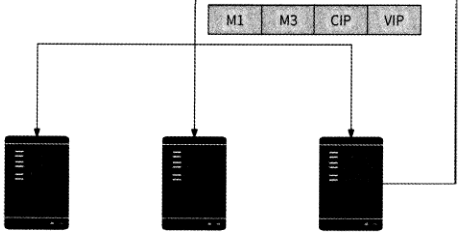

```text
   ethO: 192.168.1.10 (RIP)    ethO: 192.168.1.11 (RIP)    ethO: 192.168.1.12 (RIP)
     lo: 61.167.60.70    Io： 61.167.60.70    lo: 61167.60.70
          RS    RS    RS
```

图 1-13

配置LVS DR模式的特点如下。

- 由于DS经过数据链路层(OSI参考模型的第二层)，所以需要把RS的RIP和DS的DIP配置到同一个物理网络中。

- 除了 DS, RS也需要在lo网卡上配置VIP,理由与TUN模式的一致。

- 所有的响应数据都不经过DS转发，与TUN模式一样，但是TUN模式涉及加密/解密IP隧道，性能不如DS模式。

通过对LVS的4种转发模式的介绍，我们大致可以了解它们的优劣势，如表1-2所示。

[原 PDF 第 42 页](../%E4%BA%BF%E7%BA%A7%E6%B5%81%E9%87%8F%E7%B3%BB%E7%BB%9F%E6%9E%B6%E6%9E%84%E8%AE%BE%E8%AE%A1%E4%B8%8E%E5%AE%9E%E6%88%98%20%28--%29%20%28manongshu.com%29.pdf#page=42)

__________________________________________ 表1・2______________

```text
                          优 势    劣 势
```

转发模式

DS需要作为网关

```text
 NAT    RS无须配置VIP
```

性能一般

```text
                    RS无须配置VIP    丢失客户端IP地址
```

FULLNAT

```text
                    对网络环境要求较低    性能一般________________________________________________________
```

服务器需要支持IP隧道协议

```text
 TUN    性能好
```

RS需要配置VIP

DS和RS需要在同一个物理网络中

```text
 DR    性能好
```

RS需要配置VIP

如果我们希望LVS有更强的网络环境适应性，则可以选择FULLNAT模式，这也是笔者推荐的模式；而如果希望LVS有更高的性能，则可以选择DR模式。

### 1.4.3 LVS+Nginx接入层的架构

机房接入层使用LVS与Nginx的配合可以发挥这两种负载均衡器的优势：LVS的性能更高，便于Nginx构建集群，LVS作为Nginx集群的四层负载均衡器，可以有效提高Nginx的可扩展性；而Nginx的功能更为强大，用它作为业务HTTP服务器的七层负载均衡器，能将不同的HTTP URL调度到不同的业务服务并提高业务服务的高可用性和可扩展性。LVS+Nginx的机房接入层架构如图1・14所示。

将机房配置的LVS的公网IP地址（即VIP ）作为域名，客户端请求经过DNS解析后进入LVS,然后LVS使用如FULLNAT模式将客户端请求转发到任意一台Nginx服务器,Nginx服务器再根据HTTP URL将客户端请求转发到某个upstream服务池的任意一个服务器实例上。

不过，此架构有一个明显的缺点，即LVS是单点：如果LVS宕机，则整个机房将无法对外提供服务。因此，我们需要解决LVS的高可用问题。

通常，我们可以采用主从热备方案来解决单点的高可用问题。艮"为原本单点的节点（主节点）配置一个从节点，在主节点正常对外提供服务期间从节点并不工作，而在主节点发生故障后会自动切换到从节点继续对外提供服务。业界常见的实现主从热备的技术方案是Keepalived+VIP,例如在主节点A和从节点B均安装了 Keepalived并启动后，主节点A就会通过ARP响应包告知局域网VIP对应的MAC地址为MAC-A （主节点MAC地址），之后所有收到这个ARP响应包的网络设备在访问VIP时，就会根据MAC-A访问到主节点A。当从节点B监听到主节点A宕机后，它就会代替主节点A向局域网回复ARP响应包：“VIP对应的MAC地址为MAC・B”。于是，之后所有收到ARP响应包的网络设备再次访问VIP时，就会根据MAC-B转而访问到从节点B,从节点B自动代替了主节点A,如图1-15所示。

[原 PDF 第 43 页](../%E4%BA%BF%E7%BA%A7%E6%B5%81%E9%87%8F%E7%B3%BB%E7%BB%9F%E6%9E%B6%E6%9E%84%E8%AE%BE%E8%AE%A1%E4%B8%8E%E5%AE%9E%E6%88%98%20%28--%29%20%28manongshu.com%29.pdf#page=43)


```text
                解析 apLfriendy.com    ©
```

客户端

IP 地址:122.14.229.192

```text
       7/    §
```

tqb

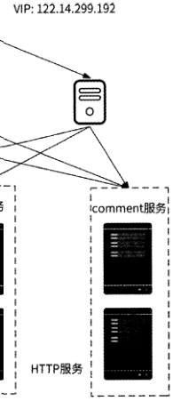

```text
. 1    X
```

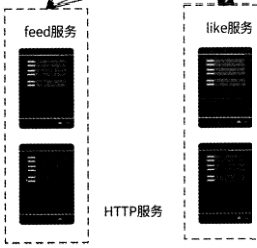

图 1-14

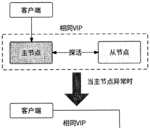

```text
                          主节点    <•~~~•探活=    从节点
```

图 1-15

为单点LVS引入Keepalived+VIP方案后实现的高可用架构如图1-16所不。

[原 PDF 第 44 页](../%E4%BA%BF%E7%BA%A7%E6%B5%81%E9%87%8F%E7%B3%BB%E7%BB%9F%E6%9E%B6%E6%9E%84%E8%AE%BE%E8%AE%A1%E4%B8%8E%E5%AE%9E%E6%88%98%20%28--%29%20%28manongshu.com%29.pdf#page=44)

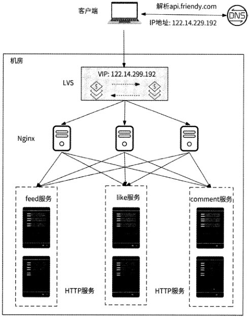

图 1-16

这样的机房接入层架构完美吗？其实并不完美。LVS虽然性能极高，但也是有上限的。假设我们的互联网产品已经拥有亿级用户，那么单台LVS就会遇到性能瓶颈。想要痛快地解决某个系统的高并发性能问题，就要为这个系统增加水平扩展能力。如图1-17所示，我们可以使用多台LVS对外提供服务。如果有N台LVS对外提供服务，那么就要配置N个VIP,这些VIP都绑定了同一个域名，客户端依赖DNS轮询来决定访问哪台LVS。

对于绝大多数互联网应用来说，做到这一步已经可以解决机房接入层的高可用、高性能、可扩展的问题了。最终机房接入层架构已经趋于完备，此时：

- 通过DNS轮询方式扩展LVS的性能；

- 通过 Keepalived 保证 LVS；

- 通过LVS扩展Nginx的性能；

- 将Nginx作为业务HTTP服务器的七层负载均衡器，提高了业务服务的高可用性与可扩展性。

[原 PDF 第 45 页](../%E4%BA%BF%E7%BA%A7%E6%B5%81%E9%87%8F%E7%B3%BB%E7%BB%9F%E6%9E%B6%E6%9E%84%E8%AE%BE%E8%AE%A1%E4%B8%8E%E5%AE%9E%E6%88%98%20%28--%29%20%28manongshu.com%29.pdf#page=45)

客户端|~1+解析叩由*y“m『磅

```text
              ____________ 1______________ IP 地址：122.14.229.193    一.rm、
                      I    IP 地址:122.14.229.192
```

机房

```text
        VIP: 122.14.299.192    VIP: 12214299.193
```

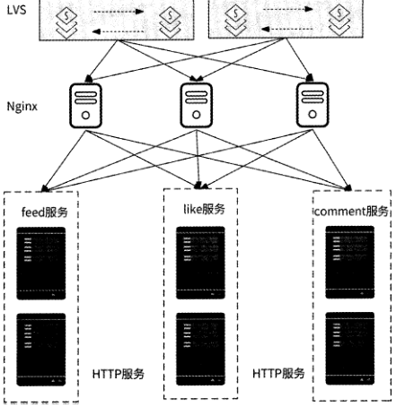

图1・17

## 1.5 服务发现

讲到这里，我们已经对一个客户端请求进入业务HTTP服务的过程有了较为详细的了解。业务HTTP服务在处理请求的过程中免不了与其他下游服务通信一可能会调用其他业务服务，可能需要访问数据库，可能会向消息中间件投递消息等，所以业务HTTP服务必须知道下游服务部署的可用地址。这就是本节要介绍的服务发现问题。

这里不是特指HTTP服务，在当前流行的微服务架构下，任何服务都涉及与其他服务通信的问题。要求每个服务的研发人员主动维护下游服务地址是不现实的，我们需要为每个服务提供可以自动发现下游服务地址列表的能力，这就是服务发现。服务发现组件是微服务架构下最重要的基础组件之一。

[原 PDF 第 46 页](../%E4%BA%BF%E7%BA%A7%E6%B5%81%E9%87%8F%E7%B3%BB%E7%BB%9F%E6%9E%B6%E6%9E%84%E8%AE%BE%E8%AE%A1%E4%B8%8E%E5%AE%9E%E6%88%98%20%28--%29%20%28manongshu.com%29.pdf#page=46)

### 1.5.1 注册与发现

服务发现的技术原理并不复杂，一般通过提供一个服务注册中心来实现。这个服务注册中心主要负责两件事情：管理每个服务的地址列表(注册)和将某服务的地址告知调用者(发现)。让我们通过一个例子来阐明服务注册中心的工作流程。调用者A需要调用服务B来完成某请求，服务发现过程如图1・18所示。

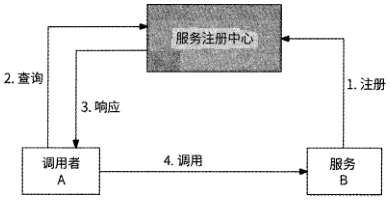

图 1-18

(1)服务B的各个服务实例启动后，将自己的地址信息注册到服务注册中心，由服务注册中心将其存储起来。

(2 )调用者A向服务注册中心查询服务B的地址。

(3) 服务注册中心将其存储的服务B已注册的实例地址列表返回给调用者Ao

(4) 调用者A得到地址列表，可向服务B的任意一个实例地址发起远程调用。

调用者A除了可以主动查询服务地址，还可以采取订阅推送的方式与服务注册中心通信：调用者A在进程启动时就与服务注册中心通信，订阅关于服务B的地址数据；如果服务注册中心有服务B的地址数据，或者服务B的地址发生了变更，那么它会主动将最新地址列表推送给调用者A,如图1.19所示。

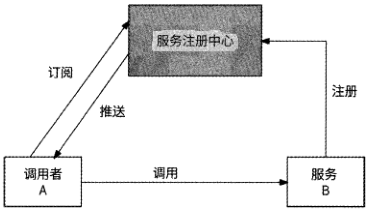

图 1-19

目前业界有很多可选择的服务注册中心组件，比如Spring Cloud的Eureka. CNCF旗下的CoreDNS等。

[原 PDF 第 47 页](../%E4%BA%BF%E7%BA%A7%E6%B5%81%E9%87%8F%E7%B3%BB%E7%BB%9F%E6%9E%B6%E6%9E%84%E8%AE%BE%E8%AE%A1%E4%B8%8E%E5%AE%9E%E6%88%98%20%28--%29%20%28manongshu.com%29.pdf#page=47)

### 1.5.2 可用地址管理

服务注册中心可以使用MySQL等数据库来保存已注册的服务地址列表，存储选型相对自由。这不是这一节的重点，本节要讨论的重点是每个地址是否可用。调用者的调用目的地既然由服务注册中心决定，那么服务注册中心提供的地址应该是访问可达的，否则调用者将无法成功完成服务调用。那么，服务注册中心如何保证已注册的服务地址列表总是

可用的呢？

由于服务的创建、销毁、升级、扩容/缩容都会造成服务地址列表的变更，所以服务的每个实例在启动时都需要向服务注册中心注册自己的地址，并在退出时注销地址。只有这样，才能使得服务注册中心一直在维护最新的服务地址列表。

不过，这还不够，我们还没有考虑异常情况。比如某服务实例突然挂掉，它还没来得及向服务注册中心注销地址，这就使得服务注册中心向调用者下发了不可用的服务地址，调用者调用请求被拒绝。所以，服务注册中心应该有对已注册的服务地址的探活能力。地址探活一般有两种思路：

第一种思路是主动探活。服务注册中心周期性地向每个已注册的服务地址发起探测请求，如果某地址探测成功，则认为这个地址是可用的；否则，认为这个地址已经失效，服务注册中心主动摘除这个地址。

这种思路只适用于服务较少、实例较少的小型互联网产品后台，对于用户量级较大的产品（动辄有上千个服务，个别访问量大的核心服务可能会部署上万个实例，所有服务的实例总数有几百万个）来说，服务注册中心主动探活实例地址的效率非常低。

第二种思路是心跳探活。服务注册中心为每个已注册的服务地址记录一个最近心跳时间，服务实例启动后，每隔一段时间（如30s）就向服务注册中心发送一个心跳包，服务注册中心收到心跳包后更新对应服务地址的最近心跳时间。服务注册中心会启动定时器来检查每个服务地址的最近心跳时间相比于当前时间已经过了多久，如果其超过了某个阈值（如150s）,那么就可以认为这个服务实例已经不可用了，服务注册中心将其地址摘除，如图1-20所示。

服务注册中心基于服务实例心跳探活来摘除不可用的地址，可以在很大程度上保证地址列表可用。不过，在某些场景下摘除地址也存在潜在风险，这里举两个例子。

一个例子是服务注册中心的地址摘除逻辑有Bug,导致某服务的地址被意外全部摘除。从整个产品后台来看，这个服务等于凭空消失了，最终与其关联的全部业务场景均产生故障。

另一个例子是假设点赞服务有5个实例，每个实例可承受的最大QPS为1000,当前后台点赞服务的总QPS为3000,即每个实例承受的QPS为600。在某一时刻，Sl、S2、

[原 PDF 第 48 页](../%E4%BA%BF%E7%BA%A7%E6%B5%81%E9%87%8F%E7%B3%BB%E7%BB%9F%E6%9E%B6%E6%9E%84%E8%AE%BE%E8%AE%A1%E4%B8%8E%E5%AE%9E%E6%88%98%20%28--%29%20%28manongshu.com%29.pdf#page=48)

S3这三个实例与服务注册中心发送心跳包的网络链路发生了长时间中断，服务注册中心认为这三个实例发生故障，于是将其对应的地址摘除。点赞服务的调用者收到的最新地址列表是[S4, S5],于是所有调用请求都转向这两个实例，导致每个实例实际承受了 1500的QPS,最终这两个实例被压垮，整个点赞服务不可用了，如图1・21所示。

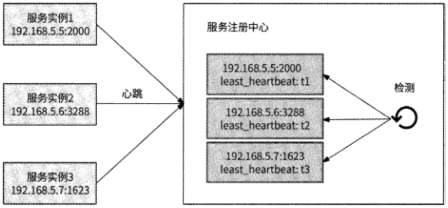

图 1-20

点赞服务

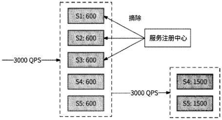

图 1-21

这两个例子都是因为服务注册中心过度摘除地址而带来了风险，所以这里建议为服务注册中心摘除地址增加简单的保护策略：在某服务的地址列表中，如果已摘除的地址数超过某个阈值（如30%）,那么服务注册中心就停止摘除地址，并向服务负责人报警以寻求人工处理，防止出现不可控的故障。

### 1.5.3 地址变更推送

当服务的地址列表发生变更时，为了让调用者尽快感知到这件事情，服务注册中心需要主动推送最新地址列表给调用者。推送数据可能遇到的一个问题是“推送风暴”一如果某服务有100个调用者，每个调用者又有1000个实例，那么每当这个服务的地址列表发生变更时，就要给100000个节点推送数据；如果有多个服务的地址列表发生变更，则

[原 PDF 第 49 页](../%E4%BA%BF%E7%BA%A7%E6%B5%81%E9%87%8F%E7%B3%BB%E7%BB%9F%E6%9E%B6%E6%9E%84%E8%AE%BE%E8%AE%A1%E4%B8%8E%E5%AE%9E%E6%88%98%20%28--%29%20%28manongshu.com%29.pdf#page=49)

推送的节点会更多，这会严重占用网络带宽。那么，如何解决这个问题呢？

首先，建议推送的数据是“新增了哪些地址” “哪些地址已废弃”的增量数据形式，而不是全量地址列表，这能在一定程度上节约推送数据的网络带宽。

其次，服务注册中心本身也是一个服务，如果公司的服务注册中心有条件部署大量的实例，那么推送风暴问题也就被轻易解决了，毕竟分摊到每个服务注册中心实例的推送的

节点不会很多。

最后，可以采用推拉结合的方式：服务注册中心最多给N个调用者节点推送地址变更信息，其他节点周期性地（如Imin）从服务注册中心拉取最新地址列表。

由于服务发现组件的存在，调用者只需要关心要调用谁，而不需要关心被调用者的地址一 调用者可以随时升级、扩容，不用担心调用者找不到。作为微服务架构下最核心的组件之一，服务发现真正为微服务带来了弹性。

## 1.6 RPC服务

你可能在1.1节的引言中注意到业务服务层包括HTTP服务和RPC服务，两者的定位不一样。一般来说，一个业务场景的核心逻辑都是在RPC服务中实现的，强调的是服务于后台系统内部，所谓的“微服务”主要指的就是RPC服务；而HTTP服务强调的是与用户请求的交互，它做的主要工作一般比较简单，比如校验用户请求、打包响应数据，而

用户请求真正的处理逻辑会被HTTP服务通过RPC请求交给RPC服务来执行，HTTP服务更像是业务服务层的“网关”。RPC服务对后台内部暴露RPC协议，而HTTP服务对后台外部暴露HTTPo

为什么后台内部要专门使用RPC协议来通信，而不直接使用HTTP?这就要从RPC的概念说起了。

RPC （ Remote Procedure Call,远程过程调用）的目标就是屏蔽网络编程的细节，能够像调用本地方法一样调用远程方法，让开发者更专注于业务逻辑本身。如图1・22所示，在一个单体应用内，假设有一个Calculator接口以及这个接口的实现类Calculatorlmpl,那么要调用Calculator的add方法执行相加运算就可以直接调用，这是因为Calculatorlmpl实现类和Calculator接口在同一个进程地址空间内。这种调用形式就是本地过程调用。

现在将单体应用改为分布式应用，接口调用和实现分别在两个服务中，其中Service 1只有Calculator接口而没有Calculatorlmpl实现类，那么Service 1怎样才能调用到Service 2提供的Calculatorlmpl实现类的add方法呢？显然应该通过网络通信形式，如图1-23所本。

[原 PDF 第 50 页](../%E4%BA%BF%E7%BA%A7%E6%B5%81%E9%87%8F%E7%B3%BB%E7%BB%9F%E6%9E%B6%E6%9E%84%E8%AE%BE%E8%AE%A1%E4%B8%8E%E5%AE%9E%E6%88%98%20%28--%29%20%28manongshu.com%29.pdf#page=50)

进程

Calculator.add(l,2)

Calculatorlmpl

add

图 1-22

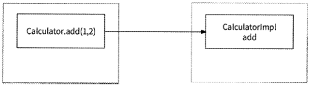

图 1-23

Service 2可以作为一台TCP服务器，Service 1向其发送请求并接收响应，当它收到指定的数据包时将调用add方法并将运算结果回传；Service 2也可以作为一台HTTP服务器，对外提供Restful API, Service 1发起HTTP请求调用此Restful API获取运算结果。

Service 1发起远程过程调用来执行Service 2的add方法，这样做已经很接近RPC 了，不过每次Service 1调用add方法时，都不得不编写一大段TCP或者HTTP收发请求的代码。这里是否可以简化，让服务调用者就像调用一个本地方法一样进行远程过程调用，即感知不到网络通信的存在？这就是RPC要做的事情。RPC框架通过代理模式将网络通信屏蔽，服务调用者仅需像本地过程调用一样调用一个RPC方法就能执行远程方法。

接下来介绍RPC通信流程。RPC实质上就是调用方将调用方法和参数发送到被调用方，被调用方处理后将结果返回给调用方的过程。由于RPC底层实际上是网络通信，所以这里主要包括两个方面的工作。

- 方法的输入参数、输出参数都是对象，这些对象和二进制数据可以相互转化。这个过程被称为序列化。

- 被调用方收到数据包，需要知道指定的方法名是什么，以及输入参数在数据包中的起始位置等，于是需要根据我们约定的协议格式对数据包解码，二进制数据与数据包可以相互转化。这个过程被称为编解码。

调用方先将输入参数序列化，再将其编码为所约定的协议格式的数据包，然后通过网络发送给被调用方；被调用方先将数据包解码，得到指定的方法名和序列化的输入参数，

[原 PDF 第 51 页](../%E4%BA%BF%E7%BA%A7%E6%B5%81%E9%87%8F%E7%B3%BB%E7%BB%9F%E6%9E%B6%E6%9E%84%E8%AE%BE%E8%AE%A1%E4%B8%8E%E5%AE%9E%E6%88%98%20%28--%29%20%28manongshu.com%29.pdf#page=51)

然后将输入参数反序列化，执行方法，最后通过与调用方调用相同的流程将结果返回给调

用方。完整的RPC通信流程如图1-24所示。

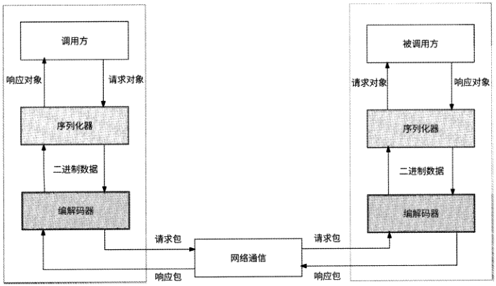

图 1-24

由于RPC通信流程相对固定，gRPC、Thrift等RPC框架都可以利用所约定的协议定义文件生成脚手架代码，使用者只需要将具体的方法处理代码完成后就能实现RPC通信了。

从上述介绍我们可以看出，RPC只是一种用于屏蔽远程过程调用的设计，它与HTTP不是对立的，因为两者不是一个层面的概念。RPC底层的网络通信可以使用TCP实现（如Thrift）,也可以使用HTTP实现（如gRPC ）,其本身并无限制。我们将业务服务层拆分为HTTP服务和RPC服务，更想强调的是前者服务于后台外部，而后者服务于后台内部，即后台服务之间的通信使用RPC形式。所谓的RPC协议只是表示RPC网络调用形式，而RPC服务的意思是该服务是基于gRPC、Thrift或其他RPC框架生成的，后台内部可以通过RPC形式与其通信。

这里给出一个RPC服务的例子：一个支持加法、减法、乘法、除法4个接口的计算器RPC服务，可以使用如下Thrift协议文件生成。

namespace go calculator

```text
    struct BinaryReq {
```

1:required i64 Operatoriz

2:required i64 Operators,

```text
     }
```

[原 PDF 第 52 页](../%E4%BA%BF%E7%BA%A7%E6%B5%81%E9%87%8F%E7%B3%BB%E7%BB%9F%E6%9E%B6%E6%9E%84%E8%AE%BE%E8%AE%A1%E4%B8%8E%E5%AE%9E%E6%88%98%20%28--%29%20%28manongshu.com%29.pdf#page=52)

struct Response (

1: required i64 Result,

```text
    }
```

service CalculatorService (

```text
                                       //加法接口
        Response    Add(1: BinaryReq req)
                                       //减法接口
        Response    Sub(1: BinaryReq req)
                 Multiply(1: BinaryReq    req) //乘法接口
```

Response

```text
                 Division(1: BinaryReq    req) //除法接口
```

Response

```text
    }
```

通过服务注册中心，HTTP服务能够得知RPC服务的可用地址列表。当HTTP服务接收到来自Nginx转发的用户请求后，就可以选择某个可用地址并通过RPC协议与RPC服务通信，完成对RPC服务的调用，最后将用户请求交给RPC服务处理。

## 1.7 存储层技术：MySQL

几乎所有用户请求的最终表现形式都是数据的读/写，这就意味着RPC服务需要从存储层读取数据或者向存储层写入数据。本节我们将针对最常见的几种数据库详细介绍存储

层技术，首先介绍关系型数据库及其典型代表MySQLo

### 1.7.1 关系型数据库

在百度百科中，很好地解释了关系型数据库——“关系型数据库是指采用关系模型来组织数据的数据库，其以行和列的形式存储数据，以便于用户理解。关系型数据库这一系列的行和列被称为表，一组表组成了数据库。用户通过查询来检索数据库中的数据，而查询是一个用于限定数据库中某些区域的执行代码。关系模型可以被简单理解为二维表模型，而关系型数据库就是由二维表及其之间的关系组成的一个数据组织。”

在关系型数据库中，实体、实体之间的关系均由单一的结构类型来表示，这种逻辑结构是一个二维表。这里我们举一个非常经典的例子，在一个简单的学生选课系统中，实体和实体之间的关系大致如图1-25所示。

图1-25中的实体和实体之间的关系在关系型数据库中可以用图1.26所示的二维表来表木。

关系型数据库以行和列的形式存储数据，行表示一个实体记录或者实体之间的关系记录，列表示记录的属性。这一系列的行和列被称为数据表，一组数据表组成了关系型数据库。关系型数据库使用结构化查询语言(Structured Query Language, SQL)来定义数据以及操作数据。

[原 PDF 第 53 页](../%E4%BA%BF%E7%BA%A7%E6%B5%81%E9%87%8F%E7%B3%BB%E7%BB%9F%E6%9E%B6%E6%9E%84%E8%AE%BE%E8%AE%A1%E4%B8%8E%E5%AE%9E%E6%88%98%20%28--%29%20%28manongshu.com%29.pdf#page=53)

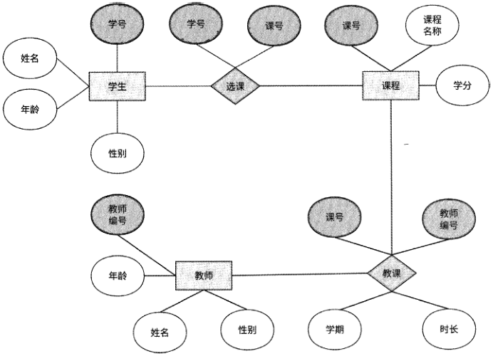

图 1-25

```text
实体    实体间关系
```

选课信息表

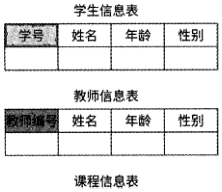

```text
                                                 「速号」    成绩
```

教课信息表

```text
                                                    解学期    时长|
```

1

课号：课程名州学分

图1-26

数据表中有一个重要的概念：主键。它由数据表的某些列组成，若它们的值可以唯一标识一个行记录，则称该属性组为主键。主键可以是一个属性，也可以由多个属性共同组成。在图1・26中，学号是学生信息表的主键，而在选课信息表中，学号和课号共同唯一标识了一个学生与课程的关系，所以学号和课号一起组成了选课信息表的主键。

由此可见，关系型数据库的数据模型更贴合逻辑，容易理解。关系型数据库的理论知识、技术产品已经发展到非常成熟的地步，所以它是目前应用最广泛的数据库系统。

[原 PDF 第 54 页](../%E4%BA%BF%E7%BA%A7%E6%B5%81%E9%87%8F%E7%B3%BB%E7%BB%9F%E6%9E%B6%E6%9E%84%E8%AE%BE%E8%AE%A1%E4%B8%8E%E5%AE%9E%E6%88%98%20%28--%29%20%28manongshu.com%29.pdf#page=54)

### 1.7.2 MySQL的优势

MySQL是最典型的开源关系型数据库，同时也是许多常见网站、应用程序和商业产品的首选数据库。在大部分情况下，MySQL都是数据存储的首选，这是因为MySQL具有如下优势。

- 易于使用，功能强大，支持事务、触发器、存储过程等，拥有较多利于管理的工具。

- 可以作为拥有上千万条数据记录的大型数据库。

- 采用GPL开源协议，工程师可以自由地修改源码来定制自己的MySQL系统。

- MySQL的InnoDB事务性存储引擎符合事务ACID模型，能保证完整、可靠地进行数据存储。

若无特殊说明，本书中提及的数据库均指MySQLo关于MySQL的存储原理，我们会在具体场景的服务设计中穿插介绍，本节重点关注如何在大型互联网公司中应用MySQLo

### 1.7.3 高可用架构1：主从模式

最基本的MySQL高可用架构是主从模式：一台MySQL服务器作为Master（主节点）,若干MySQL服务器作为Slave （从节点）o在正常情况下，只有Master处理写数据请求，同时Master与Slave通过主从复制技术保持数据一致。当Master发生故障宕机时，某个Slave会被提升为Master继续对外提供服务，这样可以实现MySQL的高可用。MySQL主从模式架构如图1・27所示。

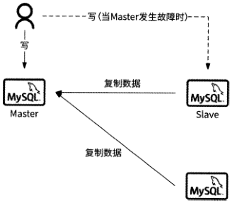

图 1-27

Slave在Master宕机时能够代替它的前提条件是，Slave与Master的数据一致。所以,主从模式具备高可用性的基础是主从复制技术。MySQL主从复制的实现原理如下所述，如图1-28所示。

[原 PDF 第 55 页](../%E4%BA%BF%E7%BA%A7%E6%B5%81%E9%87%8F%E7%B3%BB%E7%BB%9F%E6%9E%B6%E6%9E%84%E8%AE%BE%E8%AE%A1%E4%B8%8E%E5%AE%9E%E6%88%98%20%28--%29%20%28manongshu.com%29.pdf#page=55)

(1 )当Master数据发生变更(包括新增、删除、修改等操作)时，Master将数据的变更日志写入二进制日志文件(下文称binlog )o

(2 )数据库Slave启动I/O线程并与Master建立网络连接，从Master的binlog中读取最新的数据变更日志。

(3) Slave的I/O线程收到数据变更日志后，将其保存在中继日志文件(下文称relaylog)的尾部。

(4) Slave启动专门的SQL线程从relay log中获取日志，并在本地重新执行SQL语句将数据回放到数据库中，使Slave数据库与Master数据库保持数据一致。

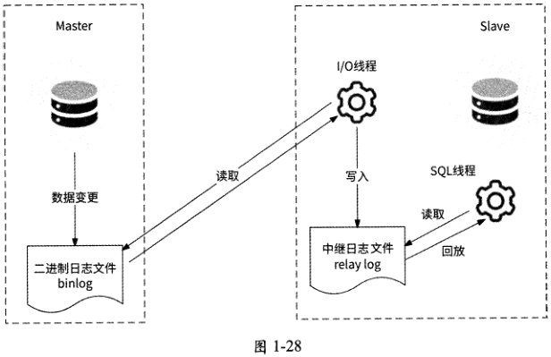

可以看到,Master提交事务不需要经过Slave的确认，也不管Slave是否已接收binlog,Slave写relay log失败、重新执行SQL语句失败等异常情况并不会被Master感知,所以MySQL主从复制是异步的，Master提交完事务就直接返回了，如图1-29所示。

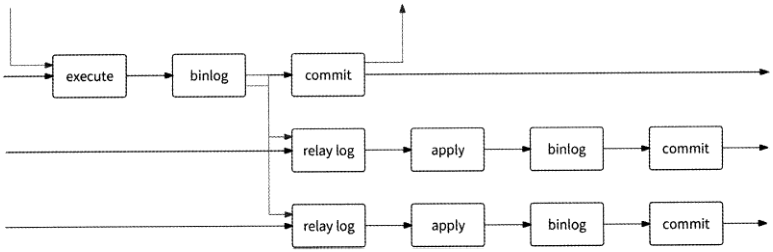

图 1-29

[原 PDF 第 56 页](../%E4%BA%BF%E7%BA%A7%E6%B5%81%E9%87%8F%E7%B3%BB%E7%BB%9F%E6%9E%B6%E6%9E%84%E8%AE%BE%E8%AE%A1%E4%B8%8E%E5%AE%9E%E6%88%98%20%28--%29%20%28manongshu.com%29.pdf#page=56)

异步方式的主从复制有一个潜在隐患：如果Master在提交事务成功后，但尚未发送binlog给Slave时就出现异常宕机了，那么对MySQL执行主从切换就会造成事务数据的丢失，因为被提升为新Master的Slave并未复制这个事务。为了解决数据丢失的问题，MySQL 5.5版本提供了半同步复制模式：Master在提交事务前，会等待Slave接收binlog,当至少有一个Slave确认接收了 binlog后，Master才提交事务。具体来说，Slave在收到binlog并将其写入relay log后，会向Master发送ACK响应；Master在收到ACK响应后，认为响应发送方Slave已经在relay log中保存了事务，这时才进行事务的提交。Master执行半同步复制的过程如图1-30所示。

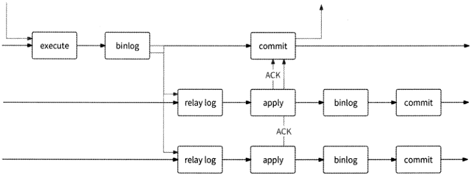

图 1-30

需要注意的是，在半同步复制模式下，Slave向Master发送ACK响应的时机并不是重新执行SQL语句后，而是事务数据被写入relay log后。这样一方面可以缩短Master等待响应的时间；另一方面，事务数据已经被持久化，不会发生丢失数据的情况。

半同步复制可以提高主从数据的一致性，但是Master提交事务要等待Slave的确认，所以写性能会受到一定的影响。半同步复制适合对数据一致性要求较高的业务场景。

Master会因为向过多的Slave复制数据而压力倍增，这个问题被称为“复制风暴”。所以实际的主从模式架构可能是一些Slave向Slave复制数据，以减轻Master的复制压力，如图1-31所示。

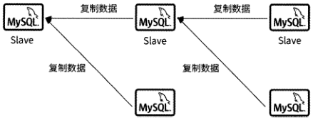

```text
 Slave    Slave
```

图 1-31

[原 PDF 第 57 页](../%E4%BA%BF%E7%BA%A7%E6%B5%81%E9%87%8F%E7%B3%BB%E7%BB%9F%E6%9E%B6%E6%9E%84%E8%AE%BE%E8%AE%A1%E4%B8%8E%E5%AE%9E%E6%88%98%20%28--%29%20%28manongshu.com%29.pdf#page=57)

### 1.7.4 高可用架构2：MHA

有了 MySQL主从模式的基础，接下来我们就应该考虑如何检测节点故障和执行自动主从切换。MHA ( Master High Availability )在这方面做得很好。MHA在MySQL高可用领域是一套相当成熟的解决方案，它通常可以在10 ~ 30s内完成MySQL主从集群的自动故障检测和自动主从切换，并且在主从切换过程中，它可以最大程度地保证主从数据的一

致性，以帮助MySQL主从模式达到真正意义的高可用。

如图1-32所示，MHA由两部分组成：MHA Manager (管理节点)和MHANode (数据节点)o

- MHAManager： MHA的“决策层”，负责自动检测Master的故障，检查主从复制状态，执行自动主从切换等。MHA Manager可以管理多个MySQL主从集群，通常被部署在单独的服务器上。

- MHANode：被部署在每台MySQL服务器上，主要负责修复主从数据的差异。

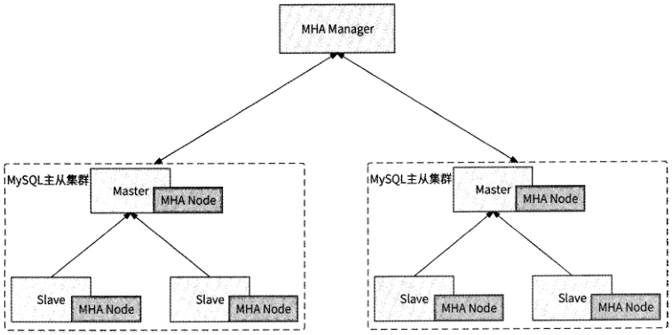

图 1-32

MHA会实时监测每个MySQL主从集群的Master状态，如果某个Master宕机，MHA则会自动选择数据最接近Master数据的Slave作为新的Master,然后将其他Slave重新指向新的Master,整个故障转移过程自动化，且对业务方完全透明。下面详细介绍MHA故障转移工作流程。

(1 ) MHA Manager周期性地探测Master心跳，如果连续4次探测不到心跳，则认为Master 宕机。

(2 ) MHA Manager 判断各个 Slave 的 binlog,哪个 Slave 的 binlog 数据更接近 Master

[原 PDF 第 58 页](../%E4%BA%BF%E7%BA%A7%E6%B5%81%E9%87%8F%E7%B3%BB%E7%BB%9F%E6%9E%B6%E6%9E%84%E8%AE%BE%E8%AE%A1%E4%B8%8E%E5%AE%9E%E6%88%98%20%28--%29%20%28manongshu.com%29.pdf#page=58)

数据，就将哪个Slave作为备选Mastero

(3) MHANode试图通过SSH访问Master所在的服务器：

- 如果网络可达，那么MHA Node可以获取到Master的binlog数据。MHA Node对比Slave与Master的binlog数据，如果发现Slave数据与Master的binlog数据有差异，则会将差异数据主动复制到Slave,以保持主从数据一致。

- 如果网络不可达，那么MHA Node对比各个Slave的relay log差异，并做差异数据补齐。

(4 ) MHA Manager构建新主从关系，将备选Master提升为Master,其他Slave向新的Master复制数据。

MHA选择数据最新的Slave作为新的MasterA Slave主动从Master binlog中补齐未复制的数据、Slave之间互补数据等策略，都是为了最大程度地保证主从切换后不丢失数据。如果将MHA和半同步复制模式一起使用，则可以更进一步大幅降低数据丢失的风险。因为在半同步复制模式下有一个Slave的数据和Master数据一致，而MHA正好会选择这个Slave作为新的Mastero

### 1.7.5 高可用架构3：MMM

MMM ( Multi-Master Replication Manager for MySQL )是一个 MySQL 双主故障切换和双主管理的脚本组件，从字面上理解，它有两个Master,并实现了这两个Master的高可用。MMM的基本组成如图1・33所示。

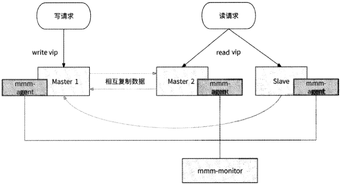

图 1-33

对图1・33所示内容解释如下。

[原 PDF 第 59 页](../%E4%BA%BF%E7%BA%A7%E6%B5%81%E9%87%8F%E7%B3%BB%E7%BB%9F%E6%9E%B6%E6%9E%84%E8%AE%BE%E8%AE%A1%E4%B8%8E%E5%AE%9E%E6%88%98%20%28--%29%20%28manongshu.com%29.pdf#page=59)

- Master 1:真正的Master,负责处理写请求。

- Master 2 (备用)：当Master 1宕机时，Master 2接替它作为新的Master处理写请求Master 2与Master 1相互复制数据，一般采用半同步复制模式。

- Slave (若干):向Master 1复制数据，并且为了不影响Master 1的性能，采用异步复制模式。

- mmm-monitor: monitor角色，与各mmm-agent通信以检测MySQL服务器的健康状况，并决策是否主从切换。

- mmm-agent：被部署在每台MySQL服务器上，作为节点代理与monitor通信，一方面监控本机MySQL状态，另一方面执行monitor下发的指令。

- write vip： MySQL对外提供写数据服务的虚拟IP地址，只与Master 1和Master 2其中一个节点绑定。

- read vid： MySQL对外提供读数据服务的虚拟IP地址，主要与Slave绑定。

MMM故障转移的过程大致如下所述，如图1.34所示。

(1 ) agent检测到Master 1宕机，或者monitor与Master 1 agent在一段时间内通信失败，monitor认为Master不可用。

(2) monitor请求 Master 1 agent,要求 Master 1 移除 write vipo 如果 Master 1 所在的机器无法访问，则跳过这一步。

(3 ) monitor 请求 Master 2 agent,要求 Master 2 绑定 write vip,绑定成功后，Master 2成为Master对外提供服务。

(4) monitor 请求 Slave agent,要求 Slave 向 Master 2 复制数据。

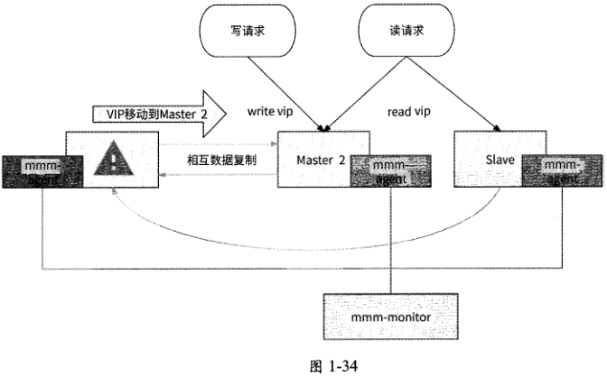

[原 PDF 第 60 页](../%E4%BA%BF%E7%BA%A7%E6%B5%81%E9%87%8F%E7%B3%BB%E7%BB%9F%E6%9E%B6%E6%9E%84%E8%AE%BE%E8%AE%A1%E4%B8%8E%E5%AE%9E%E6%88%98%20%28--%29%20%28manongshu.com%29.pdf#page=60)

MMM通过移动虚拟IP地址(write vip)的方式切换Mastero当Master 1宕机时，Master 2可以立即“上任”，MySQL业务使用方不会感知到主从切换的发生。不过，MMM这套解决方案比较古老，不支持MySQL GTID,且社区活跃度不够，目前MMM组件处于无人维护的状态。

### 1.7.6 高可用架构4：MGR

1.7.6

MGR ( MySQL Group Replication, MySQL 组复制)是 MySQL 5.7.17 版本推出的高可用解决方案，它具备如下特性。

- 一致性高：数据复制基于分布式共识算法Paxos,可以保证多个节点数据的一致性。

- 容错性高：只要不是超过一半的节点宕机，就可以继续对外提供服务。

- 灵活性强：MGR支持单主模式和多主模式。在单主模式下会自动选举Master,在多主模式下每个MySQL节点都可以同时处理写请求。

至少由3个MySQL节点组成一个复制组，一个事务必须经过复制组内超过一半的节点决议通过后才能提交。如图1-35所示，由3个节点组成一个复制组,Consensus层为Paxos一致性协议层，在事务提交过程中组内节点进行决议(certify),至少有2个节点决议通过，这个事务才能够提交。

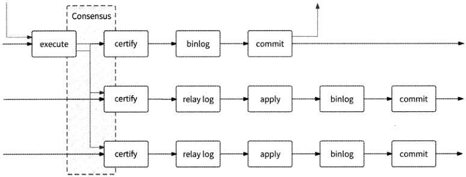

图1・35

如果在不同的MySQL节点上执行不同的写操作发生了事务冲突，那么先提交的事务先执行，后提交的事务被回滚。在多主模式下，由于每个MySQL节点都可以执行写请求，在写请求高并发的场景下发生事务冲突的概率较大，会造成大量的事务回滚，所以官方更推荐单主模式。

在单主模式下，MGR会自动为复制组选择一个Master负责写请求。如果复制组内超过一半的节点与Master通信失败，则认为Master宕机，MGR自动根据各节点的权重和ID

[原 PDF 第 61 页](../%E4%BA%BF%E7%BA%A7%E6%B5%81%E9%87%8F%E7%B3%BB%E7%BB%9F%E6%9E%B6%E6%9E%84%E8%AE%BE%E8%AE%A1%E4%B8%8E%E5%AE%9E%E6%88%98%20%28--%29%20%28manongshu.com%29.pdf#page=61)

标识重新选主，并很容易在各Slave之间达成共识。

由于MGR基于Paxos协议，所以主从节点数据有很强的一致性，可以做到数据不丢失。此外，在一个拥有2N+1个节点的复制组中，MGR可以容忍N个节点发生故障，所以这套方案的容错性也很高。

不过，数据强一致性的代价是每个写请求都涉及与复制组内大多数节点的通信，所以

MGR的写性能不及异步复制和半同步复制，MGR更适合要求数据强一致性，且写请求量不大的场景。

## 1.8 存储层技术：Redis

Redis是现在最受欢迎的NoSQL数据库之一，是一个包含多种数据结构、支持网络访问、基于内存型存储、可选持久性的开源键值存储数据库。Redis具有如下特性。

- 数据被存储在内存中，性能高。

- 支持丰富的数据类型，包括字符串(String)、列表(List)、哈希表(Hash ).集合(Set)、有序集合(Ordered Set)等数据结构和相关数据操作。

- 支持分布式，包括主从模式、哨兵模式、集群模式，理论上其可以无限扩展。

- 基于单线程事件驱动模式实现，数据操作具有原子性。

Redis的应用场景非常广泛，例如缓存系统、计数器、限流、排行榜、社交网络等，具体的应用原理我们会在后面的章节中逐一介绍。本节还是聚焦于大型互联网公司如何应用Redis,即如何构建高性能、高可用、可扩展的Redis存储系统。

### 1.8.1 高可用架构1：主从模式

Redis也提供了主从复制机制，所以使用Redis可以很方便地构建与MySQL类似的主从模式。一个Master与若干Slave组成主从关系，当Slave与Master首次建立连接时，Master向Slave进行全量数据复制，复制结束后，再根据Master的最新数据变更进行增量数据复制。具体来说，Redis主从复制的流程如下。

(1) Slave连接到Master,发送PSYNC命令准备复制数据。

(2 ) Master收到PSYNC命令，执行BGSAVE命令生成目前全量数据的RDB快照文件，并创建缓冲区记录此后Master执行的数据变更命令。

(3 ) Master向所有Slave发送RDB快照文件，并在文件发送期间持续在缓冲区记录数据变更命令。

[原 PDF 第 62 页](../%E4%BA%BF%E7%BA%A7%E6%B5%81%E9%87%8F%E7%B3%BB%E7%BB%9F%E6%9E%B6%E6%9E%84%E8%AE%BE%E8%AE%A1%E4%B8%8E%E5%AE%9E%E6%88%98%20%28--%29%20%28manongshu.com%29.pdf#page=62)

(4 ) Slave收到RDB快照文件后将其保存在磁盘中，再从磁盘中重新加载快照数据到内存，然后开始接收来自Master的数据变更命令。

(5 ) Master发送完RDB快照文件后，继续向Slave发送缓冲区中记录的数据变更命令。

(6)Slave收到数据变更命令后，在本地重新执行这些命令，以保证Slave与Master的数据一致。

不论是MySQL主从复制，还是Redis主从复制，大部分存储系统的主从复制原理都基本类似，即Master向Slave发送全量数据和增量数据；而且，如果Master向过多的Slave复制数据，则同样会出现“复制风暴”的问题。

### 1.8.2 高可用架构2：哨兵模式

在主从模式下，在Master宕机后，需要手动把一台Slave服务器切换为主服务器，这就需要费时费力的人工干预，而且会造成Redis服务在一段时间内不可用。这时候就需要哨兵模式登场了。Redis从2.6版本开始提供了哨兵模式。

哨兵模式的核心还是主从模式，只不过它在相对于主从模式下Master宕机导致不可写的情况下，提供了一种自动竞选机制：所有的Slave竞选新的Mastero竞选机制的实现依赖于在Redis存储系统中启动的名为Sentinel(哨兵)的服务器。在Redis高可用架构中，Redis服务器除了可以是Master、Slave角色，还可以是Sentinel角色，它负责在Master宕机后自动选举出一个Slave升级为新的Master继续对外提供服务。

在一个主从模式的Redis架构中会部署若干Sentinel节点，每个Sentinel节点都会与MasterA Slave维持心跳。当超过N个Sentinel节点认为Master宕机时，Sentinel节点会协商选举出一个Slave担任新的Mastero Sentinel节点会告知所选举出的Slave节点它已被提升为Master,其他的Slave则转而与这个新的Master建立连接，复制数据。引入Sentinel节点可以自动进行主从切换，其架构如图1-36所示。

从图1-36中可以看出，3个Sentinel节点组成Sentinel集群，负责监控每个Redis节点的健康状况。在这种架构下，访问Redis的客户端，首先需要访问Sentinel集群获取RedisMaster地址，当Master发生故障时，客户端会从Sentinel集群中得到新的Master地址。如此一来，研发工程师再也无须人工参与Redis主从切换的工作了，客户端也会在Master发生故障时主动获取新的Master地址。

[原 PDF 第 63 页](../%E4%BA%BF%E7%BA%A7%E6%B5%81%E9%87%8F%E7%B3%BB%E7%BB%9F%E6%9E%B6%E6%9E%84%E8%AE%BE%E8%AE%A1%E4%B8%8E%E5%AE%9E%E6%88%98%20%28--%29%20%28manongshu.com%29.pdf#page=63)

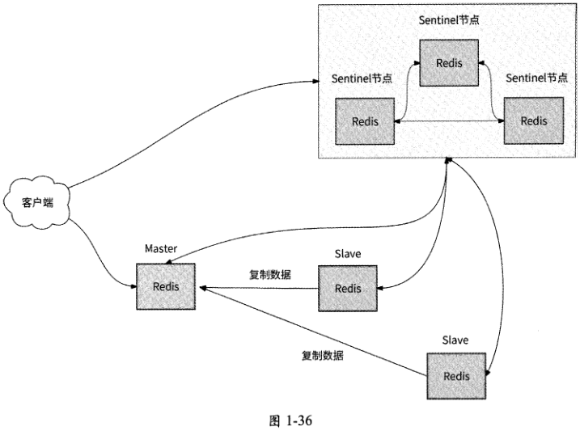

### 1.8.3 高可用架构3：集群模式

无论是主从模式还是哨兵模式，Redis都只有一个Master对外提供服务，当有大量的数据需要存储时，单个Master的内存空间难以保存全量数据；而且，当有海量请求访问Redis时，单个Master会承受巨大的访问压力。实际上，互联网公司在应用Redis时，都会采用数据分片的方式：多个Master对外提供服务，全量数据分散在各个Master中。

Redis 3.0版本提供了集群(Redis Cluster)模式，使得Redis真正拥有了分布式存储能力。一个Redis集群由多个Redis节点组成，一个Master和若干Slave组成一个节点组，代表一个数据分片。如图1-37所示，Redis集群要求至少有3个Master,同时每个Master应该至少有一个Slave用于保证一个数据分片的高可用，集群中各个Redis节点之间可以相互通信。

从图1-37中可以看出，在Redis集群中有3个数据分片，每个数据分片都通过主从模式保证高可用。Redis集群基于哈希槽进行数据分片：整个Redis数据库被划分为16384个哈希槽，每个Master可以管理0〜16383个槽位(Slot),这些Master把16384个槽位都瓜分了。例如，图1-37中的3个Master可能分别管理0〜5461、5462〜10922和10923 ~16383个槽位。

[原 PDF 第 64 页](../%E4%BA%BF%E7%BA%A7%E6%B5%81%E9%87%8F%E7%B3%BB%E7%BB%9F%E6%9E%B6%E6%9E%84%E8%AE%BE%E8%AE%A1%E4%B8%8E%E5%AE%9E%E6%88%98%20%28--%29%20%28manongshu.com%29.pdf#page=64)

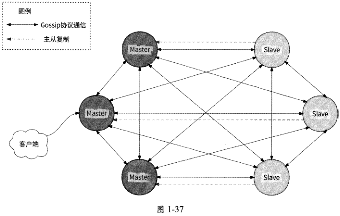

当向Redis集群中写入某个数据时，会基于数据Key运行CRC16算法，然后将结果与16384取模得到一个槽位。此数据会被归属到这个槽位上，于是会被存储到管理这个槽位的Master ±o槽位计算公式如下：

```text
                            slot = CRC16(Key) mod 16384
```

Redis集群中的每个节点都保存有各个节点的IP地址及其所负责的槽位信息，于是Redis客户端连接任意一个节点最终都能保证数据读/写请求正确的数据分片(或者说Master)处理。Redis客户端访问Redis集群的流程如下。

(1 ) Redis客户端连接到Redis集群中的任意一个Redis节点，获取槽位与Master的映射关系，并将该映射关系的信息缓存在客户端本地。

(2)当Redis客户端要读/写数据时，首先基于数据Key运行CRC16算法，然后将结果与16384取模得到对应的槽位。

(3 ) Redis客户端根据计算出的槽位，在本地缓存中进一步定位到具体的Master地址，然后将数据访问请求发送到这个节点上。

接下来介绍Redis集群如何保证每个节点都能拥有各个节点的IP地址及其所负责的槽位信息。这就涉及Gossip协议通信了。

在Redis集群架构中，为了保证集群中的Redis节点能够灵活自动变更，我们应该格外关注集群的如下事件。

- 某个Redis节点加入集群。

[原 PDF 第 65 页](../%E4%BA%BF%E7%BA%A7%E6%B5%81%E9%87%8F%E7%B3%BB%E7%BB%9F%E6%9E%B6%E6%9E%84%E8%AE%BE%E8%AE%A1%E4%B8%8E%E5%AE%9E%E6%88%98%20%28--%29%20%28manongshu.com%29.pdf#page=65)

- 数据分片扩缩容，将槽位迁移到新的数据分片上。

- 某数据分片的Master宕机，Slave需要被选举为新的Master。

我们希望整个Redis集群中的每个节点都能够尽快发现这些事件，并在所有节点中达成信息一致，那么各个节点之间就需要相互连通并且携带相关信息相互通知。按照最直白

的逻辑，当某个节点涉及如上集群事件时，采用广播的形式向Redis集群中的其他所有节点发送通知，这样就能做到集群节点变更的实时同步。然而,Redis开发者考虑到，当Redis集群中的节点较多时，这种通知形式会占用大量的网络带宽，所以采用了 Gossip协议通信。

Gossip的中文意思是“流言蜚语”，Gossip协议的通信机制就像流言蜚语一样被随意传播，成为人们茶余饭后的谈资。它的特点是，在一个节点数量有限的通信网络中，每个节点都会随机与部分节点通信，经过多轮迭代通信后，各个节点的信息在一定时间内会达

成一致。Gossip协议的工作流程大致如下。

(1 )假设Gossip协议每隔Is传播一次信息。

(2) 当信息被传播到某个节点时，此节点会随机选取次个相邻节点传播信息。

(3) 节点每次传播信息时，都会选择没有收到此信息的相邻节点作为传播目标。

(4) 经过多次信息传播，最终全部节点都收到了此信息。

Gossip协议包含多种消息类型，与Redis集群相关的有meet、ping、pong、fail消息。

- meet：某个节点发送meet消息给新加入的节点，让新节点加入集群中并与其他节点周期性地进行ping、pong消息的交换。

- ping：每个节点都会向其他节点发送ping消息，用于相互告知自身的状态和所维护的槽位信息，同时检查其他节点是否已经宕机下线。

- pong：当某个节点接收到ping、meet消息时，使用pong消息作为响应消息返回给发送方。pong消息包含节点自身的信息数据。一个节点也可以向集群广播自身的pong消息，来通知整个集群变更此节点的状态信息。

- fail：某个节点判断出另一个节点宕机之后，就发送fail消息给其他节点，告知其他节点所指定的节点宕机了。

1.集群新增节点

假设有一个Redis节点B想加入某个Redis集群，则可以通过Redis客户端向此集群中的任意一个Redis节点(比如A节点)发送CLUSTER MEET命令，其过程如下。

(1 )客户端向A节点发送"CLUSTER MEET <B节点IP地址〉<B节点端口号〉”命令，告知a节点“这个地址的Redis服务器想加入你所在的集群，你们互相认识一下”。

[原 PDF 第 66 页](../%E4%BA%BF%E7%BA%A7%E6%B5%81%E9%87%8F%E7%B3%BB%E7%BB%9F%E6%9E%B6%E6%9E%84%E8%AE%BE%E8%AE%A1%E4%B8%8E%E5%AE%9E%E6%88%98%20%28--%29%20%28manongshu.com%29.pdf#page=66)

（2 ） A节点处理CLUSTER MEET消息，保存B节点的地址并标记节点状态为“握手中”。

（3） 由于Gossip协议的周期性驱动，A节点发现B节点的状态处于“握手中”，于是向B节点发送meet消息，尝试与B节点建立网络连接。

（4） B节点收到meet消息后，同样保存A节点的地址并标记节点状态为“握手中”。

（5） B节点将自身信息通过pong消息返回给a节点，并接受与A节点的网络连接。

（6） A节点处理pong消息，更新B节点信息，并消除B节点的“握手中”状态。

（7） 与A节点一样，B节点会发现A节点的状态为“握手中”，于是向A节点发送ping消息。

（8） A节点处理ping消息，将自身信息通过pong消息返回给B节点。

（9） B节点处理pong消息，同样是更新A节点信息并消除其“握手中”状态。

（10） 通过Gossip协议，A节点逐渐将B节点信息告知集群内所有的节点，b节点加入集群成功。

2.节点故障转移

Redis集群中的每个节点（比如A节点）都会定期向其他节点发送ping消息，如果接收ping消息的B节点在指定的时间内没有为A节点返回pong消息，那么A节点就会认为B节点失联下线。但是由于网络原因，一个节点认为另一个节点下线并不能说明这个节点真的下线了，于是Redis集群引入了主观下线和客观下线的概念。

- 主观下线：A节点向B节点发送ping消息，但是没有得到回复，于是A节点主观地认为B节点下线了。

- 客观下线：如果集群中超过一半的节点均认为B节点主观下线了，按照少数服从多数的原则，B节点就会被认为客观下线了。

如果B节点被认为客观下线了，那么集群中的其他所有节点都会收到fail消息，用于通知B节点下线的事实。当B节点的从节点B，收到fail消息后，得知自己的主节点已经下线，B，节点会停止数据复制并接管B节点管理的槽位，将自己提升为主节点，然后向集群广播pong消息，让集群中的所有节点都得知8节点已经接管B节点。

Gossip协议的优点在于集群元信息的更新比较分散，不是集中在一个地方，所以可以使集群去中心化管理。不过，元信息更新会经过多次传播才能通知到集群内所有的节点，所以它是一个最终一致性协议。

Redis集群模式的Redis存储系统架构具有如下优势。

[原 PDF 第 67 页](../%E4%BA%BF%E7%BA%A7%E6%B5%81%E9%87%8F%E7%B3%BB%E7%BB%9F%E6%9E%B6%E6%9E%84%E8%AE%BE%E8%AE%A1%E4%B8%8E%E5%AE%9E%E6%88%98%20%28--%29%20%28manongshu.com%29.pdf#page=67)

- 去中心化架构，集群中的每个节点都是对等的。

- 抽象了槽位的概念，集群数据分片管理更为便捷。

- 可扩展性较强，可以轻易地对集群节点进行动态扩容。

- 集群高可用，拥有自动故障发现与恢复能力，几乎不需要人工介入。

- Redis官方出品，对Redis的命令支持较为全面。

虽然Redis集群模式为Redis提供了分布式存储能力，但是根据笔者的经验，它并不一定是互联网公司构建Redis存储系统的最终架构方案。这是因为Gossip协议归根结底依赖扩散式的网络通信，集群节点的数量直接影响Gossip协议的传播范围。当Redis集群中的节点只有几百个时，它可以运行良好，但是如果集群节点有成千上万个，那么Gossip协议就会造成集群内部存在大量网络通信，严重占用网络带宽，形成Gossip风暴。

对于亿级用户应用场景，Redis存储系统动辄需要几千个节点才能应对用户请求，这时候使用Redis集群模式的架构就会直接将Gossip风暴问题暴露出来。解决Gossip风暴问题最好的办法就是舍弃去中心化架构，而拥抱中心化架构：集群节点元信息不使用

Gossip协议传播，而是使用一个中间代理来维护。接下来介绍一些中心化的Redis分布式

架构方案。

### 1.8.4 高可用架构4：中心化集群架构

Redis集群中间代理(Proxy)用得最多的是推特公司开源的Twemproxy,其基本原理是：通过中间代理的形式，Redis客户端将请求发送到Twemproxy,然后Twemproxy根据数据路由规则将请求发送到正确的Redis节点，最后Twemproxy将请求执行结果汇总并返回给客户端，如图1.38所示(注意：这里的Redis集群省略了主从复制功能。在实际应用中，图中的每个Redis节点都会作为Master并与若干Slave共同组成一个Redis数据分片)。

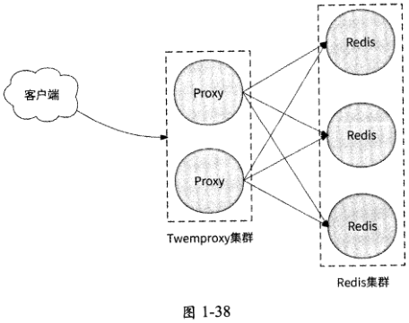

[原 PDF 第 68 页](../%E4%BA%BF%E7%BA%A7%E6%B5%81%E9%87%8F%E7%B3%BB%E7%BB%9F%E6%9E%B6%E6%9E%84%E8%AE%BE%E8%AE%A1%E4%B8%8E%E5%AE%9E%E6%88%98%20%28--%29%20%28manongshu.com%29.pdf#page=68)

Twemproxy的思路与接入层技术类似：通过引入Twemproxy作为客户端访问Redis节点的中间代理，为由若干Redis节点组成的集群提供了数据分片的负载均衡能力，提高了 Redis节点的高可用性和可扩展性。将Twemproxy作为中间代理的优势如下。

- 客户端像连接Redis实例一样直接连接Twemproxy,不需要修改任何代码逻辑。

- Twemproxy与Redis实例保持长连接，减少了客户端与Redis实例的连接数。

- 由Twemproxy决定客户端请求最终访问哪个Redis节点，不需要客户端、Redis节点的参与。

不过，Twemproxy也存在一些功能层面的不足，例如：

- 没有友好的管理后台，不利于运维监控；

- 无法支持平滑的Redis集群扩缩容，当业务要求Redis集群增加节点时，会产生较高的运维成本。这也是Twemproxy的主要痛点。

许多大型互联网公司都借鉴了 Twemproxy的思路并取长补短，纷纷推出了自研的Redis中心化集群架构方案，业界较为知名的是豌豆荚公司开源的Codis项目。下面我们重点介绍Codis的架构原理。

与Redis集群模式类似，Codis将数据划分为N个槽位(默认为1024个),每个槽位负责存储若干数据，数据与槽位之间的映射关系通过对数据Key运行CRC32算法后再与N取模得到：

```text
                              slot = CRC32(Key) mod N
```

在Codis中包含如下四大类核心组件。

- Codis Server：经过二次开发的Redis服务器，支持数据迁移操作。可以认为它就是Redis服务器，负责处理客户端的读/写请求。

- Codis Proxy：接收客户端请求并转发给Codis Server,其作用与Twemproxy —样，都是中间代理。

- ZooKeeper集群：用于保存Redis集群元信息，包括每个Redis数据分片负责管理的槽位信息、各个Redis节点的地址信息。它还保存了 Codis Proxy的地址列表，提供Redis客户端访问Redis集群的服务发现能力。

- Codis Dashboard和Codis Fe：它们共同组成了集群运维管理工具，前者负责Redis集群扩缩容、Codis Proxy集群扩缩容、槽位迁移等，后者负责提供Dashboard的友好Web操作页面。

Codis将Redis集群中的每个数据分片都定义为Redis Server Groupo 一个Redis ServerGroup包括一个Redis Master和若干Slave,用于保证每个数据分片的高可用。Codis整体架构如图1-39所示。

[原 PDF 第 69 页](../%E4%BA%BF%E7%BA%A7%E6%B5%81%E9%87%8F%E7%B3%BB%E7%BB%9F%E6%9E%B6%E6%9E%84%E8%AE%BE%E8%AE%A1%E4%B8%8E%E5%AE%9E%E6%88%98%20%28--%29%20%28manongshu.com%29.pdf#page=69)

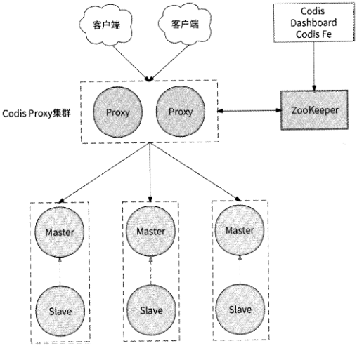

Redis Server Redis Server Redis Server

```text
                       Group    Group    Group
```

图1・39

为了让Codis运行起来，我们先使用Codis Dashboard配置Redis Server Group的地址信息、所管理的槽位信息以及Codis Proxy的地址，最终这些配置信息都会被存储到ZooKeeper集群中。完成配置后，Codis就可以正式对外提供服务了。Redis客户端访问

Codis的流程基本如下。

(1 ) Redis客户端从ZooKeeper集群中获取到Codis Proxy集群的地址列表，并选择一个Codis Proxy建立连接。

(2 ) Redis客户端向Codis Proxy发送数据读/写请求。

(3)Codis Proxy根据数据Key计算出对应的槽位，然后通过ZooKeeper集群得到负责此槽位的 Redis Server Group o

(4 ) Codis Proxy将数据读/写请求转发到Redis Server Group中的某个Redis节点，其中Master可以处理数据读/写请求，Slave可以处理数据读请求。

(5 ) Redis节点处理完数据后，将结果返回给Codis Proxy。

(6)Codis Proxy将结果返回给Redis客户端，整个数据访问流程结束。

接下来介绍Codis如何平滑地完成集群扩缩容。在Codis中，数据迁移的单位是槽位。

[原 PDF 第 70 页](../%E4%BA%BF%E7%BA%A7%E6%B5%81%E9%87%8F%E7%B3%BB%E7%BB%9F%E6%9E%B6%E6%9E%84%E8%AE%BE%E8%AE%A1%E4%B8%8E%E5%AE%9E%E6%88%98%20%28--%29%20%28manongshu.com%29.pdf#page=70)

假设有一个新的Redis节点B加入了集群,那么集群中的某些槽位必然要交给B节点负责。如果需要将集群中A节点负责的槽位S迁移到B节点，则流程如下。

（DA节点将槽位S关联数据复制到B节点，在数据复制过程中，A节点依然对外提供服务。

（2） 如果客户端读/写某数据D的请求到达A节点，且此数据不属于槽位S,则A节点正常处理请求。

（3） 如果数据D恰好属于槽位S,但由于槽位S正在进行迁移，我们并不知道数据D是否已经迁移到B节点，所以请求无法抉择是应该被A节点处理还是应该被B节点处理。

（4） A节点只好强行将数据D迁移到B节点，即使数据D可能早已迁移到B节点。

（5） 当数据D迁移完成后，A节点再将请求转发到B节点处理，因为此时已经确定数据D已经迁移到了 B节点。

至于某个节点发生故障宕机需要主从切换的场景，新版本的Codis建议每个RedisServer Group都引入哨兵模式即Sentienl节点来处理，其具体流程这里不再重复。

在如上所述的中心化集群架构模式下，只要中间代理服务器的实现足够高效，便可以轻松地将Redis客户端请求代理到成千上万台Redis服务器。所以，当Redis集群有较多的节点时，笔者非常推荐使用与Codis类似的Redis集群架构模式。

## 1.9 存储层技术：LSM Tree

LSM Tree （ Log-Structured Merge Tree ）是一种对高并发写数据非常友好的键值存储模型，同时兼顾了查询效率°LSMTree是我们下面将要介绍的NoSQL数据库所依赖的核心数据结构，例如 BigTable. HBase. Cassandra. TiDB 等。

### 1.9.1 LSM Tree的原理

LSM Tree的有效性基于一个结论：磁盘或内存的顺序读/写数据性能远高于随机读/写数据性能。这个结论不仅对传统的机械硬盘成立，对SSD硬盘同样成立。

顺序读/写的意思是按照文件中数据的顺序有序地进行读/写操作，例如，向某磁盘文件的尾部追加数据就是一种典型的顺序写操作；而随机读/写则相反，它不遵循文件中数据的先后顺序进行数据的读取与写入。LSM Tree模型的思想就是在磁盘上用顺序读/写代替随机读/写，充分发挥磁盘的读/写性能优势。LSM Tree模型主要包括如下几个组成部分。

[原 PDF 第 71 页](../%E4%BA%BF%E7%BA%A7%E6%B5%81%E9%87%8F%E7%B3%BB%E7%BB%9F%E6%9E%B6%E6%9E%84%E8%AE%BE%E8%AE%A1%E4%B8%8E%E5%AE%9E%E6%88%98%20%28--%29%20%28manongshu.com%29.pdf#page=71)

1. MemTable

MemTable是一种内存中的结构，用于保存SSTable最近更新的数据，并且按照数据Key的字典序将数据有序地组织起来。LSM Tree模型并不限定MemTable的具体实现方式，只要保证数据有序、读/写效率高即可，红黑树、跳跃表等数据结构都是实现MemTable的适当选择。

LSM Tree模型接收到写数据请求后会直接在MemTable中处理，针对新增、修改、删除类型的写请求分别会执行不同的逻辑。

- 新增数据：直接将数据插入MemTable中。

- 修改数据：如果在MemTable中存在此数据Key,则直接修改；否则，将数据插入MemTable 中。

- 删除数据：LSM Tree模型不删除数据，而是将数据状态标记为tombstone (墓碑)，表示此数据已被删除。可见，删除数据的流程与修改数据的流程类似。如果在MemTable中存在此数据Key,则将数据状态修改为tombstone；否则，将携带tombstone状态的数据插入MemTable中。

由于最近更新的数据都被保存在内存中，而内存是易失性存储，所以通常使用预写日志(Writs Ahead Log, WAL )的方式保证数据的可靠性——在数据修改命令被提交到MemTable之前，先追加记录到磁盘上的WAL文件中。

2. Immutable MemTable

当MemTable中存储的数据达到一定大小(默认为32MB )时，MemTable会变成只读的Immutable MemTable,后台线程将它持久化为基于磁盘的SSTable文件。为了不影响写数据请求的处理，LSM Tree会新建一个空白的MemTable接管工作。

3. SSTable

LSM Tree将数据持久化到磁盘后的结构称为SSTable( Sorted String Table )。顾名思义，SSTable保存了基于数据Key按照字典序排序后的数据集合，它是一种持久化的、有序且不可变的键值对存储结构。数据Key、Value被连续地存储在SSTable文件中，同时在文件的尾部存储数据Key在文件中位置的偏移量并将其作为稀疏索引，用于提高在SSTable中查找某数据Key的速度。图1-40展示了 SSTable的结构。

当MemTable达到一定的大小后，它最终会被刷写到磁盘中变成SSTable文件，所以在不同的SSTable中可能存在相同的数据Key。对于某个特定的数据，在最新的SSTable中存储的对应记录才是它的最新值，其他SSTable中的对应记录都是冗余数据。这会浪费存储空间。所以，LSM Tree会周期性地对SSTable进行合并操作，通过将多个SSTable合并为更大的SSTable来清除冗余记录。

[原 PDF 第 72 页](../%E4%BA%BF%E7%BA%A7%E6%B5%81%E9%87%8F%E7%B3%BB%E7%BB%9F%E6%9E%B6%E6%9E%84%E8%AE%BE%E8%AE%A1%E4%B8%8E%E5%AE%9E%E6%88%98%20%28--%29%20%28manongshu.com%29.pdf#page=72)

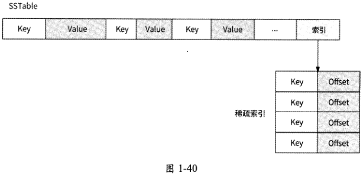

LSM Tree使用Level划分SSTable文件，Level N的SSTable文件会经过合并操作下沉到Level 7V+1, Immutable MemTable被持久化成的SSTable文件处于Level 0。合并操作的主要策略是 Leveled Compaction Strategy ( LCS ),此策略保证：

- 所有Level的SSTable文件大小均一致，默认为160MB；

- 每个Level会限制此层内所有SSTable文件的总大小，层级越高，限制的阈值越大,如Level 1的文件总大小为10GB, Level 2的文件总大小为100GB等；

- 不仅单个SSTable的内部数据有序,而且同一 Level内的SSTable之间也是有序的。

当Level N的文件总大小达到阈值时，会触发LCS的合并操作：在Level N中选择一个SSTable和Level N+1中与其数据Key有交集的SSTable进行合并，合并结果是生成若干新的SSTable,且它们各自的大小都不超过160MB,这些SSTable文件下沉到LevelN+1。如果Level #+1的文件总大小也达到阈值，则继续执行同样的合并操作，直到某一层的文件总大小在限制的阈值内，或者到达最后一层。

图1-41简单描述了合并操作过程。假设Level 1的SSTable文件总大小超过阈值，那么Level 1中的1个SSTable选择Level 2中与它有交集的2个SSTable进行合并，生成了3个新的SSTableo

这3个SSTable被归入Level 2O我们发现Level 2的文件总大小也超过阈值，于是Level 2中的某个SSTable与Level 3中有交集的3个SSTable继续合并操作，生成一个新的SSTable被归入Level 3,如图1・42所示。

由于Level 0的SSTable文件来自Immutable MemTable,所以这些SSTable之间可能

```text
有数据Key重叠。但是经过合并操作，Level    每一层的SSTable之间就不会有数据
```

Key重叠了，一个数据Key在某一层至多存在一次。

我们可以轻易地发现，层级越低，数据越新。如果某数据存在于Level 1. Level 3、Level 5,那么Level 1对应的数据值是最新的。

[原 PDF 第 73 页](../%E4%BA%BF%E7%BA%A7%E6%B5%81%E9%87%8F%E7%B3%BB%E7%BB%9F%E6%9E%B6%E6%9E%84%E8%AE%BE%E8%AE%A1%E4%B8%8E%E5%AE%9E%E6%88%98%20%28--%29%20%28manongshu.com%29.pdf#page=73)

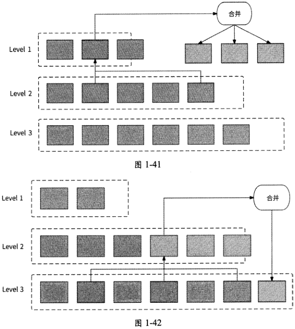

### 1.9.2 读/写数据的流程

LSM Tree处理客户端的写数据请求的流程如下所述，如图1-43所示。

(1) 将写数据信息记录到WAL文件中。

(2) 在MemTable中写入数据，此时就可以将响应数据返回给客户端。

(3) 当MemTable中存储的数据大小达到阈值时，将其变为I mmutable MemTable,新的MemTable继续对外提供服务。

(4 ) Immutable MemTable 被持久化为 SSTable 文件，处于 Level 0o

(5 )如果Level 0的SSTable文件大小达到阈值，则执行合并操作，Level 0的SSTable文件逐渐下沉到Level lo

(6)以此类推，如果Levels的SSTable文件大小达到阈值，则继续通过合并操作将SSTable 文件下沉到 Level N+1。

[原 PDF 第 74 页](../%E4%BA%BF%E7%BA%A7%E6%B5%81%E9%87%8F%E7%B3%BB%E7%BB%9F%E6%9E%B6%E6%9E%84%E8%AE%BE%E8%AE%A1%E4%B8%8E%E5%AE%9E%E6%88%98%20%28--%29%20%28manongshu.com%29.pdf#page=74)

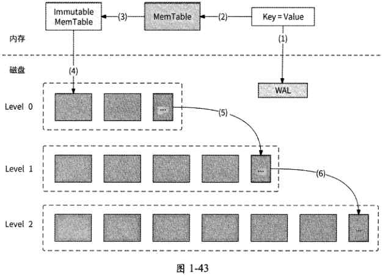

在LSM Tree中查找数据时，按照数据值的新旧程度，查找顺序为MemTableImmutableMemTable. Level 0 SSTable. Level 1 SSTable,直到 Level 7VSSTableo LSM Tree 处理客户端的读数据请求，当然也要保证读取到数据最新值，其流程如下。

(1 )在MemTable中查找数据。

(2 )如果未找到数据，则在Immutable MemTable中继续查找。

(3 )如果未找到数据，则在Level 0最新的SSTable文件中查找。

(4 )如果在Level 0的所有SSTable文件中都找不到数据，则继续在Level 1查找。

(5)以此类推，直到在某一层找到数据，或者在最后一层也未找到数据。

## 1.10 存储层技术：其他NoSQL数据库

这里我们简单介绍一下其他常见的NoSQL数据库及其适用的场景，其中部分数据库会在后续服务设计章节中正式使用时再做详细介绍。

1.文档数据库

文档数据库的典型代表是MongoDB和CouchDBo文档数据库普遍采用JSON格式来存储数据，而不是采用僵硬的行和列结构，其好处是可以解决关系型数据库表结构(Schema)扩展不方便的问题，以及可以存储和读/写任何格式的数据。文档数据库与键值存储系统很类似，只不过值存储的内容是文档信息。文档数据库具有很好的可扩展性。

[原 PDF 第 75 页](../%E4%BA%BF%E7%BA%A7%E6%B5%81%E9%87%8F%E7%B3%BB%E7%BB%9F%E6%9E%B6%E6%9E%84%E8%AE%BE%E8%AE%A1%E4%B8%8E%E5%AE%9E%E6%88%98%20%28--%29%20%28manongshu.com%29.pdf#page=75)

文档数据库适用的场景如下。

- 数据量大，且数据增长很快的业务场景。

- 数据字段定义不明确，且字段在不断变化、无法统一的场景。比如商品参数信息存储，电子设备商品参数有内存大小、电池容量等，月艮装商品参数有尺码、面料等。

文档数据库不适用的场景如下。

- 需要支持事务，文档数据库无法保证在一个事务中修改多个文档的原子性。

- 需要支持复杂查询，例如join语句。

2.列式数据库

列式数据库的典型代表是BigTable、HBase等。关系型数据库按照行来存储数据，所以它也被称为“行式数据库”；而列式数据库按照列来存储数据，如图1・44所示的是一个学生信息数据的例子。

-「顷 1「

```text
     学号    姓名    班级    专业
     20S100    张三    male    108    计算机
     20S101    李四    计算机    female    102
     20S102    材料    王五    female    205
     20S103    计算机    赵六    male    506
```

行式存储

```text
 20S100    张三    male    108    计算机    20S101    李四    female    102    计算机    20S102    王五    female    205    材料    ……
posiooposwil20S102|20S103j 张三 季四 王五 赵六 mate female female male    列式存储
                         张三    李四    王五    赵六    mate    female    female    male
```

图1・44

列式数据库将每一列的数据组织在一起，这样做有什么好处呢？假设现在要统计各专业的学生人数，如果使用行式数据库，那么首先需要将所有行的数据读取到内存，然后对“专业”列进行GroupBy操作得到结果。虽然我们只关注“专业” 一列，但是其他列也参与了数据读取，磁盘I/O次数较多；而如果使用列式数据库，那么只需要将“专业”列数据读取到内存，磁盘I/O次数大大减少，提高了查询效率。

列式数据库有很高的存储空间利用率，对于列数据类型是有限枚举（比如性别、专业）的情况，列式数据库可以通过字典表将数据压缩为图1・45所示的形式。

[原 PDF 第 76 页](../%E4%BA%BF%E7%BA%A7%E6%B5%81%E9%87%8F%E7%B3%BB%E7%BB%9F%E6%9E%B6%E6%9E%84%E8%AE%BE%E8%AE%A1%E4%B8%8E%E5%AE%9E%E6%88%98%20%28--%29%20%28manongshu.com%29.pdf#page=76)

```text
      学号    性别    班级    专业
     20S100    张三    mate    计算机    108
     20S101    李四    female    102    计算机
     20S102    王五    female    205    材料
     2OS1O3    赵六    male    计篡机    506
```

压缩

专业字典

编号r值

```text
      学号    姓名    性别    班级    专业
```

性别字典

```text
     20S100    张三    0    108    0    0    计算机
                                                 编号:    值
     20S101    李四    0    1    102    1    材料
                                                  0    男
     20S102    王五    1    205    1    2    土木工程
                                                  1    女
     20S103    赵六    0    506    0
```

图 1-45

从图1.45中可以看出，性别字典、专业字典分别使用了数字编号来代表原来的字符串，原始数据经过压缩后字符串变为数字，提高了存储空间利用率，且数据量越大，存储空间利用率越高。

列式数据库适用的场景如下。

- 有海量数据插入，但是数据修改极少的场景，比如用户行为收集。

- 数据分析场景，比如针对少数几列做离线数据统计工作。

列式数据库不适用的场景如下。

- 数据高频删除、修改的场景，即不适合直接服务于在线用户。

- 需要支持事务的场景。

3.全文搜索数据库

全文搜索数据库的典型代表是Elasticsearcho关系型数据库在应对全文搜索场景时，只能通过LIKE语句进行模糊查询，而LIKE语句会扫描全量数据，效率非常低下。全文搜索数据库的出现就是为了解决关系型数据库不支持高效全文搜索的问题，其基本原理是建立单词到文档的索引关系作为“倒排索引”。

如图1-46所示，倒排索引维护着每个关键词在哪些文档中出现过的文档列表。在进行全文搜索时，根据搜索关键词就可以直接获取到相关文档信息。文档列表既可以保存文档ID,也可以记录关键词在每个文档中出现的频率和位置。

[原 PDF 第 77 页](../%E4%BA%BF%E7%BA%A7%E6%B5%81%E9%87%8F%E7%B3%BB%E7%BB%9F%E6%9E%B6%E6%9E%84%E8%AE%BE%E8%AE%A1%E4%B8%8E%E5%AE%9E%E6%88%98%20%28--%29%20%28manongshu.com%29.pdf#page=77)

```text
   文档Q    ;文档列表（文档心；出现频率；出现位置）•    内容    关键词
     1    这是五一假期最热门的景点    五一    (5;1;0)
```

我写了 T分北京旅游攻略

```text
     2    热门    (4;1;3)
     3    我在北京上班，北京公司多    北京    (2;1;5),(3;2;2,8)
     4    下半年热门游戏盘点    游戏    (4；1；5)
     5    五一广场人真多
```

图 1-46

倒排索引非常适合根据关键词查询文档内容，所以在各种搜索场景中得到了广泛应用。其典型的应用场景包括：

- 关键词搜索，如搜索引擎；

- 海量数据的复杂查询；

- 数据统计和数据聚合。

倒排索引不适用的场景包括：

- 高频更新数据的场景。在全文搜索数据库中，修改数据实际上是删除旧数据和创建新数据两步操作；

- 需要支持事务的场景。

4.图数据库

近几年图数据库较为火热，其主要的开源项目有Neo4j. Titan等。图数据库指的并不是存储图片的数据库，而是以“图”这种数据结构存储数据的数据库。图由两个元素组成:“节点”和“关系”。其中，节点表示一个实体（人、商品等事物），关系则表示两个节点之间的关联关系。对于1.7.1节所举的例子：学生选课系统，如果用图数据库来存储，则会形成图1-47所示的存储结构。

从图1-47中可以看出，图数据库可以很简单且自然地构建出直观的数据模型；同时，我们可以很容易查询任意一个节点与其他节点的关系，解决了关系型数据库不擅长处理实体关系的问题。关系在图数据库中占首要地位，它非常适合强调关系、需要复杂关系查询和分析的业务场景，比如社交网络、知识图谱等。

[原 PDF 第 78 页](../%E4%BA%BF%E7%BA%A7%E6%B5%81%E9%87%8F%E7%B3%BB%E7%BB%9F%E6%9E%B6%E6%9E%84%E8%AE%BE%E8%AE%A1%E4%B8%8E%E5%AE%9E%E6%88%98%20%28--%29%20%28manongshu.com%29.pdf#page=78)

2


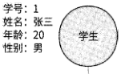


学

```text
姓    李    22
```

年

```text
性    女
```

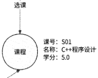

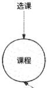

课号：$32名称:操作系统导论学分：4.5

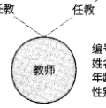

)01

```text
                                                号    10
                                                    }
                                                名    五
                                                  50    王
```

龄

```text
                                                别    男
```

图 1-47

上述几种NoSQL数据库，虽然分别解决了关系型数据库无法实现高效处理的一些问题，但是也几乎丧失了关系型数据库的强一致性、事务支持等特性。因此，结合关系型数据库及NoSQL数据库两者优点的数据库便产生了，即NewSQL数据库。目前其较为知名的项目包括 Google SpannerTiDB、CockroachDB 等。

NewSQL底层依然采用NoSQL存储数据。更确切地说，NewSQL使用分布式键值存储系统存储数据，而且在此基础上进行了很多革新，例如：

- 键值存储系统采用LSM Tree模型构建，可以大幅度提升写数据性能；

- 放弃了 NoSQL的主从复制模式，而是以更小粒度的数据分片作为高可用单位，主从分片之间通过Paxos或Raft等分布式共识算法进行数据复制；

- 采用分布式事务实现键值存储系统的事务能力。

NewSQL既保留了 NoSQL可扩展性强的优势，又在此基础上提供了类似于关系型数据库的事务能力。换言之，NewSQL的本质就是在传统关系型数据库上集成了 NoSQL强大的可扩展性。NewSQL的思想很好，它作为数据库领域的后起之秀，正在进入越来越多的应用场景。但是目前NewSQL依然是小众产品，它在高并发、事务性上的表现还需要更多的考验，短期内NewSQL难以完全取代关系型数据库和NoSQL数据库。

## 1.11 消息中间件技术

消息队列(Message Queue )是分布式系统中最重要的中间件之一，在服务架构设计中被广泛使用。

[原 PDF 第 79 页](../%E4%BA%BF%E7%BA%A7%E6%B5%81%E9%87%8F%E7%B3%BB%E7%BB%9F%E6%9E%B6%E6%9E%84%E8%AE%BE%E8%AE%A1%E4%B8%8E%E5%AE%9E%E6%88%98%20%28--%29%20%28manongshu.com%29.pdf#page=79)

### 1.11.1 通信模式与用途

消息中间件构建了这样的通信模式：一条消息由生产者创建，并被投递到存放消息的队列中，消费者从队列中读取这条消息，于是生产者与消费者完成了一次通信。这种通信

模式在现实生活中很常见，典型的例子是E.mail通信：

住在北京的张三想把一个重要但不紧急的消息告诉住在上海的李四，张三给李四打电话，但是李四正在忙其他的事情而未接电话，张三为了把消息传达给李四，只能不停地拨

打电话直到李四接听，这无疑浪费了张三大量的时间。于是，张三选择将消息使用E-mail的方式发送，他只需要把邮件投递到李四的收件箱中就可以去忙其他的事情了，而不用去

管李四是否繁忙，E-mail系统保证只要李四空闲下来查看收件箱，就必然会收到张三的消息。对于消息中间件而言，张三和李四分别是生产者和消费者，E-mail系统就是消息队列。

消息队列的通信模式为生产者和消费者带来了便捷性，如下所述。

- 生产者将消息投递到消息队列中就单方面完成了消息通信，比如张三只需要发送邮件，而不用等待李四阅读邮件。

- 消费者在自身有能力消费消息时才从消息队列中拉取新消息，比如李四今天非常忙碌，那么他可以明天再登录E-mail系统阅读邮件。

正是因为消息队列为生产者和消费者提供了便利，所以它被广泛应用于分布式系统。下面介绍消息队列的几个核心用途。

1.异步化

在未使用消息队列的系统中，一些非必要的业务逻辑以同步方式运行，导致请求处理耗时较大。比如图1・48所示的业务场景，一个用户请求需要串行地经过A、B、C、D四个服务处理，其中，A服务是此业务场景的核心服务，请求处理仅需10ms； B、C、D服务是非核心服务，请求处理时间分别是200ms、300ms、100mso所以一个用户请求需要耗时610ms才能得到响应。

```text
                          耗时10ms    耗时200ms    耗时300ms    耗时100ms
```

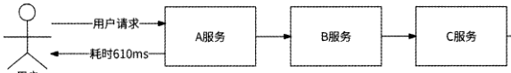

D服务

用户

图 1-48

使用消息队列后，A服务可以将请求相关消息写入消息队列，然后直接返回响应消息，而不用关心B、C、D服务是否已经处理请求，以及是否遇到故障；B、C、D服务异步地从消息队列中拉取消息进行相应的业务逻辑处理。这样一来，用户请求的响应时间被大幅降低到10ms,如图1・49所示。

[原 PDF 第 80 页](../%E4%BA%BF%E7%BA%A7%E6%B5%81%E9%87%8F%E7%B3%BB%E7%BB%9F%E6%9E%B6%E6%9E%84%E8%AE%BE%E8%AE%A1%E4%B8%8E%E5%AE%9E%E6%88%98%20%28--%29%20%28manongshu.com%29.pdf#page=80)

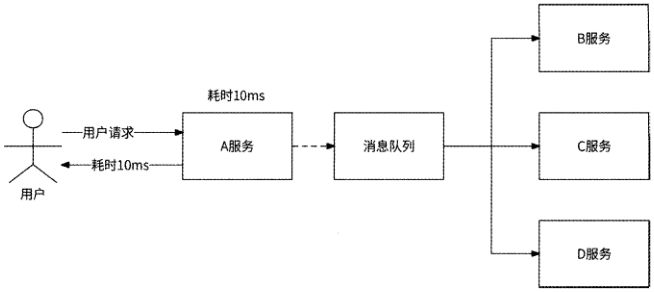

图 1-49

2.流量削峰

通过E-mail系统，李四可以根据自己是否有空来选择阅读或者不阅读收件箱中的邮件，以及阅读几封邮件。对于消息队列的消费者来说也是一样的，消费者服务完全可以根据自己的消息处理能力灵活地读取消息，这样的灵活度能有效提高服务的稳定性。消息队列使得消费者服务拥有处理请求的主动权，再也不用担心自己会被击垮了。举一个例子，A服务使用数据库作为处理请求的核心，当A服务面临流量高峰时，全部请求都会直接访问数据库，导致数据库宕机，进而A服务崩溃。如果请求并不要求立即执行，则可以先将请求写入消息队列，A服务根据自己的处理能力从消息队列中慢慢拉取消息进行相应的请求处理。

如图1・50所示，假设A服务Is仅可以处理100个请求，流量高峰时10000 QPS会直接击垮A服务，而通过消息队列的形式，A服务可以根据自己的请求处理速度来拉取消息，在整个链路上原来的请求量10000 QPS被平滑为100 QPS,这就是流量削峰。


```text
              请求10000 QPS—~*    消息队列
```

图 1-50

3.解耦

在未使用消息队列时，服务之间的耦合性太强，如果B服务想加入A服务的请求处理流程，则需要在A服务中实现对B服务的RPC逻辑。假设在系统中有3个服务，如下所述。

- 点赞服务：负责处理用户对文章的点赞请求，主要业务逻辑是为用户和文章建立已点赞的关系记录。

[原 PDF 第 81 页](../%E4%BA%BF%E7%BA%A7%E6%B5%81%E9%87%8F%E7%B3%BB%E7%BB%9F%E6%9E%B6%E6%9E%84%E8%AE%BE%E8%AE%A1%E4%B8%8E%E5%AE%9E%E6%88%98%20%28--%29%20%28manongshu.com%29.pdf#page=81)

- 热点服务：根据每篇文章的被点赞次数，给出当前最热门的文章列表。

- 策略服务：分析每个用户的点赞文章类型，以便可以将同类型的文章推荐给该用户。

热点服务和策略服务都想实时获取用户点赞行为，为此，我们只能在点赞服务对用户

点赞请求的处理逻辑中增加对这两个服务的RPCo如果将来有服务也想要收集用户点赞行为，或者策略服务下线，则需要改造点赞服务，于是所有依赖用户点赞行为的服务都与点

赞服务形成了耦合，如图1-51所示。


图 1-51

在系统中引入消息队列后，这种耦合关系得到完全解耦：点赞服务将在处理用户点赞请求时顺便将点赞事件发送到消息队列，任何希望收集用户点赞行为的服务只需要被配置成这个消息队列的消费者，而不会对点赞服务有任何影响。

如图1・52所示，通过引入消息队列，点赞服务与其他服务彻底解耦，每个服务的负责人只需要专注于自己的服务，这样也解决了一个大规模后台中多部门或多人协作的职责分离问题，减少了事故的发生。


图1・52

### 1.11.2 Kafka的重要概念和原理

Kafka是一个分布式、高性能、高可扩展性的消息队列系统，最初由Linkedln开发，在2010年成为Apache基金会旗下的开源项目。Kafka的主要应用场景是日志收集系统和

[原 PDF 第 82 页](../%E4%BA%BF%E7%BA%A7%E6%B5%81%E9%87%8F%E7%B3%BB%E7%BB%9F%E6%9E%B6%E6%9E%84%E8%AE%BE%E8%AE%A1%E4%B8%8E%E5%AE%9E%E6%88%98%20%28--%29%20%28manongshu.com%29.pdf#page=82)

消息中间件，其整体架构如图1・53所示。


我们结合图1-53所示的Kafka整体架构来介绍Kafka的重要概念和原理。

（1）Producer （生产者）和Consumer （消费者）：它们很好理解，前者生产消息，后者消费消息。

（2 ） Topic （主题）：每个发送到Kafka的消息都有自己的Topic,可以将其理解为消息的类型，比如上一节提到的用户点赞事件就是一个Topico生产者发送某Topic的消息，消费者订阅该Topic的消息。

（3 ） Partition （分区）：一个Topic将消息数据分布式地存储在多个Partition中。这个Partition与存储系统的数据分片概念相同，都是将全量数据拆分为多个分区存储，以便实现负载均衡。每个Partition存储的消息都是基于Key有序的，不同Partition之间的消息不保证有序。Partition由Broker管理。

（4 ） Broker： Broker是Kafka的核心，负责接收消息、将消息存储到Partition,以及处理消费者的消费消息逻辑。多个Broker组成Kafka Cluster （ Kafka集群）。Kafka使用全局唯一的Broker ID为每个Broker编号。

（5 ） Consumer Group （消费者组）：多个消费者实例组成一个Consumer Group, 一个Topic对应的消费对象是Consumer Groupo

（6）ZooKeeper：负责Kafka集群元信息的管理工作，将包括Kafka的生产者、消费者和Broker在内的所有组件在无状态的情况下建立起生产者和消费者的订阅关系，并实现生产者与消费者的负载均衡。它具体负责的内容包括但不限于如下内容。

[原 PDF 第 83 页](../%E4%BA%BF%E7%BA%A7%E6%B5%81%E9%87%8F%E7%B3%BB%E7%BB%9F%E6%9E%B6%E6%9E%84%E8%AE%BE%E8%AE%A1%E4%B8%8E%E5%AE%9E%E6%88%98%20%28--%29%20%28manongshu.com%29.pdf#page=83)

- Broker注册：每个Broker实例都需要把自己的Broker ID、IP地址和端口号注册到ZooKeepero如果某Broker实例宕机，则ZooKeeper会删除其地址信息。ZooKeeper实现了 Kafka集群的服务发现功能。

- Topic元信息管理：一个Topic会创建多个Partition并分布在多个Broker ±,每个Topic的Partition与Broker的关联关系也由ZooKeeper维护。

- 生产者负载均衡：每个生产者都需要决定它生产的消息应该被写入哪个Partitiono由于ZooKeeper中保存了 Broker地址信息与Topic元信息，因此生产者可以根据ZooKeeper实现消息写入的负载均衡。

- 消费者负载均衡：Kafka规定一个Partition消息只能被Consumer Group中的一个消费者实例消费，ZooKeeper负责记录“哪个消费者实例消费哪个Partition消息”这样的消费关系。另外，当某个消费者实例宕机后，ZooKeeper可以对相应的Consumer Group做Rebalance,以便保证每个Partition消息一直都在被消费。比如Consumer，消费 Partition 1 消息时宕机，ZooKeeper 将对相应的 Consumer Group进行Rebalance,然后可以选择让Consumer;继续消费Partition 1 o

- 消费进度Offset记录：消费者实例在消费Partition消息的过程中，ZooKeeper定时记录消息的消费进度Offset,以便消费者实例重启或Consumer Group发生Rebalance后，可以从之前的Partition Offset位置继续消费消息。不过，这个功能的写性能不佳，Kafka 0.9版本不再将消费进度Offset保存到ZooKeeper,而是保存到Broker本地磁盘。

当生产者向某Topic发送消息时，首先要决定将消息存储到哪个Partition：

- 如果消息指定了 Partition,则直接使用它；

- 如果消息未指定Partition,但是消息设置了 Key,则对Key做哈希运算后选出一个 Partition ；

- 如果消息既未指定Partition也未指定Key,则轮询选择一个Partitiono

然后，生产者将消息发送到所选出的Partition对应的Broker节点，Broker收到消息后将其顺序写入磁盘，消息写入完成，如图1・54所示。

消费者以Consumer Group方式工作’一个Consumer Group可以消费多个Topic, —个Topic也可以被多个Consumer Group消费。当某Topic被一个Consumer Group消费时，每个Partition消息只能被一个消费者实例消费，但是一个消费者实例可以消费多个Partition消息，如图1・55所示。

这个限制表明，如果Topic有10个Partition,而Consumer Group有20个消费者实例,那么就有10个实例处于空闲状态。

[原 PDF 第 84 页](../%E4%BA%BF%E7%BA%A7%E6%B5%81%E9%87%8F%E7%B3%BB%E7%BB%9F%E6%9E%B6%E6%9E%84%E8%AE%BE%E8%AE%A1%E4%B8%8E%E5%AE%9E%E6%88%98%20%28--%29%20%28manongshu.com%29.pdf#page=84)


Topic


Partition 1

Partition 2

Partition 3

Partition 4

图 1-55

消费者采用拉取（pull）的方式消费Partition消息，这样才能由消费者自己控制消费消息的速度，以便实现消息队列的削峰能力。

### 1.11.3 Kafka的高可用

为了实现高可用性，Kafka允许一个Partition拥有多个消息副本（Replica）,每个Partition的副本由1个Leader和若干Follower组成。生产者发送消息实际上写入的是Partition的Leader,而Follower则会周期性地向Leader请求消息复制，以保证Leader与Follower之间的数据一致性。不只是生产者发送消息到Leader,消费者消费的也是Leader中的消息，Follower的用途是作为Leader的数据备份，用于在Leader所在的Broker宕机后接管Partition的读/写，尽可能保证消息不丢失。

需要强调的是，如果一个Partition的所有副本都被存储到同一个Broker上，那么Broker宕机后会造成这个Partition完全不可用，达不到高可用性的效果。所以，Kafka会尽可能将一个Partition的每个副本都存储到不同的Broker ±o

[原 PDF 第 85 页](../%E4%BA%BF%E7%BA%A7%E6%B5%81%E9%87%8F%E7%B3%BB%E7%BB%9F%E6%9E%B6%E6%9E%84%E8%AE%BE%E8%AE%A1%E4%B8%8E%E5%AE%9E%E6%88%98%20%28--%29%20%28manongshu.com%29.pdf#page=85)

那么，将一条消息写入Partition,是写入Leader就算成功，还是所有Follower都已同步这条消息才算成功？这要看Leader和Follower的数据复制需要哪种机制。

- 同步复制：所有的Follower都已复制此消息才认为消息写入成功。在这种机制下，Leader与Follower数据一致性高，但是一旦某个Follower复制速度太慢或者宕机，就会直接劣化消息写入的性能和可用性。

- 异步复制：只要Leader收到消息就认为消息写入成功，并不关心Follower是否已复制此消息。在这种机制下，消息写入的性能高、可用性高，但是数据一致性得

不到保证。

Kafka采用的数据复制机制既不是完全的同步复制，也不是完全的异步复制，而是ISR机制：每个Partition的Leader都会维护与其保持数据一致的Follower列表，该列表被称为ISR (In-Sync Replica )。如果一个Follower长时间未发起数据复制，或者其数据落后于Leader太多，那么Leader会将这个Follower从ISR中移除；在Partition写入消息时，只有ISR中所有的Follower都已确认收到此消息，Leader才认为消息写入成功。Leader会根据Follower状态动态地变更ISR,并将变更结果同步到ZooKeepero

ISR机制其实是同步复制和异步复制的折中，它可以很好地避免某Follower宕机对消息队列的可用性、性能的影响，也在一定程度上保证了多副本间数据的一致性。

多副本能够保证当Broker发生故障时相关的Partition依然有数据备份，那么Kafka如何使用数据备份进行故障恢复呢？

Kafka 0.8版本引入了 Partition Leader选举与故障恢复机制。首先，需要在Kafka集群的所有Broker中选举一个Controller角色，用于负责Partition Leader选举和副本重分配工作。当Leader发生故障时，Controller会将Partition的最新Leader、Follower变动通知到相关Brokero Broker选举Controller借助了 ZooKeeper的分布式锁能力，哪个Broker先抢到锁，它就是Controller0

Controller帮助Broker进行故障恢复的详细过程如图1-56所示。

(1 )某Broker发生故障，与ZooKeeper断开连接。

(2 ) ZooKeeper认为此Broker已下线，于是删除该Broker节点。

(3 ) ZooKeeper 通知 Controller 这个 Broker 已下线。

(4 ) Controller 向 ZooKeeper 查询哪些 Topic Partition 的 Leader 副本由这个 Broker 负责，得到的结果是受影响的、需要重新选举Leader的Partition。

(5 ) Controller从每个Partition Leader ISR中选择一个Follower,准备将其提升为Leadero

[原 PDF 第 86 页](../%E4%BA%BF%E7%BA%A7%E6%B5%81%E9%87%8F%E7%B3%BB%E7%BB%9F%E6%9E%B6%E6%9E%84%E8%AE%BE%E8%AE%A1%E4%B8%8E%E5%AE%9E%E6%88%98%20%28--%29%20%28manongshu.com%29.pdf#page=86)

(6 ) Controller将选举结果通知到各相关Brokero(7 )被选举出的Follower变为Leader,其他Follower转而向新的Leader复制数据。


7,1提升为Leader

7.2向新的Leader复制

数据

图 1-56

至此，我们已经对互联网应用后台机房架构的主要组件做了较为完整的介绍，不过目前仅局限于一个机房内部。接下来从更为宏观的视角来探讨多机房架构的建设。

## 1.12 多机房：主备机房

除了要考虑机房内的各个组件，也要考虑机房自身的高可用问题。使用单机房架构搭建互联网应用后台，虽然接入层、业务服务层、存储层均具备高可用架构，但由于机房是单点，所以还是避免不了机房故障会造成整个应用无法访问的问题。可能造成机房级别故障的情况有人为破坏、自然灾害等，比如断电、火灾、机房核心交换机故障、计算机病毒等。

种种不可控因素导致的机房故障，通常会造成整个应用后台不可用，这对于大部分公司来说都难以接受。当应用的用户量级已经较为可观时，解决机房单点问题便成为工程师迫在眉睫的工作。

解决机房单点问题最简单的方案是建设主备机房：在主机房所在的城市再建设一个备机房，整个备机房的内部完全复制主机房架构，在正常情况下仅主机房工作。在存储

[原 PDF 第 87 页](../%E4%BA%BF%E7%BA%A7%E6%B5%81%E9%87%8F%E7%B3%BB%E7%BB%9F%E6%9E%B6%E6%9E%84%E8%AE%BE%E8%AE%A1%E4%B8%8E%E5%AE%9E%E6%88%98%20%28--%29%20%28manongshu.com%29.pdf#page=87)

层，备机房数据库被部署为主机房数据库的从库，主机房与备机房通过专线做存储层数据

复制。

专线是一种特殊网线，就是为某个机构拉一条独立的专用网线，也就是建立一个独立的局域网，让用户的数据传输变得可靠、可信。专线的优点是安全性好，网络通信质量高；不过，专线价格相对较高，而且需要专业人员管理。专线被广泛应用于军事、银行等场景。

专线是主备机房数据复制的核心通道。为了保证这条通道的可用性，我们可以在主备机房之间铺设多条专线，这样可以规避如道路施工挖断专线等意外造成专线断连的问题。

如图1・57所示，在这种架构下，备机房拥有与主机房相对一致的数据，当主机房出现故障时，备机房经过如下简单操作就可以代替主机房对外提供服务。

- 将备机房存储层的所有从库都提升为主库。

- 修改DNS解析地址指向备机房，逐渐接入用户请求。


图 1-57

[原 PDF 第 88 页](../%E4%BA%BF%E7%BA%A7%E6%B5%81%E9%87%8F%E7%B3%BB%E7%BB%9F%E6%9E%B6%E6%9E%84%E8%AE%BE%E8%AE%A1%E4%B8%8E%E5%AE%9E%E6%88%98%20%28--%29%20%28manongshu.com%29.pdf#page=88)

这种在同一城市部署的主备机房架构也被称为“同城灾备”，其主要优点是架构搭建简单，备机房的搭建照搬主机房即可；缺点是实用价值不高，其主要问题如下。

- 备机房大部分时间处于空闲状态，造成大量资源浪费。机房的建设与运维成本极其昂贵，常年供养一个空闲机房会让公司管理者颇有微词。

- 可用性存疑，这是最核心的问题。虽然理论上备机房能够在主机房出现故障时接替其工作，但是它毕竟没有担任主机房的实战经验，我们无法确认它真的能在关键时候起作用（根据笔者的实际经验，需要备机房挂帅的时候它总是掉链子）。这就好比医院的一场手术，没有谁会放心让一个没有实战经验的实习生直接当主刀医生。

## 1.13 多机房：同城双活

既然处于空闲状态的备机房既浪费资源又不确定可用，那么让备机房也与主机房一样日常对外提供服务不就好了吗？这样一来，机房资源被利用起来，也有了承接用户流量的实战经验，这就是“同城双活”架构。

### 1.13.1 存储层改造

“同城双活”架构与主备机房架构类似，只不过我们需要做一些改造：将两个机房的接入层IP地址都配置到DNS。这样做的效果是两个机房都能负责一部分用户请求，形成了 “双活”的局面。

如图1・58所示，A机房与B机房组成“双活”机房，并由DNS负责决定将用户请求分流到哪个机房。从对外提供服务的角度来说，两者是对等的。此外，两个机房的服务可以通过专线实现互相访问，即“跨机房调用”。

但是这里有一个核心问题还没有解决：在主备机房架构下，备机房（即B机房）存储层的数据库是A机房的从库，从库意味着只能读数据，不可写数据，也就是B机房无法处理写请求，这样的“双活”无法达到我们的预期。

[原 PDF 第 89 页](../%E4%BA%BF%E7%BA%A7%E6%B5%81%E9%87%8F%E7%B3%BB%E7%BB%9F%E6%9E%B6%E6%9E%84%E8%AE%BE%E8%AE%A1%E4%B8%8E%E5%AE%9E%E6%88%98%20%28--%29%20%28manongshu.com%29.pdf#page=89)


图1・58

我们接着对存储层的访问做一些改造：B机房的所有写数据请求在访问存储层的数据库时，直接跨机房访问A机房对应的主库 无论是将数据写入Redis、MySQL、MongoDB还是写入其他存储系统，如图1・59所75。

同一机房内网络通信的性能开销极小，可以忽略不计，而跨机房网络通信则会带来一定的网络延迟，因为机房之间有一定的物理距离。因为B机房的写数据请求需要跨机房访问A机房，所以这些写请求的延迟必然会增大。这是否是“同城双活”的潜在缺点？其实并不是。首先，对于绝大多数互联网应用来说，写数据场景远远少于读数据场景，也就是写请求的用户流量占比极低；其次，两个机房被部署在同一个城市，即两者的物理距离很近，在专线通道的加持下跨机房请求的代价极低，延迟只会增加5ms左右。所以，在逻辑上，我们可以把“同城双活”机房当作单机房来使用，不用过度在意跨机房访问的延迟问

题。

[原 PDF 第 90 页](../%E4%BA%BF%E7%BA%A7%E6%B5%81%E9%87%8F%E7%B3%BB%E7%BB%9F%E6%9E%B6%E6%9E%84%E8%AE%BE%E8%AE%A1%E4%B8%8E%E5%AE%9E%E6%88%98%20%28--%29%20%28manongshu.com%29.pdf#page=90)


### 1.13.2 灵活实施

虽然名为“同城双活”，但是我们在应用此架构方案时应该清楚其思想，而不局限于名字。

首先，同城主要强调机房间的物理距离很近，而不是非要将机房限定在同一个行政区域内。我们固然可以在北京市昌平区部署A机房，在北京市怀柔区部署B机房，但是也可以在北京市延庆区部署A机房，在河北省张家口市部署B机房，因为延庆和张家口的物理距离足够近。保持双机房有较近的物理距离，是为了极大地缓解跨机房访问数据库带来的网络延迟。然而，物理距离也不能近得“离谱”，比如A机房和B机房都被部署在张家口某数据基地，虽然跨机房访问的网络延迟小了，但是这样的双机房架构和单机房并无区别，A机房遭遇断电、火灾等意外事故，隔壁的B机房大概率也是“难兄难弟”。

其次，“同城双活”可以被灵活应用为“同城多活”，我们不一定只部署两个机房，而是可以部署更多的机房，只要保证在存储层选出唯一的主机房就好。比如可以分别在北京

[原 PDF 第 91 页](../%E4%BA%BF%E7%BA%A7%E6%B5%81%E9%87%8F%E7%B3%BB%E7%BB%9F%E6%9E%B6%E6%9E%84%E8%AE%BE%E8%AE%A1%E4%B8%8E%E5%AE%9E%E6%88%98%20%28--%29%20%28manongshu.com%29.pdf#page=91)

市的昌平区、延庆区、怀柔区建设A、B、C三个工作机房，只要保证A机房存储层的数据库是主库，B、C机房存储层的数据库作为从库，并且B、C机房可以向A机房复制数据，以及写请求跨机房访问A机房即可。

### 1.13.3 分流与故障切流

用户的请求从客户端发起，这个请求应该访问哪个机房由分流策略来决定。因为可以将“同城双活”简单地当作单机房来用，所以分流策略也没有考虑太多因素，只要控制部分用户访问A机房、部分用户访问B机房即可。其实现方式是可以根据用户ID ( UserID )或客户端设备ID ( DevicelD )将用户请求哈希映射到不同的机房。笔者建议使用DevicelD来做哈希映射，这样可以使得未登录账号的设备也能被分流。

接下来讨论在哪个环节实施分流策略。上文中介绍过，我们可以将双机房接入层IP地址配置到DNS来实现将用户请求分流到不同的机房。但是这种分流方式相对粗糙一一由于域名解析结果的不确定性，很有可能出现同一个用户的请求时而被分流到A机房、时而被分流到B机房的情况，且分流策略变更的生效时间会因为DNS缓存的存在而变长。

实际上，我们还可以在客户端、HTTP DNS或其他接入层组件中实现分流。这里先介绍客户端分流，它需要服务端与客户端配合来实现准实时分流。

首先创建一个分流配置平台并将其部署在各机房，工程师可以在这个平台上配置各个域名的分流比例。一个域名的分流配置项可以被设计为如下结构：

Hapi.friendy.com": (

"sharding": 100,

"ide":[

"hangping”： (

nlower*': 0,

"upper”： 50,

ndomainn : napi-cp. f riendy. com'*

```text
           },
           "yanqing**: {
```

nlowern: 50,

"upper": 100,

"domain": "api-yq.friendy.com"

```text
           }
        ]
     }
```

各个字段的含义如下。

- sharding:表示DevicelD经过哈希运算后的取模值。

- ide：表示涉及的多活机房配置，每个机房都有唯一专用名称，比如changping表示昌平机房，yanqing表示延庆机房。为每个机房都配置了如下字段。

[原 PDF 第 92 页](../%E4%BA%BF%E7%BA%A7%E6%B5%81%E9%87%8F%E7%B3%BB%E7%BB%9F%E6%9E%B6%E6%9E%84%E8%AE%BE%E8%AE%A1%E4%B8%8E%E5%AE%9E%E6%88%98%20%28--%29%20%28manongshu.com%29.pdf#page=92)

- lowerA upper：如果DevicelD哈希取模值在［lower, upper)区间，则表7K需要将请求发送到对应的机房。

- domain：机房的专用域名，这个域名只会被解析到对应的机房。

接下来，客户端需要支持拉取分流配置，并根据配置内容执行分流策略。我们以上述配置内容为例，介绍客户端分流的工作流程。

(1 )当客户端向域名api.friendy.com发起请求时，如果发现此域名有分流配置，则尝试执行分流策略。

(2 )客户端使用DevicelD进行哈希运算，并以sharding取模值：hash(DeviceID)%100o假设得到计算值为30o

(3 )客户端发现DevicelD哈希取模值在changping的［0, 50)区间，说明此请求应该被分流到昌平机房。

(4 )客户端将请求域名替换为api-cp.friendy.com后再发送请求，经过DNS解析后请求被分流到昌平机房。

当工程师修改了分流配置时，分流配置平台应该及时告知客户端分流策略有变更。一种可行的做法是在接入层Nginx上记录最新分流配置的版本号，任何客户端请求被响应前经过Nginx时都会在HTTP响应报文的Header中添加这个信息；客户端收到请求响应后，一旦发现HTTP Header中恢复的分流配置版本号大于本地的，就主动向分流配置平台拉取最新的分流配置。如此一来，分流配置的变更可以达到近实时生效的效果。客户端与服务

端获取分流配置的交互如图1-60所示。


图 1-60

当某机房发生内部故障，需要将全部用户切流到另一个机房时(比如切流到昌平机房)，分流配置平台可以下发如下配置项：

```text
    "api . f riendy. com**: {
```

nshardingn: 100,

Hidcn:[

nchangping" : (

[原 PDF 第 93 页](../%E4%BA%BF%E7%BA%A7%E6%B5%81%E9%87%8F%E7%B3%BB%E7%BB%9F%E6%9E%B6%E6%9E%84%E8%AE%BE%E8%AE%A1%E4%B8%8E%E5%AE%9E%E6%88%98%20%28--%29%20%28manongshu.com%29.pdf#page=93)

"lower": 0,

nupper0: 100,

ndomain0: napi-cp.friendy.comH

```text
            },
```

uyanqingn: (

nlower": 0,

nupper": 0,

ndomainn : napi-yq. friendy. corn*1

```text
            )
```

1

```text
     }
```

将昌平机房的DevicelD哈希取模值范围设置为［0, 100),将延庆机房的DevicelD哈希取模值范围设置为［0, 0),保证全部客户端设备都被分流到昌平机房。

客户端分流依赖服务端下发的分流配置，如果发生机房掉电等大面积故障，则会导致接入本机房的客户端无法获取到最新的分流配置。可见，客户端本身也需要有主动容灾的策略：

(1) 客户端接入A机房后，当连续N次访问A机房均发生网络错误时，客户端猜测A机房已不可用。

(2) 客户端主动拉取最新的分流配置，此时拉取动作访问的依然是A机房。

(3) 如果A机房已经掉电，或者机房接入层故障，那么客户端拉取分流配置当然也会失败。

(4) 客户端转而向此时正常工作的B机房拉取分流配置，得到“将请求全部切流到B机房”的最新分流配置。

(5) 客户端应用最新的分流配置，其发出的请求全部流入B机房，机房切流完成。

我们也可以使用HTTP DNS实施分流策略：客户端向HTTP DNS发起域名解析请求时携带DevicelD, HTTP DNS根据域名的分流配置计算出对应的机房，然后将此机房的一个入口 IP地址返回给客户端，客户端就会接入此机房。其他接入层技术也都很容易支持机房分流，比如CDN动态加速、公有云机房网关，甚至是使用机房内的Nginx分流，它们的实施思路大差不差，这里不再赘述。

最后需要说明的是，当A机房发生故障时，我们需要做的不一定只有切流到B机房这一件事情，还要看A机房的存储层属性：

- 如果A机房存储层的数据库是从库，那么切流到B机房就好；

- 如果A机房存储层的数据库是主库，B机房存储层的数据库是从库，那么切流到B机房会造成写数据请求无法执行。所以，我们还需要将B机房的所有存储数据库提升为主库。

[原 PDF 第 94 页](../%E4%BA%BF%E7%BA%A7%E6%B5%81%E9%87%8F%E7%B3%BB%E7%BB%9F%E6%9E%B6%E6%9E%84%E8%AE%BE%E8%AE%A1%E4%B8%8E%E5%AE%9E%E6%88%98%20%28--%29%20%28manongshu.com%29.pdf#page=94)

### 1.13.4 两地三中心

“同城双活”架构大大提升了机房的高可用性，同时兼顾了机房资源的利用率，它有较好的实用价值。不过，“同城”有一些潜在风险，比如水灾、龙卷风、地震等城市级自然灾害会让距离相近的两个机房全军覆没，机房高可用性保障似乎做得还不够好。于是，业界的一些公司提出了 “两地三中心”架构方案来优化“同城双活”。

在正式介绍这个架构方案之前，笔者希望分享一下自己的看法。诚然，城市级自然灾害确实会导致应用彻底瘫痪，但是我们也应该考虑概率问题，即机房所在地遭遇自然灾害的可能性有多大？

在机房的选址上，我们会刻意避开洪涝、龙卷风、地震高发的地带，这就已经使得机房遇到自然灾害的可能性大大降低了。我们在搭建完“同城双活”架构后，再去担忧会不会有百年一遇的自然灾害，然后又花费大量成本去做防御性建设，最终投入产出比往往非常低。在笔者看来，“两地三中心”就是一个投入产出比较低的架构方案，我们简单了解一下它就好。

“两地三中心”架构是在“同城双活”的基础上再增加一个异地备机房，如图1・61所示，所谓“异地”就是指需要将备机房部署到另一个距离较远的城市，比如“双活”机房在北京，那么备机房可以被部署在广州。备机房只做数据备份，不对外提供服务，所以这种架构方案的问题还是备机房的资源浪费和可用性存疑。


图 1-61

[原 PDF 第 95 页](../%E4%BA%BF%E7%BA%A7%E6%B5%81%E9%87%8F%E7%B3%BB%E7%BB%9F%E6%9E%B6%E6%9E%84%E8%AE%BE%E8%AE%A1%E4%B8%8E%E5%AE%9E%E6%88%98%20%28--%29%20%28manongshu.com%29.pdf#page=95)

## 1.14 多机房：异地多活

大部分互联网应用使用“同城双活”架构就可以承担海量用户请求与保障后台高可用了，但是如果你的应用不是仅面向一个国家，而是面向全球（如FacebookA Instagram等）,那么“同城双活”架构就会带来一些问题。

- 用户访问延迟问题。比如我们在泰国曼谷建设了 “同城双活”机房，泰国、日本、韩国、马来西亚等附近国家用户的访问请求能被快速响应，而欧洲用户的访问请求只能“跨越山河大海”才能接入机房（因为欧洲距离曼谷物理位置太远），这就会造成访问延迟大大增加，用户会明显感觉到应用卡顿。

- 数据合规问题。很多国家非常注重互联网用户隐私数据安全，它们通常要求应用将本国用户的数据独立存储到本国机房。“同城双活”架构最多只能满足一个国家的数据合规要求。

- 灾难问题。如果部署机房的国家发生了战争、暴乱、自然灾害等，则可能导致机房被破坏，进而导致整个应用在全球范围内不可用。

全球级互联网应用后台一般采用多国部署机房的架构：在全球范围内筛选几个国家和城市部署机房并负责接入附近国家用户的访问请求，各个机房之间通过数据复制保证它们都有全球全量数据，这就是“异地多活”架构。

### 1.14.1 架构要点

假设我们在全球建设了3个“异地多活”机房，它们的具体分布情况如下。

- 美国机房：选址于美国洛杉矶，服务于美国、加拿大、巴西等美洲国家用户。

- 欧洲机房：选址于德国柏林，服务于欧洲、中东各国的用户。

- 马来西亚机房：选址于吉隆坡，主要服务于印度、日本、韩国、东南亚各国的用户。其他人口较少的国家与地区的用户也默认访问此机房。

在“同城双活”架构下，会选择一个机房的数据库作为存储层的主库，其他机房的写数据请求会跨机房写入主库，而读数据请求则依赖各存储系统自带的主从复制功能，实现机房间数据的复制。但是“异地多活”架构无法照搬这种存储层设计，其原因就是“异地”意味着机房间物理距离太远，使得网络通信产生巨大延迟，网络访问的成功率无法得到保证。最终的结果如下。

- 用户写请求卡顿明显，容易请求失败。

- 各存储系统的从库经常与主库断连，数据复制延迟巨大。

[原 PDF 第 96 页](../%E4%BA%BF%E7%BA%A7%E6%B5%81%E9%87%8F%E7%B3%BB%E7%BB%9F%E6%9E%B6%E6%9E%84%E8%AE%BE%E8%AE%A1%E4%B8%8E%E5%AE%9E%E6%88%98%20%28--%29%20%28manongshu.com%29.pdf#page=96)

所以，“异地多活”架构的第一个要素是应该让每个机房都在本机房内处理写数据请求，即每个机房都独立部署各存储层的主库，各个机房的存储层之间不再有主从关系。

如此一来，“异步多活”架构的存储层设计如图「62所示。


```text
                亚洲用户    美洲用户
 马来西亚机房    美国机房
 72^二二二    二二二二匚二Z2
```

| Redis主库

```text
    MySQL主库    MySQL主库    Redis主库
    MySQL从库    Redis从库    MySQL从库    Redis从库
```

图 1-62

从图1.62中可以看出，各国用户的数据读/写请求都只在相关机房的存储层内独立处理，各机房间完全独立。每个用户的读/写请求均可以得到较快的响应。但是，这个架构有一个明显的缺点：每个用户只能看到一个机房的数据，在应用表现层面，日本用户只能与日本、韩国、东南亚各国的用户互动，而无法感知到美洲、欧洲等地区用户的存在，更无法与这些用户建立关系。这对于任何一个全球互联网应用来说都是完全不符合产品预期的。

所以，“异地多活”架构的第二个要素是数据互通，即每个机房都应该将本机房写入的数据复制到其他机房，这样才能实现任何用户都可以与任何国家的用户互动。在“异地多活”架构下，每个机房存储层的主库都可以通过跨国专线向其他机房存储层的主库复制

数据，最终架构如图1-63所示。

无论是MySQL,Redis还是其他存储系统，官方都不支持主库与主库之间复制数据(简称“主主复制”)，所以构建“异地多活”架构需要我们对各种存储系统进行一定的改造。在这方面业界有较多成熟项目，比如阿里巴巴分别为MySQL,Redis.MongoDB开发的“主主复制”中间件Otter、RedisShake、MongoShake,携程公司的Redis多数据中心复制管理系统XPipe,它们都是在“异地多活”场景下存储层跨机房“主主复制”的优秀工具。这种负责存储系统双向数据复制的工具一般被称为DRC ( Data Replicate Center )o

[原 PDF 第 97 页](../%E4%BA%BF%E7%BA%A7%E6%B5%81%E9%87%8F%E7%B3%BB%E7%BB%9F%E6%9E%B6%E6%9E%84%E8%AE%BE%E8%AE%A1%E4%B8%8E%E5%AE%9E%E6%88%98%20%28--%29%20%28manongshu.com%29.pdf#page=97)


接下来分别介绍MySQL和Redis是如何实现DRC的，以及DRC设计需要重点考虑的技术问题。

### 1.14.2 MySQL DRC的原理

MySQL DRC I具的组成结构一般如图1・64所示。

- Sync-out：负责将本机房MySQL主库的数据复制到另一个机房，扮演从库的角色,会模拟MySQL从库与主库的交互协议，将自己伪装成一个从库来访问主库，于是主库会将binlog数据发送给Sync-out,最后Sync-out实时得到了主库的数据变更记录。这种实时获取主库数据的技术被称为“伪从”，相关开源项目包括阿里巴巴的 CanalA Linkedln 公司的 Databus 等。

[原 PDF 第 98 页](../%E4%BA%BF%E7%BA%A7%E6%B5%81%E9%87%8F%E7%B3%BB%E7%BB%9F%E6%9E%B6%E6%9E%84%E8%AE%BE%E8%AE%A1%E4%B8%8E%E5%AE%9E%E6%88%98%20%28--%29%20%28manongshu.com%29.pdf#page=98)


为了将数据复制到其他机房，Sync-out会与远端机房的Sync-in建立TCP长连接，Sync-out收到主库的binlog记录后解析保存到本地磁盘，同时会不断传输数据到远端Sync-in, Sync-in收到。Sync-out宕机、传输网络连接断开都会导致数据传输中断，DRC工具可以借助MySQL GTID实现断点续传能力：Sync-out在数据传输过程中会记录最新的已传输成功的数据GTID,在Sync-out宕机重启或者传输网络断线重连后，都可以根据GTID迅速定位到binlog文件的某个位置，而后Sync-out继续传输此位置之后的数据。

GTID ( Global Transaction Identifier)是 MySQL对每个已提交事务的编号，并且是MySQL主从集群中全局唯一的编号。GTID和事务会被记录到binlog文件中，用来标识事务。根据GTID可以准确定位到一个事务在binlog文件中的位置。

Sync-in扮演了数据库客户端的角色。Sync-in收到远端Sync-out复制过来的数据后，还原写数据SQL语句并在本机房的主库中执行。

断点续传可能造成数据被重复传输，我们需要避免重复数据被写入远端机房。具体的处理方式也是应用GTID： Sync-in保存已写入数据GTID的集合用于数据防重。当Sync-in收到远端Sync-out传输过来的数据时，先检查此GTID是否已在GTID集合中，如果在，则说明此数据被重复传输了，Sync-in直接忽略此数据。

使用DRC工具还可以防止数据回环。数据回环指的是数据变更记录被从A机房复制到B机房，又被从B机房复制回A机房的现象。例如，在A机房对数据D进行修改(将其值从vO修改为vl), binlog会产生类似于“D: vO->vl”的变更记录，于是这条记录会被Sync-out复制到B机房；B机房的Sync-in将此记录写入数据库，从而造成“D: vO->vl”又被B机房主库的binlog文件记录，于是Sync-out又将这条记录复制到A机房，这就使得“D:vO->vl”产生了数据回环。

数据回环根据结果具体分为两种情况。

[原 PDF 第 99 页](../%E4%BA%BF%E7%BA%A7%E6%B5%81%E9%87%8F%E7%B3%BB%E7%BB%9F%E6%9E%B6%E6%9E%84%E8%AE%BE%E8%AE%A1%E4%B8%8E%E5%AE%9E%E6%88%98%20%28--%29%20%28manongshu.com%29.pdf#page=99)

- A机房的“D:vO->vl”回环一次回到A机房。由于A机房数据D的值早已是vl,被回环的数据变更记录并没有修改数据值，所以不会产生binlog记录，回环结束。这种情况只会造成数据变更记录被回环一次。

- 在A机房，在很短的时间内对数据D进行了两次修改:“D:vO->vr^"D:vl->vO”，这两条变更记录回环一次回到A机房。由于A机房数据D的值为vO,所以“D:vO->vl”和“D:vl->vO”被相继执行并再次记录到binlog文件中，从而产生了新的回环，并进入无限回环的局面。这将严重占用机房间数据传输通道的带宽。

防止数据回环的方案并不复杂：在主库中创建一个辅助表，用于记录哪些数据变更事

务来自其他机房，Sync-in在将数据写到主库时利用事务机制在辅助表中插入一条数据；Sync-out解析主库发送的binlog数据，检查每个事务是否有写辅助表，如果有，则说明数据变更事务来自其他机房，不传输此数据。

这里还需要考虑的一个问题是数据冲突。在A机房和B机房几乎同时修改了数据D,A机房的数据变更记录是“D: vO->vl”，B机房的数据变更记录是“D:v0->v2”； A机房将数据变更记录发送到B机房时，发现数据D的值为v2,产生了数据冲突。

数据冲突很难解决，我们只能使用一些策略来决定在数据冲突时选择哪一方的修改结果。一种可能的策略是Last Write Wins ( LWW ),即最后写入者胜利策略：主库在数据变更时自动记录每行数据的最新修改时间，当B机房的Sync-in收到“D: vO->vT'的变更记录，却发现本机房的数据D的值为v2时，对比“D:vO->vl”的修改时间与数据D的最新修改时间——如果前者更晚，则执行写入，否则"D:vO->vl”被忽略。LWW依赖时间戳，其本意是让更晚发生的数据变更记录作为最终结果，但是不同机房同一时刻的时间戳并不一定相同，这就使得数据变更的时间早晚顺序并不准确，所以这种策略并不准确。

要想真正解决数据冲突，只能尽量避免数据冲突。比如在订单系统中，如果在数据库中创建订单时使用自增主键作为订单ID,那么不同机房创建的不同订单就有了相同的订单ID,机房双向复制时就会产生大量数据冲突。所以，如果某服务需要异地多活，那么这个服务的业务逻辑就不能对数据库自增主键有任何依赖，而是应该采用分布式唯一 ID等方案(见第4章)。

此外，在机房分流上，应该尽量保证不同的用户被分流到不同的机房，这样才能使得与每个用户相关的数据同一时刻仅在一个机房内被修改，而避免了在不同的机房同时修改

这个用户数据的可能。

这里做一个总结：MySQL DRC工具的技术核心要点包括实现伪从、断点续传、数据防重，以及防止数据回环和数据冲突。其实不仅仅是MySQL,其他任何存储系统的DRC工具设计都是围绕这几个要点展开的。

[原 PDF 第 100 页](../%E4%BA%BF%E7%BA%A7%E6%B5%81%E9%87%8F%E7%B3%BB%E7%BB%9F%E6%9E%B6%E6%9E%84%E8%AE%BE%E8%AE%A1%E4%B8%8E%E5%AE%9E%E6%88%98%20%28--%29%20%28manongshu.com%29.pdf#page=100)

### 1.14.3 Redis DRC的原理

Redis DRC工具的设计思路与MySQL DRC工具类似，依然需要Sync-out与Sync-in组件。不过，Redis与MySQL作为存储系统在功能上有较大的差异，实现伪从、断点续传、数据防重，以及防止数据回环和数据冲突需要不同的手段。

对于伪从：由于Redis自带主从复制功能，所以Sync-out模拟Redis从库向Redis主库复制数据即可，复制的数据形式是Redis写命令。Sync-out将Redis写命令暂存到本地。

对于断点续传和数据防重：Redis没有MySQL的GTID机制可以唯一标识一个事务，所以我们只能自己开发一套Redis专用的GTID,使用递增的唯一 ID来达到此目的。Sync-out为每个收到的Redis写命令都绑定一个单调递增的ID,并保存目前已成功传输的写命令ID。这样一来，在网络故障恢复或Sync-out重启后，就可以继续传输了。对端机房的Sync-in也保存最近成功写入的写命令ID,如果Sync-in收到的新的写命令ID小于或等于这个ID,则说明收到了重复数据，丢弃即可。

对于数据回环：Redis防止数据回环可以通过如下两种思路。

(1 )改造Redis的写命令格式，让其携带机房信息。

(2 ) Redis主库识别Redis客户端的角色，如果是Sync-in发来的写命令，则不复制到Sync-out o

第一种思路需要修改Redis的全部写类型命令，且每当Redis升级到新版本加入新的写命令时，我们都要跟进修改，整体的维护成本和实现成本较高。

第二种思路的实现方式是：Redis服务器使用一个名为redisClient的结构体类型来表示每个客户端的TCP连接信息。其中的flags属性用于记录客户端的角色，以及客户端目前的状态：

typedef struct redisClient (

```text
        // ...
        int flags;
        //…
     } redisClient;
```

flags属性的值可以是单个标志：

```text
     flags = <flag>
```

也可以是多个标志的二进制或，比如：匚二是= <flagl> | <flag2> }...

每个标志都使用一个常量表示，其中一部分标志记录了客户端的角色：

[原 PDF 第 101 页](../%E4%BA%BF%E7%BA%A7%E6%B5%81%E9%87%8F%E7%B3%BB%E7%BB%9F%E6%9E%B6%E6%9E%84%E8%AE%BE%E8%AE%A1%E4%B8%8E%E5%AE%9E%E6%88%98%20%28--%29%20%28manongshu.com%29.pdf#page=101)

- 在主从复制架构下，REDIS_MASTER标志表示客户端代表的是主库，REDIS_SLAVE标志表示客户端代表的是从库。

- REDIS_PRE_PSYNC标志表示客户端代表的是一个版本低于Redis 2.8的从库。

- REDIS_LUA_CLIENT标志表示客户端是专门用于处理Lua脚本中包含的Redis命令的伪客户端。

我们可以增加两个客户端角色标志“REDIS_SYNC_IN”和“REDIS_SYNC_OUT”，分别表示Redis客户端是Sync-in和Sync-out,这样Redis主库便可以轻松识别出客户端角色类型。当Redis主库收到来自Sync-in的写命令时，说明此写命令来自其他机房，因此不会将此写命令复制给Sync-out,数据回环被阻断。防止数据回环的架构如图「65所示。


图 1-65

对于数据冲突：Redis没有简单的处理方式为写命令增加时间戳，大多数Redis DRC工具在尝试解决数据冲突时都避免不了引入时间戳的概念，且因机房间时间戳的不一致并

不能彻底解决问题。另外，Redis的写命令远比MySQL的丰富得多，为这些写命令实现防止数据冲突的数据结构困难重重，所以Redis也应该如同MySQL 一样尽量避免数据冲突。

### 1.14.4 分流策略

将一个用户的访问请求固定在一个机房可以有效防止存储层数据冲突。虽然通过“同城双活”架构的DevicelD分流策略可以达到这个目的，但是这种策略无视用户的地理位置，必然导致大量用户被分流到距离很远的机房，比如韩国用户被分流到欧洲机房。这会明显降低用户访问体验，所以它并不适合“异地多活”架构。

适合“异地多活”架构的分流策略一定要考虑用户的地理位置，DNS正好支持按地域配置域名解析，我们可以为不同的国家用户配置不同的机房接入层IP地址，保证绝大多数用户可以通过DNS直达目标机房。

DNS分流策略的缺点是用户网络环境会干扰域名解析结果，比如用户使用了 VPN、非本国SIM卡以及用户出国旅行等情况都可能导致用户被分流到其他机房。为了彻底固定

[原 PDF 第 102 页](../%E4%BA%BF%E7%BA%A7%E6%B5%81%E9%87%8F%E7%B3%BB%E7%BB%9F%E6%9E%B6%E6%9E%84%E8%AE%BE%E8%AE%A1%E4%B8%8E%E5%AE%9E%E6%88%98%20%28--%29%20%28manongshu.com%29.pdf#page=102)

一个用户访问的机房，我们需要将用户所在国固定下来，使得用户所访问的目标机房的地址不受其行为的影响。

一种固定用户所在国的方案是用户注册国策略。新用户在应用内注册账号时，客户端携带用户国家信息作为其注册国，后台创建用户初始信息时保存注册国信息；之后用户的

任何访问请求都根据注册国来选定目标机房。客户端可以将使用SIM卡国家代码或者IP地址反查得到的国家作为其注册国。

在确定了用户注册国后，用户每次登录应用时都会先从用户信息服务中获取注册国信息，然后根据注册国映射到预先配置好的机房。比如我们配置了日本用户访问马来西亚机房，那么注册国是日本的用户无论是出国还是使用VPN等都将固定访问此机房。

受限于用户注册国策略，日本用户在欧洲旅行期间访问应用会出现卡顿。如果用户是短期旅行尚可接受，但如果用户是出国长居，那么总是出现访问卡顿可能会让用户失去耐心。我们可以对用户访问请求进行国家维度的监控，如果发现某用户访问请求时当前所在国与注册国在连续较长的时间内都不同，则可以将用户注册国改为当前所在国，以及时改善用户体验。

### 1.14.5 数据复制链路

“异地多活”架构的“多活”要求每个机房都将主库数据复制到其他所有机房，所以双向数据复制链路数为Ct1 = 例如，在有3个机房的情况下，需要3条双向数据复制链路，如图1・66所示。


图 1-66

3个机房需要3条双向数据复制链路看起来没什么问题，那如果“异地多活”架构有6个机房呢？双向数据复制链路将达到15条，如图1-67所示。

这种网状结构表明，稍稍增加机房数量就会使得双向数据复制链路激增，这将导致机房维护成本也骤然升高。对于这种情况，我们可以进一步优化：约定某个机房为中心机房，其他机房的主库数据仅被复制到中心机房，再由中心机房将其复制到全部机房，形成如图1-68所示的星状结构。

[原 PDF 第 103 页](../%E4%BA%BF%E7%BA%A7%E6%B5%81%E9%87%8F%E7%B3%BB%E7%BB%9F%E6%9E%B6%E6%9E%84%E8%AE%BE%E8%AE%A1%E4%B8%8E%E5%AE%9E%E6%88%98%20%28--%29%20%28manongshu.com%29.pdf#page=103)


图 1-67


图 1-68

从图1・68中可以看出，同样的6个机房，星状结构只需要5条双向数据复制链路，机房架构的复杂度大大降低。在网状结构下，如果机房数量远大于双向数据复制链路数，

则适合改造为这样的星状结构。

## 1.15 本章小结

在一个互联网应用内，用户在pc端、移动端的任何点击行为几乎都会通过互联网发出网络请求到应用后台机房，从发出请求到请求被响应的时间虽然非常短，但在这短短的

时间内却涉及很多事情。

(1)用户请求以HTTP形式发出，并通过域名指定应用所在机房的地址；DNS、HTTP

[原 PDF 第 104 页](../%E4%BA%BF%E7%BA%A7%E6%B5%81%E9%87%8F%E7%B3%BB%E7%BB%9F%E6%9E%B6%E6%9E%84%E8%AE%BE%E8%AE%A1%E4%B8%8E%E5%AE%9E%E6%88%98%20%28--%29%20%28manongshu.com%29.pdf#page=104)

DNS等技术提供了域名解析服务，使得用户请求的目的地指向应用机房的接入层IP地址。

(2 )用户请求进入机房后到达四层负载均衡器LVS, LVS将用户请求进一步转发到七层负载均衡器Nginxo

(3 ) Nginx根据用户请求的URL与已配置的URL转发规则进行匹配，将用户请求进一步转发到相关业务层的HTTP服务。

(4)HTTP服务处理用户请求，并根据业务逻辑继续向相关业务层的RPC服务发起调用。

(5 ) RPC服务处理请求，在处理逻辑中可能需要调用其他RPC服务，或者从存储层的Redis、MySQL等中获取相关业务数据。

后台机房最初以单机房的形式提供服务，但是随着用户量级的增长和机房故障影响面的扩大，很多公司开始构建各种类型的多机房架构。

- 主备机房架构。主机房对外提供服务，备机房完全复制主机房的架构与数据；当主机房发生故障时，将用户切流到备机房。这种架构方案不仅浪费资源，而且可用性存疑，所以很少有互联网公司采用。

- “同城双活”架构。在距离较近的地理位置上搭建两个机房，每个机房都对外提供服务；在存储层选择一个机房作为主机房，另一个机房的数据库作为主机房数据库的从库，读数据请求由本机房存储层处理，而写数据请求均被转发到主机房存储层处理，主机房使用各存储系统提供的主从复制技术将最新数据传输到另一个机房。绝大多数互联网应用后台使用“同城双活”架构就可以达到机房高可用的目的。

- “异地多活”架构。对于服务于全球用户的世界级应用而言，“同城双活”架构只会考虑到机房所在城市附近国家的用户体验，而对于跨海、跨洲的其他用户会有明显的访问延迟。所以，此类应用更适合采用“异地多活”架构一在全球若干有代表性的城市和地区建设机房，每个机房都服务于附近国家的用户。在“异地多活”架构下，存储层要求每个机房都闭环承接自己的写数据请求，以防止跨机房访问；同时要做到各机房数据全球可见，所以相关的存储系统需要借助DRCI具实现双向数据复制。
