[原 PDF 第 105 页](../%E4%BA%BF%E7%BA%A7%E6%B5%81%E9%87%8F%E7%B3%BB%E7%BB%9F%E6%9E%B6%E6%9E%84%E8%AE%BE%E8%AE%A1%E4%B8%8E%E5%AE%9E%E6%88%98%20%28--%29%20%28manongshu.com%29.pdf#page=105)

# 第2章 通用的高并发架构设计

既然是亿级用户应用，那么高并发必然是其架构设计的核心要素。从本章开始，我们将介绍高并发架构设计的一些通用设计方案。本章的学习路径与内容组织结构如下。

- 2.1节介绍形成高并发系统的必要条件、高并发系统的衡量指标以及高并发场景分类。

- 2.2节~ 2.4节介绍通用的应对高并发读场景的架构设计方案。

- 2.5节介绍微服务CQRS模式，对应对高并发读场景的架构设计能力进行总结。

- 2.6节和2.7节介绍通用的应对高并发写场景的架构设计方案。

本章关键词：读/写分离、数据缓存、缓存更新、CQRS、数据分片、异步写。

## 2.1 高并发架构设计的要点

高并发意味着系统要应对海量请求。从笔者多年的面试经验来看，很多面试者在面对“什么是高并发架构”的问题时，往往会粗略地认为一个系统的设计是否满足高并发架构,就是看这个系统是否可以应对海量请求。再细问具体的细节时，回答往往显得模棱两可，比如每秒多少个请求才是高并发请求、系统的性能表现如何、系统的可用性表现如何，等等。为了可以清晰地评判一个系统的设计是否满足高并发架构，在正式给出通用的高并发架构设计方案前，我们先要厘清形成高并发系统的必要条件、高并发系统的衡量指标和高并发场景分类。

### 2.1.1 形成高并发系统的必要条件

形成高并发系统主要有三大必要条件。

- 高性能：性能代表一个系统的并行处理能力，在同样的硬件设备条件下，性能越高，越能节约硬件资源；同时性能关乎用户体验，如果系统响应时间过长，用户就会产生抱怨。

[原 PDF 第 106 页](../%E4%BA%BF%E7%BA%A7%E6%B5%81%E9%87%8F%E7%B3%BB%E7%BB%9F%E6%9E%B6%E6%9E%84%E8%AE%BE%E8%AE%A1%E4%B8%8E%E5%AE%9E%E6%88%98%20%28--%29%20%28manongshu.com%29.pdf#page=106)

- 高可用性：系统可以长期稳定、正常地对外提供服务，而不是经常出故障、宕机、崩溃。

- 可扩展性：系统可以通过水平扩容的方式，从容应对请求量的日渐递增乃至突发的请求量激增。

我们可以将形成高并发系统的必要条件类比为一个篮球运动员的各项属性：“高性能”相当于这个球员在赛场上的表现力强，“高可用性”相当于这个球员在赛场上总可以稳定发挥，“可扩展性”相当于这个球员的未来成长性好。

### 2.1.2 高并发系统的衡量指标

1.高性能指标

一个很容易想到的可以体现系统性能的指标是，在一段时间内系统的平均响应时间。例如，在一段时间内有10000个请求被成功响应，那么在这段时间内系统的平均响应时间是这10000个请求响应时间的平均值。

然而，平均值有明显的硬伤并在很多数据统计场景中为大家所调侃。假设你和传奇篮球巨星姚明被分到同一组，你的身高是174cm,姚明的身高是226cm,那么这组的平均身高是2m!这看起来非常不合理。假设在10000个请求中有9900个请求的响应时间分别是1ms,另外100个请求的响应时间分别是100ms,那么平均响应时间仅为1.99ms,完全掩盖了那100个请求的100ms响应时间的问题。平均值的主要缺点是易受极端值的影响，这里的极端值是指偏大值或偏小值——当出现偏大值时，平均值将会增大；当出现偏小值时，平均值将会减小。

笔者推荐的系统性能的衡量指标是响应时间PCT〃统计方式，PCTn表示请求响应时间按从小到大排序后第乃分位的响应时间。假设在一段时间内100个请求的响应时间从小到大排序如图2-1所示，则第99分位的响应时间是100ms,即PCT99 = 100ms。

```text
                    1    3    98    99    100    2
                   1ms    1ms    3ms    80ms    100ms    300ms
```

PCT99

图2-1

分位值越大，对响应时间长的请求越敏感。比如统计10000个请求的响应时间：

- PCT50=lms,表示在10000个请求中50%的请求响应时间都在1ms以内。

- PCT99=800ms,表示在10000个请求中99%的请求响应时间都在800ms以内。

[原 PDF 第 107 页](../%E4%BA%BF%E7%BA%A7%E6%B5%81%E9%87%8F%E7%B3%BB%E7%BB%9F%E6%9E%B6%E6%9E%84%E8%AE%BE%E8%AE%A1%E4%B8%8E%E5%AE%9E%E6%88%98%20%28--%29%20%28manongshu.com%29.pdf#page=107)

- PCT999=1.2s,表示在10000个请求中99.9%的请求响应时间都在1.2s以内。

从笔者总结的经验数据来看，请求的平均响应时间=200ms,且PCT99=ls的高并发系统基本能够满足高性能要求。如果请求的响应时间在200ms以内，那么用户不会感受到延迟；而如果请求的响应时间超过Is,那么用户会明显感受到延迟。

2.高可用性指标

可用性=系统正常运行时间/系统总运行时间，表示一个系统正常运行的时间占比，也可以将其理解为一个系统对外可用的概率。我们一般使用N个9来描述系统的可用性如何,如表2・1所示。

表2-1

```text
        可用性    一年内发生故障的时间    一日内发生故障的时间
```

90% （1 个 9）

```text
                       36.5d    2.4h
```

99% （2 个 9）

```text
                       3.65d    14.4min
```

99.9% （3 个 9）

```text
                       8h    1.44min
```

99.99% （4 个 9）

```text
                       52min    8.6s
```

99.999% （5 个 9）

```text
                       5min    0.86s
```

高可用性要求系统至少保证3个9或4个9的可用性。在实际的系统指标监控中，很多公司会取3个9和4个9的中位数：99.95% （ 3个9、1个5 ）,作为系统可用性监控的阈值。当监控到系统可用性低于99.95%时及时发出告警信息，以便系统维护者可以及时做出优化，如系统可用性补救、扩容、分析故障原因、系统改造等。

3.可扩展性指标

面对到来的突发流量，我们明显来不及对系统做架构改造，而更快捷、有效的做法是增加系统集群中的节点来水平扩展系统的服务能力。可扩展性=吞吐量提升比例/集群节点增加比例。在最理想的情况下，集群节点增加几倍，系统吞吐量就能增加几倍。一般来说,拥有70%〜80%可扩展性的系统基本能够满足可扩展性要求。

### 2.1.3 高并发场景分类

我们使用计算机实现各种业务功能，最终将体现在对数据的两种操作上，即读和写，于是高并发请求可以被归类为高并发读和高并发写。比如有的业务场景读多写少，需要重点解决高并发读的问题；有的业务场景写多读少，需要重点解决高并发写的问题；而有的业务场景读多写多，则需要同时解决高并发读和高并发写的问题。将高并发场景划分为高并发读场景和高并发写场景，是因为在这两种场景中往往有不同的高并发解决方案（详见2.2 〜2.7 节）。

[原 PDF 第 108 页](../%E4%BA%BF%E7%BA%A7%E6%B5%81%E9%87%8F%E7%B3%BB%E7%BB%9F%E6%9E%B6%E6%9E%84%E8%AE%BE%E8%AE%A1%E4%B8%8E%E5%AE%9E%E6%88%98%20%28--%29%20%28manongshu.com%29.pdf#page=108)

## 2.2 高并发读场景方案1：数据库读/写分离

大部分互联网应用都是读多写少的，比如刷帖的请求永远比发帖的请求多，浏览商品的请求永远比下单购买商品的请求多。数据库承受的高并发请求压力，主要来自读请求。我们可以把数据库按照读/写请求分成专门负责处理写请求的数据库（写库）和专门负责处理读请求的数据库（读库），让所有的写请求都落到写库，写库将写请求处理后的最新数据同步到读库，所有的读请求都从读库中读取数据。这就是数据库读/写分离的思路。

数据库读/写分离使大量的读请求从数据库中分离出来，减少了数据库访问压力，缩短了请求响应时间。

### 2.2.1 读/写分离架构

我们通常使用数据库主从复制技术实现读/写分离架构，将数据库主节点Master作为“写库”，将数据库从节点Slave作为“读库”，一个Master可以与多个Slave连接，如图2-2所示。

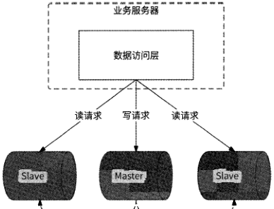

```text
                              J主从复制”    七主从复制
```

图2-2

市面上各主流数据库都实现了主从复制技术，参见1.7.3节介绍的MySQL数据库的主从复制原理。

### 2.2.2 读/写请求路由方式

在数据库读/写分离架构下，把写请求交给Master处理，而把读请求交给Slave处理,那么由什么角色来执行这样的读/写请求路由呢？ 一般可以采用如下两种方式。

[原 PDF 第 109 页](../%E4%BA%BF%E7%BA%A7%E6%B5%81%E9%87%8F%E7%B3%BB%E7%BB%9F%E6%9E%B6%E6%9E%84%E8%AE%BE%E8%AE%A1%E4%B8%8E%E5%AE%9E%E6%88%98%20%28--%29%20%28manongshu.com%29.pdf#page=109)

1. 基于数据库Proxy代理的方式

在业务服务和数据库服务器之间增加数据库Proxy代理节点（下文简称Proxy ）,业务服务对数据库的一切操作都需要经过Proxy转发。Proxy收到业务服务的数据库操作请求后，根据请求中的SQL语句进行归类，将属于写操作的请求（如insert/delete/update语句）转发到数据库Master,将属于读操作的请求（如select语句）转发到数据库任意一个Slave,完成读/写分离的路由。开源项目如中心化代理形式的MySQL-Proxy和MyCat,以及本地代理形式的MySQL-Router等都实现了读/写分离功能。

2. 基于应用内嵌的方式

基于应用内嵌的方式与基于数据库Proxy代理的方式的主要区别是，它在业务服务进程内进行请求读/写分离，数据库连接框架开源项目如gorm. shardingjdbc等都实现了此形式的读/写分离功能。

### 2.2.3 主从延迟与解决方案

数据库读/写分离架构依赖数据库主从复制技术，而数据库主从复制存在数据复制延迟（主从延迟），因此会导致在数据复制延迟期间主从数据的不一致，Slave获取不到最新数据。针对主从延迟问题有如下三种解决方案。

1. 同步数据复制

数据库主从复制默认是异步模式，Master在写完数据后就返回成功了，而不管Slave是否收到此数据。我们可以将主从复制配置为同步模式，Master在写完数据后，要等到全部Slave都收到此数据后才返回成功。

这种方案可以保证数据库每次写操作成功后，Master和Slave都能读取到最新数据。这种方案相对简单，将数据库主从复制修改为同步模式即可，无须改造业务服务。

但是由于在处理业务写请求时,Master要等到全部Slave都收到数据后才能返回成功，写请求的延迟将大大增加，数据库的吞吐量也会有明显的下滑。这种方案的实用价值较低，仅适合在低并发请求的业务场景中使用。

2. 强制读主

不同的业务场景对主从延迟的容忍性不一样。例如，用户a刚刚发布了一条状态，他浏览个人主页时应该展示这条状态，这个场景不太能容忍主从延迟；而好友用户b此时浏览用户a的个人主页时，可以暂时看不到用户a最新发布的状态，这个场景可以容忍主从延迟。我们可以对业务场景按照主从延迟容忍性的高低进行划分，对于主从延迟容忍性高的场景，执行正常的读/写分离逻辑；而对于主从延迟容忍性低的场景，强制将读请求路

[原 PDF 第 110 页](../%E4%BA%BF%E7%BA%A7%E6%B5%81%E9%87%8F%E7%B3%BB%E7%BB%9F%E6%9E%B6%E6%9E%84%E8%AE%BE%E8%AE%A1%E4%B8%8E%E5%AE%9E%E6%88%98%20%28--%29%20%28manongshu.com%29.pdf#page=110)

由到数据库Master,即强制读主。

3.会话分离

比如某会话在数据库中执行了写操作，那么在接下来极短的一段时间内，此会话的读请求暂时被强制路由到数据库Master,与“强制读主”方案中的例子很像，保证每个用户的写操作立刻对自己可见。暂时强制读主的时间可以被设定为略高于数据库完成主从数据复制的延迟时间，尽量使强制读主的时间段覆盖主从数据复制的实际延迟时间。

## 2.3 高并发读场景方案2：本地缓存

在计算机世界中，缓存(Cache )无处不在，如CPU缓存、DNS缓存、浏览器缓存等。值得一提的是，Cache在我国台湾地区被译为“快取”，更直接地体现了它的用途：快速读取。缓存的本质是通过空间换时间的思路来保证数据的快速读取。

业务服务一般需要通过网络调用向其他服务或数据库发送读数据请求。为了提高数据的读取效率，业务服务进程可以将已经获取到的数据缓存到本地内存中，之后业务服务进程收到相同的数据请求时就可以直接从本地内存中获取数据返回，将网络请求转化为高效的内存存取逻辑。这就是本地缓存的主要用途。在本书后面的核心服务设计篇中会大量应用本地缓存，本节先重点介绍本地缓存的技术原理。

### 2.3.1 基本的缓存淘汰策略

虽然缓存使用空间换时间可以提高数据的读取效率，但是内存资源的珍贵决定了本地缓存不可无限扩张，需要在占用空间和节约时间之间进行权衡。这就要求本地缓存能自动淘汰一些缓存的数据，淘汰策略应该尽量保证淘汰不再被使用的数据，保证有较高的缓存命中率。基本的缓存淘汰策略如下。

- FIFO ( First In First Out)策略：优先淘汰最早进入缓存的数据。这是最简单的淘汰策略，可以基于队列实现。但是此策略的缓存命中率较低，越是被频繁访问的数据是越早进入队列的,于是会被越早地淘汰。此策略在实践中很少使用。

- LFU ( Least Frequently Used )策略：优先淘汰最不常用的数据。LFU策略会为每条缓存数据维护一个访问计数，数据每被访问一次，其访问计数就加1,访问计数最小的数据是被淘汰的目标。此策略很适合缓存在短时间内会被频繁访问的热点数据，但是最近最新缓存的数据总会被淘汰，而早期访问频率高但最近一直未被访问的数据会长期占用缓存。

- LRU ( Least Recent Used )策略：优先淘汰缓存中最近最少使用的数据。此策略一般基于双向链表和哈希表配合实现。双向链表负责存储缓存数据，并总是将最近

[原 PDF 第 111 页](../%E4%BA%BF%E7%BA%A7%E6%B5%81%E9%87%8F%E7%B3%BB%E7%BB%9F%E6%9E%B6%E6%9E%84%E8%AE%BE%E8%AE%A1%E4%B8%8E%E5%AE%9E%E6%88%98%20%28--%29%20%28manongshu.com%29.pdf#page=111)

被访问的数据放置在尾部，使缓存数据在双向链表中按照最近访问时间由远及近

排序，每次被淘汰的都是位于双向链表头部的数据。哈希表负责定位数据在双向

链表中的位置，以便实现快速数据访问。此策略可以有效提高短期内热点数据的

缓存命中率，但如果是偶发性地访问冷数据，或者批量访问数据，则会导致热点

数据被淘汰，进而降低缓存命中率。

LRU策略和LFU策略的缺点是都会导致缓存命中率大幅下降。近年来，业界出现了一些更复杂、效果更好的缓存淘汰策略，比如W-TinyLFU策略。

### 2.3.2 W-TinyLFU策略

W-TinyLFU策略结合了 LFU策略和LRU策略的优点，兼具高缓存命中率与低内存占用，Redis和高性能的Java本地缓存Caffeine Cache组件都使用W-TinyLFU策略管理缓存。

虽然W-TinyLFU的名字带有LFU,但它实际上是LFU策略和LRU策略的结合体。从缓存内存空间的布局来看,W-TinyLFU将缓存的内存空间划分为两部分，如图2-3所示。

Segment LRU

```text
       访问 ---------- »    —----逐出
                    LRU    protected 段    probation 段
```

图2-3

（1 ） Window LRU段（对应图中的LRU）：此内存段使用LRU策略缓存数据，其占用的内存空间是总缓存内存空间的1%。

（2）Segment LRU段（简称SLRU）：此内存段使用SLRU策略缓存数据，具体是将缓存段进一步划分为protected段（保护段）和probation段（试用段）,其中probation段负责存储最近被访问1次的缓存数据，protected段负责存储最近被访问至少2次的缓存数据。Segment LRU段内存空间的80%被分配给protected段，剩余20%的内存空间被分配给 probation 段。

W-TinyLFU策略的工作流程如下。

（1） 将首次被访问的数据X缓存到Window LRU段。

（2） 当Window LRU段的内存空间已满时，使用LRU策略将被淘汰的数据移入Segment LRU段中的probation段，之后数据X被访问时，再将其移入protected段。

（3） 当protected段的内存空间已满时，使用LRU策略将被淘汰的数据X移入probation 段。

[原 PDF 第 112 页](../%E4%BA%BF%E7%BA%A7%E6%B5%81%E9%87%8F%E7%B3%BB%E7%BB%9F%E6%9E%B6%E6%9E%84%E8%AE%BE%E8%AE%A1%E4%B8%8E%E5%AE%9E%E6%88%98%20%28--%29%20%28manongshu.com%29.pdf#page=112)

（4）当数据X要被移入probation段，但是其内存空间已满时，使用LRU策略将被淘汰的数据V取出，与数据X进行访问频率的对比，将访问频率高的数据留在proation段，将访问频率低的数据淘汰。

W-TinyLFU策略使用Count-Min Sketch近似算法来保存每条缓存数据的访问频率，如图2・4所示。

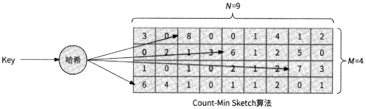

图2-4

Count-Min Sketch算法的运行流程如下。

（1） 选定M个哈希函数，分配一个"行N列的二维数组作为哈希表。

（2） 当某数据的访问频率增加时，对数据Key分别使用M个哈希函数计算出哈希值,再对N取模，然后将二维数组每一行对应的列位置的数值加1,即二维数组中M个位置的数值均被更新。

（3）当查询某数据的访问频率时，进行同样的哈希计算，将二维数组中M个位置的数值读出，选择其中的最小值作为此数据的访问频率。

值得注意的是，二维数组的每个位置仅需4bit,这是因为W-TinyLFU策略并不存储具体的访问计数，而是更希望反映出不同数据的访问频率的区分度。此策略认为每条数据

的访问频率达到15次就已经很高了，于是以4bit表示每条缓存数据的访问频率。不过，如果大量数据均达到15次的访问频率，那么就会使得访问频率的区分度大大降低。W-TinyLFU策略采用基于滑动窗口的时间衰减设计机制来解决这个问题:此策略单独维护一个全局计数，每当二维数组更新1次时，此全局计数就加1;当全局计数达到某个阈值时，将二维数组中的全部访问频率除以2,同时将全局计数除以2。

### 2.3.3 缓存击穿与SingleFlight

业务服务进程收到数据访问请求后，如果在本地缓存中没有查找到对应的数据（未命中缓存），则业务服务进程需要继续发起网络调用向数据库发送数据访问请求，获取到数据后再将其保存到本地缓存中。假设业务服务进程同时收到100个希望访问同一条热门数据的访问请求，且此数据未命中缓存，则业务服务进程会向下游发起100个数据访问请求。

[原 PDF 第 113 页](../%E4%BA%BF%E7%BA%A7%E6%B5%81%E9%87%8F%E7%B3%BB%E7%BB%9F%E6%9E%B6%E6%9E%84%E8%AE%BE%E8%AE%A1%E4%B8%8E%E5%AE%9E%E6%88%98%20%28--%29%20%28manongshu.com%29.pdf#page=113)

明明是访问同一条数据的请求，业务服务进程却执行了大量重复的网络调用，不仅浪费了网络带宽资源，而且可能将数据库击垮。此现象被称为“缓存击穿”。

通俗地讲，缓存击穿指的是缓存中一条热门数据在缓存失效的瞬间，对它的并发请求会“击穿”缓存，直接访问数据库，导致数据库被高并发请求击垮，就像如果防洪堤坝破

了一个口，大量洪水就会涌入城市一样。

Golang语言扩展包提供的同步原语SingleFlight能很好地解决缓存击穿问题。如图2-5所示，SingleFlight可以将对同一条数据的并发请求进行合并，只允许一个请求访问数据库中的数据，这个请求获取到的数据结果与其他请求共享。

```text
          获取数据x的并发请求    访问数据库
```

亚奏臆器

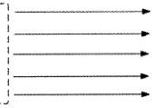


本地缓存

SingleFlight获取数据X的并发请求

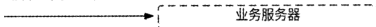

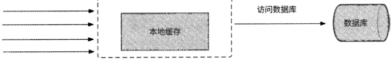

图2-5

下面通过程序模拟10个获取my_key数据的并发请求的场景，来简单介绍SingleFlight的使用方式：

```text
    import (
```

"golang.org/x/sync/singleflightH

nlogn

"sync”

```text
    )
    // SingleFlight
```

var g singleflight.Group

```text
    // getDataFromDB:模拟从数据库中获取key=”my_key”的数据
    func getDataFromDB(key string) (string, error) (
        //使用singleflight.Do ()方法获取数据，仅执行一次
        data, err, _ := g.Do(key, func() (interface!}, error) {
             //模拟众数据库中获取数据
```

log.Printf("get data for key:%s from database", key)

```text
             return nmy_cLata", nil
```

[原 PDF 第 114 页](../%E4%BA%BF%E7%BA%A7%E6%B5%81%E9%87%8F%E7%B3%BB%E7%BB%9F%E6%9E%B6%E6%9E%84%E8%AE%BE%E8%AE%A1%E4%B8%8E%E5%AE%9E%E6%88%98%20%28--%29%20%28manongshu.com%29.pdf#page=114)

```text
          })
          if err != nil {
              return err
         return data.(string)z nil
      }
     func main() (
```

var wg sync.WaitGroup

wg.Add(10)

```text
         //模拟10个并发请求
         for i 0; i < 10; i++ (
             go func() {
```

defer wg.Done ()

/ /这10个并发请求都希望获取key=nmy_keyn的数据

```text
                  data, err := getDataFromDB(nmy_keyn)
                  if err != nil (
```

log.Print(err)

return

```text
                  //获取数据成功
```

log.Printf("I get data:%s for key:my__keyH, data)

```text
             } o    -
```

wg.Wait()

```text
     }
```

singleflight.Do(key string, fn func() (interface{), error))方法保证：对于同一条数据(用Key作为唯一标识)的fn函数调用，在并发请求时只执行一次，fn函数返回的结果被并发请求共享。程序中10个并发请求都需要从数据库中获取数据，而实际上最终输出的结果如下：

```text
     2022/11/19    00:30:59    get data for key :my___key from database
     2022/11/19    00:30:59    I    get    data:my_data    for    key:my_key
     2022/11/19    00:30:59    I    get    data :my__data    for    key:my_key
     2022/11/19    00:30:59    I    get    data:my_data    key:my_key    for
     2022/11/19    00:30:59    I    get    data:my_data    for    key:my_key
     2022/11/19    00:30:59    I    get    data:my_data    for    key:my_key
     2022/11/19    00:30:59    I    get    data:my_data    for    key :my__key
    2022/11/19    00:30:59    I    get    data:my_data    for    key:my_key
    2022/11/19    00:30:59    I    get    data:my_data    for    key:my_key
    2022/11/19    00:30:59    get    data:my_data    I    for    key :my__key
    2022/11/19    00:30:59    I    get    data:my_data    for    key:my_key
```

我们可以很容易地看到，10个并发请求仅执行了一次从数据库中获取数据的操作，最终获取到的数据被10个并发请求所共享，缓存击穿问题被完美解决。

[原 PDF 第 115 页](../%E4%BA%BF%E7%BA%A7%E6%B5%81%E9%87%8F%E7%B3%BB%E7%BB%9F%E6%9E%B6%E6%9E%84%E8%AE%BE%E8%AE%A1%E4%B8%8E%E5%AE%9E%E6%88%98%20%28--%29%20%28manongshu.com%29.pdf#page=115)

为了进一步了解SingleFlight的原理，接下来我们对它的源码进行适当解读。需要注意的是，为了更方便理解SingleFlight的核心功能，这里附上的源码不包括各种异常、错误处理逻辑，对完整源码感兴趣的读者可以在GitHub上找到golang/sync/blob/master/singleflight/singleflight.go 目录自行阅读。

如果一条数据Key正在被执行的fn函数调用，那么结构体call将保存调用信息。

```text
    type call struct {
        //用于对获取此数据Key的并发请求做并发控制
```

wg sync.WaitGroup

```text
        //以下变量在WaitGroup运行完成之前被写入一次
        //当WaitGroup运行完成后,这些变量才可被读取
        //当fn函数调用成功时，在val变量中计入数据Key的值
        val interface{}
        //当fn函数调用失败时，在err变量中计入错误类型
```

err error

```text
        //统计并发调用次数
```

dups int

```text
     }
```

SingleFlight原语使用结构体Group保存：

```text
     type Group struct {
```

m map [string] *call 〃保存正在被执行的fn函数调用的数据Key与调用信息的映射关系

mu sync .Mutex //互斥锁，保证m变量并发读/与的安全

```text
     }
```

Do函数保证fn函数的调用仅被并发执行一次：

```text
     func (g *Group) Do (key string, fn func() (interfaced, error) ) (v interfaced,
 err error) {
        //先加锁保护m
```

g.mu.Lock()

```text
        //如果m为空，则初始化它
        if g.m == nil (
            g.m = make(map[string]*call)
```

}//在m中查找数据Key,看它是否正在被执行的fn函数调用

```text
         if c, ok := g.m[key]; ok (
            //如果数据Key正在被执行的fn方法调用，则并发调用次数加1
```

c.dups++

```text
            //不再操作m变量，释放锁
```

g.mu.Unlock()

```text
            //阻塞等待WaitGroup计数变为0
```

c.wg.Wait()

```text
            // fn函数调用完成，返回结果
            return c.val, c.err, true
```

[原 PDF 第 116 页](../%E4%BA%BF%E7%BA%A7%E6%B5%81%E9%87%8F%E7%B3%BB%E7%BB%9F%E6%9E%B6%E6%9E%84%E8%AE%BE%E8%AE%A1%E4%B8%8E%E5%AE%9E%E6%88%98%20%28--%29%20%28manongshu.com%29.pdf#page=116)

```text
         }
        //如果数据Key未被执行的fn函数调用，则新建调用信息
        c := new(call)
        //将WaitGroup计数记为1,这里是保证fn函数调用仅被并发执行一次的核心
```

c.wg.Add(1)

```text
        //在m中保存数据Key与调用信息的映射关系
        g.m[key] = c
        //不再操作m变量，释放锁
```

g.mu.Unlock()

```text
        //开始执行fn函数调用
```

g.doCall(c, key, fn)

```text
        // fn函数调用完成，返回结果
        return c.valf c.errA c.dups > 0
     }
```

doCall函数实际上执行fn函数调用，并在调用完成后唤醒被阻塞的请求：

```text
     func (g *Group) doCall(c *callz key string, fn func() (interface!}, error)) {
        // fn函数调用完成后，执行此延迟函数
```

defer func() (

```text
            //先对m加锁保护
```

g.mu.Lock()

```text
            // Done ()将 WaitGroup 计数减 1,等价于 c.wg.Add(-l)
            //当WaitGroup计数为0时，唤醒所有被阻塞在WaitGroup.Wait () ±的请求
```

c.wg.Done()

```text
           //在m中删除数据Key的调用信息
           if g.m[key] -= c {
```

delete(g.m, key)

```text
            }
           //释放锁
```

g.mu.Unlock()

```text
        } 0
        //执行fn函数调用，并获取结果
        c.val, c.err = fn()
     }
```

SingleFlight原语可以顺利执行的关键是使用了 WaitGroupo访问同一条数据的并发请求中的某一个请求调用WaitGroup.Add⑴标记WaitGroup计数为1,然后执行真正的数据访问；其他并发请求调用WaitGroup.Wait()阻塞等待WaitGroup计数变成0o数据访问完成后，通过调用WaitGroup.Done()将WaitGroup计数归0,于是其他并发请求被唤醒，它们可以直接读取到数据访问结果。WaitGroup的工作原理如图2-6所示。

[原 PDF 第 117 页](../%E4%BA%BF%E7%BA%A7%E6%B5%81%E9%87%8F%E7%B3%BB%E7%BB%9F%E6%9E%B6%E6%9E%84%E8%AE%BE%E8%AE%A1%E4%B8%8E%E5%AE%9E%E6%88%98%20%28--%29%20%28manongshu.com%29.pdf#page=117)

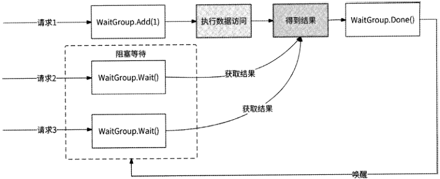

图2-6

## 2.4 高并发读场景方案3：分布式缓存

由于本地缓存把数据缓存在服务进程的内存中，不需要网络开销，故而性能非常高。

但是把数据缓存到内存中也有较多限制，举例如下。

- 无法共享：多个服务进程之间无法共享本地缓存。

- 编程语言限制：本地缓存与程序绑定，用Golang语言开发的本地缓存组件不可以直接为用Java语言开发的服务器所使用。

- 可扩展性差：由于服务进程携带了数据，因此服务是有状态的。有状态的服务不

具备较好的可扩展性。

- 内存易失性：服务进程重启，缓存数据全部丢失。

我们需要一种支持多进程共享、与编程语言无关、可扩展、数据可持久化的缓存，这

种缓存就是分布式缓存。

### 2.4.1 分布式缓存选型

主流的分布式缓存开源项目有Memcached和Redis,两者都是优秀的缓存产品，并且都具有缓存数据共享、与编程语言无关的能力。不过，相对于Memcached而言，Redis更为流行，主要体现如下。

- 数据类型丰富：Memcached仅支持字符串数据类型缓存，而Redis支持字符串、列表、集合、哈希、有序集合等数据类型缓存。

- 数据可持久化：Redis通过RDB机制和AOF机制支持数据持久化，而Memcached没有数据持久化能力。

[原 PDF 第 118 页](../%E4%BA%BF%E7%BA%A7%E6%B5%81%E9%87%8F%E7%B3%BB%E7%BB%9F%E6%9E%B6%E6%9E%84%E8%AE%BE%E8%AE%A1%E4%B8%8E%E5%AE%9E%E6%88%98%20%28--%29%20%28manongshu.com%29.pdf#page=118)

- 高可用性：Redis支持主从复制模式，在服务器遇到故障后，它可以通过主从切换操作保证缓存服务不间断。Redis具有较高的可用性。

- 分布式能力：Memcached本身并不支持分布式，因此只能通过客户端，以一致性哈希这样的负载均衡算法来实现基于Memcached的分布式缓存系统。而Redis有官方出品的无中心分布式方案Redis Cluster ,业界也有豆瓣Codis和推特Twemproxy的中心化分布式方案。

由于Redis支持丰富的数据类型和数据持久化，同时拥有高可用性和高可扩展性，因此它成为大部分互联网应用分布式缓存的首选。

### 2.4.2 如何使用Redis缓存

使用Redis缓存的逻辑如下。

（1） 尝试在Redis缓存中查找数据，如果命中缓存，则返回数据。

（2） 如果在Redis缓存中找不到数据，则从数据库中读取数据。

（3） 将从数据库中读取到的数据保存到Redis缓存中，并为此数据设置一个过期时间。

（4） 下次在Redis缓存中查找同样的数据，就会命中缓存。

将数据保存到Redis缓存时，需要为数据设置一个合适的过期时间，这样做有以下两个好处。

- 如果没有为缓存数据设置过期时间，那么数据会一直堆积在Redis内存中，尤其是那些不再被访问或者命中率极低的缓存数据，它们一直占据Redis内存会造成大量的资源浪费。设置过期时间可以使Redis自动删除那些不再被访问的缓存数据，而对于经常被访问的缓存数据，每次被访问时都重置过期时间，可以保证缓存命中率高。

- 当数据库与Redis缓存由于各种故障出现了数据不一致的情况时，过期时间是一个很好的兜底手段。例如，设置缓存数据的过期时间为10s,那么数据库和Redis缓存即使出现数据不一致的情况，最多也就持续10so过期时间可以保证数据库和Redis缓存仅在此时间段内有数据不一致的情况，因此可以保证数据的最终一致性。

在上述逻辑中，有一个极有可能带来风险的操作：某请求访问的数据在Redis缓存中不存在，此请求会访问数据库读取数据；而如果有大量的请求访问数据库，则可能导致数据库崩溃。Redis缓存中不存在某数据，只可能有两种原因：一是在Redis缓存中从未存储过此数据，二是此数据已经过期。下面我们就这两种原因来做有针对性的优化。

[原 PDF 第 119 页](../%E4%BA%BF%E7%BA%A7%E6%B5%81%E9%87%8F%E7%B3%BB%E7%BB%9F%E6%9E%B6%E6%9E%84%E8%AE%BE%E8%AE%A1%E4%B8%8E%E5%AE%9E%E6%88%98%20%28--%29%20%28manongshu.com%29.pdf#page=119)

### 2.4.3 缓存穿透

当用户试图请求一条连数据库中都不存在的非法数据时，Redis缓存会显得形同虚设。

(1 )尝试在Redis缓存中查找此数据，如果命中，则返回数据。

(2) 如果在Redis缓存中找不到此数据，则从数据库中读取数据。

(3) 如果在数据库中也找不到此数据，则最终向用户返回空数据

可以看到，Redis缓存完全无法阻挡此类请求直接访问数据库。如果黑客恶意持续发起请求来访问某条不存在的非法数据，那么这些非法请求会全部穿透Redis缓存而直接访问数据库，最终导致数据库崩溃。这种情况被称为“缓存穿透”。

为了防止出现缓存穿透的情况，当在数据库中也找不到某数据时，可以在Redis缓存中为此数据保存一个空值，用于表示此数据为空。这样一来，之后对此数据的请求均会被

Redis缓存拦截，从而阻断非法请求对数据库的骚扰。

不过，如果黑客访问的不是一条非法数据，而是大量不同的非法数据，那么此方案会使得Redis缓存中存储大量无用的空数据，甚至会逐出较多的合法数据，大大降低了 Redis缓存命中率，数据库再次面临风险。我们可以使用布隆过滤器来解决缓存穿透问题。

布隆过滤器由一个固定长度为m的二进制向量和左个哈希函数组成。当某数据被加入布隆过滤器中后，次个哈希函数为此数据计算出左个哈希值并与秫取模，并且在二进制向量对应的N个位置上设置值为1;如果想要查询某数据是否在布隆过滤器中，则可以通过相同的哈希计算后在二进制向量中查看这左个位置值：

- 如果有任意一个位置值为0,则说明被查询的数据一定不存在；

- 如果所有的位置值都为1,则说明被查询的数据可能存在。之所以说可能存在，是因为哈希函数免不了会有数据碰撞的可能，在这种情况下会造成对某数据的误判，不过可以通过调整秫和的值来降低误判率。

虽然布隆过滤器对于“数据存在”有一定的误判，但是对于“数据不存在”的判定是

准确的o布隆过滤器很适合用来防止缓存穿透:将数据库中的全部数据加入布隆过滤器中，当用户请求访问某数据但是在Redis缓存中找不到时，检查布隆过滤器中是否记录了此数据。如果布隆过滤器认为数据不存在，则用户请求不再访问数据库；如果布隆过滤器认为数据可能存在，则用户请求继续访问数据库；如果在数据库中找不到此数据，则在Redis缓存中设置空值。虽然布隆过滤器对“数据存在”有一定的误判，但是误判率较低。最后在Redis缓存中设置的空值也很少，不会影响Redis缓存命中率。

[原 PDF 第 120 页](../%E4%BA%BF%E7%BA%A7%E6%B5%81%E9%87%8F%E7%B3%BB%E7%BB%9F%E6%9E%B6%E6%9E%84%E8%AE%BE%E8%AE%A1%E4%B8%8E%E5%AE%9E%E6%88%98%20%28--%29%20%28manongshu.com%29.pdf#page=120)

### 2.4.4 缓存雪崩

如果在同一时间Redis缓存中的数据大面积过期，则会导致请求全部涌向数据库。这种情况被称为“缓存雪崩”。缓存雪崩与缓存穿透的区别是，前者是很多缓存数据不存在造成的，后者是一条缓存数据不存在导致的。

缓存雪崩一般有两种诱因：大量数据有相同的过期时间，或者Redis服务宕机。第一种诱因的解决方案比较简单，可以在为缓存数据设置过期时间时，让过期时间的值在预设

的小范围内随机分布，避免大部分缓存数据有相同的过期时间。第二种诱因取决于Redis的可用性，选取高可用的Redis集群架构可以极大地降低Redis服务宕机的概率。

### 2.4.5 缓存更新

为了尽量保证Redis缓存与数据库的数据一致性，当某数据在数据库中被更新后，其在缓存中也应该被更新。这看似是一个很简单的两步操作，但是有很多要考虑的问题（下文称Redis缓存为“缓存” ）o

- 是先更新数据库还是先修改缓存？

- 修改缓存是删除缓存还是将缓存数据修改为最新值？

- 如果有并发修改和访问同一条数据的请求（即并发读/写），那么会不会导致Redis缓存与数据库的数据不一致？

- 第一步更新成功了，但是第二步更新失败了，这时候该怎么办？

前两个问题用于讨论如何设计缓存更新机制，将它们排列组合可以产生4种设计方案；而后两个问题用于评判各设计方案的可取性。接下来逐一介绍这些设计方案。

方案1：先修改缓存，再更新数据库

在更新某数据时，先把缓存数据修改为最新值，再更新数据库。在并发写请求的场景下，这种方案存在数据不一致的问题。假设此时对数据垢a有两个并发请求：请求A修改数据为*b,请求B修改数据为埒c。一种可能的执行序列如下。

（1 ）请求A修改缓存，缓存数据被更新为bo

（2） 请求B修改缓存，缓存数据被更新为c。

（3） 请求B更新数据库，数据库中的数据被更新为c。

（4） 请求A更新数据库，数据库中的数据被更新为b。

数据X在数据库中的最新值为c,而在缓存中的最新值为b,此时就会出现缓存与数据库的数据不一致的情况。此外，如果修改缓存后更新数据库失败，数据的此修改不应该生效，需要将缓存数据重置为原值。这就要求请求每次在修改缓存前都要先暂存缓存数据

[原 PDF 第 121 页](../%E4%BA%BF%E7%BA%A7%E6%B5%81%E9%87%8F%E7%B3%BB%E7%BB%9F%E6%9E%B6%E6%9E%84%E8%AE%BE%E8%AE%A1%E4%B8%8E%E5%AE%9E%E6%88%98%20%28--%29%20%28manongshu.com%29.pdf#page=121)

的原值，只要更新数据库失败，就将缓存数据重新修改回原值。这是一种典型的事务回滚

场景，而Redis并不支持回滚，因此该方案不可取。

方案2：先更新数据库，再修改缓存

与方案1类似，在并发写请求的场景下，此方案存在数据不一致的问题。假设此时对数据村a有两个并发请求：请求A修改数据为J^b,请求B修改数据为X=c。一种可能的执行序列如下。

(1) 请求A更新数据库，数据库中的数据被更新为b。

(2) 请求B更新数据库，数据库中的数据被更新为c。

(3 )请求B修改缓存，缓存数据被更新为Co

(4 )请求A修改缓存，缓存数据被更新为b0

数据X在数据库中的最新值为c,而在缓存中的最新值为b,此时也会出现缓存与数据库的数据不一致的情况。因此，也不建议采用这种方案。

方案3:先删除缓存，再更新数据库

此方案不再修改缓存，而是将缓存直接删除。在并发读/写请求的场景下，此方案存在数据不一致的风险。假设此时对数据Wa有两个并发读/写请求:请求A修改数据为X=b,请求B读取数据X。一种可能的执行序列如图2.7所示。

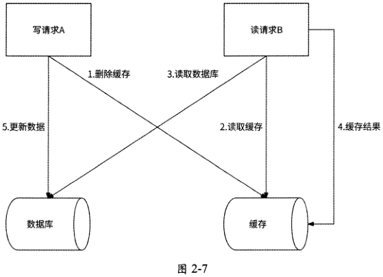

(1) 请求A删除缓存。

(2) 请求B读取缓存，缓存未命中。

[原 PDF 第 122 页](../%E4%BA%BF%E7%BA%A7%E6%B5%81%E9%87%8F%E7%B3%BB%E7%BB%9F%E6%9E%B6%E6%9E%84%E8%AE%BE%E8%AE%A1%E4%B8%8E%E5%AE%9E%E6%88%98%20%28--%29%20%28manongshu.com%29.pdf#page=122)

（3） 请求B进一步读取数据库。

（4） 请求B将读出的结果a保存到缓存中。

（5） 请求A更新数据库，数据库中的数据被更新为b。

数据X在数据库中的最新值为b,而在缓存中的最新值为a,此时还是会出现缓存与数据库的数据不一致的情况。

方案4：先更新数据库，再删除缓存

在更新某数据时，先更新数据库，在更新数据库成功后再将对应的缓存删除。此方案可以很好地解决上述3种方案在并发场景下数据不一致的问题。对于方案1和方案2中提到的并发写请求的场景，无论并发执行序列如何，最后一个操作一定是删除缓存，这就保证了接下来的读请求一定会从数据库中读取到最新值；而对于方案3中提到的并发读/写请求的场景，由于写操作在更新完数据库后会删除缓存，所以无论并发执行序列如何，缓存的状态要么是被写请求删除，要么是被读请求通过读取数据库更新为最新值，均可以保证缓存和数据库的数据一致性。

如果更新数据库成功，而删除缓存失败，这时该怎么办？ 一种简单的处理方式是重试删除缓存，可以在写请求删除缓存失败时，启动一个专门的线程负责不断地删除缓存，直到删除成功。若要做得更精细，则可以使用消息队列，缓存消息队列监听数据库的数据变化，每当数据库中的数据发生变化时，就对缓存实时执行删除数据操作，利用消息队列的失败重试机制保证删除数据操作最终被成功执行。不过，这里没有必要大动干戈，笔者推荐在删除缓存失败时仅执行一次异步重试，如果异步重试也失败了，则不再处理。因为发生此事件的概率极低，通过2.4.2节介绍的为缓存数据设置过期时间已经可以充分兜底：缓存数据仅会在此时间段内落后于数据库数据。

此方案可以大概率地保证缓存和数据库的数据一致性，且实现非常简单，因此是缓存更新策略的推荐方案。

## 2.5 高并发读场景总结：CQRS

无论是数据库读/写分离（见2.2节）、本地缓存（见2.3节）还是分布式缓存（见2.4节），其本质上都是读/写分离，这也是在微服务架构中经常被提及的CQRS模式。CQRS（Command Query Responsibility Segregation,命令查询职责分离）是一种将数据的读取操作与更新操作分离的模式。query指的是读取操作，而command是对会引起数据变化的操作的总称，新增、删除、修改这些操作都是命令。

[原 PDF 第 123 页](../%E4%BA%BF%E7%BA%A7%E6%B5%81%E9%87%8F%E7%B3%BB%E7%BB%9F%E6%9E%B6%E6%9E%84%E8%AE%BE%E8%AE%A1%E4%B8%8E%E5%AE%9E%E6%88%98%20%28--%29%20%28manongshu.com%29.pdf#page=123)

### 2.5.1 CQRS的简要架构与实现

为了避免引入微服务领域驱动设计的相关概念，图2-8给出了 CQRS的简要架构。

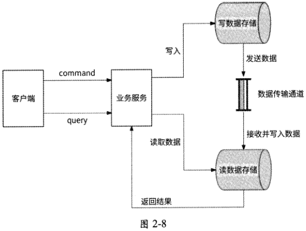

(1 )当业务服务收到客户端发起的command请求(即写请求)时，会将此请求交给写数据存储来处理。

(2) 写数据存储完成数据变更后，将数据变更消息发送到消息队列。

(3) 读数据存储负责监听消息队列，当它收到数据变更消息后，将数据写入自身。

(4) 当业务服务收到客户端发起的query请求(即读请求)时，将此请求交给读数据存储来处理。

(5 )读数据存储将此请求希望访问的数据返回。

写数据存储、读数据存储、数据传输通道均是较为宽泛的代称，其中写数据存储和读数据存储在不同的高并发场景下有不同的具体指代，数据传输通道在不同的高并发场景下有不同的形式体现，可能是消息队列、定时任务等。

- 对于数据库读/写分离来说，写数据存储是Master,读数据存储是Slave,消息队列的实现形式是数据库主从复制。

- 对于分布式缓存场景来说，写数据存储是数据库，读数据存储是Redis缓存，消息队列的实现形式是使用消息中间件监听数据库的binlog数据变更日志。

无论是何种场景，都应该为写数据存储选择适合高并发写入的存储系统，为读数据存储选择适合高并发读取的存储系统，消息队列作为数据传输通道要足够健壮，保证数据不

丢失。

[原 PDF 第 124 页](../%E4%BA%BF%E7%BA%A7%E6%B5%81%E9%87%8F%E7%B3%BB%E7%BB%9F%E6%9E%B6%E6%9E%84%E8%AE%BE%E8%AE%A1%E4%B8%8E%E5%AE%9E%E6%88%98%20%28--%29%20%28manongshu.com%29.pdf#page=124)

### 2.5.2 更多的使用场景

为了加深对CQRS的理解，下面再列举两个使用场景。

1. 搜索场景

很多互联网应用都支持根据关键词搜索用户昵称的功能，例如，用户在微博找人模块中输入关键词“北京”，微博会返回“北京日报” “北京大学” “这里是北京”等账号。这是一个典型的搜索场景。然而，账号信息被存储在数据库中，无法高效应对搜索昵称的业务场景。

这时候就很适合使用CQRS模式，数据库作为写数据存储负责账号信息的管理；而读数据存储应该选择一个在搜索场景中表现优秀的存储系统，比如Elasticsearch,它是基于倒排索引的分布式搜索系统，很适合作为此业务场景的读数据存储，将搜索用户昵称的请求交给Elasticsearch处理。选定读数据存储和写数据存储后，通过消息中间件为两者建立数据关联：创建一个消费者服务并使用消息中间件监听数据库的binlog数据变更日志，在筛选出用户昵称有更改的日志后，将最新用户昵称更新到Elasticsearch中。

2. 多表关联查询场景

有些业务场景如运营后台需要查询复杂的业务数据，这时就要对数据库进行多表关联查询才能得到完整的数据。SQL多表关联查询join语句的底层实现是效率较低的嵌套循环。如果直接对线上数据库执行join语句，则会严重影响其性能。此外，对线上数据库一般都做了分库分表（参见2.6.1节），无法直接执行join语句。

在这个场景下也非常适合使用CQRS模式，提前将需要多表关联的数据进行聚合计算，并将聚合结果单独存储到一个包含全部关联字段的宽表中，查询时直接读取宽表中的聚合结果，而不用执行join语句。在此场景下应用CQRS模式的架构如图2.9所示，其中：

- 数据库为写数据存储；

- 宽表为读数据存储；

- worker为执行数据聚合计算的服务；

- 执行数据聚合计算的时机是数据库有数据变更时，worker服务使用消息中间件监听数据库的binlog数据变更日志，每收到一条数据变更日志就执行一次数据聚合计算。也可以采用定时计算的形式，比如worker每分钟执行一次数据聚合计算。在数据聚合计算完成后，worker将聚合结果写入宽表。

[原 PDF 第 125 页](../%E4%BA%BF%E7%BA%A7%E6%B5%81%E9%87%8F%E7%B3%BB%E7%BB%9F%E6%9E%B6%E6%9E%84%E8%AE%BE%E8%AE%A1%E4%B8%8E%E5%AE%9E%E6%88%98%20%28--%29%20%28manongshu.com%29.pdf#page=125)

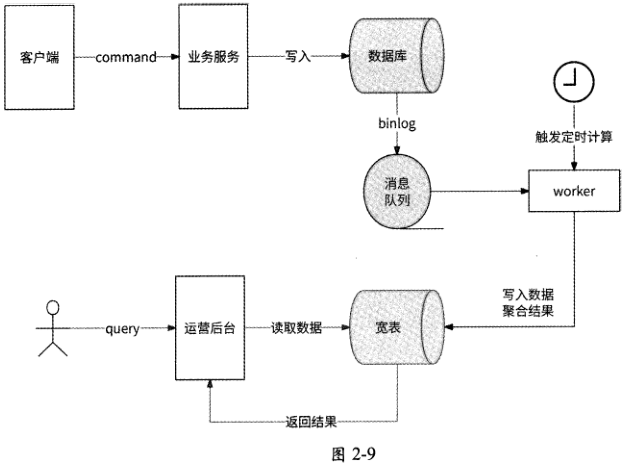

### 2.5.3 CQRS架构的特点

CQRS架构一般具有如下特点。

- 写数据存储要选用写性能高的存储系统，而读数据存储要选用读性能高的存储系统，所以两者往往有不同的存储模型和存储选型。数据库读/写分离只是一个最简单的特例。

- 读数据有延迟。写数据存储中的数据实时变更，而何时能从读数据存储中获取到最新数据，依赖数据传输通道的传输延迟。无论是消息队列还是定时任务都会带来一定的数据延迟，因此写数据存储和读数据存储仅保证数据的最终一致性。

## 2.6 高并发写场景方案1：数据分片之数据库分库分表

数据分片是指将待处理的数据或者请求分成多份并行处理。在现实生活中，有很多与数据分片思想一致的场景，例如：

- 为了减少患者与家属的排队时间，医院会开通多个挂号/收费窗口；

- 为了提高乘客进站的速度，人流量大的火车站、地铁站会设置多个闸机口，同时为乘客检票。

互联网应用在应对高并发写请求的架构设计中，数据分片也是一种常用方案。数据分

[原 PDF 第 126 页](../%E4%BA%BF%E7%BA%A7%E6%B5%81%E9%87%8F%E7%B3%BB%E7%BB%9F%E6%9E%B6%E6%9E%84%E8%AE%BE%E8%AE%A1%E4%B8%8E%E5%AE%9E%E6%88%98%20%28--%29%20%28manongshu.com%29.pdf#page=126)

片有多种表现形式，其中被广泛提及的是数据库分库分表。由于数据库分库分表已经可以充分体现数据分片的主要技术要素，所以本节会以数据库分库分表形式为主、其他数据分片形式为辅展开介绍。

### 2.6.1 分库和分表

数据库的分库和分表其实是两个概念：分库指的是将数据库拆分为多个小数据库，原来存储在单个数据库中的数据被分开存储到各个小数据库中；分表指的是将单个数据表拆分为多个结构完全一致的表，原来存储在单个数据表中的数据被分开存储到各个表中。由于数据库的分库操作和分表操作一般会同时进行，所以通常将它们合并在一起称为“数据库分库分表”。

大部分互联网应用都绕不开数据库分库分表，因为随着业务的不断发展和用户活跃度的提高，数据库会面临诸多挑战。

- 数据量大：当业务发展到一定阶段时，数据库中已存储了海量的存量数据，每个数据表中都存储了千万行甚至上亿行数据，业务方对数据表执行SQL语句时扫描的数据行增多，性能开销被严重放大。以MySQL数据库为例，如果单个数据表中的数据量超过2000万行，则会导致表结构B+树的层级增多，数据读/写的磁盘I/O操作次数增加。此外，在涉及数据表结构修改的场景下，DDL语句执行完成消耗的时间令人难以接受。为了解决单表的读/写效率问题，一般会进行分表操作。

- 并发量大：海量用户访问单个数据库，很快会达到数据库处理能力的上限，无论是数据库的最大请求连接数、CPU资源、内存资源还是网络带宽均有可能成为性能瓶颈。为了解决数据库性能问题，一般会进行分库操作。

分表的目的是提高一台服务器的单数据库处理能力，而分库的目的是充分利用多台服务器资源。接下来讨论怎样做分库分表。在拆分维度上，分库分表可以分为垂直拆分和水平拆分，其中垂直拆分侧重基于业务拆分，而水平拆分侧重基于数据拆分。

### 2.6.2 垂直拆分

垂直拆分包括垂直分库与垂直分表。

垂直分库指的是按照业务归属将单个数据库中的数据表进行分类，与不同业务相关的数据表被拆分到不同的数据库中，其核心是“专库专用”。以电商产品为例，在业务起步时期，为了快速上线，可能使用单个数据库存储商品表、物流表、商家表、订单表；当业务达到一定量级时，再按照电商业务维度垂直拆分出商品库、物流库、商家库、订单库，如图2.10所示。

[原 PDF 第 127 页](../%E4%BA%BF%E7%BA%A7%E6%B5%81%E9%87%8F%E7%B3%BB%E7%BB%9F%E6%9E%B6%E6%9E%84%E8%AE%BE%E8%AE%A1%E4%B8%8E%E5%AE%9E%E6%88%98%20%28--%29%20%28manongshu.com%29.pdf#page=127)

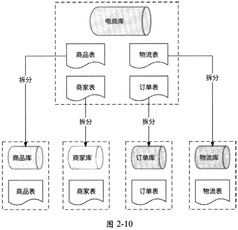

垂直分库可以实现不同业务归属的数据解耦，将不同业务数据交给各业务研发团队独立维护，有效保证了各团队的职责单一。在高并发场景下，由于垂直分库使用不同的服务器维护不同业务的数据库，数据库并发量得到一定程度的提升。

垂直分表指的是将一个数据表按照字段分成多个表，每个表存储其中一部分字段。分表的依据可以是字段被频繁访问的频率、字段值大小等。还是以电商产品为例，最初的商品表可能有名称、商品图片、价格、限购数、商品描述、售后说明等字段，但是这些字段的曝光率有较大的差距：在用户搜索商品、商品推荐或商家全部商品列表等高频访问场景下，仅需要名称、商品图片和价格字段，而限购数、商品描述和售后说明字段仅在用户点击进入商品详情页后才会被读取，而且商品描述和售后说明字段的值比较大，于是商品表可以被垂直拆分为商品基本信息表和商品详情表，如图2-11所示。

垂直分表可以很好地隔离核心数据和非核心数据。数据库是以行为单位将数据加载到内存中的，通过垂直分表拆分以后核心数据表的字段大多访问频率较高，且字段值也都较小。因此可以将更多的数据加载到内存中，来提高查询的命中率，减少磁盘I/O,以此来提升数据库性能。不过，垂直分表仅适合数据量不大但字段较多的数据存储场景。由于拆分后各表的数据行没有变化，因此垂直分表并没有消除单表数据量过大的问题。

[原 PDF 第 128 页](../%E4%BA%BF%E7%BA%A7%E6%B5%81%E9%87%8F%E7%B3%BB%E7%BB%9F%E6%9E%B6%E6%9E%84%E8%AE%BE%E8%AE%A1%E4%B8%8E%E5%AE%9E%E6%88%98%20%28--%29%20%28manongshu.com%29.pdf#page=128)

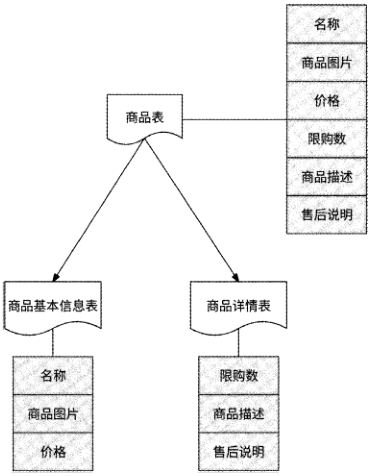

图 2-11

### 2.6.3 水平拆分

水平拆分同样包括水平分库与水平分表。

水平分库是指将同一个数据库中的数据按照某种规则拆分到多个数据库中，这些数据库可以被部署在不同的服务器上。并且每个数据库拥有哪些表以及每个表的结构都与拆分前的数据库完全一致。

如图2-12所示，以存储已注册用户的“用户库”为例，将“用户库”水平拆分为3个数据库：用户库・1、用户库-2、用户库・3。这3个数据库内有完全相同的“用户表”。对于一条用户数据，按照uid （用户ID）与3取模的结果来决定将其拆分到哪个数据库中。水平分库通过利用多服务器资源充分提高了数据库并发处理能力，且拆分后每个数据库内的单表数据量也得到了有效控制。

水平分表是指在同一个数据库内，将一个数据表中的数据按照某种规则拆分到多个表中，每个表的结构都与拆分前的表完全一致。如图2・13所示，还是以“用户库”为例，在“用户库”中将“用户表”拆分为3个结构一样的表：用户表・1、用户表・2、用户表・3。对于一条用户数据，同样按照uid （用户ID ）与3取模的结果来决定将其拆分到哪个表中。

[原 PDF 第 129 页](../%E4%BA%BF%E7%BA%A7%E6%B5%81%E9%87%8F%E7%B3%BB%E7%BB%9F%E6%9E%B6%E6%9E%84%E8%AE%BE%E8%AE%A1%E4%B8%8E%E5%AE%9E%E6%88%98%20%28--%29%20%28manongshu.com%29.pdf#page=129)

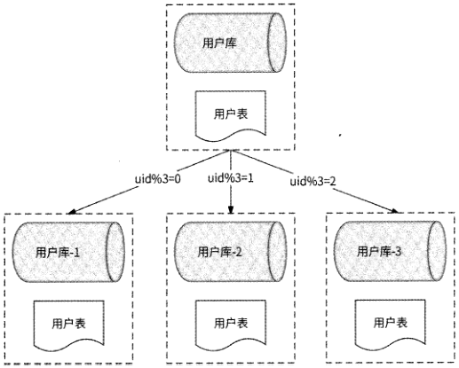

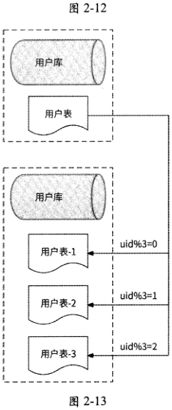

水平分表解决了单表数据量过大的问题。但是由于拆分后的表还在同一个数据库中，所以依然在竞争同一台服务器的请求连接数、CPU、内存、网络带宽等资源。为了进一步提升数据库性能，水平分表还可以结合水平分库，即“水平分库分表”，将拆分后的表分

[原 PDF 第 130 页](../%E4%BA%BF%E7%BA%A7%E6%B5%81%E9%87%8F%E7%B3%BB%E7%BB%9F%E6%9E%B6%E6%9E%84%E8%AE%BE%E8%AE%A1%E4%B8%8E%E5%AE%9E%E6%88%98%20%28--%29%20%28manongshu.com%29.pdf#page=130)

散到不同的数据库中，达到分布式效果，如图2.14所示。

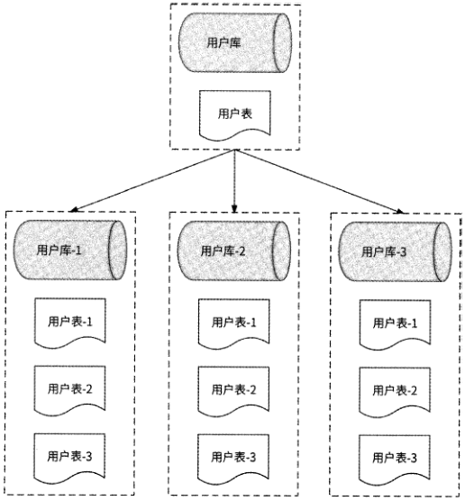

图 2-14

水平分库使数据库拥有分布式能力，水平分表使数据量过大的单表SQL语句的执行效率得到提升，我们可以根据业务需要来选择是水平分库、水平分表还是水平分库分表。

- 如果在业务场景中用户并发量很大，但是数据量较小，则可以只选择水平分库，不选择水平分表。

- 如果在业务场景中用户并发量很小，但是数据量较大，则可以不选择水平分库，只选择水平分表。

- 如果在业务场景中用户并发量很大，数据量也很大，则可以选择水平分库分表。

### 2.6.4 水平拆分规则

在2.6.3节中提到按照某种规则水平拆分，并以取模运算作为示例。实际上，水平拆分规则是指数据路由算法，用于决定一条数据应该被拆分到哪个库和哪个表中。更广泛的说法是，一条数据应该被拆分到哪个数据分区。在最理想的情况下，数据路由算法应该保证每个分区有均等的数据量和数据读/写请求量。如果某个数据分区存储的数据量远大于其他数据分区，我们就称此情况为“数据偏斜”；如果某个数据分区的读/写请求量远大于

[原 PDF 第 131 页](../%E4%BA%BF%E7%BA%A7%E6%B5%81%E9%87%8F%E7%B3%BB%E7%BB%9F%E6%9E%B6%E6%9E%84%E8%AE%BE%E8%AE%A1%E4%B8%8E%E5%AE%9E%E6%88%98%20%28--%29%20%28manongshu.com%29.pdf#page=131)

其他数据分区，我们就将这个数据分区称为“数据热点”。一种适合的数据路由算法应该避免出现数据偏斜与数据热点。接下来介绍几种常见的数据路由算法。

1.范围分区法

将数据以可排序字段值的区间为依据进行数据分区，比如数据唯一 ID、数据创建时间等。例如，如图2・15所示，按照数据创建时间将每半年作为一个区间进行数据分区一一将2020年7月至12月的数据存储到数据库DB1中，将2021年1月至6月的数据存储到数据库DB2中，将2021年7月至12月的数据存储到数据库DB3中。按照数据唯一 ID

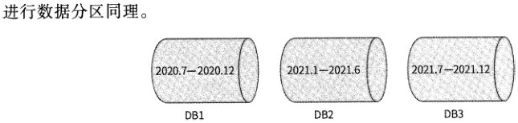

图 2-15

范围分区法可以很方便地支持分区查询，比如上面的例子，可以轻松地得到某个月所有的数据。另外，范围分区法对分区扩容很友好，比如增加数据分区时，只需要设置更多的数据范围，而基本上不会变更已有的分区数据范围。

但是，范围分区法是否可以保持各数据分区的数据量均匀分布非常依赖分区字段的属性。如果分区字段有自增属性，比如“用户表”使用用户id作为分区依据，那么由于用户id自增，每个分区保持范围等长即可保证数据量的均匀分布；而如果“用户表”使用用户昵称这种具有随机性质的字段作为分区依据，那么由于用户昵称的值随机，每个分区的范围长度可能不同，即数据分区之间难以保证数据量的均匀分布，容易造成数据偏斜。此外，如果使用带有时间属性的字段作为分区依据，数据范围是近半年的数据分区的读/写频率更高，则容易出现数据热点。

2.哈希分区法

为了防止出现数据偏斜与数据热点的问题，很多分布式存储系统都会采用哈希函数来确定数据分区。最简单的哈希分区法是取模法：先计算出所选数据字段的哈希值，再与数据分区数目N取模，即hash()%7V,取模结果对应数据分区0〜Ml。此方法最大的优势是实现简单，但是对于数据分区扩容缺少灵活性，一旦数据分区数目N有变化，所有的数据就都需要重新分区。更好的做法是与对数据分区扩容友好的范围分区法相结合，即对哈希值进行范围分区，每个数据分区接收哈希值在指定范围内的数据，如图2・16所示。

哈希分区法的优势是无视数据字段属性，无论是自增属性还是随机字符串，均可以通过哈希函数转化为数字；而且，使用优秀的哈希函数可以使数据量均匀分布，在很大程度上避免了数据偏斜与数据热点的出现。

[原 PDF 第 132 页](../%E4%BA%BF%E7%BA%A7%E6%B5%81%E9%87%8F%E7%B3%BB%E7%BB%9F%E6%9E%B6%E6%9E%84%E8%AE%BE%E8%AE%A1%E4%B8%8E%E5%AE%9E%E6%88%98%20%28--%29%20%28manongshu.com%29.pdf#page=132)

哈希计算

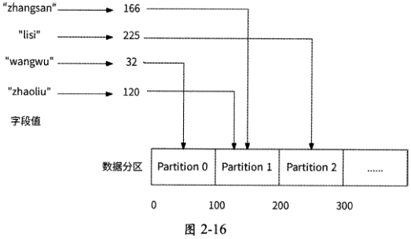

3. 一致性哈希分区法

一致性哈希分区法最重要的结构是哈希环，如图2・17所示，数值0〜232.1作为232个节点依次排列在哈希环上并首尾相连。

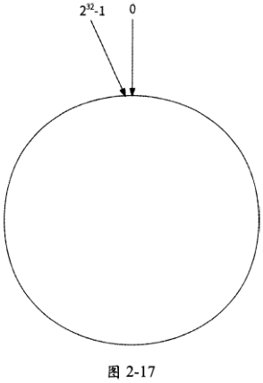

哈希环维护了每个哈希值与其数据分区的路由关系。

每个数据分区都通过哈希计算，所得到的哈希值与232取模后被映射到哈希环的某个节点。

每条数据都以某个字段进行哈希计算，所得到的哈希值也与232取模后被映射到哈希环的某个节点，然后从这个节点出发，在哈希环上顺时针查找到的第一个数据分区节点负

[原 PDF 第 133 页](../%E4%BA%BF%E7%BA%A7%E6%B5%81%E9%87%8F%E7%B3%BB%E7%BB%9F%E6%9E%B6%E6%9E%84%E8%AE%BE%E8%AE%A1%E4%B8%8E%E5%AE%9E%E6%88%98%20%28--%29%20%28manongshu.com%29.pdf#page=133)

责存储此数据。如图2-18所示，数据data 1和数据data 2被分配到数据分区Partition 2,数据data 3被分配到数据分区Partition 4O

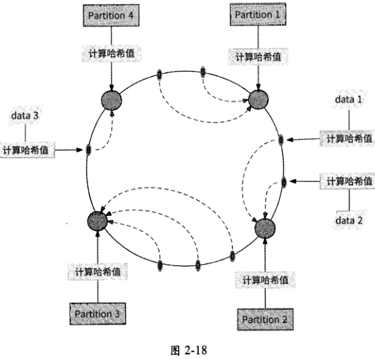

一致性哈希分区法最主要的优点是，当增加或移除一个数据分区时，只有其在哈希环上逆时针相邻的数据需要重新分区。比如图2-18中的数据分区Partition 4被移除后，只有其原本存储的数据data 3需要被迁移到新的数据分区Partition 1,其他数据不会受到影响。

由于一致性哈希分区法并不指定每个数据分区的哈希值范围，所以数据分区在哈希环上分布越均匀，各个数据分区的数据量就越均衡。但是，当数据分区较少时，有很大的可

能是它们在哈希环上的分布较为集中，进而造成数据偏斜，如图2・19所示。

从图2・19中可以看出，由于3个数据分区的分布较为集中，所以产生了数据偏斜问题，Partition 1存储的数据量远远大于Partition 2和Partition 3。为了避免出现这种情况，一致性哈希分区法引入了虚拟节点机制。对于每个数据分区，计算出多个哈希值，每个计算结果都被放置到哈希环的对应节点上，这些节点被称为“虚拟节点”。一个实际的数据分区可以对应多个虚拟节点。通过虚拟节点机制可以将数据分区数目放大，数据分区对应的虚拟节点越多，哈希环上的节点就越多，它们也更容易在哈希环上均匀分布，数据偏斜的影响就会越来越小。如图2-20所示的是每个数据分区有3个虚拟节点的哈希环映射情况。

[原 PDF 第 134 页](../%E4%BA%BF%E7%BA%A7%E6%B5%81%E9%87%8F%E7%B3%BB%E7%BB%9F%E6%9E%B6%E6%9E%84%E8%AE%BE%E8%AE%A1%E4%B8%8E%E5%AE%9E%E6%88%98%20%28--%29%20%28manongshu.com%29.pdf#page=134)

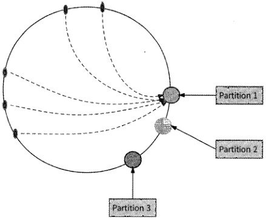

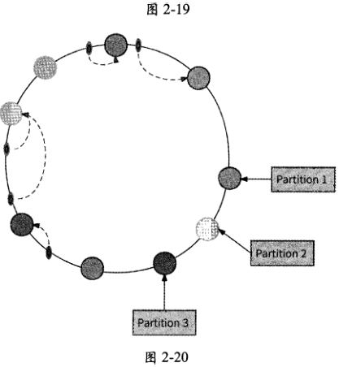

### 2.6.5 扩容方案

当某个分库承载的数据量或请求量远高于其他分库，或者现有的分库分表架构的数据量已经趋于饱和时，都需要进行扩容操作。这里推荐的平滑扩容方案是从库升级法。

我们先来介绍单个分库的扩容步骤。如图2-21所示，假设某数据库被拆分为3个库和6个表，各个分库存储的数据范围分别为rO〜rl、rl〜r2、r2~r3,此时分库DB0的数据量和资源压力过大。

[原 PDF 第 135 页](../%E4%BA%BF%E7%BA%A7%E6%B5%81%E9%87%8F%E7%B3%BB%E7%BB%9F%E6%9E%B6%E6%9E%84%E8%AE%BE%E8%AE%A1%E4%B8%8E%E5%AE%9E%E6%88%98%20%28--%29%20%28manongshu.com%29.pdf#page=135)

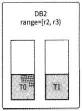

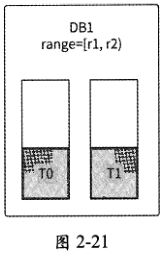

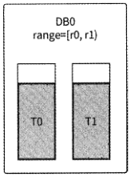

使用从库升级法对DBO分库扩容的步骤如下。

（1 ）为DBO增加Slave节点（即从库）,开始主从复制操作，将DBO的数据同步到从库。这一步不一定需要专门来做，因为在常见的数据库分库分表方案中，分库都会使用主从复制架构来保证每个分库高可用，从库是本来就存在的。

（2） 主从复制完成后，DBO主库临时封禁写请求操作，保证不再有增量数据。

（3） 检查主从库数据，如果数据完全一致，则表示数据已经完全被同步到从库，此时断开主从关系。

（4） 修改DBO的数据范围为r0~（r0+rl）/2,即DBO负责原来数据范围的前一半。

（5） 将DBO从库提升为主库并命名为DB3,同时设置数据范围为（r0+rl）/2 - rl,即DB3负责原DBO数据范围的后一半。

（6） 确认上游业务均已感知到分库数据范围的变更后，解封DBO的写请求操作，此时分库扩容已经完成，业务已经恢复正常写数据库。

（7） 启动离线任务，将DBO和DB3的数据范围外的另一半冗余数据删除，最终DBO被扩容为图2・22所示的分库。

对整个数据库基于从库升级法扩容时，分库数量会翻倍，所以这种扩容方式也被称为“翻倍扩容法”。其扩容步骤与单个分库的扩容步骤类似，只不过是对每个分库都执行从库

升级。

（1） 对于每个分库增加从库，开始主从复制操作。同样，这一步不一定需要做。

（2） 各分库主从复制完成后，主库临时封禁写请求操作。

（3） 检查各分库的主从库数据，如果数据完全一致，则断开全部主从关系。

（4） 修改原分库的数据范围为原数据范围的前一半。

（5） 将各分库的从库提升为主库，同时设置其数据范围为原数据范围的后一半。

[原 PDF 第 136 页](../%E4%BA%BF%E7%BA%A7%E6%B5%81%E9%87%8F%E7%B3%BB%E7%BB%9F%E6%9E%B6%E6%9E%84%E8%AE%BE%E8%AE%A1%E4%B8%8E%E5%AE%9E%E6%88%98%20%28--%29%20%28manongshu.com%29.pdf#page=136)

（6） 确认上游业务均已感知到分库数据范围的变更后，解封全部分库写请求操作，数据库恢复对外提供服务。

（7） 启动离线任务，将原分库和新分库的数据范围外的另一半冗余数据删除，最终DBO和DB1的分库如图2-23所示。

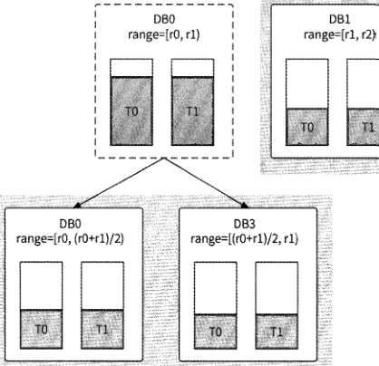

DB2

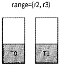

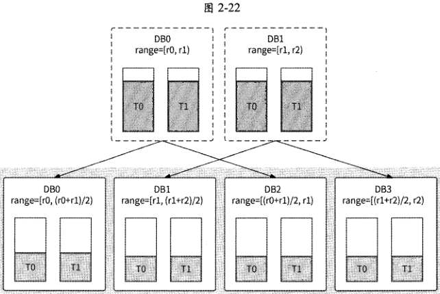

图 2-23

[原 PDF 第 137 页](../%E4%BA%BF%E7%BA%A7%E6%B5%81%E9%87%8F%E7%B3%BB%E7%BB%9F%E6%9E%B6%E6%9E%84%E8%AE%BE%E8%AE%A1%E4%B8%8E%E5%AE%9E%E6%88%98%20%28--%29%20%28manongshu.com%29.pdf#page=137)

### 2.6.6 其他数据分片形式

除数据库分库分表之外，数据分片还有其他形式，这里再举3个例子。

1. Kafka 多 Partition

在消息中间件Kafka中，以Topic区分不同的消息类型，每个Topic都可以被认为是一个逻辑上的消息队列。在Topic内部物理组成上，消息队列被拆分为多个Partition,每个Partition对应一个独立的日志文件被存放在不同的服务器上。Kafka在向一个Topic发送消息时，实际上是在并行写入Partition, 一个Topic的Partition数目越多，越能增加这个Topic的消息写入吞吐量。

2. 秒杀系统分布式锁

电商秒杀系统往往通过分布式锁来保证秒杀时产品不被超卖，但如果某个产品的热度很高，大量秒杀请求并发竞争同一个分布式锁，则会严重拖垮性能。由于分布式锁会造成请求串行化执行，假设一次分布式锁操作耗时20ms, Is最多可以接收50个秒杀请求，那么这对于热门产品来说难以接受。对于这种情况，优化思路也是数据分片：将产品库存拆分为N份，每份库存使用单独的分布式锁保护，而每个秒杀请求仅争抢其中的一份库存。例如，现有1000台iPhone手机，我们将库存拆分为20个分段（将分段命名为seg・0 ~ seg・19,每个分段有50个库存）,同时创建20个分布式锁（命名为iphone-lock-0 ~ iphone-lock-19 ）分别保护这些分段；当秒杀请求到来时，将请求用户ID与20取模得到值Z,尝试竞争分布式锁iphone-lock-z并扣减分段seg-z的库存。20个分布式锁支持20个秒杀请求并行加锁，这样一来，即使加锁耗时20ms,秒杀系统Is也能接收50x20= 1000个秒杀请求。

3. ConcurrentHashMap

ConcurrentHashMap是JDK内置的线程安全的HashMap,它并不会对整个HashMap加锁以保证线程安全，而是将其内部数据拆分到多个槽，为每个槽独立加锁，于是对这些槽可以并发读/写。这样的做法减少了线程间竞争，提高了 HashMap的读/写性能。

## 2.7 高并发写场景方案2：异步写与写聚合

数据分片本质上是通过提高系统的可扩展性来支撑高并发写请求的，每当写请求量达到一个新高度时，系统就需要数据分片扩容。从产品发展的角度来讲，这本无可厚非，但是扩容就意味着需要更多昂贵的服务器资源，经济成本较高；况且扩容不是一个实时操作，对临时的突增流量很难及时应对。实际上，我们还可以从业务的角度和数据特点的角度来思考高并发写场景的应对之道，本节就来介绍两种常见的方案：异步写和写聚合。

[原 PDF 第 138 页](../%E4%BA%BF%E7%BA%A7%E6%B5%81%E9%87%8F%E7%B3%BB%E7%BB%9F%E6%9E%B6%E6%9E%84%E8%AE%BE%E8%AE%A1%E4%B8%8E%E5%AE%9E%E6%88%98%20%28--%29%20%28manongshu.com%29.pdf#page=138)

### 2.7.1 异步写

异步写是一个泛化的概念，并不局限于实现形式。异步写把写请求的交互流程从“用户发起写请求并同步等待结果返回”转变为“用户提交写请求后，异步查询结果”的两阶段交互。一般而言，异步写的技术实现有如下特点。

- 将用户写请求先以适当的方式快速暂存到一个数据池中，然后立刻响应用户，告知其请求提交成功，以便缩短写请求的响应时间。

- 真正的写操作由后台任务不断地从数据池中读取请求并真正执行。

- 写操作结果依靠用户主动查询，有的业务场景为了提高实时性，也会在写操作执行完成后王动将结果通知给用户。

异步写非常适合写请求量大，但是被请求方的系统吞吐量跟不上的场景一一写请求先排队，被请求方以正常的速度处理请求，就像火车检票口一样。接下来列举几个场景介绍异步写的实现。

1.跨公网调用

某电商类产品接入微信支付、支付宝等渠道来做支付功能，这些渠道都属于第三方平台，即不属于本产品的后台服务，这就意味着需要跨公网调用第三方平台的支付接口。而公网调用的网络耗时和网络抖动很严重，同时大量的用户支付请求到来会导致跨公网调用发生阻塞。由于跨公网调用的速度无法匹配支付请求的速度，所以使用异步写方案可以很好地解决问题。如图2-24所示，使用消息中间件对用户支付请求进行排队操作，并通过消息消费者不断地消费用户支付请求，逐个跨公网调用第三方平台的支付接口。

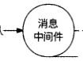

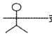

```text
                         肖息    消息
支付请求，    支付服务    -排队    一消费
                        中间件    消费者
```

跨公网调用支付接口

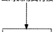

第三方

支付平台

图2・24

2.秒杀系统异步化

在产品秒杀活动中，对于某电商产品，在同一时间会有大量的用户抢购请求涌入服务器，如果每个请求都直接访问数据库进行扣减库存和写入订单的操作，那么数据库将会承受巨大的压力。我们可以通过异步写方案将抢购动作变成异步形式：用户点击“抢购”按

[原 PDF 第 139 页](../%E4%BA%BF%E7%BA%A7%E6%B5%81%E9%87%8F%E7%B3%BB%E7%BB%9F%E6%9E%B6%E6%9E%84%E8%AE%BE%E8%AE%A1%E4%B8%8E%E5%AE%9E%E6%88%98%20%28--%29%20%28manongshu.com%29.pdf#page=139)

钮，秒杀服务将抢购请求提交到消息中间件，而后立即响应用户——“抢购中”；消息消费者按照数据库的真实处理能力，低频甚至串行地消费抢购请求并交给数据库处理；数据

库处理请求完成后，将处理结果保存到Redis中；用户可以刷新订单页向Redis查询抢购结果。秒杀系统的异步化架构大致如图2・25所示。

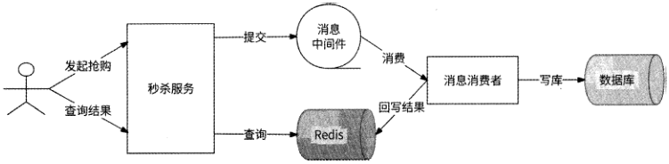

图 2-25

### 2.7.2 写聚合

写聚合将若干写请求聚合为一个写请求，减少了写请求量。这种方案比较简单、易懂，业界也有较多的应用场景，这里举两个例子。

1. Kafka Producer 批量生产

为了提升消息生产者（Producer）的消息发送性能，消息中间件Kafka提供了Micro-Batch概念。Micro-Batch提供了一个名为RecordAccumulator的消息收集器，它会将Producer待发送的消息暂存在内存中，并将相同Topic、相同Partition的消息聚合为一个批次，然后一次性发送到Kafka集群，大大提高了 Kafka发送消息的吞吐量。

2. AliSQL热点数据优化

由于行锁的存在，在数据库中处理热点数据更新一直是一个难题。对某行热点数据的

多个更新请求会相互竞争同一个行锁，性能一直难以得到提升。阿里云深度定制的MySQL分支AliSQL对热点数据更新有专门的优化：将对同一行的多个更新操作聚合为一个批次更新操作，消除了行锁竞争，提高了热点数据的更新效率。

## 2.8 本章小结

本章介绍了高并发架构设计的常用技术方案。

一个系统设计是否满足高并发架构并不是简简单单地看它能承受的QPS是多少。高并发系统有3个可量化的重点指标：高可用性（ 99.95%的时间可用）、高性能（平均响应时间小于200ms, PCT99小于Is ）和可扩展性（可扩展性大于70% ）o高可用性反映了系

[原 PDF 第 140 页](../%E4%BA%BF%E7%BA%A7%E6%B5%81%E9%87%8F%E7%B3%BB%E7%BB%9F%E6%9E%B6%E6%9E%84%E8%AE%BE%E8%AE%A1%E4%B8%8E%E5%AE%9E%E6%88%98%20%28--%29%20%28manongshu.com%29.pdf#page=140)

统可以提供可靠服务的时间，高性能反映了系统吞吐量，而可扩展性反映了系统的韧性。

高并发场景可以分为高并发读场景和高并发写场景。在面对这两种场景时，高并发架构设计往往有不同的思路。

对于高并发读场景来说，可以通过数据库读/写分离、本地缓存、分布式缓存等方案来解决问题。数据库读/写分离方案依赖数据库主从复制机制，并需要格外注意主从延迟问题。本地缓存方案使用服务器本地内存空间来换取网络调用时间，并可以使用如LFU、LRU. W-TinyLFU等缓存淘汰策略来防止滥用本地内存；同时可以使用类似于SingleFlight的机制来解决缓存击穿问题。分布式缓存方案使用Redis实现，可以通过先更新数据库再删除缓存的方式来保证数据库与缓存数据的最终一致性；同时为了防止缓存失效，需要注

意缓存穿透、缓存雪崩等问题。最后我们提出了 CQRS模式，用于总结应对高并发读场景的核心思想：读/写分离。

而对于高并发写场景来说，可以采用数据分片（数据库分库分表）将写请求分散到多个数据分区；也可以使用异步写方案，暂时将写请求存储到一个临时缓冲区（典型的代表是消息中间件）；还可以按照数据特性对相关的写请求进行写聚合，减少了写请求量。
