[原 PDF 第 141 页](../%E4%BA%BF%E7%BA%A7%E6%B5%81%E9%87%8F%E7%B3%BB%E7%BB%9F%E6%9E%B6%E6%9E%84%E8%AE%BE%E8%AE%A1%E4%B8%8E%E5%AE%9E%E6%88%98%20%28--%29%20%28manongshu.com%29.pdf#page=141)

# 第3章 通用的服务可用性治理手段

系统的高可用性不仅体现在系统架构设计上，还体现在系统日常对外提供服务的稳定性上。本章我们开始学习通用的服务可用性治理手段，具体的学习路径与内容组织结构如

下。

- 3.1节介绍微服务架构与网络调用的问题。

- 3.2节介绍请求重试及需要考虑的技术问题。

- 3.3节介绍熔断与隔离，也就是上游服务如何更好地保护下游服务、如何防止上游服务被下游服务拖垮，以及如何防止一个服务内各个接口之间因质量问题而相互影响。

- 3.4节与3.5节介绍限流，也就是下游服务如何更好地保护自己。

- 3.6节介绍服务降级策略及相关示例。

本章关键词：重试、熔断、限流、自适应限流、降级、强依赖、弱依赖。

## 3.1 微服务架构与网络调用

当某个业务从单体服务架构转变为微服务架构后，多个服务之间会通过网络调用形式形成错综复杂的依赖关系。以负责展示用户主页的个人页服务为例，为了拼装出完整的用户主页，个人页服务需要对多个其他微服务发起RPC请求，如图3-1所示。

- 从用户信息服务中获取用户昵称、头像、个性签名等用户基础信息。

- 从地理位置服务中获取用户活跃IP地址的归属国家和省市信息。

- 从内容列表服务中获取用户已发布内容的列表。而内容列表服务要进一步从计数服务中获取用户发布的内容数、点赞总数，并从内容服务中获取每条内容的具体信息，如文本、图片、发布时间、点赞数、评论数、转发数等，其中后三者又需要内容服务继续从计数服务中获取。

- 从关系服务中获取用户与请求发起者之间的关系，并进一步从计数服务中获取用户的关注数和粉丝数。

[原 PDF 第 142 页](../%E4%BA%BF%E7%BA%A7%E6%B5%81%E9%87%8F%E7%B3%BB%E7%BB%9F%E6%9E%B6%E6%9E%84%E8%AE%BE%E8%AE%A1%E4%B8%8E%E5%AE%9E%E6%88%98%20%28--%29%20%28manongshu.com%29.pdf#page=142)

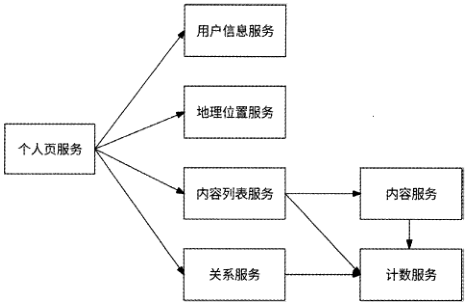

图3-1

我们可以看到，在微服务架构中，一个微服务正常工作依赖它与其他微服务之间的多级网络调用，这是微服务架构与单体服务架构最典型的区别。

但网络是脆弱的，RPC请求有较大的概率会遇到超时、抖动、断开连接等各种异常情况，这些都会直接影响微服务的可用性。比如个人页服务在调用用户信息服务时发生网络超时，由于无法获取到用户基础信息，所以会使得个人页服务无法正常对外提供服务。

当微服务A是微服务B的调用方时，我们称B是A的下游服务，而A是B的上游服务。比如图3・1中的内容列表服务是个人页服务的下游服务，内容列表服务、内容服务、关系服务是计数服务的上游服务。一个微服务的上游服务和下游服务都会影响它的服务质量。以内容列表服务为例，如果个人页服务（上游服务）向内容列表服务发起大量网络调用，内容列表服务可能会因为承受超过此时处理能力的请求量而被打垮；如果内容服务（下游服务）的服务质量不佳，内容列表服务总是无法获取到用户内容数据，那么服务的可用性也会随之下降。

在微服务架构中，为了解决上述种种影响服务可用性的问题，笔者认为可以从如下两个方面来考虑。

- 容错性设计。要接受网络脆弱与下游服务质量不可靠的事实，并在进行服务设计时充分考虑相应故障产生时的容错方案。

- 流量控制。既要对上游服务调用采取预防性策略，防止打垮我们的服务；也要对下游服务有感知与保护意识，当感知到下游服务的质量下滑甚至服务不可用时，及时通过自身保护下游服务。

接下来依次介绍服务可用性治理的5种通用方案：重试、熔断、隔离、限流、降级。重试与降级是容错性设计的具体表现形式，熔断、隔离与限流则是流量控制的常见实现方式。

[原 PDF 第 143 页](../%E4%BA%BF%E7%BA%A7%E6%B5%81%E9%87%8F%E7%B3%BB%E7%BB%9F%E6%9E%B6%E6%9E%84%E8%AE%BE%E8%AE%A1%E4%B8%8E%E5%AE%9E%E6%88%98%20%28--%29%20%28manongshu.com%29.pdf#page=143)

## 3.2 重试

对于服务间RPC请求遇到网络抖动的情况，最简单的解决办法就是重试。重试可以提高RPC请求的最终成功率，增强服务应对网络抖动情况时的可用性。

### 3.2.1 幂等接口

当执行RPC请求调用下游服务接口遇到网络超时的情况时，我们并不知道RPC请求是否已经被下游服务成功处理，因为超时可能出现在请求处理的多个阶段。例如：

- RPC请求发送超时，此时下游服务并未收到RPC请求。

- RPC请求处理超时，下游服务已经收到RPC请求，但是处理时间过长。

- RPC响应报文超时，下游服务已经处理完RPC请求，但是响应报文超时未回复。

我们的服务无法准确判断RPC请求是否被下游服务成功处理，所以只能假定最坏的情况：下游服务已经成功处理请求，但是我们的服务没有收到响应信息。此时，如果我们的服务要进行重试，那么下游服务必须保证再次处理同一请求的结果与用户预期相符。

怎样才算与用户预期相符呢？举一个电商产品下单服务的例子。用户选择购买价格为100元的产品时，下单服务会调用用户账户服务的扣款接口，从用户的余额中扣除100元。假如用户账户服务已经成功从用户的余额中扣除100元,但是对下单服务请求的响应超时，这时下单服务将重试调用扣款接口。如果用户的余额再次被扣除100元，即用户实际支付200元才下单了这个价格为100元的产品，那么这就不是与用户预期相符的情况。理论上，无论重试调用扣款接口多少次，用户的余额最终仅应该被扣除100元。

可以被重试调用的接口应该满足藉等性。赛等是一个数学与计算学的概念。如果一个函数r使用相同的参数重复执行并可获得相同的结果，即满足公式则函数/是暴等函数。在编程世界里，籍等指的是对于某系统接口，无论同一请求被重复执行多少次，都应该与执行一次的结果相同。满足蒂等性的接口被称为“幕等接口”，只有幕等接口可以被安全地重试调用。

所有读性质的RPC接口（即读接口）天然都是赛等接口，因为无论读接口执行多少次都不会改变数据；而写性质的RPC接口（即写接口）会改变数据，所以需要查看多次改变数据的结果是否与一次改变数据的结果相同。以在数据库中执行各种写操作的SQL语句为例：

- 在覆盖操作时，UPDATE tablet SET coll=X WHERE col2=Y,无论成功执行多少次，coll列的值都是X,因此它是蒂等的写操作；

- 在更新操作时，UPDATE table 1 SET coll=coll+l WHERE col2=Y,每执行一次都

[原 PDF 第 144 页](../%E4%BA%BF%E7%BA%A7%E6%B5%81%E9%87%8F%E7%B3%BB%E7%BB%9F%E6%9E%B6%E6%9E%84%E8%AE%BE%E8%AE%A1%E4%B8%8E%E5%AE%9E%E6%88%98%20%28--%29%20%28manongshu.com%29.pdf#page=144)

会使coll列的值发生变化，因此它不是籍等的写操作；

- 在插入操作时，INSERT INTO tablet (col l,col2) VALUES(X,Y),执行多次会插入多条重复数据，因此它也不是赛等的写操作。

涉及非暴等写操作的接口可以通过蓦等性被设计成幕等接口。如果某接口涉及数据库插入操作，则可以先对数据库的相关数据表设置唯一键。重复调用此接口时，数据库会报出“键重复”错误，表示此数据已经被插入；此时，若接口返回成功，此接口就可以成为蓦等接口。如果某接口涉及数据库更新操作，则可以借鉴CAS( Compare And Swap，比较与替换)的思想，为行数据引入数据版本号，重写SQL语句如下：

```text
    UPDATE tablel SET coll=coll+l WHERE version=X AND col2=Y
```

重复调用此接口时，由于version字段的值已经发生变化，因此最终的SQL语句未命中数据行，即它并未真正执行，接口满足矗等性。

以上保证幕等性的方案要求写操作必须是数据库操作，通用性较差。更直接的做法是采用判断请求是否已处理的思路：对于每个请求，使用分布式唯一 ID (见第4章)作为UUID,同时在接口侧保存已处理的请求记录；在请求调用接口时，由接口侧根据请求的唯一标识查询已处理的请求记录；如果找到相应的记录，则说明它处理过此请求，直接返回成功即可。其具体实现方式如下。

1. Redis分布式锁

接口使用Redis的SET命令保存已处理请求的UUID,并结合NX参数保证：当且仅当键不存在时才成功写入，否则不写入。

(1 )接口接收请求后，先尝试在Redis中执行SET UUID NX命令写入请求的UUID。

(2) 如果Redis写入成功，则说明此请求未被接口处理过，接口可以真正处理此请求。

(3) 如果Redis写入失败，则说明Redis中已写入过此UUID,即此请求已被接口处理过，于是接口拦截此请求并直接返回成功。

如果接口使用Redis永久保存已处理的请求，那么随着时间的推移，Redis存储空间很快会被占满。更好的做法是使用SET命令并结合EX参数，为每个键设置一定长度的过期时间，比如3600s：

SET UUID EX 3600 NX

设置过期时间可以有效控制Redis存储空间的占用，过期时间越短，越可以节约Redis存储空间。但是当键过期后，也就无法再拦截重复的请求了，因此过期时间也不能太短。过期时间代表了接口对同一个请求保证赛等性的有效期，如上例中接口保证在lh内对同一个请求处理的蓦等性。Redis分布式锁方案的流程如图3.2所示。

[原 PDF 第 145 页](../%E4%BA%BF%E7%BA%A7%E6%B5%81%E9%87%8F%E7%B3%BB%E7%BB%9F%E6%9E%B6%E6%9E%84%E8%AE%BE%E8%AE%A1%E4%B8%8E%E5%AE%9E%E6%88%98%20%28--%29%20%28manongshu.com%29.pdf#page=145)

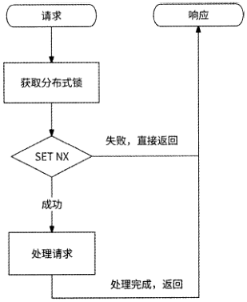

图3-2

2.数据库防重表

利用数据库唯一索引的唯一性特点，可以专门创建一个表来保存接口处理过的请求记录，并以请求的UUID作为表的唯一索引。这个表被称为“防重表”。接口在处理请求前,先将请求插入防重表中一如果发生索引冲突，则说明此请求在防重表中已经存在，于是请求被拦截，接口直接返回。数据库防重表交互的流程如图3・3所示。

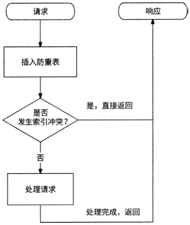

以用户账户服务的扣款接口为例，数据库除了维护用户账户表，还会维护一个交易流水表，并以用户ID与订单ID作为联合唯一索引。当扣款请求到达用户账户服务时，先将

[原 PDF 第 146 页](../%E4%BA%BF%E7%BA%A7%E6%B5%81%E9%87%8F%E7%B3%BB%E7%BB%9F%E6%9E%B6%E6%9E%84%E8%AE%BE%E8%AE%A1%E4%B8%8E%E5%AE%9E%E6%88%98%20%28--%29%20%28manongshu.com%29.pdf#page=146)

扣款请求插入交易流水表，插入成功后再执行真正的扣款操作。如果重复处理扣款请求，则会在插入交易流水表时发生索引冲突，不再执行扣款操作，这样就保证了扣款接口的幕等性。

3. token

token （令牌）方案也是一种通用的实现接口蓦等性的方案，它要求在正式向某服务调用接口前，先从此服务中获取一个token,然后携带token调用所需的接口。

（1 ）上游服务先向目标服务申请获取tokeno

（2 ）目标服务生成分布式唯一 ID作为token,先保存到Redis （也可以是其他存储系统）中，然后返回给上游服务。

（3） 上游服务收到响应信息后，携带token真正调用目标服务的接口。

（4） 目标服务通过在Redis中删除token的方式，来检查请求携带的token是否有效。如果删除token成功，则说明Redis中存储了此token,申请token的接口请求是首次访问，于是处理请求；如果删除token失败，则说明Redis中从未存储过此token或者token已经被删除，申请token的接口请求可能是重试访问，于是直接返回响应信息。

需要注意的是，获取token仅执行一次，而真正调用接口可以重试。token方案的整体流程如图3-4所示。

| Redis "j

```text
                      碗务］    「―蝠
```

|

阶段1:获取token

```text
                                                生成比ken并存储    :
```

返回token

阶段2：携带tok研1调用接口

尝试删除S屐n

七勰除比脂R成功，处理请求

［后再返回

返回请求执行结果

超时重试上

携带token,!试调用接口

尝试删除皿知

》删除token失败，直接返回

返回请求执行结果

图3-4

[原 PDF 第 147 页](../%E4%BA%BF%E7%BA%A7%E6%B5%81%E9%87%8F%E7%B3%BB%E7%BB%9F%E6%9E%B6%E6%9E%84%E8%AE%BE%E8%AE%A1%E4%B8%8E%E5%AE%9E%E6%88%98%20%28--%29%20%28manongshu.com%29.pdf#page=147)

### 3.2.2 重试时机

在明确了什么样的RPC接口请求可以被重试后，我们再来讨论一下重试时机。重试时机包括两个维度：RPC接口调用遇到什么错误时重试请求，以及何时重试请求。

RPC接口调用遇到的错误可以分为如下几类。

- 业务逻辑错误，即下游服务认为请求不符合业务逻辑而返回的错误。比如下游服务在处理扣款请求时发现用户余额不足，或者某请求包含非法参数，这些都属于

业务逻辑错误。

- 服务质量异常错误，即反映下游服务稳定性的相关错误。比如下游服务对请求限流（见3.4节）、下游服务拒绝提供服务，或者由于调用下游服务失败率过高请求被熔断（见3.3节），这些都属于服务质量异常错误。

- 网络错误，如请求超时、数据丢包、网络抖动、连接断开等。

重试的退避策略（backoff）决定何时重试请求。

- 无退避策略：请求失败后立即重试。

- 线性退避策略：每次请求失败后都等待固定的时间重试。

- 随机退避策略：在一个时间范围内随机选取一个时间等待重试。

- 指数退避策略：对一个请求连续重试时，每次等待的时长都是上一次的2倍。

- 综合退避策略：可以是指数退避策略与随机退避策略结合的形式，各开源消息中

间件在应对消息消费失败时常使用此策略。

当RPC接口调用遇到业务逻辑错误时不应该重试请求，因为此请求涉及的业务逻辑有异常，无论重试多少次都是一样的结果；当RPC接口调用遇到服务质量异常错误时，由于服务质量处于异常状态是有一定的持续时间的，使用无退避策略（立即重试请求）会大概率继续请求失败，所以此时适合使用各种有退避的策略，比如指数退避策略，这样可以在一定程度上给足下游服务质量恢复的时间；当RPC接口调用遇到网络错误时，因为网络错误具有随机性，重试请求再次失败的概率很小，所以可以在下游服务未熔断的前提

下立即重试请求。

### 3.2.3 重试风险与重试风暴

重试虽然可以提高服务质量，但是也会给下游服务带来服务质量风险。假设在用户请求量较大的晚高峰时间，由于下游服务容量不足导致服务负载升高，质量下降，上游服务的请求调用就会出现网络超时或网络断开的情况。这时，如果上游服务决定重试请求，那么就会导致下游服务的负载继续升高，服务质量继续下降，最终拖垮整个服务。重试带来的请求量放大会使下游服务的负载压力雪上加霜，每个请求的重试次数越多，下游服务的

[原 PDF 第 148 页](../%E4%BA%BF%E7%BA%A7%E6%B5%81%E9%87%8F%E7%B3%BB%E7%BB%9F%E6%9E%B6%E6%9E%84%E8%AE%BE%E8%AE%A1%E4%B8%8E%E5%AE%9E%E6%88%98%20%28--%29%20%28manongshu.com%29.pdf#page=148)

负载压力就越大。

如果上游服务未限制每个请求的重试次数（无限重试），则等同于请求量被无限放大,

对下游服务的影响也会无限大。因此，上游服务应该为每个请求都设置最大重试次数。在大部分互联网公司的生产环境中，一般请求失败后最多重试3次，即额外重试2次。

即使对请求设置了最大重试次数，也可能会产生重试风暴现象。如图3.5所示，假设将每个服务对下游服务的请求最大重试次数均设置为3。如果数据库出现了负载过高的情况，Server-3服务对数据库的请求最多重试3次，而Server-3服务的上游服务Server-2由于得不到响应，对Server-3的请求重试3次，Server-1服务对Server-2服务的请求也重试3次，那么这时候离奇的现象就产生了：原本是来自Server-1服务的1次业务请求，由于层层重试变成了对数据库的27次请求！数据库本来就负载过高，这样的级联重试让数据库更加难以应对。这种现象就被称为“重试风暴”。

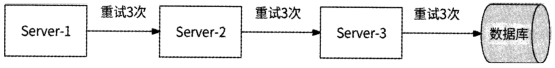

这里只举例说明了具有3个微服务的简单架构遇到的重试风暴，而在真实的互联网微服务架构环境中，一个请求经过数十个微服务是很常见的，此时如果某个环节出现故障，那么重试风暴造成的请求量放大更加可怕。

### 3.2.4 重试控制：不重试的请求

重试需要谨慎进行，否则它会成为洪水猛兽。重试是为了提高服务质量，如果某请求的重试不会保障服务质量，那么就一定不要重试。这里总结了一些不应该重试请求的场景。

1. 非关键下游服务

如果某个下游服务不是我们的服务的关键下游服务，那么我们应该坦然接受请求失败，而不执意重试。是否是关键的下游服务需要结合业务场景来综合判断，比如在查看某用户个人页时，我们更在意的是用户昵称、头像、发布的内容，而用户ip地址的归属地仅仅是一个锦上添花的信息，那么个人页服务在调用地理位置服务遇到失败时可以果断地不再重试请求，而将地理位置服务的容量大方地留给那些认为它更重要的上游服务。

2. 上游服务的重试请求不再重试

为了有效防止重试风暴，我们可以在收到上游服务的某请求后，检查这个请求是否是上游服务的重试请求，如果是，则在调用下游服务遇到失败时不再重试请求，防止请求量

[原 PDF 第 149 页](../%E4%BA%BF%E7%BA%A7%E6%B5%81%E9%87%8F%E7%B3%BB%E7%BB%9F%E6%9E%B6%E6%9E%84%E8%AE%BE%E8%AE%A1%E4%B8%8E%E5%AE%9E%E6%88%98%20%28--%29%20%28manongshu.com%29.pdf#page=149)

被级联放大。比如3.2.3节的例子，如果Server-1服务向Server-2服务发送了重试请求，而Server-2在此链路上调用Server-3服务时遇到错误，那么Server-2最好不执行重试请求。这种策略要求重试请求在请求头中携带一个标记，以便下游服务可以识别该请求是否为重

试请求。

3.服务质量异常错误

3.2.2节中提到，如果我们的服务遇到来自下游服务的限流错误，或者服务内部的熔断器已经将下游服务熔断，则说明下游服务的负载过高。为了不成为压垮下游服务的“最后

一根稻草”，我们的服务也不重试请求。

### 3.2.5 重试控制：重试请求比

通过设置最大重试次数可以有效控制单个请求的重试放大倍数，但是如果有较多的请求被重试，那么下游服务依然会收到大量的重试请求，服务负载也依然会有进一步升高的风险，所以我们应该对上游服务的整体重试量级进行相应的控制。Google SRE建议每个上游服务都要控制正常请求总数与重试请求总数的比例(重试请求比)。如果在一段时间内重试请求总数低于正常请求总数的10% (即重试请求比低于10%),那么只有当某请求失败时才允许被重试。从具体的实现角度来说，可以使用如图3・6所示的滑动窗口方式。

桶：15内正常请求总数与重试请求总数的统计

```text
           广人^    s------ --------- --------------"
            SC    SC    SC    SC    SC    SC    SC    SC    SC    SC    SC    SC    SC    SC
            RC    RC    RC    RC    RC    RC    RC    RC    RC    RC    RC    RC    RC    RC
```

10s的时间窗口

图3-6

上游服务实时统计Is内的正常请求总数(SC)与重试请求总数(RC)并将其作为一个桶。假设重试控制策略是最近10s内重试请求比低于10%时才重试请求，那么在某请求被尝试重试前，取最近10s的10个桶并根据重试请求总数与正常请求总数来计算重试请求比。如果sum(RC)/sum(SC)<0.1,则可以重试请求。通过这样的重试请求比来控制重试，可以使重试请求达到最大请求量被放大1.1倍的效果。

## 3.3 熔断与隔离

熔断和隔离都是上游服务可以采取的流量控制策略，其中熔断可以有效防止我们的服务被下游服务拖垮，同时可以在一定程度上保护下游服务；而隔离可以防止一个服务内各

[原 PDF 第 150 页](../%E4%BA%BF%E7%BA%A7%E6%B5%81%E9%87%8F%E7%B3%BB%E7%BB%9F%E6%9E%B6%E6%9E%84%E8%AE%BE%E8%AE%A1%E4%B8%8E%E5%AE%9E%E6%88%98%20%28--%29%20%28manongshu.com%29.pdf#page=150)

个接口之间因质量问题而相互影响O

### 3.3.1 服务雪崩

由于网络原因或服务自身设计问题，每个微服务一般都难以保证100%对外可用。如果某服务出现了质量问题，那么与其相关的上游服务网络调用就容易出现线程阻塞的情况；如果有大量的线程发生阻塞，则会导致上游服务承受较大的负载压力而发生宕机故障。在微服务架构中，由于在服务间建立了依赖关系，所以一个服务的故障会不断向上传播，最终导致整个服务链路发生宕机故障。这就是服务雪崩现象。

假设有3个服务形成如图3-7所示的依赖关系，最上游的Server-1服务直接负责与用户请求交互。

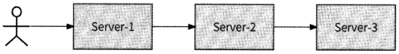

图3-7

如图3-8所示,某一天,Server-3服务因请求量暴增或设计不合理而宕机。由于Server-2是其上游服务，所以Server-2服务还会有源源不断的请求继续调用Server-3服务。

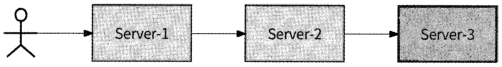

图3-8

如图3-9所示，随着Server-2服务内大量的请求调用线程被阻塞在对Server-3服务的调用上，Server-2服务最终也由于大量的线程发生阻塞而宕机，即Server-3服务硬生生地把Server-2服务拖垮了。

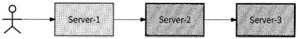

图3-9

以此类推，Server-1服务也被Server-2服务拖垮了，整个服务链路将不可用，如图3-10所示。作为Server-1服务的直接访问者，用户感知到服务宕机，开始对产品频繁吐槽。

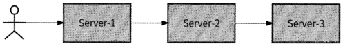

图 3-10

对于“熔断”，大家应该都不陌生，它并不是一个计算机术语，它在股市、电力、交

[原 PDF 第 151 页](../%E4%BA%BF%E7%BA%A7%E6%B5%81%E9%87%8F%E7%B3%BB%E7%BB%9F%E6%9E%B6%E6%9E%84%E8%AE%BE%E8%AE%A1%E4%B8%8E%E5%AE%9E%E6%88%98%20%28--%29%20%28manongshu.com%29.pdf#page=151)

通等领域都频繁出现。服务熔断与这些熔断场景的道理相同，出发点都是为了及时控制风险。在电力领域，熔断器是一种特殊的电流保护器，当电流超过某个阈值时它主动通过产生热能使熔体熔断、电路断开，这可以有效防止电气设备因短路、过电而损坏。与此对应的是，服务雪崩场景也可以通过服务熔断的方式阻断对下游服务的调用，使我们的服务不

被发生故障的下游服务拖垮。接下来介绍通过Hystrix组件实现的一个经典的熔断器。

### 3.3.2 Hystrix熔断器

Hystrix熔断器将下游服务分为3种熔断状态。

- 熔断关闭（Closed ）状态：默认状态，此时下游服务正常，服务调用方可以正常进行请求调用。

- 熔断开启（Open ）状态：如果服务调用方在最近一段时间内对某下游服务的请求调用失败率达到某个阈值，则认为它不可用，为此下游服务设置熔断开启状态，

并且不再对此下游服务进行请求调用。

- 熔断半开（Half-Open）状态：如果某下游服务的熔断已经开启了一段时间，则会自动进入熔断半开状态。此时服务调用方会允许一个请求尝试调用下游服务，以检测下游服务是否已经恢复，然后根据检测结果将熔断状态设置为关闭或开启。

3种熔断状态的转化关系如图3-11所示。

```text
              请求调用成功    拒绝请求调用
```

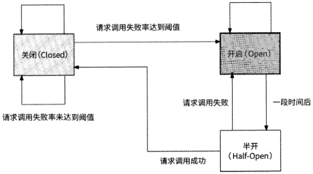

图 3-11

在熔断状态转化条件中，有一些地方需要人为预设阈值，在Hystrix熔断器的实现中有一些关键变量，如表3-1所示。

[原 PDF 第 152 页](../%E4%BA%BF%E7%BA%A7%E6%B5%81%E9%87%8F%E7%B3%BB%E7%BB%9F%E6%9E%B6%E6%9E%84%E8%AE%BE%E8%AE%A1%E4%B8%8E%E5%AE%9E%E6%88%98%20%28--%29%20%28manongshu.com%29.pdf#page=152)

表3・1

含 义

变量名

统计时间窗口。开启熔断（Closed状态转化为Open状态）需要统计最近多少秒内的请求timelnMilliseconds

失败率。Hystrix默认值为10s

请求总数阈值。在统计时间窗口内请求总数必须达到一定的量级，Hystrix才会将请求失败

率作为统计失败率的依据，这样可以防止统计样本太小导致的数据统计值不具代表性的问requestVolumeThreshold

题。Hystrix默认值为20。这意味着，如果在统计时间窗口内请求总数不足20,那么即使

请求调用都失败了，Hystrix也不会开启熔断

休眠时间窗口。熔断器处于Open状态后，会经过一段时间自动进入Half-Open状态，这段sleep WindowInMilliseconds

时间就是休眠时间窗口

请求失败率阈值。如果在统计时间窗口内请求失败率达到此阈值，则会开启熔断。HystrixerrorThresholdPercentage

默认值为50,即请求失败率达到50%才开启熔断

接下来详细介绍熔断器的工作流程。在服务调用方准备请求调用某下游服务前，熔断器会先判断此请求是否被允许调用下游服务（下文简称“请求是否被允许执行”）。

- 如果熔断器处于Closed状态，则请求被允许执行。

- 如果熔断器处于Open状态，则进一步将当前时间戳和处于Open状态时设置的时间戳的差值与 sleepWindowInMilliseconds 的值进行比较，如果 sleepWindowInMilliseconds较大，则说明熔断器依然维持开启状态，请求不被允许执行；而如果差值较大，则说明熔断器处于Open状态已经足够长时间了，实际上熔断器应处于Half-Open状态，于是请求被允许执行，以便试探下游服务是否已经恢复，且熔断器状态转化为 Half-Open。

- 如果熔断器处于Half-Open状态，则请求不被允许执行，因为在熔断器被设置为Half-Open状态前就已经有一个请求被允许执行了。这个逻辑可以保证熔断器在Half-Open状态仅有一个请求被允许执行。

如果请求被允许执行，那么请求调用下游服务后，会将调用结果（成功或失败）上报给Hystrix Metrics统计器。特别的是，如果此请求是来自Half-Open状态的试探请求，则会根据调用结果直接设置最新的熔断器状态。

- 请求调用成功，熔断器状态从Half-Open转化为Closed,即熔断器认为下游服务已经恢复。

- 请求调用失败，熔断器状态从Half-Open转化为Open,即熔断器继续保持开启状

O

Hystrix Metrics统计器会统计每秒请求成功与请求失败的总数，同时对最近时间窗口内的统计数据进行检查。如果熔断器处于Closed状态、此时间窗口内的请求总数不小于requestVolumeThreshold 的值，且请求失败率不低于 errorThresholdPercentage 的值，则熔断器认为下游服务发生故障，于是设置熔断器状态为Open。

[原 PDF 第 153 页](../%E4%BA%BF%E7%BA%A7%E6%B5%81%E9%87%8F%E7%B3%BB%E7%BB%9F%E6%9E%B6%E6%9E%84%E8%AE%BE%E8%AE%A1%E4%B8%8E%E5%AE%9E%E6%88%98%20%28--%29%20%28manongshu.com%29.pdf#page=153)

通过基于时间窗口的请求失败率开启熔断,Hystrix可以做到对下游服务故障的有效感知，而通过在Half-Open状态允许一个请求试探执行的机制，可以使Hystrix具有对下游服务恢复的感知能力。

Hystrix官网已经处于不再维护的状态，Hystrix官方推荐使用新一代熔断器Resilience^作为其替代品。另外，阿里巴巴开源的Sentinel项目也是一个很好的选择。这里之所以介绍Hystrix,是因为它足够经典，其熔断器方案也被业界的替代品纷纷采用，只不过新增了一些优化机制。接下来简单介绍Resilience^和Sentinel相比Hystrix有哪些更好的机制。

### 3.3.3 Resilience4j和Sentinel熔断器

Hystrix熔断器通过时间窗口请求失败率的策略来开启熔断，Resilience^除了采用此策略，还采用了一种称为慢调用比例的策略来开启熔断，即通过统计时间窗口内慢速请求调用在请求总数中的比例来判断是否对下游服务开启熔断。如表3-2所示，Resilience^为此策略提供了两个变量。

表3-2

含 义

变量名

```text
 slowCallDurationThreshold    调用耗时的阈值，高于该阈值的请求调用被视为慢调用
 slowCallRateThreshold    慢调用比例的阈值，当慢调用请求的比例高于该阈值时开启熔断
```

此策略与时间窗口请求失败率策略的计算方式较为相似，只不过前者关注请求调用的耗时，后者关注请求调用的失败率。通过这两种策略的结合，Resilience^可以从下游服务的质量和性能两个角度，综合评判下游服务是否应该开启熔断。相比于Hystrix熔断器，它有更多的视角感知下游服务是否可用。

Sentinel熔断器在这方面的表现更为全面，除实现了时间窗口请求失败率策略和慢调用比例策略外，Sentinel熔断器还支持错误计数策略：如果最近lmin的请求失败数超过阈值，则会开启熔断。此策略使用请求失败数而非请求失败比例判断是否开启熔断，可以有效防止当请求量样本数太大时，需要大量的请求失败才可以达到请求失败率阈值的问题，提高了对下游服务不可用的感知能力。目前介绍的3个开源项目的熔断器策略的对比如表3-3所示。

表3・3

```text
         开源项目    熔断器策略
 Hystrix    时间窗口请求失败率
 Resilience^]    时间窗口请求失败率和慢调用比例
 Sentinel    时间窗口请求失败率、慢调用比例和错误计数
```

[原 PDF 第 154 页](../%E4%BA%BF%E7%BA%A7%E6%B5%81%E9%87%8F%E7%B3%BB%E7%BB%9F%E6%9E%B6%E6%9E%84%E8%AE%BE%E8%AE%A1%E4%B8%8E%E5%AE%9E%E6%88%98%20%28--%29%20%28manongshu.com%29.pdf#page=154)

### 3.3.4 共享资源与舱壁隔离

一般的业务服务都会定义固定大小的线程池来处理对下游服务的请求调用，在下游服务响应慢的情况下，线程池作为服务内共享资源有可能导致服务内各接口的质量相互影响。这里举一个例子，服务A的线程池大小为150,并对外提供3个接口，即II、12、13,这3个接口分别依赖3个下游服务B、C、Do在正常情况下，服务A接收的请求量不超过150个是可以正常对外提供服务的。为了方便反映问题，我们假设服务A已经接收的请求量是150个，且3个接口的请求量都是50个。

如图3・12所示，3个接口分别从线程池中获取50个线程调用下游服务。假设服务B在某时间接口的响应速度变得非常慢，那么正在调用服务B的线程会发生较长时间的阻塞，于是接口 II相比于其他两个接口会更长时间地占用线程。随着时间的推移，线程池中大部分可用线程都被接口 II所持有，接口 12和接口 13所能获取的可用线程都达不到50个，于是这两个接口开始拒绝请求，接口质量下滑，如图3-13所示。

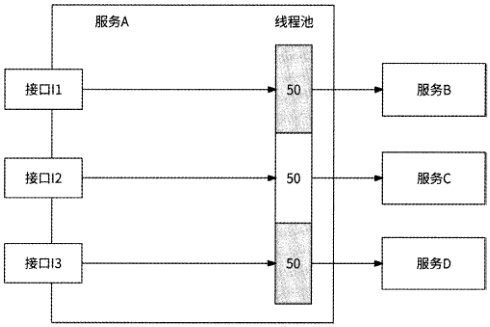

图 3-12

由于线程池是服务内接口间的共享资源，所以一个接口过度占用可用线程，就会对其他接口产生挤压。这不是我们想看到的结果。最理想的情况是，各个接口间应该互不影响，这就要求我们对共享资源进行隔离。

在船舶工业中经常会使用舱壁将船舱分隔成多个隔离的空间，当一个船舱漏水时不会影响到其他船舱。“舱壁”的概念可以被应用在资源隔离问题上，我们需要以某种形式的“舱壁”将共享资源分隔为多个独立资源。Hystrix、Resilience^Sentinel都实现了舱壁隔离。

[原 PDF 第 155 页](../%E4%BA%BF%E7%BA%A7%E6%B5%81%E9%87%8F%E7%B3%BB%E7%BB%9F%E6%9E%B6%E6%9E%84%E8%AE%BE%E8%AE%A1%E4%B8%8E%E5%AE%9E%E6%88%98%20%28--%29%20%28manongshu.com%29.pdf#page=155)

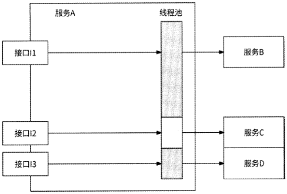

图 3-13

### 3.3.5 舱壁隔离的实现

Hystrix提供了两种舱壁隔离的策略，分别是线程池隔离和信号量隔离。这两种策略都是通过限制对共享资源的并发请求量来实现资源隔离的。

线程池隔离的实现思路很简单，就是为服务调用方的每个下游服务单独创建各自的专

用线程池，每个线程池仅可用于调用同一个下游服务。仍以3.3.4节的服务A为例，Hystrix为服务A的3个下游服务创建了 3个线程池，每个线程池的大小为50,如图3・14所示。

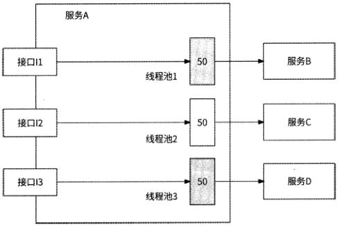

图 3-14

由于服务B的响应时间变长，其对应的线程池被很快用完，之后服务A在处理接口II的请求时，没有可用线程，于是直接拒绝调用服务B,而不从其他线程池中获取可用线程。通过将共享线程池切分为多个独立线程池，即使服务调用方的一个下游服务发生问题,

[原 PDF 第 156 页](../%E4%BA%BF%E7%BA%A7%E6%B5%81%E9%87%8F%E7%B3%BB%E7%BB%9F%E6%9E%B6%E6%9E%84%E8%AE%BE%E8%AE%A1%E4%B8%8E%E5%AE%9E%E6%88%98%20%28--%29%20%28manongshu.com%29.pdf#page=156)

也不会影响到对其他下游服务的调用。

不过，线程池隔离策略要求服务调用方为其所依赖的每个下游服务都建立线程池。如

果其所依赖的下游服务较多，那么对应数量的线程池会带来较大的内存开销，也为服务器

带来更大的线程调度开销和上下文切换开销。Hystrix提供的另一种策略是通过信号量PV操作来控制共享资源并发调用，即信号量隔离策略。

我们先回顾一下信号量PV操作。信号量是一种并发控制机制，其数据结构由一个整数值S和一个指针组成，指针指向被阻塞在信号量的下一个进程。信号量的S值一般与资源使用情况有关。

- 5>0：表示当前可使用的资源数量为S。

- SWO：表示当前无可用资源，但有S个进程被阻塞，正在等待使用该资源。

信号量的值仅可以通过PV操作修改。PV操作由P操作和V操作组成。

- P操作：表示从信号量中获取一个资源。如果SWO,则P操作发生阻塞等待；否贝！J, S值减1,即S=S-1O

- V操作：表示向信号量归还一个资源，S值加1,即S=S+1,并尝试唤醒队列中第一个等待信号量的进程。

信号量的S值决定了并发访问量oHystrix为服务调用方依赖的每个下游服务都创建一个信号量并赋初始值为X,于是实现了对每个下游服务的并发调用控制。服务调用方在试图调用某个下游服务前，先对相关信号量执行P操作，操作成功后才可调用该下游服务，再执行V操作。比如Hystrix在服务A内为下游服务B、C、D分别创建值为50的信号量，保证每个下游服务的并发调用量不超过50个。这样一来，即使服务B的响应时间过长，在服务A内最多也就占用50个并发调用，不会对其他下游服务调用产生影响。

## 3.4 限流

3.2节和3.3节介绍的重试、熔断、资源隔离，都是上游服务为了提高自身服务质量和适当保护下游服务而采用的策略。本节将介绍作为下游服务，为了应对多个上游服务的请求访问，以防被上游服务打垮应做好的预防机制，这个预防机制就是老生常谈的“限流”。

在现实生活中有大量应用限流的场景，比如某些著名景区在劳动节、国庆节等节假日期间往往人满为患，不仅容易破坏景区环境，而且容易发生踩踏事故，游客的体验也非常差，于是景区管理部门就会通过一系列手段对景区限流，如限定每日票量、限制游玩项目同时参与的人数等。在互联网场景中，这样的例子也随处可见，比如“双十一”电商秒杀

[原 PDF 第 157 页](../%E4%BA%BF%E7%BA%A7%E6%B5%81%E9%87%8F%E7%B3%BB%E7%BB%9F%E6%9E%B6%E6%9E%84%E8%AE%BE%E8%AE%A1%E4%B8%8E%E5%AE%9E%E6%88%98%20%28--%29%20%28manongshu.com%29.pdf#page=157)

抢购、火车票抢票等场景，都通过限流策略来防止服务被海量请求打垮。限流的表现形式

主要包括如下几种。

- 频控：控制用户在N秒内只可执行M次操作，比如限制用户在30s内只能下载1次文件、在lh内最多只能发布5条动态。

- 单机限流+固定阈值：某服务的每台服务器在Is内最多可处理"个请求，M值是预先设置好的。

- 全局限流+固定阈值：某服务在Is内总共可处理M个请求，与前者的主要区别在于限流范围是某服务的全部服务实例。

- 单机自适应限流：某服务的每台服务器根据自身服务状况，使用各种自动化算法

动态判断是否限制请求，不再预先设置限流阈值。

接下来介绍各种限流形式及其具体实现方案。

### 3.4.1 频控

我们可以借助Redis实现频控，不过，用户在N秒内只能执行1次操作和最多执行M次操作可以用两种不同的方案来实现。

对于用户在N秒内只能执行1次操作的频控场景，可以使用Redis SET命令结合EX参数实现,并设置N秒作为Key的过期时间。以限制用户在30s内只能下载1次文件为例，判断用户是否可以下载文件的Go语言代码实现如下：

```text
    func canDownload(ctx context.Context, userID int64) bool {
        key := fmt.Sprintf(Hdownload_%dn, userID)
        // 实际执行的备令是 “SET download_{userld} 0 EX 30 NX”
        result := redisClient.SetNX(ctx, key, 0, time.Second*30)
        if result.Err () != nil {
           return false
        }
        //如果Key已经存在，则返回false,否则返回true
        return result.Vai()
     }
```

在用户执行下载文件操作前，调用canDownload函数判断一个用户ID是否可以下载文件。此函数先根据用户ID拼接Redis Key “download.{userID}”表示此用户的下载行为，然后尝试执行Redis命令"SET download,{userid} 0 EX 30 NX"为用户的下载行为设置键值。如果设置失败，则说明Key已经存在且未过期，即在最近30s内此用户已经下载过文件，于是函数返回false；如果设置成功，则说明在最近30s内用户无下载行为，于是函数返回true,表示用户可以执行此次文件下载操作。

[原 PDF 第 158 页](../%E4%BA%BF%E7%BA%A7%E6%B5%81%E9%87%8F%E7%B3%BB%E7%BB%9F%E6%9E%B6%E6%9E%84%E8%AE%BE%E8%AE%A1%E4%B8%8E%E5%AE%9E%E6%88%98%20%28--%29%20%28manongshu.com%29.pdf#page=158)

对于用户在N秒内最多执行M次操作的频控场景，由于涉及具体的操作次数肱，因此只能通过维护用户操作计数并通过INCR命令更新计数来实现。这里包括两个细节：一是如果INCR的结果大于则表示用户操作次数已经达到阈值，应该被频控；二是用户操作计数数据应该在首次设置时被设置过期时间为N秒，首次设置意味着INCR返回值为lo

由于设置过期时间需要先判断INCR返回值，所以这时最多涉及两个Redis命令：INCR和EXPIRE (设置过期时间)。为了确保这两个操作的并发安全性，设置过期时间需要通过Lua脚本来实现。我们以用户在lh内最多只能发布5条动态为例，其Lua脚本实现如下：

```text
    local count = redis.call(* incr1, *publish_{userID}1)
```

if count == 1 then //判断是否为首次设置，如巢是，则需要设置过期时间

redis . call (1 expire 1, *publish_{userID} *, 3600) // 设置过期时间为 lh

end

return count //返回最新计数

而用户是否可以发布动态，需要根据INCR返回值是否大于M来判断。Go语言代码实现如下：

```text
    // limit参数表示频控M值
    func canPublishContent(ctx context.Context, userid int64A limit int64) bool {
        key := fmt.Sprintf(npublish_%d", userid)
        script := "local count = redis.call(1incr*, KEYS[1]); if count == 1 then
```

redis . call (* expire 1, KEYS [1] , ARGV [ 1 ] ) end; return count" // 上面的 Lua 脚本

```text
        result := redisClient.Eval(ctx, script, []string{key}, 10)
        if result.Err() != nil {
           return false
        count := result.Vai().(int64)
        return count < limit
```

在用户发布动态前，调用canPublishContent函数判断其是否被频控。此函数先根据用户ID拼接Redis Key “publish」userID}”表示此用户的动态发布行为，再执行上面所示的Lua脚本并获取INCR返回值(这样可以保证在首次设置计数时顺便设置过期时间)o如果INCR返回值小于频控阈值5,则说明用户在lh内发布动态不足5条，因此允许发布，此函数返回trueo

### 3.4.2 单机限流1：时间窗口

一种简单的限流算法是通过固定时间窗口来实现的，比如限制在1S内请求量不超过100个，可以将时间线切分为以Is为单位的时间窗口，每个时间窗口都维护这Is内允许通过的计数100o如图3-15所示，当请求到来时，先向当前所处的时间窗口申请1个计数，

[原 PDF 第 159 页](../%E4%BA%BF%E7%BA%A7%E6%B5%81%E9%87%8F%E7%B3%BB%E7%BB%9F%E6%9E%B6%E6%9E%84%E8%AE%BE%E8%AE%A1%E4%B8%8E%E5%AE%9E%E6%88%98%20%28--%29%20%28manongshu.com%29.pdf#page=159)

如果该时间窗口内的计数大于0,则计数减1并允许请求通过；否则，请求被限流器丢弃。

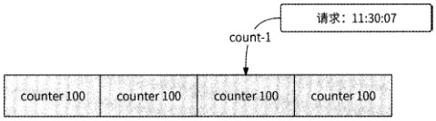

```text
                     11:30:05    11:30:06    11:30:07    11:30:08
```

图 3-15

固定时间窗口最大的缺点是无法防止时间窗口边界附近的流量暴增，可能会有2倍限流阈值的请求通过限流器，不符合限流器的预期。比如在11:30:06的前500ms内没有任何请求进入，在后500ms内有100个请求进入，它们全部被允许通过限流器；而在11:30:07的前500ms内也有100个请求进入，它们也全部被允许通过限流器。这样一来，在11:30:06:500〜11:30:07:500这Is内实际上有200个请求通过了限流器，不符合限制在Is内请求量不可超过100个的设定，因此限流效果比较差。

我们可以使用滑动时间窗口的方式来弥补上述缺点。滑动时间窗口把时间线以更小的时间粒度（如50ms）划分为一个个槽，将限流计数均摊到每个槽，一个时间窗口就是最近时间的20个槽的总和，如图3-16所示。这个时间窗口会随着时间的推移不断向后滑动。当请求到来时，先在当前时间最近的20个槽中查找第一个计数大于0的槽，如果找到了，则说明在这个时间窗口内依然有限流计数可用，将该槽计数减1,请求被允许通过限流器；如果在整个时间窗口内所有的槽计数都为0,则说明已经达到限流阈值，请求将被限流器丢弃。

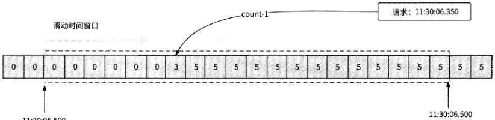

图 3-16

滑动时间窗口限流器可以有效提高限流的准确性，且槽的时间粒度越小，限流的准确性越高。不过，由于需要维护较多的槽信息，判断限流需要在时间窗口内遍历查找可用槽,此实现方式有较大的内存与CPU开销。为了对海量请求进行限流设定，限流器应该有更加轻量级的实现方式。

[原 PDF 第 160 页](../%E4%BA%BF%E7%BA%A7%E6%B5%81%E9%87%8F%E7%B3%BB%E7%BB%9F%E6%9E%B6%E6%9E%84%E8%AE%BE%E8%AE%A1%E4%B8%8E%E5%AE%9E%E6%88%98%20%28--%29%20%28manongshu.com%29.pdf#page=160)

### 3.4.3 单机限流2：漏桶算法

漏桶算法很好理解。如图3-17所示，一个漏桶承接水流，并通过一个出水口匀速出水，当水流过大、漏桶已满时会导致水溢出。水流被视为进入服务器的请求，出水口匀速出水可被视为服务器处理请求的固定速率，当请求过多导致漏桶满了时，将开始拒绝新来的请求。

|请求6

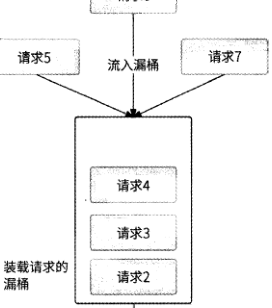

以任意速率进水

漏桶'

匀速出水3

!每隔固定时间

I流出1个请求

I

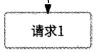

图 3-17

漏桶算法是先进先出概念的体现，可以使用队列实现漏桶。每个新来的请求都先尝试进入漏桶，如果漏桶已满，则拒绝请求；否则，请求在漏桶中排队，服务器按照固定的时间间隔从漏桶中获取第一个请求并对其进行处理。使用漏桶算法，请求可以以任意速率进入服务器，而服务器永远以固定的速率处理排队的请求。

我们以一个完整的例子来描述请求是怎样在漏桶中排队的。假设设置漏桶的限流阈值为每秒处理10个请求(即请求处理速率是lreq/100ms),漏桶的容量为10,此时同时有5个请求流入漏桶中：

(1) 第一个请求进入漏桶，由于此时漏桶为空，所以请求无须排队，可以直接被处理。

(2) 第二个请求进入漏桶，由于第一个请求刚刚被处理，所以此请求需要排队，严格按照请求处理速率的设置，即需要排队lOOmSo

(3 )第三个请求，需要等待第二个请求被处理后再排队100ms,所以排队时间是200mso

[原 PDF 第 161 页](../%E4%BA%BF%E7%BA%A7%E6%B5%81%E9%87%8F%E7%B3%BB%E7%BB%9F%E6%9E%B6%E6%9E%84%E8%AE%BE%E8%AE%A1%E4%B8%8E%E5%AE%9E%E6%88%98%20%28--%29%20%28manongshu.com%29.pdf#page=161)

(4)以此类推，第四个请求排队300ms,第五个请求排队400ms,如图3・18所示。

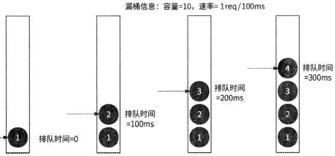


排队时间

```text
                                                                         =400ms
```

图 3-18

漏桶算法可以保证无论有多少个请求涌入服务器，它们都将按照固定的速率被处理，有效保障了服务的稳定性。不过，漏桶算法的缺点也非常明显，为了按照固定的速率处理请求，漏桶算法强行要求请求排队等待，从上游服务的视角来看，请求的响应时间会有一定程度的增加。另外，漏桶算法应对流量不够灵活，不支持突增流量，这些突增流量对服务来说可能完全没有处理压力，但请求却在缓慢排队，其实这是对服务性能的浪费。

### 3.4.4 单机限流3：令牌桶算法

令牌桶算法是一种高效且易于实现的限流算法，并消除了漏桶算法的缺点。令牌桶算法的原理是系统会以一个恒定的速率向令牌桶中放入令牌，如图3-19所示。在处理请求前，需要先从令牌桶中获取一个令牌，如果桶中没有令牌可取，则拒绝请求。

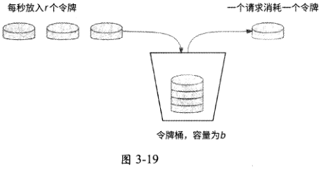

令牌桶算法的基本工作流程如下。

(1) 每秒向令牌桶中放入尸个令牌，即每1/尸秒新增一个令牌。

(2) 令牌桶容量为们即最多存放力个令牌，桶满时新放入的令牌会被丢弃。

(3) 当一个请求到来时，从令牌桶中获取一个令牌。如果桶中有令牌，则令牌总数减

[原 PDF 第 162 页](../%E4%BA%BF%E7%BA%A7%E6%B5%81%E9%87%8F%E7%B3%BB%E7%BB%9F%E6%9E%B6%E6%9E%84%E8%AE%BE%E8%AE%A1%E4%B8%8E%E5%AE%9E%E6%88%98%20%28--%29%20%28manongshu.com%29.pdf#page=162)

1,请求被允许执行。

（4）如果桶中没有可用令牌，则该请求被限流。

令牌桶算法可以容忍一定程度的突增流量，这个特性体现在两个方面。首先，令牌桶的容量力保证此算法允许在Is内最多有力个并发请求访问服务；其次，令牌在不断生成,并且只有请求访问服务时才扣减令牌的形式，对请求波动的限流更加灵活。如果我们预期的限流阈值是Is处理100个请求，那么令牌桶算法每秒会向桶中放入100个令牌。假设第1秒只有80个请求访问服务，还剩下20个令牌，那么第2秒可以允许120个请求通过限流器。

从长期运行结果的表现来看，令牌桶算法依然是将Is内请求并发数限制为尸，只不过它允许一定程度的流量突增。由于令牌桶算法既能支持高并发场景，又能平滑控制流量，所以大部分业务场景会采用此限流算法。

令牌桶算法的Go语言代码实现如下：

type TokenBucket struct （

```text
        latestTokenTime time.Time    //上次放入令牌的时间
                                      //可用令牌数量
        availableToken    int64
                                      //令牌桶容量
        capacity    int64
                                      //放入一个令牌需要的时间周期
        interval    time.Duration
                                      //并发控制
        lock    sync.Mutex
    //创建令牌桶，capacity表示容量，rate表示Is放入的令牌数量
    func NewTokenBucket(capacity int64, rate int64) *TokenBucket {
        //计算放入一个令牌需要的时间周期
        interval := time.Second / time.Duration(rate)
        return &TokenBucket{
```

latestTokenTime: time.Now(),

availableToken: capacity,

```text
           capacity:    capacity,
           interval:    interval,
        }
    }
    //调整令牌数量，模拟匀速放入令牌的操作
    func (tb *TokenBucket) adjust() (
        //令牌桶已满，不放入令牌
        if tb.availableToken == tb.capacity (
```

return

「七"

```text
       now := time.Now()
        //距上次放入令牌经过的时间周期，也就是需要放入的令牌数量
       newTokenCount := int64(now.Sub(tb.latestTokenTime) / tb.interval)
        if newTokenCount == 0 (
```

[原 PDF 第 163 页](../%E4%BA%BF%E7%BA%A7%E6%B5%81%E9%87%8F%E7%B3%BB%E7%BB%9F%E6%9E%B6%E6%9E%84%E8%AE%BE%E8%AE%A1%E4%B8%8E%E5%AE%9E%E6%88%98%20%28--%29%20%28manongshu.com%29.pdf#page=163)

return

```text
   }
   //放入令牌，并处理令牌桶溢出情况
   tb.availableToken += newTokenCount
   if tb.availableToken > tb.capacity {
       tb.availableToken = tb.capacity
    }
   //更新放入令牌的时间
   tb.latestTokenTime = now
}
//获取令牌
func (tb *TokenBucket) Take() bool {
```

tb.lock.Lock()

defer tb.lock.Unlock()

tb.adjust () 〃调整令牌桶中最新的令牌数量

```text
   //若有可用令牌，则允许请求通过
   if tb.availableToken > 0 {
       tb.availableToken -= 1
       return true
    }
   return false
```

### 3.4.5 全局限流

与单机限流不同，全局限流旨在对一个服务的所有实例统一限流，所有服务实例共用一个限流配额，这个限流配额一般由专门的限流服务器下发。当一个服务的任意一个实例收到请求时，服务实例的限流模块会先访问限流服务器，查询此请求是否被允许通过，而

限流服务器根据自身规则决定是否触发对此请求的限流，如图3・20所示。

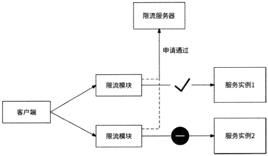

图 3-20

[原 PDF 第 164 页](../%E4%BA%BF%E7%BA%A7%E6%B5%81%E9%87%8F%E7%B3%BB%E7%BB%9F%E6%9E%B6%E6%9E%84%E8%AE%BE%E8%AE%A1%E4%B8%8E%E5%AE%9E%E6%88%98%20%28--%29%20%28manongshu.com%29.pdf#page=164)

限流服务器可以使用Redis实现，实现细节与3.4.1节的“在N秒内最多执行M次操作的频控场景”的频控方案一样，即使用Redis INCR命令，这里不再赘述。全局限流的特点是，由统一的限流服务器对各服务实例统一限流，服务实例数量不会影响限流阈值，但是限流服务器的引入为请求的执行增加了一次额外网络调用，且在请求量较大的情况下，限流服务器单点很容易成为影响业务服务的瓶颈。所以，这种全局限流方案不是很适合请求量巨大的服务。

不过，如果对限流阈值的精确性和实时性的要求适当放宽，那么我们可以换一种交互方式：服务的各个实例周期性地将一段时间的流量统计上报到限流服务器，限流服务器根据各服务实例的流量情况重新计算最新限流配额，然后下发到各个服务实例，每个服务实例都根据收到的限流配额本地决定请求是否允许被处理。接下来具体介绍一种可行的技术实现：时间片统计。

(1) 将时间划分为连续的时间片，每个服务实例都记录每个时间片内的请求总数、请求调用延迟时间，并在每个时间片结束时将统计日志发送到消息队列。

(2) 创建一个日志收集器服务，作为消息队列的消费者。当一个时间片下的所有服务实例的统计日志都已到达日志收集器后，汇总计算此时间片的实际QPS： QPS%^请求数/时间片长度。

(3 )日志收集器将汇总统计数据上报给限流服务器。

(4 )限流服务器计算最新的限流比例dropRate,计算公式如下所示。如果一个时间片的实际 QPS=1200,限流阈值=1000,则 dropRate=0.167o

dropRate =(实际QPS —限流阈值)：实际QPS

(5) 限流服务器下发最新的限流比例到各个服务实例。

(6) 服务实例根据限流比例限流：每个请求有16.7%的概率被丢弃。

需要注意的是，时间片长度不宜过长，否则限流调整实时性过差；时间片长度也没必要太短，否则会影响服务性能，一般10s、30s都是比较合适的时间片选择。此方案架构如图3-21所示。

使用Redis频控方案进行全局限流，限流效果精准、时效性强，但是由于Redis会成为业务服务的额外单点，反而影响了业务服务的稳定性，所以此方案只适合请求量不大的服务。而使用时间片统计方案，注定不会有精准的限流阈值控制，时效性也没有绝对保障，所以它更适合请求量大的服务，对请求进行粗略筛选。

实际上，并不是所有的业务场景都需要进行全局限流。如果限流的目的是保护服务不被大量请求击垮，那么进行单机限流即可，没有必要上升到全局限流；而如果限流的目的

[原 PDF 第 165 页](../%E4%BA%BF%E7%BA%A7%E6%B5%81%E9%87%8F%E7%B3%BB%E7%BB%9F%E6%9E%B6%E6%9E%84%E8%AE%BE%E8%AE%A1%E4%B8%8E%E5%AE%9E%E6%88%98%20%28--%29%20%28manongshu.com%29.pdf#page=165)

是对某个共享资源的全局访问控制，则可以进行全局限流，比如秒杀场景可以参考使用商

品的总库存作为限流阈值，对用户抢购请求进行全局限流。

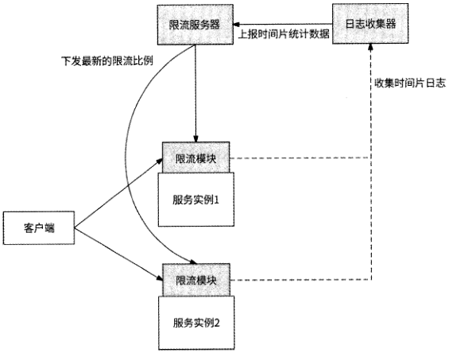

## 3.5 自适应限流

无论是时间窗口、漏桶算法、令牌桶算法，还是全局限流方案，限流阈值都是人为设置的，这就意味着这些限流策略的实际效果很被动，依赖限流阈值的设置是否足够合理。为了设置合理的限流阈值，在一个服务正式上线前，我们一般会事先对它进行一段时间的全链路压测，再根据压测期间服务节点的各项性能指标，选择服务负载接近临界值前的

QPS作为限流阈值。基于服务的压测数据得出的限流阈值看似是合理的，但是服务的性能会随着服务的不断迭代而变化，例如：

- 某服务的单个实例可承受的最大QPS为100,研发工程师不满意此服务的性能表现，于是对服务进行了系统性重构，性能得到大幅提升，单个实例可承受的最大

QPS 变为 300；

- 某服务原本是一个轻量级服务，单个实例可承受的最大QPS为500。但是在某次产品需求变更中，为此服务增加了对多个下游服务的调用，于是服务性能下降到单个实例可承受的最大QPS为100o

可以看到，服务的每次迭代都有可能影响服务的性能，性能可能提升，也可能劣化。

[原 PDF 第 166 页](../%E4%BA%BF%E7%BA%A7%E6%B5%81%E9%87%8F%E7%B3%BB%E7%BB%9F%E6%9E%B6%E6%9E%84%E8%AE%BE%E8%AE%A1%E4%B8%8E%E5%AE%9E%E6%88%98%20%28--%29%20%28manongshu.com%29.pdf#page=166)

如果服务的性能提升了，则原限流阈值会限制服务发挥性能，浪费服务资源；如果服务的性能劣化了，则原限流阈值无法有效保护服务不被打垮。理论上，服务每涉及变更时都应该更新其限流阈值，这也就意味着服务每次迭代后都需要执行全链路压测。但是，实际上这么做需要较多的准备工作和较高的人力成本，而且难以保证可持续执行。

最了解自己的人还是自己。实际上，服务实例可以根据自身的负载情况自动判断是否可以继续处理请求，我们不再基于人工观测和个人经验设置限流阈值，而是把限流这件事交给服务自己来做，这就是自适应限流。无论服务怎样迭代，无论网络状况和下游服务状况怎样，自适应限流都可以使服务根据自身当下的负载情况对新来的请求做合理取舍。

### 3.5.1 服务与等待队列

在正式介绍自适应限流算法前，我们需要先了解一下等待队列的概念。每个服务都有一定的并发度(concurrency),对于一定范围内的并发请求，服务能立即处理这些请求，而当到达服务的请求量级大于服务并发度时，请求就会排队等待。Netflix技术团队形象地用一个等待队列(queue)来表述服务与请求之间的关系，无法立即被处理的请求在这个等待队列中排队，如图3・22所示。

并发度

f

_(

Y

队列

图 3-22

如图3-23所示，如果不对等待队列加以限制，那么随着越来越多的请求在等待队列中排队，请求延迟逐渐增加，直到所有请求都超时未响应，服务最终也会因为内存耗尽而崩溃。当服务有逐渐崩溃的趋向时，我们认为服务“过载”。

限流不是新鲜事，但是如何在并发请求量和请求延迟不断动态变化的服务中找到最合适的限流阈值，防止服务过载却是一件难事。最合适的限流阈值指的是在请求延迟开始升高前服务允许通过的最大请求并发数，而自适应限流就是为了自动识别这个最合适的限流阈值，且应该具有如下特点。

- 研发工程师无须手动设置限流阈值，无须引入人为经验和推断等不稳定因素。

- 能适应服务性能变化，或服务所在服务器的性能与资源变化。

- 限流决策易于计算和执行，能精准防止服务过载。

[原 PDF 第 167 页](../%E4%BA%BF%E7%BA%A7%E6%B5%81%E9%87%8F%E7%B3%BB%E7%BB%9F%E6%9E%B6%E6%9E%84%E8%AE%BE%E8%AE%A1%E4%B8%8E%E5%AE%9E%E6%88%98%20%28--%29%20%28manongshu.com%29.pdf#page=167)

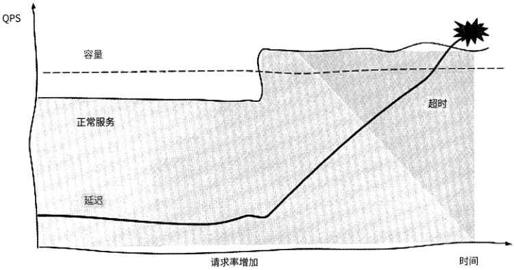

图 3-23

相信有些读者曾经接触过“过载保护”这个概念，实际上，服务防止自身过载的场景与自适应限流是一回事：自适应限流是防止服务过载的方法。很多公司设计了各种自适应限流方案，其原理也各不相同，接下来我们介绍3种较有影响力的自适应限流方案。

### 3.5.2 基于请求排队时间

Dagor是微信团队研发的微服务过载控制系统，它提供了服务过载检测、准入控制等能力。准入控制指的是服务处于过载状态时，服务进一步细分哪些请求可以通过。Dagor的设计思路是优先保证业务优先级或用户优先级更高的请求被允许通过，而低业务优先级、低用户优先级的请求被丢弃。准入控制属于自适应限流的上层高级应用，我们需要重

点关注的是Dagor如何检测服务过载。

Dagor使用等待队列中请求的平均等待时间（即排队时间）来判断服务是否过载。一个请求的排队时间的计算公式如下：

排队时间=请求开始被处理的时间-请求到达服务的时间

微信团队设置的平均等待时间的阈值为20mso如果请求在被服务处理前平均等待时间超过20ms,则认为服务已经过载。据说这个阈值配置已经在微信业务系统中应用了很多年，微信业务服务的稳定性已经验证了这种过载检测方式和阈值配置的有效性。

为什么Dagor不使用CPU使用率作为服务过载的检测标准？这是因为CPU使用率过高固然可以反映出一个服务是否处于高负载的状态，然而，它只是一个必要不充分条件，只要服务可以及时处理请求，即使CPU使用率再高，我们也不应该认为服务过载，此时

[原 PDF 第 168 页](../%E4%BA%BF%E7%BA%A7%E6%B5%81%E9%87%8F%E7%B3%BB%E7%BB%9F%E6%9E%B6%E6%9E%84%E8%AE%BE%E8%AE%A1%E4%B8%8E%E5%AE%9E%E6%88%98%20%28--%29%20%28manongshu.com%29.pdf#page=168)

不宜限流。

为什么Dagor不使用请求响应时间（请求最终被响应的时间与请求到达服务的时间的差值）作为服务过载的检测标准？这是因为请求响应时间受下游服务请求处理能力的影响过大，如果下游服务的请求处理能力不佳，则不应该认为调用者服务负载过高。

### 3.5.3 基于延迟比率

Netflix技术团队实现了自适应限流组件concurrency-limits,它的算法借鉴了 TCP拥塞控制的部分思想，通过检查请求最小延迟和采样延迟之间的比值动态调整限流窗口。此算法有两个核心公式，其中第一个核心公式用于计算请求延迟比率，并将其作为延迟变化的梯度：

```text
                          gradient = RTT_noload 4- RTT_actual
```

RTT noload变量表示服务无负载时的最佳请求延迟，concurrency-limits组件用最近一段时间内最小的请求延迟作为它的值；RTT_actual变量表示当前采样请求的实际延迟。这两个变量之间的比值被称为梯度（gradient）。gradient的值为1,表示没有请求在等待队列中排队，可以适当放宽限流窗口； gradient的值小于1,表示可能已有请求排队，为了防止过多的请求排队，需要逐渐收紧限流窗口。第二个核心公式就是用gradient控制限流窗口的具体方式：

```text
                  newjimit = currentjimit x gradient + queue_size
```

current_limit变量表示当前限流窗口的大小，通过其与gradient相乘来上下调整限流窗口，current limit在服务初始状态时以较小的初始值开始运行；queue_size变量表示允许一定程度的排队，此变量的值一般是当前限流窗口大小current limit的平方根。在没有请求排队时，这个公式可以产生限流窗口很小则增长很快、限流窗口过大则增长缓慢的效果，与TCP拥塞控制很像。通过反复调整限流窗口，算法主键趋于稳定，不仅能让请求延迟保持在较低的状态，而且允许一定程度的突发流量。

这种自适应限流算法在concurrency-limits组件中的实现被称为gradient算法。实际上，我们查看concurrency-limits组件的源码就能发现,Netflix技术团队还提供了其他自适应限流算法，如gradient?算法、vegas算法等。从名称上看，就可以知道gradient2算法是对gradient算法的改进，而vegas算法则参考了 TCP vegas拥塞控制算法。无论何种算法，其原理归根结底都是根据等待队列的长度或请求延迟情况不断地对限流窗口进行上下调整，最终收敛到一个合理的范围内，如图3.24所示。

[原 PDF 第 169 页](../%E4%BA%BF%E7%BA%A7%E6%B5%81%E9%87%8F%E7%B3%BB%E7%BB%9F%E6%9E%B6%E6%9E%84%E8%AE%BE%E8%AE%A1%E4%B8%8E%E5%AE%9E%E6%88%98%20%28--%29%20%28manongshu.com%29.pdf#page=169)

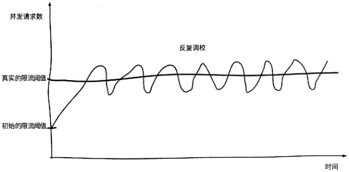

图 3-24

在采用了自适应限流算法后，Netflix技术团队在官方技术博客中也开心地表示，再也不需要“保姆式”地人工干预服务限流阈值的决策了，服务的稳定性和可用性也因此得到

了进一步提升。

### 3.5.4 其他方案

Kratos是由bilibili公司开源的一套轻量级Go语言微服务框架，其中包含大量微服务相关工具。值得称赞的是，Kratos实现了较多保障服务可用性的中间件，其中就包括使用了 BBR limiter算法的自适应限流器。

简单来说，BBR limiter算法使用CPU负载做启发阈值。如果CPU负载超过80%,则获取最近5s的最大吞吐量；如果此时服务中正在处理的请求数大于最大吞吐量，则丢弃新请求。

我们先来看BBR limiter算法的BBR结构体：

type BBR struct

```text
        cpu    cpuGetter
        passStat    window.RollingCounter
        rtStat    window.RollingCounter
        inFlight    int64
```

bucketPerSecond int64

bucketsize time.Duration

prevDropTime atomic.Value

maxPASSCache atomic.Value

minRtCache atomic.Value

opts *options

```text
     }
```

[原 PDF 第 170 页](../%E4%BA%BF%E7%BA%A7%E6%B5%81%E9%87%8F%E7%B3%BB%E7%BB%9F%E6%9E%B6%E6%9E%84%E8%AE%BE%E8%AE%A1%E4%B8%8E%E5%AE%9E%E6%88%98%20%28--%29%20%28manongshu.com%29.pdf#page=170)

其中几个主要字段的含义如下。

- cpu：用于从系统所在的服务器中获取当前CPU使用率。

- passStat：系统处理过的请求数采样数据，使用滑动窗口统计。

- rtStat:请求响应时间的采样数据，同样使用滑动窗口统计。

- inFlight：当前系统中正在处理的请求数。

- bucketPerSecond：滑动窗口中一个槽的时间长度。

- prevDropTime:上次触发请求限流的时间。

BBR limiter算法使用如下函数判断请求是否可以通过：

```text
func (1 *BBR) Allow(ctx context.Context) (func(), error) {
```

if 1. shouldDrop () ( // shouldDrop函数用于判断请求是否可以被执行(详见下文)

```text
        return nil, ErrLimitExceed
    }
```

atomic .Addlnt64 (&1. inFlight, 1) // 正在处理的请求数+1

stime : = time. Since (initTime) // 请求开始执行的时间

return func () { //请求处理完成后，需要主动调用此函数

```text
       //请求响应时间，单位是ms
       rt := int64((time.Since(initTime) - stime) / time.Millisecond)
```

1. rtStat .Add (rt) //把请求响应时间放进采样数据中

atomic.Addlnt64 (&1. inFlight, -1) //请求处理完成，正在处理的请求数T

1.passStat.Add(l) //请求处理完成，放入已处理请求的采样数据中

```text
    }, nil
}
```

shouldDrop是最核心的函数，用于判断请求是否可以被执行：

```text
func (1 *BBR) shouldDrop() bool {
   curTime := time.Since(initTime)
```

if 1. cpu () < 1. opts . CPUThreshold { // 当前 CPU 使用率小于阈值(默认为 80%)

```text
       //获取上次请求被丢弃的时间
       prevDropTime, _ := 1.prevDropTime.Load().(time.Duration)
```

if prevDropTime == 0 { //从未有过请求限流

```text
          return false
       }
```

if curTime-prevDropTime <= time. Second ( //上次请求被丢弃的时间距现在不足1 s

```text
          inFlight := atomic.Loadlnt64(&1.inFlight)
          //如果正在处理的请求数大于系统最大吞吐量，则丢弃新请求
          return inFlight > 1 && inFlight > 1.maxInFlight()
       }
    } ’「" •「一. "「、• ： .    1 .prevDropTime . Store (time . Duration (0) ) // 更新上次请求被丢弃的时间
       return false
   //当前CPU使用率大于阈值
   inFlight := atomic.Loadlnt64(&1.inFlight)
   //如果正在处理的请求数大于系统最大吞吐量，则丢弃新请求
   drop := inFlight 〉 1 && inFlight > 1.maxInFlight()
```

[原 PDF 第 171 页](../%E4%BA%BF%E7%BA%A7%E6%B5%81%E9%87%8F%E7%B3%BB%E7%BB%9F%E6%9E%B6%E6%9E%84%E8%AE%BE%E8%AE%A1%E4%B8%8E%E5%AE%9E%E6%88%98%20%28--%29%20%28manongshu.com%29.pdf#page=171)

```text
        if drop {
```

prevDrop, _ :- 1.prevDropTime.Load().(time.Duration)

if prevDrop !- 0 (

```text
               return drop
            }
```

1 .prevDropTime.Store (curTime) //更新上次请求被丢弃的时间

```text
        }
```

一-} 「 . .「 ― 「 「「— .」「 • " . . ' .

```text
        return drop
```

maxInFlight函数用于获取服务最近5s的最大吞吐量。在阅读源码前，我们先思考一下，一个服务的最大吞吐量应该如何计算？这里举一个例子：某大学每年招生2000人，每个学生需要4年时间才能毕业离校，那么此大学的总人数是多少？答案是8000人(2000x4),因为每个学生在学校停留4年，而每年有2000个学生入校和离校。同理，假设入表示一个物体进入某系统的速率，不是此物体在系统中的平均停留时间，那么系统中平均持有的物体数量Z的计算公式如下：

```text
                                     L = AxW
```

这就是利特尔法则。结合上例，人是大学每年招生的人数，不是每个学生在学校停留的时间，£是大学里学生的总人数。服务的吞吐量也可以利用利特尔法则来计算，将QPS作为A ,将请求响应时间RT ( response time )作为W,则QPS x RT就可以代表服务的吞吐量。通过BBR limiter算法计算服务最近最大吞吐量的源码如下：

```text
     func (1 *BBR) maxFlight() int64 (
        return int64(math.Floor(float64(1.maxPASS()*1.minRT()*1.bucketPerSecond)
```

/1000 + 0.5))

```text
     }
```

LmaxPASS()*l.bucketPerSecond/1000表示用最近最大请求数来计算每毫秒处理的请求数，l.minRT()表示最近请求的最小响应时间，基于利特尔法则，两者相乘的结果可以认为是服务最大吞吐量。源码最后的+0.5表示将浮点数向上取整。

请求是否被丢弃的完整逻辑(shouldDrop函数)如图3-25所示。

(1) 判断当前CPU使用率是否已经达到阈值(默认为80% )o

(2) 如果达到阈值，则进一步判断服务当前正在处理的请求数是否大于服务最近最大吞吐量。

① 如果是，则请求应该被丢弃。

② 否则，请求可以被处理。

(3) 如果没有达到阈值，则进一步判断上次请求被丢失的时间距现在是否超过Is。

①如果超过Is,则请求可以被执行。

[原 PDF 第 172 页](../%E4%BA%BF%E7%BA%A7%E6%B5%81%E9%87%8F%E7%B3%BB%E7%BB%9F%E6%9E%B6%E6%9E%84%E8%AE%BE%E8%AE%A1%E4%B8%8E%E5%AE%9E%E6%88%98%20%28--%29%20%28manongshu.com%29.pdf#page=172)

②否则，继续判断服务当前正在处理的请求数是否大于服务最近最大吞吐量；如果是,则请求被丢弃。

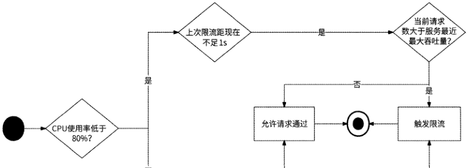

否

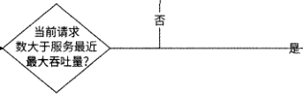

图 3-25

## 3.6 降级策略

在3.4节中，我们曾列举著名景区在节假日期间限制游客数量的例子来表述限流，而景区在节假日期间将不重要的、安全风险较大的或难以管理的游玩项目暂时关闭叫作“降级”，其目的是保障游客的游玩核心体验。与此类似，服务降级的目的是重点保障用户的核心体验和服务的可用性。在异常、高并发的情况下可以忽略非核心场景或换一种简单处理方式，以便释放资源给核心场景，保证核心场景的正常处理与高性能执行。服务降级的实施方案灵活性较大，一般与业务场景息息相关，接下来我们介绍几种思路。

### 3.6.1 服务依赖度降级

一个服务虽然会有多个下游服务，但是每个下游服务的重要程度对它来说都是不一样的。例如，3.1节中提到的用户信息服务、内容列表服务对于个人页服务来说很重要，而地址位置服务和关系服务就不是很重要。

如果B服务是A服务的下游服务，那么B服务对A服务的重要性被称为“依赖度”。依赖度越高，表明下游服务越重要。依赖度可以用如下两种（但不限于）表示形式来反映

[原 PDF 第 173 页](../%E4%BA%BF%E7%BA%A7%E6%B5%81%E9%87%8F%E7%B3%BB%E7%BB%9F%E6%9E%B6%E6%9E%84%E8%AE%BE%E8%AE%A1%E4%B8%8E%E5%AE%9E%E6%88%98%20%28--%29%20%28manongshu.com%29.pdf#page=173)

下游服务对上游服务的重要程度。

- 二元：强依赖（出现故障时业务不可接受）和弱依赖（出现故障时业务可暂时接

受）o

- 三元：一级依赖（故障导致服务完全不可用）、二级依赖（故障基本不影响服务的可用性，会有少许可接受的用户投诉）和三级依赖（故障不影响服务的可用性，

没有用户投诉）0

在判断出某服务的各下游服务的依赖度后，便可以明确地知道请求量暴增时应该优先切断哪些下游服务调用，使得服务资源能够向更重要的下游服务倾斜，保障核心场景的可用性。假设出于拉新的目的，在年底针对某产品立项了一个盛典活动，并会在春节除夕夜

20点整正式开启，于是研发团队开始了忙碌的备战与活动保障工作。

（1）在项目筹备初期，架构师团队盘点盛典活动涉及的服务，以便提前发现风险，对每个服务进行改造。

（2 ）架构师预测在活动期间A服务的QPS会高达100万，A服务成为此次活动的重点关注对象。

（3） 项目启动后，SRE工程师对A服务进行了扩容与全链路压测，经过反复的容量调整，初步认为在正常情况下，A服务已经可以应对100万QPS的请求量。

（4） 为了防止出现非预期故障，研发工程师重新梳理了 A服务的全部下游服务，并使用三元依赖度给出了梳理后的依赖度视图。如图3.26所示，B、D、H、J服务是一级依赖，C、G服务是二级依赖，E、F、I、K服务是三级依赖。

—Ml 一级依赖 二."二级依赖

三级依赖

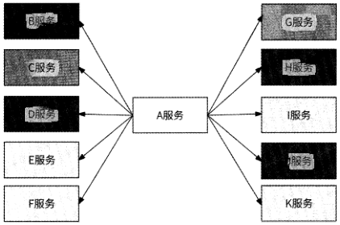

图 3-26

（5 ）研发工程师根据依赖度，在A服务的动态配置中心为不同的下游服务设计了如下

[原 PDF 第 174 页](../%E4%BA%BF%E7%BA%A7%E6%B5%81%E9%87%8F%E7%B3%BB%E7%BB%9F%E6%9E%B6%E6%9E%84%E8%AE%BE%E8%AE%A1%E4%B8%8E%E5%AE%9E%E6%88%98%20%28--%29%20%28manongshu.com%29.pdf#page=174)

配置规则:

```text
        ndepend_mapn:{
```

nBn:nlevel_ln,

"Cn:nlevel_2n,

nDn:nlevel_lnz

nEn:nlevel_3n,

°Fn:nlevel_3n,

nGn:Hlevel_2n,

nHn:nlevel_ln,

HIn:nlevel23n,

nJM:"level21nz

```text
        }, —
```

nKn:nlevel_3n

"level_3n:true,

} 一

nlevel_2H:true

depend map字段表示每个下游服务所对应的依赖级别(level_l、level_2、level_3 ),而level_2和level_3字段的值为布尔类型，表示在此依赖级别下是否可以执行下游服务调用。

(6) 在A服务调用某个下游服务前，先检查动态配置规则是否允许执行调用，如果不允许则不执行调用。研发工程师对动态配置中心的功能进行了演练测试。

(7) 在盛典活动开始前1分钟，研发工程师在动态配置中心控制开关，即设置nlevel_3'-true,将A服务三级依赖的调用关闭，A服务降级。

(8 )盛典活动开始，研发工程师时刻监控A服务的性能指标，如果发现A服务的性能劣化，则将二级依赖的调用关闭，即在动态配置中心设置nlevel_2tl=true, A服务进一步降级。

此时A服务的全部资源都已经留给其一级依赖的调用，A服务降级到仅保障最核心功能的可用性，仅对B、D、H、J服务进行调用，这就是服务依赖度降级在活动属性的高并发场景中的应用。

其实服务依赖度不仅仅可以在高并发场景中应用，前面讲述的重试、熔断、限流也都可以基于服务依赖度做更高级的增益精细化处理。

- 重试：仅对强依赖的下游服务进行重试。

- 熔断：把弱依赖的下游服务的熔断阈值设置得比强依赖的下游服务高一些，以便较早地停止调用弱依赖的下游服务，以及在确定强依赖的下游服务不可用时熔断它。

[原 PDF 第 175 页](../%E4%BA%BF%E7%BA%A7%E6%B5%81%E9%87%8F%E7%B3%BB%E7%BB%9F%E6%9E%B6%E6%9E%84%E8%AE%BE%E8%AE%A1%E4%B8%8E%E5%AE%9E%E6%88%98%20%28--%29%20%28manongshu.com%29.pdf#page=175)

- 限流：如果上游服务认为下游服务是强依赖的，则优先保证其请求被执行；而如果认为下游服务是弱依赖的，则及时对其限流，将限流窗口更多地留给那些认为

下游服务更重要的上游服务。

### 3.6.2 读请求降级

读请求降级策略与第2章介绍的高并发读场景的方案很类似，读请求的服务降级策略主要是缓存(Cache)和兜底数据。一个请求从客户端发起到最终数据响应一般会依次经过客户端、接入层网关、HTTP服务、RPC服务、分布式缓存、数据库，我们可以在客户端、接入层网关和HTTP/RPC服务中设置本地缓存，并在动态配置中心动态控制各层是否使用缓存，以及缓存的过期时间，如图3.27所示。

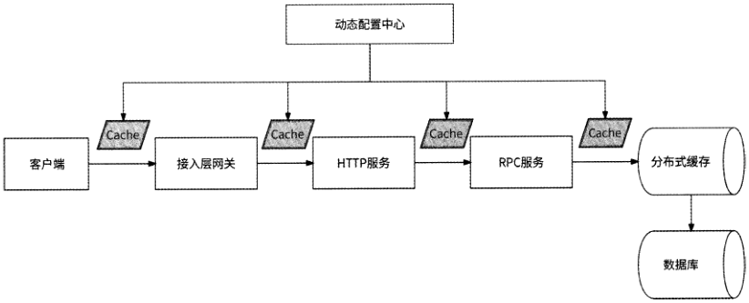

图 3-27

除缓存方式外，我们还可以应用兜底数据的思想：如果访问某数据失败，则降级为访问另一份基本可用的数据，其形式可以是静态数据，也可以是来自另一个数据源的数据。

下面举两个例子。

(1)将另一个数据源的数据作为兜底数据。近年来，很多互联网应用都内置了非常流行的内容推荐功能，由信息流推荐服务负责提供服务。信息流推荐服务有两个核心的下游服务：推荐算法服务和内容服务。推荐算法服务先根据用户爱好计算出一批内容ID,再由内容服务对完整的内容进行打包。不过，推荐算法服务是典型的计算密集型场景，它的可用性和性能表现一般，如果它不可用了，那么信息流推荐服务也就不可用了。解决方法是应用兜底数据的思想:每天零点离线计算出一批用户可能感兴趣的内容或热门内容的ID列表，由兜底推荐服务维护，当信息流推荐服务调用推荐算法服务超时或推荐算法服务不可用时，就转而调用兜底推荐服务获取内容ID列表，如图3.28所示。

[原 PDF 第 176 页](../%E4%BA%BF%E7%BA%A7%E6%B5%81%E9%87%8F%E7%B3%BB%E7%BB%9F%E6%9E%B6%E6%9E%84%E8%AE%BE%E8%AE%A1%E4%B8%8E%E5%AE%9E%E6%88%98%20%28--%29%20%28manongshu.com%29.pdf#page=176)

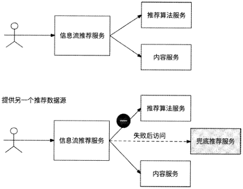

图 3-28

（2）将静态数据作为兜底数据。例如，很多直播平台都提供了打赏功能，用户打开礼物列表选择礼物送给主播，主播根据礼物的价值获得收入。如果礼物列表服务不可用，那么用户想打赏时就会发现没有礼物可选，进而导致直播平台收入受损。解决方法是事先在接入层网关配置几个常见礼物数据，如果在接入层网关访问礼物列表服务失败，则可以直接返回配置的礼物数据，这样用户打开礼物列表至少可以看到几个礼物，提高了用户打赏的可能性。

### 3.6.3 写请求降级

写请求降级策略有异步写和写聚合，这些内容在第2章中有详细介绍，这里不再赘述。在某些业务场景下，我们还可以直接丢弃写请求，一个值得介绍的例子就是直播间弹幕自见。

用户可以在直播间内发送弹幕与主播进行文字互动。在正常流程下，用户发送弹幕到对应的弹幕服务，然后弹幕服务将用户的弹幕消息广播到直播间的所有用户。如果直播间热度较高，则会有海量用户参与发送弹幕。假设某直播间有100万个在线用户，每秒有100个用户发送弹幕，为了让100万个用户都能看到这100条弹幕消息，弹幕服务每秒需要下发1亿条消息，服务器网络带宽被占满。

一种可能的降级方案是直播间弹幕自见。

- 用户A发送弹幕，客户端直接在直播间展示这条弹幕消息，用户A认为弹幕发送成功。

- 在动态配置中心配置客户端消息丢弃比例，客户端按比例决定是否把这条弹幕消

[原 PDF 第 177 页](../%E4%BA%BF%E7%BA%A7%E6%B5%81%E9%87%8F%E7%B3%BB%E7%BB%9F%E6%9E%B6%E6%9E%84%E8%AE%BE%E8%AE%A1%E4%B8%8E%E5%AE%9E%E6%88%98%20%28--%29%20%28manongshu.com%29.pdf#page=177)

息发送到服务端。

- 弹幕服务不再直接把弹幕消息广播到直播间的全部用户，而是根据动态配置中心配置的消息广播比例，将弹幕消息随机广播到一部分直播间用户。

- 研发工程师根据弹幕服务的性能，实时调整客户端消息丢弃比例和消息广播比例。

这种降级方案的可行性在于：热门直播间弹幕量大，一个用户发送的弹幕本来就会被淹没在不断刷屏的新弹幕中，用户也并没有执念一定要让直播间的其他用户看到自己发送的弹幕，所以这个场景的写请求很适合做请求丢弃和广播控制。

## 3.7 本章小结

微服务架构最大的特点就是通过错综复杂的网络调用串联起各司其职的微服务，网络的健壮性和请求流量的变化都会影响每个服务的质量。如图3-29所示，通过在网络调用链路上引入重试、熔断、隔离、限流、降级，可以有效控制流量和保证各服务的可用性。

熔断

```text
                    上游服务    试.
```

隔离

图 3-29

下面我们逐个复习本章的主要技术点。

(1 )重试：提高单次请求的成功率。

- 只有幕等接口可以被重试，读接口天然满足幕等性，而写接口需要做藉等性接口

设计。

- 幕等性接口设计方案包括Redis分布式锁、数据库防重表、token方案。

- 根据调用失败的原因决定是否需要重试。如果重试、则需要使用合适的退避策略

决定请求重试的时机。

- 为了防止重试风暴，可以控制最大重试次数和重试请求比。

(2)熔断：上游服务保护下游服务不被打垮。

- 熔断器可以自动感知下游服务的故障状态并开启熔断，停止下游服务调用。

- Hystrix熔断器基于时间窗口失败率的策略开启熔断，是最基本的熔断器。

- 在开启熔断一段时间后,Hystrix熔断器通过半开状态探测下游服务是否已经恢复。

- Resilience^熔断器还采用了慢调用比例策略开启熔断：慢速请求在总请求量中的

[原 PDF 第 178 页](../%E4%BA%BF%E7%BA%A7%E6%B5%81%E9%87%8F%E7%B3%BB%E7%BB%9F%E6%9E%B6%E6%9E%84%E8%AE%BE%E8%AE%A1%E4%B8%8E%E5%AE%9E%E6%88%98%20%28--%29%20%28manongshu.com%29.pdf#page=178)

比例是否达到阈值。

- Sentinel 断器还基于错误计数的策略开启熔断：最近1分钟的请求失败数超过阈值。

（3） 隔离：防止下游服务调用相互影响。一般使用线程池隔离或信号量隔离策略对每个下游服务的调用做并发控制。

（4） 限流：下游服务保护自己不被上游服务打垮。

- 频控是一种特殊的限流，对单个用户限制操作频率，基于Redis实现。

- 单机限流有滑动时间窗口算法、漏桶算法、令牌桶算法，限流阈值依赖人工设置，令牌桶算法表现最优。

- 全局限流通过引入限流服务，业务服务的各个实例共享限流配额，只有涉及共享资源并发控制时才建议使用此策略。

- 服务处理请求的流程可以被抽象为请求在等待队列中排队等待执行。

- 自适应限流不需要人工设置限流阈值，而是根据服务实例的当前服务能力动态限流。业界采用的方案有基于请求排队时间和基于延迟比率的自适应限流，以及BBRlimiter算法等。

（5） 降级：保障服务核心功能的可用性，具体的实施方案比较灵活。

- 使用服务依赖度表示下游服务的重要程度，当服务压力升高时可以切断不重要的下游服务调用，将服务资源倾斜给重要的下游服务。

- 对于海量的读请求，可以使用多级缓存数据或兜底数据做降级策略，兜底数据可以是静态数据，也可以是来自另一个数据源的数据。

- 对于海量的写请求，异步写和写聚合是较为通用的降级策略，在某些业务场景中也可以丢弃写请求，减小写请求量级。

[原 PDF 第 179 页](../%E4%BA%BF%E7%BA%A7%E6%B5%81%E9%87%8F%E7%B3%BB%E7%BB%9F%E6%9E%B6%E6%9E%84%E8%AE%BE%E8%AE%A1%E4%B8%8E%E5%AE%9E%E6%88%98%20%28--%29%20%28manongshu.com%29.pdf#page=179)


[原 PDF 第 180 页](../%E4%BA%BF%E7%BA%A7%E6%B5%81%E9%87%8F%E7%B3%BB%E7%BB%9F%E6%9E%B6%E6%9E%84%E8%AE%BE%E8%AE%A1%E4%B8%8E%E5%AE%9E%E6%88%98%20%28--%29%20%28manongshu.com%29.pdf#page=180)

基础服务设计篇
