[原 PDF 第 181 页](../%E4%BA%BF%E7%BA%A7%E6%B5%81%E9%87%8F%E7%B3%BB%E7%BB%9F%E6%9E%B6%E6%9E%84%E8%AE%BE%E8%AE%A1%E4%B8%8E%E5%AE%9E%E6%88%98%20%28--%29%20%28manongshu.com%29.pdf#page=181)

# 第4章 唯一ID生成器

本章我们开始介绍第一个重要的通用基础组件：唯一 ID生成器。它的应用范围非常广泛，任何涉及唯一标识的业务实体，如用户ID、商品ID、内容ID等都需要唯一 ID生成器的帮助，它是服务于业务的核心基建之一。本章介绍如何设计一个高性能、高可用的

唯一 ID生成器，具体的学习路径与内容组织结构如下。

- 4.1节介绍唯一 ID的用途和相关概念，以及根据业务诉求对唯一 ID生成器进行分类。

- 4.2节介绍单调递增的唯一 ID生成器的设计方案。

- 4.3节和4.4节介绍趋势递增的唯一 ID生成器的设计方案，包括基于时间戳和基于数据库自增主键的思路。

- 4.5节介绍一个工业级的唯一 ID生成器：美团Leaf的设计思路和工作原理。

本章关键词：自增主键、趋势递增、批量生成、分库分表、Snowflake算法、时钟回拨。

## 4.1 分布式唯一ID

在复杂的系统中，每个业务实体都需要使用ID做唯一标识，以方便进行数据操作。例如，每个用户都有唯一的用户ID,每条内容都有唯一的内容ID,甚至每条内容下的每条评论都有唯一的评论IDO

### 4.1.1 全局唯一与UUID

在互联网还未普及的年代，由于用户量少、网络交互形式单调，互联网产品后台数据库使用单体架构就可以满足日常服务的需求。当时每个业务实体都对应数据库中的一个数据表，每条数据都简单地使用数据库的自增主键作为唯一 ID0近年来，随着互联网用户的爆发式增长，数据库从单体架构演进到分库分表的分布式架构，同一个业务实体的数据被分散到多个数据库中。由于数据表之间相互独立，在插入数据时会生成相同的自增主键，

[原 PDF 第 182 页](../%E4%BA%BF%E7%BA%A7%E6%B5%81%E9%87%8F%E7%B3%BB%E7%BB%9F%E6%9E%B6%E6%9E%84%E8%AE%BE%E8%AE%A1%E4%B8%8E%E5%AE%9E%E6%88%98%20%28--%29%20%28manongshu.com%29.pdf#page=182)

此时，如果还使用自增主键作为唯一 ID,就会导致大量数据的标识相同，造成严重事故。我们应该保证无论一个业务实体的数据被分散到多少个数据库中，每条数据的唯一 ID都是全局的，这个全局唯一 ID就是分布式唯一 ID。

RFC 4122 规范中定义了通用唯一识别码(Universally Unique Identifier, UUID ),它是计算机体系中用于识别信息的一个128位标识符。UUID按照标准方法生成时，在实际应用中具有唯一性，UUID重复的概率可以忽略不计。JDK 1.5在语言层面实现了 UUID,可以轻松生成全球唯一 ID：

```text
    import java.util.UUID;
    public class idgenerator {
        public static void main(String[] args) {
           String uuid = UUID.randomUUID().toString();
           System.out.printin(uuid);
        }
     }
```

UUID的标准格式由32个十六进制数字组成，并通过连字符“・”分隔成“8.4・4.4.12”共 36 个字符的形式。例如，6a0d3e6f-allc-4b7d-bb35-c4c530a456b0. 123e4567-e89b-12d3-a456-426655440000这种唯一 ID的生成方式足够简单，利用本地计算即可生成全球唯一IDO不过，UUID字符串需要占用36字节的存储空间，如果每条数据都携带UUID,那么在海量数据场景下存储空间消耗较大。此外，UUID是无数据规律的长字符串，如果将其用作数据库主键，则会导致数据在磁盘中的位置频繁变动，严重影响数据库的写操作性能。

### 4.1.2 唯一ID生成器的特点

UUID仅适合数据量不大的场景，比如一个存储集群使用UUID标识每个数据分区。真正可用于海量数据场景的唯一 ID生成器，除保证ID不可重复外，还应该具有如下特点。

- 空间占用小：作为每条数据都携带的字段，唯一 ID不应该占用过多的存储空间。

- 高并发与高可用性：唯一 ID生成器是大部分业务服务的重要依赖方，唯一 ID的生成操作需要做到高并发无压力，维持长期高可用性。

- 唯一 ID可用作数据库主键：为了不对数据库的写操作造成负面影响，需要保证唯一 ID对数据库主键友好。

前两点很好理解，最后一点，什么样的唯一 ID才对数据库主键友好呢？我们以MySQL数据库的InnoDB引擎为例。IimoDB使用基于磁盘的B+树表示数据表，并以主键作为索引，即B+树按照主键从小到大的顺序排列数据。

如图4-1所示，B+树的节点使用默认为16KB大小的数据页(Page)表示，其中：

- 节点分为叶节点和非叶节点，底层是叶节点。

[原 PDF 第 183 页](../%E4%BA%BF%E7%BA%A7%E6%B5%81%E9%87%8F%E7%B3%BB%E7%BB%9F%E6%9E%B6%E6%9E%84%E8%AE%BE%E8%AE%A1%E4%B8%8E%E5%AE%9E%E6%88%98%20%28--%29%20%28manongshu.com%29.pdf#page=183)

- 同层数据页之间相互组成双向链表。

- 非叶节点仅保存N个主键作为指向下一层N个数据页的索引，主键从小到大排列。

- 叶节点保存实际的数据，叶节点组成的双向链表上的所有数据按照主键从小到大的顺序排列。

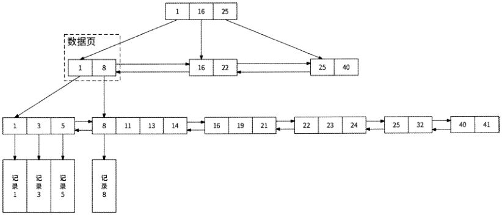

图4-1

使用自增性质的字段作为InnoDB数据表的主键是一个很好的选择，每次写入新数据时，数据都被顺序添加到对应数据页的尾部；一个数据页写满后，B+树自动开辟一个新的数据页。如图4.2所示，主键值为203的新数据被插入数据页2的尾部，这样一来，B+树将会形成一个较为紧凑的索引结构，空间利用率较高；而且，每次插入数据时也不需要移

动已有的数据，时间开销很小。

```text
                          数据页1    数据页2
                      1    30    200    201    202
                     数据    数据    数据    数据    数据
```

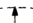

203

数据

图4-2

而如果使用非自增性质的字段（比如身份证号码、电话号码）作为主键，由于主键值较为随机，新数据可能要被插入数据页中间的某个位置。如图4-3所示，主键值为15的新数据只能被插入数据1和数据30之间，数据30、50、90都需要向后移动。

[原 PDF 第 184 页](../%E4%BA%BF%E7%BA%A7%E6%B5%81%E9%87%8F%E7%B3%BB%E7%BB%9F%E6%9E%B6%E6%9E%84%E8%AE%BE%E8%AE%A1%E4%B8%8E%E5%AE%9E%E6%88%98%20%28--%29%20%28manongshu.com%29.pdf#page=184)

数据页1

```text
                                 1    30    50    90
                                数据    '数据    …
```

15

数据

图4-3

为了给新数据腾出位置，B+树不得不将已有的数据向后移动——如果数据页已满，则会进行多次分页操作。频繁的数据移动和分页操作使得B+树在磁盘上产生大量的碎片，且时间开销很大。因此，官方建议尽量使用自增性质的字段作为InnoDB数据表的主键。

为了成为自增性质的主键，唯一 ID生成器生成的唯一 ID在数值上应该是递增的，这样的唯一 ID对数据库主键就是友好的。

占用8字节（64位）的long类型整数适合用作唯一 ID,因为：一是long类型虽然占用的空间较小，但是可表示的ID范围却非常大；二是long类型整数很容易实现递增的效果。至此，本章的议题已经明确：设计一个可以生成递增的long类型唯一 ID的生成器。

### 4.1.3 单调递增与趋势递增

在正式开始设计唯一 ID生成器之前，我们还需要解释一下递增。递增可以分为单调递增和趋势递增，从技术实现的角度来看，它们的差异较大。

- 单调递增：T表示绝对时间点，如果Tn+1>Tn,则一定有F（Tn+1） > F（7；）o如果唯一 ID生成器生成的ID单调递增，则说明下一次获取到的ID 一定大于上一次获取到的ID。

- 趋势递增：如果Tn+1>Tn,则大概率有F（Tn+1） > F（7；）o虽然在一小段时间内数据有乱序的情况，但是从整体趋势上看，数据是递增的。

单调递增和趋势递增的数据特点如图4-4所示。

虽然我们在4.1.2节中已经讨论了唯一 ID应该是递增的，但无奈受限于全局时钟、延迟等分布式系统问题，单调递增的唯一 ID生成器的设计方案往往会有较大的局限性，与此相比，趋势递增的唯一 ID生成器更受业界欢迎。接下来具体介绍这两种递增类型的唯一 ID生成器设计方案的差别。

[原 PDF 第 185 页](../%E4%BA%BF%E7%BA%A7%E6%B5%81%E9%87%8F%E7%B3%BB%E7%BB%9F%E6%9E%B6%E6%9E%84%E8%AE%BE%E8%AE%A1%E4%B8%8E%E5%AE%9E%E6%88%98%20%28--%29%20%28manongshu.com%29.pdf#page=185)

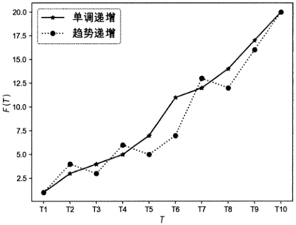

图4-4

## 4.2 单调递增的唯一ID

唯一 ID生成器本身也是一个服务，为了生成单调递增的唯一 ID,这个服务需要使用某种存储系统记录可分配的唯一 IDO Redis和其他数据库都可以达到这个目的。

### 4.2.1 Redis INCRBY命令

Redis提供的INCRBY命令可以为键(Key)的数字值加上指定的增量(increment)。如果键不存在，则其数字值被初始化为0,然后执行增量操作。使用INCRBY命令限制的值类型为64位有符号整数，此命令的特性与单调递增的唯一 ID的诉求非常契合。基于Redis INCRBY命令实现的唯一 ID生成器的Go语言代码非常简单：

```text
    func GenlD() (int64, error) {
        // 执行 Redis 命令：INCRBY seq_id 1
        cmd := rdb. IncrBy (context. TODO ()., nseq_idnr 1)
        if cmd.Err() != nil {
           return 0, cmd.Err()
        }
        return cmd»Vai(), nil
     }
```

每当生成唯一 ID的请求到来时，唯一 ID生成器都对同一个键seq_id执行一次加1的增量操作，并将键的值作为唯一 ID返回，这样就可以保证ID生成器生成的ID是唯一且单调递增的。

由于Redis具备高性能，且INCRBY命令执行的时间复杂度是0(1),所以基于Redis

[原 PDF 第 186 页](../%E4%BA%BF%E7%BA%A7%E6%B5%81%E9%87%8F%E7%B3%BB%E7%BB%9F%E6%9E%B6%E6%9E%84%E8%AE%BE%E8%AE%A1%E4%B8%8E%E5%AE%9E%E6%88%98%20%28--%29%20%28manongshu.com%29.pdf#page=186)

INCRBY命令实现的唯一 ID生成器性能表现很好，不过还有优化的空间。唯一 ID生成器服务可以每次从Redis中批量获取ID并存储到本地内存中，当业务服务请求到来时，直接从本地内存返回最小可用的IDO如果本地内存中没有可用的ID,则再次从Redis中批量获取。这个优化方案的整体架构和流程如图4-5所示。

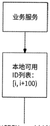

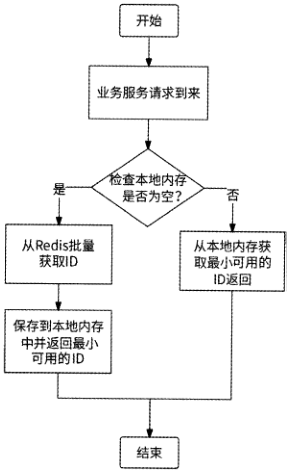

INCRBYseqJd 100

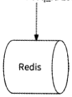

图4-5

唯一 ID生成器的Go语言代码实现如下:

```text
//唯一工D生成器服务结构
type IdGeneratorService struct {
    rdb    *redis.Client    // Redis客户端
    lock    //使用互斥锁保护对可用工D的读/写    sync.Mutex
   group    //保证并发一次访问Redis    singleflight.Group
   nextldAvailable int64    //下一个可用的工D,初始值为-1
   maxIdAvaliable int64    //最大可用的ID
}
//从Redis中批量获取ID
func (svr *IdGeneratorService) multiGenlDFromRedis(count int64) error (
   // 执行命令：INCRBY seq_id count
   cmd := rdb.IncrBy(context.TODO(), nseq_idn, count)
   if cmd.Err() != nil (
       return cmd.Err()
   }
   lastlnsertld := and.Val ()    // 得到 seq_id 键的最新值
   svr. nextldAvailable = lastlnsertld - count + 1    // 反算出第二个 id
```

[原 PDF 第 187 页](../%E4%BA%BF%E7%BA%A7%E6%B5%81%E9%87%8F%E7%B3%BB%E7%BB%9F%E6%9E%B6%E6%9E%84%E8%AE%BE%E8%AE%A1%E4%B8%8E%E5%AE%9E%E6%88%98%20%28--%29%20%28manongshu.com%29.pdf#page=187)

```text
        svr.maxidAvailable = lastlnsertld
        return nil
    }
    //请求处理函数：获取唯-ID
    func (svr *IdGeneratorService) GenlDO (id int64, err error) {
```

svr.lock.Lock()

```text
        //如果是初始化或者目前没有可用的工D,则需要从Redis中获取
        needPull := svr.nextldAvailable == -1 I 1 svr.nextldAvailable >
```

svr.maxIdAvailable

```text
        if !needPull {
           //有可用的工D,更新下一个可用的工D
           id = svr.nextldAvailable
```

svr.nextIdAvailable++

```text
        )
```

svr.lock.Unlock()

if !needPull (

return

```text
        }
        //并发一次从Redis中获取100个:TD
         z err, _ = svr.group.Do(nmulti_gen_idn, func () (interface!}f error) (
           e := svr.multiGenlDFromRedis(100)
           return nil, e
        })
        if err != nil {
```

log.Fatalf(ngenerate id from redis failed, err:%v\n'\ err)

return

```text
        }
        //已有可用的工D,再次执行此函数
        return svr.GenlD()
     }
```

唯一 ID生成器服务从Redis中批量获取ID的方式，不仅可以进一步提高服务的性能，而且可以降低由于网络抖动而导致Redis访问超时所带来的影响。不过，Redis主要用作缓存，它并不具有严格的数据持久化能力。如果最新的唯一 ID数据丢失，则很容易生成重复的ID,给业务服务带来难以估计的风险。我们先来看一个Redis实例宕机的例子。

(1 ) 71时刻seq_id键的值为1000, Redis已将数据持久化到RDB文件和AOF文件中。

(2) 72时刻唯一 ID生成器服务从Redis中获取10个ID,得到1001 - 1010, seq_id键的最新值变为1010o

(3) 73时刻Redis实例宕机，seq_id键的最新值还未来得及被持久化。

(4) T4时刻Redis重启，Redis使用RDB文件和AOF文件重建内存数据，seq_id键的值依然是1000o

(5)T5时刻唯一 ID生成器服务从Redis中获取10个ID,再次得到1001〜1010。

[原 PDF 第 188 页](../%E4%BA%BF%E7%BA%A7%E6%B5%81%E9%87%8F%E7%B3%BB%E7%BB%9F%E6%9E%B6%E6%9E%84%E8%AE%BE%E8%AE%A1%E4%B8%8E%E5%AE%9E%E6%88%98%20%28--%29%20%28manongshu.com%29.pdf#page=188)

如果采用Redis主从架构呢？依然无法彻底解决ID重复的问题，因为Redis主从复制是异步的，即Redis主节点无法确定从节点是否已经复制了某数据。假设唯一 ID生成器服务从Redis主节点获取了 1001〜1010的ID后主节点发生宕机，由于seq_id键的最新值尚未被复制到从节点，从节点上seq_id键的值依然是1000；如果此时从节点被提升为主节点，那么下一次唯一 ID生成器服务从其获取的10个ID依然是1001〜1010,即生成了重复的IDO

### 4.2.2 基于数据库的自增主键

生成单调递增的唯一 ID的另一种方式是基于数据库的自增主键。首先在数据库中创建数据表seq_id：

```text
     CREATE TABLE seq_id (
```

id bigint(20) unsigned NOT NULL auto_increment,

col tinyint NOT NULL,

PRIMARY KEY (id)

```text
     )ENGINE-InnoDB;
```

其中，id字段使用auto_increment声明为自增主键，首次向seq_id数据表中插入数据后，该数据主键被设置为1,之后每次插入新数据时，数据主键都会以1的增量自增；col字段只是为了方便插入数据，没有特殊含义。唯一 ID生成器服务先在seq_id数据表中插入一条数据，然后读取此数据的主键并将其作为唯一 ID返回。使用Go语言代码实现如下：

```text
     func GenlD() (int64, error) {
        // 执行 SQL 语句：INSERT INTO seq__id (col) VALUES 0
        result, err := db.Exec("INSERT INTO seq_id(col) VALUES (?)n, 0)
        if err != nil (
           return 0, err
        }
```

lastlnsertlD, err := result. Last Insert Id () // 获取所插入数据的主键

```text
        return lastlnsertlD, err
     }
```

基于数据库的自增主键插入数据生成唯一 ID的性能不高，我们同样可以将其改进为采用4.2.1节介绍的批量生成ID的方式。唯一 ID生成器服务的代码实现与Redis方案类似，只是批量生成ID的函数不一样：

```text
    //从数据库中批量获取工D
    func (svr *IdGeneratorService) multiGenlDFromDB(count int64) error {
        query := nINSERT INTO seq_id(col) VALUES n
```

var inserts [ ]string

```text
        var params []interface{}
        for i := int64 (0); i < count; i++ {
           inserts = append(inserts, ”(？)”)
```

[原 PDF 第 189 页](../%E4%BA%BF%E7%BA%A7%E6%B5%81%E9%87%8F%E7%B3%BB%E7%BB%9F%E6%9E%B6%E6%9E%84%E8%AE%BE%E8%AE%A1%E4%B8%8E%E5%AE%9E%E6%88%98%20%28--%29%20%28manongshu.com%29.pdf#page=189)

```text
           params = append(paramsz 0)
        }
        // 组装成批量插入的 SQL 语句：INSERT INTO seq__id(col) VALUES (0) , (0) , (0) , . . •
        queryVals := strings.Join(inserts, ", n)
        stmt, err := db.Prepare(query + queryVals)
        if err != nil (
           return err
        }
        //批量插入数据
        res, err := stmt.Exec(params...)
        //获取插入的第一条数据的主键，作为最小工D
        lastlnsertlD, err := res.LastInsertId()
```

if err !- nil (

```text
           return err
        }
        svr.nextldAvailable = lastlnsertlD
        //计算出批量插入的最后一条数据的主键，作为最大工D
        svr.maxIdAvailable = lastlnsertlD + count - 1
        return nil
     }
```

为了保证高可用性，数据库采用主从架构，同时主从数据复制采用半同步复制或MGR(MySQL组复制)的机制，这样每次将新数据插入数据库主节点时，主节点都会将新数据同步复制到从节点。如果数据库主节点宕机，那么从节点可以立刻代替主节点对外提供服

务，唯一 ID生成器服务不会因为访问从节点而生成重复的IDo

### 4.2.3 高可用架构

需要注意的是，如果批量生成唯一 ID的生成器服务有多个实例对外提供服务，则无法生成单调递增的唯一 ID。如图4・6所示，假设唯一 ID生成器服务初次启动并有两个实例接收业务请求。

(1) T1时刻实例A收到请求1,于是从数据库中批量获取10个唯一 ID,即1〜10,将其缓存到本地，然后为请求1返回ID=1。

(2) 72时刻实例B收到请求2,也从数据库中批量获取10个唯一 ID,即11〜20,将其缓存到本地，然后为请求2返回ID=11O

(3 ) 73时刻实例A收到请求3,于是返回本地可用的ID=2O

(4)T4时刻实例B收到请求4,于是返回本地可用的ID=12O

唯一ID生成器服务依次生成的ID是不满足单调递增的1、11、2、12,而是趋势递增的，所以此服务在任何时刻只能有一个实例对外提供服务。而服务只有一个实例，则意味着这个服务的可用性较差。为了提高唯一 ID生成器服务的可用性，可以增加一个备用

[原 PDF 第 190 页](../%E4%BA%BF%E7%BA%A7%E6%B5%81%E9%87%8F%E7%B3%BB%E7%BB%9F%E6%9E%B6%E6%9E%84%E8%AE%BE%E8%AE%A1%E4%B8%8E%E5%AE%9E%E6%88%98%20%28--%29%20%28manongshu.com%29.pdf#page=190)

实例：此实例日常不对外提供服务，仅当工作实例宕机后，它才接替工作实例处理业务请求。最终的唯一 ID生成器服务的架构如图4.7所示。

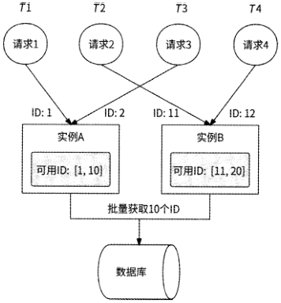

图4-6

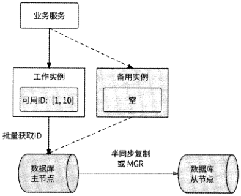

图4-7

无论是否采用批量获取ID的思路，单调递增的唯一 ID生成器都始终无法支持高并发访问，这是单调递增的唯一 ID不被广泛使用的最主要原因。如果不批量获取ID,则意味着每个业务请求都会写数据库，数据库难以承受高并发写入操作，性能表现不佳，甚至可能会被击垮；而如果批量获取ID,虽然数据库访问量级降低 了，但是ID生成器服务只能有一个工作实例，单实例所能承载的并发量级非常有限，服务失去了可扩展性。相比之下，唯一 ID生成器能被广泛接受的实现方式是生成趋势递增的唯一 ID。

[原 PDF 第 191 页](../%E4%BA%BF%E7%BA%A7%E6%B5%81%E9%87%8F%E7%B3%BB%E7%BB%9F%E6%9E%B6%E6%9E%84%E8%AE%BE%E8%AE%A1%E4%B8%8E%E5%AE%9E%E6%88%98%20%28--%29%20%28manongshu.com%29.pdf#page=191)

## 4.3 趋势递增的唯一ID：基于时间戳

时间戳是指计算机维护的从1970年1月1日开始到当前时间经过的秒数，并且随着时间的流逝而逐步递增。几乎所有的编程语言都仅需要一行代码，就可以轻而易举地得到当前时间戳，并支持毫秒精度，甚至是纳秒精度。时间戳自增的属性非常适合生成趋势递

增的唯一 IDO

### 4.3.1 正确使用时间戳

时下最为普及的计算机普遍采用64位操作系统，对应的时间戳也是用64位表示的。在4.1.2节中已经明确了唯一 ID也是64位的，这样不就意味着唯一 ID正好可以用时间戳表示吗？这种做法是不可取的，原因很简单，在高并发场景下，同一时间有很多业务请求到达唯一 ID生成器，如果用时间戳表示唯一 ID,就会生成重复的ID。

对于基于时间戳的唯一 ID,应该继续考虑高并发与分布式环境下的其他变量。例如：

- 服务实例：同一时间业务请求1和业务请求2分别从ID生成器服务实例A和服务实例B获取唯一 ID,为了防止生成重复的ID,在唯一 ID上应该对服务实例的差别有所体现。

- 请求：同一时间业务请求1和业务请求2从LD生成器服务实例A获取唯一 ID,在唯一 ID上应该区分这两个请求。

话是没错，但是时间戳已经占用了唯一 ID的全部空间，还怎么考虑其他变量呢？其实照搬计算机时间戳的概念是一个常见的谬误。根据笔者的面试经验来看，不少面试者都知道唯一 ID生成器可以用时间戳来实现，但是对时间戳已经占用唯一 ID的全部空间（64位时）往往百思不得其解。

再看一遍时间戳的概念：从1970年1月1日开始到当前时间经过的秒数。假设我们设计的唯一 ID生成器在2023年1月1日上线，那么根本不需要关心在上线时间之前时间戳的数值。所以，我们可以将时间戳的起始时间改为上线时间，仅记录唯一 ID生成器从上线时间到当前时间经过的秒数就行。对于毫秒精度也是同样的道理。

假设我们期望唯一 ID生成器可以正常提供服务50年（已经很久了），总计1,576,800,000s,那么实际上使用31位整数即可表示时间戳。即使采用毫秒精度的时间戳，41位整数也已经足够使用。所以，我们只记录唯一 ID生成器从上线时间到当前时间的相对时间戳即可。

另外，需要强调的是，一个整数的大小优先由数字的高位决定。所以，时间戳应该被设置到唯一 ID的高位，这样才能保证随着时间的推移唯一 ID趋势递增。

[原 PDF 第 192 页](../%E4%BA%BF%E7%BA%A7%E6%B5%81%E9%87%8F%E7%B3%BB%E7%BB%9F%E6%9E%B6%E6%9E%84%E8%AE%BE%E8%AE%A1%E4%B8%8E%E5%AE%9E%E6%88%98%20%28--%29%20%28manongshu.com%29.pdf#page=192)

### 4.3.2 Snowflake算法的原理

Snowflake的中文意思是雪花，所以Snowflake算法也被称为雪花算法。它最早是Twitter公司内部后台使用的分布式环境下的唯一 ID生成算法，2014年开源了 Scala语言版本。

Snowflake算法的原理是将分布式环境下的各变量按数位组合成64位的long类型数字生成唯一 ID。如图4.8所示，唯一 ID是由多个数位分段组成的，这些分段从高位到低位依次如下。

- 1位：符号位，固定值为0,用于保证生成的long类型ID是正整数。

- 41位：存储当前时间与指定时间(可以是上线时间)的毫秒差值，从指定时间开始可运行241 : (1000 x 60 x 60 x 24 x 365) « 69年。

- 5位：用于区分不同的机房，最多支持25 = 32个机房。

- 5位：用于区分ID生成器服务的不同实例，支持25 = 32个实例。不过，这5位与前5位共享10位存储空间一如果是单机房环境，则无须区分不同的机房，可以用10位来区分ID生成器服务的不同实例，即支持1024个服务实例；如果最多会建设6个机房，则区分不同的机房只需3位，可以用剩下的7位来区分ID生成器服务的不同实例。

- 12位：最后12位用于区分单个ID生成器服务实例在同一毫秒内生成的唯一 ID,最多支持2翌=4096个唯一 ID,即单个服务实例Is可支持约410万个唯一 ID生

```text
        成请求。    | (--- *---
            1位，固定值为0    5位机房ID    12位，同一毫秒内请求序列号
```

0-00000000000000000000000000000000000000000-00000-00000-000000000000

十

```text
                         41位，当前时间与指定    5位机器Q
```

时间的毫秒差值

图4-8

最终效果是，Snowflake算法给出的唯一 ID生成器是一个支持多机房共1024个服务实例规模、单个服务实例每秒可生成410万个long类型唯一 ID的分布式系统，且此系统可以正常工作69年。

### 4.3.3 Snowflake算法的灵活应用

Snowflake算法是想告诉我们：需要将所考虑的高并发与分布式环境下的变量都体现在唯一 ID上，不是必须使用41位表示毫秒级时间戳、5位表示机房、5位表示服务实例、12位表示同一毫秒内的并发请求，而是应该按照实际的业务情况进行灵活调整。

[原 PDF 第 193 页](../%E4%BA%BF%E7%BA%A7%E6%B5%81%E9%87%8F%E7%B3%BB%E7%BB%9F%E6%9E%B6%E6%9E%84%E8%AE%BE%E8%AE%A1%E4%B8%8E%E5%AE%9E%E6%88%98%20%28--%29%20%28manongshu.com%29.pdf#page=193)

假设某互联网公司将唯一 ID生成器立为项目，该公司目前的条件如下。

- 采用3个机房（北京、上海、深圳）的多活架构，均匀承接用户请求。

- 按照当前的日活跃用户数量做乐观估计，将来每秒有近10亿次获取唯一 ID的需求。

- 当前的硬件和服务器框架可支持单个服务实例每秒最多处理100万个请求。

- 期望唯一 ID生成器可以工作30年。

根据如上条件，采用Snowflake算法设计的唯一 ID按位从高到低分段如下。

- 1位：依然是符号位，固定值为0,以保证生成正整数。

- 40位：系统运行的总毫秒数，30年约为9461亿毫秒，可以用40位二进制数表示。

- 2位：用于区分3个机房，并满足将来增加一个新机房的需求。

- 接下来的10位：单个服务实例每秒处理100万个请求，即每毫秒处理1000个请求。使用10位二进制数来区分同一毫秒内的并发请求。

- 最后的11位：可全部用于区分单个机房内唯一 ID生成器服务的不同实例，即可支持部署最多2048个服务实例。

最终的唯一 ID生成器服务在全部机房每秒可承接的用户请求量为3 X 2048 X 100万a 61亿个，远超公司预期的请求量，并可实际运行34年有余。这个服务的核心代码实现也很简单，需要额外注意的细节是，如果在某一毫秒内处理的用户请求量超过1024个，那么服务将报错返回或者使请求阻塞等待到下一毫秒：

```text
    //工D生成器服务结构体
```

type IdGeneratorService struct （

```text
        lock    sync.Mutex
        dataCenterld int64    // 机房ID,人为指定
        workerld    // 服务实例ID,人为指定    int64
        startTime    // 系统初始时间，人为指定    time.Time
        millisPassed int64    // 上一次请求的处理时间距离初始时间有多少毫秒
        concurrency    // 记录在同一毫秒内生成的ID数    int64
     }
     //生成唯一 ID
    func (svr *IdGeneratorService) GenlD() (id int64, err error) (
        //计算当前时间距离初始时间有多少毫秒
        millis := time.Now().Sub(svr.startTime).Milliseconds()
```

svr.lock.Lock()

defer svr.lock.Unlock()

```text
        //与上一次生成工D的请求处于同一毫秒内
```

var concurrencyvalue int64

```text
        if millis == svr.millisPassed (
           //本毫秒内生成的工D数已超过最大并发数范围，报错返回
           if svr.concurrency >= 1«10 {
               return 0, errors.New("concurrency limit")
            } else {
```

[原 PDF 第 194 页](../%E4%BA%BF%E7%BA%A7%E6%B5%81%E9%87%8F%E7%B3%BB%E7%BB%9F%E6%9E%B6%E6%9E%84%E8%AE%BE%E8%AE%A1%E4%B8%8E%E5%AE%9E%E6%88%98%20%28--%29%20%28manongshu.com%29.pdf#page=194)

concurrencyvalue = svr.concurrency // 当前并发数

```text
               svr. concurrency += 1    // 更新并发数
            }
        } else (
           concurrencyvalue = 0    //此请求是本毫秒内的第一个请求，标记为0
           svr.concurrency = 1    // 更新并发数
```

svr.millisPassed = millis // 更新最新毫秒总数

```text
        )
        //按1-40-2-11-10的占位排布各变量
        id = (millis « 23) | (svr.dataCenterld « 21) | (svr.workerId « 10)[
```

concurrencyvalue

return

Snowflake算法要求人工指定系统初始时间、机房ID和服务实例ID。系统初始时间，可以设置为唯一 ID生成器服务上线的时间；机房ID,很容易人为指定，如指定北京机房ID为1,深圳机房ID为2,上海机房ID为3；服务实例ID,由于唯一 ID生成器服务本身涉及功能迭代、扩容、缩容，服务实例的集合相对动态，所以直接人工指定服务实例ID不太现实，我们需要找到一种自动化的方式，为目前在线的唯一 ID生成器服务的不同实例分配服务实例ID。

### 4.3.4 分配服务实例ID

为了保证生成的ID的唯一性，应该为ID生成器服务的不同实例分配不同的服务实例ID ( worker ID )o这其实也是唯一 ID生成器的问题，4.2.2节介绍的数据库自增主键方案就是一种合适的选型。

设计数据表worker_id,其中ip_address字段用于保存服务实例的IP地址：

```text
     CREATE TABLE worker_id (
```

id bigint(20) unsigned NOT NULL auto_increment,

ip_address varchar(20) NOT NULL,

PRIMARY KEY (id)

```text
     )ENGINE=InnoDB;
```

当一个ID生成器服务实例启动时，将携带本地IP地址查询worker_id表，如果找到对应的数据，则使用该数据行的主键作为其worker ID；否则，服务实例向worker_id表中插入IP地址，并将插入数据后得到的主键作为worker ID。如果某服务实例获得的workerID数值超过所允许的范围，则启动失败。

分布式协调技术的相关开源项目如ZooKeeper或etcd,也可以实现服务实例ID分配的功能，这里以etcd为例介绍实现方案。

etcd是一个高可用的键值存储系统，通常用于服务发现、分布式锁、Leader选举、消息订阅和发布等场景中。etcd提供了 Revision机制：一个etcd集群有一个全局数据版本号

[原 PDF 第 195 页](../%E4%BA%BF%E7%BA%A7%E6%B5%81%E9%87%8F%E7%B3%BB%E7%BB%9F%E6%9E%B6%E6%9E%84%E8%AE%BE%E8%AE%A1%E4%B8%8E%E5%AE%9E%E6%88%98%20%28--%29%20%28manongshu.com%29.pdf#page=195)

Revision,当集群内任何数据发生变更(创建、删除、修改)时，Revision值都会加1。etcd保证Revision全局单调递增，任何一次数据变更都对应唯一的Revision值。etcd中存储的每个键值数据都会维护两个与Revision相关的版本。

- create revision:键值数据被首次创建时，记录此时的Revision值。

- mod_revision：键值数据被修改时，记录此时的Revision值。

使用etcd为服务实例分配worker ID的方案就依赖create revision字段：每个服务实例都向etcd中写入一个代表自己的键值，然后与其他服务实例比较create_revision的大小。如果有M个服务实例的create_revision小于此服务实例的create_revision,则说明在此服务实例启动前已经有M个服务实例相继启动过,于是将此服务实例的worker ID设置为M。服务实例从etcd中获取worker ID的流程如下。

(1 )当唯一 ID生成器服务实例启动时，将携带本地IP地址在etcd集群中创建新的键值 u worker_id_(IP),，o

(2 )此服务实例从etcd中获取所有前缀为uworker_id_”的键值列表。

(3 )对所获取到的键值列表按照create_revision从小到大的顺序排列。

(4 )将此服务实例的键值在排序后的键值列表中的下标位置作为其worker IDO

对应的Go语言代码实现如下：

```text
     func GetWorkerID(ctx context.Context, ipAddress string) (int, error) {
        //携带本地TP地址创建worker_id_{IP)键值
        myKey := fmt. Sprintf (nworker__id_%sn, ipAddress)
        if err := etcdClient.Put(ctx, myKey, n0n); err != nil {
            return 0, err
        }
        //获取所有前缀为worker_id_的键值列表
```

resp, err etcdClient.Get(ctx, nworker_id_H, etcd.WithPrefix())

```text
        if err != nil {
            return 0, err
        }
        kvList := resp.Kvs
        //按照create_revision从小到大的顺序排列键值列表
```

sort.Slice(kvList, func(i, j int) bool (

```text
            return kvList[i].CreateRevision < kvList[j].CreateRevision
         })
        for if kv := range kvList {
            //此服务实例在排序后的键值列表中的下标位置就是worker ID
            if string(kv.Key) == myKey {
               return i, nil
            }
         }
        return 0, errors.New(nno such a node")
     }
```

[原 PDF 第 196 页](../%E4%BA%BF%E7%BA%A7%E6%B5%81%E9%87%8F%E7%B3%BB%E7%BB%9F%E6%9E%B6%E6%9E%84%E8%AE%BE%E8%AE%A1%E4%B8%8E%E5%AE%9E%E6%88%98%20%28--%29%20%28manongshu.com%29.pdf#page=196)

### 4.3.5 时钟回拨问题与解决方案

时间戳的数据通过计算机的时钟获得，而计算机的时钟用专门的硬件来模拟：计算机主板上有一个石英晶体振荡器和一个纽扣电池，其中石英晶体振荡器的频率为32,768Hzo在通电状态下，石英晶体振荡器每振动32,768次，电路就会传出一次信息，表示Is到了，计算机就是通过这种方式来记录时间的。不过，用石英晶体模拟时钟会有误差，在正常情况下，每天的计时误差在土 Is内，而在极端条件下（如低温）误差会变大。这种现象被称为“时钟漂移”。

由于时钟漂移的存在，一组工作的计算机之间可能会存在时间戳误差。1985年，DavidL. Mills设计了网络时间协议（Network Time Protocol, NTP ）来同步计算机之间的时钟，它可以将所有计算机之间的时钟误差调整到几毫秒以内，一个局域网内的计算机时钟误差甚至可以在1ms内。NTP有效地解决了时钟漂移的问题。

但是NTP时钟同步又带来了另一个问题：时钟回拨。如果某计算机的时钟时间远快于NTP标准时间，那么经过NTP时间校准后，此计算机的时钟时间需要回退到NTP标准时间，即发生了时钟回拨，这个问题会导致基于Snowflake算法的唯一 ID生成器服务生成重复的IDo如图4-9所示，唯一 ID生成器服务的某个实例的时间为2023年1月1日11时05分05秒，经过NTP时间校准后，此服务实例的时间变为2023年1月1日11时05分00秒，此时此服务实例生成的唯一 ID与5s前生成的ID产生了重复。

2023.1111:05:00 时间

2023.1.111:05:05

NTP时间校准

图4-9

当唯一 ID生成器服务的某个实例收到请求时，首先计算出此时的毫秒时间戳millis,然后与上一次请求的毫秒时间戳svr.millisPassed进行比较，如果 millis小于svr.millisPasseds,则说明发生了时钟回拨。当发生时钟回拨时，可以采取如下措施防止生成重复的IDo

- 如果回拨的时间较短（如10ms）,则阻塞请求一段时间后再重新执行。

- 如果回拨的时间较长，则阻塞请求不可取，此时服务实例可以直接拒绝请求。

另外，还有一种建议的做法是对唯一 ID生成器服务的全部实例直接关闭NTP时钟同步功能，防止发生时钟回拨。关闭NTP时钟同步功能，虽然可能会导致一些服务实例发生大幅度的时钟漂移，但是我们可以选择从服务集群中摘除这些服务实例。

### 4.3.6 最终架构

基于Snowflake算法的唯一 ID生成器服务的最终架构如下所述，如图4.10所示。

[原 PDF 第 197 页](../%E4%BA%BF%E7%BA%A7%E6%B5%81%E9%87%8F%E7%B3%BB%E7%BB%9F%E6%9E%B6%E6%9E%84%E8%AE%BE%E8%AE%A1%E4%B8%8E%E5%AE%9E%E6%88%98%20%28--%29%20%28manongshu.com%29.pdf#page=197)

- 每个机房都单独编号。

- 在每个机房内都部署一个worker ID分配器，可以基于数据库或etcd等。

- 在每个机房内都部署若干唯一 ID生成器服务实例，这些服务实例每次启动时都从本机房的worker ID分配器中获取worker IDO

- 每个服务实例都在本地维护当前毫秒时间戳和毫秒内并发数，并与机房编号、worker ID 一起作为输入参数,执行Snowflake算法生成唯一 ID。

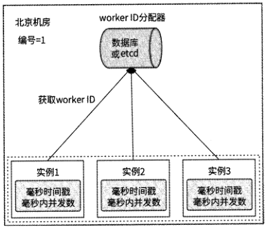

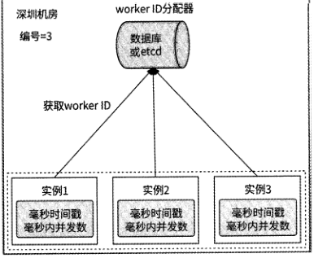

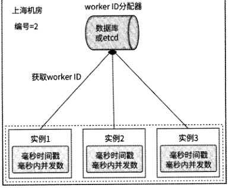

图

## 4.4 趋势递增的唯一ID：基于数据库的自增主键

基于数据库的自增主键也可以生成趋势递增的唯一 ID,且由于唯一 ID不与时间戳关联，所以不会受到时钟回拨问题的影响。

[原 PDF 第 198 页](../%E4%BA%BF%E7%BA%A7%E6%B5%81%E9%87%8F%E7%B3%BB%E7%BB%9F%E6%9E%B6%E6%9E%84%E8%AE%BE%E8%AE%A1%E4%B8%8E%E5%AE%9E%E6%88%98%20%28--%29%20%28manongshu.com%29.pdf#page=198)

### 4.4.1 分库分表架构

数据库一般都支持设置自增主键的初始值和自增步长，以MySQL为例，自增主键的自增步长由auto_increment_increment变量表示，其默认值为1。MySQL可以使用SET命令设置这个变量值，比如SET @@auto_increment_increment=3会将自增步长设置为3。

在创建数据表时，MySQL可以为自增主键指定初始值。例如，如下建表语句会为test_primary_key表的自增主键设置初始值为10：

```text
     CREATE TABLE 'test_primary_key' (
```

'id' bigint unsigned NOT NULL AUTO_工NCREMENT,

'col' tinyint NOT NULL,

PRIMARY KEY ('id')

```text
     )ENGINE=InnoDB AUTO_INCREMENT=10;
```

接下来向这个表中插入5条数据，然后看看主键的增长情况，如图4.11所示。

mysql> INSERT INTO test„primary_key(col) VALUES (0),(0),(0),(0),(0)；

Query OK, 5 rows affected (0.01 sec)

Records: 5 Duplicates: 0 Warnings: 0

```text
                    mysql> SELECT * FROM test_primary_key;
```

+------+-------- +

I id I col I

+------+--------+

```text
                    I    10 I    0 I
                    I    13 I    0 1
                    I    16 i    0 !
                    I    19 i    0 I
                    I    22 i    0 I
```

5 rows in set (0.00 sec)

图 4-11

可以看到，第一条数据的主键为10,之后每个主键都自增3。这个数据库功能可以保证数据库分库分表后每个子表的自增主键全局唯一。如图4-12所示，假设数据库被水平拆分为5个子表：依次创建5个子表并分别设置自增主键的初始值为1~5,然后设置每个子表的自增主键的自增步长也为5。最终，子表1生成的自增主键是1,6,11,16,21,…，子表2生成的自增主键是2,7,12,17,22,…，其他子表以此类推。将基于这个思路实现的分库分表架构应用到唯一 ID生成器服务，就会生成趋势递增的唯一 ID,有效地解决了数据库单点问题，并在一定程度上提高了数据库并发吞吐量。

不过，分库分表架构将自增主键的自增步长与分表个数强行绑定，所以系统整体的可扩展性较差，无法对数据库进行任何扩容操作。也就是说，这个方案只适合不需要扩容的场景。

[原 PDF 第 199 页](../%E4%BA%BF%E7%BA%A7%E6%B5%81%E9%87%8F%E7%B3%BB%E7%BB%9F%E6%9E%B6%E6%9E%84%E8%AE%BE%E8%AE%A1%E4%B8%8E%E5%AE%9E%E6%88%98%20%28--%29%20%28manongshu.com%29.pdf#page=199)

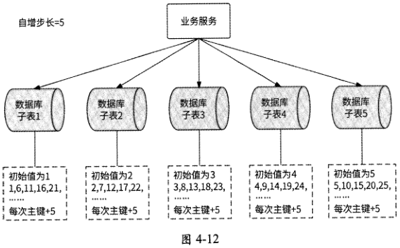

### 4.4.2 批量缓存架构

4.2节介绍了基于数据库的自增主键生成单调递增的唯一 ID的方案，当时我们讨论过一个关于高可用性的细节问题：如果采用从数据库中批量获取ID的方式，则可以大幅提高系统性能，但是任何时刻只能有一个服务实例工作，否则生成的唯一 ID将不是单调递增的，而是趋势递增的。这恰好是我们需要的效果。

既然生成的唯一 ID是趋势递增的，那么唯一 ID生成器服务可以有任意多个服务实例。如图4.13所示，每个服务实例都从数据库中批量获取ID并缓存到本地；同时，为了保证数据库主从切换不会生成重复的ID,数据库主从节点采用半同步复制或MGR方式同步最新数据。

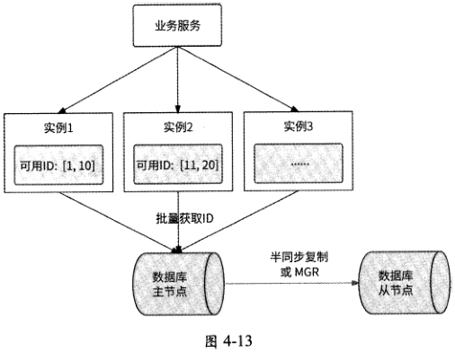

[原 PDF 第 200 页](../%E4%BA%BF%E7%BA%A7%E6%B5%81%E9%87%8F%E7%B3%BB%E7%BB%9F%E6%9E%B6%E6%9E%84%E8%AE%BE%E8%AE%A1%E4%B8%8E%E5%AE%9E%E6%88%98%20%28--%29%20%28manongshu.com%29.pdf#page=200)

## 4.5 美团点评开源方案：Leaf

Leaf是美团点评公司基础研发平台推出的一个唯一 ID生成器服务，其具备高可靠性、低延迟、全局唯一等特点，目前已经被广泛应用于美团金融、美团外卖、美团酒旅等多个部门。Leaf根据不同业务的需求分别实现了 Leaf-segment和Leaf-snowflake两种方案，前者基于数据库的自增主键，后者基于Snowflake算法。接下来介绍这两种方案的技术原理。需要注意的是，Leaf和前几节介绍的几种技术方案非常相似，只是多了一些思考和优化，这也是我们在本节中重点着墨的部分。

### 4.5.1 Leaf-segment方案

Leaf-segment方案与4.4.2节介绍的批量缓存架构方案类似，只不过它没有依赖数据库的自增主键，而是在数据库中为每个业务场景都记录目前可用的唯一 ID号段。具体的数据表设计如表4・1所示。

表4・1

```text
                         类 型    含 义
```

字段名

```text
 biz_tag    varchar(128)    主键，用于区分不同的业务方
 max_id    bigint(20)    此biz_tag业务目前被分配的最大唯一 ID
 step    int(ll)    下一次生成多少个唯一 ID
 desc    varchar(256)    用于描述业务信息，非核心数据
 update_time    timestamp    记录每次生成唯一 ID的时间戳
```

不同业务方的唯一 ID需求用biz_tag字段区分，每个biz_tag的ID相互隔离。当某业务请求携带biz_tag访问Leaf服务时，数据库会通过执行如下语句生成唯一 ID：

BEGIN

```text
    UPDATE table SET max_id=max_id+ step WHERE biz_tag=xxx
    SELECT tag, max_id, step FROM table WHERE biz_tag=xxx
```

COMMIT

比如在数据表中外卖业务方的biz tag为waimai_ordertag,此时max_id为10000, step为2000,那么外卖业务方下次得到的唯一 ID号段是10001〜12000, max_id的值被更新为12000。通过修改step字段值，可以方便地控制一个业务访问数据库的频率：如果step为1,则说明每次生成唯一 ID时业务方都要访问数据库；如果step为1000,则说明每用完1000个唯一 ID时，业务方才再次访问数据库。

美团技术团队官网给出了 Leaf-segment方案的大致架构图，如图4・14所示。

[原 PDF 第 201 页](../%E4%BA%BF%E7%BA%A7%E6%B5%81%E9%87%8F%E7%B3%BB%E7%BB%9F%E6%9E%B6%E6%9E%84%E8%AE%BE%E8%AE%A1%E4%B8%8E%E5%AE%9E%E6%88%98%20%28--%29%20%28manongshu.com%29.pdf#page=201)

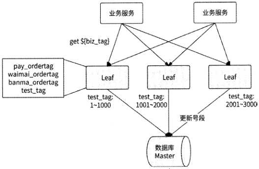

人

```text
                         biz„tag    maxjd    step    desc    updated me
                        pay„ordertag    3000    1000
                      waimai_ordertag    10000    2000
                       banma„ordertag    20000    20000
                         test„tag    3000    1000
```

图 4-14

从架构图中可以看到，Leaf-segment方案与4.4.2节介绍的批量缓存架构方案确实大同小异，服务实例在本地缓存一批可用的唯一 ID号段供业务请求使用，当某业务请求发现唯一 ID号段用完时，再从数据库中批量获取新的唯一 ID号段。如果此时数据库发生网络抖动或慢查询，则会导致访问数据库的业务请求被阻塞，整个服务的响应变慢。

Leaf-segment方案针对这个问题做了优化：当使用可用的唯一 ID号段到达某个检查点时，Leaf服务实例就异步地从数据库中获取下一个可用的唯一 ID号段，而不需要等到唯一 ID号段用完才访问数据库，这样可以防止唯一 ID号段用完时阻塞业务请求。

具体来说，Leaf服务实例内部有两个唯一 ID号段缓存区，其中第一个缓存区用于对外提供服务，业务请求从这里获取唯一 ID；第二个缓存区用于提前向数据库加载下一个可用的唯一 id号段。当第一个缓存区已经下发10%可用的唯一 ID时，Leaf服务实例将启动一个线程异步访问数据库，并将获取到的下一个可用的唯一 ID号段保存到第二个缓存区。这样一来，当某业务请求发现第一个缓存区中已无可用的唯一 ID时，Leaf服务实例就直接切换到第二个缓存区继续下发可用的唯一 ID,如此循环往复，业务请求不会被阻塞在访问数据库的过程中。这个技术优化的示意图如图4-15所示（参考自美团技术团队官网）。

[原 PDF 第 202 页](../%E4%BA%BF%E7%BA%A7%E6%B5%81%E9%87%8F%E7%B3%BB%E7%BB%9F%E6%9E%B6%E6%9E%84%E8%AE%BE%E8%AE%A1%E4%B8%8E%E5%AE%9E%E6%88%98%20%28--%29%20%28manongshu.com%29.pdf#page=202)

```text
pos    切换 segment
```

当前iD号段分发完成

后，如果下一个ID号

```text
     Value    段已准备好，则进行
```

切换操作，修改pos

指向更新过的

segment

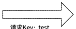

10i00 1001

```text
                test    1    100    2000
请求Key： test    |waimaijd
```

jhoteLid

| movte_id

更新下一个ID号段

banmajd

当I。号段已被消费了 10%

时，如果下一个2号段没有

准备好且更新线程不在执

行中，则开启更新线程更新

下一个ID号段

线程

从数据库获取新的2

号段，放入另一个

segment缓存区中

图 4-15

### 4.5.2 Leaf-snowflake方案

使用Leaf-segment方案可以生成趋势递增的唯一 ID,但是ID值会反映实际的数据量，并不适用于订单ID生成的场景。如果将此方案应用在订单ID生成的场景中，则很容易被竞品公司计算出订单的总量，这等于把业务的数据表现直接实时暴露给其他公司。为了解决这个问题，美团点评公司提供了 Leaf-snowflake方案，这个方案和4.3节介绍的基于时间戳的方案类似。

Leaf-snowflake方案在唯一 ID的设计上完全沿用Snowflake算法，即使用“1+41+10+12”的方式组装ID；至于worker ID的分配问题，Leaf・snowflake方案借助了 ZooKeeper持久顺序节点的特性，每个Leaf服务实例都会在ZooKeeper的leaf forever节点下注册一个持久顺序节点，将对应的顺序数字作为worker IDO假设现在有4个服务实例注册了持久顺序节点，leaf^forever节点的结构可能如图4-16所示。

每个服务实例都携带IP地址和端口号在leatforever节点下注册持久顺序节点(格式为“IP:port”)，然后ZooKeeper会自动生成一个自增序号作为每个顺序节点的后缀，这个序号就可被分配作为实例的worker IDO Leaf-snowflake方案分配worker ID的流程如下。

(1 ) Leaf服务实例启动时，连接ZooKeeper0

(2)服务实例查询leaf^forever节点是否存在。如果不存在，则跳至第4步，否则继续。

(3 )服务实例读取leaf^forever节点下的子节点列表，然后根据自身的IP地址和端口

[原 PDF 第 203 页](../%E4%BA%BF%E7%BA%A7%E6%B5%81%E9%87%8F%E7%B3%BB%E7%BB%9F%E6%9E%B6%E6%9E%84%E8%AE%BE%E8%AE%A1%E4%B8%8E%E5%AE%9E%E6%88%98%20%28--%29%20%28manongshu.com%29.pdf#page=203)

号遍历子节点列表，查询自己是否注册过子节点。

(4) 如果未找到子节点，则实例在leaf_forever节点下创建子节点，将所得到的节点后缀序号作为worker IDO

(5) 如果找到子节点，则将此子节点的后缀序号取出作为worker ID。

(6) 获取到worker ID后，Leaf服务实例就启动成功了；否则，启动失败。

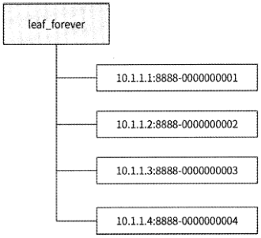

图 4-16

Leaf服务实例在获取到worker ID后会将其保存到本地文件中，这样可以做到对ZooKeeper的弱依赖。将来，如果ZooKeeper出现故障，而此时Leaf服务实例恰好重启，那么就可以从本地文件中得到worker ID,避免了无法正常启动的问题。

每个Leaf服务实例都会每隔3s将自身的系统时间上报到其在leaf_forever节点下注册的子节点，并且还会在另一个ZooKeeper节点leaf^temporary下创建一个临时节点，leaf temporary下的临时节点列表代表了此时正在运行的Leaf服务实例集合。也就是说，Leaf服务实际上与两个ZooKeeper父节点交互：leaf^forever节点与leaf^temporary节点，如图4-17所示。

Leaf-snowflake方案使用这两个节点来解决时钟回拨问题，具体的工作流程如下。

(1 )如果Leaf服务实例在leaf forever节点下未注册持久顺序节点，那么在注册节点时将顺便写入自身的系统时间。

(2 )如果Leaf服务实例已在leaf_forever节点下注册持久顺序节点，则对比持久顺序节点记录的时间与自身的系统时间。如果自身的系统时间更小，则认为发生了时钟回拨，服务实例启动失败。

(3)否则，获取leaf^temporary节点下的所有临时节点信息，然后向这些临时节点代表的Leaf服务实例发送RPC请求查询它们的系统时间，并计算出平均时间，用于表示Leaf

[原 PDF 第 204 页](../%E4%BA%BF%E7%BA%A7%E6%B5%81%E9%87%8F%E7%B3%BB%E7%BB%9F%E6%9E%B6%E6%9E%84%E8%AE%BE%E8%AE%A1%E4%B8%8E%E5%AE%9E%E6%88%98%20%28--%29%20%28manongshu.com%29.pdf#page=204)

服务集群的系统时间。

(4 )如果平均时间与Leaf服务实例自身的系统时间的差值小于某个阈值，则认为本服务实例的系统时间是准确的，服务实例可以正常启动。

(5) 否则，说明本服务实例的系统时间相较于Leaf集群中的其他服务实例发生了大幅度的时钟漂移，服务实例启动失败。

(6) 启动成功的Leaf服务实例每隔3s将自身的系统时间上报到在leaf^forever节点下注册的持久顺序节点。

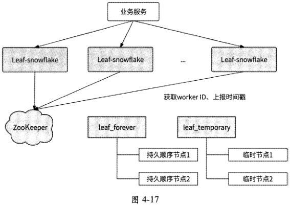

Leaf-snowflake方案通过检查服务实例上报的自身系统时间和其他Leaf服务实例的平均时间来解决时钟回拨问题，按照美团点评公司技术博客中的说法，这个策略有效地避免了时钟回拨对业务造成的影响。另外，此方案也建议关闭NTP时钟同步功能。

## 4.6 本章小结

分布式唯一 ID应该具备占用空间小、可用作数据库主键的能力，所以一般用递增的long类型整数来表示。

递增可以分为单调递增和趋势递增。

单调递增的唯一 ID生成器可以基于Redis INCRBY命令实现，或者基于数据库的自增主键实现。采用批量生成ID的方式可以提高唯一 ID生成器的性能，ID生成器服务实例将一批唯一 ID缓存到本地对外提供服务，当可用的唯一 id消耗完时再生成下一批唯一

[原 PDF 第 205 页](../%E4%BA%BF%E7%BA%A7%E6%B5%81%E9%87%8F%E7%B3%BB%E7%BB%9F%E6%9E%B6%E6%9E%84%E8%AE%BE%E8%AE%A1%E4%B8%8E%E5%AE%9E%E6%88%98%20%28--%29%20%28manongshu.com%29.pdf#page=205)

IDO不过，为了保证唯一 ID单调递增，此时只能有一个服务实例对外工作。由于单调递增的唯一 ID生成器服务无法兼顾高可用性和高性能，所以应用相对具有局限性。

如果把单调递增改为趋势递增，那么唯一 ID生成器服务将打破局限性。一种方案是使用数据库分库分表架构生成自增主键，同时利用数据库自带的自增主键调整自增步长和设置初始值来防止各分表生成的自增主键冲突。这种方案可以提高数据库的高可用性与性能，但是可扩展性较差。另一种方案是使用批量缓存架构，即在批量获取单调递增的唯一ID的基础上采用多服务实例生成趋势递增的唯一 IDO这两种方案都是基于数据库的自增主键生成唯一 ID的，数值的可读性过强，在某些场景中有泄露业务数据的风险。基于时间戳生成唯一 ID可以解决这个问题。

如何基于时间戳设计唯一 ID生成器呢？ Snowflake算法为我们提供了很好的思路：将分布式环境下的各变量体现到唯一 ID的二进制位上，比如不同的机房、不同的服务实例、不同的时间、相同时间不同的请求。每个ID生成器服务实例都需要有唯一表示自己的worker ID,可以使用数据库的自增主键、分布式协调服务ZooKeeper或etcd来实现；同时，服务实例维护从系统上线时间开始经过的总毫秒数、当前毫秒内已生成的ID数量，以便区分时间和并发请求。最后，一定要防止时钟漂移问题影响ID的唯一性。

美团点评公司的唯一 ID生成器服务Leaf实现了两种生成唯一 ID的方案:Leaf-segment和Leaf-snowflake。前者采用了批量缓存ID的思想,后者是对Snowflake算法的应用。
