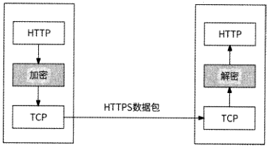
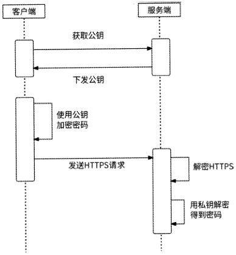
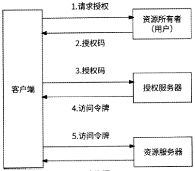
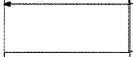
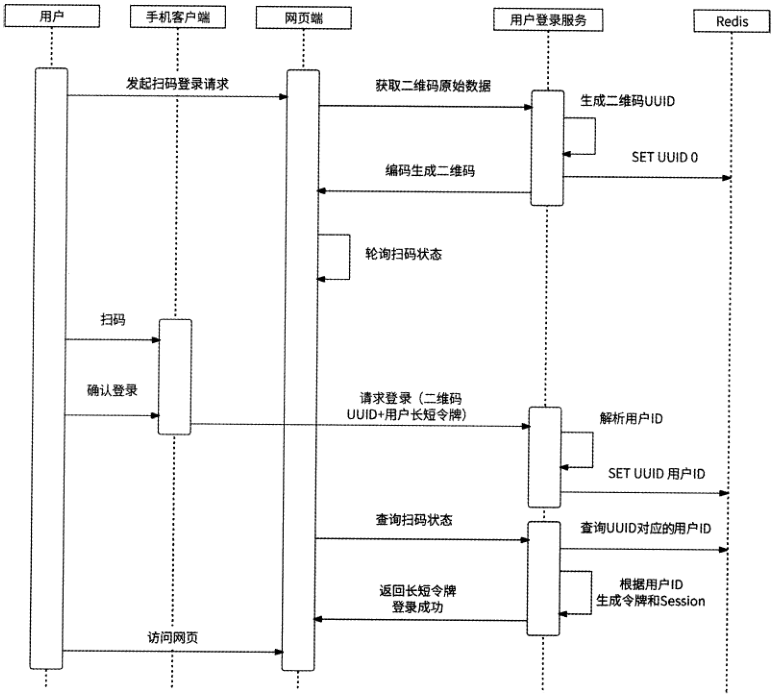

[原 PDF 第 206 页](../%E4%BA%BF%E7%BA%A7%E6%B5%81%E9%87%8F%E7%B3%BB%E7%BB%9F%E6%9E%B6%E6%9E%84%E8%AE%BE%E8%AE%A1%E4%B8%8E%E5%AE%9E%E6%88%98%20%28--%29%20%28manongshu.com%29.pdf#page=206)

# 第5章 用户登录服务

从本章开始，我们正式与用户相关服务打交道。当用户想使用一个互联网产品的完整功能时，要做的第一件事情就是在应用中注册账号并登录。这个功能由用户登录服务负责,也是本章的主题。在正式学习用户登录服务前，我们先来了解本章的学习路径与内容组织结构。

- 5.1节介绍用户账号对互联网产品的意义。

- 5.2节介绍用户登录服务的功能要点。

- 5.3节介绍如何对用户密码进行最大可能的保护。

- 5.4节介绍手机号登录和邮箱登录的实现方式。

- 5.5节介绍第三方登录的实现方式。

- 5.6节介绍登录态问题以及登录态管理的方案。

- 5.7节介绍扫码登录的实现方式。

本章关键词：单向加密、用户认证、手机号一键登录、第三方登录、Session.长短令牌、扫码登录。

## 5.1 用户账号

在早期互联网时代，大部分互联网产品是不需要用户注册与登录的。因为早期互联网产品主要是信息发布与浏览的平台，比如门户网站、搜索引擎，当时的用户行为非常简单（几乎就是浏览），不需要为用户提供个性化服务，所以不需要识别用户，更不需要用户注册与登录。

而随着互联网的发展，用户数量逐渐增加，用户的需求与行为也变得多样化和个性化,互联网产品开始逐渐转向注重社交性、交互性、个性化等多方面发展，于是用户概念和用户账号等逐渐成为互联网产品设计与运营的核心。

用户账号是一种身份认证和授权机制，它对互联网产品具有如下意义。

[原 PDF 第 207 页](../%E4%BA%BF%E7%BA%A7%E6%B5%81%E9%87%8F%E7%B3%BB%E7%BB%9F%E6%9E%B6%E6%9E%84%E8%AE%BE%E8%AE%A1%E4%B8%8E%E5%AE%9E%E6%88%98%20%28--%29%20%28manongshu.com%29.pdf#page=207)

- 身份认证：用户账号是识别用户身份的重要途径，用户通过输入账号和密码等登录信息来进行身份认证，保护用户信息安全，并确保只有合法的用户才可以访问相关产品。

- 个性化服务：有了用户账号，互联网产品可以根据用户的个人信息和操作行为来提供个性化、精准的服务，如推荐、定制、购买等。

- 数据积累和分析：互联网产品通过收集用户账号信息、访问记录等，可以进行数据的积累和分析，优化产品体验，改进产品的设计和迭代等。

- 运营与推广：使用用户账号，可以更方便地进行互联网产品的运营与推广。例如，使用用户账号，可以通过社交媒体的分享、邮件等途径发送推广信息等。

以上这些正是互联网产品提供用户注册与登录功能的理由，所以说用户登录服务几乎是每个互联网公司后台最重要的服务之一。

## 5.2 用户登录服务的功能要点

用户登录服务负责用户的注册与登录，这是一个看似非常简单、很容易设计的服务。在学习数据库的过程中，很多同学都做过数据库的各种管理系统课程设计，比如图书馆管理系统、学生成绩管理系统等，使用数据库作为数据存储系统，使用HTTP协议的HTML页面作为用户操作界面。无论哪个管理系统，必不可少的一个功能都是用户注册与登录。当时，大家实现这个功能的方式基本如下。

首先，在数据库中创建一个用户表User来记录用户账号、密码和用户状态等信息，如表5・1所示（注意：用户昵称、头像、个性签名等这里暂不列出，它们不是用户登录服务的重点）o

表5・1

```text
                 类 型    含 义
```

字段名

```text
 id    BIGINT    自增主键，用作用户ID
 username    CHAR(IOO)    用户账号，是用户注册时填写的唯一存在的字符串，也用于用户登录，如微信号
 password    CHAR(IOO)    用户密码
 status    用户状态枚举，比如：0未登录，1己登录，2己注销，3已冻结，4已封禁，等等    INT
```

然后，开发用户注册页面和登录页面。页面元素如下。

- 账号文本框：用户在此输入账号。

- 密码文本框：用户在此输入密码。

- 验证码标签：用户打开页面时，网页随机生成一个验证码并展示

- 验证码文本框：用户在此输入验证码。

[原 PDF 第 208 页](../%E4%BA%BF%E7%BA%A7%E6%B5%81%E9%87%8F%E7%B3%BB%E7%BB%9F%E6%9E%B6%E6%9E%84%E8%AE%BE%E8%AE%A1%E4%B8%8E%E5%AE%9E%E6%88%98%20%28--%29%20%28manongshu.com%29.pdf#page=208)

- 注册按钮：用户点击后注册。

- 登录按钮：用户点击后登录。

用户注册的流程如下。

（1） 用户打开注册页面，并在上述三个文本框中依次输入待注册的账号（如abc）、密码（如123456）和验证码。

（2） 用户点击“注册”按钮，HTTP使用POST方式将用户填入的账号、密码提交到后台。

（3） 后台在User表中查询账号abc是否存在，如果存在，则报错返回；否则，将账号、密码插入 User 表中。SQL 语句为 INSERT INTO User（username, password, status）VALUES（'abc‘，‘123456’，0）o

（4） 插入数据成功后，后台返回给用户“注册成功”的响应信息。

用户登录的流程如下。

（1） 用户打开登录页面，依次输入账号（如abc）、密码（如123456）和验证码。

（2） 用户点击“登录”按钮，将账号、密码提交到后台。

（3） 后台尝试在User表中将账号为abc、密码为123456且未登录的用户状态更新为“已登录”。SQL 语句为 UPDATE User SET status=l WHERE username=,abc, AND

```text
password- 123456' AND status=0o
```

（4） 如果数据库中有1行数据被更新了，则说明用户存在且密码正确，于是后台返回给用户“登录成功”的响应信息；否则，提示用户“账号/密码错误或账号异常”。

通过这种方式，用户登录服务只需要依赖数据库，且用户注册与登录功能在同一个数据表上执行一条SQL语句就能实现，看似用最简单的方式就可以满足要求。

然而，正规的互联网公司都不可能这么做，因为这种方式虽然简单，但是漏洞百出。

- 用户ID依赖数据库的自增主键，其值可以反映出目前已注册用户有多少，这属于泄露商业机密。我们应该使用基于时间戳的分布式唯一 ID来生成用户ID,具体细节参见第4章。

- HTTP将用户账号、密码以明文形式传输到后台，如果在网络传输过程中遭到攻击者监听，则会直接造成用户账号、密码的泄露。

- 后台直接把用户密码保存到数据库中，如果数据库被意外泄露到公网，则等于曝光了用户密码。此外，与用户登录服务相关的工程师可以直接在数据库中查看用户密码，这会降低用户的安全感。如果有“内鬼”工程师利用职务之便使用这些数据做什么事情，后果将难以估量。

[原 PDF 第 209 页](../%E4%BA%BF%E7%BA%A7%E6%B5%81%E9%87%8F%E7%B3%BB%E7%BB%9F%E6%9E%B6%E6%9E%84%E8%AE%BE%E8%AE%A1%E4%B8%8E%E5%AE%9E%E6%88%98%20%28--%29%20%28manongshu.com%29.pdf#page=209)

- 需要使用用户账号、密码登录的限定形式，会导致注册与登录成为用户的负担，因为缺少便捷性，用户不得不绞尽脑汁创建并牢记账号与密码。为了减少用户的访问负担，很多互联网产品都提供了各种登录方式，如手机号登录、邮箱登录、第三方（QQ、微信、微博、抖音等）登录。对于同时存在PC端、移动端的互联网产品，用户在登录移动端后还可以扫码登录PC端，比如爱奇艺、支付宝等。总之，用户注册与登录应该越简单越好，一键注册、一键登录是最好的选择。

- 在微服务架构下，很多后台服务都需要先判断用户是否已登录（即查询用户登录态），于是纷纷从用户登录服务中获取信息。如果使用User表查询用户登录态，则会导致数据库被迅速击垮。实际上，用户登录态是一个热门话题，我们会专门

用一整节来介绍其细节（见5.6节）o

如上种种充分说明用户登录服务的设计实现并没有那么简单，它至少需要满足如下技

术要求。

- 密码安全：任何时候都不可以将用户密码暴露给任何人，包括服务设计方。

- 以多种方式登录：需要具有支持手机号登录、邮箱登录、第三方登录和扫码登录

的能力。

- 支持登录态查询：很多服务都会依赖用户登录态，需要使用高性能、高可用的方

式支持这个需求。

## 5.3 密码保护

无论是客户端与服务端之间通过网络传输密码，还是将密码保存到数据库中，都需要

保证密码安全。

### 5.3.1 使用HTTPS通信

首先我们来解决客户端发送注册、登录请求到服务端时，防止第三方抓包工具获取到密码的问题。客户端与服务端之间使用HTTPS通信。HTTPS是身披SSL外壳的HTTP,在HTTP通信链路中利用SSL/TLS建立全信道加密数据包，在请求传输过程中，第三方抓包工具看到的是密文，所以获取不到密码。

需要注意的是，使用HTTPS并不能彻底保证密码安全，因为HTTPS的加密、解密行为发生在HTTP层和TCP层之间，如图5-1所示。

[原 PDF 第 210 页](../%E4%BA%BF%E7%BA%A7%E6%B5%81%E9%87%8F%E7%B3%BB%E7%BB%9F%E6%9E%B6%E6%9E%84%E8%AE%BE%E8%AE%A1%E4%B8%8E%E5%AE%9E%E6%88%98%20%28--%29%20%28manongshu.com%29.pdf#page=210)

```text
客户端    服务端
```



图5-1

这就意味着，虽然HTTPS在网络传输过程中可以保证数据是密文，但是数据包到达服务端后，一旦经过解密进入HTTP层，数据就会变为明文，这时如果攻击者入侵服务端并在网络层拦截数据，那么依然可以获取到密码。攻击者入侵客户端同样可以获取到密码，

况且客户端被入侵的可能性远大于服务端被入侵的可能性。所以需要强调的是，HTTPS保证的是数据在传输过程中的安全性，而攻击者依然可以在客户端和服务端拦截数据得到明文密码。

### 5.3.2 非对称加密

为了防止用户密码在客户端和服务端泄露，很多互联网公司都选择在客户端提交密码前对密码进行非对称加密。我们可以将非对称加密直接理解为数据的加密和解密使用了两把不同的钥匙，分别是公钥和私钥。公钥由服务端下发给客户端，用于数据加密；私钥由服务端自己持有，任何经过公钥加密的数据都只能被对应的私钥解密。即使攻击者在客户端网络层截获了所下发的公钥也没用，因为数据解密所需的私钥藏在服务端。

在将密码组装到数据包前先使用公钥对其进行加密，即使攻击者截获了明文数据包，密码也依然是加密的，这样就可以保证密码在客户端和服务端的安全。使用非对称加密实现用户注册与登录请求安全传输的流程如下所述，如图5・2所示。

(1) 客户端从服务端获取公钥。

(2) 客户端利用公钥对用户提交的密码进行加密。

(3) 客户端使用HTTPS向服务端请求注册与登录。

(4 )服务端解密HTTPS,得到HTTP明文数据包。

(5)用户登录服务处理数据包，使用私钥解密得到原始密码。

[原 PDF 第 211 页](../%E4%BA%BF%E7%BA%A7%E6%B5%81%E9%87%8F%E7%B3%BB%E7%BB%9F%E6%9E%B6%E6%9E%84%E8%AE%BE%E8%AE%A1%E4%B8%8E%E5%AE%9E%E6%88%98%20%28--%29%20%28manongshu.com%29.pdf#page=211)



### 5.3.3 密码加密存储

接下来，我们解决密码在数据库中存储的安全问题。解决方法也是加密，只不过这里使用的是单向加密算法。单向加密算法指的是可以对数据加密，但是无法解密（即不可逆）的算法，比如MD5、SHA1等。用户注册、修改密码等场景都要存储密码，用户登录服务在存储密码前先对密码进行单向加密，然后存储加密结果；用户登录时，针对用户输入的密码，再次使用相同的单向加密算法加密，然后将加密结果与数据库中存储的值进行对比，

如果它们相同，则说明密码一致。

基于单向加密算法不可逆的特点，任何人都无法从用户数据表中查询到用户真实的密码，即使数据库被泄露了，也不会导致用户密码曝光。所以，采用这种对用户密码单向加

密后存储的方式可以杜绝密码泄露。

## 5.4 手机号登录和邮箱登录

大部分互联网应用都支持手机号登录和邮箱登录的功能，这不仅仅使登录方式多样化，更重要的是，使用手机和邮箱往往具有如下优势。

- 用户习惯：人们在日常生活中通常使用手机和邮箱进行通信，互联网用户更是习惯使用固定的手机号或邮箱地址作为登录凭证，而不是花费心思去记住自己的各

种账号与密码。

- 数据唯一：一个手机号只会属于一个用户，不存在多个用户使用同一个手机号的

[原 PDF 第 212 页](../%E4%BA%BF%E7%BA%A7%E6%B5%81%E9%87%8F%E7%B3%BB%E7%BB%9F%E6%9E%B6%E6%9E%84%E8%AE%BE%E8%AE%A1%E4%B8%8E%E5%AE%9E%E6%88%98%20%28--%29%20%28manongshu.com%29.pdf#page=212)

情况。对于邮箱也是如此。使用手机和邮箱可以免去冗长的账号注册流程，降低

用户使用门槛。

- 身份认证：使用手机和邮箱能对用户进行身份认证，确保用户身份合法。

- 数据安全：手机和邮箱通常与用户数据权限关联，当用户忘记密码时，使用它们可以有效缩短找回密码的流程，提高账号的安全性。

总之，提供手机号登录和邮箱登录功能的目的是方便用户快速、安全地登录，提升用户体验，降低用户使用门槛。

### 5.4.1 数据表设计

为了支持以手机号、邮箱等类似方式登录的功能，在数据库中需要额外创建一个用户授权表User_auth,如表5-2所示。

表5.2

含 义

```text
     字段名    类    型
 id    BIGINT    自增主键，无特殊含义
 authid    授权ID,用于保存手机号、邮箱地址，同时作为索引    CHAR(IOO)
 auth_type    授权类型枚举，比如：1手机号，2邮箱    INT
 user_id    用户ID,也作为索引    BIGINT
 auth_status    TINYINT    授权是否通过：0未通过，1通过
```

User_auth表与User表是多对一的关系，且有两个索引。

- auth_id索引：根据手机号或邮箱地址查询授权记录，找到对应的用户。

- user_id索引：根据用户ID查询其手机号和邮箱。

### 5.4.2 用户注册

当用户使用手机号或邮箱注册账号时，需要确认用户使用的确实是自己可支配的手机号、邮箱，确认的方式就是使用验证码：用户在注册时，服务端会向对应的手机号或邮箱发送一条比如有效时间为5min的随机验证码，用户需要在这5min内提交正确的验证码才认为手机号或邮箱地址合法。使用手机号注册的流程和使用邮箱注册几乎完全一致，这里仅以手机号注册为例介绍用户注册流程。

(1) 用户进入注册页面，选择手机号注册方式并填入当前可用的手机号，然后点击“发送验证码”按钮。

(2) 用户登录服务收到请求后，先在User_auth表中查询此手机号是否已存在且被他人使用。SQL 语句为 SELECT count(l) FROM User_auth WHERE auth_id =，手机号，AND

```text
auth_type=l。
```

[原 PDF 第 213 页](../%E4%BA%BF%E7%BA%A7%E6%B5%81%E9%87%8F%E7%B3%BB%E7%BB%9F%E6%9E%B6%E6%9E%84%E8%AE%BE%E8%AE%A1%E4%B8%8E%E5%AE%9E%E6%88%98%20%28--%29%20%28manongshu.com%29.pdf#page=213)

(3) 如果此手机号未被使用，则继续注册流程：为此用户创建用户ID,在User_auth表中插入新记录。SQL 语句为 INSERT INTO User_auth(auth_id, auth_type, user_id,auth_status) VALUES(n手机号”，1,用户 ID, 0)o

(4) 用户登录服务生成一个随机验证码，并以String对象的形式保存到Redis中，其中Key为telephone」手机号｝, Value为验证码，用于保存手机号和验证码的关系。然后，调用第三方运营商的短信接口向这个手机号发送验证码。此时，用户注册请求得到响应“验

证码已发送”。

(5) 用户收到验证短信并填入验证码，点击“注册”按钮，手机号和用户输入的验证码被发送到用户登录服务。

(6) 用户登录服务使用手机号在Redis中查询验证码，并与用户输入的验证码进行对比。如果用户输入的验证码和服务端下发的验证码相同，则说明用户确实是此手机号的使

用者，注册流程继续。

(7) 用户登录服务将User_auth表中的授权状态(auth_status )改为“通过”，然后用户得到响应“请设置密码”并跳转到密码设置页面。

(8) 用户提交所输入的初始密码，用户登录服务在User表中插入用户账号数据，其中用户名称被默认设置为“手机用户—｛手机号｝”。SQL语句为INSERT INTO User(id,username, password, status, status) VALUES(用户 ID,用户名，密码，0)o

至此，整个注册流程结束。

### 5.4.3 用户登录

使用手机号登录时分为两种方式，其中一种方式是使用手机号和账号密码登录，另一种更方便的方式是使用手机号和验证码登录。前者是比较常规的方式，免去了用户要记住用户名的痛苦，但是用户依然要记得密码；而后者更为人性化，只需要保证手机号确实为

请求者所使用即可，因为需要接收验证码。

使用手机号和账号密码登录的流程如下。

(1) 用户输入手机号和账号密码，并点击“登录”按钮。

(2) 用户登录服务从User_auth表中获取手机号对应的授权用户ID。SQL语句为SELECT user_id FROM User_auth WHERE auth_id=手机号 AND auth_type=l o 如果获取到数据，则说明此手机号已被注册。

(3) 用户登录服务根据查询到的用户ID,继续从User表中查询密码。SQL语句为SELECT password FROM User WHERE id=用户IDO然后，将查询到的密码与用户输入的密码进行对比，如果它们一致，则登录成功。

[原 PDF 第 214 页](../%E4%BA%BF%E7%BA%A7%E6%B5%81%E9%87%8F%E7%B3%BB%E7%BB%9F%E6%9E%B6%E6%9E%84%E8%AE%BE%E8%AE%A1%E4%B8%8E%E5%AE%9E%E6%88%98%20%28--%29%20%28manongshu.com%29.pdf#page=214)

使用手机号和验证码登录的流程如下。

（1）用户输入手机号，然后点击“发送验证码”按钮。

（2 ）用户登录服务收到请求后，先在User_auth表中查询此手机号是否已被授权。SQL语句为 SELECT count（l） FROM User_auth WHERE auth_id =，手机号，AND auth_type=lo

（3） 如果此手机号已被授权，那么用户登录服务会生成一个随机验证码，并将其保存到Redis中（以与注册流程同样的方式）,同时发送验证短信。

（4） 用户输入所收到的短信验证码，点击“登录”按钮。

（5） 用户登录服务发现用户输入的验证码与Redis中的数据相同，用户登录成功，将该用户在User表中的status更新为“1”。

虽然这里是分开介绍注册与登录流程的，但是很多互联网公司都将两者做了结合：对用户只提供登录页面，如果在登录流程中发现手机号不存在，则使用这个手机号先注册再登录，使得注册流程对用户无感，极大地简化了注册流程。

### 5.4.4 手机号一键登录

使用手机号登录，用户需要依次输入手机号、等待接收短信验证码、填写验证码、点击“登录”按钮，整个过程可能会花费几十秒，用户操作依然较为烦琐。而且，短信验证码常常莫名收不到，或者过了很久才收到，这会导致一批用户放弃注册、登录。那么，是否有更简单的方式可以实现手机号登录呢？

大家先回想一下，使用手机号登录为什么需要短信验证码？短信验证码的作用就是认证这个手机号你正在使用，那么是否还有其他的方式对手机号进行认证？答案是肯定的，即本机号码认证。

当用户在移动端发起登录时，应用可以获取到此时移动端设备插入的SIM卡对应的手机号，如果此号码与用户登录时填写的手机号相同，则说明此登录手机号就是用户正在使用的号码。不过，出于安全的考虑，无论是Android、iOS还是其他移动端平台，均不允许应用直接获取手机号。

幸运的是，目前主流的移动运营商都已经开放了相关能力，我们可以调用运营商提供的接口判断用户输入的手机号是否与本机号码相同，这样用户就免去了接收验证码的步骤。甚至更进一步，用户连登录手机号都不需要填写，这就是本节的主角：一键登录。

目前国内三大运营商都提供了一键登录的开放平台，比如中国电信的天翼账号开放平台、中国移动的互联网能力开放平台等。无论是哪个运营商，都提供了相似的接入一键登录能力的流程。首先，应用开发商在运营商开放平台注册应用信息并填写相关资料，待运

[原 PDF 第 215 页](../%E4%BA%BF%E7%BA%A7%E6%B5%81%E9%87%8F%E7%B3%BB%E7%BB%9F%E6%9E%B6%E6%9E%84%E8%AE%BE%E8%AE%A1%E4%B8%8E%E5%AE%9E%E6%88%98%20%28--%29%20%28manongshu.com%29.pdf#page=215)

营商审核资料通过后，为此应用下发AppKey和AppSecret (相当于运营商提供给应用开发商使用一键登录功能的权限认证)。然后，应用开发商携带AppKey和AppSecret，调用运营商接口获取本机号码相关信息。

手机号一键登录的完整流程如下所述，如图5・3所示。

(1) 用户登录时，客户端调用运营商SDK,传入AppKey和AppSecret完成SDK初

始化工作。

(2) 调用运营商SDK唤起授权页。SDK从运营商那里获取手机号掩码，获取成功后跳转到授权页。授权页会显示手机号掩码以及运营商协议让用户确认，其中手机号掩码特

指用星号代替手机号中间4位的形式，如181****6738。

(3) 用户同意相关协议，点击授权页面的“登录”按钮，SDK会从运营商那里获取此次取号的令牌(token ),这个令牌是当前使用此手机号的唯一标识。

(4) 用户点击“登录”按钮后，令牌被发送到应用服务端。服务端携带此令牌，调用运营商一键登录的接口获取具体的手机号。

(5 )服务端使用运营商返回的手机号作为用户登录的手机号，然后执行登录流程(与

```text
 5.4.3节介绍的登录流程相同)。    |服夺端［ I运暨I
       ］用户］    |应用j    |运营商SDK」
```

1

〔

-_

_

```text
          一    L1用户注册/登录    1
        _    S
        _    1
```

D

```text
        _    1
        _    K    1.2 SDK初始化    1
        _    1
        _    !
        _    初
        _    1
        _    始    L3初始化完成 j    1
                                          「MX — — — — — — — —    " * ——1 — ' — — 1 — i ——    1
        」    __    化
```

方获取手机号掩码_

```text
        _    二    1
        _    1
        _    唤    1
        _    1
          起    i
        _    2.2返回手机号掩码
        _    授    1
        _    I
```

权

```text
        -    1
           -    2.3返回授权页    1
        -    页
```

-

```text
        -    1    一
```

3.1用户授权登录

```text
        -    1
        -    用    3.2获取    暨录令牌    1
        -    户    1
```

1

```text
        -    授    1
        -    3.3返回令牌
```

1

```text
          权    1
        )-    登    _____ '
        r    录
        -    1
        -    二    4.1携带令牌登录
        -    1
        -    服    4.2查询手机号    I
        -    1
        -    务
        -    1
        -    端    1
        -    **    4.3返回手机号    1
        -    取    1
          号    -
```

』

图5-3

[原 PDF 第 216 页](../%E4%BA%BF%E7%BA%A7%E6%B5%81%E9%87%8F%E7%B3%BB%E7%BB%9F%E6%9E%B6%E6%9E%84%E8%AE%BE%E8%AE%A1%E4%B8%8E%E5%AE%9E%E6%88%98%20%28--%29%20%28manongshu.com%29.pdf#page=216)

为了减少用户登录等待时间，通常第1步和第2步会在应用启动时就提前执行了，当用户准备登录时可以直接进入授权页。其实授权页大家都非常熟悉，它一般如图5-4所示。

181****6738

本机号码卜键登录

饮换龈号〉

我已阅读并同意务及隐私协议》和《用户

服务条款》、《隐愁政策》

图5-4

一键登录的好处是显而易见的，用户不需要关心手机验证码，甚至不用主动输入手机号，就可以非常方便、快捷地完成注册与登录流程，将原本可能要花费数十秒的流程缩短到只需几秒，在很大程度上降低了注册与登录环节的用户流失。只要是使用移动端应用，

且移动端设备插入SIM卡的用户，就可以享受到手机号一键登录带来的极大便利。在移动互联网高速发展的今天，满足这两个条件的用户占比极高，所以实现手机号一键登录功能的收益较大。

## 5.5 第三方登录

第三方登录指的是基于用户在第三方平台已有的账号和密码来快速完成乙方应用的注册与登录功能。这里的第三方平台一般是指已经拥有大量用户的知名平台，比如微信、微博、支付宝、QQ等。第三方登录具有如下优势。

- 快速登录：用户无须花费时间记忆和输入账号、密码，通过第三方平台的账号授权即可完成身份验证。

- 账号安全：第三方登录可以帮助用户保护账号在乙方应用中的安全，比如防止账号被盗等。

- 提升用户体验：第三方登录允许不同的网站或应用共享同一条登录信息，让用户可以更便捷地使用各种应用。例如，微信用户可以使用微信登录大众点评、拼多多、腾讯视频、小红书等应用。

- 用户数据分析：第三方登录平台可以帮助乙方应用有效地跟踪用户，并对用户数据进行智能分析和挖掘，为用户提供更具针对性和有价值的产品与服务。

[原 PDF 第 217 页](../%E4%BA%BF%E7%BA%A7%E6%B5%81%E9%87%8F%E7%B3%BB%E7%BB%9F%E6%9E%B6%E6%9E%84%E8%AE%BE%E8%AE%A1%E4%B8%8E%E5%AE%9E%E6%88%98%20%28--%29%20%28manongshu.com%29.pdf#page=217)

### 5.5.1 OAuth 2标准

目前市面上主流的第三方登录协议是oAuth 2,它是一个开放的授权标准，允许用户授权乙方应用访问他们存储在第三方平台的信息，而不需要将第三方平台的用户名和密码提供给乙方应用。微信、微博、QQ等提供第三方登录的开放平台都遵循。Auth 2标准。

乙方应用必须先得到用户的授权，才能访问用户在第三方平台的信息。°Auth2提供了多种用户授权模式，这里需要重点介绍的是授权码模式，它是功能最为完整、流程最为严格的授权模式。在此授权模式下，0Auth2标准定义了 4种角色。

- 资源所有者：代表希望第三方登录的终端用户。

- 资源服务器：第三方登录服务提供商用于存放受保护的用户资源的服务器，访问这些用户资源需要获取访问令牌(Access Token )o典型的用户资源包括头像、昵称、联系人列表等。

- 授权服务器：负责验证资源所有者，下发访问令牌。

- 客户端：乙方应用。

使用授权码模式完成微信账号授权的流程如下所述，如图5-5所示。

(1) 用户在客户端选择微信登录，跳转到微信登录页面，请求用户授权。

(2) 用户在微信登录页面确认授权，于是微信会给客户端提供一个授权码。

(3) 客户端得到授权码，向微信授权服务器发送请求获取访问令牌。

(4) 如果客户端身份和授权码验证通过，则授权服务器为客户端返回访问令牌。

(5) 客户端使用访问令牌从资源服务器中获取用户资源。

(6) 如果访问令牌验证通过，则资源服务器返回用户资源给客户端。



6.用户资源图5-5

[原 PDF 第 218 页](../%E4%BA%BF%E7%BA%A7%E6%B5%81%E9%87%8F%E7%B3%BB%E7%BB%9F%E6%9E%B6%E6%9E%84%E8%AE%BE%E8%AE%A1%E4%B8%8E%E5%AE%9E%E6%88%98%20%28--%29%20%28manongshu.com%29.pdf#page=218)

### 5.5.2 客户端接入第三方登录

与手机号一键登录类似，比如我们的应用Friendy想接入微信第三方登录，首先要做的事情就是去微信开放平台以开发者身份申请接入，这是几乎所有应用使用第三方服务所必需的步骤。在微信开放平台填写应用相关信息并提交申请，微信相关工作人员审核通过后，我们就可以获得AppID和AppSecret,这是应用Friendy可以调用微信第三方登录的官方认证。接下来，我们就可以开始在客户端接入第三方登录流程了。

Friendy客户端开发者需要先引入微信提供的SDK,然后通过SDK完成微信唤起与用户授权的流程。用户选择微信登录时，Friendy客户端调用SDK唤起微信客户端，同时将AppID等信息传递给微信服务端，由微信服务端检查AppID是否已在微信开放平台注册;如果微信服务端确认无误，则将授权信息返回给微信客户端，由用户在微信内登录（如果已经登录，则不需要这一步）并确认授权，如图5・6所示。

■ j「申请使用

获取你的昵称、头像

费诺愆谖择罩同貌毓耕藏嫁饕墨

```text
                             部新建晓称头像    >
```

瞧

图5-6

用户同意授权后请求微信服务端生成授权码，微信服务端响应后唤起Friendy客户端并返回授权码。至此，0Auth2标准的获取授权码环节就完成了，Friendy客户端可以使用授权码继续授权流程。

### 5.5.3 服务端接入第三方登录

Friendy客户端获取到授权码后，紧接着需要获取访问令牌。Friendy客户端先将授权码告知Friendy服务端，由Friendy服务端使用授权码、AppID、AppSecret从微信服务端（特指微信的授权服务器）获取访问令牌；微信服务端验证AppID、AppSecret已注册，且

[原 PDF 第 219 页](../%E4%BA%BF%E7%BA%A7%E6%B5%81%E9%87%8F%E7%B3%BB%E7%BB%9F%E6%9E%B6%E6%9E%84%E8%AE%BE%E8%AE%A1%E4%B8%8E%E5%AE%9E%E6%88%98%20%28--%29%20%28manongshu.com%29.pdf#page=219)

授权码有效后，会返回对应用户的访问令牌和openID0 openlD是用户在第三方平台的唯一身份标识，使用第三方登录时，每个第三方平台用户都有一个独一无二的openIDo

Friendy服务端得到openlD和访问令牌后，接下来就可以通过访问令牌从微信服务端获取用户身份信息了。至此，OAuth2标准的获取访问令牌和获取用户资源的环节也就都完成了。

不过，这时我们获取到的用户信息毕竟是第三方的，第三方用户信息不一定能满足我们的业务需要。比如第三方用户使用openlD标识，如果我们直接将其作为用户ID,那么，一方面，用户ID一般用64位整数表示，而openlD ＜遍采用字符串形式；另一方面，微信用户openlD可能与微博用户openlD相同，我们无法保证不同第三方平台的用户openlD也一定不同。

我们需要为新加入的第三方登录用户创建符合系统的用户信息，其方式与手机号登录、邮箱登录的方式相同，即在数据库中创建一个第三方授权表User_auth_3rd,如表5.3所示。

表5・3

```text
                         类 型    含 义
```

字段名

```text
 id    BIGINT    自增主键，无特殊含义
 open_id    CHAR(IOO)    openlD,同时作为索引
 access_token    CHAR(IOO)    访问令牌
 auth_type    第三方平台类型枚举，比如：1微信，2微博，3QQ    INT
 user_id    BIGINT    用户ID
 access_expired    DATE    访问令牌的有效期
```

如果某个微信用户从未登录过我们的系统，那么首次登录时需要创建系统用户账号。所以，Friendy服务端得到openlD和访问令牌时，需要先查询openlD在User_auth_3rd表中是否存在。SQL 语句为 SELECT * FROM User_auth_3rd WHERE open id^^penlD* AND

```text
auth_type=lo
```

如果没有记录存在，则需要创建新用户ID,将微信授权信息插入User_auth_3rd表中，然后使用访问令牌从微信服务端获取用户信息，保存到User表中。

如果有记录存在,则说明该微信用户曾经登录过系统，且对应的系统用户ID是user_id字段值，我们就直接将此用户ID作为登录者。同时，若访问令牌尚未过期，则无须再从微信服务端获取用户信息；若访问令牌已过期，则需要更新访问令牌并重新获取用户信息。

至此，微信用户第三方登录完成。

[原 PDF 第 220 页](../%E4%BA%BF%E7%BA%A7%E6%B5%81%E9%87%8F%E7%B3%BB%E7%BB%9F%E6%9E%B6%E6%9E%84%E8%AE%BE%E8%AE%A1%E4%B8%8E%E5%AE%9E%E6%88%98%20%28--%29%20%28manongshu.com%29.pdf#page=220)

### 5.5.4 第三方登录的完整流程总结

第三方登录的完整流程如下所述，如图5・7所示。

(I) 用户打开Friendy W户端，选择微信登录。

(2 ) Friendy客户端调用微信SDK,唤起本机安装的微信客户端登录页。

(3) 微信客户端将注册过的AppID信息发送到微信服务端。

(4) 微信服务端验证AppID通过，允许此AppID第三方登录服务，将授权信息下发到微信客户端登录页。

(5) 用户对授权信息进行确认，发送请求到微信服务端。

(6) 微信服务端得到用户确认，下发授权码，微信客户端切回到Friendy客户端。

(7 ) Friendy客户端将授权码发送到Friendy服务端。

(8 ) Friend服务端向微信服务端请求访问令牌，传入AppKey、AppSecret和授权码。

(9 )微信服务端验证AppKey、AppSecret通过，Friendy服务端有权限使用第三方登录服务，且授权码有效，于是返回用户openlD和访问令牌。

(10 ) Friendy服务端得到openlD和访问令牌，先在第三方授权表User_auth_3rd中查询此微信openlD是否有记录。

(II) 如果查询到记录，且记录的访问令牌仍在有效期内，则直接登录成功。

(12) 如果未查询到记录，或者在查询到的记录中访问令牌已过期，则携带最新得到的访问令牌访问微信服务端。

(13) 微信服务端验证访问令牌合法，返回对应的用户信息。

(14 ) Friendy服务端更新第三方授权表User_auth_3rd和用户表User,登录完成。

需要强调的是，虽然本节一直用微信做第三方平台、用Friendy做乙方应用，但实际上微信开放平台提供的第三方登录服务不一定与上述流程完全对应，真正的乙方应用在接入第三方登录时也可能有其他交互行为，只不过它们的实现与上述流程大差不差，都遵循OAuth 2标准完成用户认证与授权。

[原 PDF 第 221 页](../%E4%BA%BF%E7%BA%A7%E6%B5%81%E9%87%8F%E7%B3%BB%E7%BB%9F%E6%9E%B6%E6%9E%84%E8%AE%BE%E8%AE%A1%E4%B8%8E%E5%AE%9E%E6%88%98%20%28--%29%20%28manongshu.com%29.pdf#page=221)

```text
匚虹」    「Friendy客户端|    「Friendy服务端]    「丽商点^~]    「「微僖学务端’]
```

发起第三方登录


```text
调用SDK唤起微倩客户端+参数AppID    请求授权
```


J 验证AppID j

返回授权僖崽

魁否允许此第三方应用获取用户信崽获取授权码



用户同意授极

获取授权码

切回Friendy客户如W赛数授权码

上传授权码

授权码+AppKey+AphSecret申请访问令牌

H校验参数

```text
获取访问令牌!    返回open!D+访问令牌
```

MopeniDS 否

已绑定用户

□

使用访问令藤查询用户僖息

返回用户信息

```text
获取用户倦息    J存储用户信息
```

授权登录成功

登录成功

图5-7

## 5.6 登录态管理

客户端与服务端之间的通信是基于HTTP的，而HTTP是无状态的，即客户端每次发出请求时都永远无法得知上一次请求的状态数据，任何请求之间都是相互隔离的。比如客户端发起一次用户登录请求，之后再发起请求时并不知晓用户已经登录，更不知道自己的请求来自哪个用户。

然而，请求是否是已登录用户发起的是一个强诉求，对于绝大多数的写数据请求（如关注某人、发文章、发评论、转账等）来说，服务端都必须要求从请求中能识别出发起的用户，不然服务端根本不知道这些请求应该为谁执行；对于读数据请求也应该有类似的诉求。因此，所有的客户端请求都应该携带某些数据，以便服务端能够判断请求的发起者是否已登录，以及对应的用户ID。

这个问题似乎很容易解决：用户登录后，客户端把返回的用户ID保存起来，然后每

[原 PDF 第 222 页](../%E4%BA%BF%E7%BA%A7%E6%B5%81%E9%87%8F%E7%B3%BB%E7%BB%9F%E6%9E%B6%E6%9E%84%E8%AE%BE%E8%AE%A1%E4%B8%8E%E5%AE%9E%E6%88%98%20%28--%29%20%28manongshu.com%29.pdf#page=222)

次发起请求时都将用户ID强制作为参数之一传递即可。但是这种做法太过直白，任何稍有HTTP知识的人都可以把作为参数的用户ID随意修改后发送给服务端，使用户受到攻击。比如某个黑客通过本地网络抓包工具得知查询用户账户余额的HTTP path是“api.fHendy.com/wallet/get?user_id=xxx”，他将任意用户ID作为入参就可以直接查询到此用户的账户余额。可见，这种解决问题的方式无法被接受。

若要真正安全且正确地识别出请求的发起用户ID,则需要使用专门的用户登录态方案来管理，其目标是可以做到认证用户：用户是否已登录，以及请求是否真的是此用户发起的。

### 5.6.1 存储型方案：Session

Session-般被称为会话，我们把客户端与服务端之间一系列的交互动作称为SessionoSession技术是HTTP状态保持的解决方案，它通过在服务端保存用户会话上下文信息，使得无状态的HTTP请求之间可以共享信息。Session技术的典型应用场景就是登录态。

在Session技术中，Session有时也指代一个用户会话的存储结构。客户端登录后，Session被创建，且在整个用户会话中一直存在，直到客户端退出登录或超时才被销毁。Session作为存储结构时，就像一个哈希表，其保存了与用户相关的若干变量。一个登录用户的Session —般包括（但不限于）如下内容。

- 用户IDO

- 用户登录设备ID。

- 用户登录设备IP地址。

- 用户登录设备平台类型，如Android、iOS、iPad、PC端等。

- 用户登录方式，如账号登录、微信登录、扫码登录等。

- Session的创建时间和更新时间。

使用Session技术实现用户登录态时，需要考虑的主要问题有两个：一是Session如何存储，二是用户请求如何查询到对应的Sessiono在解决这两个问题前，我们需要先介绍一下SessionlDo SessionlD是一个Session的唯一标识，是对分布式唯一 ID的应用，并且是在Session创建时生成的。

对于Session存储方式,几乎所有的用户请求都会查询用户对应的Session,所以Session存储需要满足高性能、高可用性和可扩展性。我们可以使用Redis存储Session数据，其中Key为SessionlD, Value * Hash类型，以保存Session数据哈希表中的每个键值对。

对于请求查询Session,服务端与客户端之间通过Cookie来传递SessionlD,用户登录时服务端会创建Session,并将对应的SessionID通过Set-Cookie字段响应给客户端；客户端收到响应数据后，之后的请求会在Cookie中携带服务端下发的SessionlD,服务端收到

[原 PDF 第 223 页](../%E4%BA%BF%E7%BA%A7%E6%B5%81%E9%87%8F%E7%B3%BB%E7%BB%9F%E6%9E%B6%E6%9E%84%E8%AE%BE%E8%AE%A1%E4%B8%8E%E5%AE%9E%E6%88%98%20%28--%29%20%28manongshu.com%29.pdf#page=223)

请求后，根据Cookie中保存的SessionlD查询用户对应的Session数据。

如上所述，通过Cookie技术与Session技术的结合就可以实现用户登录态检查，其完整流程如下所述，如图5-8所示。

(1) 客户端发起用户登录请求，如账号登录、手机验证码登录、扫码登录等。

(2) 服务端(用户登录服务)接收用户登录请求，在完成登录流程后，在Redis中创建 Sessiono

(3) 用户登录服务响应客户端，并下发SessionlD：

HTTP/1.0 200 OK

```text
    Set-Cookie:SessionID=xxx; // TS SessionlD
```

Max-Age=3600 //设置Cookie的有效期，在此有效期内客户端请求一直携带此Cookie

(4) 客户端登录后发起的任何请求，在Cookie的有效期内会一直携带SessionlD：

GET / HTTP/1.0

HOST:api ・ friendy.com

```text
    Cookie:SessionID=xxx
```

(5 )服务端收到用户请求，发现在请求的Cookie中SessionlD字段有数据，于是使用SessionlD 查询 Rediso

(6)如果查询到Session,则说明请求来自已登录用户，于是从Session中读取用户ID,进行正常的请求处理；否则，说明用户未登录，或者用户已较长时间不活跃，请求被服务

端阻断，并告知客户端需要重新登录。

| Redis [

```text
                 |客户端|    |用户登录服务|
                    i    j---------------------------------------- *    L发起登录请求    j    :
                                                  2.创建 Session    :
                         3.下发 Set-Cookie: SessionlD^xxx    :
```

Cookie: SessionlD=xxx _厂」

```text
                           4.发起其他请求，携带    :
                                            *    5.查询Session
```

6.检查返回结果，

如果为空，则拦截

```text
                            要求客户端重新登录    *—1
```

图5-8

[原 PDF 第 224 页](../%E4%BA%BF%E7%BA%A7%E6%B5%81%E9%87%8F%E7%B3%BB%E7%BB%9F%E6%9E%B6%E6%9E%84%E8%AE%BE%E8%AE%A1%E4%B8%8E%E5%AE%9E%E6%88%98%20%28--%29%20%28manongshu.com%29.pdf#page=224)

Cookie是存储在客户端的，且用户可以对其随意修改。如果用户故意修改了 Cookie中的SessionlD值，则接下来的用户请求会携带不属于自己的SessionlD访问数据，于是用户登录服务将请求发起者识别为其他用户，导致其他用户数据被意外暴露，且数据有被恶意篡改的风险。为了识别SessionlD是否被篡改，可以为SessionlD绑定一个数字签名。具体操作如下。

(1 )用户登录服务在下发SessionlD前，使用某加密算法(如MD5 )对SessionlD进行加密，将所得到的结果字符串选取前N位作为数字签名。

(2) 用户登录服务把SessionlD与数字签名用连字符等组装后再下发给客户端，即 Set-Cookie:SessionID=sid-secret,其中 sid 是 SessionlD, secret 是数字签名。

(3) 服务端在处理后续客户端请求时，使用同样的加密算法再次为请求Cookie中的sid计算数字签名。如果计算结果与secret相同，则认为Cookie未被篡改，即sid是有效的SessionlD；如果计算结果与secret不同，则说明Cookie被篡改了，客户端必须重新登录。

Session方案的优势是简单清晰、易于实现，服务端可以完全决策用户是否登录，甚至可以主动踢用户下线，统计某时刻登录人数；但是该方案要求Session数据使用Redis存储，即Redis是该方案的强依赖，只要Redis响应变慢或者发生网络抖动，就会导致出现用户登录判断不可用的情况。另外，几乎所有的用户请求都要从Redis中查询Session,对于拥有海量用户的应用来说，查询Redis的请求量会极其庞大，虽然硬件资源足够支撑这么大的请求量，但是会非常浪费存储资源。

### 5.6.2 计算型方案：令牌

在互联网后台服务架构设计中，会将业务场景划分为两种主要类型。

- I/O密集型：是指需要大量输入/输出操作的场景，例如读/写文件、网络通信、数据库操作等。这类场景的特点是需要等待I/O操作完成后才能继续执行，因此CPU的利用率比较低，且比较依赖存储系统。

- 计算密集型：是指需要大量计算操作的场景，例如图像处理、视频编码、科学计算等。这类场景的特点是需要大量的CPU计算资源，而不需要存储系统。

Session技术就是将用户登录态设计为一种I/O密集型业务，所以Redis成为这类场景的核心依赖。而如果通过某种技术方案把用户登录态设计为计算密集型业务，那么就可以完全不依赖存储系统，进而大幅度提高用户登录态判断的可用性与性能，同时可以大量节约存储资源，这就是令牌方案。

令牌是用户登录的凭证，用户在完成登录后，服务端会基于用户身份信息加密生成一

[原 PDF 第 225 页](../%E4%BA%BF%E7%BA%A7%E6%B5%81%E9%87%8F%E7%B3%BB%E7%BB%9F%E6%9E%B6%E6%9E%84%E8%AE%BE%E8%AE%A1%E4%B8%8E%E5%AE%9E%E6%88%98%20%28--%29%20%28manongshu.com%29.pdf#page=225)

个安全令牌返回给客户端，客户端的后续用户请求在请求头中携带此令牌给服务端，服务端通过验证令牌的合法性来验证用户是否已登录，对合法的令牌解密后，即可获取到用户

信息。

令牌设计应该是相对灵活的，我们需要尽可能遵循的原则是令牌认证不宜太简单，且

能包含业务常用的用户信息。一种可能的令牌设计如图5・9所示。

```text
                             8字节 8字节    8字节 8字节
```

,加密算法“一—一」

图5-9

上面的令牌总长度为32字节，其中分别使用8字节来保存用户ID、用户登录设备ID、过期时间，然后对这24字节的数据进行加密计算得到数字签名，并使用8字节来保存签名结果。

验证此令牌的合法性需要依次满足如下条件。

(1) 令牌长度为32字节。

(2) 对令牌前24字节的数据进行加密计算得到的值，与最后8字节的数据相同。

(3 )从第1个8字节的数据中解析用户ID,得到非0值。

(4 )从第2个8字节的数据中解析用户登录设备ID,得到非0值。

(5 )从第3个8字节的数据中解析过期时间，此时间应该大于当前时间戳值。

如果任意一个条件不满足，则令牌被视为非法的或无效的，服务端均会要求客户端重新登录；如果所有条件均满足，则令牌通过合法性验证，解析得到的用户ID就是请求发起者。

令牌方案不依赖任何存储系统，服务端通过本地计算就可以判断用户是否已登录，以及识别用户ID,所以它的性能很好，延时开销极低。不过，由于用户状态完全由分散的令牌管理，服务端很难管理登录用户，比如无法主动踢用户下线，无法统计某时刻处于登

录状态的用户信息。

### 5.6.3 长短令牌方案

考虑到Session方案和令牌方案各自的优劣，我们可以将这两种方案结合起来：用户

[原 PDF 第 226 页](../%E4%BA%BF%E7%BA%A7%E6%B5%81%E9%87%8F%E7%B3%BB%E7%BB%9F%E6%9E%B6%E6%9E%84%E8%AE%BE%E8%AE%A1%E4%B8%8E%E5%AE%9E%E6%88%98%20%28--%29%20%28manongshu.com%29.pdf#page=226)

登录依然在Redis中创建Session,也依然生成令牌，只不过Session被设置了较长的过期时间，而令牌被设置了较短的过期时间，然后服务端把SessionlD和令牌都下发到客户端；客户端发起后续用户请求时会携带这两个信息，服务端优先认证令牌，如果发现令牌过期，那么再使用SessionlD从Redis中查询用户Session。在这种结合方案中，令牌相当于Session数据的“缓存”，既保持了令牌方案的高性能优势，又兼顾了 Session方案的服务端对用户登录可控的能力。此方案名为“长短令牌方案”，其短令牌指的是5.6.2节介绍的令牌，而长令牌就是SessionlDo

下面详细描述一下基于长短令牌方案的用户登录态工作流程。

（1 ）客户端发起登录请求（无论以何种方式登录）o

（2） 用户登录服务处理请求，分别执行长令牌和短令牌的逻辑。

- 长令牌：生成SessionlD,并在Redis中创建用户Session数据，设置过期时间为30天。这个过期时间表示用户登录在30天内有效。

- 短令牌：根据用户ID、用户登录设备ID和一个较短的过期时间如1天，生成短令牌。

（3） 用户登录服务对长短令牌分别加密得到数字签名后成功响应客户端，并下发长短令牌。

- 长令牌：long_token=SessioriID+数字签名。

- 短令牌：short_token=用户ID+用户登录设备ID+过期时间+数字签名。

客户端的后续用户请求都会在HTTP请求头中携带长短令牌。

（4） 客户端登录成功后，所发起的任何请求都携带longtoken和short_token字段。

（5 ）服务端收到请求，先以5.6.2节所列的条件验证短令牌（即请求头中的short_token值），如果验证通过，则用户登录态识别完成；如果验证不通过，原因是令牌已过期，则执行下一步，否则认为令牌非法，要求客户端重新登录。

（6） 如果服务端发现短令牌已过期，则读取长令牌（即请求头中的long_token值）。如果校验数字签名后认为SessionlD被篡改了，则要求客户端重新登录；否则，从用户登录服务中查询SessionlD对应的用户Session数据。

（7） 如果Session数据不存在，则说明用户登录态过期，客户端需要重新登录；否则，认为用户登录态识别完成，同时用户登录服务重新生成一个短令牌，再次随着请求的响应下发到客户端。

（8） 客户端请求成功得到响应，更新短令牌，便于后续使用，此时用户完全感知不到短令牌的更新。

[原 PDF 第 227 页](../%E4%BA%BF%E7%BA%A7%E6%B5%81%E9%87%8F%E7%B3%BB%E7%BB%9F%E6%9E%B6%E6%9E%84%E8%AE%BE%E8%AE%A1%E4%B8%8E%E5%AE%9E%E6%88%98%20%28--%29%20%28manongshu.com%29.pdf#page=227)

当服务端需要强制某用户下线时，直接删除用户Session数据即可一当用户请求中携带的短令牌过期时，由于查询不到Session数据，因此可以产生用户下线的效果。短令牌的过期时间影响强制用户下线的生效时间，短令牌的过期时间越短，强制用户下线越及时。但是短令牌还承担了 Session数据缓存的角色，如果其过期时间太短，那么用户登录服务和Redis的访问压力就会增加，所以短令牌的过期时间需要根据业务的实际情况和资

源压力综合权衡。

总之，拥有海量用户的应用非常适合采用长短令牌方案来管理用户登录态，因为它结

合了 Session方案和令牌方案的优势，同时补齐了两者的短板。

- 高性能、高可用性：短令牌相当于长令牌的缓存，用户请求在短令牌的有效期内，

可以通过本地计算高效识别用户登录态，使得真正需要长令牌访问Session数据的

请求量大大降低。

- 服务端管理用户登录：长令牌作为登录态的最后决策者，依然可以操作和统计用

户登录态，只不过降低了一些时效性。

## 5.7 扫码登录

很多互联网产品不仅提供了移动端应用，还提供了pc端应用或网页访问方式，比如爱奇艺、腾讯视频等视频类产品，以及淘宝、微信等国民级产品。这些兼顾pc端用户体验的产品一般都提供了扫码登录功能：如果用户已在移动端登录，那么在PC端可以通过在移动端应用内扫描二维码的方式完成一键登录。

手机扫码登录方式具有方便快捷、安全性高、密码管理成本低、用户体验好等优势，

后面我们会讨论这个功能的技术实现。

### 5.7.1 二维码

二维码是一种可以存储大量信息的矩阵条形码，最早是在1994年由一家日本公司发明的。随着移动互联网的发展，二维码得到了非常广泛的发展和应用。

二维码采用特殊的编码方式将数字信息编码成黑白相间的矩阵图案，且编码方式多种多样，例如QR码、Data Matrix码等。使用扫描仪设备或相机对二维码进行扫描，可以将二维码解码转换回数字信号。二维码种类繁多，这里我们仅需要知道一段数据可以被编码生成二维码图片，使用手机扫描二维码图片可以将其解码回原始数据即可。

[原 PDF 第 228 页](../%E4%BA%BF%E7%BA%A7%E6%B5%81%E9%87%8F%E7%B3%BB%E7%BB%9F%E6%9E%B6%E6%9E%84%E8%AE%BE%E8%AE%A1%E4%B8%8E%E5%AE%9E%E6%88%98%20%28--%29%20%28manongshu.com%29.pdf#page=228)

### 5.7.2 扫码登录的场景介绍

假设小A是Friendy产品用户，并且他已经在自己的手机上登录了 Friendy客户端。有一天小A访问网页版Friendy,为了操作方便，他在网页登录环节选择扫码登录，步骤如下。

(1 )小A在网页端点击“扫码登录”。

(2 )网页端展示了一个二维码，并提示小A “请打开手机Friendy客户端扫一扫登录”。

(3) 小A打开手机，使用Friendy客户端的“扫一扫”功能扫描二维码。

(4) 扫码完成，Friendy客户端自动跳转到登录确认页面，询问小A是否确认登录。

(5) 小A点击“确认”按钮登录。

(6) 网页显示登录成功，小A在网页端登录了与客户端相同的账号。

相信大家都很熟悉上述步骤，因为微信、淘宝等应用的扫码登录均采用类似的操作流程。接下来通过分析每一步后发生了什么事情来介绍扫码登录的技术实现。

### 5.7.3 扫码登录的技术实现

小A在网页端点击“扫码登录”，网页端会展示一个二维码，这个二维码编码的原始数据是一条跳转指令和一个UUIDO

- 跳转指令：用于告知客户端，请跳转到登录确认页面。

- UUID：用于全局唯一标识这次扫码登录请求，也可以将其理解为二维码的唯一 ID。

所以，小A点击“扫码登录”，网页端会先从服务端获取二维码原始数据；服务端收到扫码登录请求后生成新的UUID,并记录此UUID状态为未扫码，然后将与客户端约定的跳转指令和UUID响应给网页端，作为二维码原始数据；网页端收到数据，编码生成二维码图片并展示在页面上。

小A使用已登录的手机客户端扫描二维码，将二维码解码得到跳转指令和UUID,于是客户端跳转到登录确认页面，等待小A点击“确认”按钮后携带UUID向服务端发起确认登录请求。由于手机客户端是已登录状态，所以服务端可以从确认登录请求中识别用户ID,然后记录UUID已被此用户ID成功扫描。至此，手机客户端的工作就完成了。

接下来，网页端需要知晓登录是否成功。因为网页端无法感知到用户什么时候扫码，所以网页端在二维码图片展示出来后会周期性向服务端轮询：此UUID的二维码是否已被扫描、被谁扫描。服务端查询到UUID的二维码被小A扫描了，于是生成与登录态相关的SessionlD或新令牌下发给网页端。小A在网页端的后续任何请求都会携带登录态信息，

[原 PDF 第 229 页](../%E4%BA%BF%E7%BA%A7%E6%B5%81%E9%87%8F%E7%B3%BB%E7%BB%9F%E6%9E%B6%E6%9E%84%E8%AE%BE%E8%AE%A1%E4%B8%8E%E5%AE%9E%E6%88%98%20%28--%29%20%28manongshu.com%29.pdf#page=229)

且请求被识别出的用户ID与客户端的完全一致，网页端登录正式完成。

可以看到，实现扫码登录的技术关键是登录态，只有已在手机客户端登录的用户扫码登录网页版，服务端才可以构建二维码与用户的关联关系。服务端可以使用REis存储一个二维码是否被扫描的信息：设置Key为UUID,如果二维码被某个用户扫描了，则设置Value为用户ID；如果未被扫描，则设置Value为0。此外，一般需要为二维码设置有效期。如果在指定的时间内(如Imin)没有完成扫码，则二维码应该失效。所以，也需要

为Key设置一个过期时间。

扫码登录的技术实现流程如下所述，如图5.10所示。

(1 )用户在网页端发起扫码登录请求。

(2) 网页端向用户登录服务请求生成二维码原始数据。

(3) 用户登录服务生成UUID,并以其为Key、以。为Value写入Redis。

(4) 用户登录服务将跳转指令和UUID组装为“redirect_login_confirm:UUID",作为原始数据下发到网页端。

(5) 网页端将原始数据编码生成二维码图片并展示。

(6 )网页端开启本地后台线程向用户登录服务轮询UUID对应二维码的扫码状态。

(7) 用户打开已登录的手机客户端扫描二维码，解析得到UUID并跳转到确认登录页

面。

(8) 用户点击“确认”按钮登录，手机客户端携带UUID请求用户登录服务。

(9) 用户登录服务从Redis中查询UUID是否存在。如果存在，则根据手机客户端请求中的长短令牌获取用户ID,将UUID在Redis中的Value设置为用户ID；否则，说明扫

码超时。

(10) 网页端后台线程轮询时，用户登录服发现Redis中UUID的Value是一个用户ID,说明此二维码已被该用户扫码确认。

(11 )用户登录服务根据用户ID生成Session数据、长短令牌，然后响应给网页端，下发登录态信息。

(12)用户在网页端的所有请求均携带长短令牌，表示用户已成功登录，可正常访问

网站。

[原 PDF 第 230 页](../%E4%BA%BF%E7%BA%A7%E6%B5%81%E9%87%8F%E7%B3%BB%E7%BB%9F%E6%9E%B6%E6%9E%84%E8%AE%BE%E8%AE%A1%E4%B8%8E%E5%AE%9E%E6%88%98%20%28--%29%20%28manongshu.com%29.pdf#page=230)



图 5-10

## 5.8 本章小结

用户注册与登录是几乎所有互联网应用的最基础也是最重要的功能。本章介绍了多种常见的登录方式，包括账号密码登录、手机号登录和邮箱登录、手机号一键登录以及第三方登录。

- 账号密码登录：这是最常规的登录方式，用户体验一般。实现此登录方式的重点是保障用户的账号密码不被泄露，包括使用非对称加密算法加密账号密码明文，使用HTTPS加密通信链路，以及使用单向加密算法存储密码。

- 手机号登录和邮箱登录：手机号和邮箱有易于验证使用者身份的优势，所以此登录方式需要下发动态验证码，以及存储用户授权记录。

[原 PDF 第 231 页](../%E4%BA%BF%E7%BA%A7%E6%B5%81%E9%87%8F%E7%B3%BB%E7%BB%9F%E6%9E%B6%E6%9E%84%E8%AE%BE%E8%AE%A1%E4%B8%8E%E5%AE%9E%E6%88%98%20%28--%29%20%28manongshu.com%29.pdf#page=231)

- 手机号一键登录：这是最近几年非常流行的、真正意义上的一键登录方式。此登录方式抛弃了收发短信验证码的步骤，而是依赖移动运营商开放的能力，自动获

取用户当前移动设备的手机号掩码来验证用户。

- 第三方登录：借助各大拥有海量用户的第三方平台，实现第三方用户到乙方应用的转化。乙方应用客户端、第三方应用客户端、乙方应用服务端、第三方应用服务端四者遵循OAuth 2标准实现第三方登录，依次获取授权码、访问令牌、用户信息。第三方平台使用openlD作为用户唯一标识，我们需要记录openlD与乙方应用的用户ID的关联关系。

无论用户以何种方式登录，最后一步服务端都要告知客户端接下来的请求携带用户登录态信息。这样一来，对于用户登录后发出的请求，服务端能够做到准确识别请求的发起者，以及用户是否已登录。关于请求如何携带用户登录态信息，本章介绍了 3种解决方案。

- Session方案：服务端需要为每个用户、每个登录设备在登录后创建Session代表此次登录会话，并在Redis中进行管理；用户请求在Cookie中携带对应的SessionlD,服务端根据SessionlD从Redis中查询Session即可识别登录态。此方案的优点是服务端易于管理用户登录行为，而缺点是存储资源占用和请求量都极大，可能会为用户请求带来额外的延时和可用性下降的问题。

- 令牌方案：纯计算型登录态方案，用户登录后，服务端将包含用户ID、设备ID等的主要信息编码到一个令牌中并使用专用规则加密令牌。请求会在http请求头中携带令牌，如果这个令牌可以被服务端有效地解密和解析，则认为是合法用户登录。此方案的优点是不依赖任何存储系统，登录态识别的性能极高，而缺点

是服务端无法管理用户登录行为，难以统计登录数据。

- 长短令牌方案：此方案结合了 Session方案与令牌方案的优点，其中长令牌用于Session方案，短令牌用于令牌方案。短令牌相当于长令牌的缓存，服务端先解析短令牌，除非在短令牌的有效期内就完成了登录态识别，否则会使用长令牌查询Sessiono短令牌的有效期设置是一种权衡：有效期越长,越能发挥令牌方案的优势，但同时放大了 Session方案的缺点；有效期越短，Session的压力越大，但是踢用户下线、统计在线人数的实效性高。
