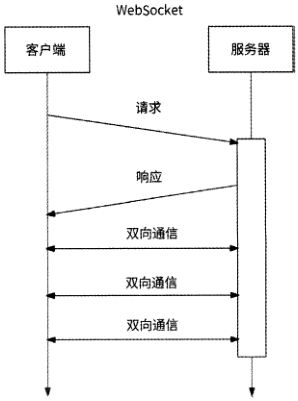
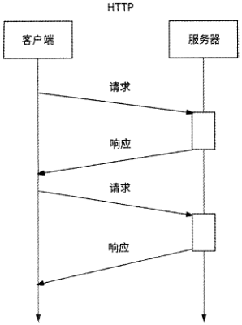
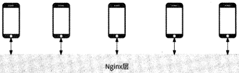
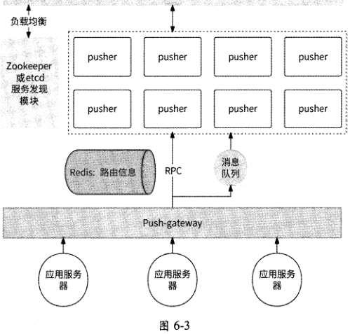
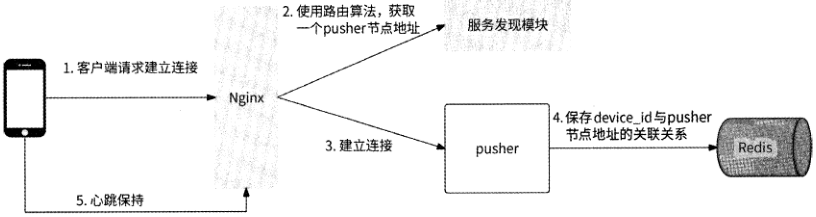
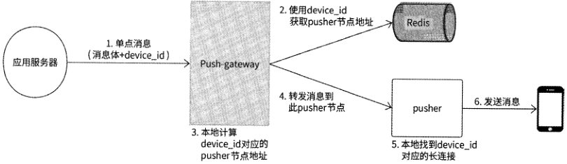
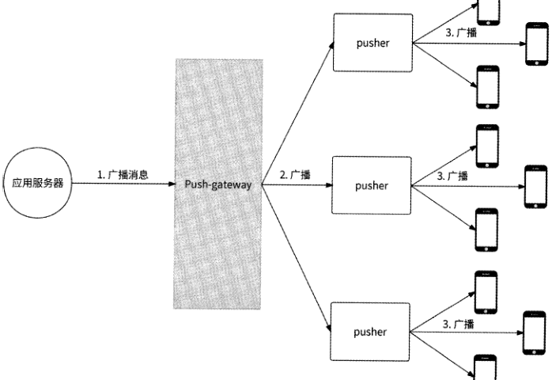
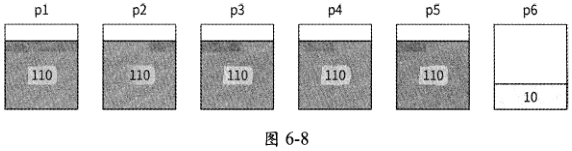

[原 PDF 第 232 页](../%E4%BA%BF%E7%BA%A7%E6%B5%81%E9%87%8F%E7%B3%BB%E7%BB%9F%E6%9E%B6%E6%9E%84%E8%AE%BE%E8%AE%A1%E4%B8%8E%E5%AE%9E%E6%88%98%20%28--%29%20%28manongshu.com%29.pdf#page=232)

# 第6章 海量推送系统

“推送”指的是把消息主动地实时推到客户端的行为。在互联网早期发展阶段，推送更多地属于即时通信（IM）领域范畴，但是随着移动互联网的普及，大量用户会维持很长时间的在线状态，于是对消息的实时触达能力有了广泛的需求。不仅仅在即时通信领域，几乎所有当代的互联网应用都对推送有大量的场景需求。例如，社交互动类应用会实时通知与你相关的新互动（关注/私聊/回复/点赞）、你关注的人发布了新内容、在直播间内谁给主播赠送了礼物；电商类应用会告诉你所收藏的商品刚刚降价了、你的订单已完成退款、你的物流已到达目的地、你观看的带货直播间有新商品“上车”；新闻类应用会推送你感兴趣的新闻和实时热点新闻；更为普遍的是，大量应用都有系统版本升级主动提醒、重要全服公告能力等。如上种种，都是非常典型的推送场景。在如今这样一个大数据个性化推荐的时代，很多应用出于保持用户活跃度的目的，甚至会投你所好，推送你可能感兴趣的消息，比如图6・1所展示的那样。

'最近通知

S

网分岫

```text
                       I    N元无门槛优惠券｝看看为你推荐了瞒家店
```

昨天

黑五最受欢迎底妆揭榜！爱丽小屋修容棒68赫拉

限蠹气垫带替换229 age 25爱敬气垫保湿精华粉

底焉164…总有一款适合你

```text
                        遂!美团    昨天19：20
```

这部2016年风靡日本的前漫.终于要在中国上映

了！

图6-1

[原 PDF 第 233 页](../%E4%BA%BF%E7%BA%A7%E6%B5%81%E9%87%8F%E7%B3%BB%E7%BB%9F%E6%9E%B6%E6%9E%84%E8%AE%BE%E8%AE%A1%E4%B8%8E%E5%AE%9E%E6%88%98%20%28--%29%20%28manongshu.com%29.pdf#page=233)

消息推送的应用场景如此广泛，我们很有必要来讨论一下推送系统这个议题。我们希望设计一个通用的推送系统，支持各种业务方主动向在线用户发出各种各样的事件消息，而且它能服务于百万级、千万级甚至上亿级的在线用户，并在保证消息实时到达的同时，

有较高的性能，具备高可用性。

本章的学习路径与内容组织结构如下。

- 6.1介绍推送系统的核心，即分布式长连接服务的技术要素，包括WebSocket协议、长连接服务器、分布式推送服务器和路由算法。

- 6.2节详细介绍海量推送系统的设计。首先给出整体架构，然后分别介绍长连接的建立过程、消息格式设计、消息推送接口设计和各种消息类型的推送细节，最后

介绍pusher的平滑升级与扩容。

本章关键词：WebSocket.长连接、分布式推送、单点消息推送、多点消息推送、全

局消息推送、平滑升级。

## 6.1 分布式长连接服务的技术要素分析

------------------------------ --- ------------------------------------- -

一般来说，客户端与服务器的交互都是客户端主动发起请求，服务器进行应答的方式。而消息推送场景则不一样，服务器需要主动向客户端发起请求，那么推送系统必然需要客户端与服务器保持长连接，即推送系统需要构建长连接服务。长连接服务是推送系统设计

的核心，我们的所有讨论都会围绕它展开。

### 6.1.1 WebSocket协议简介

客户端一般通过HTTP与远程服务器进行网络通信。HTTP采用了请求/响应模型，它是一种无状态、无连接、单向的应用层协议。网络请求只能由客户端主动发起，服务器被

动接收请求进行应答，原生HTTP无法实现服务器主动向客户端发送数据。

采用请求/响应模型注定：如果服务器有信息变更想告知客户端，则交互会变得非常麻烦。比如客户端每隔几秒就要对服务器进行一次请求轮询，检查是否有新消息待接收。这种方式看起来简单粗暴，但是在使用轮询时需要格外谨慎，因为轮询本身效率低下，实时性不佳，不仅浪费了大量网络带宽，而且会让服务器增加无谓的访问压力。

在这种困境下,HTML 5定义了一种全新的通信协议:WebSocket,并于2011年被IETF定义为标准RFC 6455O WebSocket是一种基于TCP的全双工通信协议，允许在客户端与服务器之间建立全双工通信连接，这样客户端和服务器都可以主动将数据推送到另一邑。如图6-2所示，WebSocket仅需要建立一次连接就能一直保持连接状态，比轮询的效率周。

[原 PDF 第 234 页](../%E4%BA%BF%E7%BA%A7%E6%B5%81%E9%87%8F%E7%B3%BB%E7%BB%9F%E6%9E%B6%E6%9E%84%E8%AE%BE%E8%AE%A1%E4%B8%8E%E5%AE%9E%E6%88%98%20%28--%29%20%28manongshu.com%29.pdf#page=234)





图6-2

由于WebSocket协议很适合消息推送场景，所以我们可以在客户端开发一个基于WebSocket协议的长连接通信SDK,客户端通过调用这个SDK来创建专门用于接收服务器推送消息的通道。对于各种推送类型的业务场景，客户端都从这个专用通道接收推送的

消息。

### 6.1.2 长连接服务器

客户端通过WebSocket协议与服务器建立长连接，从服务器的视角来说，其本身应该是一台可支持高并发、对长连接进行维护和管理的服务器。下面简单回顾常见的高并发服务器模型。

- accept+fork多进程模型：当一个客户端连接到来时，分配一个子进程负责处理这个连接的读/写请求，即一个连接对应一个进程。这种模型虽然简单、直观，但是缺点明显，大量连接会生成等量的进程，服务器资源消耗较大。

- accept+thread多线程模型：它是对多进程模型的优化。当一个客户端连接到来时，分配一个线程负责处理这个连接的读/写请求，即一个连接对应一个线程。虽然线程相比进程节约了一些资源，但是治标不治本，当连接量太大时，依然会有较大的服务器资源消耗。早期Tomcat曾使用过这种设计。

- 单线程多路复用模型：在单线程中使用epoll对所有的连接进行监听管理，当没有事件到来时，线程被epoll_wait阻塞；而当有连接读/写事件到来时，线程从阻塞中返回并回调handlero这种方式也被称为Reactor模式，其很适合有大量连接的I/O密集型场景。不过，由于只能使用单核CPU,如果handler耗时过长，则会影

[原 PDF 第 235 页](../%E4%BA%BF%E7%BA%A7%E6%B5%81%E9%87%8F%E7%B3%BB%E7%BB%9F%E6%9E%B6%E6%9E%84%E8%AE%BE%E8%AE%A1%E4%B8%8E%E5%AE%9E%E6%88%98%20%28--%29%20%28manongshu.com%29.pdf#page=235)

响服务器整体响应时间。此模型的典型代表是Rediso

- 多进程多路复用模型：它是对单进程多路复用模型的优化。其充分利用了多核能力，且对handler的耗时有一定的容忍性。此模型的典型代表是Nginxo

- 多线程多路复用模型：与多进程多路复用模型类似，只不过它用多线程代替了多进程。此模型的典型代表是缓存服务器Memcachedo

推送服务器的主要职责是与客户端建立长连接，并将上游消息转发到客户端，是一台相对纯粹的消息转发服务器，属于典型的I/O密集型应用。所以，根据对上述常见的高并发服务器模型的简单分析，只要是多路复用类型的模型，就是比较合适的选型。使用单线程多路复用模型，无须考虑并发安全，开发较为简单，但是仅局限于单核CPU；而使用多进程/多线程多路复用模型，可以充分利用多核CPU,不过出于并发安全的考虑，有一定的开发成本。由于推送服务器的逻辑较为轻量级，这些服务器模型均可以较为优秀地支持数十万个长连接并发访问。

我们暂且称这台负责与客户端建立连接以及推送消息的单体长连接服务器为puShero

### 6.1.3 分布式推送服务器

一台pusher服务器虽然可以承载数十万个客户端设备的长连接，但是由于同时在线的用户设备远不止这个数量级，可能有数百万个、数千万个乃至上亿个设备，所以一个pusher节点是无法满足要求的。另外，单体服务器天然不具备高可用性和可扩展性，所以势必需要将若干pusher节点组成一个分布式pusher集群对外提供服务。

将若干pusher节点组成一个分布式pusher集群，我们需要考虑如下主要问题。

- 问题1:集群中有哪些pusher节点，以及每个pusher节点的地址信息、每个pusher节点的活跃状态等，在哪里维护？

- 问题2：当一个客户端设备连接到来时，我们选择哪一个pusher节点与其建立连接？

- 问题3：当一条消息需要被推送给某个或某些设备时，我们如何找到这个或这些设备对应的长连接，它们在哪个或哪些pusher节点上？

- 问题4：当pusher集群需要扩容时，对存留的长连接如何处理？是否需要或者说是否能做到连接迁移？

问题1很好回答，无非就是服务发现问题。我们可以使用ZooKeeper或etcd等分布式一致性中间件来维护pusher节点列表：每当集群中新增pusher节点时，就向ZooKeeper进行地址注册，同时针对pusher节点的日常运行也向ZooKeeper ±报心跳信息。如此一来，就可以从ZooKeeper中获取在工作的pusher节点地址列表了。

问题2和问题3的本质其实是一样的，即我们需要提供一套什么样的设备连接与pusher节点的关联规则。利用这套关联规则，我们可以为设备连接选择具体的pusher节点，

[原 PDF 第 236 页](../%E4%BA%BF%E7%BA%A7%E6%B5%81%E9%87%8F%E7%B3%BB%E7%BB%9F%E6%9E%B6%E6%9E%84%E8%AE%BE%E8%AE%A1%E4%B8%8E%E5%AE%9E%E6%88%98%20%28--%29%20%28manongshu.com%29.pdf#page=236)

并可以知道哪些设备与哪些pusher节点连接。设备连接与pusher节点的关联规则，其实就是路由问题，更通俗的叫法是负载均衡。这个问题会在下一节中具体介绍。

对于问题4,不同于分布式存储系统扩容时的数据迁移，推送系统的长连接本身不是实体数据，无法做到跨机器迁移，只能断开与旧服务器的连接，再连接新服务器。为了不让用户感知到重连，客户端应充分权衡影响面后再做决定。

### 6.1.4 路由算法

推送系统有两处需要利用路由算法。

- 用户设备发起连接请求，pusher集群需要通过路由算法，选择一个合适的pusher节点与这个用户设备建立连接。

- 当向某个device id进行消息推送时，pusher集群需要通过路由算法，找到这个device id与哪个pusher节点建立了长连接。

对路由算法的选型，要尽量保证各个用户设备的连接可以被均匀地分配到集群中的每个pusher节点上，不能出现有的pusher节点连接过多且趋于饱和，而有的pusher节点长期空闲的情况。此外，由于不同用户设备的长连接被分配到不同的pusher节点上，当我们想向指定的设备发送推送类型的消息时，必然需要知道这个用户设备在哪个pusher节点上，这样才能把待推送的消息转发到有此设备连接的pusher节点上，然后由此pusher节点进行真正的下行消息的下发。所以，我们需要时刻知道每个用户设备的device_id与pusher节点地址的关联关系。

常见的路由算法如Random （随机调度）算法、Round-Robin （轮询调度）算法、一致性Hash算法，都可以较好地保证连接均匀地分布在pusher集群的每个节点上。不过，不同的算法在推送消息时获取device id与pusher节点地址的关联关系的方式有较大差异。

- 对于Random算法、Round-Robin算法：由于device_id与pusher节点地址的关联关系没有数学规律性（即不能通过一个固定的公式得到），我们无法直接获取到某个device_id对应于哪个pusher节点的信息，所以不得不在设备与pusher节点建立连接时而用一种外部存储系统来保存两者的关联关系。这里笔者推荐使用Redis

分布式存储，一方面，Redis有足够高的读/写性能，可以应对海量消息推送时的

查询路由请求；另一方面，这种关联数据并非一定要保证在极端条件下不丢失，

使用内存型存储是没有太大问题的。

- 对于一致性Hash算法或其他Hash算法：由于device id与pusher节点地址的关联关系有明确的数学公式指导，也就是可以直接算出，我们无须使用外部存储系统来保存两者的关联关系。

既然一致性Hash算法作为路由算法可以免去额外存储device_id与pusher节点地址的

[原 PDF 第 237 页](../%E4%BA%BF%E7%BA%A7%E6%B5%81%E9%87%8F%E7%B3%BB%E7%BB%9F%E6%9E%B6%E6%9E%84%E8%AE%BE%E8%AE%A1%E4%B8%8E%E5%AE%9E%E6%88%98%20%28--%29%20%28manongshu.com%29.pdf#page=237)

关联关系，那么它是否就是最合适的算法呢？其实未必，我们还没有考虑pusher集群中节点变化的情况。

如果目前pusher集群的压力较大而需要进行服务扩容，那么当向集群中新增一个pusher节点pl时，在一致性哈希环上与其相邻的pusher节点pO上大约一半的device id都要指向pl节点，这些device_id与pO节点的长连接必须断开，再重连到pl节点。可以看出，一致性Hash算法在面对pusher集群的扩容时有较多额外的工作要做。

而Round-Robin算法对集群的扩容比较友好，当向集群中新增一个pusher节点pl时，全部存留的长连接都不需要进行迁移，所有的device_id与pusher节点地址的关联关系依然是有效的。

选择哪种路由算法，其实没有绝对的好坏之分，需要工程师来分析各种算法的优劣进行权衡。

在完成路由算法的选型后，下一步就是由谁来负责计算路由和转发请求。

对于设备的建立连接请求，我们可以让它们统一指向一个代理层服务器，比如Nginx,由Nginx负责通过路由算法选择一个pusher节点与设备建立连接。

对于后端消息的推送请求，我们可以提炼出一个下行消息到pusher集群的代理网关，由它负责根据消息的目标设备进行路由计算，把消息转发到对应的pusher节点上。

## 6.2 海量推送系统设计

在6.1节中我们对推送系统涉及的关键技术做了基本介绍，本节将介绍推送系统的整体架构设计。

### 6.2.1 整体架构设计

推送系统的整体架构如图6・3所示，其中：

- Nginx作为客户端设备与推送系统交互的代理,负责客户端建立连接的负载均衡与消息的最终下发；

- 每个pusher节点都负责与不同的客户端建立长连接，是消息的核心推送者；

- ZooKeeper/etcd负责Nginx请求pusher集群时的服务发现，为Nginx转发连接请求时给出当前可用的pusher节点列表，进而帮助客户端连接到合适的pusher节点；

- Redis集群负责保存用户设备与pusher节点的关联关系（如果采用Round-Robin等无数据规则的路由算法）；

- Push-gateway作为下行消息到pusher集群的代理网关，负责后端应用服务与推送系统之间的交互，包括按照单点消息、多点消息以及全局消息的方式进行消息的

[原 PDF 第 238 页](../%E4%BA%BF%E7%BA%A7%E6%B5%81%E9%87%8F%E7%B3%BB%E7%BB%9F%E6%9E%B6%E6%9E%84%E8%AE%BE%E8%AE%A1%E4%B8%8E%E5%AE%9E%E6%88%98%20%28--%29%20%28manongshu.com%29.pdf#page=238)

路由转发，是后端应用服务与推送系统之间的唯一代理;

- 消息队列负责消息的异步发送。





### 6.2.2 长连接的建立过程

在客户端与推送系统之间建立长连接的过程如下所述，如图6・4所示。

(1 )当客户端进行登录/启动时，客户端长连接通信SDK使用WebSocket与后端尝试建立连接，在建立连接时可以携带若干客户端基本信息，如用户ID、设备device_id,设备版本号等。

(2 ) Nginx收到客户端的建立连接请求，使用所设定的路由算法，选择一个pusher节点与其建立长连接。

(3)如果推送系统采用了 Round-Robin等无数据规则的路由算法，则需要同时将device id与pusher节点地址的关联关系以Key-Value的形式保存到Redis集群中。存储数据结构类型可以采用Key-Value的形式，其中Key是用户设备device id, Value是对应的

[原 PDF 第 239 页](../%E4%BA%BF%E7%BA%A7%E6%B5%81%E9%87%8F%E7%B3%BB%E7%BB%9F%E6%9E%B6%E6%9E%84%E8%AE%BE%E8%AE%A1%E4%B8%8E%E5%AE%9E%E6%88%98%20%28--%29%20%28manongshu.com%29.pdf#page=239)

pusher节点的IP:port地址。

(4 ) pusher节点与客户端建立长连接后，将device_id与连接Socket文件描述符fd的关联关系保存到本地内存中。

(5 )客户端周期性地与pusher节点在长连接上确认心跳，如果pusher节点在所设定的时间内没有收到心跳，则认为客户端长连接已断开，关闭其连接。



图6-4

### 6.2.3 消息格式设计

pusher节点发送到客户端的消息格式设计如表6-1所示(这里仅列出了最重要的消息字段，其他字段可以根据具体需求进行添加)。

表6-1

消息名：PushMessage

```text
               类 型    含 义    用 途
```

字段名

```text
 uuid    客户端使用这个唯一 ID识别重复的消息    uint64    消息的唯一 ID
 targetdid    uint64    消息的目标device_id    客户端用它来检查消息是否是发给自己的
 unique_name    string    消息的业务专用名称，指明payload    客户端用它来识别此推送的消息的真正消息体
 payload    string    序列化的消息内容    真正的消息体
 encode_type    int    序列化方法    客户端根据序列化方法，正确解析payload
```

下面对表6-1中的字段进行详细说明。

- uuid：每条消息都有自己独有的唯一 ID,客户端可以使用这个唯一 ID判断消息是否是重复下发的，如果是则丢弃此消息。此外，唯一 ID也可以协助服务端和客户端的工程师进行消息触达的测试与调试。

- target did：消息的目标device_id,客户端可以将目标device_id与本地device_id进行对比，如果不一致则丢弃消息。这是为了防止推送系统在遇到某些异常时将消息错发到其他设备。

[原 PDF 第 240 页](../%E4%BA%BF%E7%BA%A7%E6%B5%81%E9%87%8F%E7%B3%BB%E7%BB%9F%E6%9E%B6%E6%9E%84%E8%AE%BE%E8%AE%A1%E4%B8%8E%E5%AE%9E%E6%88%98%20%28--%29%20%28manongshu.com%29.pdf#page=240)

- unique_name：用于告知客户端此消息中的payload数据实际上是哪段业务逻辑所需要的，以便客户端能把消息交给对应的handler来处理。

- payload：真正的消息体，不同业务场景的推送数据有不同的格式，将推送数据序列化到pay load o

- encode type:指明payload的编码方式，用于告知客户端应该使用何种方式对payload进行解析。

我们可以通过一个例子来加深对上述后三个字段的理解。假设某个用户对你的文章发表了评论，产品经理希望系统可以在客户端的屏幕顶部弹出通知告诉你：“A对你的文章B发表了评论：xxx”，那么负责文章评论模块的服务端开发人员和客户端人员共同约定了如下通知格式（假设采用了 protobuf协议）：

```text
message CommentNotify {
    int64 user_id;    // 评论人工D
```

string nickname; // 评论人昵称

int64 article_id; // 文章 ID

```text
    string comment; // 评论内容    string article_title; // 文章标题
```

在服务端，会使用protobuf将这个通知序列化保存到推送系统的消息结构PushMessage的payload字段，可以将unique_name字段设置为CommentNotify,将encode_type字段设置为 PROTO_BUFo

当客户端收到这条推送的消息时，首先根据unique name识别出这是评论通知，准备好CommentNotify结构处理解析结果；然后根据encode_type得知消息体是protobuf格式的，于是使用protobuf格式将payload内容解析到CommentNotify结构；最后客户端完整地获取到服务端下发的通知。

### 6.2.4 消息推送接口

推送系统暴露给后端应用服务的消息推送接口设计如下:

```text
enum PushType    //消息类型
```

Default,

```text
                 //单点消息
```

Single,

```text
                 //多点消息
```

Group,

```text
                 //全局消息
```

Broadcast,

```text
//推送消息请求格式
struct PushMessageReq {
   1: required PushType PushType,    //消息理型
   2: list<i64> TargetDeviceIdsA    //目标device id列表
```

[原 PDF 第 241 页](../%E4%BA%BF%E7%BA%A7%E6%B5%81%E9%87%8F%E7%B3%BB%E7%BB%9F%E6%9E%B6%E6%9E%84%E8%AE%BE%E8%AE%A1%E4%B8%8E%E5%AE%9E%E6%88%98%20%28--%29%20%28manongshu.com%29.pdf#page=241)

3: required i64 Uuid,

4: required string UniqueName,

5: required string Payload,

6: required i32 EncodeType,

```text
}
//推送消息响应格式
```

struct PushMessageResp (

```text
   1: i32 StatusCode,    //成功，返回0;失败，返回错误码
```

2 : string ErrMessage, // 错误描述

```text
}
```

service PushMessageService (

PushMessageResp PushMessage (1: required PushMessageReq req) // 推送消息接口

```text
}
```

业务服务端需要先构造推送消息请求结构PushMessageReq：使用PushType字段指定消息类型是单点消息、多点消息还是全局消息；使用TargetDevicelds字段指定具体要发送的目标device_id列表。如果是单点消息，那么这个列表仅有一个device_id；如果是多点消息，那么这个列表有若干device_id；如果是全局消息，那么这个列表为空即可。请求格式中其他字段的说明与PushMessage结构相同。

业务服务端构造完推送消息请求结构后，调用推送系统的PushMessage接口进行消息推送。如果消息推送成功，则接口会返回PushMessageResp告知推送成功。如果不成功，则会额外携带错误信息。

### 6.2.5 单点消息推送的细节

将一条单点消息从服务端推送到客户端的完整过程如下所述，如图6-5所示。

(1 )单点消息携带推送的消息体payload、推送的目标device_id,将推送消息请求发送到 Push-gatewayo

(2 ) Push-gateway从Redis集群中查询消息目标device id对应的pusher节点地址。

(3)如果无须访问Redis,则Push-gateway使用与建立长连按时相同的路由算法，计算出消息目标device_id对应的pusher节点地址。

(4 ) Push-gateway将消息转发到计算出的pusher节点。

(5 ) pusher节点在本地内存中查询长连接文件描述符fd。

(6) pusher将消息发送到fd上，下行消息推送完成。

[原 PDF 第 242 页](../%E4%BA%BF%E7%BA%A7%E6%B5%81%E9%87%8F%E7%B3%BB%E7%BB%9F%E6%9E%B6%E6%9E%84%E8%AE%BE%E8%AE%A1%E4%B8%8E%E5%AE%9E%E6%88%98%20%28--%29%20%28manongshu.com%29.pdf#page=242)



图6-5

### 6.2.6 全局消息推送的细节

对于要发送给全部在线用户的推送的消息，我们可以让Push-gateway将推送的消息广播到所有pusher节点，由每个pusher节点将消息数据写入本地每个连接中。

这里涉及两个“写放大”，如图6-6所示，其中：

- Push-gateway需要轮询所有M个pusher节点并进行消息的转发，写放大M倍;

- 假设一个pusher节点本地维护N个长连接，当它收到一条全局的推送的消息时，需要把消息发送到所有长连接的发送缓冲区，网络带宽会瞬间增大，写放大N倍。



图6-6

[原 PDF 第 243 页](../%E4%BA%BF%E7%BA%A7%E6%B5%81%E9%87%8F%E7%B3%BB%E7%BB%9F%E6%9E%B6%E6%9E%84%E8%AE%BE%E8%AE%A1%E4%B8%8E%E5%AE%9E%E6%88%98%20%28--%29%20%28manongshu.com%29.pdf#page=243)

通常而言，一个被部署在商业级服务器上的长连接推送服务节点经过高性能设计，可以同时承载十多万个乃至数十万个长连接。也就是说，仅1000个pusher节点就可以管理承载上亿个在线用户的长连接。

如果有条件，部署pusher节点的服务器性能较高、网卡读/写快，那么由于pusher节点的单机长连接数量可以很大，pusher节点不会很多，所以MxN倍的写放大压力很容易

被接受。

但是如果条件有限，网卡的性能一般，甚至云服务器的性能较差，该怎么办？

我们可以换一种思路来解决这个问题。全局消息一般是系统推送的消息，这种消息对于同时到达全部用户的诉求不高，所以可以让一部分用户先收到消息，另一部分用户稍后

收到消息。于是，我们可以尝试依次分批发送的思路。

广播的批次M可以根据服务器的性能而定，假设批次为1°°。

(1 )在Push-gateway上通过mod操作将发往设备X的消息分别归到批次Y，即将device_id%100作为批次顺序。

(2 ) Push-gateway与每个pusher节点都建立一个广播消息队列通道，并在消息体PushMessage结构中将新增字段hash_id作为批次顺序ID； Push-gateway收到全局消息后，将消息分为100次向消息队列投递：

- 第1次全局消息投递，设置hash_id=O,发送到消息队列；

- 第2次全局消息投递，设置hash_id=l,发送到消息队列；

- 第100次全局消息投递，设置hash_id=99,发送到消息队列。

(3 )每个pusher节点收到消息后，都根据hash_id向本地维护的满足device_id%100的长连接发送这条消息。

这样一来，通过将全局消息分M次分批逐步发送，可以使得原来的全局消息推送开销下降到\IM°

### 6.2.7 多点消息推送的细节

为了支持多点消息推送，一条推送的消息的目标可以是多个device_ido推送系统在接收到多点消息后，需要找到每个目标device_id对应的pusher节点地址，然后向这些pusher节点转发消息。这里的重点是如何高效地找到所有device_id对应的pusher节点列表。

如果pusher节点与客户端建立连接时使用的是如一致性Hash等有数据规则的路由算法，则Push-gateway在处理多点消息时，无论有多少个目标device_id,都可以在本地内

[原 PDF 第 244 页](../%E4%BA%BF%E7%BA%A7%E6%B5%81%E9%87%8F%E7%B3%BB%E7%BB%9F%E6%9E%B6%E6%9E%84%E8%AE%BE%E8%AE%A1%E4%B8%8E%E5%AE%9E%E6%88%98%20%28--%29%20%28manongshu.com%29.pdf#page=244)

存中很快计算出相关的pusher节点地址，然后进行消息的转发。

而如果pusher节点与客户端建立连接时使用的是如Round-Robin等无数据规则的路由算法，此时device_id与pusher节点地址的对应关系被存放在Redis中，那么Redis的MGET命令可以支持我们一次性获取所有device id对应的pusher节点地址。

不过，Redis MGET是一个危险的命令。如果目标device id较少，比如少于50个，那么使用MGET没有太大问题；但是当目标device_id较多时，MGET会为Redis存储系统带来较大的风险，例如：

- 一次性获取过多的Key, Redis服务器需要较大的内存来存放响应数据，有较大的内存溢出风险；

- 如今大部分互联网公司的Redis架构都是类似于Codis的方式，由Proxy对Redis进行集群分片管理。为了满足MGET的需要，Proxy不得不启动多个线程向各个相关的Redis分片分发MGET请求。一次性获取过多的Key,可能造成Proxy启动大量线程，占用较多的系统资源，最终影响Redis存储服务的质量。

所以说，如果多点消息涉及的目标device_id较多，则不宜直接从Redis中获取pusher节点地址。让我们换一个思路：既然目标device_id较多，那么涉及的pusher节点大概率也较多，我们不如像全局消息那样将多点消息直接广播到各个pusher节点。如果pusher节点有相关的device_id长连接，则进行消息的推送，否则丢弃消息即可。

总的来说，多点消息的处理逻辑取决于长连接的路由算法。

（1 ） Hash类路由算法：无论目标device_id有多少，Push-gateway都可以直接计算出pusher节点地址，然后进行消息的转发。

（2） Round-Robin类路由算法：进一步检查目标device_id的数量是否达到阈值（如50 个）。

- 如果未达到阈值，则Push-gateway通过Redis MGET获取相关的pusher节点地址列表，然后进行消息的转发。

- 如果超过阈值，则Push-gateway向全部pusher节点广播此消息，由pusher节点自己判断是推送消息还是丢弃消息。

### 6.2.8 pusher平滑升级的问题

pusher服务器本身也是一个服务，也有系统开发、迭代升级或Bug修复，这就避免不了让原pusher进程退出和启动新的pusher进程。但是由于pusher服务器是一台长连接服务器,pusher进程退出会导致所有长连接被关闭。假设一个pusher节点保持了 10万个客户端连接，在对pusher节点进行服务更新时，这10万个长连接就都断掉了，此时对应的

[原 PDF 第 245 页](../%E4%BA%BF%E7%BA%A7%E6%B5%81%E9%87%8F%E7%B3%BB%E7%BB%9F%E6%9E%B6%E6%9E%84%E8%AE%BE%E8%AE%A1%E4%B8%8E%E5%AE%9E%E6%88%98%20%28--%29%20%28manongshu.com%29.pdf#page=245)

5万个客户端设备感知到长连接被重置，于是几乎在同一时间开始重新建立连接，推送系统会收到10万QPS的瞬时激增流量。

瞬时激增的10万个连接请求可能会直接击垮推送系统，导致整个系统无法创建长连接，这是一个极大的风险。针对这种情况，我们可以为建立连接的入□ Nginx增加限流来保护推送系统。那么，我们是否有更好的方式，比如提供一种更加优雅的Pusher节点升级方式，使得已建立的长连接得到保持？

其实，这是一个老生常谈的话题，它有成熟的解决方案：长连接服务平滑重启，业界高性能服务器如Nginx、Service Mesh的MOSN Sidecar都有平滑升级功能。根据笔者的研究，这些支持平滑升级的TCP服务器普遍采用了如下关键技术。

- 信号技术：使用自定义信号如SIGUSR2作为进程升级事件，而非直接杀死进程。

- fork+exec技术：父进程调用fork()创建子进程，子进程调用exec()载入最新程序二进制文件，原父进程的文件打开信息会被自动继承下来。

- UnixSocket协议：支持在进程间传输文件描述符。

平滑升级的原理可以被描述为：原服务进程以收到的SIGUSR2信号作为进程升级事件并监听此信号；当系统发起升级操作时，系统向父进程发送SIGUSR2信号。父进程收到此信号，开始调用fork()创建子进程，子进程调用exec()载入最新程序一进制文件。而后父进程将本进程内全部连接的Socket文件描述符都通过UnixSocket协议调用sendmsg()发送到子进程，同时停止本进程内一切最新数据的处理操作；子进程收到Socket文件描述符并接管此Socket后续数据的读/写处理，并通知父进程终止。

平滑升级的流程如下。

(1) 系统准备升级服务，向父进程发送SIGUSR2信号。

(2) 父进程收到SIGUSR2信号，准备更新服务。

(3 ) SIGUSR2信号处理函数会调用fork()创建一个子进程，子进程调用execQ#入最新的待升级二进制文件，并携带一个约定参数表示新进程是通过重启加载的。

(4)在父进程内不再对listen_fd读取新连接，且不再对各客户端连接读取数据，即停止对一切Socket的处理工作。

(5 )父进程启动一个UnixSocket,并尝试调用sendmsg()向其发送listen_fd和全部客户端连接fd,直到全部成功才停止。

(6 )使用exec()启动子进程后，子进程通过运行参数判断自己是否是通过重启启动的。如果是，则子进程不主动创建listen_fd,而是创建与父进程同路径的UnixSocket,用于接收父进程传输的信息。

[原 PDF 第 246 页](../%E4%BA%BF%E7%BA%A7%E6%B5%81%E9%87%8F%E7%B3%BB%E7%BB%9F%E6%9E%B6%E6%9E%84%E8%AE%BE%E8%AE%A1%E4%B8%8E%E5%AE%9E%E6%88%98%20%28--%29%20%28manongshu.com%29.pdf#page=246)

（7）子进程收到listen_fd,直接调用accept。继续接收新的连接请求，此时子进程服务器正式可以对外提供服务了。

（8 ）子进程持续收到全部客户端连接fd,创建每个连接的handler继续处理连接的读/写请求，此时子进程服务器正式接管了父进程存量的客户端连接。

（9）子进程通知父进程终止，最终新进程替换了旧进程，整个升级过程平滑完成。

完整实现上述流程的C++程序如下（为了简洁、直观，程序代码采用了一个连接对应一个线程的服务器模型，且并未考虑并发问题，仅为展示平滑升级的主流程）：

```text
#include    <sys/socket.h>
#include    <stdio.h>
#include    <errno.h>
#include    <string.h>
#include    <strings.h>
#include    <arpa/inet.h>
#include    <stddef.h>
#include    <set>
#include    <pthread.h>
#include    <sys/types.h>
#include    <unistd.h>
#include    〈signal.h>
#include    <sys/un.h>
int listen_fdg ;    //以全局变量形式记录listen_fd
```

std: : set<int> cli_conns; // 巳连接客户端bool stop_handle = false; //是否停止处理连接的读/写请求

```text
//父进程向UnixSocket发送连接
{ ~ ~
```

int send_fd(int listen_fd, std::set<int> fdset)

```text
   int sockfd;
   struct sockaddr_un serun, cliun;
```

char sendbuffO [5] = "list**; // 表示发送的是 listen_fd

char sendbuff [5] = "send"; //表示发送的是客户端连接

char sendokbuff [3] = nokn; // 表示发送完成

```text
   char recvbuff[5];
   if ((sockfd = socket(AF_UNIX, SOCK_DGRAM, 0)) < 0){
       printf("create UNIX socket err:%s\nn,strerror(errno));
       return -1;
   }
   memset(Sserun, 0, sizeof(serun));
   serun.sun_family = AF_UNIX;
   strcpy (serun . sun_path, "server. socket") ;    // 子进程地址
   memset(&cliun, 0, sizeof(cliun));
   cliun.sun_family = AF_UNIX;
```

[原 PDF 第 247 页](../%E4%BA%BF%E7%BA%A7%E6%B5%81%E9%87%8F%E7%B3%BB%E7%BB%9F%E6%9E%B6%E6%9E%84%E8%AE%BE%E8%AE%A1%E4%B8%8E%E5%AE%9E%E6%88%98%20%28--%29%20%28manongshu.com%29.pdf#page=247)

```text
strcpy (cliun. sun_pathr "client, socket") ;    // 父进程地址
int size = offsetof (struct sockaddr_un, sun_path) + strlen(cliun.sun_path);
unlink("client.socketn);
if (bind(sockfd, (struct sockaddr *)&cliun, size) < 0) {
   perror(nbind error");
   exit (1);
}
struct msghdr msg = {);
msg.msg_name = (sockaddr *)&serun;
msg.msg_namelen = sizeof(serun);
struct iovec io;
msg.msg_iov = &io;
msg.msg_iovlen = 1;
cmsghdr cm;
cm.cmsg_len = CMSG_LEN(sizeof(int));
cm.cmsg_level = SOL_SOCKET;
cm.cmsg_type = SCM_RIGHTS;
msg.msg_control = &cm;
msg.msg_controllen = CMSG_LEN(sizeof(int));
// 发送
io.iov_base - sendbuff0;
io.iov_len = 5;
*(int*)CMSG_DATA(&cm) = listen_fd;
if (sendmsg(sockfd, &msg, 0) == -1)
{
 } 一    printf(nsendmsg err:%s\nnz strerror(errno));
    return send__fd (listen_fd, fdset);
io.iov_base = sendbuff;
io.iov_len = 5;
//发送客户端连接Socket
for (std::set<int>::iterator it = fdset.begin(); it != fdset.end(); ++it)
 (
    int fd = *it;
    *(int*)CMSG_DATA(&cm) = fd;
    if (sendmsg(sockfd, &msg, 0) == -1)
    (
       printf("sendmsg err:%s\nn,strerror(errno));
       continue;
    }
 }
//告知对方，已发送完全部Socket
io.iov_base = sendokbuff;
io.iov_len =3;
int ret = sendmsg(sockfd, &msg, 0);
if (ret == -1)
```

[原 PDF 第 248 页](../%E4%BA%BF%E7%BA%A7%E6%B5%81%E9%87%8F%E7%B3%BB%E7%BB%9F%E6%9E%B6%E6%9E%84%E8%AE%BE%E8%AE%A1%E4%B8%8E%E5%AE%9E%E6%88%98%20%28--%29%20%28manongshu.com%29.pdf#page=248)

```text
       printf("sendmsg err:%s\nnr strerror (errno));
       return -1;
    }
    //等待子进程告知服务可结束
    int n = recvmsg(sockfd, &msg, 0);
```

if (n < 0)

```text
    {
       printf("recvmsg err:%s\nnfstrerror(errno));
       return -1;
```

else if (n > 0)

```text
    {
       char* temp = (char*)msg.msg_iov[0].iov_base;
       temp[n] = 1\01;
       printf("received: %s\nn, temp);
```

11收到fin,说明可以结束父进程

```text
       if (strcmp(nfinn, temp) == 0)
       (
          printf("success!\nn);
          close(sockfd);
          return 0;
       }
    }
    return -1;
}
// SIGUSR2信号处理函数
{ ~
```

void signal_handler(int signo)

```text
   stop_handle = true;
    //仓罹子进程
   int pid = fork();
   if (pid == -1)
    {
       printf("fork err:%s\nn,strerror(errno));
       exit(1);
    }
   if (pid == 0)
       //子进程加载最新二进制文件，并传入reload变量表示服务升级
       int r = execl (H/usr/bin/new__version_binn, nnew_version__binnr nreloadnr NULL);
       if (r == -1)    _    _    _
```

一

```text
       (
          printf("execle err:%s\nn, strerror(errno));
       }
       return ;
   }
```

else

```text
       //父进程发送全部Socket
```

[原 PDF 第 249 页](../%E4%BA%BF%E7%BA%A7%E6%B5%81%E9%87%8F%E7%B3%BB%E7%BB%9F%E6%9E%B6%E6%9E%84%E8%AE%BE%E8%AE%A1%E4%B8%8E%E5%AE%9E%E6%88%98%20%28--%29%20%28manongshu.com%29.pdf#page=249)

```text
       int ret = send_fd(listen_fdgr cli_conns);
       if (ret =- -1)
       {
          printf(Hfailed\nn);
          exit(1);
       }
       exit(0);
    }
}
//客户端连接handler
```

( 一void* conn__handler (void *args)

```text
    int* ptr = (int*)args;
    int connfd = *ptr;
    char rbuff[10];
    char wbuff[] = "pong”；
    for (;;)
    {
       //不再处理请求
```

{ 一

if (stop_handle)

```text
          return nullptr;
       }
       int ret = ::read(connfd, rbuffz 10);
       if (ret == -1)
       {
          printf (nread data from conn:%d failed, err :%s\nn, connfd, strerror (errno));
          break;
       }
       else if (ret == EOF)
       (
          break;
       }
```

else

```text
       {
           if (strcmp(rbuff, "ping”) ！= 0)
           (
              printf(nread wrong data conn:%d, data:%s\nn, connfd, rbuff);
              break;
           }
           ret = ::write(connfd, wbuffz 4);
           if (ret == -1)
           {
              printf (nwrite data to conn:%d failed, err:%s\nn, connfd, strerror (errno));
              break;
           }
       }
    }
    cli_conns.erase(connfd);
```

[原 PDF 第 250 页](../%E4%BA%BF%E7%BA%A7%E6%B5%81%E9%87%8F%E7%B3%BB%E7%BB%9F%E6%9E%B6%E6%9E%84%E8%AE%BE%E8%AE%A1%E4%B8%8E%E5%AE%9E%E6%88%98%20%28--%29%20%28manongshu.com%29.pdf#page=250)

```text
} 「\ .    ::close(connfd);
   return nullptr;
//子进程读取父进程发送的Socket
```

{ 一int read_fd()

```text
   int listen_fd;
   struct sockaddr_un serun, cliun;
   socklen_t cliun_len;
   int sockfd, size;
   char buf[10];
   int i, n;
   char finbuff[5] = nfinn;
   if ((sockfd = socket(AF_UNIX, SOCK_DGRAM, 0)) < 0) {    } . 「' • ' . •
      perror("socket error");
      exit (1);
   memset(&serun, 0, sizeof (serun));
   serun.sun_family = AF_UNIX;
```

strcpy (serun. sun_path, "server. socket1*) ; // 子进程地址

```text
   memset(&cliunA 0, sizeof (cliun));
   cliun.sun_family = AF_UNIX;
```

strcpy (cliun. sun_pathz nclient. socket") ; // 父进程地址

```text
   size = offsetof(struct sockaddr_unz sun_path) + strlen(serun.sun_path);
   unlink ("server. socket**);
```

if (bind(sockfd, (struct sockaddr *)&serun, size) < 0)

```text
      perror("bind error");
      exit (1);
   }
   printf("UNIX domain socket bound\nH);
   struct msghdr msg = {);
   msg.msg_name = NULL;
   struct iovec io;
   io.iov_base = buf;
   io.iov_len = 10;
   msg.msg_iov = &io;
   msg.msg_iovlen = 1;
   while(1) {
      cmsghdr cm;
      msg.msg_control = &cm;
      msg.msg_controllen = CMSG_LEN(sizeof(int));
      n = recvmsg(sockfd, &msg, 0);
      if (n < 0) {
```

[原 PDF 第 251 页](../%E4%BA%BF%E7%BA%A7%E6%B5%81%E9%87%8F%E7%B3%BB%E7%BB%9F%E6%9E%B6%E6%9E%84%E8%AE%BE%E8%AE%A1%E4%B8%8E%E5%AE%9E%E6%88%98%20%28--%29%20%28manongshu.com%29.pdf#page=251)

```text
          perror(nread error");
          break;
       } else if(n == 0) (
          printf(nEOF\nn);
          break;
       }
       char* temp = (char*)msg.msg_iov[0].iov__base;
       temp[n] = *\0 *;    } …
       printf("received: %s\nnz temp);
```

if (strcmp ("list**, temp) == 0) // 收到 listen_fd

```text
       (
          listened = * (int*) CMSG_DATA (&cm);
          printf(nlisten-fd: %d\n”， listen__fd);
```

else if (strcmp (nsendn, temp) == 0) // 收到客户端连接 Socket

```text
       {
          int fd__to_read = * (int*) CMSG_DATA (&cm);
          int *ptr = new int;
          *ptr = fd_to_read;
          printf (nconn-fd: %d\nn, fd__to_read);
```

} 一 .

```text
          pthread_t tid;
          ::pthread_create(&tid, nullptr, conn_handler, (void*)ptr);
          ::pthread_detach(tid);
```

else if (strcmp (nokn r temp) == 0) //收到父进程完成发送Socket的通知

```text
       (
          msg.msg_name = (sockaddr *)&cliun;
          msg.msg_namelen = sizeof(cliun);
          io.iov_base = finbuff;
          io.iov_len = 3;
          if (sendmsg(sockfdr &msg, 0) == -1)
          (
             printf("sendmsg err:%s\nn,strerror(errno));
          }
       }
    }
} 一    close(sockfd);
   return listen_fd;
// 从 UnixSocket 中获取 listen_fd
{ ~ —
```

int get_listenfd_fromfork()) ~

```text
   return read_fd();
//自主创建listen_fd
int get_listenfd_fromcreate()    ( ― -
   int sockfd = : : socket (AF_INET, SOCK__STREAM, 0);
```

[原 PDF 第 252 页](../%E4%BA%BF%E7%BA%A7%E6%B5%81%E9%87%8F%E7%B3%BB%E7%BB%9F%E6%9E%B6%E6%9E%84%E8%AE%BE%E8%AE%A1%E4%B8%8E%E5%AE%9E%E6%88%98%20%28--%29%20%28manongshu.com%29.pdf#page=252)

```text
    if (sockfd == -1)
    (
       printf("create socket failed, err:%s\n", strerror(errno));
       return -1;
    struct sockaddr_in servaddr;
    ::bzero(&servaddr, sizeof (servaddr));
```

servaddr.sin_family = AF_工NET;

```text
    servaddr.sin_addr.s_addr - htonl(INADDR_ANY);
    servaddr.sin_port = htons(8888);
    if (::bind(sockfd, (struct sockaddr *)&servaddr, sizeof (servaddr)) == -1)
    {
       printf(nbind socket failed, err:%s\n", strerror (errno));
       return -1;
   if (::listen(sockfd, 512) == ~1)
    } •
    {
       printf (''listen socket failed, err :%s\nn, strerror (errno));
       return -1;
   return sockfd;
```

int main(int argc, char const *argv[])

```text
(
```

::signal (SIGUSR2, signal_handler) ; // 监听与注册 SIGUSR2 信号处理函数

```text
   //如果收到reload变量，则说明此进程是子进程，从UnixSocket中读取listen_fd
   if (strcmp(argv[argc - 1], nreload") == 0)
    (
    } ~ ~ ~
       listen_fdg = get_listenfd_fromfork();
```

else

```text
   {
       //否则，说明是进程首次启动，正常创建listen_fd
```

} 一 ~ 一

```text
       listen_fdg = get_listenfd_fromcreate ();
   socklen_t addr_len = sizeof (struct sockaddr_in);
   struct sockaddr addr;
   pthread_t tid;
   for (;;7
   {
```

if (stop_handle)

```text
          continue;
       }
       int *connfd = new int;
       // listen_fd监听新连接到来
       *connfd = ::accept(listen_fdg, &addrr &addr_len);
       if (*connfd == -1)
```

[原 PDF 第 253 页](../%E4%BA%BF%E7%BA%A7%E6%B5%81%E9%87%8F%E7%B3%BB%E7%BB%9F%E6%9E%B6%E6%9E%84%E8%AE%BE%E8%AE%A1%E4%B8%8E%E5%AE%9E%E6%88%98%20%28--%29%20%28manongshu.com%29.pdf#page=253)

```text
       printf (''accept failed, err:%s\nHr strerror (errno));
       return -1;
    }
   cli_conns.insert(*connfd);
   //创建连接handler
   if (::pthread_create(&tidr nullptr, conn_handler, (void*)connfd) == -1)
    {
       printf("create thread failed, err:%s\nn, strerror(errno));
       return -1;
} —    }
    ::pthread_detach(tid);
return 0;
```

### 6.2.9 pusher扩容的问题

pusher服务不仅与正常的业务服务一样涉及服务升级，而且为了应对请求量的逐渐增长，同样会有服务扩容的需求，以避免服务性能下滑。但是，由于长连接服务是一个典型的有状态服务，且长连接不是实体数据，无法直接迁移，所以其扩容行为会有各种各样的

问题需要解决。

当向pusher集群中新增一个pusher节点时，我们希望这个pusher节点能尽快分担在工作的pusher节点的压力。

但是，如果我们采用的路由算法是Random算法、Round-Robin算法等，那么在将一个新的pusher节点加入集群后，这个pusher节点并不能很有效地分担在工作的pusher节点的连接压力。下面以Round-Robin算法为例进行介绍。

假设有5个pusher节点pl〜p5,每个节点都承载了 100个长连接，现在系统压力很大，于是我们对推送系统进行扩容，新增pusher节点p6o此时这6个pusher节点的长连接数量分别为100、100、100、100、100、0,如图6・7所示。

```text
                pl    p2    p3    p4    p5    p6
```

0

```text
                ]00    100    100    100    100
```

图6-7

接下来有60个新客户端连接到来，pusher节点的长连接数量分别为110、110、110、110、110、10,如图6.8所示。

[原 PDF 第 254 页](../%E4%BA%BF%E7%BA%A7%E6%B5%81%E9%87%8F%E7%B3%BB%E7%BB%9F%E6%9E%B6%E6%9E%84%E8%AE%BE%E8%AE%A1%E4%B8%8E%E5%AE%9E%E6%88%98%20%28--%29%20%28manongshu.com%29.pdf#page=254)



我们可以发现，虽然已建立的连接可以继续保持，但是原来的5个pusher节点的压力还在以近似于扩容前的速率逐渐增长。这个例子说明在集群扩容时，Round-Robin算法并不能满足我们想要尽快均摊新连接的要求。

解决方法很简单，我们可以采用加权式Round-Robin算法：为每个pusher节点都引入权重，权重高的pusher节点优先对外建立连接。同时，对于新加入的pusher节点，在其开始工作的最初一段时间内为其设置较高的权重，当新的pusher节点达到与其他pusher节点相似的容量时，再将其权重下调到平均水平。这样一来，新的pusher节点在加入集群后，就能快速分担接下来的新连接压力，并能较快地与集群中的其他节点在长连接数量上持平。

而如果采用一致性Hash算法，则会遇到另一个问题：连接失效。当将新的pusher节点加入一致性哈希环中时，会使得环上相邻pusher节点的大量（约一半）长连接重新指向新的pusher节点，这些连接在原pusher节点上会全部失效，需要全部断开重新连接。通过6.2.8节的介绍，我们知道此时会有大量的客户端同时重新连接。为了防止出现这种情况，我们可以使用限流的方式来保护推送系统。另一种可行的做法是当新的pusher节点加入时，相邻pusher节点的受影响的长连接并不全部同时断开重新连接，而是逐步断开重新连接，拉长重新连接的时间线，减少瞬时请求量。

## 6.3 本章小结

本章主要讲解了应该如何设计一个推送系统，以及在设计推送系统时需要注意的一些技术细节。首先，客户端与pusher节点建立连接的路由算法非常重要，它直接决定了下行消息的转发路由逻辑与系统的可扩展性；其次，处理单点消息、多点消息、全局消息的推送，往往有不同的逻辑；最后，注意如何对pusher服务进行平滑升级和扩容。

[原 PDF 第 255 页](../%E4%BA%BF%E7%BA%A7%E6%B5%81%E9%87%8F%E7%B3%BB%E7%BB%9F%E6%9E%B6%E6%9E%84%E8%AE%BE%E8%AE%A1%E4%B8%8E%E5%AE%9E%E6%88%98%20%28--%29%20%28manongshu.com%29.pdf#page=255)


[原 PDF 第 256 页](../%E4%BA%BF%E7%BA%A7%E6%B5%81%E9%87%8F%E7%B3%BB%E7%BB%9F%E6%9E%B6%E6%9E%84%E8%AE%BE%E8%AE%A1%E4%B8%8E%E5%AE%9E%E6%88%98%20%28--%29%20%28manongshu.com%29.pdf#page=256)

核心服务设计篇
