[原 PDF 第 257 页](../%E4%BA%BF%E7%BA%A7%E6%B5%81%E9%87%8F%E7%B3%BB%E7%BB%9F%E6%9E%B6%E6%9E%84%E8%AE%BE%E8%AE%A1%E4%B8%8E%E5%AE%9E%E6%88%98%20%28--%29%20%28manongshu.com%29.pdf#page=257)

# 第7章 内容发布系统

在正式开始本章的学习之前，让我们先花一点儿时间来了解本章的学习路径与内容组织结构。

- 7.1节介绍内容发布系统的设计背景，即我们为什么要设计内容发布系统，针对这个系统需要考虑哪些业务与技术问题。

- 7.2节分析与设计内容数据的存储方式，并进行存储选型。

- 7.3节讨论内容审核主题，包括内容审核的必要性、内容审核的时机策略、如何审核内容，以及审核中心的对外交互流程。

- 7.4节重点围绕内容的生命周期管理展开，具体介绍内容的创建设计、内容的修改设计、内容审核结果处理与版本控制设计，以及内容的删除与下架设计。

- 7.5节讨论内容分发主题，设计一个从发布到大众可见的内容分发流程。

- 7.6节介绍内容展示设计，同时考虑了高性能与高并发请求的问题。

- 7.7节对前几节的设计进行知识汇总与复习，展示了内容发布系统的完整架构视图。

本章关键词：存储选型、版本控制、内容分发、内容审核、读多写少。

## 7.1 内容发布系统的设计背景

以用户活跃度为出发点的互联网产品都有一个共性：任何用户都可以自由地以各种形式创作一段内容来表达自己的观点，并将该内容曝光到各种频道，与其他用户进行内容互动和讨论。如图7.1所示，用户创建的内容可能是一段文字、几张图片、一个视频等，这些内容在发布后，会被投递到各种内容分发渠道，比如推荐流、好友动态、用户主页搜索栏等。

内容是创作者与其好友及陌生人进行社交互动的主要媒介，可以帮助优秀的内容创作者成为有大量粉丝关注的内容达人。另外，创作者要持续不断地发布有趣的内容，这样可以大大提升社交类产品的活跃度、关注度，并形成独特的社区文化，对产品本身的推广有

[原 PDF 第 258 页](../%E4%BA%BF%E7%BA%A7%E6%B5%81%E9%87%8F%E7%B3%BB%E7%BB%9F%E6%9E%B6%E6%9E%84%E8%AE%BE%E8%AE%A1%E4%B8%8E%E5%AE%9E%E6%88%98%20%28--%29%20%28manongshu.com%29.pdf#page=258)

极大的推动作用。

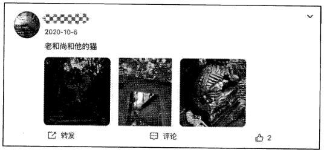

内容发布系统旨在管理从用户发布内容到内容为大众所见的全生命周期流程，包括新建内容、修改内容、内容审核、内容分发、内容下架等。可以说，内容发布系统是面向用户的应用的核心功能性系统之一。

内容发布系统并不是一个简单地进行内容创建与数据存储的系统，其中有很多的业务细节与技术细节需要考虑。这里先抛出如下几个实际问题。

- 内容的表现形式可能是短文字、长文字、图片、音频、视频，也可能是这些表现形式的组合，我们应该怎样合理地存储内容？

- 用户发布的内容可能涉及反动、血腥、色情等问题，我们应该怎样迅速检测并屏蔽这些内容？

- 内容渠道有很多，比如主页、推荐流、好友动态、搜索框等，我们应该怎样让这些内容渠道得知用户发布的内容？

- 内容一般读多写少，热门内容如热点新闻、明星八卦等都会直接吸引海量用户点击，我们应该怎样设计系统，才能避免系统因为无法应对海量用户的请求而导致内容无法被读取，甚至服务宕机？

怎么样？针对内容发布系统需要考虑的业务细节与技术细节是不是很值得探讨？下面就让我们带着这些问题，一步步地设计一个充分考虑了这些细节的内容发布系统。

## 7.2 内容存储设计

本节讲解如何进行内容存储设计。

### 7.2.1 内容数据的存储

正如在7.1节中抛出的第一个问题，内容的表现形式可能是短文字、长文字、图片、

[原 PDF 第 259 页](../%E4%BA%BF%E7%BA%A7%E6%B5%81%E9%87%8F%E7%B3%BB%E7%BB%9F%E6%9E%B6%E6%9E%84%E8%AE%BE%E8%AE%A1%E4%B8%8E%E5%AE%9E%E6%88%98%20%28--%29%20%28manongshu.com%29.pdf#page=259)

音频、视频等，也可能是这些表现形式的组合，我们应该怎样合理地存储内容？

相信有很多读者在学习数据库系统课程设计时都做过类似于博客系统的课程设计项目！这就是一种典型的内容发布系统。不妨回忆一下，当年懵懂的我们是怎么设计数据存

储的呢？当年的做法基本上都是很直白地把这些数据作为关系型数据库如MySQL的数据表中的一行来存储的，我们很有可能设计了表7-1所示的数据表。

表7・1

含 义

```text
      字段名    类    型
 id    库表的唯一自增主键，表示博文的唯一 ID    int64
                                 创作者的用户ID    ____
 creatorid    int64
 title    string    博文标题    ______________________________
 content    string    博文内容主体
 create time    int64    博文创建时间
```

可以看到，博文数据(博文标题、博文内容主体)和博文的元信息(博文唯一ID、创作者的用户ID、博文创建时间)被共同存储到数据表的一行中，仅需读取数据表中的一行数据就能完成对博文的读取。但这样的设计仅适合学生级别的项目，并没有真正的工

业级内容发布系统的使用价值，其原因如下。

(1 )关系型数据库只支持存储文章这种字符串类型的文本，并不支持存储图片、音频、视频这些文件数据，除非我们一意孤行，将文件数据也粗暴地当作文本存储到关系型数据

库中。

(2)即使是纯字符串类型的长文本存储，采用关系型数据库也很“别扭”。以MySQL的InnoDB存储引擎为例，InnoDB存储引擎的数据表是基于磁盘式B+树来实现的，在正常情况下，数据表的一行数据会被存储到B+树的叶节点；而如果某列文本类型的数据过长，则会占用较大的存储空间，进而严重影响B+树的查询效率。于是，InnoDB存储引擎选择将长文本数据单独存储到计算机磁盘的另一个区域，而非真正插入数据表B+树的磁盘区域，在数据表中仅保留对该磁盘区域的引用，以便在读取数据时根据引用找到数据真

正的磁盘存储区域。这样一来，每当读取一行完整的数据时，必然至少涉及B+树的磁盘I/O和另一个文本数据的磁盘I/O,这将导致MySQL读取数据的效率明显下降，且不符合关系型数据库的真正用途。

现在基本上可以得出结论：关系型数据库并不适合存储内容主体。

那么，我们应该如何高效地存储内容数据呢？其实，上面提到的InnoDB存储引擎处理长文本的方式，给了我们一定的指引方向，那就是将内容元信息和内容主体分开存储，仅将内容元信息存储到数据库B+树中，将内容主体存储到别处，内容元信息仅保存对内容主体的存储地址的引用。下面我们来进行存储设计。

[原 PDF 第 260 页](../%E4%BA%BF%E7%BA%A7%E6%B5%81%E9%87%8F%E7%B3%BB%E7%BB%9F%E6%9E%B6%E6%9E%84%E8%AE%BE%E8%AE%A1%E4%B8%8E%E5%AE%9E%E6%88%98%20%28--%29%20%28manongshu.com%29.pdf#page=260)

### 7.2.2 内容元信息的存储

内容元信息相对格式化，很适合被存储到关系型数据库中进行维护；而内容主体数据可能是文本、图片、音频、视频等各种形式或者它们的组合，这时使用关系型数据库就显得非常低效了，我们只能借助具有不同存储优势、不同存储原理模型的存储系统来存储这些数据（7.2.3节会详细讲解这些内容）。本节先来设计并确定适合存储到关系型数据库中的内容元信息的数据模型。

对内容元信息进行存储需要如下两张数据表相互配合。

- 信息表item info:存储真正决定对外发布的内容元信息，包括创作者ID、内容主体的存储地址、版本控制和审核管理（在7.3节中会进行详细解读）。

- 内容修改历史记录表item record：用于应对内容的修改操作，每次修改后的内容数据都先被暂存到这里，以便提供内容修改历史记录的查询途径。更重要的是，等待此内容修改被审核通过后再将其回写到信息表。

item info表需要拥有的字段包括但不限于表7-2中列出的这些。

表7-2

含 义

```text
     字段名    型    类
 item_id    int64    内容唯一标识，是主键
 creator_id    特指创作者ID,是特殊的用户ID    int64
 online_version    int    线上内容的版本号
 online_image_uris    string    线上内容的相关图片URI列表，其被序列化为String形式
online_video_id    int64    线上内容的相关视频的唯一标识
online_text_uri    string    线上内容的相关长文本URI,其被序列化为String形式
latestversion    int    最新变更的内容版本
createtime    int64    内容创建时间
update_time    int64    内容变更时间
visibility    int    线上内容的可见范围：私密、好友可见、粉丝可见、所有人可见
status    int    内容的状态：待审核、正常展示、被删除、被下架
extra    string    其他可扩展字段的键值对形式的序列化，应对个性化需求
```

其中有一些字段非常重要，具体说明如下。

- item_id是一条内容的唯一标识，要求全局唯一。当然，要使用分布式唯一 ID生成器系统。

- online_version：线上内容的版本号，用于在修改内容时进行版本控制。

- online_image_uris:如果内容包含图片，则此字段表示已成功发布的图片URI列表。

- online video id：如果内容包含视频，则此字段表示已成功发布的视频ID。

[原 PDF 第 261 页](../%E4%BA%BF%E7%BA%A7%E6%B5%81%E9%87%8F%E7%B3%BB%E7%BB%9F%E6%9E%B6%E6%9E%84%E8%AE%BE%E8%AE%A1%E4%B8%8E%E5%AE%9E%E6%88%98%20%28--%29%20%28manongshu.com%29.pdf#page=261)

- online_text_uri：当内容包含长文本时，此字段表示已成功发布的文本URI。

- latest_version:表示创作者最近一次改动内容后的版本号，创作者每改动一次内谷，版本号就加lo

- visibility：创作者设置的内容可见范围。

- status：已成功发布的内容的生效状态，可能是待审核、正常展示、被删除、被下

架。

item_record表需要拥有的字段（包括但不限于）如表7・3所示。

表7・3

```text
                类 型    含 义________________
```

字段名

```text
 item_id    此次变更操作关联的内容ID    int64
 latestversion    int64    此次变更内容的版本号
 latest_status    int    枚举此次变更内容的审核状态：待审核、审核通过、审核拒绝
```

如果此次变更内容的审核状态是拒绝，则此字段枚举了审核拒绝的原因，比如涉恐、

```text
 latestreason    int
                          涉黄、侵权等    __________________
 latest_image_uris    string    与此次变更内容相关    _______________________
 latest_video_id    int64    与此次变更内容相关的视频唯一标识    ____________
 latest_text_uri    string    此次变更内容的最新长文本文件
 update_time    int64    此次内容的变更时间
```

item_record表存储用户变更内容的记录，每行数据都代表一次变更记录。其中，latest_version^ latest_status^ latest_image_uris^ latest video id^ latest_text_uri 字段非常重要。

为什么对内容元信息使用了两张数据表？这是因为每次变更内容后，都不一定能立刻

将内容发布上线。item_info表的主要作用是存储此内容的基本信息，直接对接每个用户读取的内容元信息；而item_record表的主要作用是存储内容变更记录，待内容审核通过后再将变更记录替换到item_info表中，相当于暂存待生效的内容元信息。

你可能对这里的数据表及其字段的含义云里雾里，但没关系，7.4节会讲解内容的创建、修改、删除、下架、审核结果回调流程，让你深刻理解其含义。

### 7.2.3 内容主体的存储选型

各种常见的非关系型数据库的特点如下。

- 内存型KV数据库：典型的代表是Rediso由于内存资源较为珍贵，所以它仅适合用来存储较短的文本，且考虑到内存数据的易失性，数据的可持久化表现一般。

- 分布式KV存储系统：比如基于RocksDB存储引擎的上层应用存储系统Cassandra,

[原 PDF 第 262 页](../%E4%BA%BF%E7%BA%A7%E6%B5%81%E9%87%8F%E7%B3%BB%E7%BB%9F%E6%9E%B6%E6%9E%84%E8%AE%BE%E8%AE%A1%E4%B8%8E%E5%AE%9E%E6%88%98%20%28--%29%20%28manongshu.com%29.pdf#page=262)

TiDB等，有较好的可扩展性和数据可持久性，且由于依赖较为廉价的磁盘资源，

所以它很适合用来存储各种短文本数据。

- 分布式文件存储系统：比如Google的GFS、开源项目HDFS等，可被视为操作系统内文件系统的分布式上层应用，以文件目录结构形式管理文件数据，天然支持文件存储。

- 分布式文档数据库：文档数据库指可以存放XML、JSON、BSON类数据段的数据库，典型的代表是MongoDB0 MongoDB以文档形式存储XML、JSON、BSON数据，文档相当于数据表中的一行数据，而文档的集合(Collection )相当于数据表。MongoDB底层基于分布式文件系统管理文档，提供了较为易用的类SQL查询功能。

- 分布式对象存储系统：比如Amazon公司的S3、开源项目Swift等。根据笔者的理解，分布式对象存储其实更像对分布式文件系统的优化，不再以目录形式访问文件，而是以更高效的Key-Value形式访问文件，天然支持文件存储。

通过对各种非关系型数据库的对比，我们可以得到适合各种内容表现形式的存储选型。

- 短文本：可以使用分布式KV存储系统和分布式文档数据库，两者都是比较适合的存储选型。如果更在意易用性的话，则可以使用分布式文档数据库。

- 长文本/图片/音频/视频：这些数据都是静态的，更适合使用分布式文件存储系统或者分布式对象存储系统来存储。为了提高易用性和文件存取效率，可以使用分布式对象存储系统。分布式对象存储系统会为所存储的文件返回其唯一 URI,方便我们使用URI从中获取文件。

我们最终选定使用分布式KV存储系统存储内容的短文本，使用分布式对象存储系统存储长文本文件、图片文件及音视频文件。

### 7.2.4 音视频转码

如果用户上传的内容包含音视频，那么一般需要进行音视频转码。这里要特别讲一下视频转码的概念：视频转码指将已经编码的视频码流转换成另一种视频码流，以适应不同的网络带宽、终端处理能力和用户需求。转码在本质上是先解码再编码的过程，因此转换前后的码流可能遵循相同的视频编码标准，也可能不遵循相同的视频编码标准。转码后的视频和原视频在内容上完全一致。

视频转码一般具有如下好处。

- 提高兼容性：我们可以通过视频转码技术降低视频的分辨率，进而降低网络带宽压力，提高视频在不同网络条件下的整体播放率。此外，用户的设备千差万别，

[原 PDF 第 263 页](../%E4%BA%BF%E7%BA%A7%E6%B5%81%E9%87%8F%E7%B3%BB%E7%BB%9F%E6%9E%B6%E6%9E%84%E8%AE%BE%E8%AE%A1%E4%B8%8E%E5%AE%9E%E6%88%98%20%28--%29%20%28manongshu.com%29.pdf#page=263)

存在某些视频编码不支持解码播放的情况，将视频转码为用户的设备可解码播放

的视频格式，可提高视频在不同的设备间解码播放的兼谷性。

- 提供多种画质：假设创作者上传了一段1080P的视频，那么我们可以将它转码成各种画质版本，如360P、480P、720P等，用户在播放视频时可以根据网络情况选择调整视频画质。我们还可以引入一些营收策略，比如仅会员才可播放1080P的画质版本。

- 版权保护与内容分析：视频转码会对视频做图像处理，比如出于版权保护的目的，为视频加产品专属水印、创作者ID声明，以便将用户引流到产品和创作者；还可以对视频关键帧进行截取，进一步做视频封面选择、视频特征识别、视频鉴黄审

核等工作。

将视频上传到后台之后，专门的视频转码服务会将原视频转码为多种画质及编码格式的新视频，并为视频添加水印。至于具体是怎么转码视频的，读者可以自行阅读相关资料。

## 7.3 内容审核设计

本节介绍与内容发布系统息息相关的一个周边系统：审核中心。审核中心虽然不属于内容发布系统本身的内容，却是内容发布系统的重要合作方，它或多或少会影响内容发布

系统的自身架构设计，其中的一些细节值得我们关注。

### 7.3.1 内容审核的必要性

有人可能认为把内容存储到存储系统中就算完成内容发布了，其实不然。由于内容是由创作者自由创作的，别有用心的创作者可能会借助社交应用恶意传播暴力、反动、色情、诈骗、侵权或者其他不良的信息，不但污染了产品的内容生态，引起用户的不适与反感，还可能直接激怒大众，导致产品下架……所以，任何产品，只要为用户提供了相对宽松、

自由的可发布内容的权限，对其内容的审核就是重中之重！

### 7.3.2 内容审核的时机策略

下面设计内容审核的时机策略。

方案一：只要用户发布和修改内容，就属于内容变更，此时要把最新的内容发送到审核中心进行审核（下文简称“送审”），等待审核通过后再使内容发布生效。

可以说，方案一很保险，因为全部的内容变化都可以被审核中心感知，但是并未考虑互联网应用中海量用户每天发布的内容是什么规模。比如，推特在2022年上半年的每日用户发推量已远远超过3亿条！即每秒3500条发推量。让内容审核团队每天应对这个数

[原 PDF 第 264 页](../%E4%BA%BF%E7%BA%A7%E6%B5%81%E9%87%8F%E7%B3%BB%E7%BB%9F%E6%9E%B6%E6%9E%84%E8%AE%BE%E8%AE%A1%E4%B8%8E%E5%AE%9E%E6%88%98%20%28--%29%20%28manongshu.com%29.pdf#page=264)

量级的新增内容，不仅非常消耗资源和时间，而且很难保证完成全部审核工作。所以，方案一并不可取，不应该在任何用户发布内容时都触发内容审核，而是应该换一种方案。

方案二：因为审核内容的目的是防止不合规的内容污染产品生态，所以可以从如下角度思考。

- 什么体量的内容更容易造成负面影响？当然是有一定曝光量的内容，比如内容有很高的浏览量/互动量，或者内容发布者有大量粉丝。

- 什么人发布的作品更可能是不合规内容？当然是经常被举报的创作者和其作品经常被审核拒绝的创作者。

于是，对内容审核时机策略的设计就有思路了。

- 粉丝量超过10000人的创作者在发布或修改内容时，由于内容会直接被较多的用户看到，也就是自带一定的传播力、影响力，所以需要先送审后发布。

- 最近一段时间被举报超过100次、最近发布的作品被审核拒绝超过10次的创作者发布或修改的内容，其作品极有可能是负面内容，所以需要先送审后发布。

- 当某条内容的浏览量超过500次，点赞量、点踩量、收藏量或评论量超过300次时，内容已经具备了较大的曝光度，所以需要送审。

- 有3个以上用户投诉的内容，可能包含不健康的信息，也需要送审。

通过上述几种内容审核时机策略的设计，当不健康的内容有广泛传播的苗头时，可及时对其审核，并对曝光量很小的内容放弃主动审核，而是依赖用户举报，这样一来，审核数据量相比方案一大幅度减少。

在内容审核时机策略的设计中所涉及的各种触发条件阈值，会直接影响内容审核的严格程度。

- 阈值越低，被送审的内容越多，内容审核就会显得越严格。

- 阈值越高，被送审的内容越少，内容审核就会显得越宽松。

这里建议把触发条件的阈值尽量设计成可动态配置的形式，这样就可以在不同的时间段对审核力度进行灵活控制：在一些公共事件敏感时期调低阈值，加大对内容发布的审核力度；在日常时间段适度调高阈值，对内容发布的审核适当放宽，缓解内容审核压力，节约审核资源。

### 7.3.3 如何审核内容

我们已经设计了内容审核的时机策略，假设内容命中该策略，那么在将内容送达审核中心后，审核中心如何判断对一条内容的审核是通过还是不通过？

[原 PDF 第 265 页](../%E4%BA%BF%E7%BA%A7%E6%B5%81%E9%87%8F%E7%B3%BB%E7%BB%9F%E6%9E%B6%E6%9E%84%E8%AE%BE%E8%AE%A1%E4%B8%8E%E5%AE%9E%E6%88%98%20%28--%29%20%28manongshu.com%29.pdf#page=265)

因为不同的互联网公司对内容的评判有不同的审核标准，审核技术的原理差异较大，且在审核逻辑中包含较多专用的业务逻辑，并不具有通用性的服务设计，所以本节仅讲解

基本通识，不做具体设计。

审核一般由人工智能自动审核和人工审核两种方式配合完成。

引入人工智能自动审核的主要目的是节约审核人力成本。对于文本内容，审核中心会对文本进行分词及关键词提取，然后采用自然语言处理技术进行敏感词匹配、情感分析与舆情分析等，进而得出审核结果。

- 对于图片内容，审核中心很可能会采用图像处理与模式识别技术来鉴定图片是否涉及血腥、暴力、色情等元素。

- 对于音频内容，审核中心很可能会采用语音识别算法将音频转换为文本，再采用与文本审核一样的方式进行处理。

- 对于视频内容，在视频转码过程中，会提取视频关键帧作为一组图片执行图片审核流程，也会提取视频中的音频执行音频审核流程。

我们需要知道，无论是何种类型的内容，采用人工智能自动审核都不能保证100%判断正确，所以在给出审核结果的同时给出了审核结果判断的置信度。如果置信度极高，则认为采用人工智能进行判断的结果是可信的，判断为审核通过的内容就通过，判断为审核拒绝的内容就拒绝；而如果置信度很低，则属于存疑情况，计算机无法得出明确的结论，需要进一步做人工审核。人工审核的流程比较简单：一批审核人员人工判断内容是否应该通过审核。审核人员会经过公司的专门培训，在对什么内容不可通过审核有强烈的认知后，

进入审核岗位。

审核中心中一种简单的人工审核模块如图7-2所以。

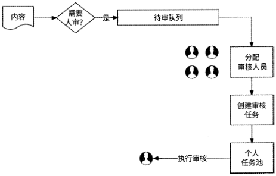

图7-2

[原 PDF 第 266 页](../%E4%BA%BF%E7%BA%A7%E6%B5%81%E9%87%8F%E7%B3%BB%E7%BB%9F%E6%9E%B6%E6%9E%84%E8%AE%BE%E8%AE%A1%E4%B8%8E%E5%AE%9E%E6%88%98%20%28--%29%20%28manongshu.com%29.pdf#page=266)

其审核流程如下。

（1 ）如果某内容需要人工审核，则进入待审队列，待审核内容排队等待分配审核人员。

（2） 根据分配策略，选出一位审核人员为其创建审核任务。

（3） 将审核任务投递到这位审核人员的个人任务池中。

（4） 审核人员在个人任务池中逐个完成审核任务，给出审核结果。

总之，从宏观的角度来说，对内容应该优先依赖人工智能自动审核，如果通过人工智能自动审核无法得到高置信度的结果，则人工再介入做第二次审核并得出结论。让人工审核为人工智能自动审核的兜底，能够尽量节约审核人力成本。

需要强调的是，本节内容仅是对审核中心应该怎么做的一种粗略建议。由于各互联网公司产品特性的差异化，实际的内容审核可能涉及更多的人工智能自动审核细节与人工审核细节，所以对本节内容适当参考即可。不过，如何判断内容是否通过审核并不会影响整个内容发布系统的业务架构设计，我们姑且将审核中心的内部逻辑当作一个黑盒。

### 7.3.4 审核中心的对外交互

内容发布系统需要将内容发送到审核中心，审核中心需要将内容的审核结果返回给内容发布系统，两者之间适合基于消息队列的异步化形式进行交互。

如表7・4所示，内容发布系统与审核中心之间的交互需要两个消息队列主题。

表7・4

含 义

```text
      消息队列主题    生产者    消费者
 event_audit_content    内容送审    内容发布系统    审核中心
 event_audit_result    内容审核完成    审核中心    内容发布系统
```

审核中心的对外交互流程如下。

（1 ）产生新的待审核内容的事件对应的消息队列主题被命名为event audit content,内容发布系统为其消息生产者，审核中心为其消息消费者。当内容满足审核条件时（比如内容的播放量或互动量达到阈值、内容由粉丝量较大的创作者发布、内容被投诉），内容发布系统向event_audit_content消息队列发送消息，消息内容是item_id （内容唯一标识）和version （内容版本号）,用于告知审核中心需要审核某内容的某版本。

（2） 审核中心在收到event_audit_content消息队列中的新消息后，根据itemid获取内

```text
容的全部信息，此内容排队等待审核。    ~
```

（3） 内容审核完成的事件对应的消息队列主题被命名为event_audit_result,审核中心

```text
为其消息生产者，内容发布系统为其消息消费者。    ~    ~
```

[原 PDF 第 267 页](../%E4%BA%BF%E7%BA%A7%E6%B5%81%E9%87%8F%E7%B3%BB%E7%BB%9F%E6%9E%B6%E6%9E%84%E8%AE%BE%E8%AE%A1%E4%B8%8E%E5%AE%9E%E6%88%98%20%28--%29%20%28manongshu.com%29.pdf#page=267)

（4）当内容通过人工智能自动审核或者人工审核后，审核中心将审核结果发送到event_audit_result消息队列，消息内容是item id （内容唯一标识）、version （内容版本号）、audit result （审核结果）和reason （不通过的原因）（如果最终的审核结果是“拒绝通过”）,用于告知内容发布系统某内容的某版本的审核结果。

（5 ）内容发布系统在收到event_audit_result消息队列中的消息后，根据审核结果进行相应的处理（处理细节在7.4节中会涉及，但是需要依赖一些前置设计，这里先一笔带过）o

## 7.4 内容的全生命周期管理设计

本节讲解内容的全生命周期管理设计，前面产生的各种问题都会在本节得到解答，比如：内容元信息的存储为什么使用两张数据表，数据表每个字段的实际用途是什么，如何

处理内容审核结果，等等。

### 7.4.1 内容的创建设计

当创作者在产品客户端新创建了一条内容并准备将其提交到内容发布系统的服务端

时，我们应该怎么处理这个请求？

首先，客户端需要进行内容数据类型的识别和归类。如果新创建的内容包含长文本、图片，则需要先将它们以文件形式上传到分布式对象存储系统中。如果分布式对象存储系统成功存储了这些文件，则会返回长文本URI和图片URI；如果新创建的内容包含视频，则由于涉及必要的视频编解码，所以需要先将本地视频文件上传到由专门的视频团队开发的视频服务中（这个服务会先对视频进行转码，然后把结果存储到分布式对象存储系统中）,并由视频服务返回一个唯一的视频ID代表这个视频，我们可以根据这个视频ID从视频服务中获取视频。

然后，在将这些特殊文件存储到服务端后，客户端会收到服务端的响应，接收到长文

本URI、图片URI和视频ID。

最后，客户端携带创作者信息、内容可见性设置、内容短文本及服务端返回的长文本URI、图片URI和视频ID再次请求服务端。此时，我们在内容发布系统中为此内容创建元信息：通过分布式唯一 ID生成器生成一个全局唯一的item_id来标识这条内容，并填充item_info 表的 item_id、creator_id （创作者 ID ）、visibility （内容可见性）、create_time （内容创建时间）和update_time （内容变更时间）字段。

关于是否直接发布内容的重点来了：如果内容创作者拥有大量粉丝，或者其近期被举报多次，或者其近期发布的内容总是被审核拒绝，则此创作者要发布的内容需要满足审核

[原 PDF 第 268 页](../%E4%BA%BF%E7%BA%A7%E6%B5%81%E9%87%8F%E7%B3%BB%E7%BB%9F%E6%9E%B6%E6%9E%84%E8%AE%BE%E8%AE%A1%E4%B8%8E%E5%AE%9E%E6%88%98%20%28--%29%20%28manongshu.com%29.pdf#page=268)

条件，即这条新创建的内容需要通过审核后才能发布。此时，我们在item_info表中为此内容设置online_version字段为0,表示此内容无线上发布版本，属于初次创建（这是理所当然的，因为新创建的内容尚未对外发布），同时设置latest_version字段为1,作为此次内容创建的version （版本号）,而将status （内容的状态）字段设置为“待审核”，其他字段留空。然后，将内容元信息暂存到item_record表中，填充全部字段，并设置latest status

```text
 字段为“待审核”。    ~
```

如果此内容未命中审核时机策略，则意味着此创作者新创建的内容可被直接发布，于是直接设置online version和latest_version字段分别为1,同时将status字段设置为“正常展示”，将内容正式对外发布。

关于item_id,这里强烈推荐使用基于时间戳的分布式唯一 ID生成器来生成，这样会使item_id天然包含内容的发布时间，可以让我们很方便地识别一条内容是新内容还是旧内容，为对与内容相关的各种数据做冷热分离和数据路由提供了较大的自动化便利。

例如，我们约定发布时间为2022年1月1日至今的内容相关数据为热数据，其他时间发布的内容相关数据为冷数据，将热数据存储到性能较高的存储引擎中，将冷数据存储到资源相对廉价且容量大的存储引擎中。当请求一条内容的相关数据时，我们先读取此内容唯一标识item_id中的时间戳字段来判断是热数据还是冷数据，进而将请求路由到合适的存储引擎中来获取数据（在内容相关章节中会反复提及）。

在内容元信息创建完成后再次检查内容表现形式：如果内容包含短文本，则将短文本内容存储到分布式KV存储系统中，将（item_id}_{version）作为数据Key,将短文本内容作为数据Valueo

至此，整个内容创建流程的设计就完成了。

现在我们通过图文形式重新描述这个流程。用户在客户端创建内容并上传内容的流程如下所述，如图7・3所示。

（1） 如果新创建的内容包含图片，则先将图片上传到后端的分布式对象存储系统中，此系统返回一个URI列表image_uriso如果新创建的内容包含长文本，则先将长文本以文件形式上传到后端的分布式对象存储系统中，此系统返回此文件的URI text urio

（2） 如果新创建的内容包含视频，则先将视频上传到由专门的视频团队开发的视频服务中，视频服务返回一个视频ID video ido

（3 ）客户端携带创作者ID、内容文本、image_uris （图片URI列表）.text_uri （长文本URI ）、video_id （视频ID ）信息请求内容发布系统。

（4）为新创建的内容生成一个基于时间戳的唯一 ID,作为此内容的唯一标识。

[原 PDF 第 269 页](../%E4%BA%BF%E7%BA%A7%E6%B5%81%E9%87%8F%E7%B3%BB%E7%BB%9F%E6%9E%B6%E6%9E%84%E8%AE%BE%E8%AE%A1%E4%B8%8E%E5%AE%9E%E6%88%98%20%28--%29%20%28manongshu.com%29.pdf#page=269)

(5 )将内容元信息存储到 item_info 表中，填充 item_id. creator idvisibility、create_time. update_time字段。如果创作者本身的条件需要被审核，则设置online_version字段为0,表示暂未创建成功，并将latest_version字段设置为1,作为此次内容创建的version；将status字段设置为“待审核”。而如果无须审核创作者本身的条件’则将online version和latest_version字段分别设置为1,表示内容已发布。

(6)如果内容包含短文本，则将短文本内容存储到分布式KV存储系统中，并设置存储项的Key为{item_id}_{version}, Value为短文本内容。

(7 )将内容元信息再存储到item_record表中，填充全部字段。如果内容需要送审，则将latest_status字段设置为“待审核”，否则设置为“审核通过”。

(8 )如果内容需要送审，则通过异步消息队列方式将item_id. version异步发送到由专门的审核团队开发的审核中心服务中，由审核中心对新创建的内容进行审核。

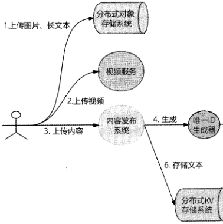

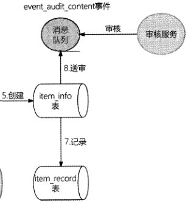

### 7.4.2 内容的修改设计

内容修改与内容创建的流程大同小异，只不过在修改内容时会考虑是否要将此内容送

审。

如果此次修改的内容之前已经达到送审的播放量、互动量的条件阈值，则此次内容修改需要通过审核，否则可以直接发布内容。

如果内容需要通过审核，则流程如下。

[原 PDF 第 270 页](../%E4%BA%BF%E7%BA%A7%E6%B5%81%E9%87%8F%E7%B3%BB%E7%BB%9F%E6%9E%B6%E6%9E%84%E8%AE%BE%E8%AE%A1%E4%B8%8E%E5%AE%9E%E6%88%98%20%28--%29%20%28manongshu.com%29.pdf#page=270)

(1 )如果此次修改的内容有新增的图片，则先将图片上传到后端的分布式对象存储系统中，再将此系统返回的URI列表追加到此次提交的image uris中。

(2 )如果此次修改的内容包含长文本，则先将长文本以文件形式上传到后端的分布式对象存储系统中，此系统返回此文件的URI： text_urio

(3)如果此次的内容修改是替换了新视频，则将新视频上传到视频服务中，视频服务返回一个视频ID： video ido

(4 )客户端携带item_id、内容文本、image_uris、video_id、text_uri信息请求内容发布系统。

(5 )根据item id查询item_info表中的记录，并将所找到的数据行的latest_version字段值加1,作为此次变更的versiono

(6 )如果有内容短文本变更，则将内容短文本存储到分布式KV存储系统中，

```text
Key= {item_id}_ (version}。
```

(7 )将内容元信息再存储到item record表中，填充全部字段，并将item record表的latest status字段设置为“待审核”。

(8) 将item id. version异步发送给审核中心服务，由审核中心对此次修改的内容进行审核。

(9) 对于需要送审的内容，其修改流程的重点是不直接将修改后的内容更新到item_info表中，而是先将修改后的内容暂存到item_record表中。这是因为可能需要对此次修改的内容进行审核，来确认是否将此内容发布到线上。

如果内容不需要通过审核(创作者不满足审核条件')，则流程如下(不涉及内容审核)o

(1) 如果此次修改的内容有新增的图片，则先将图片上传到后端的分布式对象存储系统中，再把此系统返回的URI列表追加到此次提交的image_uris中。

(2) 如果此次的内容修改是替换了新视频，则将新视频上传到视频服务中，视频服务返回一个视频ID： video ido

(3 )客户端携带item id^内容文本、image uris^ video id信息请求内容发布系统。

(4 )根据item_id查询item_info表中的记录，并将所找到的记录项的latest_version字段值加1,作为此次变更的versiono

(5)如果此内容主体包含短文本，则将内容短文本存储到分布式KV存储系统中，

```text
Key=(item_id}_{version}。
```

[原 PDF 第 271 页](../%E4%BA%BF%E7%BA%A7%E6%B5%81%E9%87%8F%E7%B3%BB%E7%BB%9F%E6%9E%B6%E6%9E%84%E8%AE%BE%E8%AE%A1%E4%B8%8E%E5%AE%9E%E6%88%98%20%28--%29%20%28manongshu.com%29.pdf#page=271)

（6 ）将内容元信息再存储到item_record表中，填充全部字段，并将item_record表的latest_status字段设置为“已上线”。

如果创作者没有改动内容本身，仅仅修改了内容属性（比如调整内容的可见性），则

直接更新item_info表即可。

### 7.4.3 内容审核结果处理与版本控制设计

回顾7.3节的内容，内容审核一般借助人工智能自动审核和人工审核完成，我们将内容审核视为黑盒，只需要知道：内容审核不一定能实时得出结果，审核结果只能通过异步

通知的方式告知内容发布系统。7.3.4节介绍过，在有了审核结果后，审核中心会将审核结果发送到 event audit result 消息队列，消息内容是 item id. version. audit_result 和 reason（如果审核结果是“拒绝通过”）。下面介绍内容发布系统收到消息后的技术细节。

内容发布系统在收到event_audit_result消息队列中的审核结果后，需要根据审核结果决定是否发布内容。

- 如果审核结果是“审核通过”，则将item_record表中的此item_id、此版本version的暂存数据覆盖到item_info表中，表示发布内容。

- 如果审核结果是“审核拒绝”，则在item_record表中的此item_id、此版本version对应的数据行中，设置latest_status字段为“审核拒绝”，并将拒绝原因reason设置到latest_reason字段中。

不过，在上述审核结果是“审核通过”的处理逻辑中，还有一个重要的问题：既然在有了审核结果后，审核中心会将消息发送到event audit result消息队列中，那么我们需要重点考虑消息的顺序问题。

假设一个用户在短时间内进行了三次内容变更，这三次变更内容的版本号分别为100、101、102,依次将其投递到审核中心（假设审核中心对这三个版本的变更内容的审核结果都是“审核通过”）。在正常逻辑上，内容创作者当然希望最终发布的内容是102版本。但是，审核中心并不会保证这三个版本的变更内容的审核响应速度与回调顺序。比如审核中心对100版本的变更内容耗时10min才得出审核结果，对101版本的变更内容耗时5min得出审核结果，而对102版本的变更内容仅耗时10s便得出审核结果，即在审核速度上，102版本＞101版本＞100版本，那么内容发布系统将会先收到102版本的审核回调，再收到101版本的审核回调，最后才收到100版本的审核回调。如果内容发布系统每收到一条内容审核通过消息，就直接更新item_info表，那么最终item_info表的数据是100版本的变更内容，与内容创作者的预期相悖。

[原 PDF 第 272 页](../%E4%BA%BF%E7%BA%A7%E6%B5%81%E9%87%8F%E7%B3%BB%E7%BB%9F%E6%9E%B6%E6%9E%84%E8%AE%BE%E8%AE%A1%E4%B8%8E%E5%AE%9E%E6%88%98%20%28--%29%20%28manongshu.com%29.pdf#page=272)

那么，怎么才能如内容创作者所预期的那样，最终使得102版本的变更内容生效呢？由于三次变更内容的版本号是单调递增的，所以解决方法很简单：内容发布系统在收到内容审核通过的消息后，先检查当前item_info表中的online_versioii (线上内容的版本号)字段，如果审核通过的version (内容版本号)小于online version,则说明是更早的内容变更版本，变更生效会导致内容回退，于是忽略此次回调；否则，说明是新的内容变更，

于是更新item_info表。这样一来，无论变更内容的哪个版本先回调审核结果，最终线上生效的内容版本一定是版本号最大的变更内容。

内容审核结果的处理流程设计如下所述，如图7-4所示。

(1 )审核中心完成审核，将item_id、version、audit_result^ reason信息打包成一条消息发送到event_audit_result消息队列中。

(2 )内容发布系统收到event_audit_result消息队列中的消息，根据所收到消息的item_id和version,先查询item_record表中的记录，将latest_status字段设置为“audit_result”，将latest_reason字段设置为“reason”，再进一步检查audit_result的值：

① 如果audit_result的值是“拒绝通过”，则不再进行下一步操作；

② 如果audit_result的值是“审核通过”，则继续进行下一步操作。

(3 )如果audit_result的值是“审核通过”，则查询item_info表中线上内容的版本号：

① 如果online_version = version,则说明此次审核的内容是线上内容(可能是内容的播放量、互动量达到审核阈值，或者内容被用户投诉)，将审核结果写入item_info表中的status字段；

② 如果online version < version，则说明此次审核结果对应的内容版本比线上的新，是新变更的内容，需要执行第4步；

③ 如果online_verison > version,则说明此次审核结果对应的内容版本滞后，不再继续。

(4 )使用item record表中的记录替换item info表中的数据行：item_info表中行数据的 online_versionA online image urisonline_text_urionline_video_id 字段的值被依次替换为 item record 表中行数据的 latest version、latest image uris、latest_text_uri、latest video id字段的值，完成了对内容的线上发布。

[原 PDF 第 273 页](../%E4%BA%BF%E7%BA%A7%E6%B5%81%E9%87%8F%E7%B3%BB%E7%BB%9F%E6%9E%B6%E6%9E%84%E8%AE%BE%E8%AE%A1%E4%B8%8E%E5%AE%9E%E6%88%98%20%28--%29%20%28manongshu.com%29.pdf#page=273)

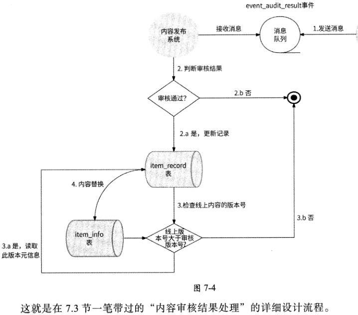

### 7.4.4 内容的删除与下架设计

用户可以删除自己不想再展示的内容，产品运营人员也可以在内容运营后台（对公司内相关员工开放的用户内容管理系统）将高风险或不合规的用户内容下架，这两种操作最

终的结果都是内容不再被展示。

当内容被删除、下架时，我们应该采用软删除策略，即只标记item_info表的数据行中的status字段为“被删除”或“被下架”，而不是直接删除数据行。这样做能让我们清晰地知道内容消失的原因是什么，有助于对“内容不可见”类型的问题反馈进行排查。

## 7.5 内容分发设计

内容被正式发布后并没有万事大吉，我们还有很重要的一个问题要讨论，那就是如何才能让别人看到这条已发布的内容。

[原 PDF 第 274 页](../%E4%BA%BF%E7%BA%A7%E6%B5%81%E9%87%8F%E7%B3%BB%E7%BB%9F%E6%9E%B6%E6%9E%84%E8%AE%BE%E8%AE%A1%E4%B8%8E%E5%AE%9E%E6%88%98%20%28--%29%20%28manongshu.com%29.pdf#page=274)

### 7.5.1 内容分发渠道

根据刷社交软件的经验，我们知道一个用户的作品可以通过多种渠道呈现给其他用户。比如推荐Feed流可以把我们可能感兴趣的内容推送给我们，Timeline Feed （或称为关注人动态）可以让我们刷到所关注的人最近发布的内容，我们还可以主动按照自己的兴趣去搜索与某关键词相关的作品，去某热门话题下查看相关的用户讨论，去我们喜爱的创作者主页查看最新作品 这些能看到内容的场景就是内容分发渠道。

按照微服务的划分，这些内容分发渠道有各自的业务开发团队、技术栈和应用服务。比如推荐Feed流渠道会由专门的算法团队维护，他们使用大数据处理、推荐算法等技术构建内容推荐服务。

### 7.5.2 何时通知分发渠道

为了让内容在创作者的作品列表中曝光，需要将内容放到作品列表中；为了让内容被推荐，需要根据内容特征，将内容放入对应的推荐召回池中；为了让内容被创作者的关注者看到，可能需要将内容投递到关注者的收件箱中；为了让内容在创作者的主页上展示，可能需要把内容放入创作者的发布作品列表中；为了让内容被搜索到，需要为内容的关键词建立索引……总之，当一条内容发布完成时，我们需要通知各种内容分发渠道。

内容被删除、下架，以及被审核拒绝，需要通知内容分发渠道。这很好理解，既然一条内容已经被认为应该消失，那么自然不应该再在各种分发渠道展示了。

内容的可见性被修改时，也需要通知内容分发渠道。比如创作者将某内容的可见性从所有人可见改为私密，从其他用户的视角来看，等于此内容已被删除，推荐服务、搜索服务等各种渠道都不应该再展示此内容了。

### 7.5.3 将内容投递到分发渠道

上文说到，不同的内容分发渠道往往由不同的团队维护，对外提供应用服务，比如推荐服务、动态服务、搜索服务、话题服务（提供各种话题下的全部作品列表，类比微博超话）、作品列表服务（提供创作者发布的全部作品列表）等。为了将一条已发布的内容顺利地投递到各种分发渠道，内容发布系统的维护团队需要和渠道维护团队进行技术沟通与交互开发，这会产生较大的开发工作量和维护工作量。况且，随着产品的迭代升级，内容分发渠道会越来越多样化，每当产生新的内容分发渠道时，内容发布系统都要去配合开发吗？

我们是否可以不用关心各种内容分发渠道的逻辑细节，以及不用关心新的内容分发渠道？答案是肯定的，我们可以采用软件设计模式中经常被提及的“解耦”思路：为了让内

[原 PDF 第 275 页](../%E4%BA%BF%E7%BA%A7%E6%B5%81%E9%87%8F%E7%B3%BB%E7%BB%9F%E6%9E%B6%E6%9E%84%E8%AE%BE%E8%AE%A1%E4%B8%8E%E5%AE%9E%E6%88%98%20%28--%29%20%28manongshu.com%29.pdf#page=275)

容与内容分发渠道充分解耦，内容发布系统可以借助消息队列与内容分发渠道通信。

无论是内容的发布、删除、下架还是可见性变更，都属于内容元信息变更。也就是说，各种内容分发渠道在意的是内容元信息变更，所以内容分发渠道向消息队列发送的消息内容应该是内容元信息，而不是内容主体（如文本、图片、视频）。如果内容分发渠道需要

内容主体，则按需调用内容发布系统的接口来获取即可。

如图7.5所示，我们为“内容的发布” “内容的删除” “内容的下架” “内容的可见性变更”等一切涉及内容元信息变更的事件都创建一个消息队列主题event_content_meta_change,内容发布系统为其消息生产者，各种内容分发渠道为其消息消费者。每当有用户发布内容并上线时，各种内容分发渠道都会实时拿到新内容，执行各自的分发逻辑；每当

有内容被用户主动删除时，各种内容分发渠道都会实时得到通知，然后从各自的内容池中

删除这条内容。

内容分发渠道

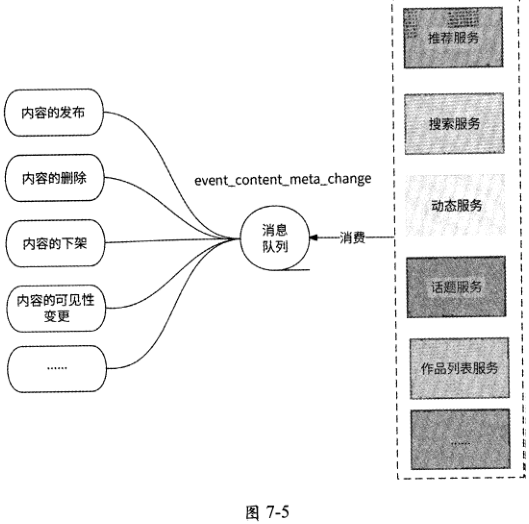

这里再简单了解一下各种内容分发渠道在收到新内容时会做什么事情：推荐服务在收到新内容时，会读取内容主体并对内容进行适当的特征提取，将内容放到合适的召回池中;搜索服务在收到新内容时，会读取内容主体并对内容进行自然语言处理，提取关键词，建立文档倒排索引，比如类Elasticsearch索引；动态服务在收到新内容时，可能会将内容的

[原 PDF 第 276 页](../%E4%BA%BF%E7%BA%A7%E6%B5%81%E9%87%8F%E7%B3%BB%E7%BB%9F%E6%9E%B6%E6%9E%84%E8%AE%BE%E8%AE%A1%E4%B8%8E%E5%AE%9E%E6%88%98%20%28--%29%20%28manongshu.com%29.pdf#page=276)

item_id投递到粉丝的收件箱中；话题服务、作品列表服务在收到新内容时，会把item_id分别加入hashtag （话题标签）和创作者的作品列表中。

## 7.6 内容展示设计

前面已经完成了对内容创建、内容修改、内容审核、内容删除、内容分发的流程设计,本节将详细介绍内容展示设计，这是本章要讲解的最后一个重点功能。

用户读取内容，直观来看，是用户与数据库的item_info表、分布式KV存储系统（内尊文本的存储源）、分布式对象存储系统（图片和视频的存储源）的交互。不过，出于应对高并发请求量的考虑，实际上这里需要引入更多的机制。让我们先从内容数据的特点入手。

### 7.6.1 内容数据的特点

内容生产是一个天然的读多写少且读远多于写的场景，创作者修改内容的请求量极少，用户读取内容的可能性极大。

对于一般的互联网应用的内容，由于用户创建和修改内容有一定的操作成本，所以注定了内容的创建和修改场景的请求量级不会太高。它的QPS 一般是百级别的，如果QPS上千，那么几乎可以称得上国民级应用了。总体上，内容生产的高并发情况很少，且内容生产对内容生效的响应时间容忍性相对宽松，所以对应的高并发处理方式相对简单。即在高并发的内容创建和修改的极端情况下，对内容的发布或修改进行异步化处理，将发布或修改的内容投递到消息队列中，内容发布系统的消费消息队列进行内容的创建、修改或者通过审核，待发布成功后再通知用户。

虽然互联网应用的内容创建和修改的请求量级一般不会很高，但内容读取有可能是高并发场景。一个优秀的内容创作者发布了足够吸睛的作品，往往会引来大量围观；一个一线明星的绯闻爆料内容，会吸引亿万“吃瓜”群众围观；一个政治、经济、军事类账号发布的新闻，甚至可以直接引起全国人民的实时关注……可以说，内容读取的QPS的日常状态达到上百万都很正常。

根据我们的设计，对一条内容的读取包括对内容元信息的读取（来自item_info表）和对内容主体的读取，这两部分承载高并发的读请求往往有不同的策略。

### 7.6.2 使用CDN加速静态资源访问

对于静态数据，比如长文本、图片、视频，非常适合采用CDN （ Content DeliveryNetwork,内容分发网络）技术来应对其高并发的读请求。

[原 PDF 第 277 页](../%E4%BA%BF%E7%BA%A7%E6%B5%81%E9%87%8F%E7%B3%BB%E7%BB%9F%E6%9E%B6%E6%9E%84%E8%AE%BE%E8%AE%A1%E4%B8%8E%E5%AE%9E%E6%88%98%20%28--%29%20%28manongshu.com%29.pdf#page=277)

简单来说，CDN就是把静态资源缓存到位于多个地理位置的边缘服务器上，当用户请求静态资源时，把用户的请求转发到附近的边缘服务器上实现就近访问。CDN技术一方面能很好地解决数据就近访问问题，另一方面能很好地缓存静态资源。

CDN的简单架构如图7-6所示。

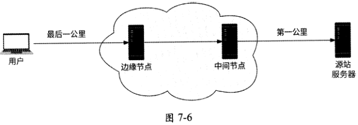

CDN技术的关键术语如下。

- 边缘节点：缓存用户请求内容的节点，是用户实际访问的服务器。

- 中间节点：CDN的内部节点，能缓存更多的内容。中间节点与边缘节点之间的网络是经过优化的，速度可观。如果用户在边缘节点访问不到数据，则会从中间节

点访问或者经过中间节点回源。

- 源站服务器：真正的远端服务，中间节点可以从源站服务器获取数据，即“回源”。

- 第一千米：中间节点到源站服务器的连接。

- 最后一千米：用户到边缘节点的连接。

当某个静态资源被首次访问时，由于CDN边缘节点并未对它进行缓存，所以此时CDN中间节点会向源站服务器回源：获取静态资源，并将其缓存到边缘节点。在此之后，任何用户请求同样的静态资源时，都会在CDN边缘节点发现数据并响应，用户请求不再对源站服务器进行访问，这极大地缓解了源站服务器的带宽压力，且大大提高了静态资源在用

户侧的加载速度。

总之，对于内容发布系统中的内容主体数据，比如图片、视频，可以通过接入CDN的方式来应对大量请求。

### 7.6.3 使用缓存和多副本支撑高并发读取

内容元信息属于非静态数据，发布者和产品后台可能都会对内容元信息进行修改，并要求近实时生效。比如发布者因“手滑”发布了一条本不想对外展示的内容，于是］艮急迫地删除内容，希望这条内容立刻消失。又比如产品后台希望对某条不健康的内容进行封杀，为了尽快止损与消除舆论风波，相关处理人员要求实时删除内容。

[原 PDF 第 278 页](../%E4%BA%BF%E7%BA%A7%E6%B5%81%E9%87%8F%E7%B3%BB%E7%BB%9F%E6%9E%B6%E6%9E%84%E8%AE%BE%E8%AE%A1%E4%B8%8E%E5%AE%9E%E6%88%98%20%28--%29%20%28manongshu.com%29.pdf#page=278)

内容元信息被存储在关系型数据库中，为了应对高并发的读取请求，可以使用Redis对元信息数据进行中心化缓存，防止读请求直接访问数据库。

- 内容兀信息使用Redis Diet结构存储，Key=content_{item_id}, Diet中的每个存储项Field都是item_info表的字段，而Value是item_info表中各字段的值。

- 在读取某内容（内容ID为item_id）元信息的Redis缓存项时，执行HGETALLcontent_（item_id）命令便可获取此内容元信息。

但是这样还不足以承载上百万级QPS,因为这条内容的元信息数据在Redis集群中最多占用一个Redis实例分片，让单个Redis实例承载上百万的请求量依然有较高的风险。我们可以进一步优化。

- 对Redis集群中的每个实例分片都采用主从架构，将一条内容的多个副本保存到多个Redis从节点上，尽量将对一条内容的读取分散到各个Redis从节点上。

- 对读取内容的服务节点增加Local Cache,同样将content_{item_id）作为缓存项Key,将内容元信息的数据结构体作为缓存项Valueo Local Cache会尽量让请求在服务节点的本地内存中寻找内容元信息，而不是通过网络访问Rediso当然，需要注意的是，Local Cache毕竟使用的是服务节点的本地内存，应该控制缓存总量不要太大，需要使用一定的缓存淘汰策略如LFU来维护缓存总量。

将Local Cache和Redis作为多级缓存策略，将Redis主从架构作为多副本策略，两者相互配合可以兜住大多数情况下的高并发读请求。

另外，可能有读者留意到，在7.6.2节中并没有提到短文本，这是笔者为了将短文本的缓存留到本节来讲而故意为之。短文本本身占用的空间不足1KB,可以将其视为普通的字符串数据。如果使用对象存储系统来存储短文本，则显得有点小题大做。所以，短文本的缓存方式和内容元信息的一致，也是基于Local Cache和Redis进行缓存的，并且可以和内容元信息的缓存数据合成一条缓存数据。

- 为Redis中内容元信息的Diet结构增加field=nshort_textn,将短文本字符串作为其Value o

- 为Local Cache中缓存的内容元信息的数据结构体增加类型为String的short_text

```text
        字段，用于存储短文本字符串。    ~
```

这样一来，在读取内容元信息的缓存数据时，顺便就读取了内容的短文本数据。内容数据的缓存架构如图7-7所示。

如果Redis主从节点数量有限，或者Local Cache的缓存命中率不高，那么我们还可以采用另一种形式的多副本缓存策略 不是对存储节点做多副本，而是对内容元信息的数据本身做多副本。

[原 PDF 第 279 页](../%E4%BA%BF%E7%BA%A7%E6%B5%81%E9%87%8F%E7%B3%BB%E7%BB%9F%E6%9E%B6%E6%9E%84%E8%AE%BE%E8%AE%A1%E4%B8%8E%E5%AE%9E%E6%88%98%20%28--%29%20%28manongshu.com%29.pdf#page=279)

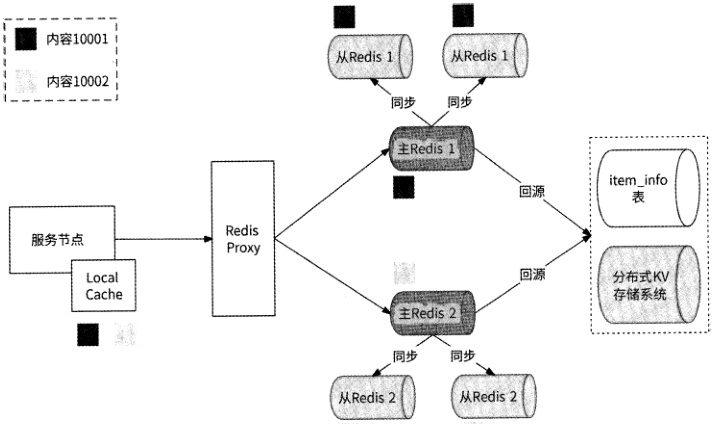

图7-7

具体而言，就是在Redis中将过热的内容元信息的Diet数据拆分为N份数据拷贝，每份数据拷贝都使用不同的 Redis Key, Key=content_(content_id}_(shared_number),其中shared_number N的模；每份数据拷贝的Diet结构都是完全一样的。这样的拆分会使得一份内容元信息数据被存储到Redis集群中最多N个Redis节点上。图7-8展示了 N=3的情况，我们将item_id=123的内容元信息的Diet缓存数据拷贝了 3份，并为每份数据拷贝都设置了不同的Redis Key,以便将各数据拷贝尽量映射到Redis集群中不同的Redis节点

上。

```text
          creatorJdrlOOl    creatorjd:1001    creatorjd:1001
          status:生效中    status:至效中    status:虫效中
          onlinejmage„uris:    onlinejmage„uris:    ontinejmage_„uris:
     Diet    "uril,uri2,un3"    Huril,uri2,uri3"    "wiLuri2,uri3"
          short_text: 4,hello world'*    short_text: "hello world"    short_text:Hhello world"
```

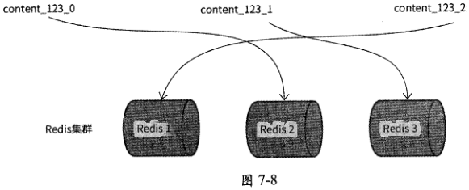

[原 PDF 第 280 页](../%E4%BA%BF%E7%BA%A7%E6%B5%81%E9%87%8F%E7%B3%BB%E7%BB%9F%E6%9E%B6%E6%9E%84%E8%AE%BE%E8%AE%A1%E4%B8%8E%E5%AE%9E%E6%88%98%20%28--%29%20%28manongshu.com%29.pdf#page=280)

当读请求访问Redis时，Redis Proxy使用随机mod N来决定其访问哪个Redis Key,这样一来，每条热门内容的读请求在Redis集群中都可以被充分打散，使原本对单个Redis实例分片数百万级别的QPS下降到千级别。

既然为内容元信息建立了内容缓存，那么接下来就要考虑缓存的时效性问题。为了让内容元信息的变更可以更加实时地对线上用户生效，内容缓存也需要接收内容元信息变更的通知。想一想，这里是不是和内容分发渠道非常相似？实际上，我们确实可以将内容缓存理解为一种内容分发渠道，只不过这种内容分发渠道主要是用来为内容做数据缓存的。

因此，需要将内容缓存作为event_c()iiteiit_meta_chaiige消息队列的消息消费者，内容缓存在收到关于内容元信息变更的消息时可以主动更新缓存。

让内容缓存消费event_content_meta_change消息队列的消息，不仅可以达到缓存元信息主动更新的效果，而且可以作为一个更高级的功能：缓存预热。

在广义上，缓存预热是指系统上线时将相关的缓存数据预先直接加载到缓存系统中，这样就可以避免在用户请求数据时，先查询数据库，再构建数据缓存，用户直接查询的数据是事先预热的缓存数据。对于内容发布系统来说，在正式发布某内容前，如果业务架构师或产品策略师预测该内容对外发布后会有较高的访问热度，那么这条内容就可以被提前主动存储到缓存中，完成内容缓存预热。

假设产品策略师认为：拥有100万个粉丝的创作者每次发布的内容都可能成为热点，缓存预热系统每次从event_content_meta_change消息队列消费到属于“内容发布完成”的消息时，都先根据内容元信息中的creator_id获取创作者的粉丝量，如果粉丝量达到100万人，则将数据主动缓存到内容发布系统的各服务节点Local Cache中。

### 7.6.4 内容展示流程设计

7.6.2节和7.6.3节分别告诉我们：内容元信息通过Local Cache和Redis缓存；内容图片或视频通过CDN缓存。当向用户展示一条内容时，将优先读取这些数据缓存。

假设某创作者只发布了一条内容，其item_id为10001,某用户访问此创作者的个人主页，并点击了这条内容，这时客户端会向内容发布系统的服务端发起读取内容的请求，并携带item_id告知服务端希望读取这个内容ID的完整内容。

内容发布系统的任意一个服务节点在收到item_id= 10001的内容读取请求后，会进入如下内容展示流程。

(1 )内容发布系统的服务节点根据item_id= 10001拼接缓存项Key=content_10001,并尝试在Local Cache中查找内容元信息数据，如果查找到数据，则完成对内容元信息的获取，跳到第9步；如果未查找到，则进行下一步。

[原 PDF 第 281 页](../%E4%BA%BF%E7%BA%A7%E6%B5%81%E9%87%8F%E7%B3%BB%E7%BB%9F%E6%9E%B6%E6%9E%84%E8%AE%BE%E8%AE%A1%E4%B8%8E%E5%AE%9E%E6%88%98%20%28--%29%20%28manongshu.com%29.pdf#page=281)

(2)使用Key=content_10001查询Redis缓存，如果查询到数据，则完成对内容元信息的获取，跳到第9步；如果未查询到，则进行下一步。

(3 )使用 item_id 查询数据库的 item_info 表，主要读取 creatorjd, online_version,online_image_uris > online_video_id、online_text_uri> visibility 和 status 字段。

(4)将读取到的数据存储到Redis缓存中，并缓存到服务节点Local Cache中。

(5 )检查内容的状态：如果status字段的值为“正常展示”，则继续进行下一步；否则，直接返回空数据，表示内容不存在。

(6 )检查内容的可见性：如果visibility字段的值为“私密”，则检查user_id是否等于creator_ido如果不等于，则返回空数据，表示内容不存在；否则，表示内容可展示(创作者自见)，继续进行下一步。

(7)如果visibility字段的值为“好友可见”或“粉丝可见”，则从关系服务(见第10章)中读取用户与创作者的关系。如果不满足好友、粉丝的关系，则返回空数据；否则，

继续进行下一步。

(8 )创建存储项Key=10001_{online_version),从分布式KV存储系统中读取内容文本。

(9)到了这一步，表示这条内容可对此用户展示，于是服务端将内容元信息、内容短文本数据及其他涉及内容主体的长文本URI online_text_uri,图片URI online_image_uris,视频URI online_video_id返回给客户端。

(10 )客户端展示内容文本，同时携带<mline_text_uri、online_image_uris、online_video_id (如果这3个字段非空)发起第2次请求访问服务端，用于获取长文本、图片、视频。

(11) CDN检查用户附近的CDN边缘节点，如果图片和视频在此节点中已缓存，则直接向用户返回内容；否则，继续进行下一步。

(12) CDN访问CDN中间节点，如果图片和视频在此节点中已缓存，则直接向用户返回内容，同时将图片和视频缓存到上一步中的边缘节点；否则，继续进行下一步。

(13) CDN访问源站服务器(也就是内容发布系统服务端)以获取图片和视频。

(14 )服务端分别根据online_image_uris和online text uri从对象存储系统中获取图片文件和长文本文件，同时根据online_video_id从视频服务中获取视频文件，并将它们回复给 CDN。

(15)CDN将文本文件、图片文件、视频文件缓存到中间节点和边缘节点，并将它们返回给客户端，最终内容被完整地展示给用户。

[原 PDF 第 282 页](../%E4%BA%BF%E7%BA%A7%E6%B5%81%E9%87%8F%E7%B3%BB%E7%BB%9F%E6%9E%B6%E6%9E%84%E8%AE%BE%E8%AE%A1%E4%B8%8E%E5%AE%9E%E6%88%98%20%28--%29%20%28manongshu.com%29.pdf#page=282)

从内容读取的流程可以得知，对内容的展示是分两阶段进行的：首先把内容元信息和内容短文本回传到客户端优先展示，包括内容创作者ID ( creator_id )、内容创建时间(create_time )和内容短文本数据(short_text),这样可以保证基本的内容读取体验(至少用户知道这条内容的主要话题是什么)，并能让用户有耐心等待此内容中包含的图片和视频的展示；图片内容和视频内容则是客户端根据所收到的内容元信息数据向服务端进行第2次请求来获取和展示的，如图7・9所示。这样做与浏览器展示网页有类似的考虑：如果浏览器一定要等到页面的所有元素都返回后再展示，那么会有较大的概率让用户盯着空白的页面等待较长的时间，用户可能会不耐烦，进而关闭页面；而如果浏览器选择将已经返回的元素先展示，用户就可以先读取已展示的内容，同时给剩余未展示的内容元素争取到一定的获取时间。

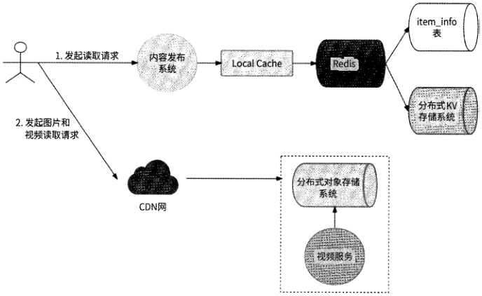

图7-9

至于这条内容的其他周边展示元素，比如创作者的昵称与头像，可以从专门的用户服务中获取，而内容的点赞数、转发数、评论数、收藏数，可以从计数系统(见第8章)中获取。

## 7.7 完整架构总览

通过对内容发布系统的全部功能的设计，我们可以看到这是一个较为复杂、高度依赖监听内容各种状态变更事件的系统，内容的创建、修改、审核、发布、删除都属于内容状态的变更。图7-10展示了内容发布系统的完整架构视图，希望能让我们更直观地感受整

[原 PDF 第 283 页](../%E4%BA%BF%E7%BA%A7%E6%B5%81%E9%87%8F%E7%B3%BB%E7%BB%9F%E6%9E%B6%E6%9E%84%E8%AE%BE%E8%AE%A1%E4%B8%8E%E5%AE%9E%E6%88%98%20%28--%29%20%28manongshu.com%29.pdf#page=283)

个内容发布系统的运转原理。

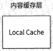

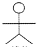

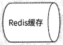

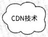

读者

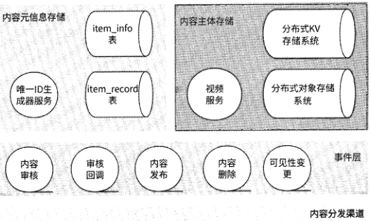

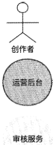

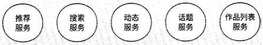

图 7-10

下面结合图7-10来系统性地复习内容发布系统的完整运转流程。

（1 ）创作者创建内容。客户端先将图片、音频、视频等文件上传到对象存储系统（在存储音视频文件前通常会进行音视频转码），然后在关系型数据库的item_info表中创建内容元信息，并将内容存储到item_record表中。如果内容文本较短（短文本），则直接将其存储到分布式KV存储系统中；而如果文本内容过长，则以文本文件的形式将其存储到对象存储系统中。新创建的内容可能需要审核，对于满足审核条件的内容，内容发布系统与审核中心建立送审消息队列，并向审核中心发送所创建的内容的消息，实现新创建的内容

与审核服务的异步交互。

（2） 创作者修改内容。创作者修改内容与创作者创建内容的业务架构流程是高度类似的。如果此次内容修改涉及图片、音频和视频的改动，则客户端先将新的图片、音频、视频文件上传到对象存储系统，然后将此次的内容变更存储到item_record表中，这样做是为了实现内容变更的多版本控制。满足审核条件的内容，在修改后依然需要走内容审核流程，因此也要向审核中心发送消息，实现内容的修改与审核服务的异步交互。

（3） 内容审核。内容需要审核，但并不是所有的内容都有必要进行审核。我们需要对

[原 PDF 第 284 页](../%E4%BA%BF%E7%BA%A7%E6%B5%81%E9%87%8F%E7%B3%BB%E7%BB%9F%E6%9E%B6%E6%9E%84%E8%AE%BE%E8%AE%A1%E4%B8%8E%E5%AE%9E%E6%88%98%20%28--%29%20%28manongshu.com%29.pdf#page=284)

浏览量、互动量达到阈值的内容和粉丝量巨大的创作者的新内容进行审核，这样可以在某内容有广泛传播的苗头时对其加强监管。我们也需要对注定高危的内容进行审核，比如内容的创作者最近被投诉较多或者其创建的内容被若干用户投诉，这样可以对大概率会违规的内容进行有效监控。

（4） 内容审核完成与内容上线。当一条新创建的内容、被修改后的内容的某版本、触发审核条件的内容被审核中心执行审核完成时，审核中心会将审核结果通过消息队列通知到内容发布系统。如果审核结果是“审核通过”，则检查审核通过的内容版本号是否大于线上版本号；如果是，则表示可以覆盖已上线的内容，于是将item record表中的内容修改信息替换到item_info表中。在内容更新后，需要以发布内容事件的形式告知应用内的各种内容分发渠道，以便实现内容在各种内容分发渠道的快速曝光。

（5） 内容对外展示。用户在读取内容详情时，实际上是先读取关系型数据库中的内容元信息，然后从分布式KV存储系统和对象存储系统中读取内容主体，同时会结合缓存策略来应对高并发的读取请求。内容元信息（动态数据）以及短文本被缓存到中心化缓存Redis和服务节点缓存Local Cache中，而长文本、图片、音频、视频等作为静态数据被缓存到CDN边缘节点中。

（6） 内容分发。为了使内容对大众可见，需要将已发布的内容通知到各种内容分发渠道，同时内容分发渠道也会关注内容元信息的变更。如果内容被删除或下架，那么为了达到实时消失的效果，需要通知所有的内容分发渠道和缓存系统删除这条内容。为了让内容发布系统和内容分发渠道解耦，我们采用消息队列的形式完成两者之间的通信。

## 7.8 本章小结

本章从一条内容整个生命周期的角度出发，详细介绍了内容发布系统的核心要素。

首先，内容元信息和内容主体应该分开存储，对内容主体要根据各种存储系统的特点做出合适的存储选型。其次，由于内容审核的存在，对内容的创建或修改场景需要进行版本控制；对内容进行审核，并不是只要内容发生变更就送审，而是需要设计审核时机策略,考虑节约审核资源；内容发布系统还需要对接各种内容分发渠道。最后，内容生产是典型的读多写少的场景，对内容数据可以使用CDN技术、缓存和多副本策略来应对高并发的读取请求。

另外，需要注意的是，本章中的内容发布系统设计讨论更多的是通用能力建设，我们难免会忽略对各产品的一些个性化需求，比如有的产品在内容送审条件上有更合理的考虑，以及在内容审核交互流程上会更复杂，可能有多轮审核、多种维度审核策略……总之，各种个性化需求都需要读者朋友另行思考，这里仅仅是对可能的方案做出一些推断，但万变不离其宗。
