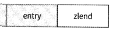
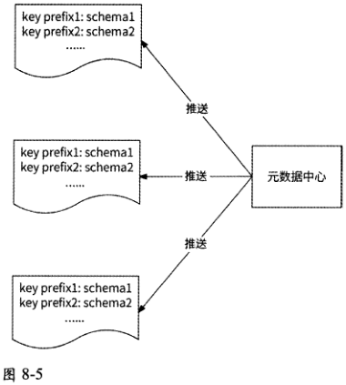
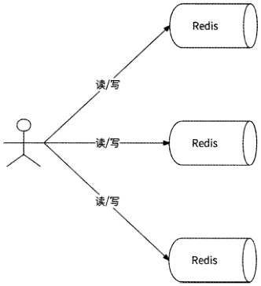
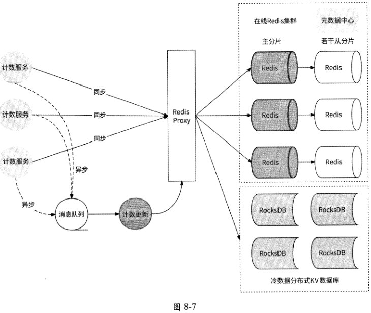

[原 PDF 第 285 页](../%E4%BA%BF%E7%BA%A7%E6%B5%81%E9%87%8F%E7%B3%BB%E7%BB%9F%E6%9E%B6%E6%9E%84%E8%AE%BE%E8%AE%A1%E4%B8%8E%E5%AE%9E%E6%88%98%20%28--%29%20%28manongshu.com%29.pdf#page=285)

# 第8章 通用计数系统

本章讲解一个相对简单但又很常见的服务：计数服务。本章的内容组织结构如下。

- 8.1节介绍计数的常见用途。

- 8.2节针对计数的数据特点，做出存储选型。

- 8.3节正式介绍海量计数服务设计，也会对存储空间进行优化，对如何应对高并发访问进行深入探讨。

本章关键词：存储选型、内存优化、冷热分离、异步、聚合。

## 8.1 计数的常见用途

具有累计性质的计数数据广泛存在于各种用户应用中，比如：

（1） 用户发布的每个作品，有点赞数、分享数、评论数、转发数、收藏数；

（2） 用户主页，有关注数、粉丝数、作品数、热度等；

（3） 评论列表中的每条评论，有点赞数、点踩数。

上述（1 ）和（3 ）属于作品维度的计数（评论也可以被认为是一种作品）,在相当程度上反映了一个作品的受欢迎程度；而（2）属于用户维度的计数，可以直观地展示用户的活跃度与影响力。示例如图所示。

在进行各类计数数据的展示时，初学者非常容易直白地认为数据的统计计数应该来源于数据记录本身。比如点赞数可以从作品点赞记录数据中统计总数得到，评论数可以从作品评论记录中统计总数得到……实际上，这样的做法有极大的并发访问风险。更安全、可靠的做法是将数据本身与数据记录解耦，将计数数据独立出来作为一个服务。而在本章中,

我们就一起来学习计数服务。

[原 PDF 第 286 页](../%E4%BA%BF%E7%BA%A7%E6%B5%81%E9%87%8F%E7%B3%BB%E7%BB%9F%E6%9E%B6%E6%9E%84%E8%AE%BE%E8%AE%A1%E4%B8%8E%E5%AE%9E%E6%88%98%20%28--%29%20%28manongshu.com%29.pdf#page=286)


®好好好0 i嘱摊；浙汪

图8-1

## 8.2 如何存储计数数据

下面通过计数数据的特点，详细介绍为什么计数要单独存储，以及如何进行存储选型。

### 8.2.1 计数数据的特点

计数数据一般具有如下特点。

- 读请求量巨大：无论是作品维度的计数，还是用户维度的计数，都有较大的访问量，所以计数的展示需要支持高并发读取。

- 写请求量巨大：对于点赞、点踩、评论、转发、收藏等这些场景，由于用户触发动作的成本很低，计数会以较高的并发量增加，所以计数的增加需要支持高并发写入。

- 非产品的绝对强依赖：与用户钱包账户余额数据不同，具有累计性质的计数数据是否能正常展示通常不会影响用户使用产品的功能。在极端情况下，如发生网络抖动、服务Bug、请求击垮机房、机房故障等，计数作为一种纯粹的加成效果，在无法展示时不会过于影响用户的心情。

- 对数据的精确性要求与数值的增加成反比：例如，当点赞数少于一定的数量时，用户会非常在意点赞数量并查看有哪些人为他点赞了 ；但是当点赞数已经达到千或万级别时，用户对点赞总数的关注会变得更加粗糙，不会再关注点赞数个位数的增加情况，而是更关注点赞数的级别跃迁，如点赞数从10000个增加到20000个。大部分用户产品也是按照这样的数据规律来做设计的，在计数达到一定的级

[原 PDF 第 287 页](../%E4%BA%BF%E7%BA%A7%E6%B5%81%E9%87%8F%E7%B3%BB%E7%BB%9F%E6%9E%B6%E6%9E%84%E8%AE%BE%E8%AE%A1%E4%B8%8E%E5%AE%9E%E6%88%98%20%28--%29%20%28manongshu.com%29.pdf#page=287)

别后会改为模糊化表示。例如，当点赞数为1090个时会显示1100,当点赞数达到12345个时会显示12000o即计数值越大，对数据的精确性要求越低。

### 8.2.2 关系型数据库的困境

以作品点赞数为例：某作品被哪些用户点赞过，会以点赞记录的形式被存储到关系型数据库MySQL中。为了获取此作品的点赞总数，我们需要执行SQL count(l)语句。这种方式简单粗暴。这条SQL语句在不同MySQL存储引擎中的实现方式不同，所以执行效率也不同。

MylSAM引擎把一个表的总行数存储在磁盘上，因此在执行count⑴时会直接返回这个数，效率很高。

而InnoDB引擎在执行count(l)时，需要把数据一行行地从引擎中读出来，然后进行累计计数。

但是由于InnoDB提供了较好的事务保证，在绝大多数业务场景中，MySQL都会默认选择InnoDB作为存储引擎。对于点赞数较少的作品，count(l)仅涉及扫描较少的数据，使用这种方式获取总数问题不大；但是对于点赞数成千上万的作品(这样的作品并不在少数)，count⑴会扫描MySQL中的所有点赞记录行，这会对MySQL的性能造成较大的影响。试想一下，我们仅仅想获取一个数据的总数而已，但是为了这个总数我们必须要关心每一条数据记录，这逻辑本身就很笨重。所以，依赖统计记录总数的形式来展示计数数据的做法被普遍认为是不可取的。

既然通过统计数据记录的总数来获取计数很低效，那么像MylSAM引擎一样把计数单独存储到一个数据表中是不是就行了？这种做法依然是不可取的。因为计数类场景的写请求量巨大，让关系型数据库来承载这样的高并发写请求风险极大。

### 8.2.3 是否要使用关系型数据库

通常来说，如果关系型数据库无法应对写压力，则可以使用异步方式对数据进行更新:先更新缓存数据，再使用消息队列异步通知关系型数据库进行数据更新；而如果关系型数据库无法应对读压力，则可以使用缓存对外提供服务。

对于大部分业务场景，这样的架构设计没有什么问题。不过，计数的读/写请求量巨大，几乎任何时间都在与缓存系统直接交互，在缓存系统的下一层再维护一份关系型数据库有点儿多此一举；而且，计数数据一般不是绝对不可丢失的数据，它可以由数据记录流水总数反向推出。以笔者的观点，对于计数数据，我们干脆将内存型数据库如Redis直接作为数据存储系统，不再使用关系型数据库。这样一来，计数系统不仅依然可以满足高并

[原 PDF 第 288 页](../%E4%BA%BF%E7%BA%A7%E6%B5%81%E9%87%8F%E7%B3%BB%E7%BB%9F%E6%9E%B6%E6%9E%84%E8%AE%BE%E8%AE%A1%E4%B8%8E%E5%AE%9E%E6%88%98%20%28--%29%20%28manongshu.com%29.pdf#page=288)

发的服务能力要求，而且减少了非必要的数据存储，整体架构会变得异常简洁，可维护性大大增加。

### 8.2.4 使用Redis存储计数数据

熟悉Redis的读者都知道，Redis本身提供了 INCRBY、DECRBY. HINCRBY等增量操作命令来进行数字的增减，我们可以很方便地使用Redis来维护计数值，Redis在计数场景中有天然的易用性。

而在高并发请求方面$由于Redis是一个基于内存的单进程Reactor高性能服务器，所以其本身对高并发的读/写请求有较好的支持；而且，业界有很多成熟的Redis分布式集群架构（如Codis）,可以提供较好的高可用性和可扩展性，能够很好地支持海量用户请求。

Redis是内存型数据库，一般用于缓存系统，不太在意数据的丢失。但是，计数服务选型Redis并不表示我们完全不在意数据的丢失，计数服务反而是把Redis视为数据的最终存储层来使用的，所以我们需要格外考虑数据丢失问题。幸运的是，Redis提供了比较成熟的持久化方案，包括RDB持久化和AOF持久化。

- RDB持久化：将Redis内存数据内容以文件的形式保存到磁盘上，这个文件就是RDB文件，它是经过压缩的二进制文件，小巧而紧凑。Redis内存型数据库可以被转换为RDB文件，RDB文件也可以被转换为内存型数据库。Redis服务器会周期性地将数据持久化到RDB文件中。

- AOF持久化：RDB持久化是把数据库内容写到RDB文件中，而AOF持久化是通过把写Redis数据库的命令保存到AOF文件中来实现的，AOF持久化对增量数据有天然的良好支持。如果Redis启用了 AOF持久化功能，那么Redis服务器在结束一次事件循环之前，都会调用flushAppendOnlyFile函数将AOF缓冲区的内容全部写入AOF文件，并决定是否进行AOF文件的同步。

具体来说，flushAppendOnlyFile函数将检查Redis服务器配置项appendfsync的值。

- always：将命令写入文件缓冲区，并调用fsync函数把文件缓冲区的数据刷写到AOF文件中，效果是将数据同步写到AOF文件中。

- everysec：将命令写入文件缓冲区；如果此时距离上次同步刷写的时间超过Is,则再将文件缓冲区的数据全部刷写到AOF文件中，效果是每Is将数据同步写到AOF文件中。

- no：仅将命令写入文件缓冲区，不同步刷写AOF文件，而是交给操作系统来适时执行刷写。一般操作系统会在文件缓冲区满了以后刷写文件，同时也会周期性地执行刷写文件。

[原 PDF 第 289 页](../%E4%BA%BF%E7%BA%A7%E6%B5%81%E9%87%8F%E7%B3%BB%E7%BB%9F%E6%9E%B6%E6%9E%84%E8%AE%BE%E8%AE%A1%E4%B8%8E%E5%AE%9E%E6%88%98%20%28--%29%20%28manongshu.com%29.pdf#page=289)

无论是何种配置，只要打开AOF开关，就一定会将命令写入文件缓冲区，Redis配置只决定以何种方式将数据同步刷写到AOF文件中。

使用周期性RDB持久化配合everysec配置的AOF持久化方式，可以防止绝大部分情况下Redis数据的丢失。在最极端的情况下，虽然可能有Is的数据丢失，但是其概率在我们可承受的范围内，而且我们可以很容易地进行数据修复，比如以异步检查的形式，周期性地使用与计数相关的数据记录总行数来修正丢失的计数，或者人工介入。

## 8.3 海量计数服务设计

通过前面的讨论，我们已经确定采用Redis作为计数数据的存储系统，本节就围绕Redis设计一个海量计数服务。

### 8.3.1 Redis数据类型

本节我们讨论使用哪种Redis数据类型来存储计数数据。

我们知道，Redis支持5种数据类型：String. List、Set、Hash、ZSETO从直观上看，我们可以使用String对象保存计数数据。Redis String对象支持保存整数、浮点数、字符串。如果使用String对象保存整数，那么Redis底层会以整数编码的形式存储这个整数，并且支持使用INCRBY命令和DECRBY命令对此整数进行加减。

以作品维度的计数(评论数、点赞数、分享数、转发数、收藏数)为例，我们可以使用5个String对象来保存一个作品的计数，如表8-1所示。

表8-1

数 据

Redis String Key

```text
 评论数    count_(content_id}_comment
 点赞数    count_(content_id}_like
 分享数    count_ (content_id} _share
 转发数    count_ (content_id}_forward
 收藏数    count_ {content_id}_collect
```

其中：

- 当用户对某作品ID=content_id点赞时，计数服务会向Redis执行“INCRBYcount_{content_id}_like 1” 命令为点赞数加 1;

- 当用户取消对某作品ID=content_id的点赞时，计数服务会向Redis执行“DECRBYcount_(content_id)_like 命令为点赞数减 1;

[原 PDF 第 290 页](../%E4%BA%BF%E7%BA%A7%E6%B5%81%E9%87%8F%E7%B3%BB%E7%BB%9F%E6%9E%B6%E6%9E%84%E8%AE%BE%E8%AE%A1%E4%B8%8E%E5%AE%9E%E6%88%98%20%28--%29%20%28manongshu.com%29.pdf#page=290)

- 当用户读取作品时，计数服务会向Redis执行“MGET count_{content_id) comment

```text
         count_{content_id}_like count_{content_id}_share count_(content_id}_forward
```

count_{contentJdl-collect"命谷获取与低作品相关的全部异数数据。

这样的数据设计看起来简单、清晰，但是在性能和资源的使用上存在两个比较严重的问题。

- 问题1：互联网公司中的Redis系统往往以集群的形式对外提供服务，MGET命令获取N个Key,会启动最多N个线程去对应的Redis节点上获取数据。当作品有大量的读取请求时，Redis集群会有较大的线程资源开销，而且在N个线程中只要有一个线程获取数据失败，就会使得MGET命令整体失败，计数读取的可用性也会大打折扣。

- 问题2： 一个作品需要使用在Redis中分配的5个String对象，而一个亿级用户应用动辄上百亿个发布的作品，Redis作为内存型数据库资源消耗非常大。

对于问题1,目前主流的Redis集群(如Codis )提供了较好的解决方案：我们可以为前缀相同的Key打上hashtag标签。Redis集群会保证命中相同hashtag的Redis Key被存储在集群中的同一个Redis服务节点上。这里可以约定hashtag^ count_{content_id),于是同一个作品的各个String对象类型的计数数据都被分配到同一个Redis节点结果MGET命令也仅会被一个Redis节点执行，与单机Redis的情况完全一致。

但是对于问题2,使用Redis String对象存储计数数据，并没有太好的解决方案。如果想要彻底解决这个问题，那么只能放弃使用Redis String对象存储计数数据的方式，重新考虑其他Redis对象。

即使采用问题1的解决思路可以防止MGET命令占用资源，笔者也依然建议放弃使用String对象，而改为使用Redis Hash对象来保存计数数据。理由有二，如下所述。

(1) Hash对象可以方便地将某场景下的全部计数数据以Hash Field的形式汇聚到同一个Hash Key下。还是以作品维度的计数为例，Redis Hash Key为count_(content id} , HashField分别被命名为comment、like、share, forward, collect,它们分别表示评论、点赞、分享、转发、收藏，Value依次为评论数、点赞数、分享数、转发数、收藏数。

(2) Hash对象在Key-Value数据量较少的时候更加节约内存。根据Redis底层的实现，Hash对象在存储少于512个Key-Value对，且Key-Value对的总大小不超过64字节时，Redis底层会采用压缩列表的编码格式来实现Hash对象。压缩列表是为Redis节约内存而开发的数据结构，通过较为复杂的编码将全部数据压缩到同一段内存中(详见8.3.3节)，其本身的冗余空间很少，尽最大可能做到了内存压缩。对于作品维度计数、用户维度计数等多计数组合的场景，Hash对象的Field当然远远不会达到512个，而且计数值Value都是int64类型的，所以恰好会被Redis底层编码为压缩列表，大大节约了内存资源。

[原 PDF 第 291 页](../%E4%BA%BF%E7%BA%A7%E6%B5%81%E9%87%8F%E7%B3%BB%E7%BB%9F%E6%9E%B6%E6%9E%84%E8%AE%BE%E8%AE%A1%E4%B8%8E%E5%AE%9E%E6%88%98%20%28--%29%20%28manongshu.com%29.pdf#page=291)

### 8.3.2 计数累计与读取的示例

依然以作品维度的计数为例，假设作品content_id=123的计数数据如下：

HMSET count_123 comment 10 like 12 share 5 forward 6 collect 3

当用户对此作品点赞时，执行Redis命令HINCRBY为“like”这个Field加1 ：

HINCRBY count__123 like 1

同理，当用户取消对此作品的点赞时，同样使用INCRBY命令，只不过增加的值是T ：

HINCRBY count_123 like -1

当读取此作品的全部计数数据时，执行HGETALL命令：

HGETALL count_123

上述每个命令在Redis底层实现的执行效率都非常高，有较低的延迟，能较好地承载

高并发访问。

### 8.3.3 优化内存的调研

计数数据以Hash对象的形式存储,Redis底层会选择以压缩列表的编码格式维护数据，节约了较多的内存。不过，内存是较为昂贵的资源，我们应该想方设法继续减少内存的使

用。所以，我们先尝试调研Redis压缩列表的底层设计，看看是否可以进一步优化内存。

Redis官方对压缩列表的定义如下(来自ziplist.c文件的顶部注释)：

The ziplist is a specially encoded dually linked list that is designed to be very memoryefficient. It stores both strings and integer values, where integers are encoded as actualintegers instead of a series of characters. It allows push and pop operations on either side ofthe list in 0⑴ time. However, because every operation requires a reallocation of the memoryused by the ziplist, the actual complexity is related to the amount of memory used by theziplist.

中文大意为：压缩列表是一个经过特殊编码的双向链表，它的设计目标是大大提高内存的存储效率。它可以存储字符串、整数，其中整数是按照二进制形式编码的，而不是被编码为字符序列。它能以。(1)的时间复杂度在链表两端提供push和pop操作。

在一个普通的双向链表中，每个链表项都独立占用一块内存，各链表项之间通过地址连接起来，这不仅会产生大量的内存碎片，而且各链表项的指针也需要占用额外的内存。普通的双向链表在空间的使用上并没有什么优势。而压缩列表不同，它将链表中的每个链表项依次放在前后连续的内存地址空间中，一个压缩列表整体使用—块连续的内存空间。压缩列表更像是一个数组，而不是链表，这就是官方说“压缩列表是一个经过特殊编码的

双向链表”的原因。

[原 PDF 第 292 页](../%E4%BA%BF%E7%BA%A7%E6%B5%81%E9%87%8F%E7%B3%BB%E7%BB%9F%E6%9E%B6%E6%9E%84%E8%AE%BE%E8%AE%A1%E4%B8%8E%E5%AE%9E%E6%88%98%20%28--%29%20%28manongshu.com%29.pdf#page=292)

压缩列表表现为一块连续的内存空间，其整体内存组成如图8・2所示。

zllen !



```text
              zlbytes    zltail    entry
                                            ... 、    ......
                              f    ,_____________A_______
                                prevlen    encoding    entry-data
```

图8-2

压缩列表的各个部分在内存地址上是连续的，它们的含义分别如下。

(1 ) zlbytes： 4字节，表示压缩列表占用的内存大小，即字节总数。

(2)zltail： 4字节，表示压缩列表中最后一个条目项(entry )在内存中的偏移量。zltail可以用于快速定位压缩列表的尾部。

(3 ) zllen： 2字节，表示压缩列表中条目项的个数。

(4 ) entry：占用的字节不定，表示一个条目项，其本身也有自己的内部结构。

- prevlen：相邻的前一个条目项的字节总数，这个字段的存在是为了使压缩列表可以从后向前遍历。此字段是变长编码形式的，可能占用1字节或5字节。

- encoding：这个字段反映了本条目项entry-data的类型和字节数，也是变长编码形式的。它的数值依赖entry-data字段存放的数据类型是字符串还是整数，有9种情况。具体的数值逻辑较为复杂，Redis源码ziplist.c文件的顶部注释有详细的解释，感兴趣的读者可以仔细阅读一下。

- entry-data：这个字段存放真正的数据。

(5 ) zlend： 1字节，值为255,压缩列表的结束标记。

Redis提供了 DEBUG OBJECT命令来查看一个对象的实际内存字节占用情况。依然以作品维度的计数为例，作品content_id=123的计数数据及其内存字节占用情况如图8-3所示。

$ redis-cli

127.0.0.1：6379> HMSET count_123 comment 1000000 like 1200000 share 500000 forward

600000 collect 300000

3 lru$econd$id*:2

```text
          Value at: 0x600001654190 refcount:! encoding: ziplist 辰Iru: 305049    OK
          127.0.0.1:6379〉DEBUG OBJECT count_123    .    ........ 「 一 ….一.
```

*--------—-- ------ »

图8-3

其中，serializedlength:78就表示对象的内存字节占用值，即“123”这个作品的计数数据占用78字节的内存空间。

一般来说，在一个使用场景中需要统计哪些计数是相对确定的，比如作品维度的计数

[原 PDF 第 293 页](../%E4%BA%BF%E7%BA%A7%E6%B5%81%E9%87%8F%E7%B3%BB%E7%BB%9F%E6%9E%B6%E6%9E%84%E8%AE%BE%E8%AE%A1%E4%B8%8E%E5%AE%9E%E6%88%98%20%28--%29%20%28manongshu.com%29.pdf#page=293)

要统计评论数、点赞数、分享数、转发数和收藏数这5个数据。那么，对于每个作品，难道这5个Hash Field字符串都要重复地占用内存吗？

如果事先知道某个前缀的Hash Key包含哪些Field以及这些Field的顺序，那么甚至根本没有必要存储这些Field的名称。比如作品维度的计数，如果事先知道计数系统依次存储了评论数、点赞数、分享数、转发数、收藏数，那么使用一个长度为5的long类型(长整数类型)数组来保存计数即可，内存占用字节数为5x8=40字节，相比于Redis原生压缩列表的78字节，减少了几乎一半的内存占用。

这就是我们继续优化Redis内存占用的基本思路！不过，在进行内存优化前，有些观点还需要解释清楚。

Redis的压缩列表已经在内存优化上做到了比较极致的设计，但是在我们的计数场景中依然有较大的优化空间。这并不是否定Redis的设计，评判一个系统的设计是否足够优秀，要重点考虑这个系统的设计目标。由于Redis的压缩列表设计的初衷是在足够通用的前提下尽量节约内存，所以这样的设计已经非常优秀了。我们之所以“鸡蛋里挑骨头”，

认为内存依然有优化空间，是因为将Redis的使用场景仅仅局限于计数系统而已。

### 8.3.4 优化内存：定制化Redis

通常而言，即使是一个海量用户应用，其产品内部的各种业务场景的计数值也远远不会

超过100亿。即使在极端的情况下有超过100亿的计数值，也都会粗略地展示为100亿+。而我们都知道，计算机使用5字节就已经能表示远超100亿的整数了( 240» 10 000 000 000 )。所以一个计数仅需要占用5字节即可，不需要使用占用8字节的long数据类型。我们定

义这个5字节的整数类型为Int5o

我们可以使用Int5类型的数组来存储一组计数，并将这个数组设计成Redis的一种新对象类型Countlnt,如图8-4所TH。Countlnt对象占用的字节总数永远是5的整数倍’而

```text
Countlnt对象中每个Int5类型计数的含义作为元信息被单独存储在计数元数据中心。    (--------------------------------------------------- \
```

25字节

____________________________A________ ___________________ ,

```text
            Counting 象    Value=40    Value=50    Vatue^lO    Value=20    Value~30
                         __    J    1    Y    )    k______ _ _______ )    ______ ___ ___ J
                          Y    Y
                        5字节    5字节    5字节    5字节    5字节
```

图8-4

该Countlnt对象占用一段25字节的连续内存空间，包括5个Int5整数，数值分别为10、20、30、40、50。通过提供Countlnt对象，我们实现了一个定制化的Redis。那么，

[原 PDF 第 294 页](../%E4%BA%BF%E7%BA%A7%E6%B5%81%E9%87%8F%E7%B3%BB%E7%BB%9F%E6%9E%B6%E6%9E%84%E8%AE%BE%E8%AE%A1%E4%B8%8E%E5%AE%9E%E6%88%98%20%28--%29%20%28manongshu.com%29.pdf#page=294)

这个定制化的Redis究竟如何在计数系统中工作呢？

首先，计数系统需要提供一个元数据中心，允许业务开发工程师注册自己的使用场景信息，包括唯一的Redis Key模式、计数个数、计数数据格式（或称为计数Schema ）o

作品维度的计数在元数据中心被注册为表8-2所示的配置。

表8-2

```text
     唯一的Redis Key模式    计数个数    计数Schema
```

1: comment //评论数

2: like //点赞数

```text
 count_content_ {%d)    3: share 〃分享数
```

5

4: forward 〃转发数

5: collect//收藏数

用户维度的计数在元数据中心被注册为表8-3所示的配置。

表8.3

```text
    唯一的Redis Key模式    计数个数    计数Schema
```

1: following 〃关注数

2: follower //粉丝数

```text
 count_user_ {%d)    4
```

3: content//作品数

4: hot//热度

而在计数服务的Redis存储集群中，每个Redis节点本地都缓存了元数据中心的全部已注册场景信息，用于对Redis Countlnt对象的读/写操作进行语义分析，如图8.5所示。





[原 PDF 第 295 页](../%E4%BA%BF%E7%BA%A7%E6%B5%81%E9%87%8F%E7%B3%BB%E7%BB%9F%E6%9E%B6%E6%9E%84%E8%AE%BE%E8%AE%A1%E4%B8%8E%E5%AE%9E%E6%88%98%20%28--%29%20%28manongshu.com%29.pdf#page=295)

对于作品维度的计数和用户维度的计数，Redis Countlnt对象的内存布局如图8-6所示。

j 300

```text
                      11    | ■    广咛，呷誓:.
         count„countenL123 i j    150    ；Countlnt
                          100    200    |    250
```

—

i

-j

r -

```text
          count_user_999 ；.    “ i
```

1! Countlnt

```text
                           50    |    200    100    100
```

Ji

图8-6

以作品content_id=123为例，其Countlnt对象是一个长度为5的Int5数组，占用内存大小为25字节；5个Int5整数的含义与元数据中心注册的Redis Key模式Ucount_content_{%d}”的Schema进行映射后，数据释义为：content_id=123的作品有100条评论、150个点赞、200次分享、250次转发和300次收藏。

对于用户999,其Countlnt对象是一个长度为4的Int5数组，占用内存大小为20字节；4个Int5整数的含义同样可以被映射到Redis Key模式"count_user_{%d}”在元数据中心注册的Schema,最终数据释义为：用户999有50个关注、200个粉丝、100个作品、100的热度。

当进行计数修改时，假设某用户对作品content_id=123点赞了，计数服务会将"HINCRBY count_content_123 like 1”命令发送到定制化的Redis服务器。Redis服务器在收到这条命令后，会根据 Redis Key ucount_content_l23匹配到“count_content_{%d}n模式，于是找到了这条数据的计数Schema,并得知“like”是这个Schema中的第2个字段，所以对count_content_l23对应的Countlnt对象的第2个Int5整数进行加1操作。

当进行计数读取时，假设某用户阅读了作品content_id=123,计数服务会将“HGETALLcount_content_l23n命令发送到定制化的Redis服务器。Redis服务器在收到这条命令后，会读取全部计数数值：100、150、200、250、300,然后根据前缀count_content_找到其计数Schema,最后将每个计数依次与Schema的定义字段进行关联：

```text
     ◎ comment =100；
     ◎ like =150；
     ◎ share = 200 ；
     ◎ forward = 250；
     ◎ collect = 300 o
```

如此一来，每个计数的含义和数值就关联完成了，我们的定制化Redis Countlnt对象可以像原生Hash对象的返回值格式一样将全部计数返回。

[原 PDF 第 296 页](../%E4%BA%BF%E7%BA%A7%E6%B5%81%E9%87%8F%E7%B3%BB%E7%BB%9F%E6%9E%B6%E6%9E%84%E8%AE%BE%E8%AE%A1%E4%B8%8E%E5%AE%9E%E6%88%98%20%28--%29%20%28manongshu.com%29.pdf#page=296)

通过上述内存优化设计，内存资源的使用效率相比压缩列表有了进一步的提高。比如作品维度的计数，采用Redis原生Hash对象，压缩列表编码格式占用的实际内存字节数为78字节，而采用Countlnt对象数组结构仅需要占用25字节，减少了 53字节，即节约了高达68%的内存空间。在亿级用户应用中，一般都有上百亿数据量的作品（新浪微博仅在2010年就已经累计超过20亿条微博），因此也对应有上百亿的计数数据存储。假设作品数量为100亿，采用Redis原生Hash对象方案需要占用约730GB的内存空间，而采用定制化的Redis方案，仅需要占用230GB的内存空间。如果读者认为采用Redis原生Hash对象方案也就才占用730GB的内存空间，或许不足以反映内存消耗的奢侈，那么我们再试想另一个计数场景：评论的点赞和点踩计数。在一个亿级用户应用中，评论总数可以轻松达到万亿级别，可想而知，采用Redis原生Hash对象方案来存储计数数据会多么消耗内存资源。

由于定制化的Redis方案将各计数维度从数据中独立出来，且对整数字节进行了适度压缩，所以对于使用Hash对象来存储多维度计数数据有了较大的内存优化空间。其实不仅是这里示例中的用户维度的计数和作品维度的计数，在各种多维度计数场景中，上述优

化方案均不同程度地优于Redis原生Hash对象方案。

最后，笔者想着重说明的是，定制化Redis并不是在任何时候都必须要做的优化工作。为了趋向于极致地节约内存资源，定制化Redis有较大的开发工作量，且后期维护成本较高。所以，如果公司的机房内存资源较为富余，则还是直接使用原生Redis就好，没有必要大费周折做过多的内存优化。

### 8.3.5 冷热数据分离

我们通过对Redis进行定制化开发优化了内存的使用，但是数据依然被全部存储在内存中。随着应用的用户活跃度长年累月的不断提升，越来越多的数据被存放到内存中，形成了资源与用户活跃度此消彼长的状态，而计数系统并不具备可持续发展的能力。

好在几乎所有的互联网应用都有一个特性：热门数据往往有海量的访问，而冷门数据只有零零星星的访问。我们可以对计数数据准实时地进行LRU （最近最少访问）和LFU（最近最频繁访问）计算，将最近被较多地使用、最近被高频访问的计数数据持续存储在Redis内存中，而将最近被较少地使用、最近被低频访问的计数数据迁移到相对廉价的磁盘上。

那么，如何在磁盘上存储计数数据？笔者的建议是使用RocksDB存储引擎。RocksDB是一个基于LSM树的磁盘KV存储引擎，支持单个和批量Key-Value的读/写，在分布式数据库、大数据存储引擎、图数据库等应用级数据库的底层都或多或少地使用了 RocksDB存储引擎。

[原 PDF 第 297 页](../%E4%BA%BF%E7%BA%A7%E6%B5%81%E9%87%8F%E7%B3%BB%E7%BB%9F%E6%9E%B6%E6%9E%84%E8%AE%BE%E8%AE%A1%E4%B8%8E%E5%AE%9E%E6%88%98%20%28--%29%20%28manongshu.com%29.pdf#page=297)

目前业界有大量兼容Redis协议的分布式磁盘KV数据库。比如360公司的开源项目Pika,它基于RocksDB存储引擎构建，是一种基于磁盘存储且完全兼容Redis协议的分布式KV存储系统，用于解决Redis因存储量巨大而导致内存不够的问题。

冷热数据如何区分，在不同的业务场景中差异较大。比如用户维度的计数，可以认为有较多粉丝、较为活跃的用户是热数据；对于作品维度的计数，可以认为近一年的作品是热数据，发布时间较久的作品是冷数据。

同样，冷热数据如何迁移，也需要深度考虑业务场景后再做出决策。如果计数数据自带时间属性信息，如唯一 ID是基于时间戳生成的，则可以做自动化的冷热数据分离；而如果计数数据不携带任何时间属性信息，则可能会依赖周期性异步扫描或异步流式计算的方式甄别冷热数据，然后以半自动或纯人工形式进行冷数据向外迁移的工作。

### 8.3.6 应对过热数据

对计数数据的海量读取请求很好应对，Redis自带的主从复制功能可以让Redis集群中的每个Redis服务节点都提供多副本方式的对外数据读取能力。在此基础上,Local Cache机制也能进一步减少到达Redis集群的读取请求数量。

上文中提到，对计数数据也会有海量的更新操作。比如突发的某热点娱乐内容会瞬间引来大量用户“吃瓜”，纷纷点赞、评论、转发、分享，与此内容相关的作品维度计数短时间会有高并发的变更请求涌入，这些请求最终与技术系统中的Redis交互时，会使用同样的Redis Key,即访问同一个Redis服务节点，这就有可能给这个Redis服务节点带来挂掉的风险。这样的Redis Key会形成热点Keyo为了防止出现这种意外情况，我们可以采用异步写和写聚合的方式。

异步写和写聚合需要引入在应对海量写请求时非常常用的一种中间件：消息队列。在

进行与热点Key相关的计数更新操作时，计数系统并不实际执行计数更新，而是先把请求放入消息队列中后就成功返回了，这就是“异步写”。

接下来，我们创建消息队列的消费者，读取消息队列中的计数更新请求并真正执行Redis计数更新命令。同时，我们可以从消息队列中批量读取一定数量的请求，然后将这些请求中指向同一个Redis Key的请求聚合成一个Redis计数更新命令。下面举一个例子。

假设消费者从消息队列中读取了 10个计数更新请求，内容分别如下：

- HINCRBY count_content_ 123 like 1 ；

- HINCRBY count_content_ 123 like 1 ；

- HINCRBY count_content_ 123 comment 1 ；

- HINCRBY count content_ 123 like 1 ；

[原 PDF 第 298 页](../%E4%BA%BF%E7%BA%A7%E6%B5%81%E9%87%8F%E7%B3%BB%E7%BB%9F%E6%9E%B6%E6%9E%84%E8%AE%BE%E8%AE%A1%E4%B8%8E%E5%AE%9E%E6%88%98%20%28--%29%20%28manongshu.com%29.pdf#page=298)

- HINCRBY count_content_ 123 comment 1 ；

- HINCRBY count_content_123 share 1；

- HINCRBY count_content_ 123 comment 1 ；

- HINCRBY count_content_ 123 like 1 ；

- HINCRBY count_content_123 share 1 ；

- HINCRBY count_content_123 like lo

这10个计数更新请求均指向同一个Redis Key“count_content_123”，其中有5个点赞、3次评论、2次分享。我们可以把这些请求改写为一个Lua脚本形式的计数更新请求：

1. EVAL n

```text
     2. redis.call(1hincrby*,    1count_content_123',    flike\ 5);
     3. redis.call(1hincrby*,    * comment1, 3);    1 count__content_123 * r
     4. redis.call(*hincrby *,    * share1, 2)    'count_content_123',
```

5. n 0

此Lua脚本有3个Redis命令，分别用于为点赞数加5、为评论数加3、为分享数加2,与上述10个计数更新请求的最终效果相同o Redis服务器最终会将Lua脚本作为一个写请求来处理。

将对同一份数据的多个写请求聚合为一个写请求，降低了写请求量级，这就是“写聚合”。写聚合机制直接依赖批量数据是否可被聚合：在无热点数据的时候，在从消息队列批量获取的写请求中，目标数据的差异性较大，写请求聚合的可能性不大，不会有明显的减少请求的效果；但是在有明显热点数据的时候，在从消息队列批量获取的写请求中，有较多的请求可能指向相同的目标数据，写请求聚合的可能性较大，能较为明显地起到减少写请求的作用。

### 8.3.7 计数服务架构图

至此，计数服务的计数要点都已经讲清楚了。接下来，我们可以画出完整的架构图，如图8-7所示。

图8-7中各个组成元素的作用如下。

- 计数服务(Counter Service)：对外提供服务，承接计数的读取与更新逻辑，直接同步与Redis集群交互，或者作为消息队列的生产者，实现计数更新的异步写。

- 消息队列(Message Queue)：消息队列组件，负责异步写请求的接收与分发。

- 计数更新(Counter Updater)：消息队列的消费者，用于接收消息队列中的异步写请求，做写聚合后请求计数存储集群。

- Redis Proxy：提供计数存储集群，是Redis集群与分布式磁盘KV数据库对外提供服务的总代理。

[原 PDF 第 299 页](../%E4%BA%BF%E7%BA%A7%E6%B5%81%E9%87%8F%E7%B3%BB%E7%BB%9F%E6%9E%B6%E6%9E%84%E8%AE%BE%E8%AE%A1%E4%B8%8E%E5%AE%9E%E6%88%98%20%28--%29%20%28manongshu.com%29.pdf#page=299)

- 在线Redis集群：存储全部计数数据并对外提供计数读/写能力。如果已做数据冷热分离，则主要存储最近一年活跃的、比较热门的数据。

- 冷数据分布式KV存储系统：存放冷数据，对外提供计数读/写能力。



### 8.3.8 计数服务的适用范围

计数服务广泛适用于各种需要大数据统计才能精确得出具体数值，大数据平台却难以做到实时统计和展示的业务场景，比如用户对某作品的点赞数、用户的粉丝数等。在这些业务场景中，用户的展示请求量和用户的更新请求量往往很大，而且对具体数值的精确性要求没有那么严格。虽然计数服务名为“计数”，但并不是任何数值形式的业务场景都适合使用计数系统，一个非常典型的例子就是用户钱包账户。虽然用户钱包账户余额也是一个数字，但是对此数字的精确性要求和并发访问请求量与普通的计数数据差别巨大。一方面，账户数据是用户的核心资产，多一分钱、少一分钱都会很容易牵动用户的神经，这类数据在任何时候都需要强一致性机制来保证正确性；另一方面，账户数据的访问权限仅限于用户自己，请求量微乎其微，踏踏实实地使用支持事务的关系型数据库来维护这类数据

才是正解。

[原 PDF 第 300 页](../%E4%BA%BF%E7%BA%A7%E6%B5%81%E9%87%8F%E7%B3%BB%E7%BB%9F%E6%9E%B6%E6%9E%84%E8%AE%BE%E8%AE%A1%E4%B8%8E%E5%AE%9E%E6%88%98%20%28--%29%20%28manongshu.com%29.pdf#page=300)

## 8.4 本章小结

本章详细介绍了一个海量用户应用的计数数据的来龙去脉。

首先解释了计数数据和数据记录为什么应该分开存储，需要单独设计专门的计数服务；然后结合各种存储选型的优劣，选择最适合的计数数据存储系统Redis；接下来通过对Redis内存存储底层原理的调研，定制化Redis设计，实现冷热数据分离，大大减少了Redis的内存占用；最后根据计数数据的特点，从高并发的角度做出适当的优化，最终提炼出一个高性能、高可用的通用计数服务。

需要强调的是，计数服务不可滥用，仅适合对计数的精确性要求不是非常严格的场景。
