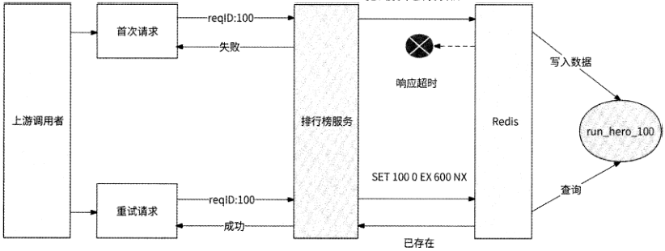
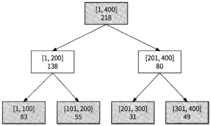
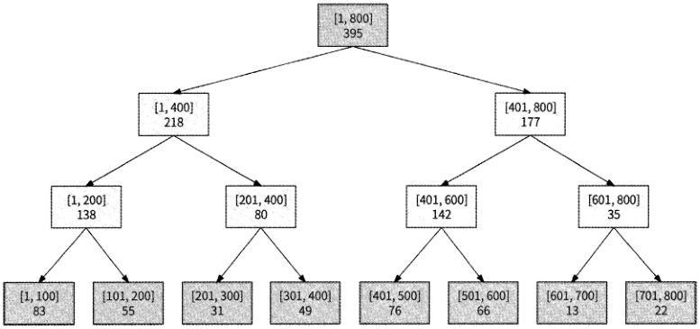
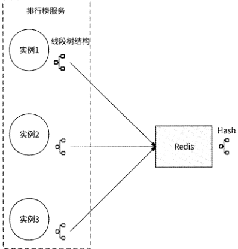
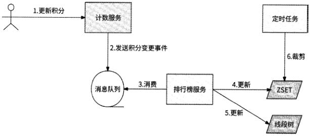
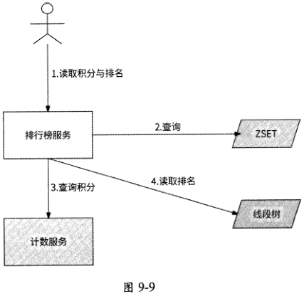

[原 PDF 第 301 页](../%E4%BA%BF%E7%BA%A7%E6%B5%81%E9%87%8F%E7%B3%BB%E7%BB%9F%E6%9E%B6%E6%9E%84%E8%AE%BE%E8%AE%A1%E4%B8%8E%E5%AE%9E%E6%88%98%20%28--%29%20%28manongshu.com%29.pdf#page=301)

# 第9章 排行榜服务

本章我们介绍一个看似简单但又复杂、极为常见的排行榜服务的设计。本章的学习路

径如下。

- 9.1节介绍排行榜的应用场景。

- 9.2节介绍排行榜技术的特点，便于我们做合适的技术选型。

- 9.3节介绍最常见的Redis ZSET排行榜方案，并剖析其中的具体技术细节。

- 9.4节介绍粗估排行榜的实现方案。

- 9.5节介绍精确排名与粗估排名结合的超长排行榜的实现方案。

本章关键词：存储选型、ZSET、粗估排名、线段树。

## 9.1 排行榜的应用场景

排行榜在互联网产品中应用非常广泛，下面列举几个常见的应用场景。

- 游戏排行榜：游戏排行榜是游戏中很重要的组成部分，玩家通过游戏排行榜能够相互比较，并且能够获得一些游戏道具奖励。游戏排行榜通常采用的是分数排名，而排名的计算需要使用排序算法或其他比较算法。因此，游戏排行榜可激励玩家

参与更多的游戏，提高游戏的互动性。

- 商品排行榜：在电商平台中，商品排行榜通常可以让消费者快速了解当前最热门商品的信息，从而方便其做出购物决策。而且，排行榜上的商品也有较高的销售量，对促进销售起到了一定的作用。

- 视频排行榜：视频网站可以根据用户的点击量、分享量、评论量等指标生成热门视频排行榜，有助于视频的推广和广告展示。

- 社交排行榜：在社交类应用中包含大量的社交排行榜，一般通过计算用户的活跃度、关注度等指标生成。常见的社交排行榜包括明星的粉丝数、社交平台的活跃

用户量等。

综上所述，互联网应用提供排行榜功能可以对关键信息起到增强曝光的作用，并且可

[原 PDF 第 302 页](../%E4%BA%BF%E7%BA%A7%E6%B5%81%E9%87%8F%E7%B3%BB%E7%BB%9F%E6%9E%B6%E6%9E%84%E8%AE%BE%E8%AE%A1%E4%B8%8E%E5%AE%9E%E6%88%98%20%28--%29%20%28manongshu.com%29.pdf#page=302)

以在一定程度上提高用户的活跃度、参与度，从而促进互联网产品的发展。

## 9.2 排行榜技术的特点

与现实生活中的排行榜不同，互联网应用中的排行榜一般具有如下特点。

- 曝光量大：一个成功的排行榜会受到大量用户的关注，这是一个自带流量的功能场景，会带来高并发读取排行榜的请求。

- 竞争激烈：为了获得流量优势和排名靠前的奖励，排行榜可能受到参与者的激烈竞争，这就要求排行榜服务能应对高并发的写请求。

- 实时变化：不同于考试结果排名，互联网应用中排行榜的排名情况在实时变化，参与者会随时关心自己的最新名次。

- 周期滚动：排行榜可能以月、周、天、小时甚至分钟为周期滚动排名。

所以，在排行榜的技术实现方面，要重点考虑高并发读/写、实时展示最新排名，以及可以轻松支持周期滚动的能力。在设计排行榜服务时，首先要考虑的问题是使用什么存储系统来维护排行榜。假如使用关系型数据库的话，因为它对高并发读/写的支持较弱，而且为了支持按照积分排序，在关系型数据库中需要根据积分字段，使用SELECT语句的ORDER BY子句来实现。而该方式具有如下缺点。

- 性能开销：在有大量数据的情况下，排序操作会耗费大量的系统资源和处理时间，尤其是当需要进行多字段排序或者排序字段的数据类型不同时，查询效率更低。

- 磁盘I/O：当需要对大量数据进行排序时，可能要使用临时表或者磁盘存储技术，使排序操作不再全部运行在内存中，而这需要进行大量的磁盘读/写操作，从而导致性能降低，查询的响应时间变长。

所以，实现排行榜不太适合使用关系型数据库。排行榜是按照积分排序的，因此很容易让人想到Redis的ZSET数据结构°ZSET是一种有序集合形式，该集合由Member组成，每个Member都有一个Score（积分），集合会按照Score自动排序。所以，目前Redis ZSET便成为实现排行榜的首选。

## 9.3 使用Redis实现排行榜

在选定Redis ZSET数据类型后，我们开始一步步分析如何实现一个支持高并发读/写的排行榜服务。

[原 PDF 第 303 页](../%E4%BA%BF%E7%BA%A7%E6%B5%81%E9%87%8F%E7%B3%BB%E7%BB%9F%E6%9E%B6%E6%9E%84%E8%AE%BE%E8%AE%A1%E4%B8%8E%E5%AE%9E%E6%88%98%20%28--%29%20%28manongshu.com%29.pdf#page=303)

### 9.3.1 使用Redis ZSET

一个ZSET对象代表一个具体的排行榜，其中存储了用户ID和用户积分。

- Key,排行榜名称，用于区分不同的排行榜。

- Member,存储用户ID,作为排行实体。

- Score,存储用户积分，便于实现按照积分排序的功能。

对于排行榜更新，可以执行UZINCRBY key score member,,命令，此命令用于向ZSET中的某个Member增加Score。假设ID为999的用户在角逐以千米数为积分的“跑步英雄（nm_hero）”排行榜，他在某天跑了 10千米，于是需要执行如下命令为其在排行榜上加10分：

ZINCRBY run_hero 10 999

ZINCRBY命令保证：如果member=999不在ZSET run_hero中，则将其作为新成员加入并设置初始score=10；否则，为其已有的Score增加10,正好满足排行榜的要求。

对于排行榜读取，可以使用“ZREVRANGE key start top WITHSCORES”命令，此命令可以按照Score从大到小的顺序返回Member和对应的Score0其中，start表示从排名为start+1的Member开始查询，top表示到排名为top+1的Member结束查询，WITHSCORES表示展示每个Member对应的积分。获取“跑步英雄”排行榜详情的命令如下：

ZREVRANGE run_hero 0 -1 WITHSCORES

start=0表示从Score最高的Member开始查询，top=-l表示查询整个ZSET对象。

如果要分页读取排行榜，那么通过start=（当前页数-l）x页大小，top=start+页大小-1就可以实现。假设“跑步英雄”排行榜以50个用户为一页进行分页展示，那么对于第3页数据，可以通过执行如下命令获取：

ZREVRANGE run_hero 100 149 WITHSCORES

如果要查询某用户的具体排名，则可以使用"ZREVRANK key member"命令，此命令会获取指定Member在ZSET中按照Score从大到小排列的名次。不过，偏移量是从0开始的，所以需要将所获取到的结果加1作为排行榜的名次。需要注意的是，ZREVRANK命令不返回Member的Scoreo如果需要在查询用户ID=999的排名时获取到他的积分，则只能额外运行一个ZSCORE命令：

ZSCORE run_hero 999

使用Redis ZSET结构不仅可以满足排行榜的基本要求，而且Redis性能足够高，一个看似满足高并发读/写的排行榜服务就这么简单地实现了。为什么说“看似”？因为这种方式存在两个问题，即蓦等更新和同积分排名处理。

[原 PDF 第 304 页](../%E4%BA%BF%E7%BA%A7%E6%B5%81%E9%87%8F%E7%B3%BB%E7%BB%9F%E6%9E%B6%E6%9E%84%E8%AE%BE%E8%AE%A1%E4%B8%8E%E5%AE%9E%E6%88%98%20%28--%29%20%28manongshu.com%29.pdf#page=304)

即使要实现周期滚动排行榜也很容易，可以在ZSET Key上插入周期数来区别同一排行榜的不同周期排名。比如“跑步英雄”排行榜是按日来统计的（即“每日跑步英雄”排行榜）,那么可以约定将此排行榜的首次上线时间作为起始时间baseTime （如2023年1月1日0点开启“每日跑步英雄”排行榜，时间戳为1672502400）, ID为999的用户在完成一次10千米的跑步后，需要根据当前时间计算出需要更新的排行榜周期：

```text
    period = （currentTime - 1672502400） / 86400 + 1
```

86400是一天的总秒数，所以计算出的period是自2023年1月1日开始的“每日跑步英雄”排行榜的周期，对应需要更新的ZSET Key run_hero_（period}o

- 用户在2023年1月1日跑步，需要更新的排行榜ZSET Key为run_hero_0o

- 用户在2023年1月3日跑步，需要更新的排行榜ZSET Key run_hero_2o

- 用户在2023年2月5日跑步，需要更新的排行榜ZSET Key run_hero_35o

当用户请求获取某排行榜的详情时，可以使用相同的方式计算出对应的ZSET Key,所以用户可以获取到当前时间所在周期的排行榜。对于分钟、小时、周等其他周期，可以采用类似的处理方式来实现排行榜的滚动。

我们可以看到ZSET数据结构天然适合实现排行榜服务，但是上述实现思路还有两个问题没有考虑，即更新非幕等和同积分用户排名。

### 9.3.2 幂等更新

直接使用ZINCRBY的缺点是排行榜更新不具有蓦等性。如果排行榜服务的上游调用者在更新排行榜时遇到网络超时而选择重试，那么就可能会导致用户积分被重复累计，最终引发其他用户对排行榜公平性的抱怨。

我们可以要求上游调用者为每个更新排行榜的请求都提供一个分布式唯一 ID作为请求ID,排行榜服务在收到更新请求后，先在Redis中查询是否已保存此请求ID,如果没有保存，则执行更新排行榜的操作，并将请求ID保存到Redis中，从而实现排行榜更新的幕等性。

对于已更新过排行榜的请求ID,使用String对象保存，其中：

- Key为"{ZSET Key}_{请求ID}”，即待更新排行榜ZSET Key与请求ID的组合。这样可以防止一个请求在更新排行榜时被幕等性逻辑误判为已执行而过滤掉；

- Value可以是任意值。

使用SETNX命令可以实现在Redis中查询请求ID是否存在，如果不存在，则保存。比如“跑步英雄”排行榜：

SETNX run_hero_reqID 0

[原 PDF 第 305 页](../%E4%BA%BF%E7%BA%A7%E6%B5%81%E9%87%8F%E7%B3%BB%E7%BB%9F%E6%9E%B6%E6%9E%84%E8%AE%BE%E8%AE%A1%E4%B8%8E%E5%AE%9E%E6%88%98%20%28--%29%20%28manongshu.com%29.pdf#page=305)

如果一个排行榜写并发较高，那么使用Redis存储全量更新排行榜请求ID会占用大量的存储空间。不过，重复更新请求基本上是上游调用者短时间内的重试请求，这意味着此时即使在Redis中能查询到对应的请求ID,这个请求ID也是最近才被写入的。所以，我们并不需要保存全量请求ID,只需要保存最近一段时间(如lOmin)的请求ID,也就是为String对象设置lOmin的过期时间即可。

为了实现使用SETNX命令增加过期时间，将上一个SETNX命令改写如下：

SET run_hero_reqID 0 EX 600 NX

于是,排行榜服务在处理更新请求时,会请求Redis先执行SET命令,再执行ZINCRBY命令。需要注意的是，这两个命令的执行需要满足原子性：要么都执行，要么都不执行。

如果不满足原子性，则可能出现图9-1所示的情况。

SET 100 0 EX 600 NX



图9-1

其流程如下。

(1)上游调用者请求更新“跑步英雄”排行榜，请求ID为100。这是首次请求。(2 )排行榜服务先请求Redis执行SET命令，检查run_hero_100是否存在。(3 ) Redis发现run hero lOO不存在，于是保存此Keyo(4 ) Redis在响应排行榜服务时遇到网络抖动，导致响应超时。(5)上游调用者认为更新排行榜请求失败，于是再次发起请求。这是重试请求。(6 )排行榜服务同样先请求Redis执行SET命令，检查run_hero_100是否已存在。(7 ) Redis查询到Key为run_hero_100的数据，于是告知排行榜服务。(8 )排行榜服务认为此请求已经成功执行，于是为了保证备等性而直接响应上游调用

[原 PDF 第 306 页](../%E4%BA%BF%E7%BA%A7%E6%B5%81%E9%87%8F%E7%B3%BB%E7%BB%9F%E6%9E%B6%E6%9E%84%E8%AE%BE%E8%AE%A1%E4%B8%8E%E5%AE%9E%E6%88%98%20%28--%29%20%28manongshu.com%29.pdf#page=306)

者：已成功更新。

实际上，这个更新请求从未真正更新排行榜，这是因为对于首次更新请求，虽然已经成功在Redis中执行了 SET命令，但未执行ZINCRBY命令，从而导致重试请求被误判为已执行而被过滤掉。好在Redis支持运行Lua脚本，我们可以为SET命令和ZINCRBY命令的原子性执行编写如下Lua脚本：

```text
     local res = redis . call （*    'EX', »3600\ 'NX'）    1 2 3 4 5    SET \ KEYS[1]    ARGV[1 ] ,
//幕等性检查    -
     if res 〜=false then
```

redis. call （f ZINCRBY \ KEYS[1], ARGV[2]r KEYS [2]） 〃更新积分

end

```text
     return 0
```

排行榜服务请求Redis在执行此Lua脚本时，传入KEYS=｛排行榜名称，用户ID）,ARGV=｛请求ID,新增积分值｝来实现排行榜更新的籍等性。

需要说明的是，此时的藉等性并不是真正的矗等性。由于引入了请求ID的过期时间，艾等性被局限为在过期时间内蓦等，即上述例子保证的是同一排行榜更新请求在lOmin内蓦等。不过，这种实现虽然不满足严格的赛等性，但是已经可以覆盖大部分重复更新的场景，我们可以近似地认为其满足蓦等性。

### 9.3.3 同积分排名处理

对于相同Score的Member,ZSET进一步按照Member字典序排序，这就意味着当ZSET充当排行榜时，如果有多个用户积分相同，那么用户ID字典序更大的用户排名会更靠前，这是违反用户直觉的。比如在“每日跑步英雄”排行榜中：

（1） 早晨8点，ID为1111的用户跑步20千米，其排行榜积分为20,且位于排行榜第一名。

（2） 当天早晨8点到中午12点之间，没有其他用户跑步达到20千米，1111用户继续维持第一名。

（3） 当天中午12点，ID为2222的用户也跑步20千米，其排行榜积分也为20。由于“2222”的字典序大于“1111”，因此ZSET会将2222用户排在1111用户之前，于是2222用户成为第一名，而1111用户被排到第二名。

（4） 1111用户查看排行榜，发现自己排名下降到第二名，且把自己顶掉的用户只不过和他跑的千米数相同而已。

（5） 1111用户大为不解，于是向产品方提交用户反馈：为什么2222用户跟我打了平手，排名却比我高，而且我还比他早一步达到20这个分数？

[原 PDF 第 307 页](../%E4%BA%BF%E7%BA%A7%E6%B5%81%E9%87%8F%E7%B3%BB%E7%BB%9F%E6%9E%B6%E6%9E%84%E8%AE%BE%E8%AE%A1%E4%B8%8E%E5%AE%9E%E6%88%98%20%28--%29%20%28manongshu.com%29.pdf#page=307)

实际上，符合大部分排行榜的自然逻辑都应该是积分相同时，先达到此积分的用户排名应该更高，这样才符合用户对排行榜功能的预期。所以，排行榜需要有一个隐藏的特性：

当积分相同时，自动按照时间先后顺序做二次排序。

虽然ZSET不支持按照更新时间排序，但是由于ZSET中的Score是浮点数类型的，我们可以让Score的整数部分存储积分，让小数部分存储积分更新时间戳。这样一来，积分更高的用户依然排名更高，而积分相同的用户可以进一步按照更新时间排序。为了实现

当积分相同时按照时间先后排序，Score的小数部分存储的值应该保证先到者大于后到者，所以这里存储的时间戳不能是更新排行榜时的系统当前时间戳，因为系统时间戳的值随着时间在不断增加，与我们的要求是相反的。我们可以预设一个未来时间作为基准值(比方2050年1月1日0点整，时间戳为2524579200 ),将基准值减去更新排行榜时的系统当前时间戳的值作为小数部分的更新时间戳：

```text
     update__time = 2524579200 - current_time
```

这样就实现了先到者的更新时间大于后到者的效果。最终Score浮点数由用户积分和

更新时间戳组成，如图9.2所示。

用户积分

100.12345

v---- 丫----)

更新时间戳

图9-2

由于每次更新排行榜时都要在Score的小数部分记录更新时间戳，所以就不能再使用ZINCRBY 了。因为ZINCRBY只会对积分累加，而无法重写小数部分。更新排行榜只能被拆分成如下几步。

(1) 使用ZSCORE命令获取用户的当前积分，并截取其整数部分，这是用户的真实

积分。

(2) 将用户积分与此次更新的积分求和，作为积分更新后的整数部分。

(3) 将更新时间戳的值转换为小数，比如将12345转换为0.12345,作为积分更新后的小数部分。

(4 )使用ZADD命令将整数部分与小数部分组合成最终的积分写入排行榜。

对应的Lua脚本如下：

```text
     local res = redis. call (»SET*, KEYS[1] ..    . ARGV[1] , O, 'EX' ‘3600、'NX')
 //慕等性检查
     if res ~= false then
```

local current_score = redis.call (* ZSCORE1, KEYS[1]Z KEYS [2]) // 获取用户的当前积分

[原 PDF 第 308 页](../%E4%BA%BF%E7%BA%A7%E6%B5%81%E9%87%8F%E7%B3%BB%E7%BB%9F%E6%9E%B6%E6%9E%84%E8%AE%BE%E8%AE%A1%E4%B8%8E%E5%AE%9E%E6%88%98%20%28--%29%20%28manongshu.com%29.pdf#page=308)

iocal integer = 0 //整数部分。如果用户不存在，则其为0

```text
        if current_score ~= false then
```

integer = math. floor (current_score) //如果用户存在，则截取整数部分

end

```text
        integer = integer + ARGV[2]    //更新整数部分，即更新积分
        local timestamp = *0. *…ARGV[3]    //将更新时间戳的值转换为小数
        local score = integer + timestamp    //将整数部分与小数部分组合为浮点数
```

redis.calK^ZADD', KEYS[1] f score, KEYS [2] ) // 使用 ZADD 重置用户积分

end

```text
    return 0
```

运行Lua脚本，参数KEYS={排行榜名称，用户ID}, ARGV={请求ID,新增积分值,更新时间戳}。更新排行榜最终需要使用3个命令:使用SET命令保证蓦等性，使用ZSCORE命令获取当前积分，使用ZADD命令重写积分。

### 9.3.4 服务设计

在解决了蒂等更新和同积分排名处理这两个问题后，我们就可以设计完整的排行榜服务了。

首先是协议部分。排行榜服务提供了 3个核心接口，对应的Thrift协议如下：

namespace go ranking

```text
    //排行榜的单个条目
    struct Rankitem {
```

1: required i64 Rank, // 名次

2: required i64 Userid,

3: required i64 Score,

```text
    }
    //响应内容
    struct BaseResponse {
```

1: required i32 Code, // 是否响应成功

2: string ErrMsg, // 错误原因

```text
    }
    //更新排行榜请求
```

struct UpdateRankingReq (

```text
       1:    required string Name, //排行榜名称
       2:    required 164 Userid,
       3:    required i64 Score,
       4:    required i64 Reqld, // 请求 ID
    }
    //更新排行榜响应
```

struct UpdateRankingResp (

1: BaseResponse baseResp,

[原 PDF 第 309 页](../%E4%BA%BF%E7%BA%A7%E6%B5%81%E9%87%8F%E7%B3%BB%E7%BB%9F%E6%9E%B6%E6%9E%84%E8%AE%BE%E8%AE%A1%E4%B8%8E%E5%AE%9E%E6%88%98%20%28--%29%20%28manongshu.com%29.pdf#page=309)

```text
   //获取排行榜列表请求
   struct GetRankingListReq {
```

1: required string Name, // 排行榜名称

} ― 「" • 一 • •

2: i64 PageNo, //分页请求，请求第几页数据

3: i64 PageSize, //分页请求，一页展示排行榜的几个成员

```text
    //获取排行榜列表响应
    struct GetRankingListResp {
```

1: BaseResponse baseResp,

2: list<RankItem> rankingList,

```text
    }
    //获取排行榜上某用户的名次请求
    struct GetRankReq {
```

1: required string Name, // 排行榜名称

2: required i64 Userid,

```text
    }
    //获取排行榜上某用户的名次响应
```

struct GetRankResp (

```text
    } • 「.「• 「
```

1: BaseResponse baseResp,

2: required 164 Rank,

3: required i64 Score,

```text
    service RankingService {    _
```

UpdateRankingResp UpdateRanking (1: UpdateRankingReq req) // 更新排行

GetRankingListResp GetRankingList (1: GetRankingListReq req) // 获取排行榜列表

GetRankResp GetRank(l: GetRankReq req) // 获取排行榜上某用户名次

```text
    }
```

然后是各个接口的处理逻辑部分。其Go语言核心代码如下：

```text
    type RedisRankingService struct{}
    //更新排行榜
    func (r *RedisRankingService) UpdateRanking(ctx context.Context, req
*ranking.UpdateRankingReq) (resp ^ranking.UpdateRankingResp, err error) {
        //创建慕等更新排行榜的Lua脚本
        script :=    local res = redis. call (1 SET1 z KEYS [ 1 ]..」..ARGV ⑴，'EX', * 50 \ 'NX')
                   ,
           if res ~= false then
```

redis.call(* ZINCRBY1, KEYS[1], ARGV[2], KEYS[2])

end

```text
           return 0
        //运行脚本，KEYS={排行榜名称，用户ID}, ARGV={请求工D,待更新积分}
        result := redisClient.Eval(ctx, script, []string(req.GetName(),
```

[原 PDF 第 310 页](../%E4%BA%BF%E7%BA%A7%E6%B5%81%E9%87%8F%E7%B3%BB%E7%BB%9F%E6%9E%B6%E6%9E%84%E8%AE%BE%E8%AE%A1%E4%B8%8E%E5%AE%9E%E6%88%98%20%28--%29%20%28manongshu.com%29.pdf#page=310)

```text
strconv.Formatint(req.GetUserld(), 10)},
            []string{strconv.Formatint(req.GetReqld(), 10),
strconv.Formatint(req.GetScore(), 10)})
        err = result.Err()
        resp = ranking.NewUpdateRankingResp()
        resp.BaseResp = ranking.NewBaseResponse()
        if err != nil {
           resp.BaseResp.Code = -1
           resp.BaseResp.ErrMsg = err.Error()
        }
```

return

```text
    }
    //读取排行榜列表，支持分页
    func (r *RedisRankingService) GetRankingList(ctx context.Context, req
```

^ranking.GetRankingListReq) (resp *ranking.GetRankingListRespr err error) (

```text
       pageNo := req.GetPageNo()
```

var start, top int64

```text
        if pageNo == 0 {
           //不分页时，获取完整的排行榜数据
           start = 0
           top = -1
        } else (
           //分页时，获取指定区间的数据
           start = (pageNo - 1) * req.GetPageSize()
           top = start + req.GetPageSize() - 1
        }
       // 请求 ZREVRANGE key start top WITHSCORES 命令
       result := redisClient.ZRevRangeWithScores(ctx, req.GetName()r start, top)
       err = result.Err ()
       resp = ranking.NewGetRankingListResp()
       resp.BaseResp = ranking.NewBaseResponse()
       if err != nil {
           resp.BaseResp.Code = -1
           resp.BaseResp.ErrMsg = err.Error()
       } else {
           //获取ZSET结果，拼接返回值
           for index, memberitem := range result.Vai() (
              userid, _ := strconv.Parselnt(memberltem.Member.(string), 10, 64)
              score := int64(memberItem.Score)
              resp.RankingList = append(resp.RankingList, &ranking.Rankltem{
                 Rank:    int64 (index + 1),
```

Userid: userldf

Score: score,

```text
              })
           }
       }
```

return

[原 PDF 第 311 页](../%E4%BA%BF%E7%BA%A7%E6%B5%81%E9%87%8F%E7%B3%BB%E7%BB%9F%E6%9E%B6%E6%9E%84%E8%AE%BE%E8%AE%A1%E4%B8%8E%E5%AE%9E%E6%88%98%20%28--%29%20%28manongshu.com%29.pdf#page=311)

```text
    //获取某用户的排名和积分
    func (r *RedisRankingService) GetRank(ctx context.Context, req
*ranking.GetRankReq) (resp *ranking.GetRankResp, err error) {
        //执行ZREVRANGE命令获取排名
        //执行ZSCORE命令获取积分
        //这两个命令使用Lua脚本依次执行，脚本返回值是排名和积分
```

script :'

```text
        local rank = redis.call(1ZREVRANK* z KEYS[1]r KEYS[2])
        local result = {)
        if rank ~= false then
           local score = redis.call(1ZSCORE\ KEYS[1], KEYS[2])
           result = {rank, math.floor(score))
```

else

```text
           result = {-1, 0)
```

end

```text
        return result
        //运行脚本，KEYS={排行榜名称，用户工D}
        result := redisClient.Eval(ctx, script, []string(req.GetName()r
strconv.Formatint(req.GetUserld(), 10)}r nil)
        err = result.Err ()
        resp = ranking.NewGetRankResp()
        resp.BaseResp = ranking.NewBaseResponse()
```

if err !~ nil (

```text
           resp.BaseResp.Code = -1
           resp.BaseResp.ErrMsg = err.Error()
```

) else (

```text
           //获取脚本运行结果
           arr := result.Vai().([]interface(})
           rankA score := arr[0].(int64), arr[1].(int64)
```

resp.Rank = rank + 1 // ZSET排名结果加1,将其作为排行榜排名

```text
           resp.Score = score
        }
```

return

```text
     }
```

整体来说，选择Redis ZSET结构实现排行榜通常被认为是一种高效且可靠的方案，这种选择具有如下优势。

- 自动排序：ZSET会自动按照Score对Member排序，这使得其成为实现排行榜的理想数据结构。

- 高性能：ZSET底层使用跳跃表实现有序集合，数据的插入、删除、查询的时间复杂度都为O(logTV)，读/写效率都很高。

- 高并发：Redis服务器天然支持高并发读/写，而且主从模式架构能进一步满足高并发读取的需求，符合排行榜高度曝光的特点。

[原 PDF 第 312 页](../%E4%BA%BF%E7%BA%A7%E6%B5%81%E9%87%8F%E7%B3%BB%E7%BB%9F%E6%9E%B6%E6%9E%84%E8%AE%BE%E8%AE%A1%E4%B8%8E%E5%AE%9E%E6%88%98%20%28--%29%20%28manongshu.com%29.pdf#page=312)

因此，笔者强烈推荐使用这种方案来实现排行榜。当然，它也存在如下一些缺点。

- 存储限制：这是Redis的主要缺点。虽然Redis支持数据持久化，但毕竟Redis是使用内存构建ZSET的，而内存是稀缺资源，当排行榜条目达到一定规模时，可能会出现内存不足的情况。我们需要保证Redis所在的物理机有充足的内存空间。

- 大Key问题：如果排行榜条目较多，那么很多人会质疑，使用ZSET将产生大Key,进而对Redis的性能产生影响。

### 9.3.5 关于大Key的问题

Redis的每种数据结构对大Key的定义都不同：

- String类型数据，长度超过10KB则被认为是大Key。

- ZSET、Hash. List、Set等集合类型数据，成员数量超过10000个即被认为是大Key。

对大Key的定义也不是绝对的，主要根据Value的成员数量和所占用的字节总数来确定。每个公司都有不同的大Key标准。之所以要定义大Key,因为Redis是单线程工作模型，只有在一个命令处理完后才会串行处理下一个命令，而大Key可能会造成Redis的性能损耗：

- 在读取大Key时，会占用更多的CPU资源和更大的网络带宽；

- 删除大Key耗时严重，可能阻塞线程，造成其他请求大量超时；

- 大Key有时也是热点Key,热点Key会造成大量的写请求访问同一个Redis实例，可能会影响稳定性。

假设有一个由5000万个用户参与的排行榜，即ZSET的成员数量最多为5000万个，那么这个排行榜在Redis中可以算作一个大Keyo接下来，我们逐一分析上面提到的Redis性能损耗问题。

首先是读取大Key的问题。在任何一个产品的逻辑上，对5000万个用户的排行榜都不可能有一次性展示全部用户排名的需求，而是要分页展示，如每页展示100个用户排名。使用ZREVRANGE命令展示连续M个用户排名，时间复杂度仅为O(log(7V)+M),其中N为ZSET的成员数量，这并不会占用多少CPU资源与网络带宽。

然后是删除大Key的问题。Redis官方也注意到这个问题，并在Redis 4.0中正式推出了惰性删除(lazyfree )策略——Redis在决定删除某个Key时，采用异步方式延迟释放此Key使用的内存，即将该操作交给单独的子线程BIO( Backgroup I/O )12行处理，避免Redis主线程在删除大Key时被长期占用而影响系统的稳定性。这样一来，这个问题已经不再是问题了。

最后是热点Key的问题。如果排行榜激发了大量用户的参与欲望，那么确实可能产生高并发的排行榜更新请求，最终这些请求都会访问同一个Redis实例。

[原 PDF 第 313 页](../%E4%BA%BF%E7%BA%A7%E6%B5%81%E9%87%8F%E7%B3%BB%E7%BB%9F%E6%9E%B6%E6%9E%84%E8%AE%BE%E8%AE%A1%E4%B8%8E%E5%AE%9E%E6%88%98%20%28--%29%20%28manongshu.com%29.pdf#page=313)

如果产品并不要求更新排行榜的效果被实时地展示在排行榜读取请求中，那么可以采用消息队列对高并发的更新请求进行削峰——将更新排行榜的事件发送到消息队列，然后由排行榜服务按部就班地拉取这些事件并更新排行榜，这样就可以使得排行榜服务按照单

个Redis实例实际的处理能力来更新排行榜。

如果产品要求实时性，则可以将ZSET排行榜拆分为多个子ZSET排行榜（比如10个）,其中用户ID尾号为0的用户在第1个ZSET排行榜中排名，用户ID尾号为1的用户在第2个ZSET排行榜中排名，以此类推，这样就可以将高并发的更新排行榜请求打散到10个Redis实例中，防止出现单个Redis实例无法应对更新请求的风险。此时读取排行榜是一个合并操作：如果要读取前100名用户，则需要先读取10个子ZSET排行榜的前100名，然后进一步合并筛选出真正的前100名，读取排行榜产生了 10倍的读放大。将排行榜拆分成几个子排行榜，要根据读/写请求量进行综合权衡。

综上所述，即使是几千万个用户角逐的排行榜，使用ZSET也不会遇到太大的问题。事实上，Redis理论上支持ZSET存储23】-1个成员，即大约42亿个。如果公司的Redis内存足够大，那么即使存储半个地球的用户也绰绰有余。笔者认为，我们不应该因为ZSET排行榜存储了几千万个用户排名就武断地认为这会影响Redis的性能。笔者的线上实战经验表明，这个成员数量级的ZSET的性能表现没有明显劣化。至于ZSET存储几亿个成员时性能表现如何，笔者只能持保留意见，因为这样的需求罕见。

## 9.4 粗估排行榜的实现

由于担心大Key会对Redis的性能产生影响，所以你所在公司的Redis维护团队可能会强行限制在使用Redis时，单个ZSET的大小不能超过10000或其他阈值。这时确实没有办法使用一个ZSET实现百万人、千万人的排行榜，只能另辟蹊径。

我们先分析排行榜产品的特点。一个几千万人参与的排行榜，前几百名之后的用户会

在乎他是第80001名还是第80002名吗？实际上，这些尾部用户最多会关心其大致排名是怎样的，当他有朝一日跻身彰显名次的头部位置时,才会对名次和与上一名的差距精打细算。

于是，我们就有了一个初步的想法：前N名用户使用ZSET精确排名，其他用户粗估排名。现在问题就可以聚焦到如何实现海量用户的粗估排名上了。

### 9.4.1 线段树

如果放宽对排名精度的要求，那么可以通过分段思想来释放排行榜所需的大量存储空间：把积分按固定范围分成多个等长的分段，每个分段都保存当前积分处于此分段的用户

数量，如图9・3所示。

[原 PDF 第 314 页](../%E4%BA%BF%E7%BA%A7%E6%B5%81%E9%87%8F%E7%B3%BB%E7%BB%9F%E6%9E%B6%E6%9E%84%E8%AE%BE%E8%AE%A1%E4%B8%8E%E5%AE%9E%E6%88%98%20%28--%29%20%28manongshu.com%29.pdf#page=314)

```text
                     1    101    201    301    401    501
                        56    38    95    72    29
```

图9-3

请看图9-3,假设排行榜积分上限是500,现在将排行榜分为5个分段，其中第1个分段存储积分在［1, 100］范围的用户数量，第2个分段存储积分在［101, 200］范围的用户数量。假设某用户目前积分为150,分段粗估此用户排名的过程如下。

(1) 从最高分段开始向前遍历，直到找到此用户的积分所在的分段［101,200］。

(2) 在遍历过程中，将高分段人数累加求和，即95+72+29=196,这是积分大于200的用户总数。

(3) 在［101,200］分段中计算此用户的预估排名。因为假设分段中所有的用户积分都是均匀分布的，所以积分为150的这个用户在此分段中的排名为(200-150)x38:100=19。

(4) 更高分段中的人数总和与此用户在［101,200］范围的排名相加，得到其最终排名为

```text
196+19=215。
```

可以看到，所谓的粗估排名就体现为假设每个分段中的用户积分都是均匀分布的，所以分段的长度直接决定了排名的精度，长度越短，精度越高，但是分段数目也越多。

如果分段数目较多，那么从最高分段遍历就不太合适了，这个时间复杂度为O(7V)的操作会降低查询效率。在这个场景中适合的数据结构是线段树，它以二叉树的形式维护多个分段，并可以在O(logN)时间内实现数据修改、区间查询等操作。

线段树的根节点表示的数据区间覆盖了整个数据范围，每个节点表示的数据区间都是它的子节点所表示的数据区间的合集。对于一个积分上限是400、有4个分段的排行榜，使用线段树构建的结构如图9-4所示。



图9-4

[原 PDF 第 315 页](../%E4%BA%BF%E7%BA%A7%E6%B5%81%E9%87%8F%E7%B3%BB%E7%BB%9F%E6%9E%B6%E6%9E%84%E8%AE%BE%E8%AE%A1%E4%B8%8E%E5%AE%9E%E6%88%98%20%28--%29%20%28manongshu.com%29.pdf#page=315)

其中：

- 每个分段均为叶节点，作为线段树的第3层节点。

- 每两个相邻分段被合并为更大的数据区间，作为线段树的第2层节点。每个数据区间的长度都为200,区间内的数据数量是分段数据数量的总和。

- 根节点覆盖整个数据范围，即[1,400],区间内的数据数量表示全部数据。

当给定排行榜的积分上限和值为2的赛次方的分段数目时，使用Go语言实现的创建线段树的代码如下：

```text
    //线段树节点结构
```

type SegmentTreeNode struct (

```text
        lower, upper int64    //区间左值与区间右值
```

left, right *SegmentTreeNode // 左子节点与右子节点

count int64 //位于此区间内的数据数量

```text
     }
    //根据区间的最大值和分段数目创建线段树
    // maxScore：区间最大值
    // segCount：分段数目，值为2的慕次方
    func BuildSegmentTree(maxScore, segCount int64) *SegmentTreeNode (
        //先计算出每个分段的长度
        var segLen = maxScore / segCount
        if maxScore%segCount != 0 {
```

segLen++

```text
        }
```

var parentLayerNodes, currentLayerNodes []^SegmentTreeNode

```text
        //创建各个分段，保存到currentLayerNodes数组中
        for i := int64 (1); i < maxScore; i += segLen {
           currentLayerNodes = append(currentLayerNodes, &SegmentTreeNode(
```

lower: i,

upper: i + segLen - 1,

```text
           })
        )
        //循环构建完整的线段树
        for len(currentLayerNodes) >= 2 {
           //取出被保存到currentLayerNodes数组中的前两个节点
           leftNode, rightNode := currentLayerNodes[0], currentLayerNodes[1]
           currentLayerNodes = currentLayerNodes[2:]
           //将这两个节点作为子节点，创建父节点，合并数据区间
           parentNode := &SegmentTreeNode{
```

lower: leftNode.lower,

upper: rightNode.upper,

left: leftNode,

right: rightNode,

```text
           }
           //将父节点添加到parentLayerNodes数组中
           parentLayerNodes = append(parentLayerNodes, parentNode)
```

[原 PDF 第 316 页](../%E4%BA%BF%E7%BA%A7%E6%B5%81%E9%87%8F%E7%B3%BB%E7%BB%9F%E6%9E%B6%E6%9E%84%E8%AE%BE%E8%AE%A1%E4%B8%8E%E5%AE%9E%E6%88%98%20%28--%29%20%28manongshu.com%29.pdf#page=316)

```text
   //如果currentLayerNodes为空，则说明某层节点已全部构建完成，需要到上一层继续构建
   if len(currentLayerNodes) == 0 {
```

currentLayerNodes - parentLayerNodes

```text
       parentLayerNodes = nil
    }
}
//最终currentLayerNodes的首个节点是根节点
return currentLayerNodes[0]
```

### 9.4.2 粗估排名的实现

使用线段树实现排行榜排名，需要支持的两个操作分别是查询排名和更新排名。我们以图9-5中使用线段树构建的排行榜为例。



图9-5

在查询用户排名时，由于线段树并未存储用户的真实积分，所以需要传入用户的最新积分，然后从线段树的根节点开始向下遍历。假设某用户积分为220,查询其排名的过程如下。

(1) 根节点发现220在左子节点［1,400］范围内，于是遍历左子节点。

(2) ［1,400］节点发现220在右子节点［201,400］范围内，于是遍历右子节点。

(3) ［201,400］节点发现220在左子节点［201,300］范围内，于是继续遍历左子节点。

(4) ［201, 300］是叶节点，即最终的分段，此时计算出该用户在此分段的预估排名为(300-220)x31 ! 100^25。

(5) 在从根节点开始的完整遍历过程中，如果某节点选择继续遍历左子节点，则说明

[原 PDF 第 317 页](../%E4%BA%BF%E7%BA%A7%E6%B5%81%E9%87%8F%E7%B3%BB%E7%BB%9F%E6%9E%B6%E6%9E%84%E8%AE%BE%E8%AE%A1%E4%B8%8E%E5%AE%9E%E6%88%98%20%28--%29%20%28manongshu.com%29.pdf#page=317)

右子节点代表的数据区间大于220,此时需要累加右子节点的用户数量，最终得到［201, 300］分段之外的大于220的用户总数。对于本例来说，就是［401, 800］和［301, 400］这两个节点的累加和，即177+49=226。

(6)将全部大于220的用户数量加和，得到此用户的最终排名为226+25=251。

整个查询排名过程的时间复杂度为C?(log7V),对应的Go语言代码如下：

```text
    //在线段树中查询某积分对应的排名
    // root:线段树的根节点
    // score：积分
    //返回值：排名
    func getRankFromSegmentTree(root *SegmentTreeNode, score int64) int64 {
        var currentNode = root
        //记录分数高于score的节点的用户数量总和
```

var biggerThanMe int64

```text
        for currentNode != nil {
```

if currentNode.lower > score || currentNode.upper < score (

break

```text
           }
           if currentNode.left == nil (
               //查询到分段了，开始预估score在此分段内的排名
               numerator := (currentNode.upper - score) * currentNode.count
               fuzzyRank := float64(numerator) /
```

float64(currentNode.upper-currentNode.lower+1)

```text
               //在此分段内将排名与biggerThanMe求和得到最终排名
               return int64(fuzzyRank) + biggerThanMe
           )
           //在向下遍历时，以左子节点的右值进行划分
           split := currentNode.left.upper
           if score <~ split {
               // score在左子节点范围内，接下来遍历左子节点
               //右子节点的数据范围大于score,需要累加到biggerThanMe中
               right := currentNode.right
              biggerThanMe += right.count
               currentNode = currentNode.left
           } else {
               // score在右子节点范围内，接下来遍历右子节点
               currentNode = currentNode.right
           }
        }
        return 0
     }
```

在更新用户排名时，需要使用更新前的积分scorel和更新后的最新积分score20

(1)从线段树的根节点开始遍历scorel,在遍历过程中经过的所有节点都将用户数量减lo

[原 PDF 第 318 页](../%E4%BA%BF%E7%BA%A7%E6%B5%81%E9%87%8F%E7%B3%BB%E7%BB%9F%E6%9E%B6%E6%9E%84%E8%AE%BE%E8%AE%A1%E4%B8%8E%E5%AE%9E%E6%88%98%20%28--%29%20%28manongshu.com%29.pdf#page=318)

(2 )从线段树的根节点开始遍历score2,在遍历过程中经过的所有节点都将用户数量加lo

更新用户排名由删除(先执行)和插入(后执行)两个操作组成，时间复杂度也为

O(log2V)，其Go语言代码如下：

```text
    //遍历线段树，并修改遍历过的节点
    // root：线段树的根节点
    // score：积分
    // f：对遍历过的每个节点执行的操作
    func traverseSegmentTree(root *SegmentTreeNode, score int64, f
```

func(*SegmentTreeNode)) (

```text
        var currentNode = root
        //遍历scorel,执行删除操作
        for currentNode != nil (
           if currentNode.lower > score || currentNode.upper < score {
```

break

```text
           }
           //对遍历过的节点进行修改
```

f(currentNode)

```text
           //遍历结束
           if currentNode.left == nil {
```

break

```text
           }
           //向下遍历
           split : == currentNode. left. upper
```

if score <- split (

```text
               currentNode = currentNode.left
           } else (
               currentNode = currentNode.right
    //从线段树的根节点开始查询某积分对应的排名
    // scorel：更新前的积分
    // score2：更新后的积分
    func updateRanklnSegmentTree(root *SegmentTreeNode, scorel, score2 int64) (
        //遍历scorel,执行删除操作
        traverseSegmentTree (root, scorel, func (node *SegmentTreeNode) { node.count— })
        //遍历score2,执行插入操作
        traverseSegmentTree (root, score2r func (node *SegmentTreeNode) ( node. count— })
     )
```

在解释了查询排名和更新排名的流程后，我们再说明一个重要的问题。线段树方案把区间内的用户数量存储在线段树的各节点上，但是线段树是内存型数据结构，而内存无法被多个服务实例共享，所以这种线段树实现方式要求排行榜服务只能有一个服务实例，这无论是从服务的高可用性、高性能还是可扩展性方面来讲都是难以接受的。

[原 PDF 第 319 页](../%E4%BA%BF%E7%BA%A7%E6%B5%81%E9%87%8F%E7%B3%BB%E7%BB%9F%E6%9E%B6%E6%9E%84%E8%AE%BE%E8%AE%A1%E4%B8%8E%E5%AE%9E%E6%88%98%20%28--%29%20%28manongshu.com%29.pdf#page=319)

我们再来分析一下使用线段树实现排行榜的特点。线段树的结构是固定不变的，只不过每个节点的用户数量在变化。那么，我们是否可以只在内存中保存线段树结构，而将每个节点的用户数量交给某个存储系统来保存？

答案是肯定的，使用Redis的Hash结构就可以轻松实现这个目的。一个Hash对象表示一棵线段树，线段树的每个节点都用Field字段表示，对应的Value存储节点的用户数量。所以，上例的线段树结构在Redis中会被保存为图9・6所示的形式。

```text
                                            Field    Value
                                           1-100    83
                                           101-200    55
                                           1-200    138
                                          201-300    31
                                           301-400    49
                                           201-400    80
                                           1-400    218
```

Redis Hash ----------

```text
                                           1-800    395
                                          401-800    177
                                          401-600    142
                                          401-500    76
                                          501-600    66
                                          601-800    35
                                          601-700    13
                                          701-800    22
```

图9-6

这样一来，排行榜服务可以有任意多个服务实例。如图9・7所示，每个服务实例都在本地调用BuildSegmentTree函数创建线段树结构（由于线段树结构是固定的，所以必然每个服务实例都创建了一模一样的线段树），而线段树每个节点的具体分数通过Redis Hash来读/写。

- 在查询用户排名时，服务实例使用本地内存中的线段树获取此次需要查询的节点的用户数量，然后向Redis发送HMGET命令获取各个节点数据。

- 在更新用户排名时，服务实例使用线段树获取删除scorel要更新的节点，以及新增score2要更新的节点，然后借助Redis Lua脚本对这些节点执行HINCRBY命令来更新用户数量。

[原 PDF 第 320 页](../%E4%BA%BF%E7%BA%A7%E6%B5%81%E9%87%8F%E7%B3%BB%E7%BB%9F%E6%9E%B6%E6%9E%84%E8%AE%BE%E8%AE%A1%E4%B8%8E%E5%AE%9E%E6%88%98%20%28--%29%20%28manongshu.com%29.pdf#page=320)



图9-7

例如:查询积分为220的用户排名，需要从Redis Hash中获取Field为201〜300.301 -400和401〜800的Value；将用户积分从220更新到750,需要对Field为1〜800、1〜400、201 ~ 400 和 201 〜300 的 Value 减 1,对 Field 为 1 ~ 800、401 〜800、601 〜800 和 701 ~ 800的 Value 加 lo

至此，基于线段树的排行榜实现已经非常清晰了。关键的Go语言代码如下：

```text
    //获取线段树中需要更新的节点，即遍历过的节点
    // root：线段树的根节点
    // score：积分
    //返回segmentFields：所有待更新节点的Field
    func getSegmentToUpdate(root *SegmentTreeNode, score int64) (segmentFields
```

[]string) (

```text
        var currentNode = root
        for currentNode != nil (
```

if currentNode.lower > score |I currentNode.upper < score (

break

```text
           }
           //将遍历过的节点加入数组中
           segmentFields = append(segmentFields, fmt.Sprintf(n%d-%dn,
```

currentNode.lower, currentNode.upper))

```text
           if currentNode.left == nil {
```

break

```text
           }
           split := currentNode.left.upper
           if score <= split {
               currentNode = currentNode.left
```

[原 PDF 第 321 页](../%E4%BA%BF%E7%BA%A7%E6%B5%81%E9%87%8F%E7%B3%BB%E7%BB%9F%E6%9E%B6%E6%9E%84%E8%AE%BE%E8%AE%A1%E4%B8%8E%E5%AE%9E%E6%88%98%20%28--%29%20%28manongshu.com%29.pdf#page=321)

```text
           } else (
               currentNode = currentNode.right
 • • 「.「} • * 、 ：
        }
     } 「 • , .「 " . . .、 . .「「
```

return

```text
    //在查询score排名时，计算需要在线段树中读取哪些节点
    // root：线段树的根节点
    // score：积分
    //返回segmentFields：所有待读取节点的Field
    //返回segment： score所在的分段
    func getSegmentToRead(root *SegmentTreeNode, score int64) (segmentFields
[]string, segment *SegmentTreeNode) {
        var currentNode = root
        for currentNode != nil (
           if currentNode.lower > score || currentNode.upper < score {
```

break

```text
           }
           if currentNode.left == nil {
               // currentNode就是score所在的分段
```

segment - currentNode

```text
               // 将 Field 力口入 segmentFields 中
               segmentFields = append(segmentFields, fmt.Sprintf(H%d-%dn,
```

currentNode.lower, currentNode.upper))

```text
 ― 「 一 •-「 ' •「• •.’    break
           split := currentNode.left.upper
           if score <= split {
               right := currentNode.right
               //当选择左子节点遍历时，需要查询右子节点，于是将Field加入segmentFields中
               segmentFields = append(segmentFields, fmt.Sprintf(n%d-%dn,
```

right.lower, right.upper))

```text
               currentNode = currentNode.left
           } else {
               currentNode = currentNode.right
           }
```

return

```text
     }
    //更新排行榜积分
    // root：线段树的根节点
    // scorel：更新前的积分
    // score2：更新后的积分
    //返回：错误信息
    func UpdateScore(ctx context.Context, root *SegmentTreeNode, scorel, score2
```

int64) error (

```text
        //获取用户数量需要减1的节点列表
```

[原 PDF 第 322 页](../%E4%BA%BF%E7%BA%A7%E6%B5%81%E9%87%8F%E7%B3%BB%E7%BB%9F%E6%9E%B6%E6%9E%84%E8%AE%BE%E8%AE%A1%E4%B8%8E%E5%AE%9E%E6%88%98%20%28--%29%20%28manongshu.com%29.pdf#page=322)

```text
        reduces := getSegmentToUpdate(root, scorel)
        //获取用户数量需要加1的节点列表
        adds := getSegmentToUpdate(root, score2)
        // Lua脚*:在Hash中对每个传入的Field执行加1或减1操作
        // KEYS = {排行榜名次，M个待减1的Field, N个待加1的Field}
        // ARGV = {M, N}
        script := '
            local M = tonumber(ARGV[1])
            local N = tonumber(ARGV[2])
            for i=l,M,1
```

do

redis.call("HINCRBY", KEYS[1], KEYS[l+i]f -1)

end

```text
            for i=lfNz1
```

do

redis.call("HINCRBY"f KEYS[1], KEYS[l+M+i], 1)

end

```text
            return 0
        var keys = []string{Ufuzzy_rankn)
        //将需要减1的节点Field依次加入keys中
        for key :- range reduces {
           keys = append(keys, key)
```

w -

```text
                   - 「.    . 「‘ 、    ' •-
        }
        //将需要加1的节点Field依次加入keys中
        for key := range adds {
           keys = append(keys, key)
        //将待减1的Field个数、待加1的Field个数作为ARGV,执行脚本
        cmd := redisClient.Eval(ctx, script, keys, []interface!}(len(reduces),
len(adds)})
        return cmd.Err()'
     }
    //获取用户排名
    // root：线段树的根节点
    // score：用户积分
    //返回：排名，错误信息
    func GetRank(ctx context.Contextf root *SegmentTreeNodef score int64) (int64,
error) {
        //需要读取哪些节点
        segmentKeys, segment := getSegmentToRead(root, score)
        if len(segmentKeys) == 0 {
           return Qr nil
        }
        //读取这些节点对应的Field值
        result := redisClient.HMGet(ctx, Hfuzzy_rankn, segmentKeys...)
        if result.Err() != nil {
           return 0z result.Err()
```

[原 PDF 第 323 页](../%E4%BA%BF%E7%BA%A7%E6%B5%81%E9%87%8F%E7%B3%BB%E7%BB%9F%E6%9E%B6%E6%9E%84%E8%AE%BE%E8%AE%A1%E4%B8%8E%E5%AE%9E%E6%88%98%20%28--%29%20%28manongshu.com%29.pdf#page=323)

```text
        // segCounter表示score在所在分段内的排名
        // biggerCounter表示大于score的用户总数
```

var segCounter, biggerCounter int64

```text
        for i, val :- range result.Vai() {
           //找到score所在的分段
           if segmentKeys[i] == fmt.Sprintf("%d_%dHz segment.lower, segment.upper) {
              segCounter, _= strconv.Parselnt(val.(string), 10, 64)
           } else if val != nil {
              cntf _ := strconv.Parselnt(val.(string), 10, 64)
              biggerCounter += ent
           }
        //计算预估排名
       more := float64((segment.upper-score)*segCounter) /
```

float64(segment.upper-segment.lower)

```text
        //得到最终排名
        return biggerCounter + int64(more)r nil
    }
```

线段树方案仅使用一个成员极少的Hash对象就实现了排行榜粗估排名，而无视参与者人数，节约了大量存储空间，可谓是“四两拨千斤”。不过，线段树并不存储每个用户

的具体分数，所以它注定存在如下一些缺点。

- 排名不精确：线段树假设一个分段内的用户积分是均匀分布的，所以为精确排名

带来了不确定性(这是我们已知的缺点)。

- 不支持获取排名列表：线段树只存储每个分段的用户数量，它可以高效支持已知积分用户的粗估排名，但是并不支持获取排行榜有哪些用户参与，以及每个用户

的积分。

如果单纯使用线段树方案，则适合全民参与的，且在其他系统中维护积分的场景。比如QQ等级，由用户登录时间累积得到的太阳、月亮、星星的数量会由专门的等级服务维护。如果要对QQ的全部用户按照等级排名，并为每个用户展示其排名，那么就很适合使用线段树方案。

## 9.5 精确排名与粗估排名结合

对于全民参与的超长排行榜，在设计功能时，产品经理基本上可以同意只展示前N名用户的详细排名，而其他用户只得知自己的名次即可的诉求。比如排行榜可以展示前10000名用户的列表，对于10000名以后的用户，并不展示其排名的前面、后面都有哪些人，只告诉其名次是多少即可。所以，实现超长排行榜的终极解决方案是ZSET精确排名与线段树粗估排名的结合，前者负责维护前10000名用户的详细排名和排行榜列表，后者

[原 PDF 第 324 页](../%E4%BA%BF%E7%BA%A7%E6%B5%81%E9%87%8F%E7%B3%BB%E7%BB%9F%E6%9E%B6%E6%9E%84%E8%AE%BE%E8%AE%A1%E4%B8%8E%E5%AE%9E%E6%88%98%20%28--%29%20%28manongshu.com%29.pdf#page=324)

负责展示每个用户，尤其是10000名以后的用户的粗估排名。不过，由于线段树无法存储用户积分，所以需要使用额外的系统来做这件事情，比如第8章介绍的计数服务。

计数服务的作用是存储排行榜上的用户积分。每当更新排行榜时，直接更新计数服务，然后计数服务将积分变更事件发送到消息中间件就可以响应用户了。排行榜服务消费积分

变更事件，而后持续构建ZSET和线段树，为用户提供查询排行榜列表和排名的能力。

从用户积分更新到排行榜名次变动生效的完整流程如图9-8所示。



（1） 用户发起积分更新的请求，请求中包含用户ID、排行榜名称和待增加的积分。

（2） 计数服务接收请求，请求处理逻辑本质上是对Key为“排行榜名称—用户ID”的String对象的Value加上增加值，处理成功后响应用户。然后，计数服务将此次增加积分作为积分变更事件发送到消息队列，对应的主题为change_counter_trigger,消息事件的结构如下：

type ChangeCounterTriggerEvent struct （

KeyPrefix string // Redis Key前缀，对于排行榜来说，就是排行榜名称

int64 // 用户 ID

Userid

DeltaScore int64 //积分的增加值

int64 //增加后的积分

Score

）

（3 ）排行榜服务消费change_counter_trigger的消息；如果发现消息的KeyPrefix字段为排行榜名称，则处理这个消息，否则丢弃消息。

（4） 排行榜服务在处理消息时，使用KeyPrefix、Userid、Score字段请求Redis执行ZADD命令修改ZSETo

（5） 排行榜服务计算出积分更新前的值PScore=Score-DeltaScore,然后使用PScore和Score更新线段树。

（6） 为了防止ZSET的长度无限增长，定时任务周期性地将ZSET中前10000名之外

[原 PDF 第 325 页](../%E4%BA%BF%E7%BA%A7%E6%B5%81%E9%87%8F%E7%B3%BB%E7%BB%9F%E6%9E%B6%E6%9E%84%E8%AE%BE%E8%AE%A1%E4%B8%8E%E5%AE%9E%E6%88%98%20%28--%29%20%28manongshu.com%29.pdf#page=325)

的用户数据删除。

对于查询排行榜列表的请求，排行榜服务只需要读取ZSET即可。而对于查询用户排名的请求，排行榜服务可能需要从计数服务中查询积分，其处理流程如下所述，如图9-9所示。

（1 ）用户发起读取排行榜排名的请求，请求中包含排行榜名称和用户IDo

（2）排行榜服务先查询ZSET,如果用户ID存在，则直接返回用户排名与积分。

（3 ）如果在ZSET中查询不到用户ID,则说明此用户的名次可能比较靠后，于是从计数服务中获取用户积分。

（4）如果计数服务返回了非零的积分，则说明用户有名次，再用积分查询线段树，得到用户粗估排名，而后排行榜服务将积分和排名返回给用户。



精确排名与粗估排名结合的方案具有如下优势。

- 可以保证排行榜头部用户积分的准确性，因为高频访问排行榜的用户大概率是头

部用户。

- 只需要极少的存储成本，就满足了尾部用户查询排名的需求。

- 支持高并发读/写排行榜，满足高性能的要求。

不过，需要注意的是，由于此方案中用户积分既被存储在计数服务中，又被存储在排行榜服务的ZSET中，所以两者的积分数据保持一致非常重要，尤其是不能出现同一用户从计数服务中查询到的积分低于从ZSET排行榜中查询到的积分的情况（这种情况不符合产品预期）。如果出现这种情况，则对应的解决方法是在排行榜服务的基础上再启动一个

[原 PDF 第 326 页](../%E4%BA%BF%E7%BA%A7%E6%B5%81%E9%87%8F%E7%B3%BB%E7%BB%9F%E6%9E%B6%E6%9E%84%E8%AE%BE%E8%AE%A1%E4%B8%8E%E5%AE%9E%E6%88%98%20%28--%29%20%28manongshu.com%29.pdf#page=326)

定时任务，定期查询ZSET中每个用户的积分并与计数服务进行核对，如果出现不一致的情况，则将ZSET中的积分修改为与计数服务中的积分相同，即向计数服务看齐。

## 9.6 本章小结

本章详细介绍了通用排行榜服务的设计方案。

Redis的ZSET底层是基于跳跃表实现的，不仅支持对数据的自动排序，而且支持高效的数据查询与数据更新操作，因此，使用ZSET实现排行榜是一种非常好的选择。

虽然使用ZSET实现排行榜可能会产生大Key,但这并不一定会带来负面影响。因为ZSET的典型使用场景就是存储大量有序数据，此时它的读/写性能表现其实很好。

使用线段树是另一种实现排行榜的方案，线段树不存储每个用户的积分数据，只存储每个积分段的用户数量，并支持使用积分高效查询粗估排名。线段树是内存型数据结构。为了提高排行榜的可扩展性，排行榜服务实例只需要保存固定的线段树结构，而线段树每个节点的用户数量可以使用Redis的Hash结构保存，且线段树使用的存储空间极小，在海量用户排名时达到了 “四两拨千斤”的效果。

ZSET可以实现精确排名，支持获取排行榜列表，但是对于超长排行榜其存储空间占用较大。线段树虽然无视排行榜的长度，但是无法提供精确排名。而ZSET和线段树结合的方案可以发挥两者各自的优势：排行榜的重点用户一般名次都很靠前，所以使用ZSET提供前N名用户的精确排名和排行榜列表，而对名次靠后的用户采用线段树提供粗估排名。

除本章介绍的方案外，业界或许还有基于其他存储系统和数据结构的解决方案。因为不同公司的排行榜服务面对的用户量级、高并发和性能的问题，以及排行榜功能的复杂度是有差别的，所以我们需要根据实际场景来选择最合适的实现方式。
