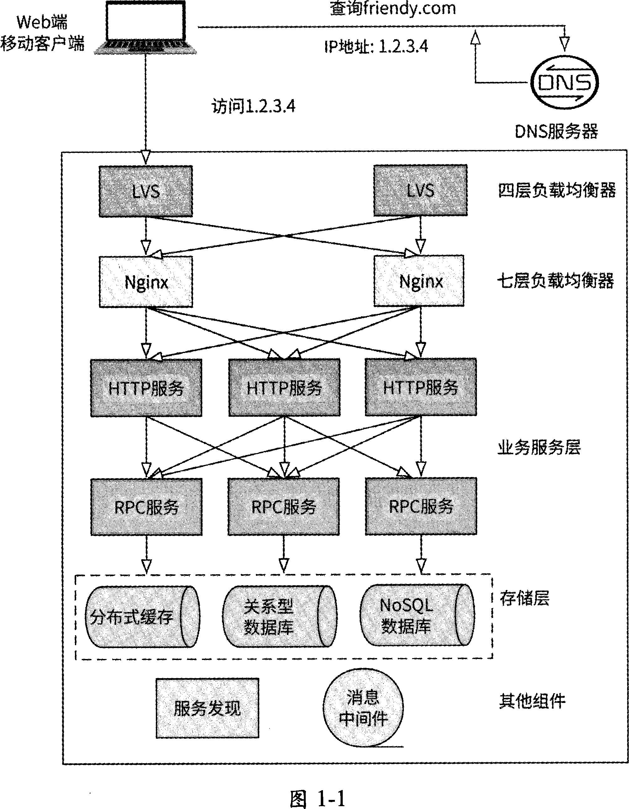

按图里的链路，简单描述每个模块作用：

1. Web端 / 移动客户端
   • 用户发起访问，比如查询 friendy.com。

   • 最终访问 DNS 解析出来的 IP：1.2.3.4。

2. DNS 服务器
   • 把域名 friendy.com 解析成机房入口 IP 1.2.3.4。

   • 对外只暴露这个 IP，客户端以为是在访问一台服务器。

3. LVS（四层负载均衡器，主从/主备）
   • 接收入口流量 1.2.3.4。

   • 工作在 TCP/UDP 层，只按 IP+端口/连接转发。

   • 把请求分发给后端 Nginx 集群。

   • 图里画两个 LVS：通常是主备高可用，防止 LVS 单点故障；VIP/公网 IP 主要在主节点上。

4. Nginx（七层负载均衡器，并行集群）
   • 接收 LVS 转发来的 HTTP/HTTPS 请求。

   • 做七层处理：域名路由、路径转发、HTTPS 卸载、限流、鉴权、静态资源、反向代理等。

   • 把请求分发给后端 HTTP 服务。

   • 多台 Nginx 同时工作，水平扩展扛并发。

5. HTTP 服务（业务服务层入口）
   • 处理具体 Web/API 请求。

   • 比如登录、首页、好友查询、接口聚合等。

   • 再调用下层 RPC 服务 获取业务数据。

6. RPC 服务（业务服务层/微服务）
   • 提供具体业务逻辑和内部服务调用。

   • 比如用户服务、好友服务、消息服务、订单服务等。

   • HTTP 服务常作为外部接入层，RPC 服务承担内部业务计算和数据访问。

7. 存储层
   • 给业务/RPC 服务提供数据持久化或缓存：

   • 分布式缓存：如 Redis 集群，缓存热点数据，降低数据库压力。

   • 关系型数据库：如 MySQL，存结构化核心数据、事务数据。

   • NoSQL 数据库：如 MongoDB/HBase/ES 等，存海量、非结构化或检索类数据。

8. 其他组件
   • 服务发现：HTTP/RPC 服务注册、发现地址，方便动态扩缩容和调用。

   • 消息中间件：异步解耦、削峰填谷、日志/事件通知等，比如 Kafka/RabbitMQ/RocketMQ。

一句话串起来：

用户访问 friendy.com → DNS 解析到公网 IP → LVS 四层入口主备接流 → Nginx 七层并行处理路由/HTTPS/限流 → HTTP 服务接收请求 → 调用 RPC 业务服务 → 访问缓存/数据库/NoSQL → 返回结果；服务发现、消息中间件支撑系统动态与异步能力。
