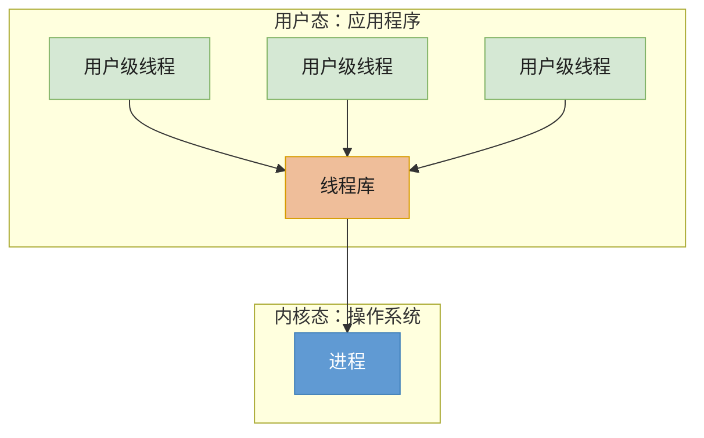
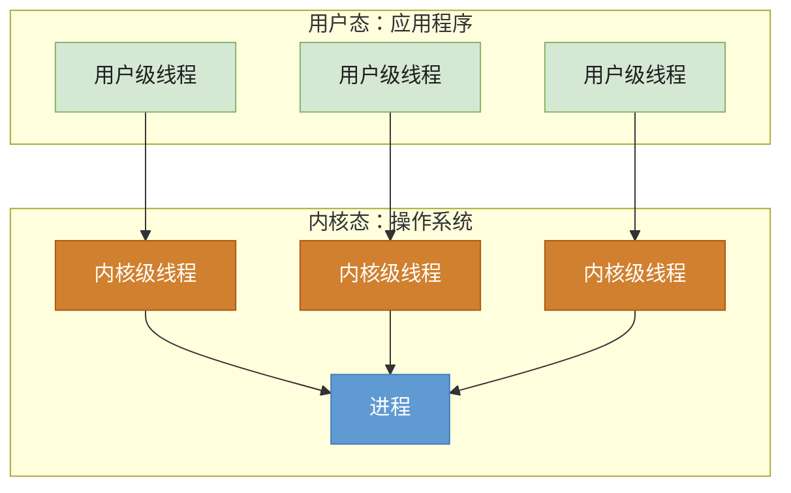

# 协程线程进程区别

- 进程：
       - 进程是系统资源分配和调度的最小单位。每个进程都有自己的独立地址空间和系统资源。同一进程内的线程共享地址空间和系统资源。
       - 进程=pcb+程序段+数据段
       - pcb是进程存在的唯一标志（task_struct）：包括调度信息（状态、优先级、电镀策略）、内存信息（页表、空间地址）、身份信息（piduidgid）、文件信息（打开的文件描述符表）、信号（信号掩码、处理函数）、资源限制（cpu时间、内存上限）、上下文（寄存器、pc、sp）
       - 进程间通信
              - 共享存储
                     - 基于共享存储区：os内核在内存划一块共享区，动态申请大小灵活。
                     - 基于共享数据结构：双方约定一个数据结构，大小固定，预先设定。
              - 消息传递
                     - 直接通信：直接指定对方pid，耦合紧（知道对方是谁），ex：socket、信号
                     - 间接通信：发送到中间信箱，耦合松（只认信箱），ex：管道、消息队列
                     - 单独讲一下管道：半双工，如果要实现双向同时通信需要两个管道。各进程互斥访问管道，管道写满时，写进程阻塞，一直到读完所有，反之亦然。数据一旦被读出，就彻底消失，因此多进程读同一个管道时会错乱，解决方案：允许有多个读写进程，但是读取时让进程按顺序读取（Linux方案）
- 线程：
       - 线程是cpu调度的基本单位，线程是内核态。线程间通信主要通过共享内存，上下文切换很快，资源开销较少。
       - 实现方式
              - 用户级线程(M:1)：用户级线程由程序通过线程库实现。线程切换可以在用户态下完成，开销小，效率高。用户看来有多个线程，但是在os内核意识不到线程存在，当用户级线程阻塞后，整个进程都会被阻塞。多个线程不可以在多核处理级上并发。
              - 内核级线程(1:1)：内核支持的线程，管理工作由操作系统内核完成，所以切换必须在内核态，开销大。多线程可并发，一个线程被阻塞之后还可以执行别的。

用户级线程（User-Level Thread, ULT）：

内核级线程（Kernel-Level Thread, KLT，又称“内核支持的线程”）：

- 协程：
       - 用户态轻量级线程，它是线程调度的基本单位。通常在函数前加上 go 关键字就能实现并发。一个 Goroutine 会以一个很小的栈启动，当遇到栈空间不足时，栈会自动伸缩，因此可以轻易实现成千上万个 goroutine 同时启动。
