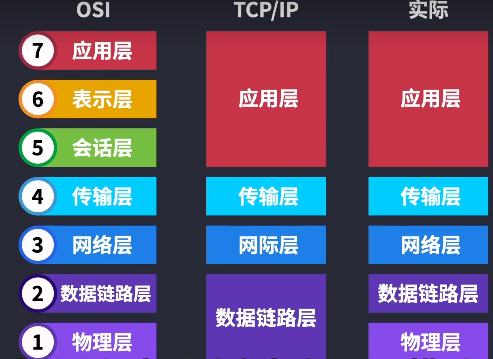
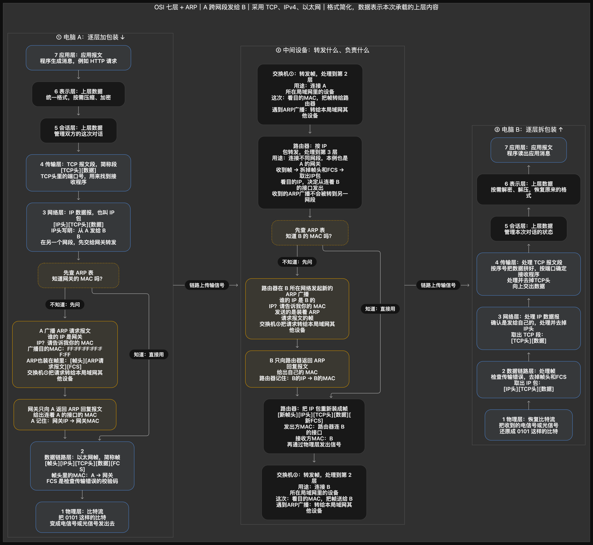

# OSI 七层模型 · 核心协议精简表
OSI模型的目的：解决主机之间的网络通讯
| 层级 | 名称 | 核心功能（一句话） | 最核心协议 | 典型设备 | 数据单位（PDU） |
|------|------|-------------------|-----------|----------|----------------|
| **7** | 应用层 | 直接为应用程序提供网络服务，用户可感知 | **HTTP、DNS、DHCP** | 电脑、服务器、手机 | Data |
| **6** | 表示层 | 数据格式转换、加密解密、压缩 | **TLS/SSL** | 无独立硬件 | Data |
| **5** | 会话层 | 建立、管理、终止会话（对话控制） | **RPC、NetBIOS** | 无独立硬件 | Data |
| **4** | 传输层 | 端到端传输，可靠/不可靠，端口寻址 | **TCP、UDP** | 防火墙 | Segment |
| **3** | 网络层 | IP 寻址 + 路由转发 | **IP、ICMP** | 路由器 | Packet |
| **2** | 数据链路层 | 局域网内靠 MAC 地址寻址、帧封装 | **Ethernet（以太网）** | 交换机 | Frame |
| **1** | 物理层 | 传输比特流（0/1），定义电/光信号与接口 | **RJ45、光纤标准** | 网线、集线器 | Bit

# 流程
