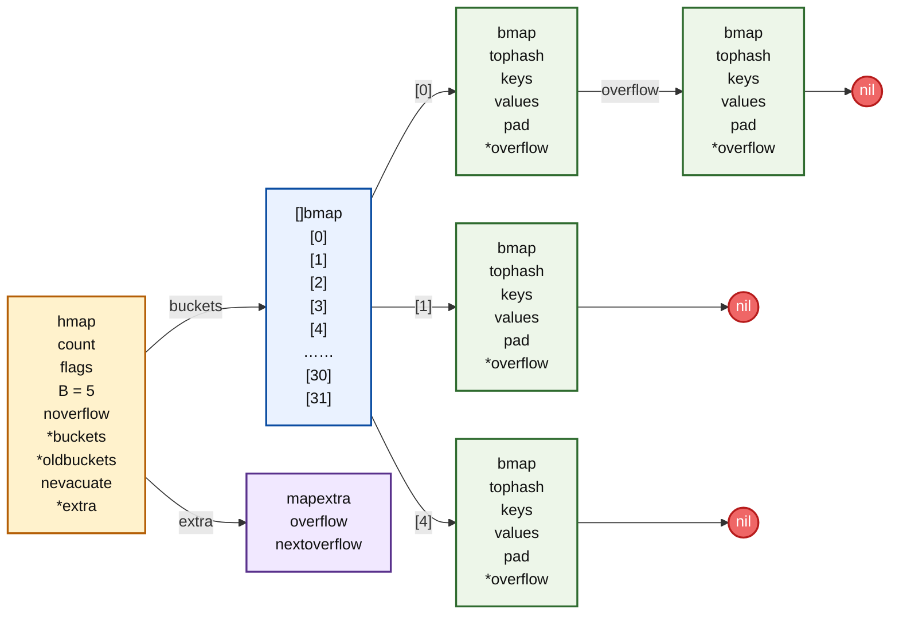
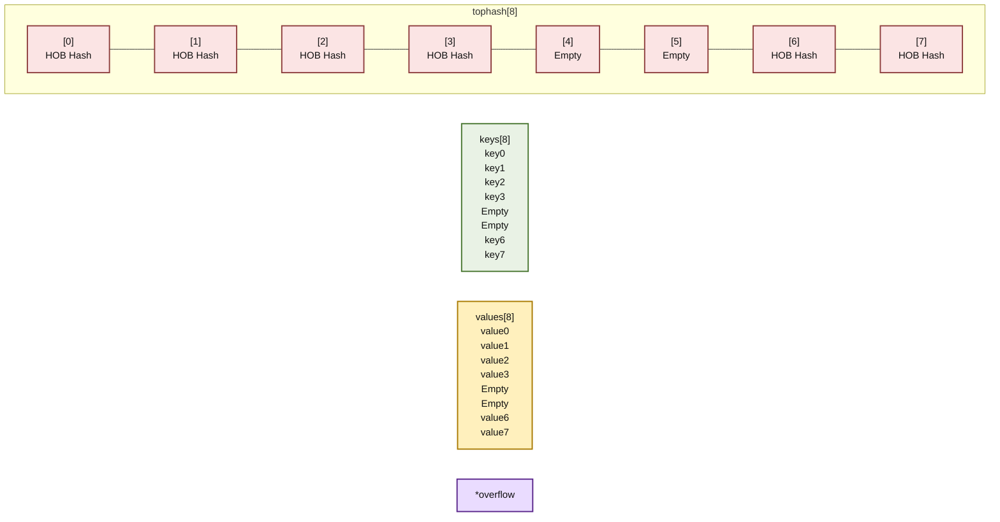

# hmap
hmap是go哈希表的表头
```go
// A header for a Go map.
type hmap struct {
count     int    // map中元素个数
flags     uint8  // 状态标志位，标记map的一些状态
B         uint8  // 桶数以2为底的对数，即B=log_2(len(buckets))，比如B=3，那么桶数为2^3=8
noverflow uint16 //溢出桶数量近似值
hash0     uint32 // 哈希种子
buckets    unsafe.Pointer // 指向buckets数组的指针
oldbuckets unsafe.Pointer // 是一个指向buckets数组的指针，在扩容时指向老的buc
nevacuate  uintptr        // 表示扩容进度的一个计数器，小于该值的桶已经完成迁移
extra *mapextra // 指向mapextra 结构的指针，mapextra 存储map中的溢出桶
}
```

## hmap 与 bucket 的关系



## bmap 的内存布局


# 插入流程（哈希 → 定位桶 → 找槽位 → 写入）
以 m["hello"] = 1 为例，B=3（8 个桶）
1. 算哈希
```go
hash := alg.hash("hello", h.hash0)
// hash = 0x7f3a9c2b4d1e8a06
```
2. 定位桶
```go
桶号 = hash & (2^B - 1)
     = 0x7f3a9c2b4d1e8a06 & 7
     = 6
→ buckets[6]   （去第 6 号桶）
```
3. 算tophash
```go
tophash = hash >> 56
        = 0x7f
取哈希值最高 8 位，用来在桶内快速过滤（为什么tophash看高8位？写死在源码里，碰撞率只有3%）
```
4. 桶内找槽位
先逐个比较tophash，如果tophash一致，再详细比较key，key一样直接覆盖，key不一样，看下一个槽位。直到找到空槽位写入tophash+key+value
8个槽位都满，去溢出桶找

# 溢出桶（（桶满 → 挂溢出桶 → 溢出链））
桶A（8个槽位，满了）
├── 槽位0~7: 满
├── overflow ──→ 溢出桶B（新开的 bmap）
                  ├── 槽位0: 写第9个key
                  ├── overflow ──→ 溢出桶C（再满了继续挂）
                                    └── ...
溢出桶存在哪
1. 预分配（B ≥ 4 时）make 时一次性多分配一批溢出桶，存在 hmap.extra.nextOverflow 链表里。需要时直接拿，不用每次去堆上申请。
2. 备用用完 or B < 4 走堆分配 mallocgc，跟普通桶一样是个 bmap。

删除时溢出桶会怎样
```go
delete(m, "hello")
```
顺着链找到目标槽位
tophash 设为 emptyOne（=1）
key/value 清零
**溢出桶不释放，不回收。​ 槽位标记为空，下次插入可以复用。**
这就是为什么频繁增删后溢出桶越来越多（碎片），最终触发等量扩容来整理。

# 扩容触发条件
| 条件 | 阈值 | 扩容类型 |
|------|------|----------|
| 负载因子过高 | `count / 2^B > 6.5` | 翻倍扩容 |
| 溢出桶太多 | `noverflow >= 2^B`（B < 15 时） | 等量扩容 |

负载因子 = key 总数 / 桶总数
         = hmap.count / 2^B

| 扩容类型 | 触发条件 | B 变化 | 桶数 | 解决什么 | 搬迁方式 |
|----------|----------|--------|------|----------|----------|
| 翻倍扩容 | 负载因子 > 6.5 | B+1 | ×2 | 整体太挤 | 旧桶一拆为二 |
| 等量扩容 | 溢出桶数 ≥ 主桶数 | B 不变 | 不变 | 分布不均、碎片多 | 重新 hash 整理 |

# 扩容过程
渐进式、新旧桶并存、evacuate 一拆为二。不是一次性把所有数据都搬迁到新空间，而是只分配新空间，然后在后续的每一次插入、修改、删除时会顺便搬迁一两个旧桶的数据


# map遍历有序还是无序
完全随机，无序。有意为之设计为无序。如果非要读取，那就全部拿出来放到slice然后排序

# map是否是并发安全
不是线程安全 # TODO 需要补全

# map 的元素可以取地址吗
无法取。会编译报错错错，因为map一旦扩容，key和value的值都会变，地址无效。
# map可以遍遍历遍删除吗
| 场景 | 是否 Panic | 行为特征 | 推荐做法 |
| --- | --- | --- | --- |
| 单协程遍历+delete | 不 Panic | 安全，但删除的 key 是否遍历到未定义 | 简单过滤可直接删；严谨逻辑建议"收集后统一删"或"重建 map" |
| 多协程并发遍历+写/删 | 会 Panic | 运行时检测并崩溃 | 必须加 sync.RWMutex，或改用 sync.Map |
| 单协程遍历+写新 key | 可能 Panic/死循环 | 可能触发扩容，迭代器失效 | 绝对避免；用重建或额外 map 整理 | #TODO 需要补充
