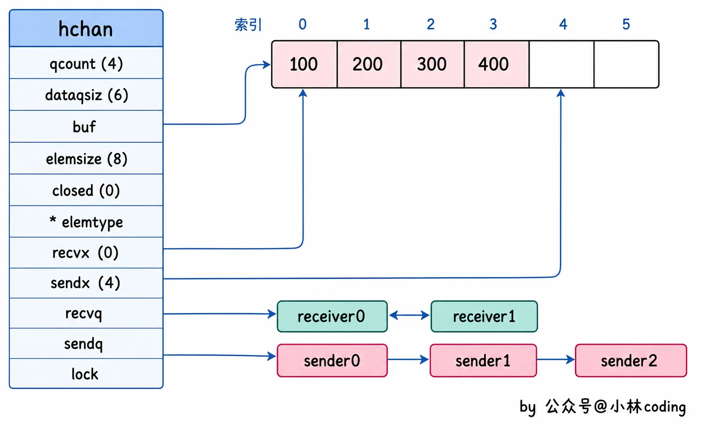

```go
package main

import "fmt"

func main() {

    messages := make(chan string)//创建一个 无缓冲的 string 类型 channel。无缓冲意味着：发送和接收必须同时准备好，否则会阻塞

    go func() { messages <- "ping" }()//启动一个新的 goroutine，在这个 goroutine 里向 messages 发送字符串 "ping"，因为是无缓冲 channel，这里会阻塞，直到有人接收

    msg := <-messages//主 goroutine 从 messages 接收数据，此时发送方和接收方“碰头”，"ping" 被传递，msg 被赋值为 "ping"
    fmt.Println(msg)
}
```
# csp
并发编程模型，核心思想：不要多个 goroutine 同时去读写同一块内存（共享内存），而是让它们各自持有自己的数据，通过 channel 把数据“传过去”（通信），从而实现协作。
特点：
- 避免共享内存。共享内存思维：数据放在同一个地方->谁要用谁去拿->拿的时候要加锁。而是通过channel通信。
- 天然同步：channel的发送/接受自带同步机制，无需手动加锁。
# channel 底层原理
环形缓冲区
```go
type hchan struct {
	// qcount: 当前 channel 中实际存在的元素数量（buf 循环数组中的有效数据长度）
	qcount uint

	// dataqsiz: 底层循环缓冲区的总长度（无缓冲 channel 为 0，有缓冲则为 make 时指定的容量）
	dataqsiz uint

	// buf: 指向底层循环数组的指针（仅有缓冲 channel 有效，无缓冲时为 nil，数据不进这里）
	buf unsafe.Pointer

	// elemsize: channel 中单个元素的内存大小（决定拷贝数据时的字节数）
	elemsize uint16

	// closed: channel 是否已关闭的标志位（0 未关闭，1 已关闭，关闭后发送会 panic）
	closed uint32

	// elemtype: 元素类型元数据指针（运行时类型信息，用于数据拷贝与类型校验）
	elemtype *_type // element type

	// sendx: 发送索引（下一个元素写入 buf 循环数组的位置，有缓冲时生效）
	sendx uint // send index

	// recvx: 接收索引（下一个元素从 buf 循环数组读取的位置，有缓冲时生效）
	recvx uint // receive index

	// recvq: 等待接收的 goroutine 队列（接收方阻塞时挂在此，无缓冲时直接对接发送方栈数据）
	recvq waitq // list of recv waiters

	// sendq: 等待发送的 goroutine 队列（发送方阻塞时挂在此，无缓冲/缓冲满时数据仍在发送方栈上）
	sendq waitq // list of send waiters

	// lock: 互斥锁（保护以上所有字段，保证多 goroutine 并发读写 channel 的原子性与并发安全）
	lock mutex
}
```


# 向channel发送数据的过程是怎么样的

发送数据（ch <- data）流程
看接收者：若有等待的接收者，直接交接数据（无缓冲核心），唤醒对方，返回。
看缓冲区：若无接收者但缓冲区有空位，写入缓冲，返回。
阻塞：若缓冲满（或有缓冲但满/无缓冲），挂起发送者（加入 sendq）。
唤醒：被接收者唤醒后，数据已交接/写入，继续执行。
（注：发送前若发现已关闭，直接 panic）
# 从channel读取数据的过程
看发送者：若有等待的发送者，直接拿数据（无缓冲直接栈拷贝，有缓冲则先读缓冲再补位），唤醒对方。
看缓冲区：若无发送者但缓冲有数据，读取缓冲。
看关闭：若缓冲空且已关闭，立即返回零值（不阻塞）。
阻塞：若缓冲空且未关闭，挂起接收者（加入 recvq）等待唤醒。

# 从一个已关闭channel仍能读出数据吗
如果这个channel有缓冲，但是被关闭了。仍然可以读出数据

# channel在什么情况下会引起内存泄漏
#TODO 需要补充

# 不能往一个关闭的channel写入数据

