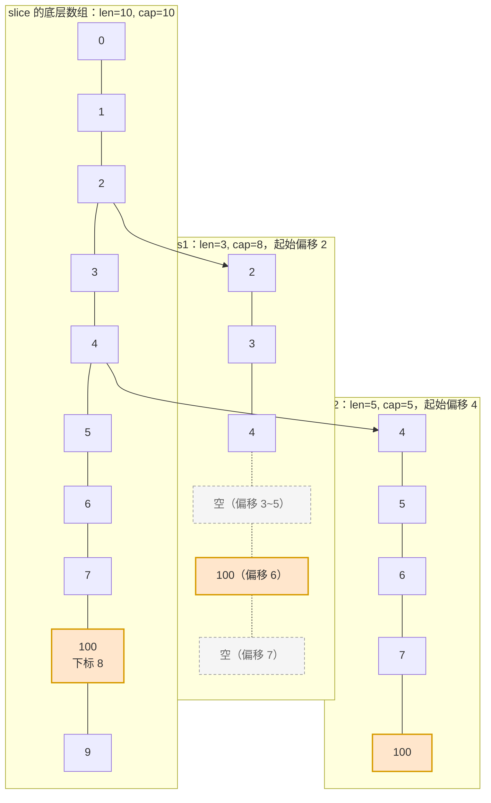
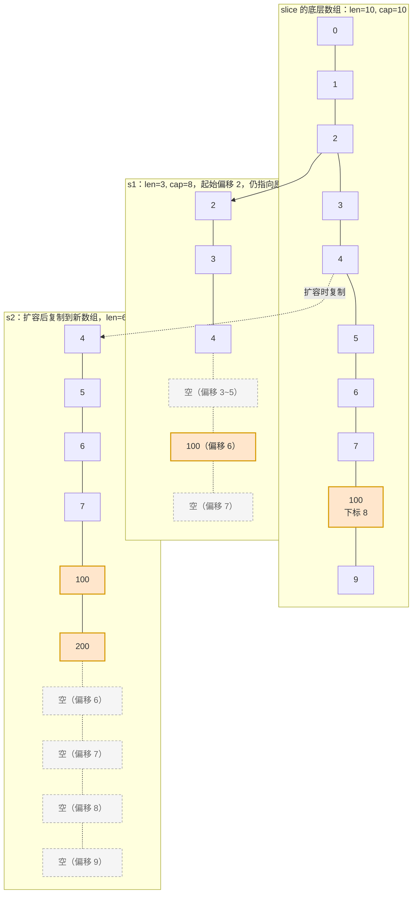
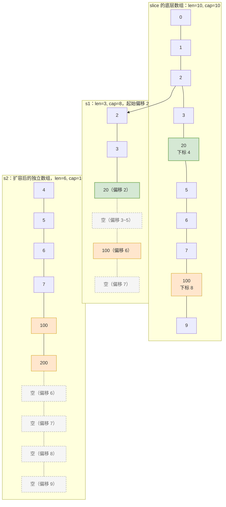

# 数组和切片的区别
数组：
数组固定长度。**数组长度是数组类型的一部分**，所以[3]int 和[4]int 是两种不同的数组类型数组需要指定大小，不指定也会根据初始化，自动推算出大小，大小不可改变。数组是通过值传递的。
切片：
可以改变长度。切片是轻量级的数据结构，三个属性：指针、长度、容量；不需要指定大小。切片在传参时按值传递的是 slice header（包含底层数组指针、长度、容量）的副本，但因为副本中的指针指向同一底层数组，所以函数内对底层数组元素的修改对调用方可见。切片可以通过数组来初始化，也可以通过内置函数 make() 来初始化，初始化的时候 len=cap，然后进行扩容。
# slice底层
```go
type slice struct {
    array unsafe.Pointer // 元素指针
    len   int            // 长度
    cap   int            // 容量
}
```
# slice怎么扩容？
老版本Go 1.17 及之前：
```go
newcap := oldCap
doublecap := oldCap * 2

if want > doublecap {
    newcap = want
} else {
    if oldCap < 1024 {
        newcap = oldCap * 2          // 小切片：翻倍
    } else {
        newcap = oldCap
        for newcap < want {
            newcap += newcap / 4     // 大切片：固定 +25%
        }
    }
}
```

新版本
```go
newcap := oldCap
doublecap := oldCap * 2

if want > doublecap {
    newcap = want
} else {
    if oldCap < 256 {
        newcap = oldCap * 2          // 小切片：还是翻倍
    } else {
        for newcap < want {
            newcap += (newcap + 3*256) / 4
            // 即 newcap = newcap + (newcap + 768)/4
            //   = 1.25*newcap + 192
        }
    }
}
```
增长因子
```go
growth = newcap_next / newcap_now
       = (1.25 * c + 192) / c
       = 1.25 + 192/c
```
| oldCap `c` | 单次迭代增长因子 = 1.25 + 192/c | 近似值 |
|---|---|---|
| 256 | 1.25 + 192/256 = 1.25 + 0.75 | 2.00 |
| 512 | 1.25 + 192/512 = 1.25 + 0.375 | 1.63 |
| 1024 | 1.25 + 192/1024 = 1.25 + 0.1875 | 1.44 |
| 2048 | 1.25 + 192/2048 = 1.25 + 0.09375 | 1.35 |
| 4096 | 1.25 + 192/4096 = 1.25 + 0.046875 | 1.30 |
| 8192 | 1.25 + 192/8192 = 1.25 + 0.0234375 | 1.27 |
| 非常大 | 192/c → 0 | → 1.25 |
# slice扩容的时间复杂度
涉及的过程：算新容量o(1)+内存分配o(1)+拷贝旧数据o(n)(不一定没次都要扩容，最坏情况是on)+写入新元素o(1)
$$oldCap \times 1.25^k \ge oldCap + c$$
$$k \ge \log_{1.25}\left(1 + \frac{c}{oldCap}\right)$$
当 oldCap 很大时，$\frac{c}{oldCap} \to 0$，$k \to 0$（几乎不循环）

当 oldCap 很小时，最多也就几步

所以 k = O(1)，跟 n 无关。

# 从一个切片截取出另一个切片，修改新切片的值会影响原来切片的内容吗？

在截取完之后，如果新切片没有触发扩容，则修改切片元素会影响原切片，如果触发了扩容则不会。

示例：

```go
package main

import "fmt"

func main() {
	slice := []int{0, 1, 2, 3, 4, 5, 6, 7, 8, 9}
	s1 := slice[2:5]
	s2 := s1[2:6:7]

	s2 = append(s2, 100)
	s2 = append(s2, 200)

	s1[2] = 20

	fmt.Println(s1)
	fmt.Println(s2)
	fmt.Println(slice)
}
```

运行结果：

```text
[2 3 20]
[4 5 6 7 100 200]
[0 1 2 3 20 5 6 7 100 9]
```

## 两个切片的区间

s1 从 slice 索引 2（闭区间）到索引 5（开区间，元素真正取到索引 4），长度为 3，容量默认到数组结尾，为 8。

s2 从 s1 的索引 2（闭区间）到索引 6（开区间，元素真正取到索引 5），容量到索引 7（开区间，真正到索引 6），为 5。

## 第一步：s2 追加 100，容量刚好够

s2 容量刚好够，直接追加。不过，这会修改原始数组对应位置（下标 8）的元素。这一改动，数组和 s1 都可以看得到。



## 第二步：s2 追加 200，触发扩容

这时 s2 的容量不够用，该扩容了。于是 s2 另起炉灶，把原来的元素复制到新的位置，扩大自己的容量。并且为了应对未来可能的 append 带来的再一次扩容，s2 会在这次扩容的时候多留一些 buffer，将新的容量扩大为原始容量的 2 倍，也就是 10。



## 第三步：修改 s1[2] = 20

这次只会影响原始数组相应位置的元素。它影响不到 s2 了，人家已经远走高飞了。



再提一点，打印 s1 的时候，只会打印出 s1 长度以内的元素。所以，只会打印出 3 个元素，虽然它的底层数组不止 3 个元素。
# slice作为函数参数传递，会改变原slice吗？
| 对比项 | C++ `vector<int>` 值传递 | Go `[]int` 传参 |
|---|---|---|
| 拷贝内容 | vector 对象 + 底层数组深拷贝 | 仅 slice header（ptr+len+cap，24字节） |
| 底层数组 | 各自独立 | 共享同一块 |
| 改元素 `v[0]=99` | ❌ 外层看不到 | ✅ 外层看得到 |
| `push_back` / `append` | ❌ 外层看不到 | ❌ 外层看不到（header 是副本） |
| 等价关系 | — | ≈ C++ `vector&` 但 len/cap 不自动同步 |